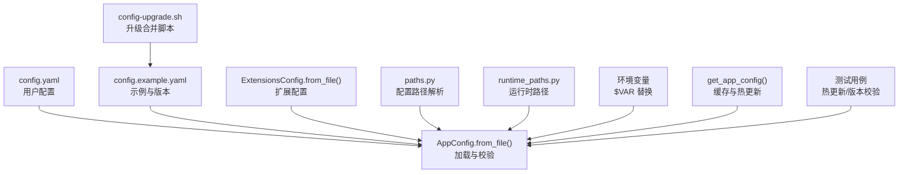
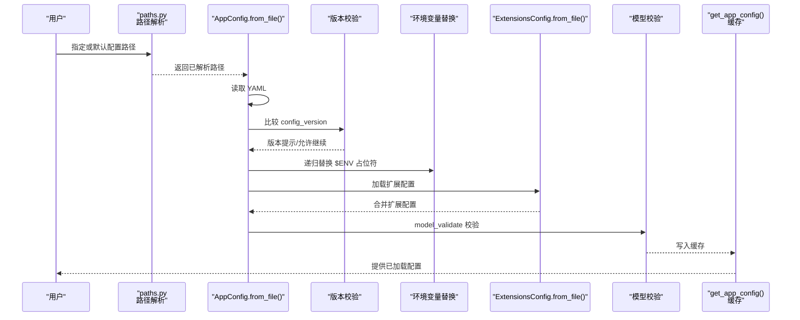
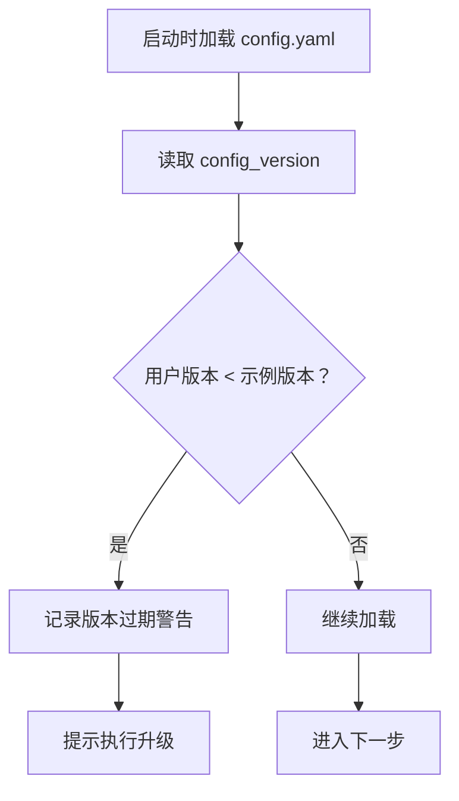
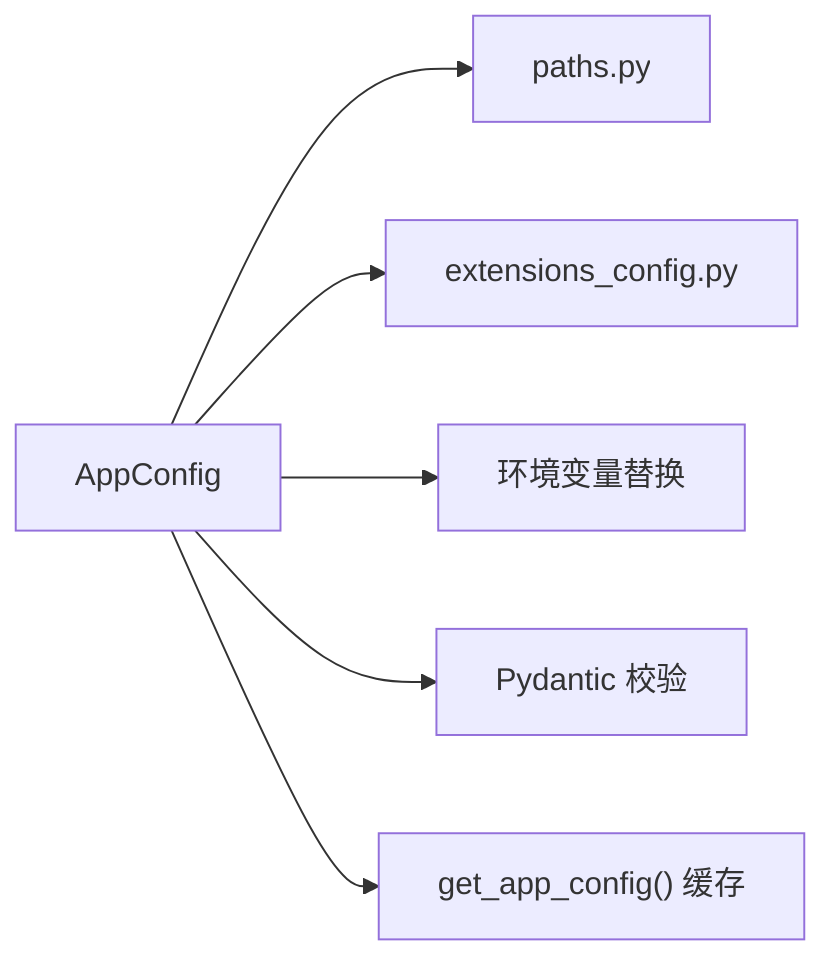

# 应用配置

<cite>
**本文引用的文件**
- [config.yaml](file://config.yaml)
- [config.example.yaml](file://config.example.yaml)
- [app_config.py](file://backend/packages/harness/deerflow/config/app_config.py)
- [paths.py](file://backend/packages/harness/deerflow/config/paths.py)
- [runtime_paths.py](file://backend/packages/harness/deerflow/config/runtime_paths.py)
- [extensions_config.py](file://backend/packages/harness/deerflow/config/extensions_config.py)
- [tool_output_config.py](file://backend/packages/harness/deerflow/config/tool_output_config.py)
- [loop_detection_config.py](file://backend/packages/harness/deerflow/config/loop_detection_config.py)
- [safety_finish_reason_config.py](file://backend/packages/harness/deerflow/config/safety_finish_reason_config.py)
- [tool_output_budget_middleware.py](file://backend/packages/harness/deerflow/agents/middlewares/tool_output_budget_middleware.py)
- [loop_detection_middleware.py](file://backend/packages/harness/deerflow/agents/middlewares/loop_detection_middleware.py)
- [safety_finish_reason_middleware.py](file://backend/packages/harness/deerflow/agents/middlewares/safety_finish_reason_middleware.py)
- [CLAUDE.md](file://backend/CLAUDE.md)
- [CONFIGURATION.md](file://backend/docs/CONFIGURATION.md)
- [config-upgrade.sh](file://scripts/config-upgrade.sh)
- [test_app_config_reload.py](file://backend/tests/test_app_config_reload.py)
- [test_config_version.py](file://backend/tests/test_config_version.py)
</cite>

## 更新摘要
**所做更改**
- 更新配置版本从11降级到8的说明
- 移除已弃用的tool_output、loop_detection和safety_finish_reason配置部分的描述
- 更新配置版本检查逻辑和示例文件版本号
- 更新相关中间件配置的引用说明

## 目录
1. [简介](#简介)
2. [项目结构](#项目结构)
3. [核心组件](#核心组件)
4. [架构总览](#架构总览)
5. [详细组件分析](#详细组件分析)
6. [依赖关系分析](#依赖关系分析)
7. [性能考量](#性能考量)
8. [故障排除指南](#故障排除指南)
9. [结论](#结论)
10. [附录](#附录)

## 简介
本文件面向 DeerFlow 应用的配置管理，系统性阐述 config.yaml 的结构、配置版本管理、配置优先级与环境变量替换机制、配置文件位置与加载顺序、验证与热更新策略、备份恢复与迁移升级流程，并提供最佳实践与常见问题排查建议。目标是帮助运维与开发人员在不同环境中稳定、安全地部署与维护 DeerFlow。

**重要更新**：配置版本已从11降级到8，移除了已弃用的tool_output、loop_detection和safety_finish_reason配置部分。

## 项目结构
DeerFlow 的配置体系由"主配置文件 + 扩展配置 + 运行时路径解析 + 版本校验 + 热更新缓存"构成，核心位于后端 harness 包中，前端与脚本通过约定的路径与命令参与配置生命周期管理。

**图表来源**
- [app_config.py:145-276](file://backend/packages/harness/deerflow/config/app_config.py#L145-L276)
- [paths.py](file://backend/packages/harness/deerflow/config/paths.py)
- [runtime_paths.py](file://backend/packages/harness/deerflow/config/runtime_paths.py)
- [extensions_config.py](file://backend/packages/harness/deerflow/config/extensions_config.py)

**章节来源**
- [CLAUDE.md:216-224](file://backend/CLAUDE.md#L216-L224)
- [CONFIGURATION.md](file://backend/docs/CONFIGURATION.md)

## 核心组件
- 主配置加载器：负责从 YAML 文件加载、版本校验、环境变量替换、默认值注入、扩展配置合并与模型校验。
- 路径解析器：提供配置文件定位与运行时目录解析能力。
- 扩展配置：独立于主配置的扩展模块配置，按需加载并注入到主配置树。
- 环境变量替换：递归扫描配置树，将形如 ${ENV} 或 $ENV 的占位符替换为环境变量值。
- 缓存与热更新：全局配置缓存，当检测到配置文件变更（路径或 mtime）自动刷新，避免重启服务。

**章节来源**
- [app_config.py:145-276](file://backend/packages/harness/deerflow/config/app_config.py#L145-L276)
- [paths.py](file://backend/packages/harness/deerflow/config/paths.py)
- [runtime_paths.py](file://backend/packages/harness/deerflow/config/runtime_paths.py)
- [extensions_config.py](file://backend/packages/harness/deerflow/config/extensions_config.py)

## 架构总览
下图展示从用户编辑 config.yaml 到应用读取生效的关键流程，包括版本检查、环境变量替换、扩展配置合并与缓存热更新。

**图表来源**
- [app_config.py:145-276](file://backend/packages/harness/deerflow/config/app_config.py#L145-L276)
- [paths.py](file://backend/packages/harness/deerflow/config/paths.py)
- [extensions_config.py](file://backend/packages/harness/deerflow/config/extensions_config.py)

## 详细组件分析

### 配置文件结构与作用域
- 主配置文件：config.yaml 放置于项目根目录，包含应用运行所需的核心参数（如数据库、模型、内存、沙箱等）。其字段与含义以 config.example.yaml 为准，后者还包含 config_version 字段用于版本管理。
- 示例配置：config.example.yaml 提供完整字段清单与当前版本号，作为升级与校验的基准。**重要**：当前版本已降级到8。
- 扩展配置：部分高级特性（如 MCP、渠道、安全策略等）可能独立于主配置，通过 ExtensionsConfig.from_file() 动态加载并注入到主配置树。

**章节来源**
- [config.yaml](file://config.yaml)
- [config.example.yaml](file://config.example.yaml)
- [extensions_config.py](file://backend/packages/harness/deerflow/config/extensions_config.py)

### 配置版本管理
- 版本字段：config.example.yaml 中的 config_version 用于标识配置 schema 的版本。**重要**：当前版本为8，而非之前的11。
- 启动检查：AppConfig.from_file() 在加载时比较用户配置版本与示例版本，若用户版本较低，输出警告并建议执行升级脚本。
- 升级流程：通过 make config-upgrade 或脚本 config-upgrade.sh 将示例中的新增字段合并到用户配置，保持兼容性。

**图表来源**
- [app_config.py:239-271](file://backend/packages/harness/deerflow/config/app_config.py#L239-L271)
- [config-upgrade.sh](file://scripts/config-upgrade.sh)

**章节来源**
- [app_config.py:239-271](file://backend/packages/harness/deerflow/config/app_config.py#L239-L271)
- [CLAUDE.md:216-224](file://backend/CLAUDE.md#L216-L224)

### 配置优先级机制
- 路径优先：优先使用显式传入的配置路径；否则根据路径解析规则查找 config.yaml。
- 环境变量优先：在 YAML 解析后进行环境变量替换，$ENV 形式的占位符会被进程环境覆盖。
- 扩展配置优先：扩展配置独立于主配置，但会在加载阶段被合并进主配置树，确保扩展项可被后续逻辑读取。

**章节来源**
- [app_config.py:145-176](file://backend/packages/harness/deerflow/config/app_config.py#L145-L176)
- [paths.py](file://backend/packages/harness/deerflow/config/paths.py)

### 环境变量替换系统
- 替换范围：对配置树进行递归扫描，识别形如 $ENV 或 ${ENV} 的占位符。
- 替换行为：使用 os.getenv 获取对应环境变量值；若未设置则保持原样（不报错），便于区分"未设置"和"空值"。
- 安全建议：敏感信息（如密钥）应通过环境变量注入，避免直接写入配置文件。

**章节来源**
- [app_config.py:273-276](file://backend/packages/harness/deerflow/config/app_config.py#L273-L276)

### 配置文件位置规范与加载顺序
- 默认位置：项目根目录下的 config.yaml。
- 解析顺序：
  1) 使用路径解析确定最终配置文件路径；
  2) 读取 YAML 并进行版本检查；
  3) 执行环境变量替换；
  4) 加载扩展配置并合并；
  5) 进行模型校验；
  6) 写入全局缓存。
- 运行时路径：runtime_paths.py 提供运行时目录解析，确保日志、持久化等路径在不同部署形态下一致。

**章节来源**
- [paths.py](file://backend/packages/harness/deerflow/config/paths.py)
- [runtime_paths.py](file://backend/packages/harness/deerflow/config/runtime_paths.py)
- [app_config.py:145-176](file://backend/packages/harness/deerflow/config/app_config.py#L145-L176)

### 验证机制
- 结构校验：使用 Pydantic 模型校验，确保字段类型与必填项符合预期。
- 版本校验：比较用户配置与示例配置的版本号，提示升级。
- 扩展校验：扩展配置独立校验，失败不影响主配置加载，但会阻止相关功能启用。

**章节来源**
- [app_config.py:175-177](file://backend/packages/harness/deerflow/config/app_config.py#L175-L177)
- [extensions_config.py](file://backend/packages/harness/deerflow/config/extensions_config.py)

### 配置热更新与缓存
- 缓存策略：get_app_config() 对已加载配置进行缓存，避免重复 IO。
- 触发刷新：当解析出的配置路径变化或文件 mtime 增大时，自动重新加载。
- 生效范围：Gateway 与 LangGraph 等子系统共享同一份已加载配置，修改 config.yaml 后无需重启进程即可生效。

**章节来源**
- [CLAUDE.md:216-224](file://backend/CLAUDE.md#L216-L224)
- [test_app_config_reload.py](file://backend/tests/test_app_config_reload.py)

### 备份、恢复与迁移升级
- 备份：在执行升级前，建议手动备份 config.yaml。
- 恢复：若升级后出现异常，可用备份回滚至上一个稳定版本。
- 迁移升级：
  - 使用 make config-upgrade 或脚本 config-upgrade.sh 自动合并新字段；
  - 升级后检查版本提示是否消失；
  - 运行相关测试用例验证配置加载与热更新行为。

**章节来源**
- [config-upgrade.sh](file://scripts/config-upgrade.sh)
- [test_config_version.py](file://backend/tests/test_config_version.py)

### 已弃用配置部分说明
**重要更新**：以下配置部分已被移除或降级：

#### Tool Output 配置（已降级）
- 原配置：tool_output 部分曾包含工具输出预算保护功能
- 当前状态：该配置部分已被移除，相关功能通过其他机制实现
- 影响：不再支持独立的工具输出预算配置

#### 循环检测配置（已降级）
- 原配置：loop_detection 部分曾包含循环检测中间件配置
- 当前状态：该配置部分已被移除，相关功能通过内置中间件实现
- 影响：循环检测功能仍可通过中间件机制使用，但不再支持独立配置

#### 安全终止原因配置（已降级）
- 原配置：safety_finish_reason 部分曾包含安全终止原因中间件配置
- 当前状态：该配置部分已被移除，相关功能通过内置中间件实现
- 影响：安全终止检测功能仍可通过中间件机制使用，但不再支持独立配置

**章节来源**
- [tool_output_config.py](file://backend/packages/harness/deerflow/config/tool_output_config.py)
- [loop_detection_config.py](file://backend/packages/harness/deerflow/config/loop_detection_config.py)
- [safety_finish_reason_config.py](file://backend/packages/harness/deerflow/config/safety_finish_reason_config.py)
- [tool_output_budget_middleware.py](file://backend/packages/harness/deerflow/agents/middlewares/tool_output_budget_middleware.py)
- [loop_detection_middleware.py](file://backend/packages/harness/deerflow/agents/middlewares/loop_detection_middleware.py)
- [safety_finish_reason_middleware.py](file://backend/packages/harness/deerflow/agents/middlewares/safety_finish_reason_middleware.py)

## 依赖关系分析
- 组件耦合：
  - AppConfig 依赖路径解析、扩展配置与环境变量处理；
  - 扩展配置独立于主配置，但需在加载阶段完成合并；
  - 全局缓存贯穿配置生命周期，降低 IO 开销。
- 外部依赖：
  - YAML 解析依赖 ruamel.yaml/yaml.safe_load；
  - 环境变量依赖 os.getenv；
  - 测试用例验证热更新与版本校验。

**图表来源**
- [app_config.py:145-176](file://backend/packages/harness/deerflow/config/app_config.py#L145-L176)
- [paths.py](file://backend/packages/harness/deerflow/config/paths.py)
- [extensions_config.py](file://backend/packages/harness/deerflow/config/extensions_config.py)

## 性能考量
- IO 优化：通过缓存减少频繁读取配置文件带来的 IO 压力。
- 递归替换成本：环境变量替换为递归遍历，建议控制配置树规模与嵌套层级。
- 并发访问：缓存为只读共享对象，读多写少场景下性能稳定；写入时注意线程安全（由全局缓存实现保障）。

## 故障排除指南
- 配置无法加载
  - 检查 config.yaml 是否位于项目根目录或通过路径解析能找到；
  - 确认 YAML 语法正确，缩进与键名无误。
- 版本过期告警
  - 运行 make config-upgrade 或脚本 config-upgrade.sh 合并新字段；
  - 重启服务使新字段生效。
- 环境变量未生效
  - 确认环境变量名称与配置中的占位符一致；
  - 检查进程是否继承了正确的环境变量。
- 热更新无效
  - 确认修改的是已解析到的配置文件路径；
  - 检查文件 mtime 是否更新（保存操作应触发）；
  - 查看相关测试用例验证热更新行为。
- **重要更新**：配置版本从11降级到8
  - 检查 config.yaml 中的 config_version 字段是否为8；
  - 如遇到配置项缺失，使用升级脚本合并新字段；
  - 确认已弃用的tool_output、loop_detection和safety_finish_reason配置部分已被移除。

**章节来源**
- [test_app_config_reload.py](file://backend/tests/test_app_config_reload.py)
- [test_config_version.py](file://backend/tests/test_config_version.py)

## 结论
DeerFlow 的配置系统以 config.yaml 为核心，结合版本管理、环境变量替换、扩展配置合并与缓存热更新，实现了高可用、易维护的配置生命周期管理。**重要更新**：配置版本已降级到8，移除了tool_output、loop_detection和safety_finish_reason等已弃用配置部分。遵循本文的最佳实践与排障建议，可在不同环境下稳定地部署与演进 DeerFlow。

## 附录
- 快速参考
  - 配置文件位置：项目根目录 config.yaml
  - 版本管理：config.example.yaml 中的 config_version（当前为8）
  - 环境变量：$ENV 或 ${ENV}
  - 升级命令：make config-upgrade 或 scripts/config-upgrade.sh
  - 热更新：修改配置后无需重启，自动刷新
  - **重要更新**：已弃用配置部分
    - tool_output：工具输出预算保护功能
    - loop_detection：循环检测中间件配置
    - safety_finish_reason：安全终止原因中间件配置