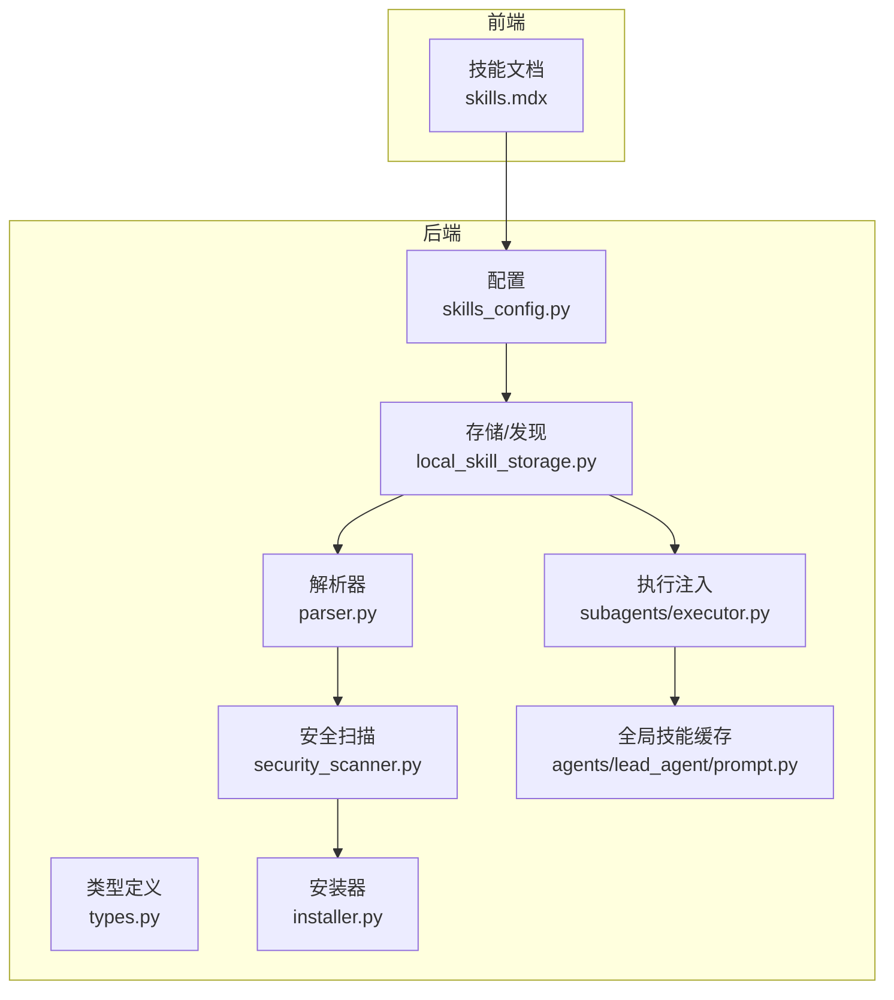
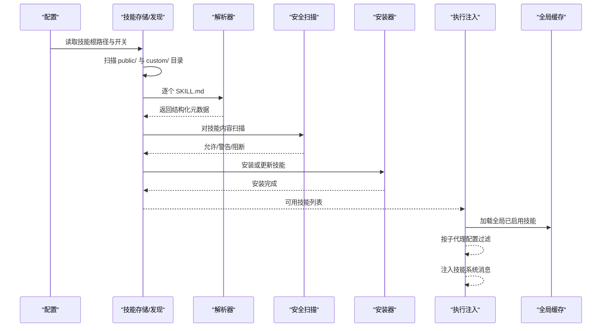
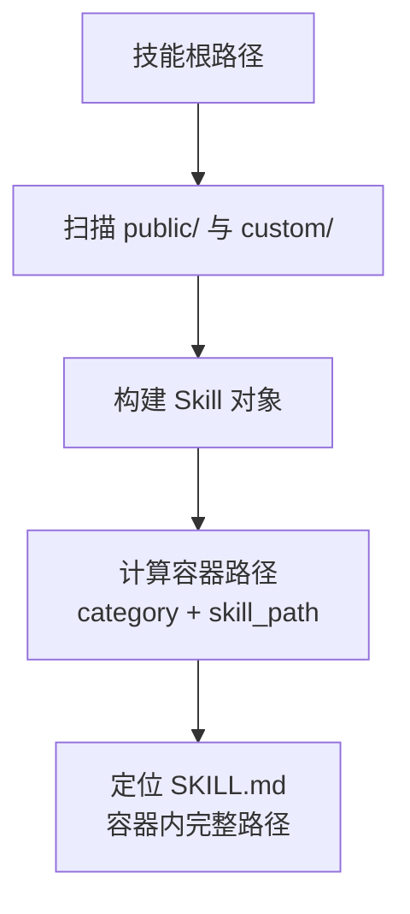
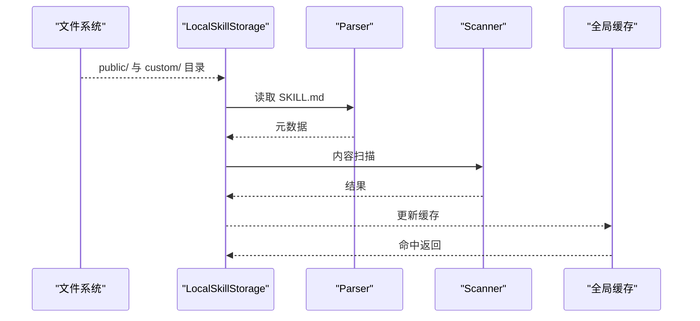
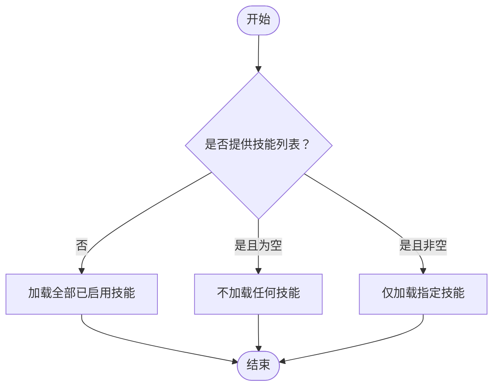
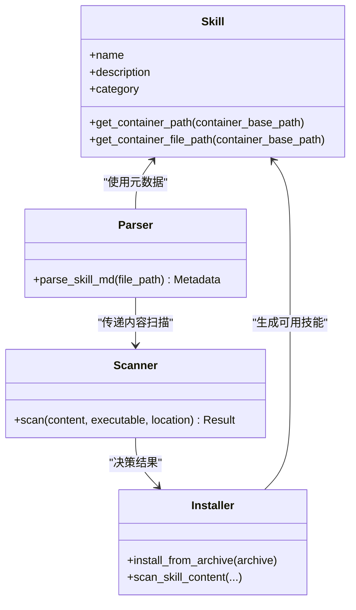
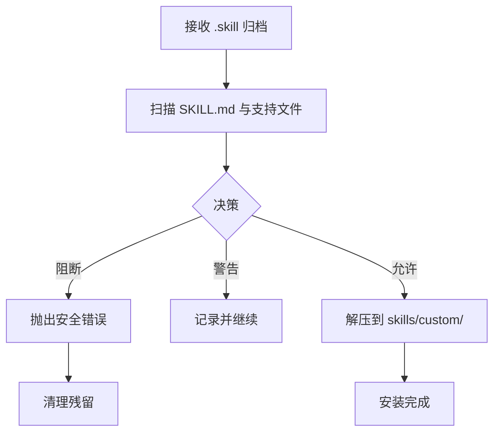
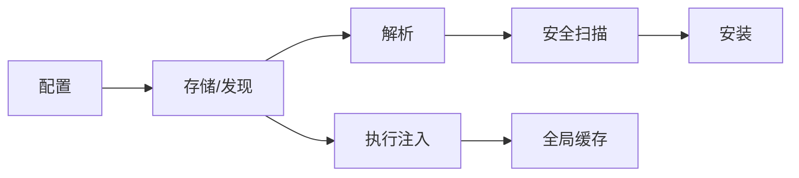

# 技能配置

<cite>
**本文引用的文件**
- [skills_config.py](file://backend/packages/harness/deerflow/config/skills_config.py)
- [local_skill_storage.py](file://backend/packages/harness/deerflow/skills/storage/local_skill_storage.py)
- [types.py](file://backend/packages/harness/deerflow/skills/types.py)
- [parser.py](file://backend/packages/harness/deerflow/skills/parser.py)
- [security_scanner.py](file://backend/packages/harness/deerflow/skills/security_scanner.py)
- [installer.py](file://backend/packages/harness/deerflow/skills/installer.py)
- [executor.py](file://backend/packages/harness/deerflow/subagents/executor.py)
- [prompt.py](file://backend/packages/harness/deerflow/agents/lead_agent/prompt.py)
- [skills.mdx](file://frontend/src/content/en/harness/skills.mdx)
- [test_skills_loader.py](file://backend/tests/test_skills_loader.py)
- [test_skills_custom_router.py](file://backend/tests/test_skills_custom_router.py)
- [test_skills_installer.py](file://backend/tests/test_skills_installer.py)
- [test_subagent_skills_config.py](file://backend/tests/test_subagent_skills_config.py)
</cite>

## 目录
1. [简介](#简介)
2. [项目结构](#项目结构)
3. [核心组件](#核心组件)
4. [架构总览](#架构总览)
5. [详细组件分析](#详细组件分析)
6. [依赖关系分析](#依赖关系分析)
7. [性能考量](#性能考量)
8. [故障排查指南](#故障排查指南)
9. [结论](#结论)
10. [附录](#附录)

## 简介
本技术文档聚焦 DeerFlow 的“技能配置”主题，围绕以下目标展开：技能目录结构与挂载路径、技能发现与加载流程、全局技能配置与按代理过滤策略、技能元数据文件 SKILL.md 的要求与分类系统、最佳实践、性能影响与安全注意事项。文档以仓库中的实际实现为依据，结合测试用例与前端文档，帮助读者正确管理与优化技能系统。

## 项目结构
技能系统在后端通过“配置-存储-解析-安全扫描-安装-执行注入”的链路协同工作；前端提供技能生命周期说明与配置入口。关键目录与文件如下：
- 后端配置与运行时
  - 配置：skills_config.py
  - 存储与发现：local_skill_storage.py
  - 类型定义：types.py
  - 解析：parser.py
  - 安全扫描：security_scanner.py
  - 安装器：installer.py
  - 执行注入：subagents/executor.py、agents/lead_agent/prompt.py
- 前端文档：skills.mdx
- 测试：覆盖发现、挂载路径、安装安全扫描、子代理技能过滤等场景

图表来源
- [skills_config.py](file://backend/packages/harness/deerflow/config/skills_config.py)
- [local_skill_storage.py](file://backend/packages/harness/deerflow/skills/storage/local_skill_storage.py)
- [types.py](file://backend/packages/harness/deerflow/skills/types.py)
- [parser.py](file://backend/packages/harness/deerflow/skills/parser.py)
- [security_scanner.py](file://backend/packages/harness/deerflow/skills/security_scanner.py)
- [installer.py](file://backend/packages/harness/deerflow/skills/installer.py)
- [executor.py](file://backend/packages/harness/deerflow/subagents/executor.py)
- [prompt.py](file://backend/packages/harness/deerflow/agents/lead_agent/prompt.py)
- [skills.mdx](file://frontend/src/content/en/harness/skills.mdx)

章节来源
- [skills.mdx](file://frontend/src/content/en/harness/skills.mdx)

## 核心组件
- 全局技能配置
  - 位于 skills_config.py，定义技能根路径、是否仅加载已启用技能等全局开关。
- 技能存储与发现
  - local_skill_storage.py 负责扫描 public/ 与 custom/ 目录，递归发现技能并构建技能对象。
- 技能类型与容器挂载
  - types.py 提供 Skill 类型及容器内挂载路径计算方法，包含 get_container_path 与 get_container_file_path。
- 技能解析
  - parser.py 读取每个技能目录下的 SKILL.md，提取结构化元数据（名称、描述、类别、指令、工具/资源需求等）。
- 安全扫描
  - security_scanner.py 在加载前对技能内容进行扫描，阻止危险模式。
- 安装器
  - installer.py 处理从压缩包安装技能，执行安全扫描与解压校验。
- 执行注入与按代理过滤
  - executor.py 按子代理配置决定加载哪些技能，并将其作为系统消息注入到对话上下文中。
  - lead_agent/prompt.py 提供全局已启用技能缓存与按配置加载能力。

章节来源
- [skills_config.py](file://backend/packages/harness/deerflow/config/skills_config.py)
- [local_skill_storage.py](file://backend/packages/harness/deerflow/skills/storage/local_skill_storage.py)
- [types.py](file://backend/packages/harness/deerflow/skills/types.py)
- [parser.py](file://backend/packages/harness/deerflow/skills/parser.py)
- [security_scanner.py](file://backend/packages/harness/deerflow/skills/security_scanner.py)
- [installer.py](file://backend/packages/harness/deerflow/skills/installer.py)
- [executor.py](file://backend/packages/harness/deerflow/subagents/executor.py)
- [prompt.py](file://backend/packages/harness/deerflow/agents/lead_agent/prompt.py)

## 架构总览
下图展示从配置到执行注入的完整流程，包括技能发现、解析、安全扫描、安装与按代理过滤注入。

图表来源
- [local_skill_storage.py](file://backend/packages/harness/deerflow/skills/storage/local_skill_storage.py)
- [parser.py](file://backend/packages/harness/deerflow/skills/parser.py)
- [security_scanner.py](file://backend/packages/harness/deerflow/skills/security_scanner.py)
- [installer.py](file://backend/packages/harness/deerflow/skills/installer.py)
- [executor.py](file://backend/packages/harness/deerflow/subagents/executor.py)
- [prompt.py](file://backend/packages/harness/deerflow/agents/lead_agent/prompt.py)

## 详细组件分析

### 技能目录与挂载路径
- 目录结构
  - skills/ 下存在 public/ 与 custom/ 两类技能目录，存储器会递归扫描这两类目录。
- 容器挂载路径
  - Skill.get_container_path 与 get_container_file_path 计算容器内的挂载路径，默认基础路径为 /mnt/skills，路径由“类别/相对路径”构成。
- 测试验证
  - 测试覆盖了嵌套技能发现与容器路径映射，确保不同层级的技能都能被正确识别与挂载。

图表来源
- [local_skill_storage.py](file://backend/packages/harness/deerflow/skills/storage/local_skill_storage.py)
- [types.py](file://backend/packages/harness/deerflow/skills/types.py)
- [test_skills_loader.py](file://backend/tests/test_skills_loader.py)

章节来源
- [local_skill_storage.py](file://backend/packages/harness/deerflow/skills/storage/local_skill_storage.py)
- [types.py](file://backend/packages/harness/deerflow/skills/types.py)
- [test_skills_loader.py](file://backend/tests/test_skills_loader.py)

### 技能发现机制
- 发现范围
  - 同时扫描 public/ 与 custom/ 目录，支持多级嵌套。
- 实时生效
  - 前端文档指出每次调用都会重新读取 ExtensionsConfig，因此通过网关 API 启用/禁用技能无需重启即可在运行时生效。
- 缓存与并发
  - lead_agent/prompt.py 提供全局已启用技能缓存，避免重复扫描与磁盘 I/O；缓存缺失时异步刷新。

图表来源
- [local_skill_storage.py](file://backend/packages/harness/deerflow/skills/storage/local_skill_storage.py)
- [parser.py](file://backend/packages/harness/deerflow/skills/parser.py)
- [security_scanner.py](file://backend/packages/harness/deerflow/skills/security_scanner.py)
- [prompt.py](file://backend/packages/harness/deerflow/agents/lead_agent/prompt.py)

章节来源
- [skills.mdx](file://frontend/src/content/en/harness/skills.mdx)
- [prompt.py](file://backend/packages/harness/deerflow/agents/lead_agent/prompt.py)

### 全局技能配置与按代理技能过滤
- 全局配置
  - skills_config.py 定义技能根路径与加载策略（如仅启用技能）。
- 按代理过滤
  - executor.py 中的 _load_skill_messages 明确了三种情况：
    - 未提供技能列表：加载全部已启用技能；
    - 列表为空：不加载任何技能；
    - 指定列表：仅加载给定技能。
  - test_subagent_skills_config.py 验证了子代理配置中 skills 字段的行为：None 表示无覆盖，[] 表示禁用，数组表示白名单。

图表来源
- [executor.py](file://backend/packages/harness/deerflow/subagents/executor.py)
- [test_subagent_skills_config.py](file://backend/tests/test_subagent_skills_config.py)

章节来源
- [executor.py](file://backend/packages/harness/deerflow/subagents/executor.py)
- [test_subagent_skills_config.py](file://backend/tests/test_subagent_skills_config.py)

### 技能元数据文件（SKILL.md）要求与分类系统
- 元数据提取
  - parser.py 读取 SKILL.md 并提取结构化信息，如名称、描述、类别、指令以及工具/资源需求。
- 分类系统
  - 类别字段用于确定容器内挂载路径的前缀（category_base），从而实现按类别的组织与访问。
- 安装安全扫描
  - installer.py 在安装前对 SKILL.md 与支持文件（scripts、templates、references 等）进行扫描，防止嵌套 SKILL.md、可执行脚本未允许等情况。

图表来源
- [types.py](file://backend/packages/harness/deerflow/skills/types.py)
- [parser.py](file://backend/packages/harness/deerflow/skills/parser.py)
- [security_scanner.py](file://backend/packages/harness/deerflow/skills/security_scanner.py)
- [installer.py](file://backend/packages/harness/deerflow/skills/installer.py)

章节来源
- [parser.py](file://backend/packages/harness/deerflow/skills/parser.py)
- [types.py](file://backend/packages/harness/deerflow/skills/types.py)
- [installer.py](file://backend/packages/harness/deerflow/skills/installer.py)

### 安装与安全扫描
- 安装流程
  - 支持从 .skill 归档安装技能，先扫描后解压，失败则回滚或清理残留。
- 安全策略
  - 禁止绝对路径、Windows 绝对路径、路径穿越、嵌套 SKILL.md 等；对可执行脚本采用“允许/警告/阻断”三态决策。
- 测试覆盖
  - test_skills_custom_router.py 与 test_skills_installer.py 覆盖了扫描触发、警告与阻断、异常处理与部分安装清理等场景。

图表来源
- [installer.py](file://backend/packages/harness/deerflow/skills/installer.py)
- [test_skills_custom_router.py](file://backend/tests/test_skills_custom_router.py)
- [test_skills_installer.py](file://backend/tests/test_skills_installer.py)

章节来源
- [installer.py](file://backend/packages/harness/deerflow/skills/installer.py)
- [test_skills_custom_router.py](file://backend/tests/test_skills_custom_router.py)
- [test_skills_installer.py](file://backend/tests/test_skills_installer.py)

## 依赖关系分析
- 组件耦合
  - Storage 依赖 Parser 与 Scanner；Parser 与 Scanner 之间为纯函数式依赖；Installer 独立但受 Scanner 影响；Executor 依赖 Storage 与全局缓存；Prompt 缓存依赖 Storage。
- 关键依赖链
  - 配置 → 存储 → 解析 → 安全扫描 → 安装 → 执行注入 → 全局缓存。
- 外部集成点
  - 前端文档说明了实时生效与生命周期步骤，便于运维与调试。

图表来源
- [skills_config.py](file://backend/packages/harness/deerflow/config/skills_config.py)
- [local_skill_storage.py](file://backend/packages/harness/deerflow/skills/storage/local_skill_storage.py)
- [parser.py](file://backend/packages/harness/deerflow/skills/parser.py)
- [security_scanner.py](file://backend/packages/harness/deerflow/skills/security_scanner.py)
- [installer.py](file://backend/packages/harness/deerflow/skills/installer.py)
- [executor.py](file://backend/packages/harness/deerflow/subagents/executor.py)
- [prompt.py](file://backend/packages/harness/deerflow/agents/lead_agent/prompt.py)

章节来源
- [skills.mdx](file://frontend/src/content/en/harness/skills.mdx)

## 性能考量
- 缓存命中
  - lead_agent/prompt.py 使用全局缓存与按配置对象缓存，避免重复扫描与磁盘 I/O。
- 递归扫描成本
  - 大规模技能树可能带来扫描开销，建议合理分层与控制目录数量。
- 安装阶段
  - 安全扫描与解压为 CPU/IO 密集操作，建议在离线或低峰期执行批量安装。
- 运行时注入
  - 按代理过滤可显著减少上下文大小，降低 LLM 推理负担。

## 故障排查指南
- 症状：技能未出现在可用列表
  - 检查 skills_config.py 的根路径与开关；确认 SKILL.md 是否符合解析格式；查看存储器是否扫描到该目录。
- 症状：启用/禁用技能后未生效
  - 确认是否通过网关 API 修改并触发了 ExtensionsConfig 重载；检查全局缓存是否命中。
- 症状：安装失败或被阻断
  - 查看安全扫描日志与错误信息，确认是否存在嵌套 SKILL.md、路径穿越、可执行脚本未允许等情况。
- 症状：容器内找不到 SKILL.md
  - 核对容器挂载路径与 Skill.get_container_file_path 的计算逻辑，确保类别与相对路径正确。

章节来源
- [prompt.py](file://backend/packages/harness/deerflow/agents/lead_agent/prompt.py)
- [installer.py](file://backend/packages/harness/deerflow/skills/installer.py)
- [types.py](file://backend/packages/harness/deerflow/skills/types.py)

## 结论
DeerFlow 的技能系统通过清晰的目录结构、容器挂载路径计算、解析与安全扫描、安装与缓存、以及按代理过滤注入，实现了高可维护性与安全性。遵循本文的最佳实践与安全规范，可在保证稳定性的前提下高效管理技能生态。

## 附录
- 最佳实践
  - 使用明确的类别命名与稳定的相对路径，便于容器内定位与管理。
  - 将 SKILL.md 保持简洁且结构化，避免复杂嵌套与敏感内容。
  - 在生产环境优先使用白名单策略，按代理精确控制技能集合。
  - 对可执行脚本进行严格评审，必要时采用“警告”策略进行人工复核。
- 安全建议
  - 禁止绝对路径与路径穿越，避免归档中出现系统敏感文件。
  - 对外部来源的 .skill 归档进行离线扫描后再上线。
  - 定期审计已启用技能，移除不再使用的技能以降低攻击面。