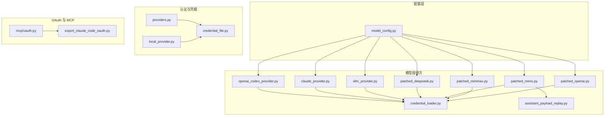
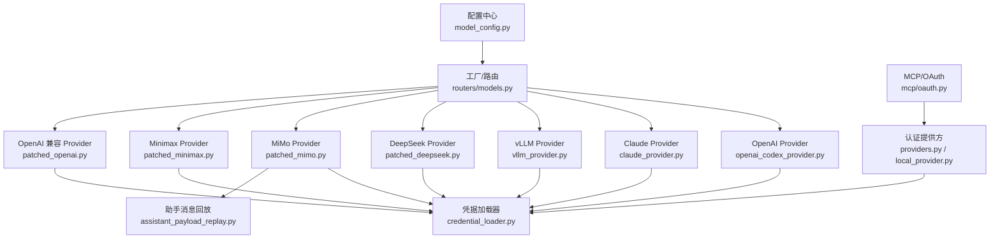
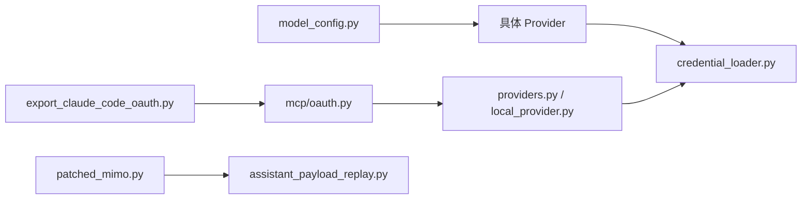

# 模型配置

<cite>
**本文引用的文件**
- [model_config.py](file://backend/packages/harness/deerflow/config/model_config.py)
- [test_model_config.py](file://backend/tests/test_model_config.py)
- [claude_provider.py](file://backend/packages/harness/deerflow/models/claude_provider.py)
- [openai_codex_provider.py](file://backend/packages/harness/deerflow/models/openai_codex_provider.py)
- [vllm_provider.py](file://backend/packages/harness/deerflow/models/vllm_provider.py)
- [patched_deepseek.py](file://backend/packages/harness/deerflow/models/patched_deepseek.py)
- [patched_mimo.py](file://backend/packages/harness/deerflow/models/patched_mimo.py)
- [patched_minimax.py](file://backend/packages/harness/deerflow/models/patched_minimax.py)
- [patched_openai.py](file://backend/packages/harness/deerflow/models/patched_openai.py)
- [credential_loader.py](file://backend/packages/harness/deerflow/models/credential_loader.py)
- [providers.py](file://backend/app/gateway/auth/providers.py)
- [local_provider.py](file://backend/app/gateway/auth/local_provider.py)
- [credential_file.py](file://backend/app/gateway/auth/credential_file.py)
- [oauth.py](file://backend/packages/harness/deerflow/mcp/oauth.py)
- [export_claude_code_oauth.py](file://scripts/export_claude_code_oauth.py)
- [CLAUDE.md](file://CLAUDE.md)
- [docs/AUTH_DESIGN.md](file://backend/docs/AUTH_DESIGN.md)
- [docs/CONFIGURATION.md](file://backend/docs/CONFIGURATION.md)
- [docs/MCP_SERVER.md](file://backend/docs/MCP_SERVER.md)
- [docs/STREAMING.md](file://backend/docs/STREAMING.md)
- [docs/GUARDRAILS.md](file://backend/docs/GUARDRAILS.md)
- [docs/MEMORY_IMPROVEMENTS.md](file://backend/docs/MEMORY_IMPROVEMENTS.md)
- [docs/TITLE_GENERATION_IMPLEMENTATION.md](file://backend/docs/TITLE_GENERATION_IMPLEMENTATION.md)
- [docs/plan_mode_usage.md](file://backend/docs/plan_mode_usage.md)
- [docs/task_tool_improvements.md](file://backend/docs/task_tool_improvements.md)
- [docs/summarization.md](file://backend/docs/summarization.md)
- [docs/AUTO_TITLE_GENERATION.md](file://backend/docs/AUTO_TITLE_GENERATION.md)
- [docs/MEMORY_SETTINGS_REVIEW.md](file://backend/docs/MEMORY_SETTINGS_REVIEW.md)
- [docs/MEMORY_IMPROVEMENTS_SUMMARY.md](file://backend/docs/MEMORY_IMPROVEMENTS_SUMMARY.md)
- [docs/FILE_UPLOAD.md](file://backend/docs/FILE_UPLOAD.md)
- [docs/ARCHITECTURE.md](file://backend/docs/ARCHITECTURE.md)
- [docs/API.md](file://backend/docs/API.md)
- [docs/SETUP.md](file://backend/docs/SETUP.md)
- [docs/PATH_EXAMPLES.md](file://backend/docs/PATH_EXAMPLES.md)
- [docs/TITLE_GENERATION_IMPLEMENTATION.md](file://backend/docs/TITLE_GENERATION_IMPLEMENTATION.md)
- [docs/TODO.md](file://backend/docs/TODO.md)
- [docs/middleware-execution-flow.md](file://backend/docs/middleware-execution-flow.md)
- [docs/rfc-create-deerflow-agent.md](file://backend/docs/rfc-create-deerflow-agent.md)
- [docs/rfc-extract-shared-modules.md](file://backend/docs/rfc-extract-shared-modules.md)
- [docs/rfc-grep-glob-tools.md](file://backend/docs/rfc-grep-glob-tools.md)
- [docs/README.md](file://backend/docs/README.md)
- [docs/CHANGELIST.md](file://docs/changelog/code_change_summary/README.md)
- [docs/BACKEND.md](file://docs/changelog/code_change_summary/backend.md)
- [docs/CONFIG.md](file://docs/changelog/code_change_summary/config.md)
- [docs/DOCKER.md](file://docs/changelog/code_change_summary/docker.md)
- [docs/Frontend.md](file://docs/changelog/code_change_summary/frontend.md)
- [docs/SCRIPTS.md](file://docs/changelog/code_change_summary/scripts.md)
- [docs/SKILLS.md](file://docs/changelog/code_change_summary/skills.md)
</cite>

## 更新摘要
**所做更改**
- 更新了MiMo模型思维模式配置部分，移除了复杂的思维模式配置示例
- 简化了MiMo模型配置说明，专注于核心功能特性
- 更新了模型配置架构图，反映简化的思维模式处理机制

## 目录
1. [简介](#简介)
2. [项目结构](#项目结构)
3. [核心组件](#核心组件)
4. [架构总览](#架构总览)
5. [详细组件分析](#详细组件分析)
6. [依赖关系分析](#依赖关系分析)
7. [性能考虑](#性能考虑)
8. [故障排查指南](#故障排查指南)
9. [结论](#结论)
10. [附录](#附录)

## 简介
本技术文档面向 DeerFlow 的模型配置与运行优化，系统性梳理后端模型提供方（LLM Provider）的实现与适配方式，覆盖 OpenAI、Anthropic Claude、DeepSeek、Xiaomi MiMo（Minimax）、以及 Claude Code OAuth 等多种提供商；同时给出温度系数、最大生成长度等关键参数的调优建议，并对 OpenAI 兼容网关、CLI 后端提供商认证机制进行说明。文档还包含模型选择指南、性能优化与成本控制策略，帮助用户在不同场景下正确配置与优化各类 AI 模型。

## 项目结构
与模型配置直接相关的核心目录与文件如下：
- 配置层：backend/packages/harness/deerflow/config/model_config.py
- 提供方实现：backend/packages/harness/deerflow/models/*
- 认证与凭据：backend/app/gateway/auth/* 与 backend/packages/harness/deerflow/models/credential_loader.py
- OAuth 与 MCP：backend/packages/harness/deerflow/mcp/oauth.py 与 scripts/export_claude_code_oauth.py
- 文档与设计：backend/docs/* 与仓库根目录 CLAUDE.md

**图示来源**
- [model_config.py](file://backend/packages/harness/deerflow/config/model_config.py)
- [openai_codex_provider.py](file://backend/packages/harness/deerflow/models/openai_codex_provider.py)
- [claude_provider.py](file://backend/packages/harness/deerflow/models/claude_provider.py)
- [vllm_provider.py](file://backend/packages/harness/deerflow/models/vllm_provider.py)
- [patched_deepseek.py](file://backend/packages/harness/deerflow/models/patched_deepseek.py)
- [patched_mimo.py](file://backend/packages/harness/deerflow/models/patched_mimo.py)
- [patched_minimax.py](file://backend/packages/harness/deerflow/models/patched_minimax.py)
- [patched_openai.py](file://backend/packages/harness/deerflow/models/patched_openai.py)
- [credential_loader.py](file://backend/packages/harness/deerflow/models/credential_loader.py)
- [assistant_payload_replay.py](file://backend/packages/harness/deerflow/models/assistant_payload_replay.py)
- [providers.py](file://backend/app/gateway/auth/providers.py)
- [local_provider.py](file://backend/app/gateway/auth/local_provider.py)
- [credential_file.py](file://backend/app/gateway/auth/credential_file.py)
- [oauth.py](file://backend/packages/harness/deerflow/mcp/oauth.py)
- [export_claude_code_oauth.py](file://scripts/export_claude_code_oauth.py)

**章节来源**
- [model_config.py](file://backend/packages/harness/deerflow/config/model_config.py)
- [openai_codex_provider.py](file://backend/packages/harness/deerflow/models/openai_codex_provider.py)
- [claude_provider.py](file://backend/packages/harness/deerflow/models/claude_provider.py)
- [vllm_provider.py](file://backend/packages/harness/deerflow/models/vllm_provider.py)
- [patched_deepseek.py](file://backend/packages/harness/deerflow/models/patched_deepseek.py)
- [patched_mimo.py](file://backend/packages/harness/deerflow/models/patched_mimo.py)
- [patched_minimax.py](file://backend/packages/harness/deerflow/models/patched_minimax.py)
- [patched_openai.py](file://backend/packages/harness/deerflow/models/patched_openai.py)
- [credential_loader.py](file://backend/packages/harness/deerflow/models/credential_loader.py)
- [providers.py](file://backend/app/gateway/auth/providers.py)
- [local_provider.py](file://backend/app/gateway/auth/local_provider.py)
- [credential_file.py](file://backend/app/gateway/auth/credential_file.py)
- [oauth.py](file://backend/packages/harness/deerflow/mcp/oauth.py)
- [export_claude_code_oauth.py](file://scripts/export_claude_code_oauth.py)

## 核心组件
- 模型配置中心：负责统一加载与解析模型提供方配置，协调各 Provider 的参数映射与默认值设置。
- Provider 实现族：针对不同厂商或引擎（OpenAI、Anthropic、vLLM、DeepSeek、MiMo、Minimax、OpenAI 兼容）提供适配层，封装请求构造、响应解析与错误处理。
- 凭据加载器：集中管理密钥、令牌与认证材料的加载与校验流程，确保安全与可维护性。
- 认证与 CLI 提供商：支持本地/外部认证提供方、凭据文件、以及 CLI 场景下的认证机制。
- OAuth 与 MCP：支持 MCP 会话与 OAuth 流程，便于与第三方服务集成并导出认证信息。
- 助手消息回放：专门处理MiMo等提供商的思维模式字段保留机制。

**章节来源**
- [model_config.py](file://backend/packages/harness/deerflow/config/model_config.py)
- [credential_loader.py](file://backend/packages/harness/deerflow/models/credential_loader.py)
- [providers.py](file://backend/app/gateway/auth/providers.py)
- [local_provider.py](file://backend/app/gateway/auth/local_provider.py)
- [credential_file.py](file://backend/app/gateway/auth/credential_file.py)
- [oauth.py](file://backend/packages/harness/deerflow/mcp/oauth.py)
- [assistant_payload_replay.py](file://backend/packages/harness/deerflow/models/assistant_payload_replay.py)

## 架构总览
DeerFlow 的模型配置采用"配置中心 + Provider 适配 + 凭据加载 + 认证/授权"的分层架构。配置中心根据模型标识选择对应 Provider，Provider 通过凭据加载器获取密钥/令牌，再经由兼容网关或直连接口发起推理请求；认证层为 CLI 与后端提供统一的认证入口。MiMo模型通过专用的助手消息回放机制处理思维模式的复杂需求。

**图示来源**
- [model_config.py](file://backend/packages/harness/deerflow/config/model_config.py)
- [openai_codex_provider.py](file://backend/packages/harness/deerflow/models/openai_codex_provider.py)
- [claude_provider.py](file://backend/packages/harness/deerflow/models/claude_provider.py)
- [vllm_provider.py](file://backend/packages/harness/deerflow/models/vllm_provider.py)
- [patched_deepseek.py](file://backend/packages/harness/deerflow/models/patched_deepseek.py)
- [patched_mimo.py](file://backend/packages/harness/deerflow/models/patched_mimo.py)
- [patched_minimax.py](file://backend/packages/harness/deerflow/models/patched_minimax.py)
- [patched_openai.py](file://backend/packages/harness/deerflow/models/patched_openai.py)
- [credential_loader.py](file://backend/packages/harness/deerflow/models/credential_loader.py)
- [providers.py](file://backend/app/gateway/auth/providers.py)
- [local_provider.py](file://backend/app/gateway/auth/local_provider.py)
- [oauth.py](file://backend/packages/harness/deerflow/mcp/oauth.py)
- [assistant_payload_replay.py](file://backend/packages/harness/deerflow/models/assistant_payload_replay.py)

## 详细组件分析

### OpenAI 提供方（含兼容）
- 能力范围：支持文本生成、函数调用、流式输出等通用能力；兼容 OpenAI 接口风格。
- 关键参数：temperature、max_tokens、top_p、frequency_penalty、presence_penalty 等。
- 特殊功能：支持思维链（thinking/reasoning）提示词模式与工具调用；流式传输按文档要求启用。
- 性能要点：合理设置 max_tokens 与温度以平衡质量与延迟；开启流式可改善用户体验。
- 成本控制：优先使用较短上下文与较低温度；限制工具调用次数与输出长度。

**章节来源**
- [openai_codex_provider.py](file://backend/packages/harness/deerflow/models/openai_codex_provider.py)
- [patched_openai.py](file://backend/packages/harness/deerflow/models/patched_openai.py)
- [docs/STREAMING.md](file://backend/docs/STREAMING.md)

### Anthropic Claude 提供方
- 能力范围：支持文本与多模态（图像）输入；具备思维链与推理能力；支持 prompt caching。
- 关键参数：temperature、max_tokens、top_k、top_p、anthropic_version 等。
- 特殊功能：支持 thinking/reasoning、vision；prompt caching 可显著降低重复对话成本。
- 认证与 OAuth：支持 Claude Code OAuth，可通过脚本导出认证信息用于 MCP 或 CLI。
- 性能与成本：利用 prompt caching 缓存系统提示；减少不必要的多模态输入；合理设置 max_tokens。

**章节来源**
- [claude_provider.py](file://backend/packages/harness/deerflow/models/claude_provider.py)
- [oauth.py](file://backend/packages/harness/deerflow/mcp/oauth.py)
- [export_claude_code_oauth.py](file://scripts/export_claude_code_oauth.py)
- [CLAUDE.md](file://CLAUDE.md)

### vLLM 提供方
- 能力范围：高性能推理引擎，支持长上下文与高吞吐；适合大规模部署与批处理。
- 关键参数：temperature、max_tokens、best_of、use_beam_search、skip_special_tokens 等。
- 特殊功能：支持流式输出与批量调度；可结合缓存与压缩策略提升吞吐。
- 性能要点：合理设置 best_of 与 beam_width；启用流式与批处理；监控 GPU/CPU 利用率。

**章节来源**
- [vllm_provider.py](file://backend/packages/harness/deerflow/models/vllm_provider.py)
- [docs/STREAMING.md](file://backend/docs/STREAMING.md)

### DeepSeek 提供方
- 能力范围：支持代码与通用对话；具备较强推理与数学能力。
- 关键参数：temperature、max_tokens、top_p、repeat_penalty 等。
- 特殊功能：支持思维链与工具调用；适合工程类任务。
- 性能与成本：适度提高温度以增强创造性；限制输出长度避免过度消耗。

**章节来源**
- [patched_deepseek.py](file://backend/packages/harness/deerflow/models/patched_deepseek.py)

### Xiaomi MiMo（Minimax）提供方
- 能力范围：支持中英文混合与多语言场景；适合内容创作与对话。
- 关键参数：temperature、max_tokens、top_p、mask_token_id 等。
- 特殊功能：支持思维链与多轮对话；注意上下文长度限制。
- 性能与成本：控制上下文长度与输出长度；避免冗余历史消息。
- **更新**：MiMo模型通过专用的助手消息回放机制自动处理思维模式字段，无需复杂的配置示例。

**章节来源**
- [patched_mimo.py](file://backend/packages/harness/deerflow/models/patched_mimo.py)
- [assistant_payload_replay.py](file://backend/packages/harness/deerflow/models/assistant_payload_replay.py)

### Minimax 提供方
- 能力范围：多模态与长文本生成；适合报告与总结类任务。
- 关键参数：temperature、max_tokens、top_k、top_p、repetition_penalty 等。
- 特殊功能：支持思维链与多模态输入；注意资源与计费阈值。
- 性能与成本：优先使用较短上下文；限制工具调用与输出长度。

**章节来源**
- [patched_minimax.py](file://backend/packages/harness/deerflow/models/patched_minimax.py)

### 凭据加载与认证
- 凭据加载器：集中从环境变量、配置文件或密钥管理服务加载 API Key/Token。
- 认证提供方：支持本地/外部认证提供方与凭据文件；CLI 场景下提供认证入口。
- OAuth：MCP 层支持 OAuth 会话与令牌刷新；可导出 Claude Code OAuth 信息。

**章节来源**
- [credential_loader.py](file://backend/packages/harness/deerflow/models/credential_loader.py)
- [providers.py](file://backend/app/gateway/auth/providers.py)
- [local_provider.py](file://backend/app/gateway/auth/local_provider.py)
- [credential_file.py](file://backend/app/gateway/auth/credential_file.py)
- [oauth.py](file://backend/packages/harness/deerflow/mcp/oauth.py)
- [export_claude_code_oauth.py](file://scripts/export_claude_code_oauth.py)

### OpenAI 兼容网关与 CLI 后端提供商
- 兼容网关：通过统一接口适配多家 OpenAI 兼容服务，屏蔽差异；需正确配置 endpoint、headers 与鉴权。
- CLI 后端提供商：在命令行环境中提供认证与模型选择能力，便于快速测试与集成。
- 认证机制：支持 API Key、Bearer Token、OAuth 等常见模式；确保 headers 与路径正确。

**章节来源**
- [patched_openai.py](file://backend/packages/harness/deerflow/models/patched_openai.py)
- [providers.py](file://backend/app/gateway/auth/providers.py)
- [local_provider.py](file://backend/app/gateway/auth/local_provider.py)
- [docs/CONFIGURATION.md](file://backend/docs/CONFIGURATION.md)
- [docs/API.md](file://backend/docs/API.md)

## 依赖关系分析
- 配置到实现：model_config.py 决定选用哪个 Provider，Provider 依赖 credential_loader 获取凭据。
- 认证到凭据：providers.py/local_provider.py 与 credential_file.py 协作，为 Provider 提供安全的凭据访问。
- OAuth 到 MCP：oauth.py 与 MCP 集成，export_claude_code_oauth.py 支持导出认证信息。
- MiMo 特殊处理：patched_mimo.py 依赖 assistant_payload_replay.py 进行思维模式字段处理。

**图示来源**
- [model_config.py](file://backend/packages/harness/deerflow/config/model_config.py)
- [credential_loader.py](file://backend/packages/harness/deerflow/models/credential_loader.py)
- [providers.py](file://backend/app/gateway/auth/providers.py)
- [local_provider.py](file://backend/app/gateway/auth/local_provider.py)
- [oauth.py](file://backend/packages/harness/deerflow/mcp/oauth.py)
- [export_claude_code_oauth.py](file://scripts/export_claude_code_oauth.py)
- [patched_mimo.py](file://backend/packages/harness/deerflow/models/patched_mimo.py)
- [assistant_payload_replay.py](file://backend/packages/harness/deerflow/models/assistant_payload_replay.py)

**章节来源**
- [model_config.py](file://backend/packages/harness/deerflow/config/model_config.py)
- [credential_loader.py](file://backend/packages/harness/deerflow/models/credential_loader.py)
- [providers.py](file://backend/app/gateway/auth/providers.py)
- [local_provider.py](file://backend/app/gateway/auth/local_provider.py)
- [oauth.py](file://backend/packages/harness/deerflow/mcp/oauth.py)
- [export_claude_code_oauth.py](file://scripts/export_claude_code_oauth.py)
- [patched_mimo.py](file://backend/packages/harness/deerflow/models/patched_mimo.py)
- [assistant_payload_replay.py](file://backend/packages/harness/deerflow/models/assistant_payload_replay.py)

## 性能考虑
- 参数调优
  - temperature：越低越稳定，越高越创造性；一般在 0.1~0.7 区间内微调。
  - max_tokens：控制输出长度，避免过长导致延迟与成本上升。
  - top_p/top_k：在 vLLM/Minimax 等引擎中影响采样多样性。
- 流式传输：启用流式输出可显著改善前端交互体验，需配合合适的缓冲策略。
- 缓存与复用：Claude 的 prompt caching 可降低重复对话成本；Mindie/Minimax 等也应尽量复用上下文。
- 上下文管理：控制历史消息长度与关键信息抽取，避免超限与性能下降。
- 并发与批处理：vLLM 适合批处理；合理设置并发度与队列长度，避免拥塞。
- **更新**：MiMo模型通过助手消息回放机制自动处理思维模式字段，减少手动配置复杂度。

**章节来源**
- [docs/STREAMING.md](file://backend/docs/STREAMING.md)
- [claude_provider.py](file://backend/packages/harness/deerflow/models/claude_provider.py)
- [vllm_provider.py](file://backend/packages/harness/deerflow/models/vllm_provider.py)
- [patched_minimax.py](file://backend/packages/harness/deerflow/models/patched_minimax.py)
- [assistant_payload_replay.py](file://backend/packages/harness/deerflow/models/assistant_payload_replay.py)

## 故障排查指南
- 常见问题定位
  - 凭据缺失或格式错误：检查 credential_loader 与 providers/local_provider 的配置是否一致。
  - 网关连接失败：核对 endpoint、headers 与认证方式；确认防火墙与代理设置。
  - 流式输出异常：检查流式开关与客户端解析逻辑。
  - OAuth 失败：确认 MCP 会话状态与令牌有效期；必要时重新导出认证信息。
  - **更新**：MiMo思维模式问题：检查助手消息回放机制是否正常工作，确认 reasoning_content 字段正确传递。
- 相关测试与文档
  - 模型配置测试：参考 test_model_config.py 的断言与用例组织方式。
  - 认证与 OAuth 测试：参考相关测试文件与 AUTH_DESIGN 文档。
  - MCP 与 OAuth：参考 MCP_SERVER 与相关测试脚本。
  - **更新**：MiMo测试：参考 test_patched_mimo.py 中的 reasoning_content 处理测试。

**章节来源**
- [test_model_config.py](file://backend/tests/test_model_config.py)
- [credential_loader.py](file://backend/packages/harness/deerflow/models/credential_loader.py)
- [providers.py](file://backend/app/gateway/auth/providers.py)
- [local_provider.py](file://backend/app/gateway/auth/local_provider.py)
- [oauth.py](file://backend/packages/harness/deerflow/mcp/oauth.py)
- [docs/AUTH_DESIGN.md](file://backend/docs/AUTH_DESIGN.md)
- [docs/MCP_SERVER.md](file://backend/docs/MCP_SERVER.md)
- [test_patched_mimo.py](file://backend/tests/test_patched_mimo.py)

## 结论
DeerFlow 在模型配置上提供了完善的 Provider 适配与认证体系，覆盖主流厂商与开源引擎。通过合理的参数调优、流式传输与缓存策略，可在保证质量的同时提升性能与降低成本。**更新**：MiMo模型的思维模式配置已简化，通过专用的助手消息回放机制自动处理复杂的需求，减少了用户的配置负担。建议在生产环境中优先采用 Claude prompt caching、vLLM 批处理与最小化上下文策略，并严格管理凭据与认证流程。

## 附录

### 模型选择指南
- 通用对话与写作：OpenAI 兼容或 vLLM
- 代码与工程：DeepSeek
- 中文与多语言：MiMo 或 Minimax
- 思维链与推理：Claude（支持 prompt caching）
- 多模态：Claude（vision）

**章节来源**
- [openai_codex_provider.py](file://backend/packages/harness/deerflow/models/openai_codex_provider.py)
- [vllm_provider.py](file://backend/packages/harness/deerflow/models/vllm_provider.py)
- [patched_deepseek.py](file://backend/packages/harness/deerflow/models/patched_deepseek.py)
- [patched_mimo.py](file://backend/packages/harness/deerflow/models/patched_mimo.py)
- [patched_minimax.py](file://backend/packages/harness/deerflow/models/patched_minimax.py)
- [claude_provider.py](file://backend/packages/harness/deerflow/models/claude_provider.py)

### 参数与功能对照表（概览）
- temperature：控制创造性与稳定性
- max_tokens：控制输出长度
- top_p/top_k：采样多样性
- prompt caching：Claude 专属缓存
- 流式输出：提升交互体验
- 工具调用：函数式能力
- 多模态：图像理解与生成
- **更新**：思维模式：统一的 thinking/reasoning 支持，MiMo通过助手消息回放自动处理

**章节来源**
- [openai_codex_provider.py](file://backend/packages/harness/deerflow/models/openai_codex_provider.py)
- [claude_provider.py](file://backend/packages/harness/deerflow/models/claude_provider.py)
- [vllm_provider.py](file://backend/packages/harness/deerflow/models/vllm_provider.py)
- [patched_deepseek.py](file://backend/packages/harness/deerflow/models/patched_deepseek.py)
- [patched_mimo.py](file://backend/packages/harness/deerflow/models/patched_mimo.py)
- [patched_minimax.py](file://backend/packages/harness/deerflow/models/patched_minimax.py)
- [docs/STREAMING.md](file://backend/docs/STREAMING.md)
- [assistant_payload_replay.py](file://backend/packages/harness/deerflow/models/assistant_payload_replay.py)