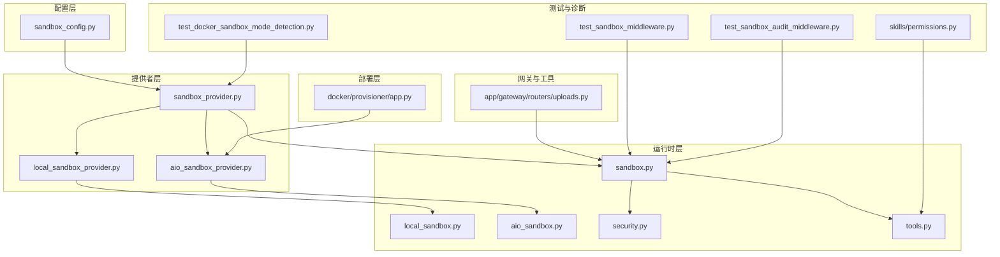
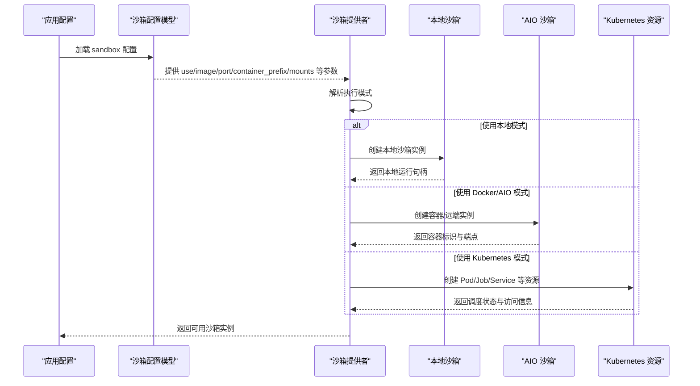
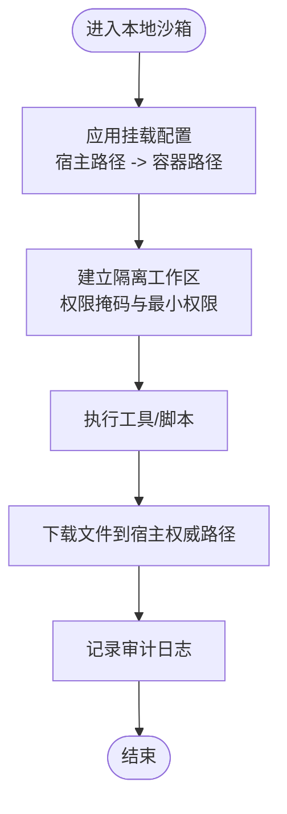
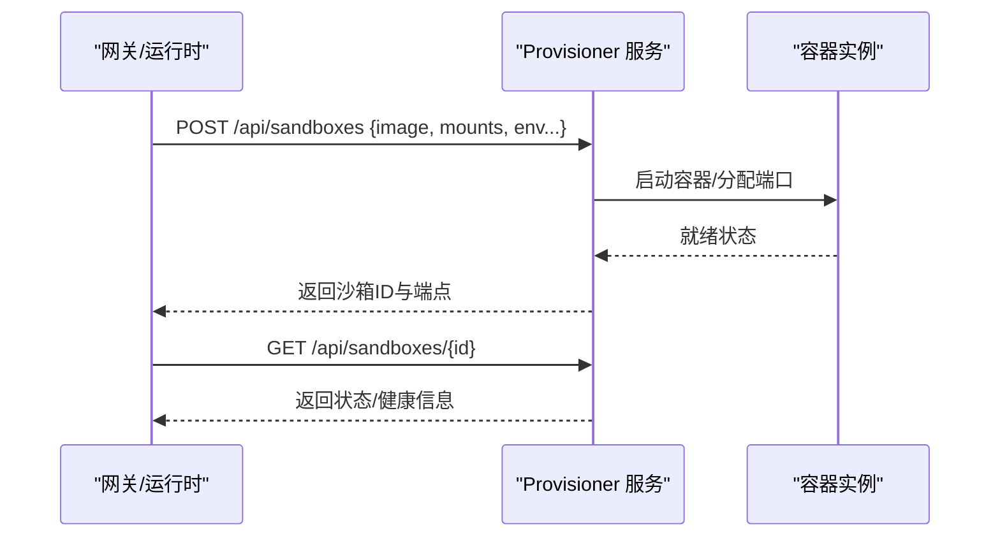
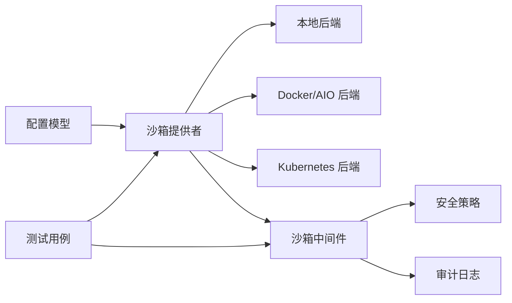

# 沙箱配置

<cite>
**本文引用的文件**
- [sandbox_config.py](file://backend/packages/harness/deerflow/config/sandbox_config.py)
- [local_sandbox_provider.py](file://backend/packages/harness/deerflow/sandbox/local/local_sandbox_provider.py)
- [local_sandbox.py](file://backend/packages/harness/deerflow/sandbox/local/local_sandbox.py)
- [sandbox_provider.py](file://backend/packages/harness/deerflow/sandbox/sandbox_provider.py)
- [sandbox.py](file://backend/packages/harness/deerflow/sandbox/sandbox.py)
- [aio_sandbox_provider.py](file://backend/packages/harness/deerflow/community/aio_sandbox/aio_sandbox_provider.py)
- [aio_sandbox.py](file://backend/packages/harness/deerflow/community/aio_sandbox/aio_sandbox.py)
- [app.py](file://docker/provisioner/app.py)
- [test_docker_sandbox_mode_detection.py](file://backend/tests/test_docker_sandbox_mode_detection.py)
- [test_local_sandbox_provider_mounts.py](file://backend/tests/test_local_sandbox_provider_mounts.py)
- [test_sandbox_middleware.py](file://backend/tests/test_sandbox_middleware.py)
- [test_sandbox_audit_middleware.py](file://backend/tests/test_sandbox_audit_middleware.py)
- [permissions.py](file://backend/packages/harness/deerflow/skills/permissions.py)
- [security.py](file://backend/packages/harness/deerflow/sandbox/security.py)
- [tools.py](file://backend/packages/harness/deerflow/sandbox/tools.py)
- [uploads.py](file://backend/app/gateway/routers/uploads.py)
- [doctor.py](file://scripts/doctor.py)
- [setup-sandbox.sh](file://scripts/setup-sandbox.sh)
</cite>

## 目录
1. [简介](#简介)
2. [项目结构](#项目结构)
3. [核心组件](#核心组件)
4. [架构总览](#架构总览)
5. [详细组件分析](#详细组件分析)
6. [依赖关系分析](#依赖关系分析)
7. [性能考量](#性能考量)
8. [故障排查指南](#故障排查指南)
9. [结论](#结论)
10. [附录](#附录)

## 简介
本文件面向 DeerFlow 的沙箱配置与运行，系统性梳理三种执行模式（本地执行、Docker 执行、Kubernetes 执行）的配置差异与适用场景，并详细说明沙箱提供者的关键配置项（端口绑定、自动启动、容器前缀、挂载路径等），以及主机 Bash 权限控制、网络访问策略与资源限制机制。同时给出不同部署环境的最佳实践与安全建议，帮助用户在正确的时间选择合适的沙箱模式并完成正确配置。

## 项目结构
围绕沙箱功能的相关代码主要分布在以下模块：
- 配置层：sandbox_config.py 定义沙箱配置模型与默认值
- 提供者层：本地/远程提供者抽象与实现，负责实例生命周期管理
- 运行时层：本地沙箱、AIO 沙箱、工具与安全中间件
- 部署层：Docker 编排与 Kubernetes 资源定义（通过 provisioner 与外部配置）
- 测试与诊断：覆盖模式检测、挂载行为、权限与审计等测试用例

图表来源
- [sandbox_config.py](file://backend/packages/harness/deerflow/config/sandbox_config.py)
- [sandbox_provider.py](file://backend/packages/harness/deerflow/sandbox/sandbox_provider.py)
- [local_sandbox_provider.py](file://backend/packages/harness/deerflow/sandbox/local/local_sandbox_provider.py)
- [aio_sandbox_provider.py](file://backend/packages/harness/deerflow/community/aio_sandbox/aio_sandbox_provider.py)
- [sandbox.py](file://backend/packages/harness/deerflow/sandbox/sandbox.py)
- [local_sandbox.py](file://backend/packages/harness/deerflow/sandbox/local/local_sandbox.py)
- [aio_sandbox.py](file://backend/packages/harness/deerflow/community/aio_sandbox/aio_sandbox.py)
- [security.py](file://backend/packages/harness/deerflow/sandbox/security.py)
- [tools.py](file://backend/packages/harness/deerflow/sandbox/tools.py)
- [app.py](file://docker/provisioner/app.py)
- [uploads.py](file://backend/app/gateway/routers/uploads.py)
- [test_docker_sandbox_mode_detection.py](file://backend/tests/test_docker_sandbox_mode_detection.py)
- [test_sandbox_middleware.py](file://backend/tests/test_sandbox_middleware.py)
- [test_sandbox_audit_middleware.py](file://backend/tests/test_sandbox_audit_middleware.py)
- [permissions.py](file://backend/packages/harness/deerflow/skills/permissions.py)

章节来源
- [sandbox_config.py](file://backend/packages/harness/deerflow/config/sandbox_config.py)
- [sandbox_provider.py](file://backend/packages/harness/deerflow/sandbox/sandbox_provider.py)

## 核心组件
- 沙箱配置模型：定义执行模式、镜像、端口、容器前缀、挂载、环境变量、空闲超时、副本数等关键字段，作为提供者加载的基础数据源。
- 沙箱提供者：统一抽象“如何创建/销毁/管理”沙箱实例，支持本地、Docker/AIO、Kubernetes 等后端。
- 本地沙箱：直接在宿主机上以隔离目录与权限策略运行，适合开发与轻量场景。
- AIO 沙箱：通过 provisioner 或远端服务编排容器，适合需要弹性扩缩容与多租户隔离的生产环境。
- 安全与工具：提供权限掩码、Bash 访问控制、文件操作审计与工具调用安全策略。
- 网关集成：上传路由在 AIO 模式下写入宿主机权威文件路径，确保跨模式一致性。

章节来源
- [sandbox_config.py](file://backend/packages/harness/deerflow/config/sandbox_config.py)
- [sandbox_provider.py](file://backend/packages/harness/deerflow/sandbox/sandbox_provider.py)
- [local_sandbox_provider.py](file://backend/packages/harness/deerflow/sandbox/local/local_sandbox_provider.py)
- [aio_sandbox_provider.py](file://backend/packages/harness/deerflow/community/aio_sandbox/aio_sandbox_provider.py)
- [sandbox.py](file://backend/packages/harness/deerflow/sandbox/sandbox.py)
- [security.py](file://backend/packages/harness/deerflow/sandbox/security.py)
- [tools.py](file://backend/packages/harness/deerflow/sandbox/tools.py)
- [uploads.py](file://backend/app/gateway/routers/uploads.py)

## 架构总览
下图展示从应用配置到沙箱提供者、再到具体后端（本地/Docker/Kubernetes）的调用链路与职责边界：

图表来源
- [sandbox_config.py](file://backend/packages/harness/deerflow/config/sandbox_config.py)
- [sandbox_provider.py](file://backend/packages/harness/deerflow/sandbox/sandbox_provider.py)
- [local_sandbox_provider.py](file://backend/packages/harness/deerflow/sandbox/local/local_sandbox_provider.py)
- [aio_sandbox_provider.py](file://backend/packages/harness/deerflow/community/aio_sandbox/aio_sandbox_provider.py)
- [app.py](file://docker/provisioner/app.py)

## 详细组件分析

### 沙箱配置模型与字段说明
- 关键字段
  - use：执行模式选择（本地/远程/AIO/Kubernetes）
  - image：容器镜像名称（用于 Docker/AIO/Kubernetes）
  - port：基础端口（用于容器端口映射或本地监听）
  - container_prefix：容器名前缀（便于识别与清理）
  - mounts：挂载配置（宿主路径到容器路径的映射）
  - environment：环境变量注入
  - idle_timeout：空闲超时回收
  - replicas：副本数量（用于高可用/并发）
- 默认值与校验：配置模型提供默认值与基本校验逻辑，确保关键字段存在且类型合理。

章节来源
- [sandbox_config.py](file://backend/packages/harness/deerflow/config/sandbox_config.py)

### 沙箱提供者与模式解析
- 统一接口：提供者负责根据配置决定后端类型，并创建对应实例。
- 模式检测回归测试：包含本地、AIO、带 provisioner_url 的 AIO、未知提供者等分支的检测逻辑，保障部署一致性。
- Docker 模式检测脚本：通过环境变量与配置推断当前沙箱模式，避免误判。

章节来源
- [sandbox_provider.py](file://backend/packages/harness/deerflow/sandbox/sandbox_provider.py)
- [test_docker_sandbox_mode_detection.py](file://backend/tests/test_docker_sandbox_mode_detection.py)

### 本地沙箱执行
- 实现要点
  - 基于隔离目录与权限掩码，限制对宿主机的写入能力。
  - 支持挂载路径映射，保证技能与用户数据可访问。
  - 文件操作错误中对宿主绝对路径进行脱敏处理，降低信息泄露风险。
- 测试验证
  - 挂载行为测试：验证 /mnt/skills 与 /mnt/user-data 等虚拟路径映射。
  - 虚拟路径契约测试：确保路径解析与访问一致性。
  - 编码与下载流程测试：覆盖本地编码与文件下载场景。

图表来源
- [local_sandbox_provider.py](file://backend/packages/harness/deerflow/sandbox/local/local_sandbox_provider.py)
- [local_sandbox.py](file://backend/packages/harness/deerflow/sandbox/local/local_sandbox.py)
- [test_local_sandbox_provider_mounts.py](file://backend/tests/test_local_sandbox_provider_mounts.py)
- [tools.py](file://backend/packages/harness/deerflow/sandbox/tools.py)

章节来源
- [local_sandbox_provider.py](file://backend/packages/harness/deerflow/sandbox/local/local_sandbox_provider.py)
- [local_sandbox.py](file://backend/packages/harness/deerflow/sandbox/local/local_sandbox.py)
- [test_local_sandbox_provider_mounts.py](file://backend/tests/test_local_sandbox_provider_mounts.py)
- [tools.py](file://backend/packages/harness/deerflow/sandbox/tools.py)

### Docker/AIO 沙箱执行
- 实现要点
  - 通过 provisioner 服务创建/销毁容器，返回沙箱标识与访问端点。
  - 支持镜像拉取、端口分配、环境变量注入与挂载配置。
  - 空闲超时与副本数由配置驱动，实现弹性扩缩容。
- 端点交互
  - provisioner 提供沙箱创建与查询接口，便于网关与运行时协调。

图表来源
- [aio_sandbox_provider.py](file://backend/packages/harness/deerflow/community/aio_sandbox/aio_sandbox_provider.py)
- [aio_sandbox.py](file://backend/packages/harness/deerflow/community/aio_sandbox/aio_sandbox.py)
- [app.py](file://docker/provisioner/app.py)

章节来源
- [aio_sandbox_provider.py](file://backend/packages/harness/deerflow/community/aio_sandbox/aio_sandbox_provider.py)
- [aio_sandbox.py](file://backend/packages/harness/deerflow/community/aio_sandbox/aio_sandbox.py)
- [app.py](file://docker/provisioner/app.py)

### Kubernetes 沙箱执行
- 实现要点
  - 通过 Kubernetes API 创建 Job/Pod/Service 等资源，实现按需调度与资源配额。
  - 结合 ConfigMap/Secret 管理镜像、环境变量与挂载卷。
  - 支持副本与亲和性策略，满足高可用与隔离需求。
- 适用场景
  - 大规模并发、多租户隔离、资源配额严格管控的企业级部署。

章节来源
- [aio_sandbox_provider.py](file://backend/packages/harness/deerflow/community/aio_sandbox/aio_sandbox_provider.py)

### 主机 Bash 权限控制
- 权限掩码：在本地沙箱中对写权限进行掩码处理，避免无意写入宿主机敏感区域。
- 工具侧安全：工具执行前进行权限检查与白名单校验，防止越权命令。
- 错误信息脱敏：对包含宿主绝对路径的错误信息进行屏蔽，降低信息泄露风险。

章节来源
- [permissions.py](file://backend/packages/harness/deerflow/skills/permissions.py)
- [tools.py](file://backend/packages/harness/deerflow/sandbox/tools.py)

### 网络访问策略与资源限制
- 网络策略
  - 本地模式：仅允许必要的回环与本地通信；对外访问需显式授权。
  - Docker/AIO 模式：通过容器网络与防火墙规则限制出站访问；可结合代理与出站白名单。
  - Kubernetes 模式：利用 NetworkPolicy 控制入/出站流量；Pod 间隔离与命名空间划分。
- 资源限制
  - CPU/内存/磁盘配额：在容器或 Pod 层面设置 requests/limits。
  - 文件系统限额：通过挂载点与容器根文件系统配额控制存储占用。
  - 并发与副本：通过 replicas 与队列长度控制并发度，避免资源争用。

章节来源
- [aio_sandbox_provider.py](file://backend/packages/harness/deerflow/community/aio_sandbox/aio_sandbox_provider.py)
- [local_sandbox_provider.py](file://backend/packages/harness/deerflow/sandbox/local/local_sandbox_provider.py)

### 网关与上传集成
- 在 AIO 模式下，网关将上传的权威文件写入宿主侧指定路径，确保沙箱内外一致的文件可见性。
- 本地模式下，同样遵循宿主权威路径策略，避免路径歧义。

章节来源
- [uploads.py](file://backend/app/gateway/routers/uploads.py)

## 依赖关系分析
- 配置到提供者：配置模型为提供者提供参数来源，决定后端类型与初始化参数。
- 提供者到后端：提供者根据模式选择本地/容器/K8s 后端，封装生命周期管理。
- 安全中间件：在运行时对工具调用与文件操作进行审计与拦截，形成安全闭环。
- 测试与诊断：通过回归测试与诊断脚本保障模式识别、挂载行为与权限控制的正确性。

图表来源
- [sandbox_config.py](file://backend/packages/harness/deerflow/config/sandbox_config.py)
- [sandbox_provider.py](file://backend/packages/harness/deerflow/sandbox/sandbox_provider.py)
- [test_sandbox_middleware.py](file://backend/tests/test_sandbox_middleware.py)
- [test_sandbox_audit_middleware.py](file://backend/tests/test_sandbox_audit_middleware.py)

章节来源
- [sandbox_config.py](file://backend/packages/harness/deerflow/config/sandbox_config.py)
- [sandbox_provider.py](file://backend/packages/harness/deerflow/sandbox/sandbox_provider.py)
- [test_sandbox_middleware.py](file://backend/tests/test_sandbox_middleware.py)
- [test_sandbox_audit_middleware.py](file://backend/tests/test_sandbox_audit_middleware.py)

## 性能考量
- 本地模式
  - 优点：启动快、延迟低、无网络开销
  - 注意：CPU/内存受限于宿主机，不适合高并发
- Docker/AIO 模式
  - 优点：弹性扩容、资源隔离、易于运维
  - 注意：容器启动与网络初始化带来额外延迟
- Kubernetes 模式
  - 优点：大规模调度、资源配额、多租户隔离
  - 注意：调度与网络策略可能引入额外延迟
- 优化建议
  - 合理设置 idle_timeout 与 replicas，平衡资源占用与响应速度
  - 使用预热容器或镜像缓存减少冷启动时间
  - 对高频工具启用本地缓存与结果复用

## 故障排查指南
- 沙箱未配置或配置缺失
  - 症状：诊断脚本提示缺少 sandbox 段或配置无效
  - 排查：运行诊断脚本检查配置文件完整性；必要时重新执行沙箱初始化脚本
- 模式识别异常
  - 症状：部署后沙箱模式与预期不符
  - 排查：参考模式检测测试用例，确认环境变量与配置是否符合预期
- 挂载路径问题
  - 症状：技能或用户数据无法访问
  - 排查：对照本地挂载测试用例，核对宿主路径与容器映射
- 权限与安全告警
  - 症状：工具执行被拒绝或出现权限错误
  - 排查：检查权限掩码与工具白名单；关注错误信息中的路径脱敏提示
- 审计与日志
  - 症状：难以定位违规操作
  - 排查：启用并查看沙箱中间件与审计日志，结合测试用例验证审计链路

章节来源
- [doctor.py](file://scripts/doctor.py)
- [test_docker_sandbox_mode_detection.py](file://backend/tests/test_docker_sandbox_mode_detection.py)
- [test_local_sandbox_provider_mounts.py](file://backend/tests/test_local_sandbox_provider_mounts.py)
- [test_sandbox_middleware.py](file://backend/tests/test_sandbox_middleware.py)
- [test_sandbox_audit_middleware.py](file://backend/tests/test_sandbox_audit_middleware.py)

## 结论
DeerFlow 的沙箱体系通过统一的配置模型与提供者抽象，实现了本地、Docker/AIO 与 Kubernetes 三种执行模式的无缝切换。在不同部署环境下，应依据并发需求、隔离要求与运维复杂度选择合适模式，并结合权限控制、网络策略与资源限制构建安全可靠的运行环境。配套的测试与诊断工具可有效保障配置正确性与运行稳定性。

## 附录

### 配置项速查表
- use：执行模式（本地/远程/AIO/Kubernetes）
- image：容器镜像名称
- port：基础端口
- container_prefix：容器名前缀
- mounts：挂载列表（宿主路径 -> 容器路径）
- environment：环境变量字典
- idle_timeout：空闲回收秒数
- replicas：副本数量

章节来源
- [sandbox_config.py](file://backend/packages/harness/deerflow/config/sandbox_config.py)

### 最佳实践与安全建议
- 开发/测试环境优先使用本地模式，快速迭代与调试
- 生产环境推荐 Docker/AIO 或 Kubernetes 模式，配合副本与资源配额
- 严格限制写权限与出站网络访问，启用审计日志
- 定期更新镜像与依赖，修补已知漏洞
- 使用只读根文件系统与最小权限原则，避免敏感路径暴露