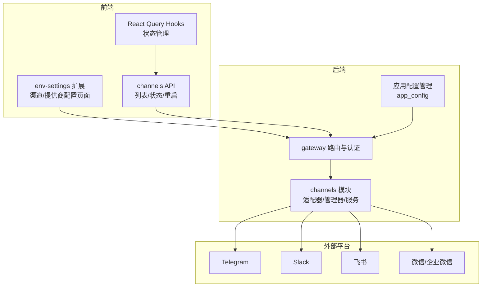
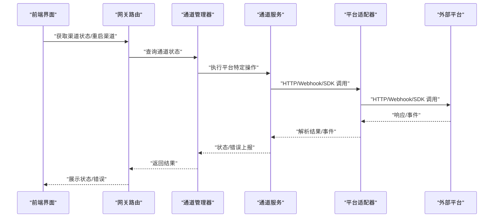
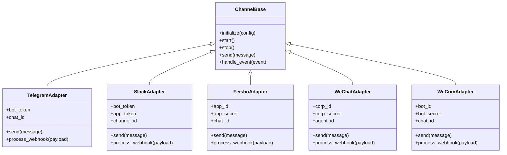
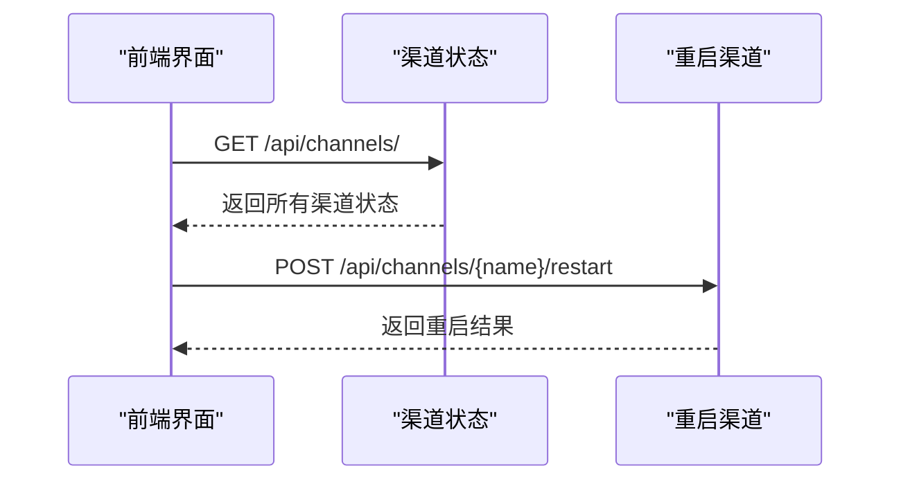
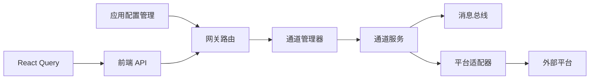

# 渠道配置

<cite>
**本文引用的文件**
- [backend/app/channels/base.py](file://backend/app/channels/base.py)
- [backend/app/channels/telegram.py](file://backend/app/channels/telegram.py)
- [backend/app/channels/feishu.py](file://backend/app/channels/feishu.py)
- [backend/app/channels/slack.py](file://backend/app/channels/slack.py)
- [backend/app/channels/wechat.py](file://backend/app/channels/wechat.py)
- [backend/app/channels/wecom.py](file://backend/app/channels/wecom.py)
- [backend/app/channels/manager.py](file://backend/app/channels/manager.py)
- [backend/app/channels/service.py](file://backend/app/channels/service.py)
- [backend/app/channels/message_bus.py](file://backend/app/channels/message_bus.py)
- [backend/app/channels/store.py](file://backend/app/channels/store.py)
- [backend/app/gateway/routers/channels.py](file://backend/app/gateway/routers/channels.py)
- [backend/app/gateway/auth/config.py](file://backend/app/gateway/auth/config.py)
- [backend/app/gateway/config.py](file://backend/app/gateway/config.py)
- [backend/packages/harness/deerflow/config/app_config.py](file://backend/packages/harness/deerflow/config/app_config.py)
- [docs/channels/README.md](file://docs/channels/README.md)
- [docs/channels/TELEGRAM.md](file://docs/channels/TELEGRAM.md)
- [docs/channels/SLACK.md](file://docs/channels/SLACK.md)
- [docs/channels/FEISHU.md](file://docs/channels/FEISHU.md)
- [docs/channels/WECHAT.md](file://docs/channels/WECHAT.md)
- [docs/channels/WECOM.md](file://docs/channels/WECOM.md)
- [frontend/extensions/env-settings/channels.ts](file://frontend/extensions/env-settings/channels.ts)
- [frontend/extensions/env-settings/providers.ts](file://frontend/extensions/env-settings/providers.ts)
- [frontend/extensions/env-settings/types.ts](file://frontend/extensions/env-settings/types.ts)
- [frontend/extensions/env-settings/provider-settings-page.tsx](file://frontend/extensions/env-settings/provider-settings-page.tsx)
- [frontend/extensions/env-settings/channel-settings-page.tsx](file://frontend/extensions/env-settings/channel-settings-page.tsx)
- [frontend/src/core/channels/api.ts](file://frontend/src/core/channels/api.ts)
- [frontend/src/core/channels/hooks.ts](file://frontend/src/core/channels/hooks.ts)
- [frontend/src/core/channels/types.ts](file://frontend/src/core/channels/types.ts)
- [config.example.yaml](file://config.example.yaml)
- [extensions_config.example.json](file://extensions_config.example.json)
</cite>

## 更新摘要
**所做更改**
- 移除了钉钉(DingTalk)和Discord渠道配置的相关内容，简化了渠道配置系统
- 更新了支持的渠道列表，从7个减少到5个
- 删除了通道连接系统配置管理章节中关于DingTalk和Discord的部分
- 更新了架构图和组件分析，移除了相关渠道的配置和连接信息
- 简化了前端配置界面章节，移除了对应渠道的连接管理功能

## 目录
1. [简介](#简介)
2. [项目结构](#项目结构)
3. [核心组件](#核心组件)
4. [架构总览](#架构总览)
5. [详细组件分析](#详细组件分析)
6. [渠道认证配置](#渠道认证配置)
7. [Webhook 设置与消息路由规则](#webhook-设置与消息路由规则)
8. [渠道特定参数配置](#渠道特定参数配置)
9. [前端配置界面与 API 接口](#前端配置界面与-api-接口)
10. [依赖关系分析](#依赖关系分析)
11. [性能考虑](#性能考虑)
12. [故障排除指南](#故障排除指南)
13. [结论](#结论)
14. [附录](#附录)

## 简介
本技术文档面向 DeerFlow 的渠道配置与集成，系统性介绍即时通讯渠道（Telegram、Slack、飞书、微信企业微信）的配置方法、认证设置、Webhook 配置、消息路由规则以及各渠道特有的参数（如机器人令牌、频道/群组 ID、应用密钥等）。文档涵盖了渠道适配器、管理器、服务层、消息总线与存储等核心组件，以及前端配置界面与 API 接口。特别关注安全最佳实践、连接状态监控与故障排除方法，帮助用户顺利完成多渠道集成与日常运维。

## 项目结构
DeerFlow 的渠道能力由后端通道模块、前端环境设置扩展和应用配置管理共同实现，核心目录如下：
- 后端通道模块：位于 backend/app/channels，包含各平台适配器、管理器、服务层、消息总线与存储等。
- 应用配置管理：位于 backend/packages/harness/deerflow/config，负责全局应用配置加载与管理。
- 前端环境设置扩展：位于 frontend/extensions/env-settings，提供渠道与提供商的可视化配置界面。
- 文档：位于 docs/channels，提供各平台的配置指引与最佳实践。
- 网关路由与认证：位于 backend/app/gateway，负责对外接口、鉴权与运行时配置。

**图表来源**
- [backend/app/channels/service.py](file://backend/app/channels/service.py)
- [backend/app/gateway/routers/channels.py](file://backend/app/gateway/routers/channels.py)
- [backend/packages/harness/deerflow/config/app_config.py](file://backend/packages/harness/deerflow/config/app_config.py)
- [frontend/extensions/env-settings/channels.ts](file://frontend/extensions/env-settings/channels.ts)
- [frontend/src/core/channels/api.ts](file://frontend/src/core/channels/api.ts)

**章节来源**
- [backend/app/channels/base.py](file://backend/app/channels/base.py)
- [backend/app/channels/manager.py](file://backend/app/channels/manager.py)
- [backend/app/gateway/routers/channels.py](file://backend/app/gateway/routers/channels.py)
- [frontend/extensions/env-settings/channels.ts](file://frontend/extensions/env-settings/channels.ts)

## 核心组件
- 通道基类与适配器：定义统一的通道接口与生命周期，各平台通过继承实现具体逻辑。
- 通道管理器：负责通道实例化、启动/停止、状态维护与事件分发。
- 通道服务：封装通道与外部平台交互的业务逻辑，如发送消息、处理回调等。
- 消息总线：在通道内部或跨通道传递消息事件，支持订阅/发布模式。
- 存储：持久化通道元数据、路由规则、认证信息等。
- 网关路由与认证：提供对外 API、鉴权与配置加载。
- 前端环境设置扩展：提供可视化的渠道与提供商配置界面。
- 应用配置管理：负责全局应用配置的加载、解析与管理。

**章节来源**
- [backend/app/channels/base.py](file://backend/app/channels/base.py)
- [backend/app/channels/manager.py](file://backend/app/channels/manager.py)
- [backend/app/channels/service.py](file://backend/app/channels/service.py)
- [backend/app/channels/message_bus.py](file://backend/app/channels/message_bus.py)
- [backend/app/channels/store.py](file://backend/app/channels/store.py)
- [backend/app/gateway/routers/channels.py](file://backend/app/gateway/routers/channels.py)
- [backend/app/gateway/auth/config.py](file://backend/app/gateway/auth/config.py)
- [backend/packages/harness/deerflow/config/app_config.py](file://backend/packages/harness/deerflow/config/app_config.py)
- [frontend/extensions/env-settings/channels.ts](file://frontend/extensions/env-settings/channels.ts)

## 架构总览
下图展示了从前端到后端网关、通道管理器、通道服务与各平台适配器的整体调用链路与数据流。

**图表来源**
- [backend/app/gateway/routers/channels.py](file://backend/app/gateway/routers/channels.py)
- [backend/app/channels/manager.py](file://backend/app/channels/manager.py)
- [backend/app/channels/service.py](file://backend/app/channels/service.py)
- [backend/app/channels/base.py](file://backend/app/channels/base.py)

## 详细组件分析

### 通用通道架构与流程
- 统一接口：所有平台适配器遵循相同的生命周期与接口约定，便于替换与扩展。
- 配置驱动：通过应用配置与环境变量加载渠道参数，支持热更新。
- 事件驱动：使用消息总线进行内部事件分发，降低耦合度。
- 安全优先：敏感信息通过鉴权配置与密钥管理机制保护。

**图表来源**
- [backend/app/channels/base.py](file://backend/app/channels/base.py)
- [backend/app/channels/telegram.py](file://backend/app/channels/telegram.py)
- [backend/app/channels/slack.py](file://backend/app/channels/slack.py)
- [backend/app/channels/feishu.py](file://backend/app/channels/feishu.py)
- [backend/app/channels/wechat.py](file://backend/app/channels/wechat.py)
- [backend/app/channels/wecom.py](file://backend/app/channels/wecom.py)

**章节来源**
- [backend/app/channels/base.py](file://backend/app/channels/base.py)
- [backend/app/channels/telegram.py](file://backend/app/channels/telegram.py)
- [backend/app/channels/slack.py](file://backend/app/channels/slack.py)
- [backend/app/channels/feishu.py](file://backend/app/channels/feishu.py)
- [backend/app/channels/wechat.py](file://backend/app/channels/wechat.py)
- [backend/app/channels/wecom.py](file://backend/app/channels/wecom.py)

### 渠道认证配置
- Telegram：需要机器人令牌与目标聊天对象标识；建议使用长连接或轮询策略，并开启防重放。
- Slack：需要 Bot 用户令牌与 App-Level Token，用于事件订阅与消息发送；需配置事件权限范围。
- 飞书：需要应用 ID 与应用密钥；支持自建应用与内测版应用；注意回调地址与加密校验。
- 微信/企业微信：需要企业 ID、应用密钥与应用 Agent ID；支持服务端回调与消息加解密。

**章节来源**
- [docs/channels/TELEGRAM.md](file://docs/channels/TELEGRAM.md)
- [docs/channels/SLACK.md](file://docs/channels/SLACK.md)
- [docs/channels/FEISHU.md](file://docs/channels/FEISHU.md)
- [docs/channels/WECHAT.md](file://docs/channels/WECHAT.md)
- [docs/channels/WECOM.md](file://docs/channels/WECOM.md)

### Webhook 设置与消息路由规则
- Webhook 回调：各平台回调地址需在平台侧配置，后端通道服务负责接收与解析。
- 路由规则：基于消息类型、来源渠道、目标群组等维度进行路由决策；可结合标签/规则引擎实现动态转发。
- 事件处理：消息总线负责将事件分发至订阅者，支持异步处理与失败重试。
- 安全校验：回调签名验证、IP 白名单、时间戳容差等措施确保请求可信。

**章节来源**
- [backend/app/channels/service.py](file://backend/app/channels/service.py)
- [backend/app/channels/message_bus.py](file://backend/app/channels/message_bus.py)
- [docs/channels/README.md](file://docs/channels/README.md)

### 渠道特定参数配置
- Telegram：机器人令牌、聊天对象 ID、是否禁用预览、解析模式等。
- Slack：Bot 令牌、App 令牌、事件权限范围、默认频道等。
- 飞书：应用 ID、应用密钥、加密密钥、回调密钥、默认群组等。
- 微信/企业微信：企业 ID、应用密钥、Agent ID、回调地址、Token、EncodingAESKey。

**章节来源**
- [docs/channels/TELEGRAM.md](file://docs/channels/TELEGRAM.md)
- [docs/channels/SLACK.md](file://docs/channels/SLACK.md)
- [docs/channels/FEISHU.md](file://docs/channels/FEISHU.md)
- [docs/channels/WECHAT.md](file://docs/channels/WECHAT.md)
- [docs/channels/WECOM.md](file://docs/channels/WECOM.md)

## 前端配置界面与 API 接口

### 前端 API 接口设计
前端通过一组 RESTful API 与通道系统交互：

**图表来源**
- [frontend/src/core/channels/api.ts](file://frontend/src/core/channels/api.ts)
- [frontend/src/core/channels/hooks.ts](file://frontend/src/core/channels/hooks.ts)

### React Query 集成
前端使用 React Query 管理状态缓存和同步：

- **查询键管理**：`["channels"]` 获取渠道状态
- **自动刷新**：状态变更后自动重新获取数据
- **错误处理**：统一的错误处理和用户反馈
- **乐观更新**：支持乐观更新模式提升用户体验

### 前端类型定义
前端 TypeScript 类型定义确保类型安全：

- **ChannelStatusResponse**：渠道状态响应数据
- **ChannelRestartResponse**：重启渠道响应数据
- **ChannelProvider**：提供商信息和状态
- **ChannelConnection**：用户连接信息

**章节来源**
- [frontend/src/core/channels/api.ts](file://frontend/src/core/channels/api.ts)
- [frontend/src/core/channels/hooks.ts](file://frontend/src/core/channels/hooks.ts)
- [frontend/src/core/channels/types.ts](file://frontend/src/core/channels/types.ts)
- [frontend/extensions/env-settings/channels.ts](file://frontend/extensions/env-settings/channels.ts)

## 依赖关系分析
- 组件耦合：通道适配器依赖通道服务与消息总线；通道服务依赖存储与配置；网关路由依赖通道管理器。
- 前端依赖：前端 API 层依赖后端路由，使用 React Query 进行状态管理。
- 外部依赖：各平台 SDK/HTTP 接口、Webhook 回调、鉴权服务。
- 配置来源：应用配置文件与环境变量，前端扩展负责可视化编辑。

**图表来源**
- [backend/app/gateway/routers/channels.py](file://backend/app/gateway/routers/channels.py)
- [backend/app/channels/manager.py](file://backend/app/channels/manager.py)
- [backend/app/channels/service.py](file://backend/app/channels/service.py)
- [backend/app/channels/message_bus.py](file://backend/app/channels/message_bus.py)
- [backend/app/channels/base.py](file://backend/app/channels/base.py)
- [backend/packages/harness/deerflow/config/app_config.py](file://backend/packages/harness/deerflow/config/app_config.py)

**章节来源**
- [backend/app/gateway/routers/channels.py](file://backend/app/gateway/routers/channels.py)
- [backend/app/channels/manager.py](file://backend/app/channels/manager.py)
- [backend/app/channels/service.py](file://backend/app/channels/service.py)
- [backend/app/channels/message_bus.py](file://backend/app/channels/message_bus.py)
- [backend/app/channels/base.py](file://backend/app/channels/base.py)
- [backend/packages/harness/deerflow/config/app_config.py](file://backend/packages/harness/deerflow/config/app_config.py)

## 性能考虑
- 异步处理：消息总线采用异步事件分发，避免阻塞主流程。
- 连接池与限流：对平台 API 调用实施连接池与速率限制，防止触发平台限流。
- 缓存与去重：对重复消息进行去重处理，减少无效调用。
- 超时与重试：合理设置超时与指数退避重试策略，提升稳定性。
- 监控指标：记录发送成功率、延迟、错误码分布，辅助容量规划与问题定位。

## 故障排除指南
- 认证失败：检查令牌/密钥是否正确、权限范围是否足够、回调地址是否可达。
- Webhook 不生效：确认平台侧回调地址配置、签名验证逻辑、网络连通性与防火墙策略。
- 消息未送达：核对目标 ID 是否正确、平台权限是否变更、是否存在屏蔽/风控。
- 连接异常：查看通道状态日志、重试队列与错误统计，必要时重启通道实例。
- 安全告警：启用回调签名、IP 白名单、时间戳校验，定期轮换密钥。
- 前端配置问题：确认 API 端点可访问性，检查 React Query 缓存状态，验证用户权限和认证状态。

**章节来源**
- [docs/channels/README.md](file://docs/channels/README.md)
- [backend/app/channels/service.py](file://backend/app/channels/service.py)
- [backend/app/gateway/auth/config.py](file://backend/app/gateway/auth/config.py)
- [backend/app/gateway/routers/channels.py](file://backend/app/gateway/routers/channels.py)

## 结论
通过统一的通道架构和完善的前端配置界面，DeerFlow 支持多平台即时通讯渠道的快速接入与稳定运行。经过简化后的渠道配置系统专注于核心的 Telegram、Slack、飞书、微信企业微信等主流平台，提供了清晰的配置流程和故障排除方法。遵循本文提供的配置步骤、安全最佳实践与故障排除方法，用户可以高效完成渠道集成与日常运维。

## 附录
- 参考文档：各平台官方文档与 DeerFlow 文档中的渠道配置说明。
- 示例配置：参考应用配置示例文件，按需调整参数。
- 支持的渠道：Telegram、Slack、飞书、微信、企业微信。

**章节来源**
- [docs/channels/README.md](file://docs/channels/README.md)
- [config.example.yaml](file://config.example.yaml)
- [extensions_config.example.json](file://extensions_config.example.json)
- [backend/packages/harness/deerflow/config/app_config.py](file://backend/packages/harness/deerflow/config/app_config.py)