# 配置管理

<cite>
**本文引用的文件**
- [config.example.yaml](file://config.example.yaml)
- [extensions_config.example.json](file://extensions_config.example.json)
- [backend/app/gateway/config.py](file://backend/app/gateway/config.py)
- [backend/app/gateway/auth/config.py](file://backend/app/gateway/auth/config.py)
- [backend/packages/harness/deerflow/config/app_config.py](file://backend/packages/harness/deerflow/config/app_config.py)
- [backend/packages/harness/deerflow/config/model_config.py](file://backend/packages/harness/deerflow/config/model_config.py)
- [backend/packages/harness/deerflow/config/sandbox_config.py](file://backend/packages/harness/deerflow/config/sandbox_config.py)
- [backend/packages/harness/deerflow/config/skills_config.py](file://backend/packages/harness/deerflow/config/skills_config.py)
- [backend/packages/harness/deerflow/config/memory_config.py](file://backend/packages/harness/deerflow/config/memory_config.py)
- [backend/packages/harness/deerflow/config/guardrails_config.py](file://backend/packages/harness/deerflow/config/guardrails_config.py)
- [backend/packages/harness/deerflow/config/token_usage_config.py](file://backend/packages/harness/deerflow/config/token_usage_config.py)
- [backend/packages/harness/deerflow/config/loop_detection_config.py](file://backend/packages/harness/deerflow/config/loop_detection_config.py)
- [backend/packages/harness/deerflow/config/safety_finish_reason_config.py](file://backend/packages/harness/deerflow/config/safety_finish_reason_config.py)
- [backend/packages/harness/deerflow/config/tracing_config.py](file://backend/packages/harness/deerflow/config/tracing_config.py)
- [backend/packages/harness/deerflow/config/subagents_config.py](file://backend/packages/harness/deerflow/config/subagents_config.py)
- [backend/packages/harness/deerflow/config/tool_config.py](file://backend/packages/harness/deerflow/config/tool_config.py)
- [backend/packages/harness/deerflow/config/tool_output_config.py](file://backend/packages/harness/deerflow/config/tool_output_config.py)
- [backend/packages/harness/deerflow/config/tool_search_config.py](file://backend/packages/harness/deerflow/config/tool_search_config.py)
- [backend/packages/harness/deerflow/config/stream_bridge_config.py](file://backend/packages/harness/deerflow/config/stream_bridge_config.py)
- [backend/packages/harness/deerflow/config/checkpointer_config.py](file://backend/packages/harness/deerflow/config/checkpointer_config.py)
- [backend/packages/harness/deerflow/config/database_config.py](file://backend/packages/harness/deerflow/config/database_config.py)
- [backend/packages/harness/deerflow/config/run_events_config.py](file://backend/packages/harness/deerflow/config/run_events_config.py)
- [backend/packages/harness/deerflow/config/skill_evolution_config.py](file://backend/packages/harness/deerflow/config/skill_evolution_config.py)
- [backend/packages/harness/deerflow/config/title_config.py](file://backend/packages/harness/deerflow/config/title_config.py)
- [backend/packages/harness/deerflow/config/summarization_config.py](file://backend/packages/harness/deerflow/config/summarization_config.py)
- [backend/packages/harness/deerflow/config/agents_config.py](file://backend/packages/harness/deerflow/config/agents_config.py)
- [backend/packages/harness/deerflow/config/agents_api_config.py](file://backend/packages/harness/deerflow/config/agents_api_config.py)
- [backend/packages/harness/deerflow/config/acp_config.py](file://backend/packages/harness/deerflow/config/acp_config.py)
- [backend/packages/harness/deerflow/config/extensions_config.py](file://backend/packages/harness/deerflow/config/extensions_config.py)
- [backend/docs/CONFIGURATION.md](file://backend/docs/CONFIGURATION.md)
- [backend/docs/MEMORY_SETTINGS_REVIEW.md](file://backend/docs/MEMORY_SETTINGS_REVIEW.md)
- [backend/docs/MEMORY_IMPROVEMENTS.md](file://backend/docs/MEMORY_IMPROVEMENTS.md)
- [backend/docs/MEMORY_IMPROVEMENTS_SUMMARY.md](file://backend/docs/MEMORY_IMPROVEMENTS_SUMMARY.md)
- [backend/docs/middleware-execution-flow.md](file://backend/docs/middleware-execution-flow.md)
- [backend/tests/test_app_config_reload.py](file://backend/tests/test_app_config_reload.py)
- [backend/tests/test_model_config.py](file://backend/tests/test_model_config.py)
- [backend/tests/test_sandbox_config.py](file://backend/tests/test_sandbox_config.py)
- [backend/tests/test_skills_config.py](file://backend/tests/test_skills_config.py)
- [backend/tests/test_memory_config.py](file://backend/tests/test_memory_config.py)
- [backend/tests/test_guardrails_config.py](file://backend/tests/test_guardrails_config.py)
- [backend/tests/test_token_usage_config.py](file://backend/tests/test_token_usage_config.py)
- [backend/tests/test_loop_detection_config.py](file://backend/tests/test_loop_detection_config.py)
- [backend/tests/test_safety_finish_reason_config.py](file://backend/tests/test_safety_finish_reason_config.py)
- [backend/tests/test_tracing_config.py](file://backend/tests/test_tracing_config.py)
- [backend/tests/test_subagents_config.py](file://backend/tests/test_subagents_config.py)
- [backend/tests/test_tool_config.py](file://backend/tests/test_tool_config.py)
- [backend/tests/test_tool_output_config.py](file://backend/tests/test_tool_output_config.py)
- [backend/tests/test_tool_search_config.py](file://backend/tests/test_tool_search_config.py)
- [backend/tests/test_stream_bridge_config.py](file://backend/tests/test_stream_bridge_config.py)
- [backend/tests/test_checkpointer_config.py](file://backend/tests/test_checkpointer_config.py)
- [backend/tests/test_database_config.py](file://backend/tests/test_database_config.py)
- [backend/tests/test_run_events_config.py](file://backend/tests/test_run_events_config.py)
- [backend/tests/test_skill_evolution_config.py](file://backend/tests/test_skill_evolution_config.py)
- [backend/tests/test_title_config.py](file://backend/tests/test_title_config.py)
- [backend/tests/test_summarization_config.py](file://backend/tests/test_summarization_config.py)
- [backend/tests/test_agents_config.py](file://backend/tests/test_agents_config.py)
- [backend/tests/test_agents_api_config.py](file://backend/tests/test_agents_api_config.py)
- [backend/tests/test_acp_config.py](file://backend/tests/test_acp_config.py)
- [backend/tests/test_extensions_config.py](file://backend/tests/test_extensions_config.py)
</cite>

## 目录
1. [简介](#简介)
2. [项目结构](#项目结构)
3. [核心组件](#核心组件)
4. [架构总览](#架构总览)
5. [详细组件分析](#详细组件分析)
6. [依赖关系分析](#依赖关系分析)
7. [性能考量](#性能考量)
8. [故障排除指南](#故障排除指南)
9. [结论](#结论)
10. [附录](#附录)

## 简介
本文件面向 DeerFlow 的配置管理，系统性梳理应用配置文件结构、环境变量管理、动态配置更新与配置验证机制；深入解析模型配置（LLM 提供商、参数调优、费用控制、失败重试）、沙箱配置、技能配置、渠道配置等，并提供最佳实践、安全与性能优化建议及故障排除指引。内容基于仓库中实际存在的配置模块与测试用例进行归纳总结。

## 项目结构
DeerFlow 的配置体系由“顶层 YAML 示例配置”、“后端 Harness 配置模块”、“网关与认证配置”以及“扩展配置”四部分构成：
- 顶层配置：提供全局开关、日志级别、运行模式、数据库与中间件等基础项
- 后端 Harness 配置：按功能域拆分的子配置模块，覆盖模型、沙箱、技能、内存、守卫护栏、追踪、工具链等
- 网关与认证配置：负责路由层的鉴权与认证相关配置
- 扩展配置：用于扩展模块的启用、参数与生命周期管理

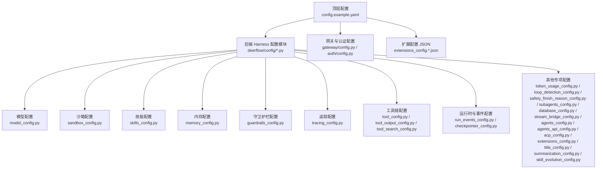

图示来源
- [config.example.yaml](file://config.example.yaml)
- [backend/packages/harness/deerflow/config/model_config.py](file://backend/packages/harness/deerflow/config/model_config.py)
- [backend/packages/harness/deerflow/config/sandbox_config.py](file://backend/packages/harness/deerflow/config/sandbox_config.py)
- [backend/packages/harness/deerflow/config/skills_config.py](file://backend/packages/harness/deerflow/config/skills_config.py)
- [backend/packages/harness/deerflow/config/memory_config.py](file://backend/packages/harness/deerflow/config/memory_config.py)
- [backend/packages/harness/deerflow/config/guardrails_config.py](file://backend/packages/harness/deerflow/config/guardrails_config.py)
- [backend/packages/harness/deerflow/config/tracing_config.py](file://backend/packages/harness/deerflow/config/tracing_config.py)
- [backend/packages/harness/deerflow/config/tool_config.py](file://backend/packages/harness/deerflow/config/tool_config.py)
- [backend/packages/harness/deerflow/config/tool_output_config.py](file://backend/packages/harness/deerflow/config/tool_output_config.py)
- [backend/packages/harness/deerflow/config/tool_search_config.py](file://backend/packages/harness/deerflow/config/tool_search_config.py)
- [backend/packages/harness/deerflow/config/run_events_config.py](file://backend/packages/harness/deerflow/config/run_events_config.py)
- [backend/packages/harness/deerflow/config/checkpointer_config.py](file://backend/packages/harness/deerflow/config/checkpointer_config.py)
- [backend/packages/harness/deerflow/config/token_usage_config.py](file://backend/packages/harness/deerflow/config/token_usage_config.py)
- [backend/packages/harness/deerflow/config/loop_detection_config.py](file://backend/packages/harness/deerflow/config/loop_detection_config.py)
- [backend/packages/harness/deerflow/config/safety_finish_reason_config.py](file://backend/packages/harness/deerflow/config/safety_finish_reason_config.py)
- [backend/packages/harness/deerflow/config/subagents_config.py](file://backend/packages/harness/deerflow/config/subagents_config.py)
- [backend/packages/harness/deerflow/config/database_config.py](file://backend/packages/harness/deerflow/config/database_config.py)
- [backend/packages/harness/deerflow/config/stream_bridge_config.py](file://backend/packages/harness/deerflow/config/stream_bridge_config.py)
- [backend/packages/harness/deerflow/config/agents_config.py](file://backend/packages/harness/deerflow/config/agents_config.py)
- [backend/packages/harness/deerflow/config/agents_api_config.py](file://backend/packages/harness/deerflow/config/agents_api_config.py)
- [backend/packages/harness/deerflow/config/acp_config.py](file://backend/packages/harness/deerflow/config/acp_config.py)
- [backend/packages/harness/deerflow/config/extensions_config.py](file://backend/packages/harness/deerflow/config/extensions_config.py)
- [backend/app/gateway/config.py](file://backend/app/gateway/config.py)
- [backend/app/gateway/auth/config.py](file://backend/app/gateway/auth/config.py)
- [extensions_config.example.json](file://extensions_config.example.json)

章节来源
- [config.example.yaml](file://config.example.yaml)
- [extensions_config.example.json](file://extensions_config.example.json)
- [backend/app/gateway/config.py](file://backend/app/gateway/config.py)
- [backend/app/gateway/auth/config.py](file://backend/app/gateway/auth/config.py)

## 核心组件
- 应用配置（AppConfig）
  - 负责加载顶层 YAML 配置，提供统一入口与默认值合并逻辑
  - 支持运行模式、日志级别、中间件栈、数据库连接等全局项
- 模型配置（ModelConfig）
  - 定义 LLM 提供商、模型名称、参数映射、费用控制与失败重试策略
  - 支持多提供商适配与参数调优
- 沙箱配置（SandboxConfig）
  - 控制沙箱执行模式、资源限制、文件操作策略与安全策略
- 技能配置（SkillsConfig）
  - 管理技能目录、权限策略、安装与加载流程
- 内存配置（MemoryConfig）
  - 控制记忆存储、队列行为、序列化与隔离策略
- 守卫护栏配置（GuardrailsConfig）
  - 定义内容安全策略、敏感词过滤与主题拦截
- 追踪配置（TracingConfig）
  - 控制链路追踪、采样策略与元数据注入
- 工具链配置（ToolConfig/ToolOutputConfig/ToolSearchConfig）
  - 管理工具注册、输出预算与截断、搜索工具参数
- 运行时与事件配置（RunEventsConfig/CheckpointerConfig）
  - 控制运行事件存储、检查点持久化与恢复
- 其他专项配置（TokenUsageConfig/LoopDetectionConfig/SafetyFinishReasonConfig/SubagentsConfig/DatabaseConfig/StreamBridgeConfig/AgentsConfig/AgentsApiConfig/AcpConfig/ExtensionsConfig/TitleConfig/SummarizationConfig/SkillEvolutionConfig）
  - 分别覆盖令牌用量统计、环路检测、安全终止原因、子代理、数据库、流桥接、代理与 API、ACP、扩展、标题生成、摘要、技能演进等

章节来源
- [backend/packages/harness/deerflow/config/app_config.py](file://backend/packages/harness/deerflow/config/app_config.py)
- [backend/packages/harness/deerflow/config/model_config.py](file://backend/packages/harness/deerflow/config/model_config.py)
- [backend/packages/harness/deerflow/config/sandbox_config.py](file://backend/packages/harness/deerflow/config/sandbox_config.py)
- [backend/packages/harness/deerflow/config/skills_config.py](file://backend/packages/harness/deerflow/config/skills_config.py)
- [backend/packages/harness/deerflow/config/memory_config.py](file://backend/packages/harness/deerflow/config/memory_config.py)
- [backend/packages/harness/deerflow/config/guardrails_config.py](file://backend/packages/harness/deerflow/config/guardrails_config.py)
- [backend/packages/harness/deerflow/config/tracing_config.py](file://backend/packages/harness/deerflow/config/tracing_config.py)
- [backend/packages/harness/deerflow/config/tool_config.py](file://backend/packages/harness/deerflow/config/tool_config.py)
- [backend/packages/harness/deerflow/config/tool_output_config.py](file://backend/packages/harness/deerflow/config/tool_output_config.py)
- [backend/packages/harness/deerflow/config/tool_search_config.py](file://backend/packages/harness/deerflow/config/tool_search_config.py)
- [backend/packages/harness/deerflow/config/run_events_config.py](file://backend/packages/harness/deerflow/config/run_events_config.py)
- [backend/packages/harness/deerflow/config/checkpointer_config.py](file://backend/packages/harness/deerflow/config/checkpointer_config.py)
- [backend/packages/harness/deerflow/config/token_usage_config.py](file://backend/packages/harness/deerflow/config/token_usage_config.py)
- [backend/packages/harness/deerflow/config/loop_detection_config.py](file://backend/packages/harness/deerflow/config/loop_detection_config.py)
- [backend/packages/harness/deerflow/config/safety_finish_reason_config.py](file://backend/packages/harness/deerflow/config/safety_finish_reason_config.py)
- [backend/packages/harness/deerflow/config/subagents_config.py](file://backend/packages/harness/deerflow/config/subagents_config.py)
- [backend/packages/harness/deerflow/config/database_config.py](file://backend/packages/harness/deerflow/config/database_config.py)
- [backend/packages/harness/deerflow/config/stream_bridge_config.py](file://backend/packages/harness/deerflow/config/stream_bridge_config.py)
- [backend/packages/harness/deerflow/config/agents_config.py](file://backend/packages/harness/deerflow/config/agents_config.py)
- [backend/packages/harness/deerflow/config/agents_api_config.py](file://backend/packages/harness/deerflow/config/agents_api_config.py)
- [backend/packages/harness/deerflow/config/acp_config.py](file://backend/packages/harness/deerflow/config/acp_config.py)
- [backend/packages/harness/deerflow/config/extensions_config.py](file://backend/packages/harness/deerflow/config/extensions_config.py)
- [backend/packages/harness/deerflow/config/title_config.py](file://backend/packages/harness/deerflow/config/title_config.py)
- [backend/packages/harness/deerflow/config/summarization_config.py](file://backend/packages/harness/deerflow/config/summarization_config.py)
- [backend/packages/harness/deerflow/config/skill_evolution_config.py](file://backend/packages/harness/deerflow/config/skill_evolution_config.py)

## 架构总览
下图展示配置系统的总体交互：顶层 YAML 作为主入口，被应用配置模块加载；随后按需初始化各子配置模块；网关与认证配置在路由层生效；扩展配置通过 JSON 文件驱动扩展模块的生命周期与参数。

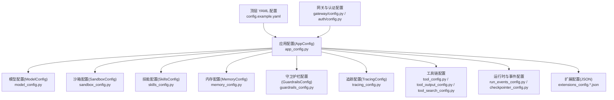

图示来源
- [config.example.yaml](file://config.example.yaml)
- [backend/packages/harness/deerflow/config/app_config.py](file://backend/packages/harness/deerflow/config/app_config.py)
- [backend/packages/harness/deerflow/config/model_config.py](file://backend/packages/harness/deerflow/config/model_config.py)
- [backend/packages/harness/deerflow/config/sandbox_config.py](file://backend/packages/harness/deerflow/config/sandbox_config.py)
- [backend/packages/harness/deerflow/config/skills_config.py](file://backend/packages/harness/deerflow/config/skills_config.py)
- [backend/packages/harness/deerflow/config/memory_config.py](file://backend/packages/harness/deerflow/config/memory_config.py)
- [backend/packages/harness/deerflow/config/guardrails_config.py](file://backend/packages/harness/deerflow/config/guardrails_config.py)
- [backend/packages/harness/deerflow/config/tracing_config.py](file://backend/packages/harness/deerflow/config/tracing_config.py)
- [backend/packages/harness/deerflow/config/tool_config.py](file://backend/packages/harness/deerflow/config/tool_config.py)
- [backend/packages/harness/deerflow/config/tool_output_config.py](file://backend/packages/harness/deerflow/config/tool_output_config.py)
- [backend/packages/harness/deerflow/config/tool_search_config.py](file://backend/packages/harness/deerflow/config/tool_search_config.py)
- [backend/packages/harness/deerflow/config/run_events_config.py](file://backend/packages/harness/deerflow/config/run_events_config.py)
- [backend/packages/harness/deerflow/config/checkpointer_config.py](file://backend/packages/harness/deerflow/config/checkpointer_config.py)
- [extensions_config.example.json](file://extensions_config.example.json)
- [backend/app/gateway/config.py](file://backend/app/gateway/config.py)
- [backend/app/gateway/auth/config.py](file://backend/app/gateway/auth/config.py)

## 详细组件分析

### 应用配置（AppConfig）
- 职责：加载顶层 YAML 配置，合并默认值，提供统一访问接口
- 关键点：支持运行模式、日志级别、中间件栈、数据库连接、路径与缓存策略
- 动态更新：通过测试用例验证配置热重载能力
- 验证机制：对关键字段进行存在性与类型校验

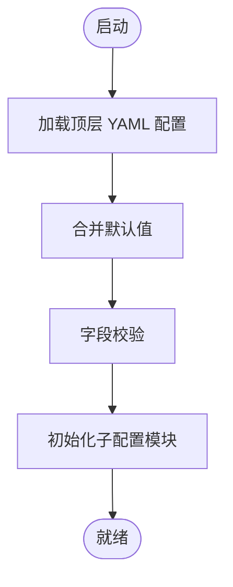

图示来源
- [backend/packages/harness/deerflow/config/app_config.py](file://backend/packages/harness/deerflow/config/app_config.py)
- [backend/tests/test_app_config_reload.py](file://backend/tests/test_app_config_reload.py)

章节来源
- [backend/packages/harness/deerflow/config/app_config.py](file://backend/packages/harness/deerflow/config/app_config.py)
- [backend/tests/test_app_config_reload.py](file://backend/tests/test_app_config_reload.py)

### 模型配置（ModelConfig）
- LLM 提供商：OpenAI、Claude、vLLM 等，支持 OAuth、API Key 等多种凭证方式
- 参数调优：温度、最大生成长度、频率惩罚、停用词等
- 费用控制：按模型与令牌计费，支持预算上限与告警
- 失败重试：指数退避、超时与熔断策略
- 验证：对提供商、模型名、参数范围进行校验

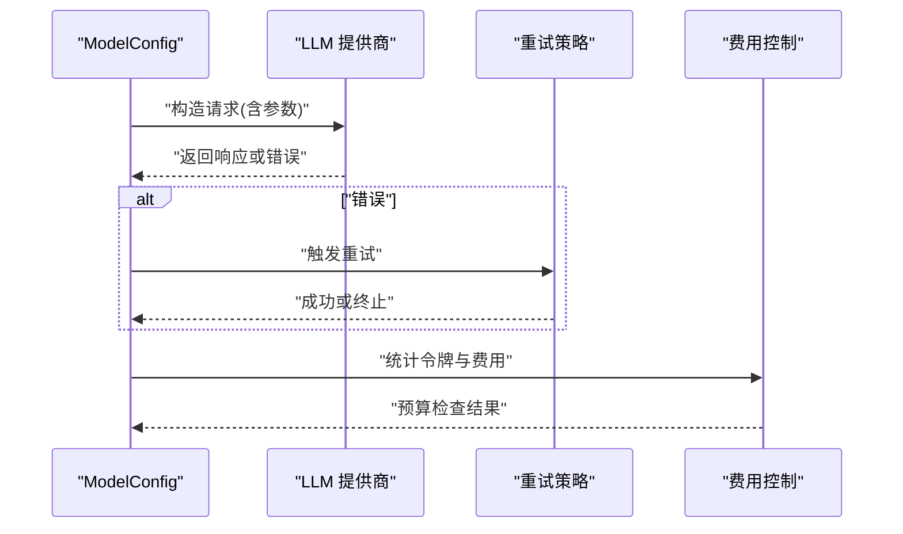

图示来源
- [backend/packages/harness/deerflow/config/model_config.py](file://backend/packages/harness/deerflow/config/model_config.py)
- [backend/tests/test_model_config.py](file://backend/tests/test_model_config.py)

章节来源
- [backend/packages/harness/deerflow/config/model_config.py](file://backend/packages/harness/deerflow/config/model_config.py)
- [backend/tests/test_model_config.py](file://backend/tests/test_model_config.py)

### 沙箱配置（SandboxConfig）
- 执行模式：本地/远程、Docker/非 Docker
- 资源限制：CPU、内存、磁盘配额
- 文件操作：白名单/黑名单、虚拟路径映射
- 安全策略：只读根文件系统、网络隔离、进程限制
- 验证：对模式、路径、限额进行合法性校验

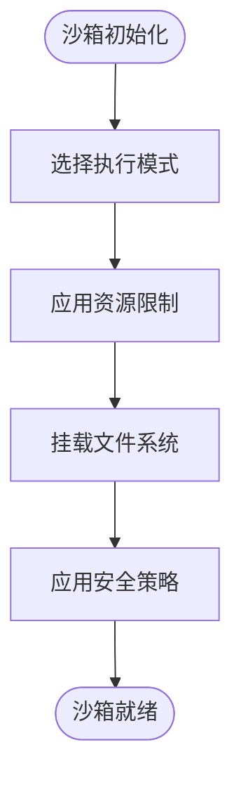

图示来源
- [backend/packages/harness/deerflow/config/sandbox_config.py](file://backend/packages/harness/deerflow/config/sandbox_config.py)
- [backend/tests/test_sandbox_config.py](file://backend/tests/test_sandbox_config.py)

章节来源
- [backend/packages/harness/deerflow/config/sandbox_config.py](file://backend/packages/harness/deerflow/config/sandbox_config.py)
- [backend/tests/test_sandbox_config.py](file://backend/tests/test_sandbox_config.py)

### 技能配置（SkillsConfig）
- 目录与权限：技能根目录、安装/卸载、权限扫描与策略
- 加载流程：解析技能清单、校验元数据、注册工具
- 验证：对路径、权限、元数据进行校验

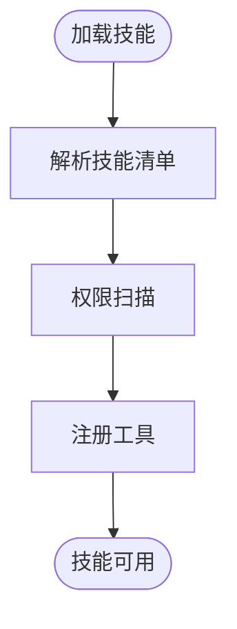

图示来源
- [backend/packages/harness/deerflow/config/skills_config.py](file://backend/packages/harness/deerflow/config/skills_config.py)
- [backend/tests/test_skills_config.py](file://backend/tests/test_skills_config.py)

章节来源
- [backend/packages/harness/deerflow/config/skills_config.py](file://backend/packages/harness/deerflow/config/skills_config.py)
- [backend/tests/test_skills_config.py](file://backend/tests/test_skills_config.py)

### 内存配置（MemoryConfig）
- 存储：持久化队列、序列化格式、压缩策略
- 隔离：用户隔离、会话隔离、过期清理
- 性能：批量写入、异步刷新、容量阈值

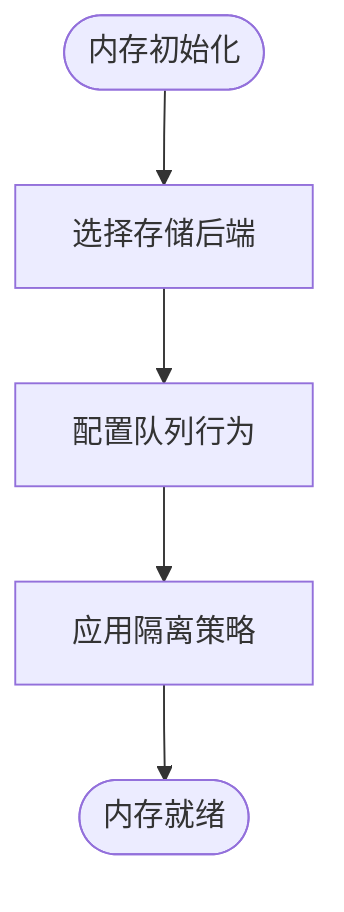

图示来源
- [backend/packages/harness/deerflow/config/memory_config.py](file://backend/packages/harness/deerflow/config/memory_config.py)
- [backend/tests/test_memory_config.py](file://backend/tests/test_memory_config.py)

章节来源
- [backend/packages/harness/deerflow/config/memory_config.py](file://backend/packages/harness/deerflow/config/memory_config.py)
- [backend/tests/test_memory_config.py](file://backend/tests/test_memory_config.py)

### 守卫护栏配置（GuardrailsConfig）
- 敏感词过滤：内置与自定义词表、白名单
- 主题拦截：基于 YAML 的主题规则与匹配策略
- 中间件集成：在消息处理链路中执行

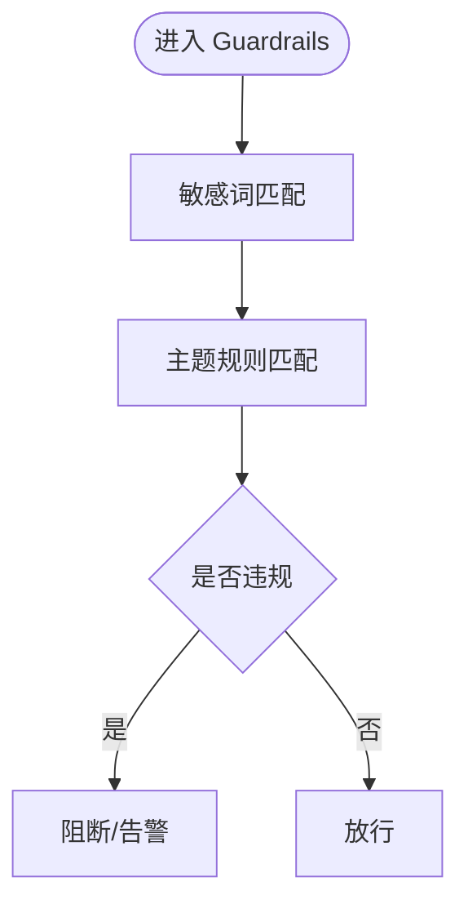

图示来源
- [backend/packages/harness/deerflow/config/guardrails_config.py](file://backend/packages/harness/deerflow/config/guardrails_config.py)
- [backend/tests/test_guardrails_config.py](file://backend/tests/test_guardrails_config.py)

章节来源
- [backend/packages/harness/deerflow/config/guardrails_config.py](file://backend/packages/harness/deerflow/config/guardrails_config.py)
- [backend/tests/test_guardrails_config.py](file://backend/tests/test_guardrails_config.py)

### 追踪配置（TracingConfig）
- 追踪提供方：OpenTelemetry、Langfuse 等
- 采样策略：固定比例、动态采样
- 元数据注入：链路 ID、用户上下文、费用标签

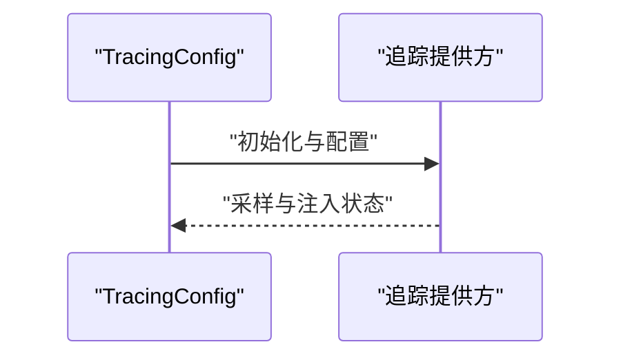

图示来源
- [backend/packages/harness/deerflow/config/tracing_config.py](file://backend/packages/harness/deerflow/config/tracing_config.py)
- [backend/tests/test_tracing_config.py](file://backend/tests/test_tracing_config.py)

章节来源
- [backend/packages/harness/deerflow/config/tracing_config.py](file://backend/packages/harness/deerflow/config/tracing_config.py)
- [backend/tests/test_tracing_config.py](file://backend/tests/test_tracing_config.py)

### 工具链配置（ToolConfig/ToolOutputConfig/ToolSearchConfig）
- 工具注册：工具清单、参数模式、权限控制
- 输出预算与截断：限制输出大小、JSON/文本截断策略
- 搜索工具：搜索引擎参数、结果数量与排序

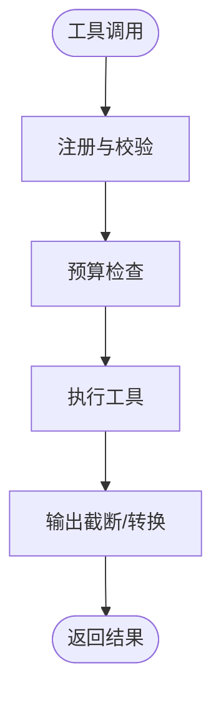

图示来源
- [backend/packages/harness/deerflow/config/tool_config.py](file://backend/packages/harness/deerflow/config/tool_config.py)
- [backend/packages/harness/deerflow/config/tool_output_config.py](file://backend/packages/harness/deerflow/config/tool_output_config.py)
- [backend/packages/harness/deerflow/config/tool_search_config.py](file://backend/packages/harness/deerflow/config/tool_search_config.py)
- [backend/tests/test_tool_config.py](file://backend/tests/test_tool_config.py)
- [backend/tests/test_tool_output_config.py](file://backend/tests/test_tool_output_config.py)
- [backend/tests/test_tool_search_config.py](file://backend/tests/test_tool_search_config.py)

章节来源
- [backend/packages/harness/deerflow/config/tool_config.py](file://backend/packages/harness/deerflow/config/tool_config.py)
- [backend/packages/harness/deerflow/config/tool_output_config.py](file://backend/packages/harness/deerflow/config/tool_output_config.py)
- [backend/packages/harness/deerflow/config/tool_search_config.py](file://backend/packages/harness/deerflow/config/tool_search_config.py)
- [backend/tests/test_tool_config.py](file://backend/tests/test_tool_config.py)
- [backend/tests/test_tool_output_config.py](file://backend/tests/test_tool_output_config.py)
- [backend/tests/test_tool_search_config.py](file://backend/tests/test_tool_search_config.py)

### 运行时与事件配置（RunEventsConfig/CheckpointerConfig）
- 运行事件存储：事件格式、分页、索引策略
- 检查点持久化：序列化、并发安全、恢复策略

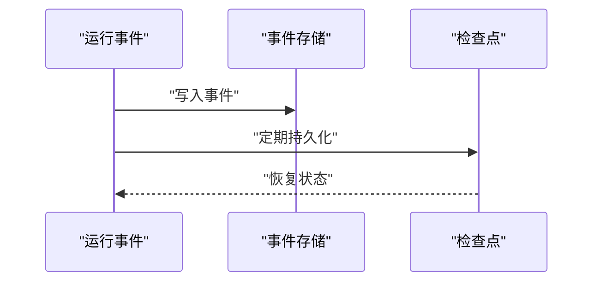

图示来源
- [backend/packages/harness/deerflow/config/run_events_config.py](file://backend/packages/harness/deerflow/config/run_events_config.py)
- [backend/packages/harness/deerflow/config/checkpointer_config.py](file://backend/packages/harness/deerflow/config/checkpointer_config.py)
- [backend/tests/test_run_events_config.py](file://backend/tests/test_run_events_config.py)
- [backend/tests/test_checkpointer_config.py](file://backend/tests/test_checkpointer_config.py)

章节来源
- [backend/packages/harness/deerflow/config/run_events_config.py](file://backend/packages/harness/deerflow/config/run_events_config.py)
- [backend/packages/harness/deerflow/config/checkpointer_config.py](file://backend/packages/harness/deerflow/config/checkpointer_config.py)
- [backend/tests/test_run_events_config.py](file://backend/tests/test_run_events_config.py)
- [backend/tests/test_checkpointer_config.py](file://backend/tests/test_checkpointer_config.py)

### 其他专项配置
- 令牌用量统计（TokenUsageConfig）：统计输入/输出令牌，支持预算与告警
- 环路检测（LoopDetectionConfig）：防止循环推理与重复动作
- 安全终止原因（SafetyFinishReasonConfig）：记录与上报安全终止原因
- 子代理（SubagentsConfig）：子代理数量、超时与令牌收集
- 数据库（DatabaseConfig）：连接池、事务隔离、迁移策略
- 流桥接（StreamBridgeConfig）：SSE/WS 流桥接与缓冲策略
- 代理与 API（AgentsConfig/AgentsApiConfig）：代理工厂、兼容层与 API 规范
- ACP（AcpConfig）：访问控制策略与授权
- 扩展（ExtensionsConfig）：扩展启用、参数与生命周期
- 标题生成（TitleConfig）：标题生成策略与模板
- 摘要（SummarizationConfig）：摘要长度、算法与缓存
- 技能演进（SkillEvolutionConfig）：技能评估与迭代

章节来源
- [backend/packages/harness/deerflow/config/token_usage_config.py](file://backend/packages/harness/deerflow/config/token_usage_config.py)
- [backend/packages/harness/deerflow/config/loop_detection_config.py](file://backend/packages/harness/deerflow/config/loop_detection_config.py)
- [backend/packages/harness/deerflow/config/safety_finish_reason_config.py](file://backend/packages/harness/deerflow/config/safety_finish_reason_config.py)
- [backend/packages/harness/deerflow/config/subagents_config.py](file://backend/packages/harness/deerflow/config/subagents_config.py)
- [backend/packages/harness/deerflow/config/database_config.py](file://backend/packages/harness/deerflow/config/database_config.py)
- [backend/packages/harness/deerflow/config/stream_bridge_config.py](file://backend/packages/harness/deerflow/config/stream_bridge_config.py)
- [backend/packages/harness/deerflow/config/agents_config.py](file://backend/packages/harness/deerflow/config/agents_config.py)
- [backend/packages/harness/deerflow/config/agents_api_config.py](file://backend/packages/harness/deerflow/config/agents_api_config.py)
- [backend/packages/harness/deerflow/config/acp_config.py](file://backend/packages/harness/deerflow/config/acp_config.py)
- [backend/packages/harness/deerflow/config/extensions_config.py](file://backend/packages/harness/deerflow/config/extensions_config.py)
- [backend/packages/harness/deerflow/config/title_config.py](file://backend/packages/harness/deerflow/config/title_config.py)
- [backend/packages/harness/deerflow/config/summarization_config.py](file://backend/packages/harness/deerflow/config/summarization_config.py)
- [backend/packages/harness/deerflow/config/skill_evolution_config.py](file://backend/packages/harness/deerflow/config/skill_evolution_config.py)
- [backend/tests/test_token_usage_config.py](file://backend/tests/test_token_usage_config.py)
- [backend/tests/test_loop_detection_config.py](file://backend/tests/test_loop_detection_config.py)
- [backend/tests/test_safety_finish_reason_config.py](file://backend/tests/test_safety_finish_reason_config.py)
- [backend/tests/test_subagents_config.py](file://backend/tests/test_subagents_config.py)
- [backend/tests/test_database_config.py](file://backend/tests/test_database_config.py)
- [backend/tests/test_stream_bridge_config.py](file://backend/tests/test_stream_bridge_config.py)
- [backend/tests/test_agents_config.py](file://backend/tests/test_agents_config.py)
- [backend/tests/test_agents_api_config.py](file://backend/tests/test_agents_api_config.py)
- [backend/tests/test_acp_config.py](file://backend/tests/test_acp_config.py)
- [backend/tests/test_extensions_config.py](file://backend/tests/test_extensions_config.py)
- [backend/tests/test_title_config.py](file://backend/tests/test_title_config.py)
- [backend/tests/test_summarization_config.py](file://backend/tests/test_summarization_config.py)
- [backend/tests/test_skill_evolution_config.py](file://backend/tests/test_skill_evolution_config.py)

## 依赖关系分析
- 组件耦合
  - AppConfig 是所有子配置的协调者，向上承接 YAML，向下驱动各模块
  - 模块间低耦合：通过接口与配置对象传递，避免直接互相导入
- 外部依赖
  - LLM 提供商 SDK、追踪提供方 SDK、数据库驱动、文件系统与容器运行时
- 循环依赖规避
  - 使用延迟导入与运行时装配，避免 import-time 循环

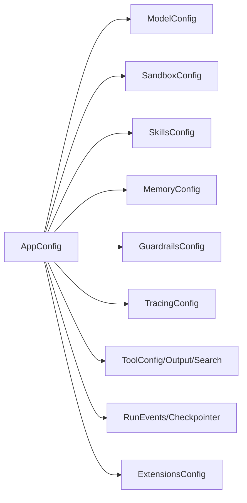

图示来源
- [backend/packages/harness/deerflow/config/app_config.py](file://backend/packages/harness/deerflow/config/app_config.py)
- [backend/packages/harness/deerflow/config/model_config.py](file://backend/packages/harness/deerflow/config/model_config.py)
- [backend/packages/harness/deerflow/config/sandbox_config.py](file://backend/packages/harness/deerflow/config/sandbox_config.py)
- [backend/packages/harness/deerflow/config/skills_config.py](file://backend/packages/harness/deerflow/config/skills_config.py)
- [backend/packages/harness/deerflow/config/memory_config.py](file://backend/packages/harness/deerflow/config/memory_config.py)
- [backend/packages/harness/deerflow/config/guardrails_config.py](file://backend/packages/harness/deerflow/config/guardrails_config.py)
- [backend/packages/harness/deerflow/config/tracing_config.py](file://backend/packages/harness/deerflow/config/tracing_config.py)
- [backend/packages/harness/deerflow/config/tool_config.py](file://backend/packages/harness/deerflow/config/tool_config.py)
- [backend/packages/harness/deerflow/config/tool_output_config.py](file://backend/packages/harness/deerflow/config/tool_output_config.py)
- [backend/packages/harness/deerflow/config/tool_search_config.py](file://backend/packages/harness/deerflow/config/tool_search_config.py)
- [backend/packages/harness/deerflow/config/run_events_config.py](file://backend/packages/harness/deerflow/config/run_events_config.py)
- [backend/packages/harness/deerflow/config/checkpointer_config.py](file://backend/packages/harness/deerflow/config/checkpointer_config.py)
- [backend/packages/harness/deerflow/config/extensions_config.py](file://backend/packages/harness/deerflow/config/extensions_config.py)

## 性能考量
- 配置加载
  - 将 YAML 解析与默认值合并放在启动阶段完成，避免运行时重复计算
  - 对大型配置采用分段加载与懒初始化
- 模型调用
  - 合理设置温度与最大长度，减少无效重试
  - 使用连接池与并发限流，避免提供方限流触发
- 沙箱
  - 限制资源配额，避免过度占用宿主机
  - 使用只读文件系统与最小权限原则
- 技能与工具
  - 缓存工具输出，减少重复调用
  - 控制输出大小与截断策略，降低传输与存储成本
- 内存与事件
  - 批量写入与异步刷新，降低 IO 压力
  - 合理设置队列容量与过期时间
- 追踪
  - 采样策略与元数据精简，避免带宽与存储压力

## 故障排除指南
- 配置未生效
  - 检查顶层 YAML 是否存在语法错误
  - 确认 AppConfig 是否正确加载并合并默认值
  - 参考动态重载测试用例验证配置热更新
- 模型调用失败
  - 核对提供商凭证与网络连通性
  - 查看重试日志与熔断状态
  - 检查费用预算与限额告警
- 沙箱异常
  - 检查执行模式与容器/权限配置
  - 核对资源配额与文件系统挂载
- 技能加载失败
  - 检查技能目录权限与元数据完整性
  - 确认工具注册与权限扫描结果
- 内存与事件问题
  - 检查事件存储后端与索引
  - 确认检查点序列化与恢复流程
- 追踪异常
  - 核对追踪提供方配置与采样策略
  - 检查元数据注入与链路完整性

章节来源
- [backend/tests/test_app_config_reload.py](file://backend/tests/test_app_config_reload.py)
- [backend/tests/test_model_config.py](file://backend/tests/test_model_config.py)
- [backend/tests/test_sandbox_config.py](file://backend/tests/test_sandbox_config.py)
- [backend/tests/test_skills_config.py](file://backend/tests/test_skills_config.py)
- [backend/tests/test_memory_config.py](file://backend/tests/test_memory_config.py)
- [backend/tests/test_run_events_config.py](file://backend/tests/test_run_events_config.py)
- [backend/tests/test_checkpointer_config.py](file://backend/tests/test_checkpointer_config.py)
- [backend/tests/test_tracing_config.py](file://backend/tests/test_tracing_config.py)

## 结论
DeerFlow 的配置体系以 YAML 为主入口，通过 AppConfig 协调各子配置模块，形成清晰的职责边界与可维护性。结合测试用例与专项文档，可在保证安全与性能的前提下实现灵活的定制与优化。建议在生产环境中严格遵循最佳实践，定期审查配置并进行压测与演练。

## 附录
- 配置示例与模板
  - 顶层 YAML 示例：[config.example.yaml](file://config.example.yaml)
  - 扩展配置示例：[extensions_config.example.json](file://extensions_config.example.json)
- 相关文档
  - 配置总览：[CONFIGURATION.md](file://backend/docs/CONFIGURATION.md)
  - 内存设置回顾：[MEMORY_SETTINGS_REVIEW.md](file://backend/docs/MEMORY_SETTINGS_REVIEW.md)
  - 内存改进：[MEMORY_IMPROVEMENTS.md](file://backend/docs/MEMORY_IMPROVEMENTS.md)
  - 内存改进摘要：[MEMORY_IMPROVEMENTS_SUMMARY.md](file://backend/docs/MEMORY_IMPROVEMENTS_SUMMARY.md)
  - 中间件执行流程：[middleware-execution-flow.md](file://backend/docs/middleware-execution-flow.md)
- 网关与认证配置
  - 网关配置：[gateway/config.py](file://backend/app/gateway/config.py)
  - 认证配置：[gateway/auth/config.py](file://backend/app/gateway/auth/config.py)