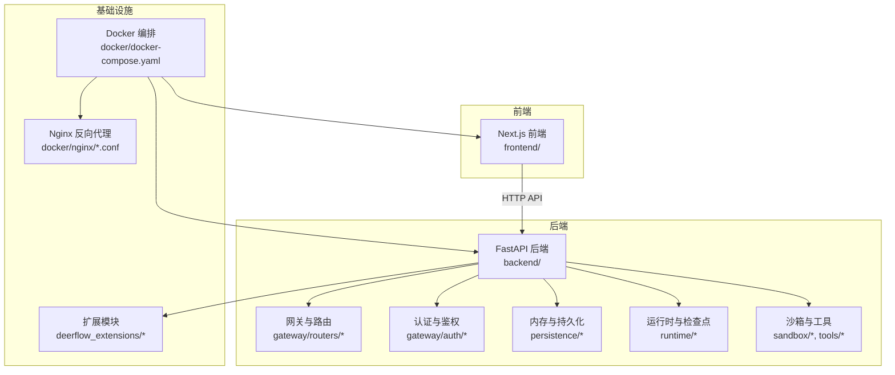
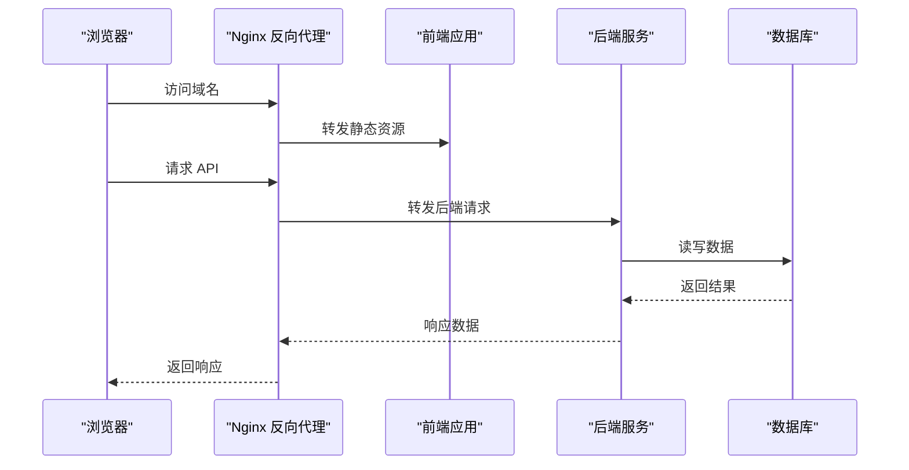
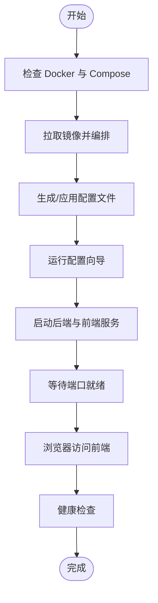
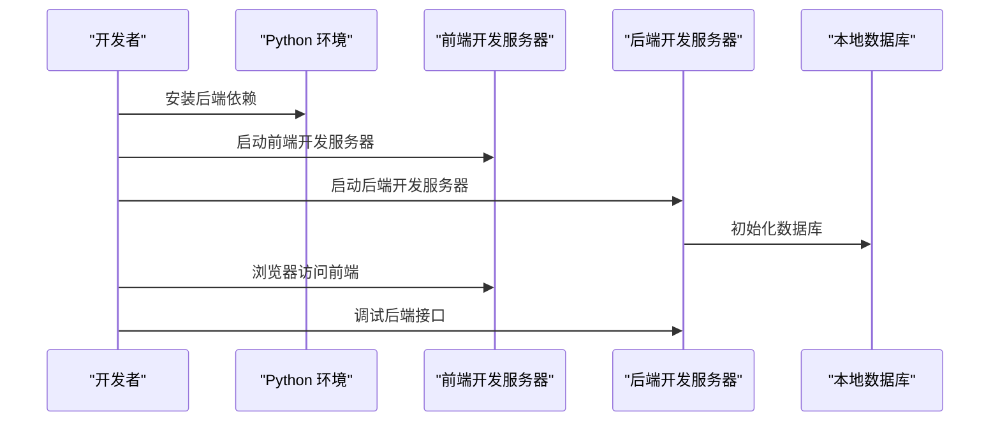
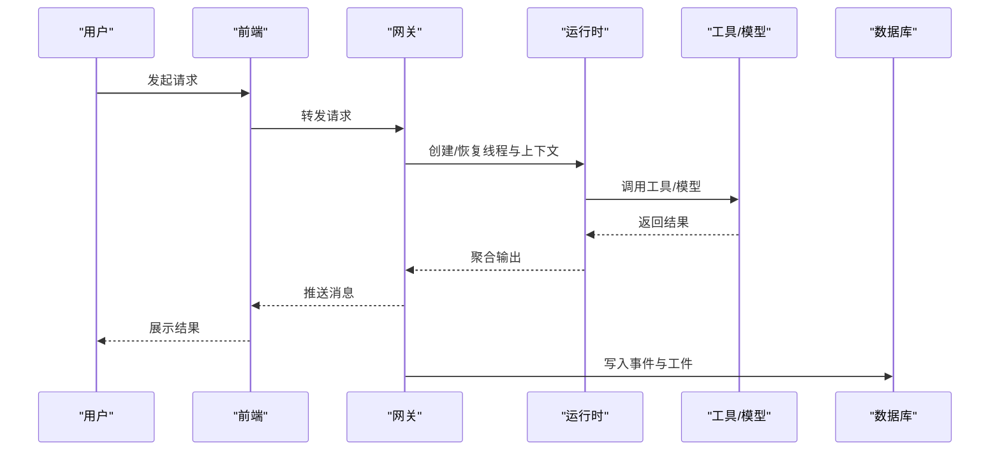
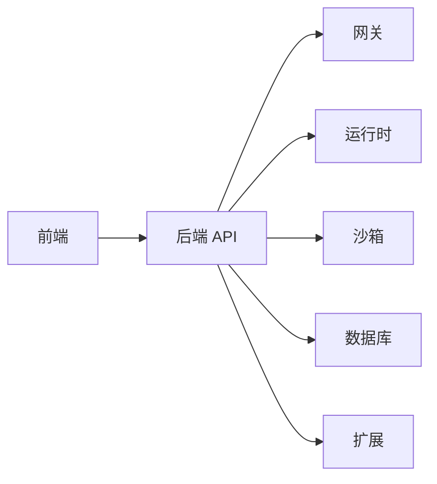

# 快速开始

<cite>
**本文引用的文件**
- [README.md](file://README.md)
- [Install.md](file://Install.md)
- [docker-compose.yaml](file://docker/docker-compose.yaml)
- [dev-entrypoint.sh](file://docker/dev-entrypoint.sh)
- [start-deerflow.sh](file://scripts/start-deerflow.sh)
- [setup_wizard.py](file://scripts/setup_wizard.py)
- [configure.py](file://scripts/configure.py)
- [check.py](file://scripts/check.py)
- [wait-for-port.sh](file://scripts/wait-for-port.sh)
- [nginx.conf](file://docker/nginx/nginx.conf)
- [nginx.local.conf](file://docker/nginx/nginx.local.conf)
- [server.conf](file://docker/nginx/server.conf)
- [backend/README.md](file://backend/README.md)
- [frontend/README.md](file://frontend/README.md)
- [backend/docs/SETUP.md](file://backend/docs/SETUP.md)
- [backend/docs/CONFIGURATION.md](file://backend/docs/CONFIGURATION.md)
- [docs/operations/BUILD_AND_DEPLOY.md](file://docs/operations/BUILD_AND_DEPLOY.md)
- [docs/operations/DEPLOYMENT_KNOWN_ISSUES.md](file://docs/operations/DEPLOYMENT_KNOWN_ISSUES.md)
- [config.example.yaml](file://config.example.yaml)
- [extensions_config.example.json](file://extensions_config.example.json)
</cite>

## 目录
1. [简介](#简介)
2. [项目结构](#项目结构)
3. [核心组件](#核心组件)
4. [架构总览](#架构总览)
5. [详细组件分析](#详细组件分析)
6. [依赖关系分析](#依赖关系分析)
7. [性能考虑](#性能考虑)
8. [故障排除指南](#故障排除指南)
9. [结论](#结论)
10. [附录](#附录)

## 简介
本指南面向首次接触 DeerFlow 2.0 的用户，帮助你在约 15 分钟内完成环境准备、一键安装、配置向导与基本运行，体验核心功能。文档覆盖两种推荐部署方式：Docker 推荐方式与本地开发方式，并提供 Linux/macOS/Windows 的特殊注意事项与常见问题解决方案。同时给出部署规模建议、资源要求与性能基准参考。

## 项目结构
DeerFlow 采用前后端分离架构，包含后端服务、前端应用、Docker 编排、脚本工具与技能生态等模块。核心目录与职责概览：
- backend：后端服务与网关，包含认证、路由、内存、运行时、沙箱、工具与扩展等子系统
- frontend：基于 Next.js 的前端应用，提供工作区、聊天、设置等功能界面
- docker：容器编排与 Nginx 配置，支持开发与生产环境
- scripts：一键启动、健康检查、配置向导、环境检测等自动化脚本
- deerflow_extensions：可选扩展（如 ads_auth、env_settings、topic_guardrail）
- docs：部署与运维、变更摘要、MCP 整合等文档
- docker-compose.yaml：Docker 一键编排入口
- config.example.yaml / extensions_config.example.json：默认配置模板

图表来源
- [docker-compose.yaml](file://docker/docker-compose.yaml)
- [frontend/README.md](file://frontend/README.md)
- [backend/README.md](file://backend/README.md)

章节来源
- [README.md](file://README.md)
- [docker/docker-compose.yaml](file://docker/docker-compose.yaml)
- [backend/README.md](file://backend/README.md)
- [frontend/README.md](file://frontend/README.md)

## 核心组件
- 后端服务：提供 REST API、认证、线程管理、运行与事件流、上传与工件管理、渠道集成等能力
- 前端应用：工作区、聊天界面、设置与扩展页面，支持多语言与主题切换
- 扩展系统：通过 deerflow_extensions 提供认证、环境设置、话题守卫等可插拔能力
- Docker 编排：一键拉起后端、前端、数据库与 Nginx，简化部署与调试
- 脚本工具：一键启动、健康检查、配置向导、环境检测与端口等待等

章节来源
- [backend/README.md](file://backend/README.md)
- [frontend/README.md](file://frontend/README.md)
- [deerflow_extensions/README.md](file://deerflow_extensions/README.md)
- [docker/docker-compose.yaml](file://docker/docker-compose.yaml)

## 架构总览
下图展示从浏览器到后端服务的关键交互路径，以及 Docker 编排如何组织各组件：

图表来源
- [docker/docker-compose.yaml](file://docker/docker-compose.yaml)
- [nginx.conf](file://docker/nginx/nginx.conf)
- [nginx.local.conf](file://docker/nginx/nginx.local.conf)
- [server.conf](file://docker/nginx/server.conf)

## 详细组件分析

### Docker 推荐部署方式
Docker 是最简路径，适合大多数用户快速体验与生产部署。核心步骤如下：
1) 前置条件检查
- 安装 Docker 与 Docker Compose（Compose V2）
- 确保宿主机开放必要端口（默认 80/443/8080/8443，可在编排中调整）
- 准备域名或本地 hosts 映射（用于 Nginx 证书与反代）

2) 拉取与编排
- 使用 docker/docker-compose.yaml 启动所有服务
- 首次启动会自动构建镜像并初始化数据库

3) 配置与初始化
- 如需自定义配置，复制 config.example.yaml 为 config.yaml 并按需修改
- 复制 extensions_config.example.json 为 extensions_config.json 并启用所需扩展
- 运行配置向导脚本生成初始管理员账户与基础设置

4) 启动与访问
- 一键启动脚本负责拉起后端与前端服务
- 等待端口就绪后，通过浏览器访问前端地址
- 初次登录需要重置管理员密码

5) 健康检查
- 使用健康检查脚本确认后端 API 与数据库状态
- 若失败，查看容器日志定位问题

图表来源
- [docker/docker-compose.yaml](file://docker/docker-compose.yaml)
- [start-deerflow.sh](file://scripts/start-deerflow.sh)
- [check.py](file://scripts/check.py)
- [wait-for-port.sh](file://scripts/wait-for-port.sh)

章节来源
- [docker/docker-compose.yaml](file://docker/docker-compose.yaml)
- [start-deerflow.sh](file://scripts/start-deerflow.sh)
- [check.py](file://scripts/check.py)
- [wait-for-port.sh](file://scripts/wait-for-port.sh)
- [nginx.conf](file://docker/nginx/nginx.conf)
- [nginx.local.conf](file://docker/nginx/nginx.local.conf)
- [server.conf](file://docker/nginx/server.conf)

### 本地开发方式
本地开发适合需要调试后端、扩展或前端的高级用户。核心步骤如下：
1) 克隆仓库并进入根目录
2) 安装 Python 与 Node.js 运行时，以及包管理器（pip/pipenv、pnpm）
3) 安装后端依赖：在 backend 目录执行依赖安装
4) 安装前端依赖：在 frontend 目录执行依赖安装
5) 启动后端服务：使用后端提供的开发入口或命令
6) 启动前端服务：使用前端提供的开发服务器
7) 初始化数据库与配置：运行迁移脚本与配置向导
8) 访问 http://localhost:3000 或对应端口

图表来源
- [backend/README.md](file://backend/README.md)
- [frontend/README.md](file://frontend/README.md)

章节来源
- [backend/README.md](file://backend/README.md)
- [frontend/README.md](file://frontend/README.md)

### 配置向导与基础运行
配置向导负责生成初始管理员账户、基础模型配置与默认技能集合。推荐流程：
1) 运行配置向导脚本，按提示输入管理员邮箱与密码
2) 选择默认模型提供商与参数
3) 选择启用的技能与扩展
4) 生成配置文件并重启服务
5) 登录后台，根据需要进一步调整模型、渠道与安全策略

章节来源
- [setup_wizard.py](file://scripts/setup_wizard.py)
- [configure.py](file://scripts/configure.py)
- [backend/docs/CONFIGURATION.md](file://backend/docs/CONFIGURATION.md)
- [config.example.yaml](file://config.example.yaml)
- [extensions_config.example.json](file://extensions_config.example.json)

### 基本运行流程
- 用户通过前端发起对话或任务
- 后端网关接收请求，进行认证与权限校验
- 运行时根据线程与记忆上下文调度工具与模型
- 工具执行完成后返回结果，后端聚合输出并通过 SSE/WS 推送至前端
- 事件与工件持久化到数据库，支持后续检索与审计

图表来源
- [backend/README.md](file://backend/README.md)
- [frontend/README.md](file://frontend/README.md)

## 依赖关系分析
- 组件耦合：前端通过 API 与后端交互；后端内部通过网关、运行时、沙箱与持久化模块协作；扩展模块以插件形式注入
- 外部依赖：数据库（SQLite/PostgreSQL）、模型提供商（OpenAI/Claude/vLLM 等）、渠道适配器（飞书/钉钉/Slack/Discord/Telegram）
- 编排依赖：Docker Compose 将前端、后端、数据库与 Nginx 组织为统一服务网格

图表来源
- [docker/docker-compose.yaml](file://docker/docker-compose.yaml)
- [backend/README.md](file://backend/README.md)
- [frontend/README.md](file://frontend/README.md)

章节来源
- [docker/docker-compose.yaml](file://docker/docker-compose.yaml)
- [backend/README.md](file://backend/README.md)
- [frontend/README.md](file://frontend/README.md)

## 性能考虑
- 部署规模建议
  - 开发/演示：单机最小化部署（CPU 2 核+，内存 4 GB+，存储 20 GB+）
  - 小型团队：双核 CPU、8 GB 内存、200 GB 存储，支持 5-10 人并发
  - 中型企业：4 核 CPU、16 GB 内存、500 GB 存储，支持 20-50 人并发
- 资源要求
  - 后端：Python 运行时、uvicorn ASGI 服务器、SQLite/PostgreSQL
  - 前端：Node.js 运行时、pnpm 包管理器
  - Nginx：反向代理与静态资源分发
- 性能基准
  - 首次响应时间（含模型调用）：约 2-5 秒（取决于模型与网络）
  - 并发处理：建议每核 5-10 个活跃会话，避免阻塞 I/O
  - 数据库：使用 PostgreSQL 可显著提升高并发场景下的稳定性
- 优化建议
  - 启用模型缓存与连接池
  - 使用反向代理缓存静态资源
  - 对长耗时任务使用队列与异步处理
  - 合理配置内存与检查点，避免频繁落盘

## 故障排除指南
- Docker 相关
  - 权限不足：确保当前用户加入 docker 组
  - 端口冲突：修改 docker-compose.yaml 中的映射端口
  - 镜像拉取失败：配置国内镜像加速或代理
- 环境检测
  - 使用环境检测脚本检查 Python、Node、Docker 版本与依赖
  - 若健康检查失败，查看容器日志定位具体错误
- 常见问题
  - 前端无法访问：确认 Nginx 配置与域名解析
  - 登录失败：重置管理员密码或检查认证扩展配置
  - 工具执行异常：检查沙箱权限与网络连通性
  - 数据库连接失败：确认数据库服务可用与凭据正确

章节来源
- [docs/operations/DEPLOYMENT_KNOWN_ISSUES.md](file://docs/operations/DEPLOYMENT_KNOWN_ISSUES.md)
- [check.py](file://scripts/check.py)
- [wait-for-port.sh](file://scripts/wait-for-port.sh)

## 结论
通过本指南，你可以在 15 分钟内完成 DeerFlow 2.0 的环境准备与一键部署，体验核心聊天与任务能力。建议优先使用 Docker 方式快速上手，再根据团队规模与需求演进到本地开发或生产级部署。遇到问题时，结合健康检查与日志排查，通常可快速定位并解决。

## 附录

### 操作系统特殊注意事项
- Linux
  - 使用发行版自带包管理器安装 Docker/Compose
  - 注意防火墙与 SELinux 配置
- macOS
  - 推荐使用 Homebrew 安装 Docker Desktop
  - 首次启动可能需要授权磁盘访问
- Windows
  - 使用 WSL2 + Docker Desktop
  - 注意路径分隔符与权限问题

### 一键安装命令与脚本
- Docker 一键安装与启动：使用 docker/docker-compose.yaml 与一键启动脚本
- 环境检测：使用环境检测脚本检查前置条件
- 健康检查：使用健康检查脚本验证服务状态

章节来源
- [docker/docker-compose.yaml](file://docker/docker-compose.yaml)
- [start-deerflow.sh](file://scripts/start-deerflow.sh)
- [check.py](file://scripts/check.py)
- [wait-for-port.sh](file://scripts/wait-for-port.sh)