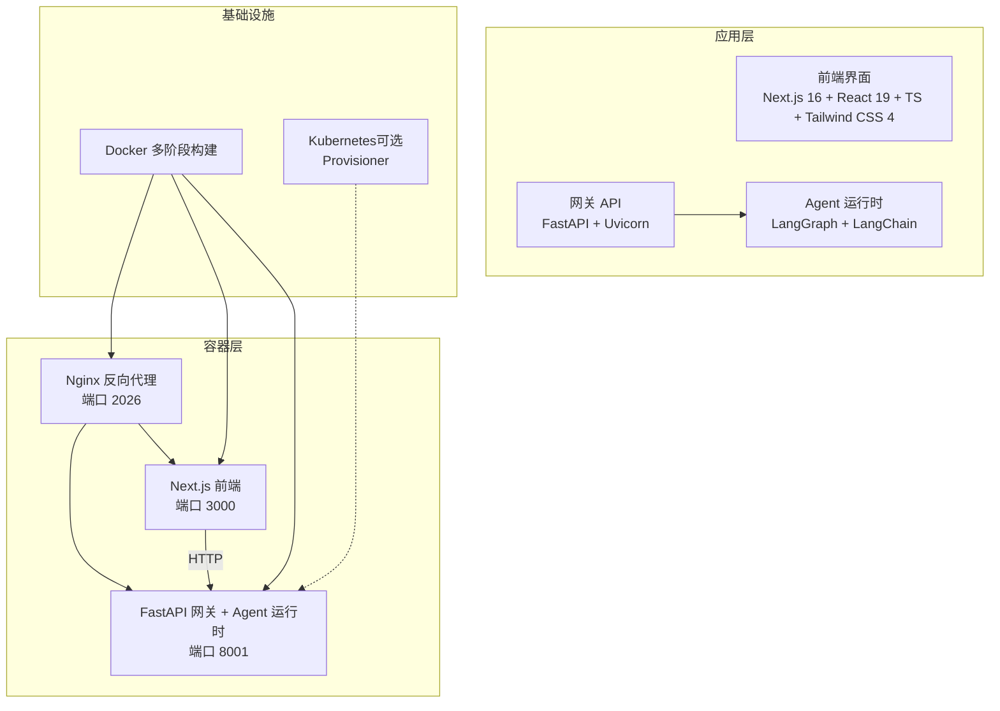
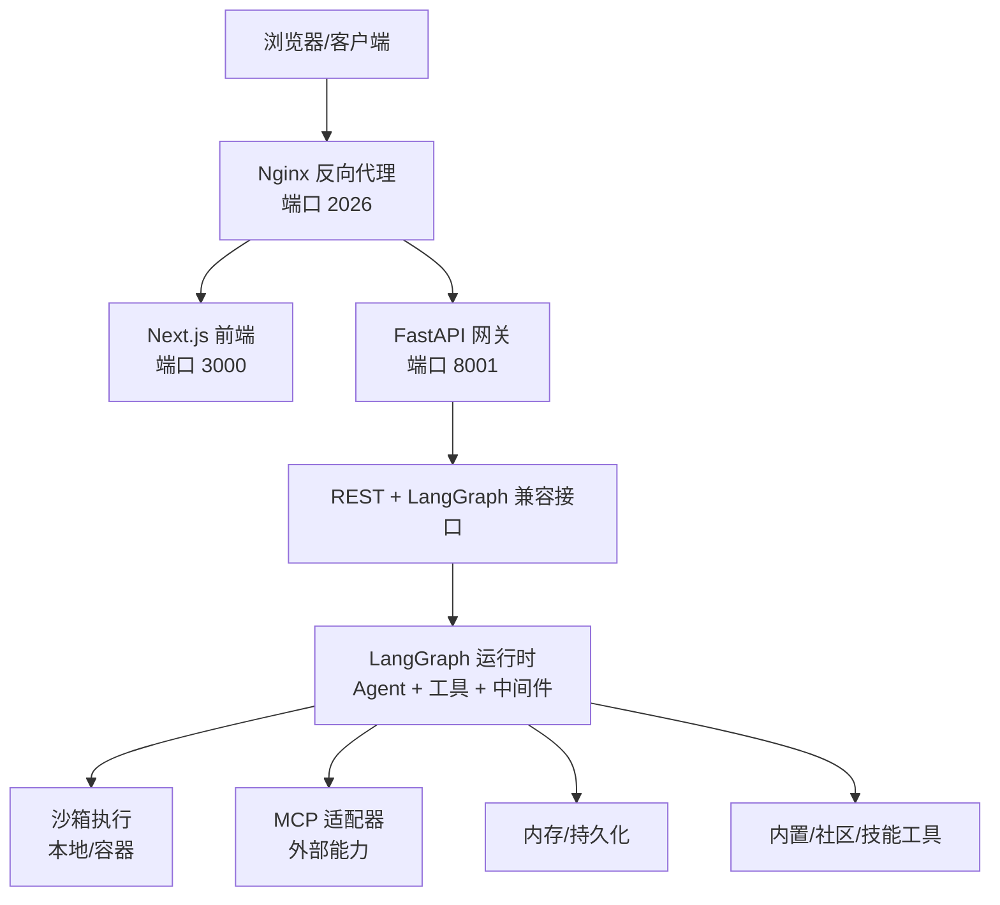
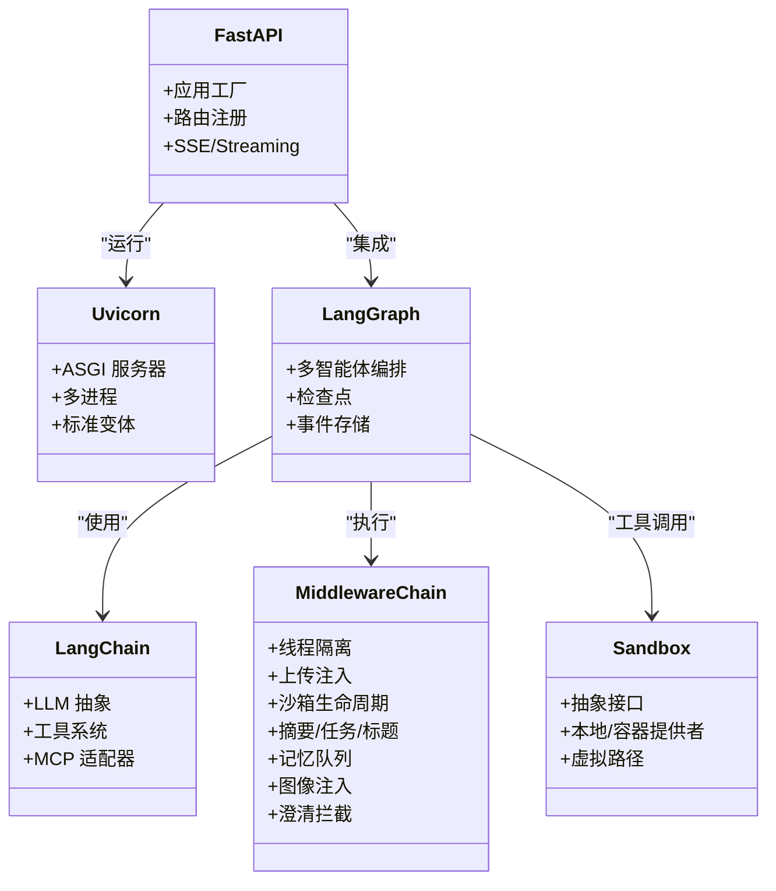
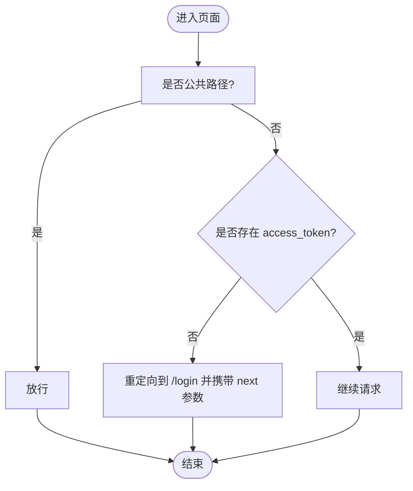
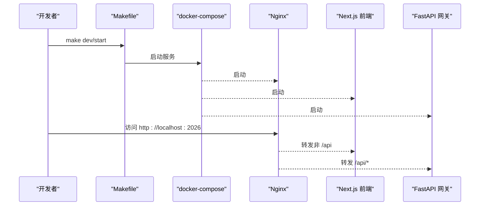
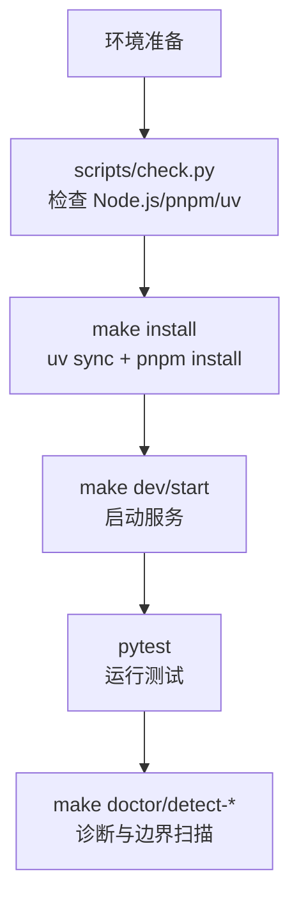
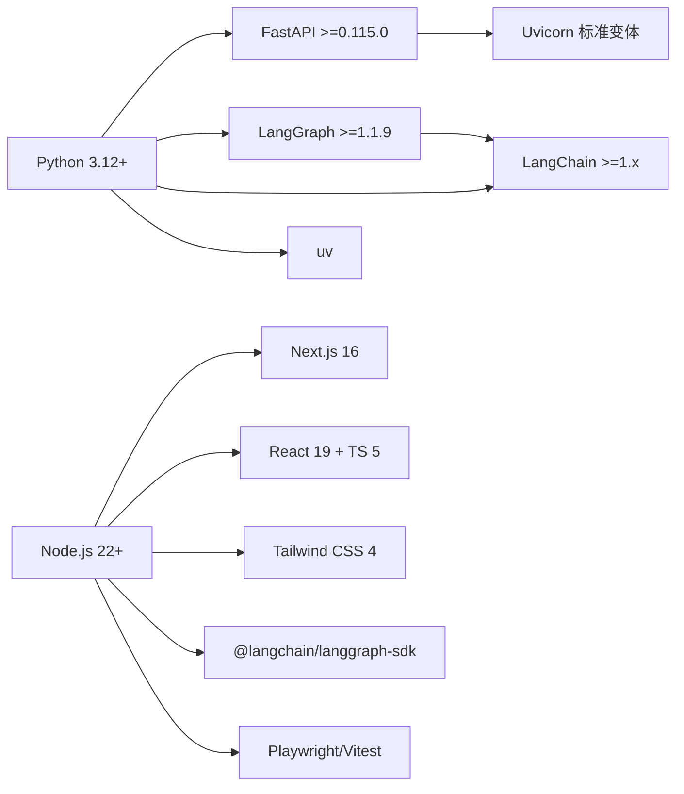

# 技术栈介绍

<cite>
**本文引用的文件**
- [backend/pyproject.toml](file://backend/pyproject.toml)
- [frontend/package.json](file://frontend/package.json)
- [backend/Dockerfile](file://backend/Dockerfile)
- [frontend/Dockerfile](file://frontend/Dockerfile)
- [docker/docker-compose.yaml](file://docker/docker-compose.yaml)
- [Makefile](file://Makefile)
- [backend/README.md](file://backend/README.md)
- [frontend/README.md](file://frontend/README.md)
- [docs/operations/BUILD_AND_DEPLOY.md](file://docs/operations/BUILD_AND_DEPLOY.md)
- [scripts/check.py](file://scripts/check.py)
- [scripts/doctor.py](file://scripts/doctor.py)
- [.agent/skills/smoke-test/scripts/check_local_env.sh](file://.agent/skills/smoke-test/scripts/check_local_env.sh)
- [backend/uv.lock](file://backend/uv.lock)
- [backend/app/gateway/deps.py](file://backend/app/gateway/deps.py)
- [backend/packages/harness/deerflow/community/aio_sandbox/local_backend.py](file://backend/packages/harness/deerflow/community/aio_sandbox/local_backend.py)
- [docker/provisioner/app.py](file://docker/provisioner/app.py)
- [frontend/middleware.ts](file://frontend/middleware.ts)
- [frontend/components.json](file://frontend/components.json)
</cite>

## 目录
1. [引言](#引言)
2. [项目结构](#项目结构)
3. [核心组件](#核心组件)
4. [架构总览](#架构总览)
5. [详细组件分析](#详细组件分析)
6. [依赖分析](#依赖分析)
7. [性能考虑](#性能考虑)
8. [故障排除指南](#故障排除指南)
9. [结论](#结论)
10. [附录](#附录)

## 引言
本文件面向 DeerFlow 2.0 的技术栈介绍，覆盖后端技术栈（Python 3.12+、FastAPI、LangGraph、LangChain、Uvicorn）、前端技术栈（Next.js 16、React、TypeScript、Tailwind CSS）、容器化技术（Docker、Nginx、Kubernetes）以及开发工具链（uv、pnpm、Make、pytest）。我们将解释各技术选型原因、版本兼容性与性能考量，并提供依赖关系图、技术架构图与生态系统集成说明；同时给出升级指南与替代方案建议，帮助开发者理解项目的技术决策背景。

## 项目结构
DeerFlow 采用前后端分离与多仓库协同的组织方式：
- 后端以 FastAPI 为核心，结合 LangGraph 实现智能体编排与运行时生命周期管理，通过 Uvicorn 提供高性能异步服务。
- 前端基于 Next.js 16 App Router，采用 React 19、TypeScript 与 Tailwind CSS 4 构建现代化 Web 界面。
- 容器化方面，后端与前端分别提供多阶段 Dockerfile，配合 docker-compose 统一编排；同时保留传统 PyInstaller 发布方式用于生产部署。
- 开发工具链包括 uv（Python 包管理与同步）、pnpm（Node 包管理）、Make（统一开发与运维命令）、pytest（Python 测试框架）。

图表来源
- [docker/docker-compose.yaml:26-163](file://docker/docker-compose.yaml#L26-L163)
- [backend/Dockerfile:1-102](file://backend/Dockerfile#L1-L102)
- [frontend/Dockerfile:1-53](file://frontend/Dockerfile#L1-L53)

章节来源
- [backend/README.md:7-36](file://backend/README.md#L7-L36)
- [docker/docker-compose.yaml:1-163](file://docker/docker-compose.yaml#L1-L163)

## 核心组件
- 后端核心
  - Python 3.12+：满足高性能与新语法特性需求，配合 uv 实现快速依赖解析与安装。
  - FastAPI 0.115+：提供类型安全的 OpenAPI/SSE 支持，适配 LangGraph API 兼容路由。
  - LangGraph 1.1+：多智能体编排与状态检查点持久化，支撑复杂推理与工具调用。
  - LangChain 1.x：LLM 抽象与工具生态，配合 MCP 适配器实现外部能力接入。
  - Uvicorn 标准变体：高性能 ASGI 服务器，支持多进程与热重载。
- 前端核心
  - Next.js 16 App Router：现代路由与流式渲染，支持 SSR/SSG。
  - React 19 + TypeScript 5：强类型与最新 React 特性。
  - Tailwind CSS 4：原子化样式与主题系统。
  - LangGraph SDK 与 Vercel AI Elements：与后端 Agent 与流式接口无缝集成。
- 容器化与编排
  - Docker 多阶段构建：Builder/Dev/Runtime 三阶段，兼顾开发体验与运行时精简。
  - Nginx：统一反向代理与静态资源分发。
  - Kubernetes（可选）：Provisioner 用于容器化沙箱模式，当前默认使用本地容器后端。
- 开发工具链
  - uv：Python 包管理与同步，替代 pip 与 venv，提升安装速度与确定性。
  - pnpm：快速包管理与工作区支持，配合 Corepack。
  - Make：统一命令入口，涵盖安装、开发、部署、诊断等。
  - pytest：Python 测试框架，配合标记与缓存提升测试效率。

章节来源
- [backend/pyproject.toml:1-58](file://backend/pyproject.toml#L1-L58)
- [frontend/package.json:1-118](file://frontend/package.json#L1-L118)
- [backend/README.md:396-406](file://backend/README.md#L396-L406)
- [frontend/README.md:5-10](file://frontend/README.md#L5-L10)
- [docker/docker-compose.yaml:1-163](file://docker/docker-compose.yaml#L1-L163)
- [Makefile:1-163](file://Makefile#L1-L163)

## 架构总览
下图展示 DeerFlow 的端到端架构：Nginx 作为统一入口，将 API 请求转发至后端网关，前端 Next.js 提供用户界面；后端通过 FastAPI 暴露 REST 与流式接口，内部由 LangGraph 管理 Agent 生命周期与工具调用，Uvicorn 提供高性能运行时。

图表来源
- [backend/README.md:7-36](file://backend/README.md#L7-L36)
- [docker/docker-compose.yaml:26-163](file://docker/docker-compose.yaml#L26-L163)

章节来源
- [backend/README.md:7-36](file://backend/README.md#L7-L36)
- [docker/docker-compose.yaml:26-163](file://docker/docker-compose.yaml#L26-L163)

## 详细组件分析

### 后端技术栈（Python 3.12+、FastAPI、LangGraph、LangChain、Uvicorn）
- 语言与包管理
  - Python 3.12+：满足 asyncio、类型注解与性能要求；uv 提供确定性安装与缓存加速。
  - uv：替代 pip 与 venv，支持工作区与锁定文件，提升安装速度与一致性。
- Web 框架与运行时
  - FastAPI 0.115+：类型驱动的 API 定义，自动 OpenAPI 文档生成，SSE 支持良好。
  - Uvicorn 标准变体：高性能 ASGI 服务器，支持多 worker 与热重载。
- 智能体与工具生态
  - LangGraph 1.1+：多智能体编排、状态检查点、事件存储与流式输出。
  - LangChain 1.x：LLM 抽象、工具系统、社区工具与 MCP 适配器。
  - 中间件链：按序执行的横切关注点（线程隔离、上传注入、沙箱、摘要、任务、标题、记忆、图像、澄清）。
  - 沙箱系统：抽象接口与本地/容器提供者，支持虚拟路径映射与并发写保护。
  - 子智能体：并发委托与超时控制，SSE 事件反馈。
  - 记忆系统：结构化存储与去抖更新，注入到系统提示中。
  - 工具生态：内置、社区、MCP、技能工具的统一调度。
- 网关 API
  - 模型、MCP、技能、内存、上传、工件、线程、运行等路由集合。
  - IM 渠道桥接：飞书、Slack、Telegram 等，支持流式卡片更新。
- Docker 与运行参数
  - 多阶段构建：Builder/Dev/Runtime，保留编译工具链与 Node.js 运行时，减少最终镜像体积与攻击面。
  - 环境变量与挂载：配置文件、扩展配置、技能目录、训练日志、DooD Docker Socket、CLI 凭证目录等。
  - 默认命令：uv run uvicorn 启动网关应用，支持多 worker。

图表来源
- [backend/pyproject.toml:7-26](file://backend/pyproject.toml#L7-L26)
- [backend/README.md:39-132](file://backend/README.md#L39-L132)
- [backend/Dockerfile:1-102](file://backend/Dockerfile#L1-L102)

章节来源
- [backend/pyproject.toml:1-58](file://backend/pyproject.toml#L1-L58)
- [backend/README.md:39-132](file://backend/README.md#L39-L132)
- [backend/Dockerfile:1-102](file://backend/Dockerfile#L1-L102)

### 前端技术栈（Next.js 16、React、TypeScript、Tailwind CSS）
- 框架与路由
  - Next.js 16 App Router：页面与 API 路由清晰分离，支持流式渲染与静态优化。
  - React 19 + TypeScript 5：强类型保障与最新特性支持。
- UI 与样式
  - Tailwind CSS 4：原子化样式与主题系统，支持暗色模式与动画。
  - shadcn/ui、MagicUI、React Bits：可复用组件库与动效增强。
- 集成与工具
  - LangGraph SDK 与 Vercel AI Elements：与后端 Agent 与流式接口集成。
  - pnpm 工作区：统一依赖与脚本管理。
  - E2E 与单元测试：Playwright（Chromium）与 Vitest。
- 中间件与认证
  - 自定义中间件：登录页重定向、公共路径放行、Cookie 校验与重写逻辑。

图表来源
- [frontend/middleware.ts:1-39](file://frontend/middleware.ts#L1-L39)

章节来源
- [frontend/README.md:5-10](file://frontend/README.md#L5-L10)
- [frontend/package.json:1-118](file://frontend/package.json#L1-L118)
- [frontend/middleware.ts:1-39](file://frontend/middleware.ts#L1-L39)
- [frontend/components.json:1-26](file://frontend/components.json#L1-L26)

### 容器化技术（Docker、Nginx、Kubernetes）
- Docker 多阶段构建
  - Builder：安装 build-essential、Node.js、uv，拷贝后端源码并 uv sync，设置 UTF-8 与可选 extras。
  - Dev：保留编译工具链，安装 Docker CLI，暴露 8001/2024 端口，启动 uv run uvicorn。
  - Runtime：基于 slim 镜像，复制 Node.js 与 Docker CLI、uv，最小化依赖，拷贝预构建虚拟环境。
- docker-compose 编排
  - Nginx：反向代理，转发前端与网关流量，端口 2026。
  - 前端：Next.js 生产服务，限制内存，读取 .env。
  - 网关：FastAPI + Agent 运行时，挂载配置、扩展、技能、DooD Socket、CLI 凭证等。
  - Provisioner（可选）：Kubernetes 沙箱模式，当前默认禁用以规避 Docker Desktop 9p 问题。
- Kubernetes（可选）
  - Provisioner 通过 kubeconfig 初始化 CoreV1Api，支持主机地址重写与自签证书禁用。
  - 默认使用本地容器后端，启用时需挂载 kubeconfig 并配置 provisioner_url。

图表来源
- [Makefile:94-112](file://Makefile#L94-L112)
- [docker/docker-compose.yaml:26-163](file://docker/docker-compose.yaml#L26-L163)

章节来源
- [backend/Dockerfile:1-102](file://backend/Dockerfile#L1-L102)
- [frontend/Dockerfile:1-53](file://frontend/Dockerfile#L1-L53)
- [docker/docker-compose.yaml:1-163](file://docker/docker-compose.yaml#L1-L163)
- [docker/provisioner/app.py:105-171](file://docker/provisioner/app.py#L105-L171)

### 开发工具链（uv、pnpm、Make、pytest）
- uv
  - 作为 Python 包管理器与同步工具，支持工作区与锁定文件，提升安装速度与一致性。
  - 在后端 Docker 构建中通过 COPY 从专用镜像引入，保证镜像内可用。
- pnpm
  - Node 包管理与工作区，支持 Corepack，提供更快的依赖安装与缓存。
  - 前端 Docker 构建中通过 Corepack 安装指定版本，支持受限网络镜像源配置。
- Make
  - 统一命令入口：安装、开发、生产、诊断、Docker 相关命令，简化本地与 CI 流程。
- pytest
  - Python 测试框架，配合标记与缓存，支持阻塞 IO 检测与严格边界扫描。

图表来源
- [scripts/check.py:1-127](file://scripts/check.py#L1-L127)
- [scripts/doctor.py:145-190](file://scripts/doctor.py#L145-L190)
- [Makefile:73-112](file://Makefile#L73-L112)

章节来源
- [scripts/check.py:1-127](file://scripts/check.py#L1-L127)
- [scripts/doctor.py:145-190](file://scripts/doctor.py#L145-L190)
- [Makefile:1-163](file://Makefile#L1-L163)

## 依赖分析
- 后端依赖关系
  - FastAPI 与 Uvicorn：Web 框架与运行时。
  - LangGraph 与 LangChain：智能体编排与 LLM 抽象。
  - 通道与消息 SDK：钉钉、飞书、Slack、Telegram 等。
  - 安全与校验：bcrypt、PyJWT、email-validator。
  - SSE 与多部分：s-se-starlette、python-multipart。
  - 工具与社区：lark-oapi、dingtalk-stream 等。
- 前端依赖关系
  - Next.js 16 与 React 19：框架与视图层。
  - UI 与样式：Tailwind CSS 4、shadcn/ui、MagicUI、React Bits。
  - AI 集成：LangGraph SDK、Vercel AI Elements。
  - 测试与工具：Playwright、Vitest、ESLint、Prettier、TypeScript。
- 锁定与版本
  - 后端使用 uv.lock，明确 LangGraph 1.1.9 等关键依赖版本，确保一致性。

图表来源
- [backend/pyproject.toml:7-26](file://backend/pyproject.toml#L7-L26)
- [backend/uv.lock:1878-1947](file://backend/uv.lock#L1878-L1947)
- [frontend/package.json:21-92](file://frontend/package.json#L21-L92)

章节来源
- [backend/pyproject.toml:1-58](file://backend/pyproject.toml#L1-L58)
- [backend/uv.lock:1878-1947](file://backend/uv.lock#L1878-L1947)
- [frontend/package.json:1-118](file://frontend/package.json#L1-L118)

## 性能考虑
- 后端
  - 使用 uv 与多阶段构建减少依赖安装时间与镜像体积，降低冷启动与部署成本。
  - Uvicorn 多 worker 模式提升并发处理能力；LangGraph 事件存储与检查点减少重复计算。
  - 沙箱生命周期钩子避免阻塞事件循环，异步准备与释放提高吞吐。
- 前端
  - Next.js 16 App Router 与 Turbopack 加速开发；生产构建去除 node_modules，减小包体。
  - Tailwind CSS 4 原子化样式减少运行时开销。
- 容器化
  - Runtime 阶段移除编译工具链与多余依赖，显著降低镜像大小与攻击面。
  - docker-compose 限制前端内存，避免资源争用。

章节来源
- [backend/Dockerfile:71-102](file://backend/Dockerfile#L71-L102)
- [frontend/Dockerfile:38-53](file://frontend/Dockerfile#L38-L53)
- [docker/docker-compose.yaml:63-64](file://docker/docker-compose.yaml#L63-L64)

## 故障排除指南
- 环境检查
  - 使用 scripts/check.py 或 make check 确认 Node.js（>=22）、pnpm、uv 已正确安装。
  - 使用 scripts/doctor.py 获取更详细的诊断信息与修复建议。
- 常见问题
  - Node.js 版本过低：升级至 22+。
  - pnpm 未找到：启用 Corepack 或全局安装 pnpm。
  - uv 未找到：按照官方安装指引安装。
- 阻塞 IO 检测
  - 使用 make detect-blocking-io 对业务代码进行静态扫描，定位可能阻塞事件循环的 IO 调用。
- Docker/K8s
  - 若启用 Kubernetes 沙箱模式，确认 kubeconfig 文件存在且可加载；必要时配置 K8S_API_SERVER 与关闭 SSL 校验。

章节来源
- [scripts/check.py:1-127](file://scripts/check.py#L1-L127)
- [scripts/doctor.py:145-190](file://scripts/doctor.py#L145-L190)
- [Makefile:56-61](file://Makefile#L56-L61)
- [docker/provisioner/app.py:105-171](file://docker/provisioner/app.py#L105-L171)

## 结论
DeerFlow 2.0 的技术栈围绕“高性能、可扩展、易维护”展开：后端以 FastAPI + LangGraph + Uvicorn 构建高吞吐的智能体运行时，前端以 Next.js 16 + React 19 + Tailwind CSS 提供现代化交互体验；容器化与编排确保交付一致性与可移植性；开发工具链通过 uv、pnpm、Make、pytest 提升研发效率与质量。该组合在功能完备性与工程实践之间取得平衡，适合企业级 AI 应用的长期演进。

## 附录

### 技术栈升级指南
- Python 与 uv
  - 升级 Python 时，优先在 CI 与本地统一使用 uv 工作区，确保依赖锁定与缓存命中。
  - 升级 FastAPI/LangGraph/LangChain 时，先在 dev 环境验证 API 兼容性与工具行为变化。
- Node.js 与 pnpm
  - 升级 Next.js 16 至更高版本前，先迁移 App Router 与实验特性，确保 ESM 与静态优化策略不变。
  - 升级 pnpm 时，核对工作区与插件兼容性，必要时锁定版本。
- 容器化
  - 升级 Node.js/Python 基础镜像时，同步更新多阶段构建参数与缓存键。
  - 升级 Nginx/Next.js/Uvicorn 时，验证健康检查与端口映射。
- Kubernetes
  - 升级 k8s 客户端库时，检查 kubeconfig 加载与 in-cluster 配置回退逻辑。

### 替代方案建议
- Web 框架
  - FastAPI：若需更强的 ORM/数据库集成，可考虑 Starlette + SQLAlchemy 组合，但会增加样板代码。
- 智能体框架
  - LangGraph：若不需要检查点与事件存储，可考虑较低抽象层的 Graph 类库；若需要更强的可视化与调试，LangGraph Studio 是良好补充。
- 前端框架
  - Next.js：若追求更轻量的构建链路，可考虑 Vite + React；若需要更强的静态生成能力，可评估 Astro/Gatsby。
- 包管理
  - uv：若团队偏好 pipenv/conda，可继续使用；uv 的确定性与速度优势明显。
  - pnpm：若受限于某些 npm 生态工具链，可考虑 yarn 或 bun（需验证兼容性）。
- 容器化
  - Docker：若需更细粒度的镜像分层与缓存控制，可参考现有多阶段策略进一步拆分。
  - Kubernetes：若仅需本地开发，可暂时禁用 Provisioner；生产环境建议启用并完善 kubeconfig 管理。

章节来源
- [backend/README.md:396-406](file://backend/README.md#L396-L406)
- [frontend/README.md:5-10](file://frontend/README.md#L5-L10)
- [docs/operations/BUILD_AND_DEPLOY.md:1-296](file://docs/operations/BUILD_AND_DEPLOY.md#L1-L296)