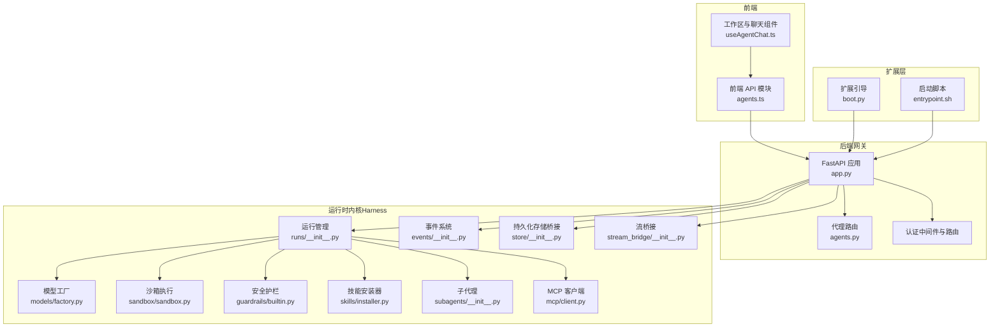
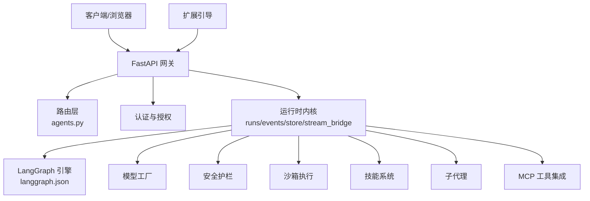
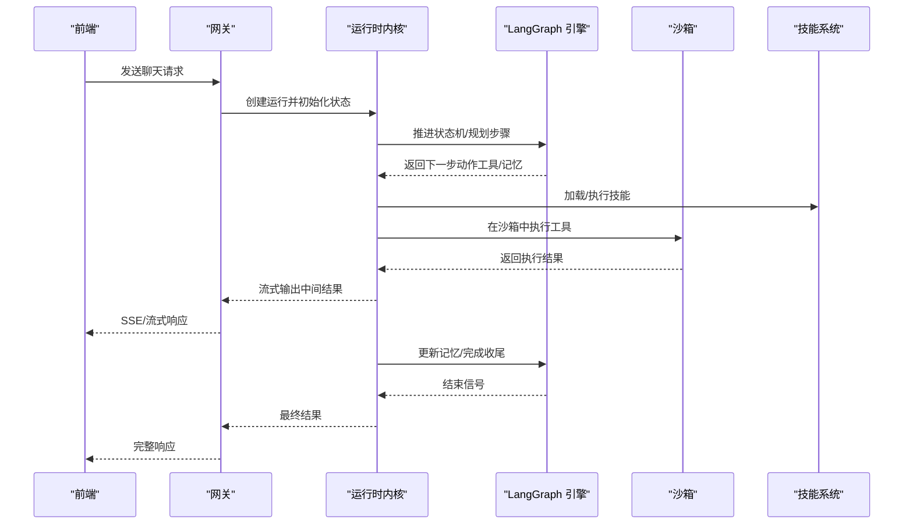
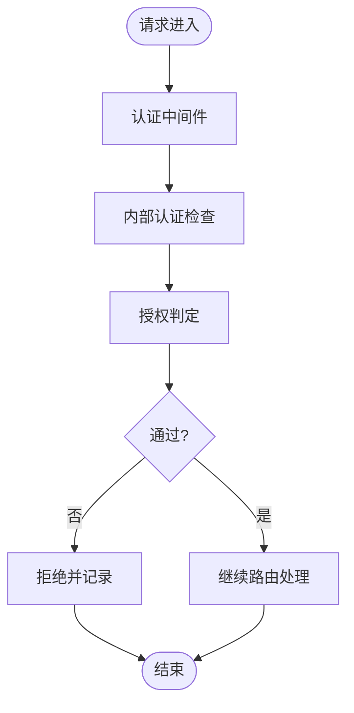
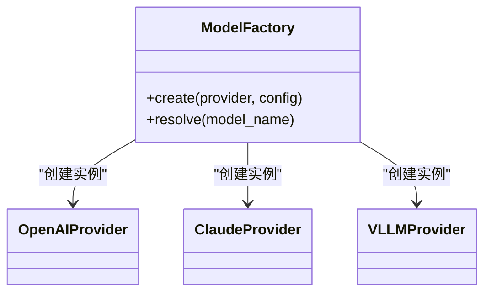
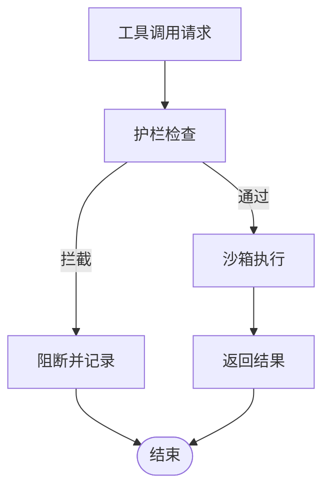
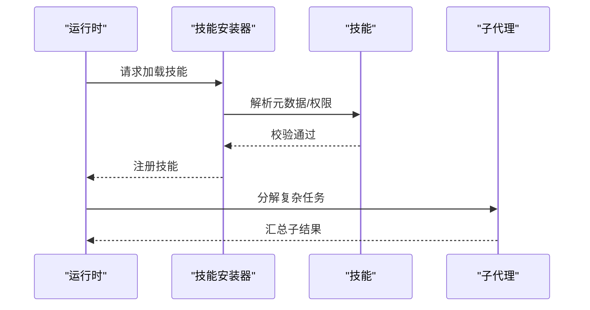
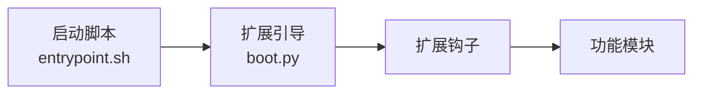
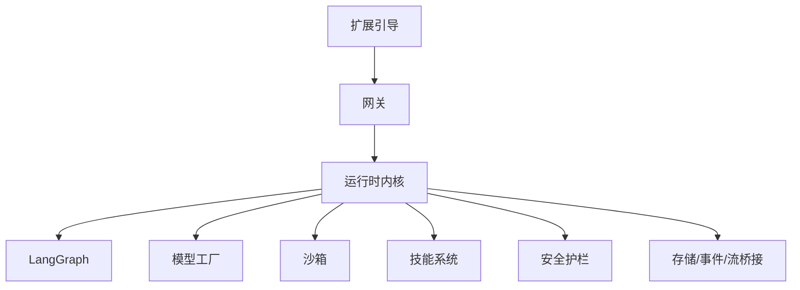

# 架构演进

<cite>
**本文引用的文件**
- [backend/docs/ARCHITECTURE.md](file://backend/docs/ARCHITECTURE.md)
- [backend/docs/AUTH_DESIGN.md](file://backend/docs/AUTH_DESIGN.md)
- [backend/app/gateway/app.py](file://backend/app/gateway/app.py)
- [backend/app/gateway/routers/agents.py](file://backend/app/gateway/routers/agents.py)
- [backend/packages/harness/deerflow/agents/factory.py](file://backend/packages/harness/deerflow/agents/factory.py)
- [backend/packages/harness/deerflow/runtime/runs/__init__.py](file://backend/packages/harness/deerflow/runtime/runs/__init__.py)
- [backend/packages/harness/deerflow/runtime/events/__init__.py](file://backend/packages/harness/deerflow/runtime/events/__init__.py)
- [backend/packages/harness/deerflow/runtime/store/__init__.py](file://backend/packages/harness/deerflow/runtime/store/__init__.py)
- [backend/packages/harness/deerflow/runtime/stream_bridge/__init__.py](file://backend/packages/harness/deerflow/runtime/stream_bridge/__init__.py)
- [backend/packages/harness/deerflow/mcp/client.py](file://backend/packages/harness/deerflow/mcp/client.py)
- [backend/packages/harness/deerflow/models/factory.py](file://backend/packages/harness/deerflow/models/factory.py)
- [backend/packages/harness/deerflow/persistence/engine.py](file://backend/packages/harness/deerflow/persistence/engine.py)
- [backend/packages/harness/deerflow/sandbox/sandbox.py](file://backend/packages/harness/deerflow/sandbox/sandbox.py)
- [backend/packages/harness/deerflow/skills/installer.py](file://backend/packages/harness/deerflow/skills/installer.py)
- [backend/packages/harness/deerflow/guardrails/builtin.py](file://backend/packages/harness/deerflow/guardrails/builtin.py)
- [backend/packages/harness/deerflow/subagents/__init__.py](file://backend/packages/harness/deerflow/subagents/__init__.py)
- [backend/langgraph.json](file://backend/langgraph.json)
- [backend/pyproject.toml](file://backend/pyproject.toml)
- [frontend/src/core/agents/index.ts](file://frontend/src/core/agents/index.ts)
- [frontend/src/core/api/agents.ts](file://frontend/src/core/api/agents.ts)
- [frontend/src/components/workspace/agent-chat/useAgentChat.ts](file://frontend/src/components/workspace/agent-chat/useAgentChat.ts)
- [deerflow_extensions/boot.py](file://deerflow_extensions/boot.py)
- [deerflow_extensions/entrypoint.sh](file://deerflow_extensions/entrypoint.sh)
- [skills/custom/README.md](file://skills/custom/README.md)
- [skills/public/deep-research/SKILL.md](file://skills/public/deep-research/SKILL.md)
- [docs/methodology/零侵入扩展方法论.md](file://docs/methodology/零侵入扩展方法论.md)
</cite>

## 目录
1. [引言](#引言)
2. [项目结构](#项目结构)
3. [核心组件](#核心组件)
4. [架构总览](#架构总览)
5. [详细组件分析](#详细组件分析)
6. [依赖关系分析](#依赖关系分析)
7. [性能考量](#性能考量)
8. [故障排查指南](#故障排查指南)
9. [结论](#结论)
10. [附录](#附录)

## 引言
本文件记录 DeerFlow 从 Deep Research 到 Super Agent Harness 的架构演进历程，重点阐述 v1.0 到 v2.0 的关键变化：LangGraph 集成、微服务化拆分、插件化扩展、事件驱动运行时等。通过架构决策矩阵与权衡分析，解释新架构如何解决早期版本在可扩展性、可维护性与用户体验方面的瓶颈，并给出面向未来的演进方向。

## 项目结构
DeerFlow 采用前后端分离与后端多包模块化的组织方式：
- 后端（Python）：以 FastAPI 网关为核心入口，承载路由、认证、中间件与业务服务；核心能力下沉至 packages/harness 子包，形成“运行时内核 + 插件生态”的架构。
- 前端（Next.js）：通过 API 层与后端交互，提供聊天、线程、技能管理等用户界面。
- 扩展层（Extensions）：提供零侵入式扩展机制，支持渠道、环境设置、主题等功能的动态注入。
- 技能（Skills）：内置与自定义技能库，支撑不同领域的任务执行。

**图表来源**
- [backend/app/gateway/app.py](file://backend/app/gateway/app.py)
- [backend/app/gateway/routers/agents.py](file://backend/app/gateway/routers/agents.py)
- [backend/packages/harness/deerflow/runtime/runs/__init__.py](file://backend/packages/harness/deerflow/runtime/runs/__init__.py)
- [backend/packages/harness/deerflow/runtime/events/__init__.py](file://backend/packages/harness/deerflow/runtime/events/__init__.py)
- [backend/packages/harness/deerflow/runtime/store/__init__.py](file://backend/packages/harness/deerflow/runtime/store/__init__.py)
- [backend/packages/harness/deerflow/runtime/stream_bridge/__init__.py](file://backend/packages/harness/deerflow/runtime/stream_bridge/__init__.py)
- [backend/packages/harness/deerflow/models/factory.py](file://backend/packages/harness/deerflow/models/factory.py)
- [backend/packages/harness/deerflow/sandbox/sandbox.py](file://backend/packages/harness/deerflow/sandbox/sandbox.py)
- [backend/packages/harness/deerflow/guardrails/builtin.py](file://backend/packages/harness/deerflow/guardrails/builtin.py)
- [backend/packages/harness/deerflow/skills/installer.py](file://backend/packages/harness/deerflow/skills/installer.py)
- [backend/packages/harness/deerflow/subagents/__init__.py](file://backend/packages/harness/deerflow/subagents/__init__.py)
- [backend/packages/harness/deerflow/mcp/client.py](file://backend/packages/harness/deerflow/mcp/client.py)
- [deerflow_extensions/boot.py](file://deerflow_extensions/boot.py)
- [deerflow_extensions/entrypoint.sh](file://deerflow_extensions/entrypoint.sh)

**章节来源**
- [backend/app/gateway/app.py](file://backend/app/gateway/app.py)
- [backend/app/gateway/routers/agents.py](file://backend/app/gateway/routers/agents.py)
- [backend/pyproject.toml](file://backend/pyproject.toml)

## 核心组件
- 运行时内核（Harness）：封装 runs、events、store、stream_bridge 等运行时基础设施，统一调度与编排。
- 代理工厂与内存：通过 factory 统一创建代理实例，结合内存状态机管理对话上下文。
- 事件驱动：事件系统负责运行期事件的捕获、转换与传播，支撑可观测性与审计。
- 安全护栏：内置 guardrails 提供内容安全与合规拦截。
- 沙箱执行：隔离工具调用与文件操作，保障运行安全。
- 技能系统：技能安装器负责技能加载、权限校验与策略应用。
- 子代理：支持子任务分解与并行执行，提升复杂任务处理能力。
- MCP 客户端：连接外部工具与服务，实现工具即插即用。
- 扩展引导：零侵入扩展框架，允许在不修改核心代码的前提下注入功能。

**章节来源**
- [backend/packages/harness/deerflow/agents/factory.py](file://backend/packages/harness/deerflow/agents/factory.py)
- [backend/packages/harness/deerflow/runtime/runs/__init__.py](file://backend/packages/harness/deerflow/runtime/runs/__init__.py)
- [backend/packages/harness/deerflow/runtime/events/__init__.py](file://backend/packages/harness/deerflow/runtime/events/__init__.py)
- [backend/packages/harness/deerflow/guardrails/builtin.py](file://backend/packages/harness/deerflow/guardrails/builtin.py)
- [backend/packages/harness/deerflow/sandbox/sandbox.py](file://backend/packages/harness/deerflow/sandbox/sandbox.py)
- [backend/packages/harness/deerflow/skills/installer.py](file://backend/packages/harness/deerflow/skills/installer.py)
- [backend/packages/harness/deerflow/subagents/__init__.py](file://backend/packages/harness/deerflow/subagents/__init__.py)
- [backend/packages/harness/deerflow/mcp/client.py](file://backend/packages/harness/deerflow/mcp/client.py)
- [deerflow_extensions/boot.py](file://deerflow_extensions/boot.py)

## 架构总览
v2.0 的核心是“LangGraph 集成 + 微服务化 + 插件化 + 事件驱动”。LangGraph 作为运行时引擎，接管任务规划、工具调用与记忆管理；后端以 FastAPI 网关暴露 API，内部通过运行时内核协调各子系统；前端通过标准化 API 与后端交互；扩展层提供零侵入能力注入。

**图表来源**
- [backend/app/gateway/routers/agents.py](file://backend/app/gateway/routers/agents.py)
- [backend/app/gateway/app.py](file://backend/app/gateway/app.py)
- [backend/packages/harness/deerflow/runtime/runs/__init__.py](file://backend/packages/harness/deerflow/runtime/runs/__init__.py)
- [backend/langgraph.json](file://backend/langgraph.json)
- [deerflow_extensions/boot.py](file://deerflow_extensions/boot.py)

## 详细组件分析

### LangGraph 集成与运行时编排
- LangGraph 作为核心运行时引擎，负责状态机推进、工具调用与记忆更新。运行时通过 runs 模块与 LangGraph 协同，确保任务生命周期内的可观测性与可恢复性。
- 事件系统对运行过程进行事件化记录，便于审计与调试；store 负责与持久化层对接；stream_bridge 将运行结果以流式方式返回给前端。

**图表来源**
- [backend/packages/harness/deerflow/runtime/runs/__init__.py](file://backend/packages/harness/deerflow/runtime/runs/__init__.py)
- [backend/packages/harness/deerflow/runtime/stream_bridge/__init__.py](file://backend/packages/harness/deerflow/runtime/stream_bridge/__init__.py)
- [backend/packages/harness/deerflow/sandbox/sandbox.py](file://backend/packages/harness/deerflow/sandbox/sandbox.py)
- [backend/packages/harness/deerflow/skills/installer.py](file://backend/packages/harness/deerflow/skills/installer.py)
- [backend/langgraph.json](file://backend/langgraph.json)

**章节来源**
- [backend/packages/harness/deerflow/runtime/runs/__init__.py](file://backend/packages/harness/deerflow/runtime/runs/__init__.py)
- [backend/packages/harness/deerflow/runtime/events/__init__.py](file://backend/packages/harness/deerflow/runtime/events/__init__.py)
- [backend/packages/harness/deerflow/runtime/store/__init__.py](file://backend/packages/harness/deerflow/runtime/store/__init__.py)
- [backend/packages/harness/deerflow/runtime/stream_bridge/__init__.py](file://backend/packages/harness/deerflow/runtime/stream_bridge/__init__.py)
- [backend/langgraph.json](file://backend/langgraph.json)

### 认证与授权设计
- v2.0 的认证设计强调“网关层统一鉴权 + 内部授权最小化”，通过 JWT、本地提供者与重置管理员流程，确保访问控制与审计可追溯。
- 中间件链路贯穿请求生命周期，支持 CSRF、内部认证与权限判定。

**图表来源**
- [backend/docs/AUTH_DESIGN.md](file://backend/docs/AUTH_DESIGN.md)
- [backend/app/gateway/auth_middleware.py](file://backend/app/gateway/auth_middleware.py)
- [backend/app/gateway/internal_auth.py](file://backend/app/gateway/internal_auth.py)
- [backend/app/gateway/authz.py](file://backend/app/gateway/authz.py)

**章节来源**
- [backend/docs/AUTH_DESIGN.md](file://backend/docs/AUTH_DESIGN.md)
- [backend/app/gateway/auth_middleware.py](file://backend/app/gateway/auth_middleware.py)
- [backend/app/gateway/internal_auth.py](file://backend/app/gateway/internal_auth.py)
- [backend/app/gateway/authz.py](file://backend/app/gateway/authz.py)

### 模型工厂与多供应商适配
- 模型工厂抽象了不同大模型供应商的接入差异，支持 OpenAI、Claude、vLLM 等，通过统一接口屏蔽底层差异，便于切换与扩展。

**图表来源**
- [backend/packages/harness/deerflow/models/factory.py](file://backend/packages/harness/deerflow/models/factory.py)

**章节来源**
- [backend/packages/harness/deerflow/models/factory.py](file://backend/packages/harness/deerflow/models/factory.py)

### 沙箱与安全护栏
- 沙箱模块提供受限执行环境，限制文件系统与网络访问，防止恶意或意外操作；安全护栏在运行前/中进行内容过滤与合规检查，降低风险面。

**图表来源**
- [backend/packages/harness/deerflow/guardrails/builtin.py](file://backend/packages/harness/deerflow/guardrails/builtin.py)
- [backend/packages/harness/deerflow/sandbox/sandbox.py](file://backend/packages/harness/deerflow/sandbox/sandbox.py)

**章节来源**
- [backend/packages/harness/deerflow/guardrails/builtin.py](file://backend/packages/harness/deerflow/guardrails/builtin.py)
- [backend/packages/harness/deerflow/sandbox/sandbox.py](file://backend/packages/harness/deerflow/sandbox/sandbox.py)

### 技能系统与子代理
- 技能安装器负责技能的解析、权限与策略校验，确保技能按规范加载；子代理支持复杂任务的分解与并行执行，提升吞吐与鲁棒性。

**图表来源**
- [backend/packages/harness/deerflow/skills/installer.py](file://backend/packages/harness/deerflow/skills/installer.py)
- [backend/packages/harness/deerflow/subagents/__init__.py](file://backend/packages/harness/deerflow/subagents/__init__.py)

**章节来源**
- [backend/packages/harness/deerflow/skills/installer.py](file://backend/packages/harness/deerflow/skills/installer.py)
- [backend/packages/harness/deerflow/subagents/__init__.py](file://backend/packages/harness/deerflow/subagents/__init__.py)

### 扩展层与零侵入方法论
- 扩展引导与启动脚本提供统一的扩展注入点，遵循“零侵入扩展方法论”，在不改动核心代码的情况下实现渠道、环境设置等功能增强。

**图表来源**
- [deerflow_extensions/boot.py](file://deerflow_extensions/boot.py)
- [deerflow_extensions/entrypoint.sh](file://deerflow_extensions/entrypoint.sh)
- [docs/methodology/零侵入扩展方法论.md](file://docs/methodology/零侵入扩展方法论.md)

**章节来源**
- [deerflow_extensions/boot.py](file://deerflow_extensions/boot.py)
- [deerflow_extensions/entrypoint.sh](file://deerflow_extensions/entrypoint.sh)
- [docs/methodology/零侵入扩展方法论.md](file://docs/methodology/零侵入扩展方法论.md)

## 依赖关系分析
- 组件耦合：运行时内核对 LangGraph、模型工厂、沙箱、技能系统存在直接依赖；网关层通过路由与中间件间接依赖运行时。
- 外部依赖：LangGraph、各类模型供应商 SDK、MCP 协议栈、数据库与缓存等。
- 扩展点：通过扩展引导与插件化架构，降低核心与外部系统的耦合度。

**图表来源**
- [backend/app/gateway/app.py](file://backend/app/gateway/app.py)
- [backend/packages/harness/deerflow/runtime/runs/__init__.py](file://backend/packages/harness/deerflow/runtime/runs/__init__.py)
- [backend/packages/harness/deerflow/models/factory.py](file://backend/packages/harness/deerflow/models/factory.py)
- [backend/packages/harness/deerflow/sandbox/sandbox.py](file://backend/packages/harness/deerflow/sandbox/sandbox.py)
- [backend/packages/harness/deerflow/skills/installer.py](file://backend/packages/harness/deerflow/skills/installer.py)
- [backend/packages/harness/deerflow/guardrails/builtin.py](file://backend/packages/harness/deerflow/guardrails/builtin.py)
- [deerflow_extensions/boot.py](file://deerflow_extensions/boot.py)

**章节来源**
- [backend/app/gateway/app.py](file://backend/app/gateway/app.py)
- [backend/packages/harness/deerflow/runtime/runs/__init__.py](file://backend/packages/harness/deerflow/runtime/runs/__init__.py)
- [backend/packages/harness/deerflow/models/factory.py](file://backend/packages/harness/deerflow/models/factory.py)
- [backend/packages/harness/deerflow/sandbox/sandbox.py](file://backend/packages/harness/deerflow/sandbox/sandbox.py)
- [backend/packages/harness/deerflow/skills/installer.py](file://backend/packages/harness/deerflow/skills/installer.py)
- [backend/packages/harness/deerflow/guardrails/builtin.py](file://backend/packages/harness/deerflow/guardrails/builtin.py)
- [deerflow_extensions/boot.py](file://deerflow_extensions/boot.py)

## 性能考量
- 流式输出：通过 stream_bridge 将长耗时任务以流式方式返回，改善前端等待体验。
- 并发与隔离：子代理与沙箱并行执行与隔离，提升吞吐同时保证稳定性。
- 缓存与持久化：LangGraph 检查点与持久化引擎协同，减少重复计算与加速恢复。
- 观测性：事件系统与日志追踪相结合，便于定位热点路径与瓶颈。

## 故障排查指南
- 认证失败：检查 JWT 令牌、内部认证中间件与权限映射。
- 工具执行异常：查看沙箱日志与护栏拦截记录，确认权限与参数。
- 运行中断：利用事件系统回溯运行轨迹，结合持久化引擎恢复状态。
- 扩展注入问题：确认扩展引导与启动脚本是否正确加载。

**章节来源**
- [backend/app/gateway/auth_middleware.py](file://backend/app/gateway/auth_middleware.py)
- [backend/packages/harness/deerflow/sandbox/sandbox.py](file://backend/packages/harness/deerflow/sandbox/sandbox.py)
- [backend/packages/harness/deerflow/runtime/events/__init__.py](file://backend/packages/harness/deerflow/runtime/events/__init__.py)
- [deerflow_extensions/boot.py](file://deerflow_extensions/boot.py)

## 结论
v2.0 通过 LangGraph 集成实现了更强大的任务编排能力，借助微服务化与插件化架构显著提升了可扩展性与可维护性；事件驱动与流式输出优化了用户体验。零侵入扩展方法论进一步降低了变更成本，使系统能够快速适应业务演进。

## 附录

### v1.0 到 v2.0 架构决策矩阵与权衡
- 决策点：是否引入 LangGraph
  - 选项 A：沿用传统流水线式编排（v1.0）
  - 选项 B：引入 LangGraph（v2.0）
  - 权衡：开发复杂度上升 vs. 可扩展性与可控性大幅提升
- 决策点：是否采用微服务化拆分
  - 选项 A：单体后端（v1.0）
  - 选项 B：网关 + 运行时内核（v2.0）
  - 权衡：部署复杂度上升 vs. 模块职责清晰、独立演进
- 决策点：是否启用事件驱动
  - 选项 A：同步调用（v1.0）
  - 选项 B：事件驱动（v2.0）
  - 权衡：可观测性与可恢复性增强 vs. 实现成本与调试难度增加
- 决策点：是否引入零侵入扩展
  - 选项 A：硬编码功能（v1.0）
  - 选项 B：扩展引导（v2.0）
  - 权衡：灵活性提升 vs. 扩展边界与兼容性管理

### 关键演进要点
- 从 Deep Research 到 Super Agent Harness：技能体系与代理能力的系统化沉淀，LangGraph 的深度集成带来更强的推理与规划能力。
- LangGraph 集成：统一状态机与工具调用，简化复杂任务编排。
- 微服务设计：网关层与运行时内核解耦，便于独立扩展与治理。
- 插件化架构：通过扩展引导与技能系统，实现功能的动态注入与治理。
- 事件驱动模式：事件系统贯穿运行期，提升可观测性与可审计性。

### 未来发展方向
- 更细粒度的运行时插件化：将更多能力以插件形式接入运行时。
- 多租户与资源隔离：在网关层与运行时内核层面完善资源配额与隔离策略。
- 自动化治理：基于事件与指标的自动化扩缩容与故障自愈。
- 生态开放：完善 MCP 与技能市场，构建更丰富的工具与技能生态。