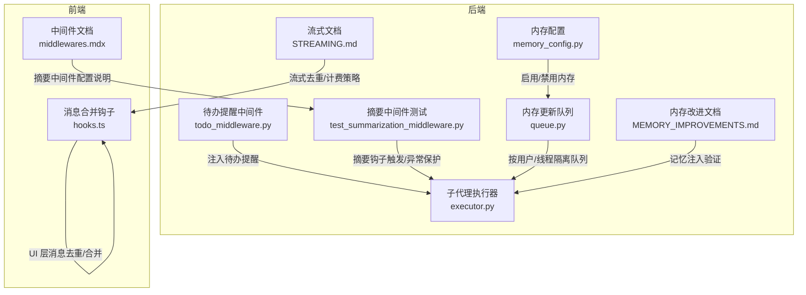
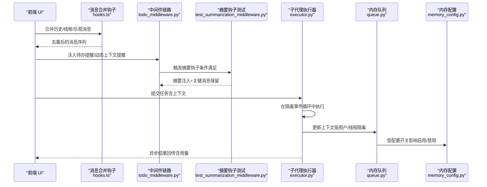
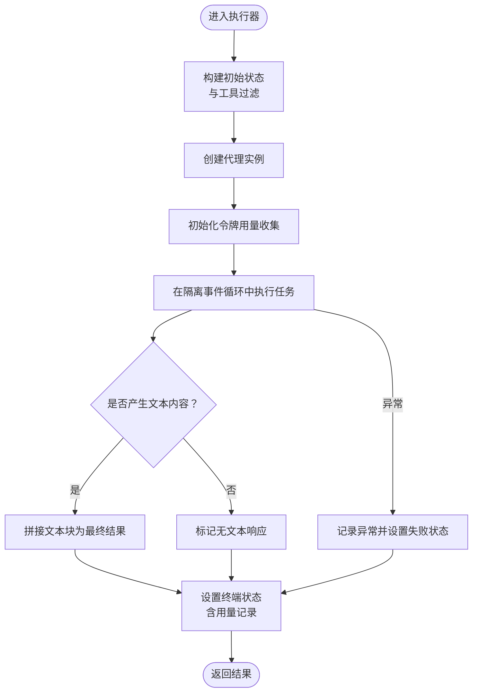
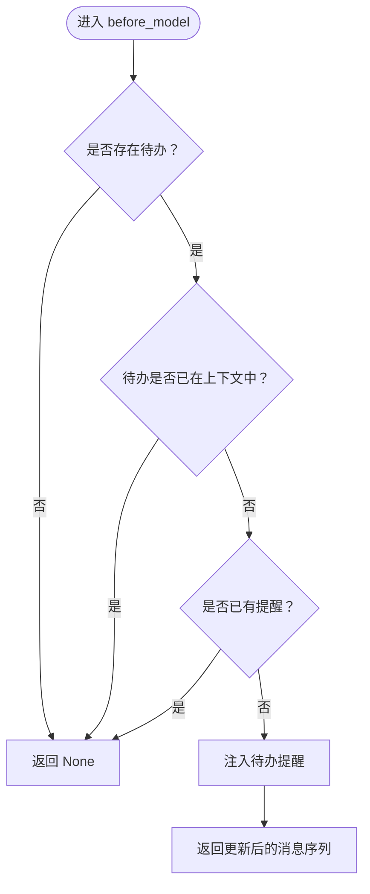
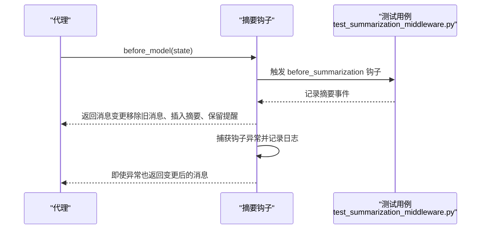
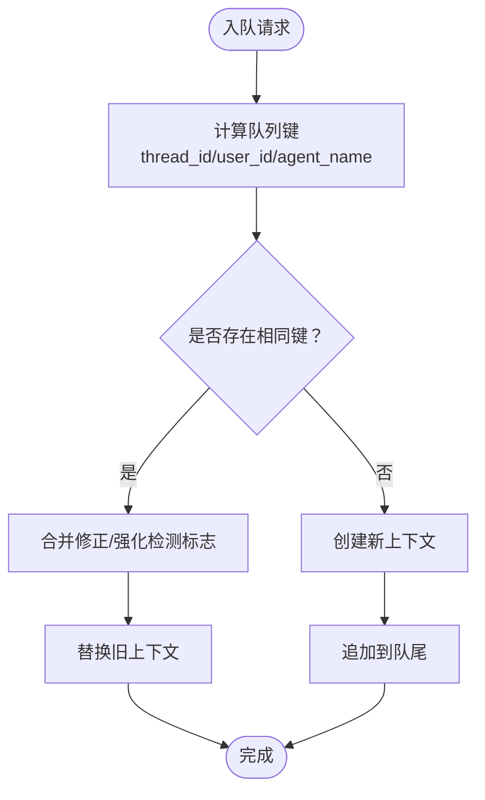
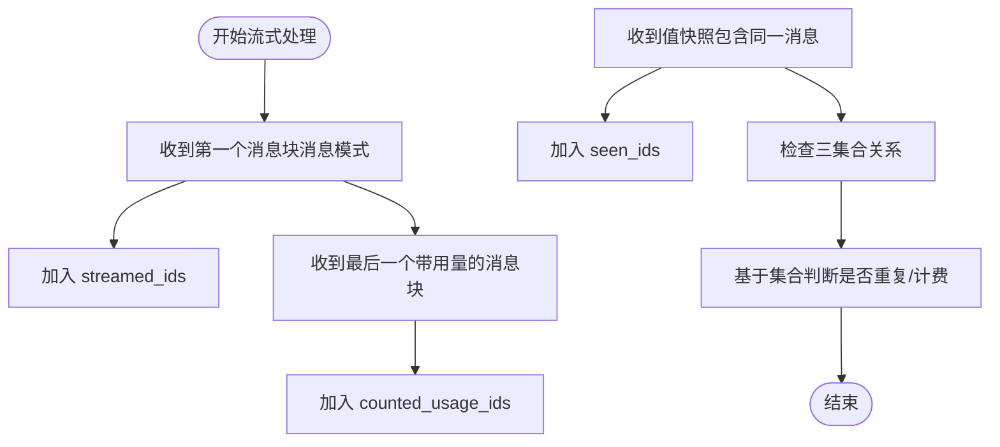
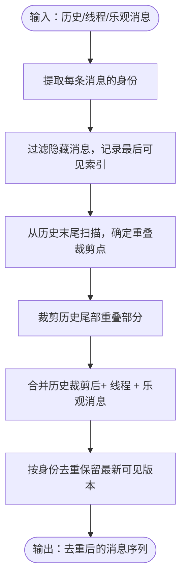
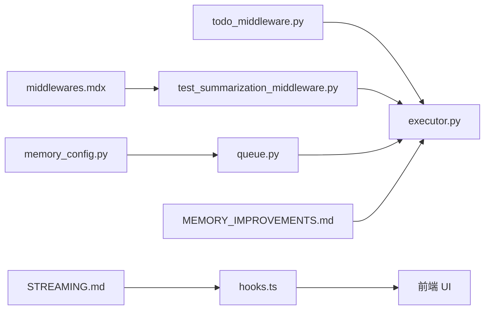

# 上下文工程

<cite>
**本文引用的文件**
- [executor.py](file://backend/packages/harness/deerflow/subagents/executor.py)
- [todo_middleware.py](file://backend/packages/harness/deerflow/agents/middlewares/todo_middleware.py)
- [test_summarization_middleware.py](file://backend/tests/test_summarization_middleware.py)
- [memory_queue_user_isolation.py](file://backend/tests/test_memory_queue_user_isolation.py)
- [queue.py](file://backend/packages/harness/deerflow/agents/memory/queue.py)
- [memory_config.py](file://backend/packages/harness/deerflow/config/memory_config.py)
- [STREAMING.md](file://backend/docs/STREAMING.md)
- [MEMORY_IMPROVEMENTS.md](file://backend/docs/MEMORY_IMPROVEMENTS.md)
- [middlewares.mdx](file://frontend/src/content/en/harness/middlewares.mdx)
- [hooks.ts](file://frontend/src/core/threads/hooks.ts)
</cite>

## 目录
1. [简介](#简介)
2. [项目结构](#项目结构)
3. [核心组件](#核心组件)
4. [架构总览](#架构总览)
5. [详细组件分析](#详细组件分析)
6. [依赖分析](#依赖分析)
7. [性能考量](#性能考量)
8. [故障排查指南](#故障排查指南)
9. [结论](#结论)
10. [附录](#附录)

## 简介
本文件系统性阐述 DeerFlow 的“上下文工程”能力，聚焦以下关键设计目标：
- 子代理隔离执行：确保子任务在独立事件循环中运行，避免相互干扰并支持实时结果回传。
- 消息处理管道：在消息模式与值快照模式之间进行稳健的去重与计费策略，保障流式输出与用量统计的正确性。
- 摘要生成钩子：在满足触发条件时对历史消息进行压缩摘要，并保留关键提醒类消息，同时保证钩子异常不影响主流程。
- 严格工具调用约束：通过延迟工具发现与过滤中间件，减少上下文占用，提升长对话稳定性。
- 上下文构建与优化：围绕消息序列、关键信息提取、上下文窗口控制与摘要注入，形成可配置、可演进的上下文工程流水线。

## 项目结构
上下文工程涉及后端中间件、内存队列、子代理执行器、前端消息合并等模块协同工作。下图给出与上下文工程相关的模块关系概览：

图表来源
- [executor.py](file://backend/packages/harness/deerflow/subagents/executor.py)
- [todo_middleware.py](file://backend/packages/harness/deerflow/agents/middlewares/todo_middleware.py)
- [test_summarization_middleware.py](file://backend/tests/test_summarization_middleware.py)
- [queue.py](file://backend/packages/harness/deerflow/agents/memory/queue.py)
- [memory_config.py](file://backend/packages/harness/deerflow/config/memory_config.py)
- [STREAMING.md](file://backend/docs/STREAMING.md)
- [MEMORY_IMPROVEMENTS.md](file://backend/docs/MEMORY_IMPROVEMENTS.md)
- [middlewares.mdx](file://frontend/src/content/en/harness/middlewares.mdx)
- [hooks.ts](file://frontend/src/core/threads/hooks.ts)

章节来源
- [executor.py](file://backend/packages/harness/deerflow/subagents/executor.py)
- [todo_middleware.py](file://backend/packages/harness/deerflow/agents/middlewares/todo_middleware.py)
- [test_summarization_middleware.py](file://backend/tests/test_summarization_middleware.py)
- [queue.py](file://backend/packages/harness/deerflow/agents/memory/queue.py)
- [memory_config.py](file://backend/packages/harness/deerflow/config/memory_config.py)
- [STREAMING.md](file://backend/docs/STREAMING.md)
- [MEMORY_IMPROVEMENTS.md](file://backend/docs/MEMORY_IMPROVEMENTS.md)
- [middlewares.mdx](file://frontend/src/content/en/harness/middlewares.mdx)
- [hooks.ts](file://frontend/src/core/threads/hooks.ts)

## 核心组件
- 子代理执行器：负责在持久化隔离事件循环中执行子任务，支持异步结果回传与令牌用量记录；具备严格的异常捕获与终端状态设置。
- 待办提醒中间件：当待办事项不在当前上下文可见范围内时，自动注入提醒，避免因上下文窗口限制导致任务遗漏。
- 摘要中间件测试：覆盖摘要钩子触发、摘要注入、关键消息保留（如动态上下文提醒）、钩子异常不阻断主流程等行为。
- 内存更新队列：按线程、用户、代理名聚合上下文更新，实现用户级隔离与去重合并，避免并发写入冲突。
- 流式文档：明确消息模式与值快照模式下的去重与计费集合语义，强调三套集合的时序差异与不变式。
- 内存改进文档：验证记忆注入的准确性、置信度排序与预算受限的事实选择。
- 前端消息合并钩子：基于消息身份去重与历史/线程重叠裁剪，确保 UI 展示稳定且不丢失追踪数据。
- 中间件文档：提供摘要中间件的完整配置参考与激活条件。

章节来源
- [executor.py](file://backend/packages/harness/deerflow/subagents/executor.py)
- [todo_middleware.py](file://backend/packages/harness/deerflow/agents/middlewares/todo_middleware.py)
- [test_summarization_middleware.py](file://backend/tests/test_summarization_middleware.py)
- [queue.py](file://backend/packages/harness/deerflow/agents/memory/queue.py)
- [STREAMING.md](file://backend/docs/STREAMING.md)
- [MEMORY_IMPROVEMENTS.md](file://backend/docs/MEMORY_IMPROVEMENTS.md)
- [middlewares.mdx](file://frontend/src/content/en/harness/middlewares.mdx)
- [hooks.ts](file://frontend/src/core/threads/hooks.ts)

## 架构总览
下图展示上下文工程在一次典型交互中的关键流转：前端消息合并与去重、中间件注入与摘要、子代理隔离执行、内存队列与配置控制。

图表来源
- [hooks.ts](file://frontend/src/core/threads/hooks.ts)
- [todo_middleware.py](file://backend/packages/harness/deerflow/agents/middlewares/todo_middleware.py)
- [test_summarization_middleware.py](file://backend/tests/test_summarization_middleware.py)
- [executor.py](file://backend/packages/harness/deerflow/subagents/executor.py)
- [queue.py](file://backend/packages/harness/deerflow/agents/memory/queue.py)
- [memory_config.py](file://backend/packages/harness/deerflow/config/memory_config.py)

## 详细组件分析

### 子代理隔离执行器
- 设计要点
  - 在持久化隔离事件循环中执行，避免跨任务共享状态引发竞态。
  - 支持同步/异步两种执行模式，异步模式通过结果持有者实现实时更新。
  - 对 LLM 调用进行令牌用量收集，异常时记录错误并设置终端状态。
- 关键流程
  - 初始化状态与工具过滤，创建代理实例。
  - 执行阶段收集文本块，拼接最终结果。
  - 统一设置终端状态与用量记录，保证可观测性。

图表来源
- [executor.py](file://backend/packages/harness/deerflow/subagents/executor.py)

章节来源
- [executor.py](file://backend/packages/harness/deerflow/subagents/executor.py)

### 待办提醒中间件
- 设计要点
  - 当待办列表不在当前消息可见范围时，注入提醒以避免被截断。
  - 若已存在提醒且尚未被截断，则不再重复注入。
- 行为验证
  - 测试覆盖：提醒注入、重复注入防护、与摘要流程的协同。

图表来源
- [todo_middleware.py](file://backend/packages/harness/deerflow/agents/middlewares/todo_middleware.py)

章节来源
- [todo_middleware.py](file://backend/packages/harness/deerflow/agents/middlewares/todo_middleware.py)

### 摘要生成钩子与严格工具调用约束
- 摘要钩子
  - 触发条件：消息数量达到阈值。
  - 动作：移除旧消息，插入摘要消息，并保留关键提醒类消息。
  - 异常保护：钩子抛出异常不会阻断压缩流程。
- 工具调用约束
  - 延迟工具发现：通过工具搜索工具延迟暴露工具签名，减少上下文占用。
  - 过滤中间件：隐藏延迟工具的模式定义，仅在需要时呈现。

图表来源
- [test_summarization_middleware.py](file://backend/tests/test_summarization_middleware.py)

章节来源
- [test_summarization_middleware.py](file://backend/tests/test_summarization_middleware.py)
- [middlewares.mdx](file://frontend/src/content/en/harness/middlewares.mdx)

### 内存更新队列与用户隔离
- 设计要点
  - 按线程、用户、代理名聚合上下文更新，避免并发写入冲突。
  - 合并修正与强化检测标志，确保上下文变更的完整性。
  - 支持用户级隔离，不同用户更新互不干扰。
- 行为验证
  - 测试覆盖：不同用户的更新被分别排队，队列大小与用户标识正确。

图表来源
- [queue.py](file://backend/packages/harness/deerflow/agents/memory/queue.py)

章节来源
- [queue.py](file://backend/packages/harness/deerflow/agents/memory/queue.py)
- [memory_config.py](file://backend/packages/harness/deerflow/config/memory_config.py)
- [memory_queue_user_isolation.py](file://backend/tests/test_memory_queue_user_isolation.py)

### 流式去重与用量计数策略
- 设计要点
  - 三套集合分别跟踪：已流式显示、已见值快照、已计用量。
  - 由于到达时机不同，三者包含关系需显式维护，避免类型系统掩盖时序细节。
- 行为验证
  - 文档明确指出：values 快照到达时才标记“已处理”，消息模式首块到达时才标记“已流式”，带用量块到达时才标记“已计用量”。

图表来源
- [STREAMING.md](file://backend/docs/STREAMING.md)

章节来源
- [STREAMING.md](file://backend/docs/STREAMING.md)

### 前端消息合并与去重
- 设计要点
  - 基于消息身份进行去重，优先保留可见消息的最新版本。
  - 对历史消息进行“重叠后缀”裁剪，避免与线程消息重复。
  - 隐藏消息被视为 UI 控制消息，不应作为观测记录参与去重。
- 行为验证
  - 测试覆盖：可见/隐藏消息的去重规则、历史与线程消息的重叠裁剪。

图表来源
- [hooks.ts](file://frontend/src/core/threads/hooks.ts)

章节来源
- [hooks.ts](file://frontend/src/core/threads/hooks.ts)

## 依赖分析
- 组件耦合
  - 子代理执行器依赖中间件链路（待办提醒、摘要钩子）与内存队列，用于构建稳定的上下文。
  - 内存队列受内存配置控制，决定是否启用上下文更新。
  - 前端钩子依赖后端消息去重策略，确保 UI 展示与后端可观测性一致。
- 外部依赖与集成点
  - 中间件配置来源于前端文档与配置文件，影响摘要模型与工具发现策略。
  - 流式文档定义了消息模式与值快照模式的契约，指导前后端一致性实现。

图表来源
- [hooks.ts](file://frontend/src/core/threads/hooks.ts)
- [todo_middleware.py](file://backend/packages/harness/deerflow/agents/middlewares/todo_middleware.py)
- [test_summarization_middleware.py](file://backend/tests/test_summarization_middleware.py)
- [executor.py](file://backend/packages/harness/deerflow/subagents/executor.py)
- [queue.py](file://backend/packages/harness/deerflow/agents/memory/queue.py)
- [memory_config.py](file://backend/packages/harness/deerflow/config/memory_config.py)
- [STREAMING.md](file://backend/docs/STREAMING.md)
- [MEMORY_IMPROVEMENTS.md](file://backend/docs/MEMORY_IMPROVEMENTS.md)
- [middlewares.mdx](file://frontend/src/content/en/harness/middlewares.mdx)

章节来源
- [hooks.ts](file://frontend/src/core/threads/hooks.ts)
- [todo_middleware.py](file://backend/packages/harness/deerflow/agents/middlewares/todo_middleware.py)
- [test_summarization_middleware.py](file://backend/tests/test_summarization_middleware.py)
- [executor.py](file://backend/packages/harness/deerflow/subagents/executor.py)
- [queue.py](file://backend/packages/harness/deerflow/agents/memory/queue.py)
- [memory_config.py](file://backend/packages/harness/deerflow/config/memory_config.py)
- [STREAMING.md](file://backend/docs/STREAMING.md)
- [MEMORY_IMPROVEMENTS.md](file://backend/docs/MEMORY_IMPROVEMENTS.md)
- [middlewares.mdx](file://frontend/src/content/en/harness/middlewares.mdx)

## 性能考量
- 摘要中间件的成本控制
  - 使用轻量模型进行摘要生成，降低总体成本。
  - 仅在消息数量达到阈值时触发，避免频繁压缩。
- 工具调用约束
  - 延迟工具发现与过滤减少上下文占用，提高长对话稳定性。
- 流式处理
  - 明确三集合的时序差异，避免重复计费与重复文本合成，提升吞吐。
- 内存队列
  - 用户级隔离与去重合并减少无效写入，提升内存更新效率。

## 故障排查指南
- 摘要钩子异常不阻断
  - 现象：钩子抛出异常。
  - 影响：压缩流程仍继续，但会记录错误日志。
  - 排查：查看钩子实现与测试用例，确认异常分支已被捕获。
- 流式重复文本问题
  - 现象：vLLM 流式输出出现重复文本。
  - 原因：消息 id 为空或消息模式与值快照到达时机差异导致。
  - 解决：遵循三集合策略，确保 values 快照到达时标记“已处理”，并在消息模式首次到达时标记“已流式”。
- 用户隔离失效
  - 现象：不同用户上下文互相污染。
  - 排查：确认队列键包含 user_id，测试用例验证不同用户更新被分别排队。

章节来源
- [test_summarization_middleware.py](file://backend/tests/test_summarization_middleware.py)
- [STREAMING.md](file://backend/docs/STREAMING.md)
- [memory_queue_user_isolation.py](file://backend/tests/test_memory_queue_user_isolation.py)

## 结论
上下文工程通过“子代理隔离执行 + 消息处理管道 + 摘要生成钩子 + 严格工具调用约束”的组合拳，在保证信息完整性的同时显著降低了上下文开销。配合前端消息合并与去重、内存队列用户隔离、以及流式去重与用量计数策略，形成了可配置、可演进、可观测的上下文工程体系。

## 附录

### 配置选项与最佳实践
- 摘要策略
  - 触发阈值：根据任务长度与模型上下文窗口设定合适的消息数量阈值。
  - 保留关键消息：确保动态上下文提醒等关键提示在摘要后仍可见。
  - 摘要模型：推荐使用轻量模型（如 gpt-4o-mini）以降低成本。
- 消息过滤规则
  - 隐藏消息：仅作为 UI 控制消息，不参与去重与观测记录。
  - 去重策略：基于消息身份去重，优先保留可见消息的最新版本。
- 工具调用约束
  - 延迟工具发现：开启工具搜索，隐藏延迟工具的模式定义。
  - 工具过滤：仅在需要时呈现工具签名，减少上下文占用。
- 内存与隔离
  - 内存配置：根据业务需求启用/禁用内存更新队列。
  - 用户隔离：确保不同用户上下文互不干扰，避免并发写入冲突。
- 应用场景优化建议
  - 长对话/多轮问答：启用摘要中间件与延迟工具发现，合理设置阈值。
  - 任务驱动型对话：注入待办提醒中间件，确保关键任务不被截断。
  - 视觉分析：在模型支持视觉时启用视图图像中间件，直接注入图像内容。

章节来源
- [middlewares.mdx](file://frontend/src/content/en/harness/middlewares.mdx)
- [MEMORY_IMPROVEMENTS.md](file://backend/docs/MEMORY_IMPROVEMENTS.md)
- [memory_config.py](file://backend/packages/harness/deerflow/config/memory_config.py)
- [todo_middleware.py](file://backend/packages/harness/deerflow/agents/middlewares/todo_middleware.py)
- [test_summarization_middleware.py](file://backend/tests/test_summarization_middleware.py)