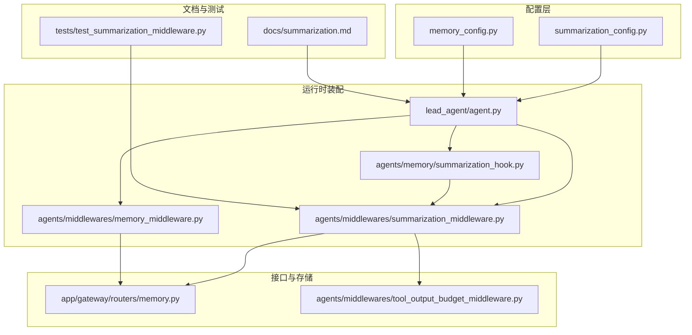
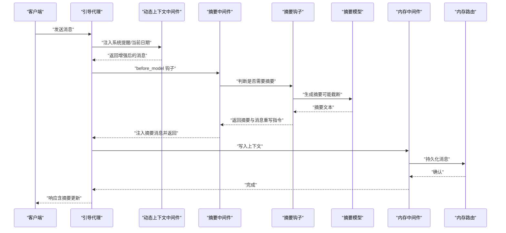
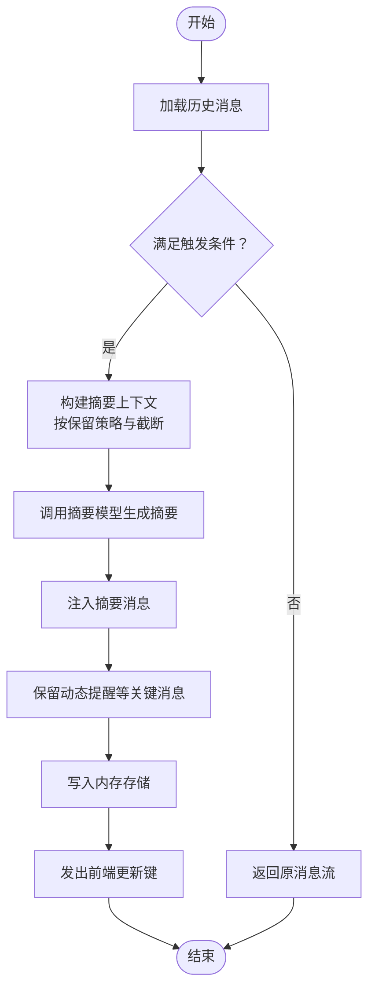
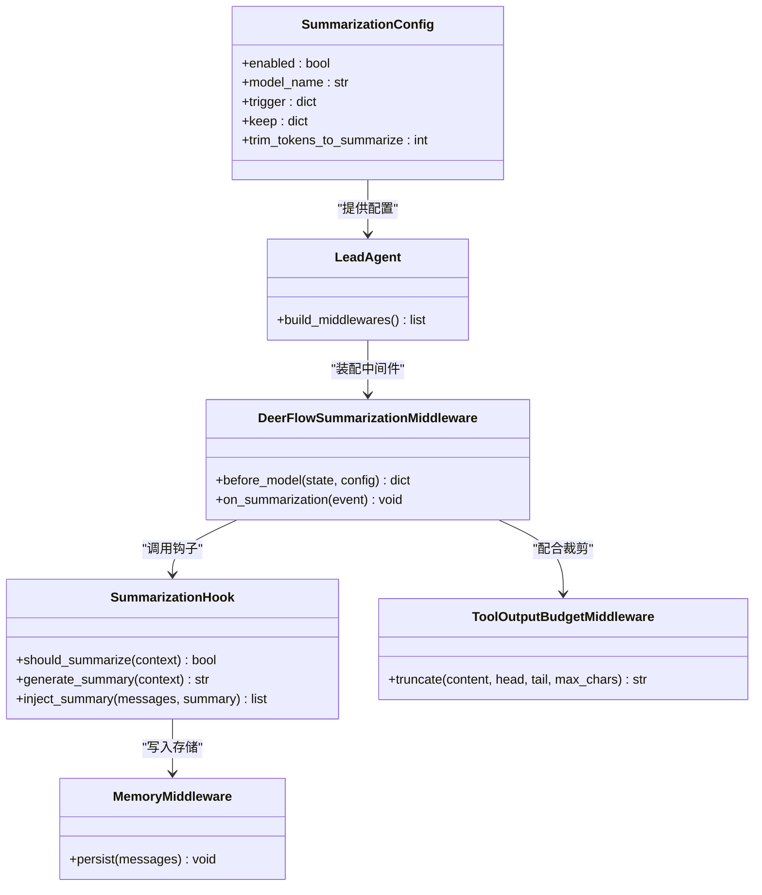
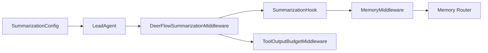

# 上下文摘要生成

<cite>
**本文引用的文件**
- [summarization.md](file://backend/docs/summarization.md)
- [summarization_hook.py](file://backend/packages/harness/deerflow/agents/memory/summarization_hook.py)
- [summarization_middleware.py](file://backend/packages/harness/deerflow/agents/middlewares/summarization_middleware.py)
- [summarization_config.py](file://backend/packages/harness/deerflow/config/summarization_config.py)
- [test_summarization_middleware.py](file://backend/tests/test_summarization_middleware.py)
- [agent.py](file://backend/packages/harness/deerflow/agents/lead_agent/agent.py)
- [memory_middleware.py](file://backend/packages/harness/deerflow/agents/middlewares/memory_middleware.py)
- [memory.py](file://backend/app/gateway/routers/memory.py)
- [memory_config.py](file://backend/packages/harness/deerflow/config/memory_config.py)
- [tool_output_budget_middleware.py](file://backend/packages/harness/deerflow/agents/middlewares/tool_output_budget_middleware.py)
</cite>

## 目录
1. [简介](#简介)
2. [项目结构](#项目结构)
3. [核心组件](#核心组件)
4. [架构总览](#架构总览)
5. [详细组件分析](#详细组件分析)
6. [依赖关系分析](#依赖关系分析)
7. [性能考量](#性能考量)
8. [故障排查指南](#故障排查指南)
9. [结论](#结论)
10. [附录](#附录)

## 简介
本文件面向 DeerFlow 的上下文摘要生成系统，系统通过“摘要钩子”与“摘要中间件”协同工作，在对话流中按策略触发对历史消息的压缩与总结，并以结构化方式注入新的摘要消息，从而在不丢失关键信息的前提下降低上下文长度，提升推理效率与成本控制能力。本文将从触发条件、算法选择、内容压缩策略、质量评估机制、生成流程、配置项、性能对比与适用场景等方面进行系统化阐述。

## 项目结构
与上下文摘要直接相关的代码主要分布在以下模块：
- 摘要配置：summarization_config.py
- 摘要钩子：agents/memory/summarization_hook.py
- 摘要中间件：agents/middlewares/summarization_middleware.py
- 引导代理装配：agents/lead_agent/agent.py
- 内存中间件（上下文持久化）：agents/middlewares/memory_middleware.py
- 内存路由接口：app/gateway/routers/memory.py
- 工具输出预算中间件（辅助内容压缩）：agents/middlewares/tool_output_budget_middleware.py
- 文档与最佳实践：docs/summarization.md
- 单元测试：tests/test_summarization_middleware.py

图表来源
- [summarization_config.py](file://backend/packages/harness/deerflow/config/summarization_config.py)
- [summarization_hook.py](file://backend/packages/harness/deerflow/agents/memory/summarization_hook.py)
- [summarization_middleware.py](file://backend/packages/harness/deerflow/agents/middlewares/summarization_middleware.py)
- [memory_middleware.py](file://backend/packages/harness/deerflow/agents/middlewares/memory_middleware.py)
- [memory.py](file://backend/app/gateway/routers/memory.py)
- [tool_output_budget_middleware.py](file://backend/packages/harness/deerflow/agents/middlewares/tool_output_budget_middleware.py)
- [agent.py](file://backend/packages/harness/deerflow/agents/lead_agent/agent.py)
- [summarization.md](file://backend/docs/summarization.md)
- [test_summarization_middleware.py](file://backend/tests/test_summarization_middleware.py)

章节来源
- [summarization_config.py](file://backend/packages/harness/deerflow/config/summarization_config.py)
- [summarization_hook.py](file://backend/packages/harness/deerflow/agents/memory/summarization_hook.py)
- [summarization_middleware.py](file://backend/packages/harness/deerflow/agents/middlewares/summarization_middleware.py)
- [agent.py](file://backend/packages/harness/deerflow/agents/lead_agent/agent.py)
- [summarization.md](file://backend/docs/summarization.md)

## 核心组件
- 摘要配置（SummarizationConfig）
  - 控制是否启用摘要、摘要模型名称、触发阈值（支持 token、message、fraction）、保留策略（keep）、摘要前截断长度等。
- 摘要钩子（SummarizationHook）
  - 在运行时根据配置与上下文状态决定是否需要生成摘要；负责调用 LLM 执行摘要生成，并将结果注入消息序列。
- 摘要中间件（DeerFlowSummarizationMiddleware）
  - LangGraph 中间件形态，拦截 before_model 阶段，执行摘要决策与消息重写；支持事件回调、前端更新键注入等。
- 引导代理装配（LeadAgent）
  - 将 DynamicContextMiddleware、SummarizationMiddleware、TodoListMiddleware 等按顺序注入，形成完整的上下文管理链。
- 内存中间件（MemoryMiddleware）
  - 负责将上下文持久化至存储，确保摘要后仍可检索与回放。
- 工具输出预算中间件（ToolOutputBudgetMiddleware）
  - 对工具输出进行预算裁剪，减少冗长输出进入上下文，间接提升摘要质量与成本控制。

章节来源
- [summarization_config.py](file://backend/packages/harness/deerflow/config/summarization_config.py)
- [summarization_hook.py](file://backend/packages/harness/deerflow/agents/memory/summarization_hook.py)
- [summarization_middleware.py](file://backend/packages/harness/deerflow/agents/middlewares/summarization_middleware.py)
- [agent.py](file://backend/packages/harness/deerflow/agents/lead_agent/agent.py)
- [memory_middleware.py](file://backend/packages/harness/deerflow/agents/middlewares/memory_middleware.py)
- [tool_output_budget_middleware.py](file://backend/packages/harness/deerflow/agents/middlewares/tool_output_budget_middleware.py)

## 架构总览
下图展示了从消息输入到摘要注入的整体流程，以及各组件之间的交互关系。

图表来源
- [agent.py](file://backend/packages/harness/deerflow/agents/lead_agent/agent.py)
- [summarization_middleware.py](file://backend/packages/harness/deerflow/agents/middlewares/summarization_middleware.py)
- [summarization_hook.py](file://backend/packages/harness/deerflow/agents/memory/summarization_hook.py)
- [memory_middleware.py](file://backend/packages/harness/deerflow/agents/middlewares/memory_middleware.py)
- [memory.py](file://backend/app/gateway/routers/memory.py)

## 详细组件分析

### 触发条件与策略
- 触发类型
  - 基于 token 数量：推荐设置为模型上下文窗口的 60%-80%，例如 8K 上下文可用 4000-6000 token。
  - 基于消息数量：适合短消息密集场景，建议 50-100 条消息区间。
  - 基于比例：按模型最大输入 token 的百分比自动适配多模型环境。
- 组合触发
  - 可同时配置多种触发类型，系统以“任一满足即触发”策略生效，提高鲁棒性。
- 保留策略（keep）
  - 支持基于消息数、token 数或比例三种方式，用于保留最新且关键的历史片段，避免摘要丢失重要上下文。
- 摘要前截断
  - 可限制传给摘要模型的上下文长度，降低昂贵摘要调用的成本与延迟。

章节来源
- [summarization.md](file://backend/docs/summarization.md)
- [summarization_config.py](file://backend/packages/harness/deerflow/config/summarization_config.py)

### 摘要算法选择
- 模型选择
  - 推荐使用轻量、低成本模型（如 gpt-4o-mini、claude-haiku）进行摘要生成，显著降低费用。
  - 默认情况下若未指定模型名，则沿用默认模型，适用于简单部署但成本较高。
- 提示词与格式
  - 摘要以特定格式注入为 HumanMessage，便于后续处理与展示。
- 事件与前端更新
  - 中间件可在流式响应中发出前端更新键，通知界面进行局部刷新。

章节来源
- [summarization.md](file://backend/docs/summarization.md)
- [summarization_middleware.py](file://backend/packages/harness/deerflow/agents/middlewares/summarization_middleware.py)
- [test_summarization_middleware.py](file://backend/tests/test_summarization_middleware.py)

### 内容压缩策略
- 消息保留规则
  - 最新消息无条件保留；AI/Tool 成对消息不可拆分；摘要注入采用固定格式。
- 工具输出预算
  - 当工具输出过长时，预算中间件会进行头尾截断并在中间插入省略标记，保证上下文可控。
- 截断与行边界对齐
  - 截断逻辑会尽量对齐换行边界，避免破坏可读性。

章节来源
- [summarization.md](file://backend/docs/summarization.md)
- [tool_output_budget_middleware.py](file://backend/packages/harness/deerflow/agents/middlewares/tool_output_budget_middleware.py)

### 质量评估机制
- 事件回调
  - 中间件支持注册回调函数，以便在摘要生成前后捕获事件，用于日志记录与质量审计。
- 流式更新键
  - 通过前端更新键，前端可感知摘要注入时机，实现更友好的用户反馈。
- 测试验证
  - 单测覆盖摘要注入、动态提醒保留、前端更新键等关键行为，确保行为符合预期。

章节来源
- [summarization_middleware.py](file://backend/packages/harness/deerflow/agents/middlewares/summarization_middleware.py)
- [test_summarization_middleware.py](file://backend/tests/test_summarization_middleware.py)

### 生成流程（从原始消息到精简摘要）

图表来源
- [summarization_middleware.py](file://backend/packages/harness/deerflow/agents/middlewares/summarization_middleware.py)
- [summarization_hook.py](file://backend/packages/harness/deerflow/agents/memory/summarization_hook.py)
- [memory_middleware.py](file://backend/packages/harness/deerflow/agents/middlewares/memory_middleware.py)
- [memory.py](file://backend/app/gateway/routers/memory.py)

### 类关系与职责

图表来源
- [summarization_config.py](file://backend/packages/harness/deerflow/config/summarization_config.py)
- [summarization_hook.py](file://backend/packages/harness/deerflow/agents/memory/summarization_hook.py)
- [summarization_middleware.py](file://backend/packages/harness/deerflow/agents/middlewares/summarization_middleware.py)
- [agent.py](file://backend/packages/harness/deerflow/agents/lead_agent/agent.py)
- [memory_middleware.py](file://backend/packages/harness/deerflow/agents/middlewares/memory_middleware.py)
- [tool_output_budget_middleware.py](file://backend/packages/harness/deerflow/agents/middlewares/tool_output_budget_middleware.py)

## 依赖关系分析
- 组件耦合
  - LeadAgent 负责装配中间件链，依赖 SummarizationConfig 与模型工厂解析摘要模型。
  - SummarizationMiddleware 依赖 SummarizationHook 进行摘要生成与消息重写。
  - SummarizationHook 依赖 MemoryMiddleware 完成持久化。
  - ToolOutputBudgetMiddleware 与摘要中间件并行工作，共同控制上下文规模。
- 外部依赖
  - 摘要模型由应用配置解析，支持多供应商与多型号。
  - 内存路由提供统一的上下文存储接口。

图表来源
- [summarization_config.py](file://backend/packages/harness/deerflow/config/summarization_config.py)
- [agent.py](file://backend/packages/harness/deerflow/agents/lead_agent/agent.py)
- [summarization_middleware.py](file://backend/packages/harness/deerflow/agents/middlewares/summarization_middleware.py)
- [summarization_hook.py](file://backend/packages/harness/deerflow/agents/memory/summarization_hook.py)
- [memory_middleware.py](file://backend/packages/harness/deerflow/agents/middlewares/memory_middleware.py)
- [memory.py](file://backend/app/gateway/routers/memory.py)
- [tool_output_budget_middleware.py](file://backend/packages/harness/deerflow/agents/middlewares/tool_output_budget_middleware.py)

## 性能考量
- 触发阈值与保留策略
  - 结合 token 与消息双重触发，可有效平衡吞吐与稳定性。
  - 优先使用消息级保留策略，便于自然对话节奏；必要时引入 token 精控。
- 摘要模型选择
  - 使用轻量模型进行摘要，显著降低延迟与成本；仅在高质量需求时切换到更强模型。
- 上下文截断
  - 合理设置 trim_tokens_to_summarize，避免向摘要模型发送过多冗余内容。
- 工具输出预算
  - 通过预算中间件限制工具输出长度，减少上下文膨胀风险。

章节来源
- [summarization.md](file://backend/docs/summarization.md)
- [summarization_middleware.py](file://backend/packages/harness/deerflow/agents/middlewares/summarization_middleware.py)
- [tool_output_budget_middleware.py](file://backend/packages/harness/deerflow/agents/middlewares/tool_output_budget_middleware.py)

## 故障排查指南
- 摘要质量不佳
  - 增大保留值（keep），提前触发（降低阈值），自定义摘要提示词，或提升摘要模型能力。
- 性能问题
  - 使用更快的摘要模型、减少截断长度、降低触发频率。
- 仍出现超限错误
  - 检查触发阈值是否过低、保留策略是否过大、工具输出是否过长；适当增加截断与预算裁剪。
- 动态提醒丢失
  - 确保摘要中间件在消息重写时保留动态提醒等关键消息。

章节来源
- [summarization.md](file://backend/docs/summarization.md)
- [test_summarization_middleware.py](file://backend/tests/test_summarization_middleware.py)

## 结论
DeerFlow 的上下文摘要系统通过“配置驱动 + 钩子 + 中间件”的组合，实现了高可配置、强鲁棒性的上下文压缩能力。结合工具输出预算与内存持久化，既能保障摘要质量，又能有效控制成本与延迟。建议在生产环境中采用“双触发 + 消息级保留 + 轻量摘要模型”的组合策略，并持续监控与迭代配置参数。

## 附录

### 摘要配置选项一览
- enabled：是否启用摘要
- model_name：摘要使用的模型名称（为空则使用默认模型）
- trigger：触发阈值，支持 token、message、fraction 三类
- keep：保留策略，支持 message、tokens、fraction 三类
- trim_tokens_to_summarize：摘要前截断的最大 token 数
- 其他：摘要提示词定制、事件回调注册点等

章节来源
- [summarization_config.py](file://backend/packages/harness/deerflow/config/summarization_config.py)
- [summarization.md](file://backend/docs/summarization.md)