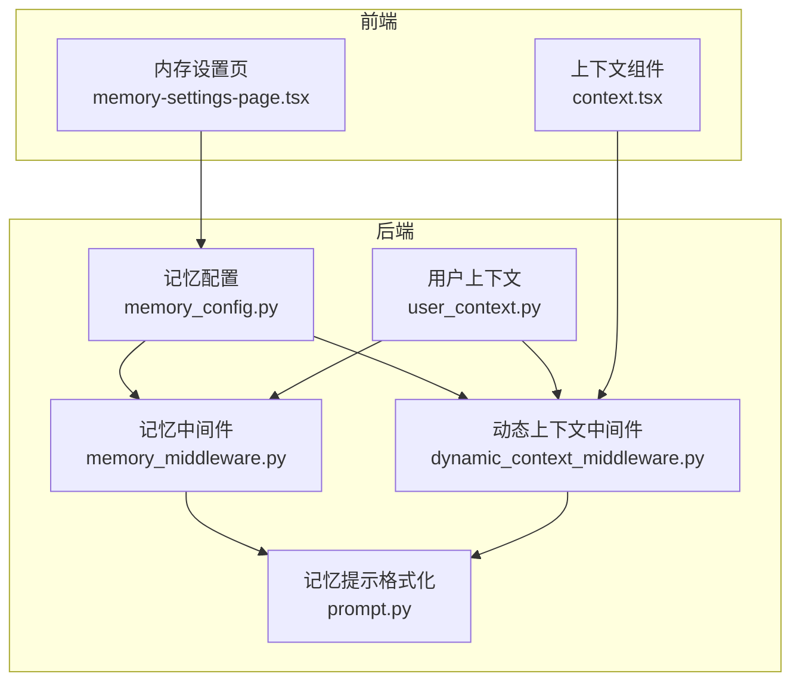
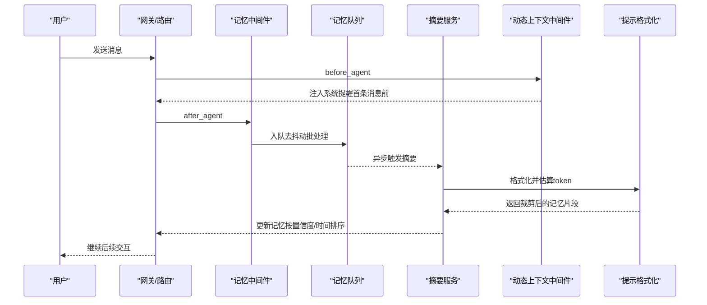
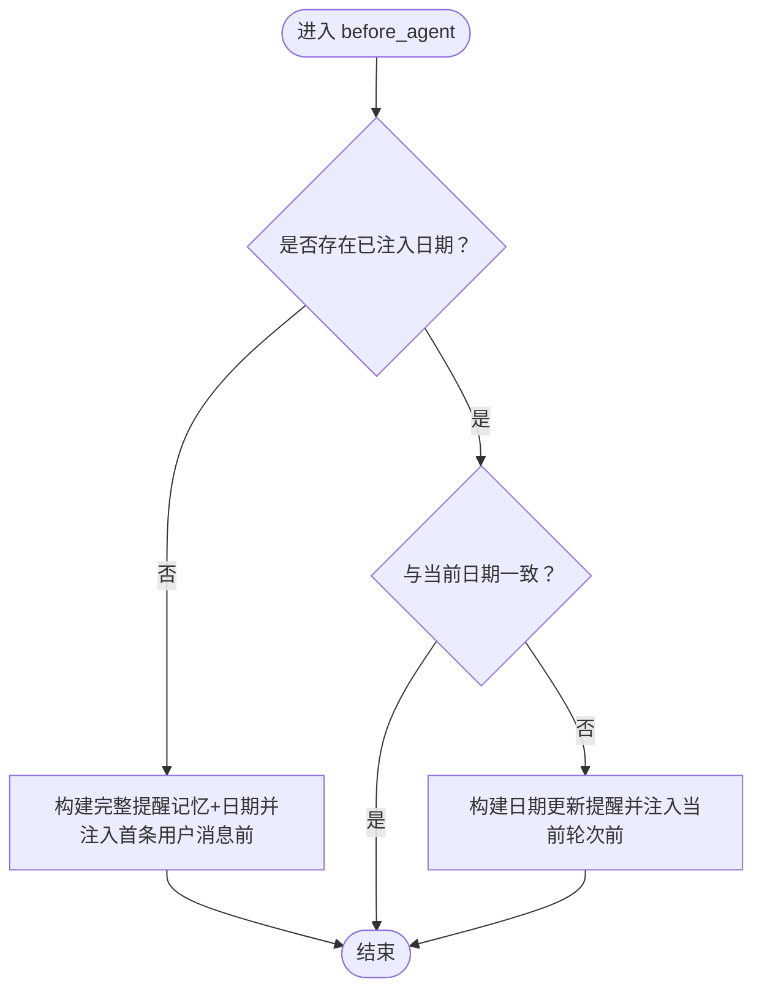
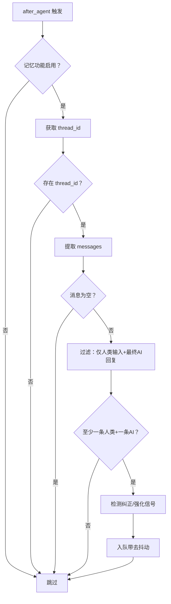
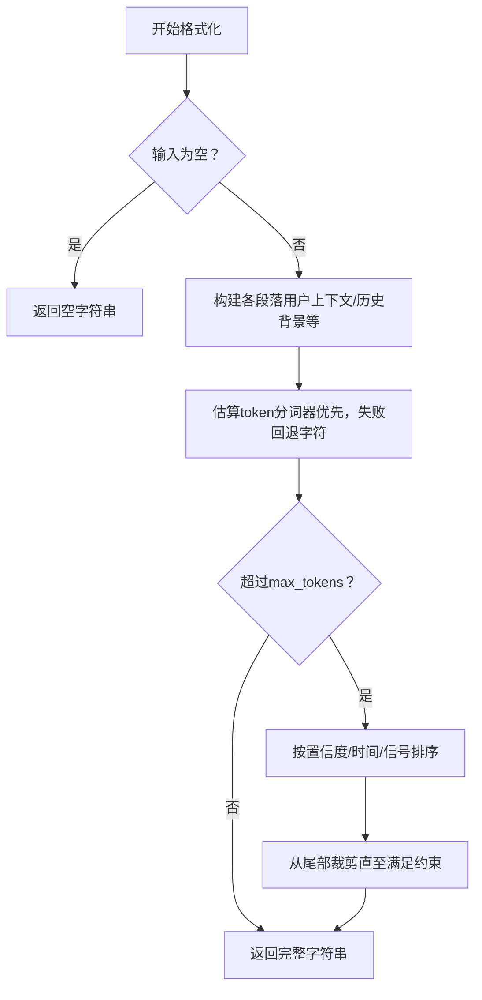
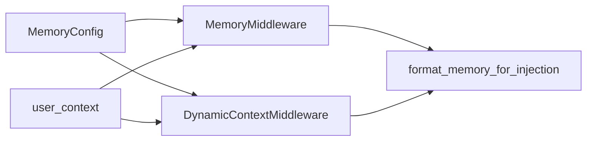

# 上下文窗口管理

<cite>
**本文引用的文件**
- [memory_config.py](file://backend/packages/harness/deerflow/config/memory_config.py)
- [dynamic_context_middleware.py](file://backend/packages/harness/deerflow/agents/middlewares/dynamic_context_middleware.py)
- [memory_middleware.py](file://backend/packages/harness/deerflow/agents/middlewares/memory_middleware.py)
- [prompt.py](file://backend/packages/harness/deerflow/agents/memory/prompt.py)
- [user_context.py](file://backend/packages/harness/deerflow/runtime/user_context.py)
- [test_memory_prompt_injection.py](file://backend/tests/test_memory_prompt_injection.py)
- [test_dynamic_context_middleware.py](file://backend/tests/test_dynamic_context_middleware.py)
- [todo_middleware.py](file://backend/packages/harness/deerflow/agents/middlewares/todo_middleware.py)
- [loop_detection_middleware.py](file://backend/packages/harness/deerflow/agents/middlewares/loop_detection_middleware.py)
- [context.tsx](file://frontend/src/components/ai-elements/context.tsx)
- [memory-settings-page.tsx](file://frontend/src/components/workspace/settings/memory-settings-page.tsx)
</cite>

## 目录
1. [引言](#引言)
2. [项目结构](#项目结构)
3. [核心组件](#核心组件)
4. [架构总览](#架构总览)
5. [组件详解](#组件详解)
6. [依赖关系分析](#依赖关系分析)
7. [性能考量](#性能考量)
8. [故障排查指南](#故障排查指南)
9. [结论](#结论)
10. [附录：配置与最佳实践](#附录配置与最佳实践)

## 引言
本文件系统性阐述 DeerFlow 的上下文窗口管理系统，聚焦以下方面：
- 动态上下文注入：在会话首条用户消息前注入“系统提醒”（包含记忆片段与当前日期），并在跨午夜时进行日期修正。
- 记忆队列与去抖动：对对话进行过滤与去重后，按去抖动策略批量入队，异步通过大模型摘要生成记忆事实。
- 记忆注入与截断：基于分词器估算 token 数量，按最大注入 token 限制进行内容裁剪与优先级排序。
- 窗口大小控制与清理：通过配置项控制记忆上限、置信度阈值、注入上限等；结合“最近优先”与“纠正/强化”信号进行选择性保留。
- 时间衰减与优先级：通过“纠正/强化”信号与时间顺序进行优先级排序，避免过时或低价值信息挤占窗口。

## 项目结构
围绕上下文窗口管理的关键目录与文件：
- 后端配置与中间件
  - 记忆配置：[memory_config.py](file://backend/packages/harness/deerflow/config/memory_config.py)
  - 动态上下文中间件：[dynamic_context_middleware.py](file://backend/packages/harness/deerflow/agents/middlewares/dynamic_context_middleware.py)
  - 记忆中间件（入队与去抖动）：[memory_middleware.py](file://backend/packages/harness/deerflow/agents/middlewares/memory_middleware.py)
  - 记忆提示格式化与 token 估算：[prompt.py](file://backend/packages/harness/deerflow/agents/memory/prompt.py)
  - 用户上下文（用户隔离与运行时用户解析）：[user_context.py](file://backend/packages/harness/deerflow/runtime/user_context.py)
- 前端上下文可视化
  - 上下文使用率展示组件：[context.tsx](file://frontend/src/components/ai-elements/context.tsx)
  - 内存设置页面（历史背景分组）：[memory-settings-page.tsx](file://frontend/src/components/workspace/settings/memory-settings-page.tsx)
- 测试用例
  - 记忆注入与 token 截断测试：[test_memory_prompt_injection.py](file://backend/tests/test_memory_prompt_injection.py)
  - 动态上下文中间件测试：[test_dynamic_context_middleware.py](file://backend/tests/test_dynamic_context_middleware.py)

图表来源
- [memory_config.py:1-84](file://backend/packages/harness/deerflow/config/memory_config.py#L1-L84)
- [dynamic_context_middleware.py:1-205](file://backend/packages/harness/deerflow/agents/middlewares/dynamic_context_middleware.py#L1-L205)
- [memory_middleware.py:1-111](file://backend/packages/harness/deerflow/agents/middlewares/memory_middleware.py#L1-L111)
- [prompt.py:177-219](file://backend/packages/harness/deerflow/agents/memory/prompt.py#L177-L219)
- [user_context.py:1-196](file://backend/packages/harness/deerflow/runtime/user_context.py#L1-L196)
- [context.tsx:114-211](file://frontend/src/components/ai-elements/context.tsx#L114-L211)
- [memory-settings-page.tsx:165-211](file://frontend/src/components/workspace/settings/memory-settings-page.tsx#L165-L211)

章节来源
- [memory_config.py:1-84](file://backend/packages/harness/deerflow/config/memory_config.py#L1-L84)
- [dynamic_context_middleware.py:1-205](file://backend/packages/harness/deerflow/agents/middlewares/dynamic_context_middleware.py#L1-L205)
- [memory_middleware.py:1-111](file://backend/packages/harness/deerflow/agents/middlewares/memory_middleware.py#L1-L111)
- [prompt.py:177-219](file://backend/packages/harness/deerflow/agents/memory/prompt.py#L177-L219)
- [user_context.py:1-196](file://backend/packages/harness/deerflow/runtime/user_context.py#L1-L196)
- [context.tsx:114-211](file://frontend/src/components/ai-elements/context.tsx#L114-L211)
- [memory-settings-page.tsx:165-211](file://frontend/src/components/workspace/settings/memory-settings-page.tsx#L165-L211)

## 核心组件
- 记忆配置（MemoryConfig）
  - 控制是否启用记忆、存储路径与类、去抖动秒数、最大记忆事实数、置信度阈值、是否注入到系统提示、最大注入 token 数等。
- 动态上下文中间件（DynamicContextMiddleware）
  - 在首次用户消息前注入“系统提醒”，包含记忆片段与当前日期；跨午夜时仅注入日期更新提醒。
- 记忆中间件（MemoryMiddleware）
  - 过滤对话消息（仅保留人类输入与最终 AI 回复），按去抖动策略入队；异步通过摘要生成记忆事实。
- 记忆提示格式化（format_memory_for_injection）
  - 将记忆数据格式化为系统提示可注入文本，并以分词器估算 token 数，按最大注入 token 限制进行裁剪。
- 用户上下文（user_context）
  - 提供请求作用域内的用户上下文，支持运行时用户解析与用户隔离。

章节来源
- [memory_config.py:6-62](file://backend/packages/harness/deerflow/config/memory_config.py#L6-L62)
- [dynamic_context_middleware.py:81-130](file://backend/packages/harness/deerflow/agents/middlewares/dynamic_context_middleware.py#L81-L130)
- [memory_middleware.py:28-111](file://backend/packages/harness/deerflow/agents/middlewares/memory_middleware.py#L28-L111)
- [prompt.py:201-219](file://backend/packages/harness/deerflow/agents/memory/prompt.py#L201-L219)
- [user_context.py:100-137](file://backend/packages/harness/deerflow/runtime/user_context.py#L100-L137)

## 架构总览
上下文窗口管理贯穿“消息过滤—去抖动—摘要—注入”的闭环流程，同时在会话生命周期内维护动态上下文提醒，确保前缀缓存命中与日期一致性。

图表来源
- [memory_middleware.py:52-111](file://backend/packages/harness/deerflow/agents/middlewares/memory_middleware.py#L52-L111)
- [dynamic_context_middleware.py:156-204](file://backend/packages/harness/deerflow/agents/middlewares/dynamic_context_middleware.py#L156-L204)
- [prompt.py:201-219](file://backend/packages/harness/deerflow/agents/memory/prompt.py#L201-L219)

## 组件详解

### 动态上下文中间件（时间一致性与前缀缓存）
- 首次注入：在第一条用户消息前插入“系统提醒”，包含记忆片段与当前日期；该提醒消息被持久化，保证后续轮次前缀缓存命中。
- 跨午夜修正：若对话跨越午夜，仅在当前轮次前注入日期更新提醒，避免重复注入。
- 消息识别：通过隐藏标记识别“系统提醒”消息，避免误判用户消息中的相同标签。

图表来源
- [dynamic_context_middleware.py:156-196](file://backend/packages/harness/deerflow/agents/middlewares/dynamic_context_middleware.py#L156-L196)

章节来源
- [dynamic_context_middleware.py:81-130](file://backend/packages/harness/deerflow/agents/middlewares/dynamic_context_middleware.py#L81-L130)
- [dynamic_context_middleware.py:156-204](file://backend/packages/harness/deerflow/agents/middlewares/dynamic_context_middleware.py#L156-L204)

### 记忆中间件（消息过滤、去抖动与入队）
- 过滤策略：仅保留人类输入与最终 AI 回复，忽略工具调用消息，减少噪声。
- 去抖动：根据配置的去抖动秒数合并多轮更新，降低写入频率。
- 检测信号：识别“纠正/强化”信号，作为后续排序与保留的优先级依据。
- 用户隔离：在入队时捕获有效用户 ID，确保文件系统隔离。

图表来源
- [memory_middleware.py:52-111](file://backend/packages/harness/deerflow/agents/middlewares/memory_middleware.py#L52-L111)
- [user_context.py:100-137](file://backend/packages/harness/deerflow/runtime/user_context.py#L100-L137)

章节来源
- [memory_middleware.py:28-111](file://backend/packages/harness/deerflow/agents/middlewares/memory_middleware.py#L28-L111)
- [user_context.py:100-137](file://backend/packages/harness/deerflow/runtime/user_context.py#L100-L137)

### 记忆注入与窗口裁剪（重要性评分、冗余检测、价值评估）
- 分词器估算：使用分词器估算文本 token 数，无法加载编码器时采用字符估算回退。
- 重要性评分：对记忆片段进行置信度归一化，低于阈值的片段不注入。
- 价值评估：结合“纠正/强化”信号与时间顺序，优先保留高价值片段。
- 冗余检测：过滤工具调用等非语义消息，避免冗余占用窗口。
- 截断策略：当累计 token 超过最大注入 token 时，按重要性与时间顺序裁剪。

图表来源
- [prompt.py:177-219](file://backend/packages/harness/deerflow/agents/memory/prompt.py#L177-L219)
- [memory_config.py:47-62](file://backend/packages/harness/deerflow/config/memory_config.py#L47-L62)

章节来源
- [prompt.py:177-219](file://backend/packages/harness/deerflow/agents/memory/prompt.py#L177-L219)
- [memory_config.py:41-62](file://backend/packages/harness/deerflow/config/memory_config.py#L41-L62)

### 窗口大小控制与清理规则
- 最大记忆事实数：控制记忆库中事实数量上限，避免无限增长。
- 置信度阈值：仅保留高于阈值的记忆片段，剔除低置信度内容。
- 最大注入 token：限制注入到系统提示中的 token 数，防止越界。
- 清理规则：结合“最近优先”与“纠正/强化”信号，定期淘汰过时或低价值片段。

章节来源
- [memory_config.py:41-62](file://backend/packages/harness/deerflow/config/memory_config.py#L41-L62)

### 时间衰减机制与优先级排序
- 信号驱动优先级：检测到“纠正”时优先保留相关片段；否则在“强化”场景下保留强调性片段。
- 时间衰减：较早的历史片段在排序中权重较低，逐步衰减。
- 置信度衰减：低于阈值的片段被直接丢弃，避免污染窗口。

章节来源
- [memory_middleware.py:94-95](file://backend/packages/harness/deerflow/agents/middlewares/memory_middleware.py#L94-L95)
- [memory_config.py:47-52](file://backend/packages/harness/deerflow/config/memory_config.py#L47-L52)

### 前端上下文可视化与设置页
- 使用率展示：计算已用 token 占比与绝对值，显示进度条与百分比。
- 设置页分组：将用户上下文与历史背景分为多个分组，便于查看与管理。

章节来源
- [context.tsx:140-177](file://frontend/src/components/ai-elements/context.tsx#L140-L177)
- [memory-settings-page.tsx:165-211](file://frontend/src/components/workspace/settings/memory-settings-page.tsx#L165-L211)

## 依赖关系分析
- 中间件耦合
  - 动态上下文中间件依赖记忆提示格式化模块以生成记忆片段。
  - 记忆中间件依赖用户上下文模块以解析有效用户 ID 并进行文件系统隔离。
- 配置耦合
  - 记忆配置影响注入上限、事实上限与置信度阈值，进而影响裁剪与排序策略。
- 测试验证
  - 记忆注入与 token 截断测试覆盖了事实包含性、置信度排序与 token 预算限制。
  - 动态上下文中间件测试覆盖首次注入与跨午夜修正逻辑。

图表来源
- [memory_config.py:6-62](file://backend/packages/harness/deerflow/config/memory_config.py#L6-L62)
- [dynamic_context_middleware.py:99-109](file://backend/packages/harness/deerflow/agents/middlewares/dynamic_context_middleware.py#L99-L109)
- [memory_middleware.py:63-64](file://backend/packages/harness/deerflow/agents/middlewares/memory_middleware.py#L63-L64)
- [prompt.py:201-219](file://backend/packages/harness/deerflow/agents/memory/prompt.py#L201-L219)
- [user_context.py:100-137](file://backend/packages/harness/deerflow/runtime/user_context.py#L100-L137)

章节来源
- [test_memory_prompt_injection.py:57-66](file://backend/tests/test_memory_prompt_injection.py#L57-L66)
- [test_dynamic_context_middleware.py:1-205](file://backend/tests/test_dynamic_context_middleware.py#L1-L205)

## 性能考量
- 前缀缓存命中：动态上下文中间件在首条消息前注入固定提醒，保持系统提示前缀稳定，提升缓存命中率。
- 去抖动批处理：记忆中间件按去抖动秒数合并更新，降低频繁写入与摘要成本。
- 分词器估算：优先使用分词器估算 token，失败时回退字符估算，兼顾准确性与稳定性。
- 异步摘要：记忆更新通过异步任务执行，避免阻塞主流程。
- 窗口裁剪：在注入前进行裁剪，避免超限导致的额外开销。

## 故障排查指南
- 记忆未注入
  - 检查记忆配置是否启用、注入开关与最大注入 token 是否合理。
  - 确认动态上下文中间件是否正确识别首条用户消息并插入提醒。
- 跨午夜日期错误
  - 检查动态上下文中间件的日期提取与注入逻辑，确认仅在日期变化时注入更新提醒。
- 记忆事实缺失或过多
  - 检查置信度阈值与最大事实数配置，确认摘要服务是否按优先级裁剪。
- 去抖动无效
  - 检查记忆中间件的线程 ID 获取与入队逻辑，确认去抖动秒数生效。
- 前端上下文显示异常
  - 检查上下文组件的 token 计算与格式化逻辑，确认最大 token 来源与单位一致。

章节来源
- [memory_config.py:9-62](file://backend/packages/harness/deerflow/config/memory_config.py#L9-L62)
- [dynamic_context_middleware.py:156-196](file://backend/packages/harness/deerflow/agents/middlewares/dynamic_context_middleware.py#L156-L196)
- [memory_middleware.py:52-111](file://backend/packages/harness/deerflow/agents/middlewares/memory_middleware.py#L52-L111)
- [context.tsx:140-177](file://frontend/src/components/ai-elements/context.tsx#L140-L177)

## 结论
DeerFlow 的上下文窗口管理通过“动态上下文提醒 + 记忆队列去抖动 + 分词器裁剪 + 信号驱动优先级”的组合，实现了高效、稳定且可扩展的窗口控制。配置层提供灵活的上限与阈值参数，前端提供直观的使用率与设置入口，整体满足多场景下的性能与可用性需求。

## 附录：配置与最佳实践

### 窗口配置选项
- enabled：是否启用记忆机制
- storage_path：记忆存储路径（支持相对/绝对路径与用户隔离）
- storage_class：记忆存储提供者类路径
- debounce_seconds：去抖动秒数（1–300）
- model_name：用于记忆更新的模型名称
- max_facts：最大记忆事实数（10–500）
- fact_confidence_threshold：记忆事实置信度阈值（0.0–1.0）
- injection_enabled：是否将记忆注入系统提示
- max_injection_tokens：最大注入 token 数（100–8000）

章节来源
- [memory_config.py:9-62](file://backend/packages/harness/deerflow/config/memory_config.py#L9-L62)

### 算法要点与参数
- 重要性评分：置信度归一化，低于阈值即丢弃
- 冗余检测：过滤工具调用等非语义消息
- 信息价值评估：结合“纠正/强化”信号与时间顺序
- 窗口优化策略：最近优先 + 截断至 max_injection_tokens

章节来源
- [prompt.py:185-198](file://backend/packages/harness/deerflow/agents/memory/prompt.py#L185-L198)
- [memory_middleware.py:94-95](file://backend/packages/harness/deerflow/agents/middlewares/memory_middleware.py#L94-L95)

### 应用场景最佳实践
- 高频交互（客服/问答）：降低去抖动秒数，提高 max_injection_tokens，确保上下文新鲜度。
- 长对话（知识库检索）：提高 max_facts 与置信度阈值，保留长期有用信息。
- 低资源环境：缩小 max_injection_tokens，启用严格置信度阈值，减少摘要成本。
- 多用户隔离：使用相对路径与 per-user 存储，避免共享状态引发冲突。

### 相关中间件与测试参考
- 待办提醒中间件：在上下文窗口外时注入提醒，避免遗漏关键事项
- 循环检测中间件：通过滑动窗口检测循环，间接保护上下文稳定性

章节来源
- [todo_middleware.py:125-147](file://backend/packages/harness/deerflow/agents/middlewares/todo_middleware.py#L125-L147)
- [loop_detection_middleware.py:184-240](file://backend/packages/harness/deerflow/agents/middlewares/loop_detection_middleware.py#L184-L240)