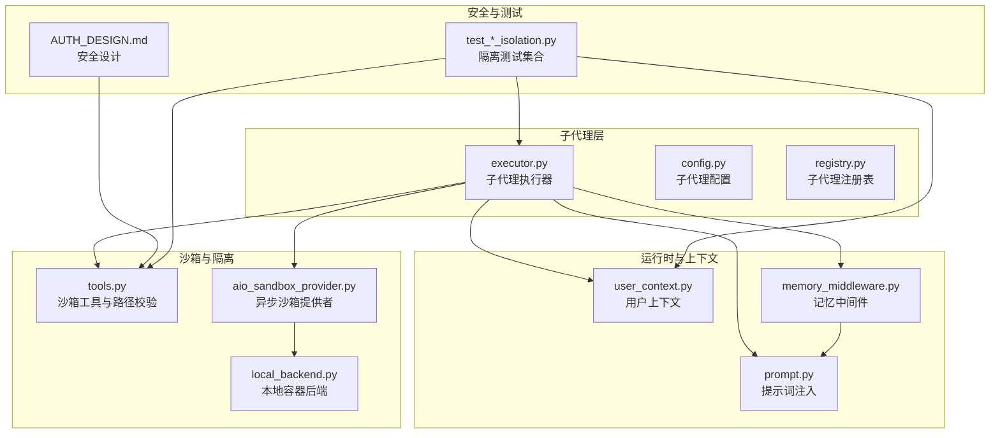
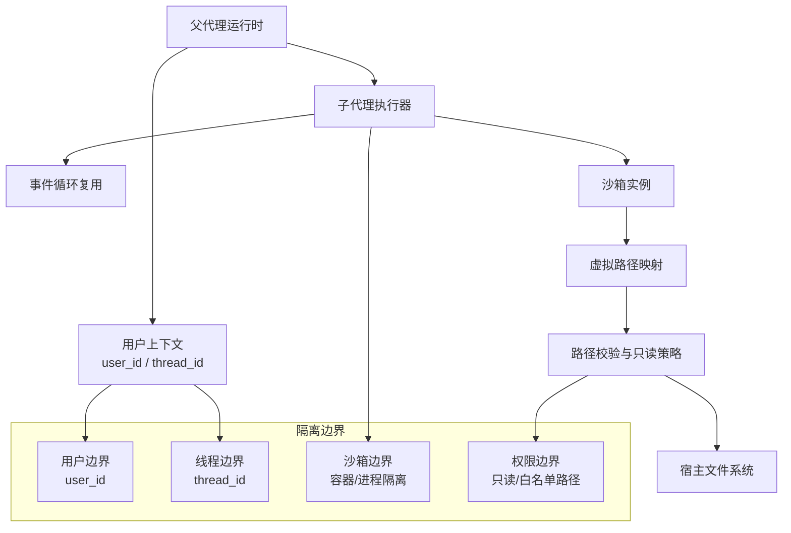
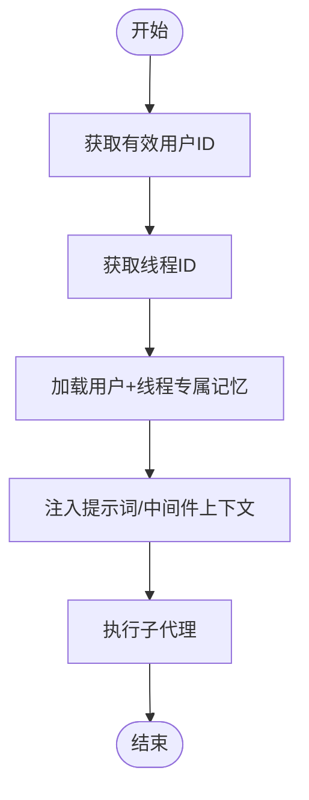
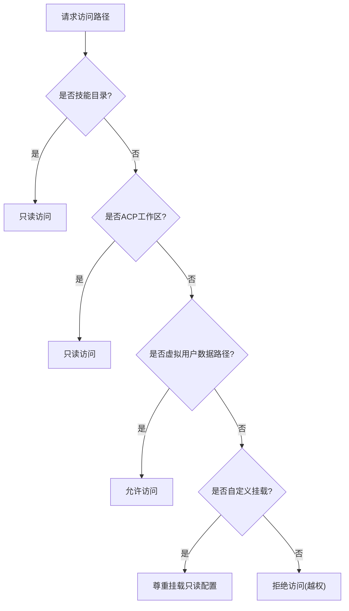
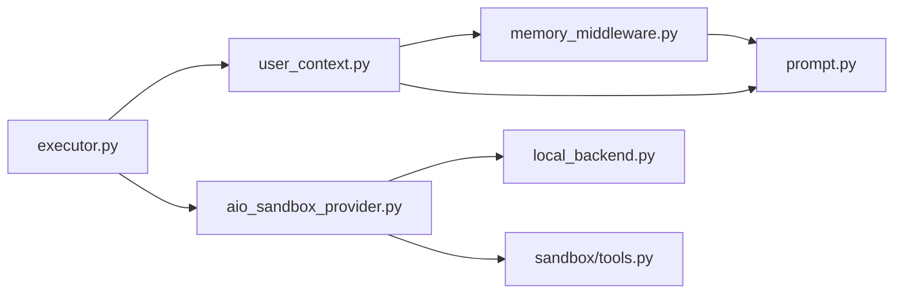

# 子代理上下文隔离

<cite>
**本文引用的文件**
- [executor.py](file://backend/packages/harness/deerflow/subagents/executor.py)
- [config.py](file://backend/packages/harness/deerflow/subagents/config.py)
- [registry.py](file://backend/packages/harness/deerflow/subagents/registry.py)
- [user_context.py](file://backend/packages/harness/deerflow/runtime/user_context.py)
- [tools.py](file://backend/packages/harness/deerflow/sandbox/tools.py)
- [local_backend.py](file://backend/packages/harness/deerflow/community/aio_sandbox/local_backend.py)
- [aio_sandbox_provider.py](file://backend/packages/harness/deerflow/community/aio_sandbox/aio_sandbox_provider.py)
- [AUTH_DESIGN.md](file://backend/docs/AUTH_DESIGN.md)
- [test_local_sandbox_virtual_path_contract.py](file://backend/tests/test_local_sandbox_virtual_path_contract.py)
- [test_memory_storage_user_isolation.py](file://backend/tests/test_memory_storage_user_isolation.py)
- [test_memory_thread_meta_isolation.py](file://backend/tests/test_memory_thread_meta_isolation.py)
- [test_paths_user_isolation.py](file://backend/tests/test_paths_user_isolation.py)
- [test_owner_isolation.py](file://backend/tests/test_owner_isolation.py)
- [test_thread_meta_repo.py](file://backend/tests/test_thread_meta_repo.py)
- [prompt.py](file://backend/packages/harness/deerflow/agents/lead_agent/prompt.py)
- [memory_middleware.py](file://backend/packages/harness/deerflow/agents/middlewares/memory_middleware.py)
- [test_dynamic_context_middleware.py](file://backend/tests/test_dynamic_context_middleware.py)
</cite>

## 目录
1. [引言](#引言)
2. [项目结构](#项目结构)
3. [核心组件](#核心组件)
4. [架构总览](#架构总览)
5. [详细组件分析](#详细组件分析)
6. [依赖关系分析](#依赖关系分析)
7. [性能考量](#性能考量)
8. [故障排查指南](#故障排查指南)
9. [结论](#结论)
10. [附录](#附录)

## 引言
本文件聚焦 DeerFlow 子代理（Subagent）上下文隔离机制，系统阐述子代理之间的上下文隔离原理与实现方式，覆盖数据隔离策略、访问控制机制、权限边界设计以及跨代理通信限制。文档同时给出隔离配置选项、安全性分析与最佳实践建议，帮助开发者在保障安全的前提下高效利用子代理能力。

## 项目结构
围绕子代理上下文隔离的关键模块主要分布在以下路径：
- 子代理执行与调度：packages/harness/deerflow/subagents
- 用户上下文与线程隔离：packages/harness/deerflow/runtime
- 沙箱与文件系统隔离：packages/harness/deerflow/sandbox、packages/harness/deerflow/community/aio_sandbox
- 认证与授权设计：backend/docs/AUTH_DESIGN.md
- 测试用例：backend/tests 下与隔离相关的测试



图表来源
- [executor.py:112-142](file://backend/packages/harness/deerflow/subagents/executor.py#L112-L142)
- [user_context.py](file://backend/packages/harness/deerflow/runtime/user_context.py)
- [memory_middleware.py:40-74](file://backend/packages/harness/deerflow/agents/middlewares/memory_middleware.py#L40-L74)
- [prompt.py:557-591](file://backend/packages/harness/deerflow/agents/lead_agent/prompt.py#L557-L591)
- [tools.py:643-679](file://backend/packages/harness/deerflow/sandbox/tools.py#L643-L679)
- [local_backend.py:221-258](file://backend/packages/harness/deerflow/community/aio_sandbox/local_backend.py#L221-L258)
- [aio_sandbox_provider.py:188-658](file://backend/packages/harness/deerflow/community/aio_sandbox/aio_sandbox_provider.py#L188-L658)
- [AUTH_DESIGN.md:287-308](file://backend/docs/AUTH_DESIGN.md#L287-L308)

章节来源
- [executor.py:112-142](file://backend/packages/harness/deerflow/subagents/executor.py#L112-L142)
- [user_context.py](file://backend/packages/harness/deerflow/runtime/user_context.py)
- [AUTH_DESIGN.md:287-308](file://backend/docs/AUTH_DESIGN.md#L287-L308)

## 核心组件
- 子代理执行器：负责子代理生命周期管理、结果聚合、状态更新与事件循环复用，确保子代理在独立线程与事件循环中运行，避免状态泄漏。
- 子代理配置：定义子代理的超时、令牌预算、技能启用等参数，支持按用户/会话/通道维度进行差异化配置。
- 子代理注册表：维护可用子代理清单与默认策略，作为子代理选择与调用的入口。
- 用户上下文：提供有效用户 ID、线程 ID 等运行时上下文信息，是隔离边界判定的基础。
- 沙箱与路径校验：通过虚拟路径映射、只读挂载、路径遍历检测等手段，实现文件系统级隔离。
- 认证与授权设计：明确安全不变量与已知边界，指导隔离策略落地。

章节来源
- [executor.py:112-142](file://backend/packages/harness/deerflow/subagents/executor.py#L112-L142)
- [config.py](file://backend/packages/harness/deerflow/subagents/config.py)
- [registry.py](file://backend/packages/harness/deerflow/subagents/registry.py)
- [user_context.py](file://backend/packages/harness/deerflow/runtime/user_context.py)
- [tools.py:643-679](file://backend/packages/harness/deerflow/sandbox/tools.py#L643-L679)
- [AUTH_DESIGN.md:287-308](file://backend/docs/AUTH_DESIGN.md#L287-L308)

## 架构总览
下图展示子代理上下文隔离的整体架构：父代理在运行时注入用户上下文与线程标识，子代理在独立的沙箱与事件循环中执行，所有文件操作均受路径校验与只读策略约束，确保跨代理不可见与不可污染。



图表来源
- [executor.py:112-142](file://backend/packages/harness/deerflow/subagents/executor.py#L112-L142)
- [user_context.py](file://backend/packages/harness/deerflow/runtime/user_context.py)
- [tools.py:643-679](file://backend/packages/harness/deerflow/sandbox/tools.py#L643-L679)
- [local_backend.py:221-258](file://backend/packages/harness/deerflow/community/aio_sandbox/local_backend.py#L221-L258)

## 详细组件分析

### 子代理执行与隔离
- 独立事件循环与线程池：子代理执行器维护一个长驻事件循环与线程池，避免每次执行新建/销毁资源带来的开销，并减少跨执行的状态耦合。
- 结果聚合与状态更新：执行器在状态锁保护下更新结果、错误、消息与令牌用量，防止并发写导致的数据竞争。
- 背景任务存储：全局字典用于持久化后台任务结果，配合锁与事件同步，确保跨线程可见性与一致性。

```mermaid
sequenceDiagram
participant Parent as "父代理"
participant Exec as "子代理执行器"
participant Loop as "事件循环"
participant Sandbox as "沙箱"
participant FS as "文件系统"
Parent->>Exec : 提交子代理任务
Exec->>Loop : 在隔离循环中调度
Loop->>Sandbox : 初始化/获取沙箱
Sandbox->>FS : 读写受限路径
FS-->>Sandbox : 返回结果或错误
Sandbox-->>Loop : 返回执行结果
Loop-->>Exec : 更新状态与结果
Exec-->>Parent : 返回最终结果
```

图表来源
- [executor.py:112-142](file://backend/packages/harness/deerflow/subagents/executor.py#L112-L142)

章节来源
- [executor.py:112-142](file://backend/packages/harness/deerflow/subagents/executor.py#L112-L142)

### 用户与线程上下文隔离
- 用户边界：测试用例验证不同用户无法访问彼此的线程元数据与内存存储，确保跨用户的强隔离。
- 线程边界：测试用例验证同一虚拟路径在不同线程解析到不同的宿主路径，避免跨线程状态泄漏。
- 上下文注入：记忆中间件与提示词注入均基于有效用户 ID 与线程 ID 获取对应数据，防止跨会话污染。



图表来源
- [user_context.py](file://backend/packages/harness/deerflow/runtime/user_context.py)
- [memory_middleware.py:40-74](file://backend/packages/harness/deerflow/agents/middlewares/memory_middleware.py#L40-L74)
- [prompt.py:557-591](file://backend/packages/harness/deerflow/agents/lead_agent/prompt.py#L557-L591)

章节来源
- [test_owner_isolation.py](file://backend/tests/test_owner_isolation.py)
- [test_paths_user_isolation.py](file://backend/tests/test_paths_user_isolation.py)
- [test_memory_storage_user_isolation.py](file://backend/tests/test_memory_storage_user_isolation.py)
- [test_memory_thread_meta_isolation.py](file://backend/tests/test_memory_thread_meta_isolation.py)
- [memory_middleware.py:40-74](file://backend/packages/harness/deerflow/agents/middlewares/memory_middleware.py#L40-L74)
- [prompt.py:557-591](file://backend/packages/harness/deerflow/agents/lead_agent/prompt.py#L557-L591)

### 文件系统与沙箱隔离
- 路径校验与只读策略：仅允许在虚拟路径前缀、技能目录、ACP 工作区或自定义挂载路径范围内进行访问；写操作对技能与 ACP 工作区路径强制只读。
- 虚拟路径映射：同一虚拟路径在不同线程解析到不同宿主路径，确保文件级隔离。
- 沙箱提供者：按线程 ID 生成确定性沙箱 ID，并通过跨进程文件锁避免并发冲突；支持本地容器后端与自动平台检测。



图表来源
- [tools.py:643-679](file://backend/packages/harness/deerflow/sandbox/tools.py#L643-L679)
- [test_local_sandbox_virtual_path_contract.py:145-192](file://backend/tests/test_local_sandbox_virtual_path_contract.py#L145-L192)

章节来源
- [tools.py:643-679](file://backend/packages/harness/deerflow/sandbox/tools.py#L643-L679)
- [local_backend.py:221-258](file://backend/packages/harness/deerflow/community/aio_sandbox/local_backend.py#L221-L258)
- [aio_sandbox_provider.py:188-658](file://backend/packages/harness/deerflow/community/aio_sandbox/aio_sandbox_provider.py#L188-L658)
- [test_local_sandbox_virtual_path_contract.py:145-192](file://backend/tests/test_local_sandbox_virtual_path_contract.py#L145-L192)

### 认证与授权边界
- 安全不变量：JWT 仅通过 HttpOnly Cookie 传输；非公开路由需严格验证 JWT；token_version 不匹配即拒绝；repository 默认从当前用户上下文解析；路径必须经由路径与沙箱校验。
- 已知边界：无管理员时注册普通用户、登录限速、OAuth 未实现、IM 用户隔离尚未完善等，需在后续版本补齐。

章节来源
- [AUTH_DESIGN.md:287-308](file://backend/docs/AUTH_DESIGN.md#L287-L308)

## 依赖关系分析
- 执行器依赖用户上下文与沙箱提供者，确保任务在正确用户与隔离环境中运行。
- 记忆中间件与提示词注入依赖用户上下文与线程 ID，形成“用户+线程”的双重隔离键。
- 沙箱提供者依赖路径与用户上下文，生成线程专属的沙箱与目录结构。



图表来源
- [user_context.py](file://backend/packages/harness/deerflow/runtime/user_context.py)
- [memory_middleware.py:40-74](file://backend/packages/harness/deerflow/agents/middlewares/memory_middleware.py#L40-L74)
- [prompt.py:557-591](file://backend/packages/harness/deerflow/agents/lead_agent/prompt.py#L557-L591)
- [executor.py:112-142](file://backend/packages/harness/deerflow/subagents/executor.py#L112-L142)
- [aio_sandbox_provider.py:188-658](file://backend/packages/harness/deerflow/community/aio_sandbox/aio_sandbox_provider.py#L188-L658)
- [local_backend.py:221-258](file://backend/packages/harness/deerflow/community/aio_sandbox/local_backend.py#L221-L258)
- [tools.py:643-679](file://backend/packages/harness/deerflow/sandbox/tools.py#L643-L679)

章节来源
- [executor.py:112-142](file://backend/packages/harness/deerflow/subagents/executor.py#L112-L142)
- [aio_sandbox_provider.py:188-658](file://backend/packages/harness/deerflow/community/aio_sandbox/aio_sandbox_provider.py#L188-L658)
- [tools.py:643-679](file://backend/packages/harness/deerflow/sandbox/tools.py#L643-L679)

## 性能考量
- 事件循环复用：通过长驻事件循环减少频繁创建/销毁带来的额外开销，提升子代理执行吞吐。
- 线程池与锁：在状态更新与全局任务存储上采用细粒度锁，降低锁竞争；线程池大小可按负载调整。
- 沙箱缓存与发现：提供者支持跨进程发现与创建，避免重复启动；文件锁序列化同一线程的并发创建。
- 路径校验成本：路径校验与只读策略在 IO 前置检查，避免无效 IO；合理配置挂载可减少越权检查次数。

## 故障排查指南
- 子代理执行失败
  - 检查事件循环与线程池状态，确认任务是否被正确提交与调度。
  - 查看全局任务存储中的错误记录，定位具体子代理与错误类型。
- 文件访问异常
  - 确认访问路径是否位于允许范围（虚拟用户数据、技能、ACP 工作区或自定义挂载），并遵守只读策略。
  - 核对线程 ID 是否正确传递，避免路径映射错配。
- 记忆注入缺失
  - 确认运行时上下文中存在有效的 thread_id 与 user_id，且记忆中间件处于启用状态。
  - 检查记忆注入开关与最大注入令牌数配置。
- 权限与越权
  - 对照安全设计中的不变量与边界，核对 JWT 校验、token_version、路径校验与只读策略。

章节来源
- [executor.py:112-142](file://backend/packages/harness/deerflow/subagents/executor.py#L112-L142)
- [tools.py:643-679](file://backend/packages/harness/deerflow/sandbox/tools.py#L643-L679)
- [memory_middleware.py:40-74](file://backend/packages/harness/deerflow/agents/middlewares/memory_middleware.py#L40-L74)
- [AUTH_DESIGN.md:287-308](file://backend/docs/AUTH_DESIGN.md#L287-L308)

## 结论
DeerFlow 的子代理上下文隔离通过“用户+线程+沙箱+路径校验”的多维组合实现强隔离：用户边界确保跨用户不可见，线程边界避免跨会话状态泄漏，沙箱与路径策略阻断文件系统越权，认证与授权设计提供安全不变量与边界指引。结合事件循环复用与线程池优化，系统在保障安全的同时兼顾性能与可维护性。

## 附录

### 隔离配置选项
- 子代理配置
  - 超时与令牌预算：限制单次子代理执行时间与输出长度，避免资源滥用。
  - 技能启用与禁用：按场景关闭高风险工具，降低越权风险。
  - 通道与用户覆盖：针对特定渠道或用户设定差异化策略。
- 记忆注入配置
  - 开关与最大注入令牌数：控制记忆注入规模，避免上下文污染。
  - 用户与线程维度：按用户/线程维度启用/禁用记忆注入。
- 沙箱配置
  - idle_timeout、replicas：控制沙箱生命周期与副本数量。
  - 自定义挂载与只读策略：按需开放有限路径，严格限制写入。

章节来源
- [config.py](file://backend/packages/harness/deerflow/subagents/config.py)
- [memory_middleware.py:40-74](file://backend/packages/harness/deerflow/agents/middlewares/memory_middleware.py#L40-L74)
- [aio_sandbox_provider.py:188-658](file://backend/packages/harness/deerflow/community/aio_sandbox/aio_sandbox_provider.py#L188-L658)

### 最佳实践建议
- 默认最小权限：仅授予子代理完成任务所需的最少权限与路径。
- 明确隔离边界：严格区分用户、线程与沙箱边界，避免跨域共享状态。
- 严控记忆注入：限制记忆大小与注入频率，防止上下文污染与令牌浪费。
- 监控与审计：对越权访问、异常路径与错误进行日志记录与告警。
- 渐进增强：在 OAuth、IM 用户映射等已知边界完善后，进一步收紧隔离策略。