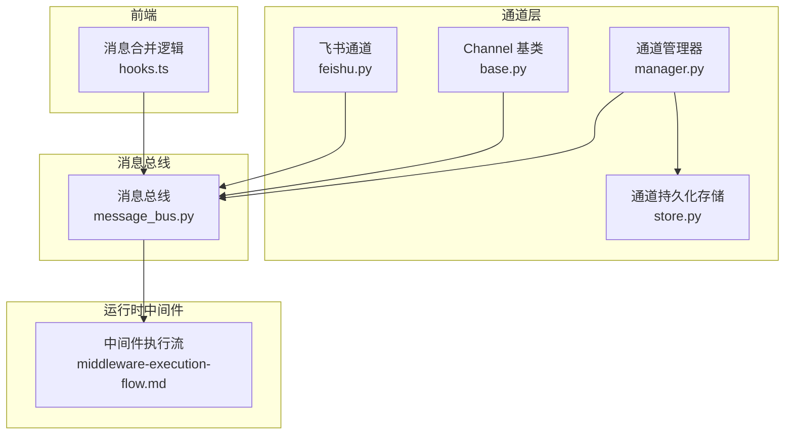
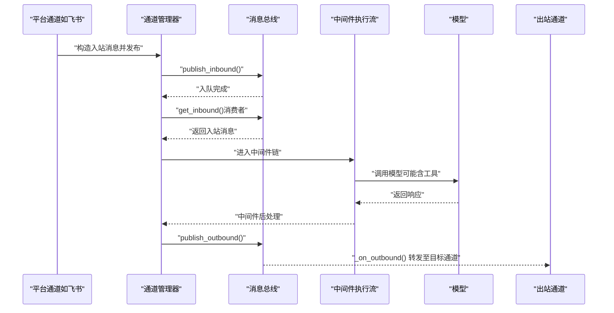
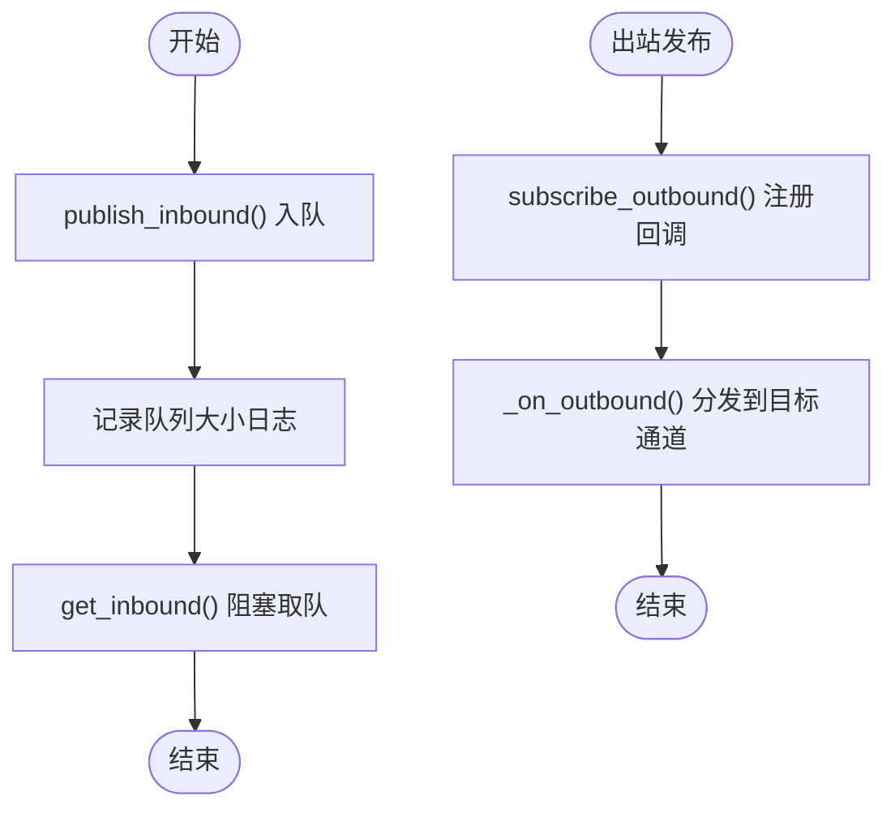
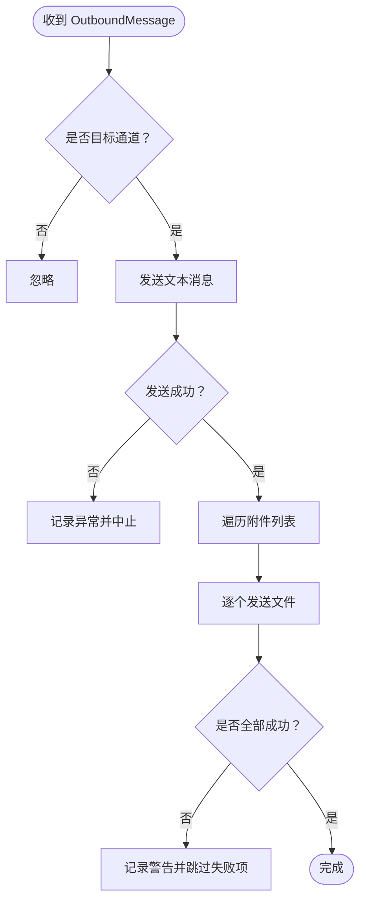
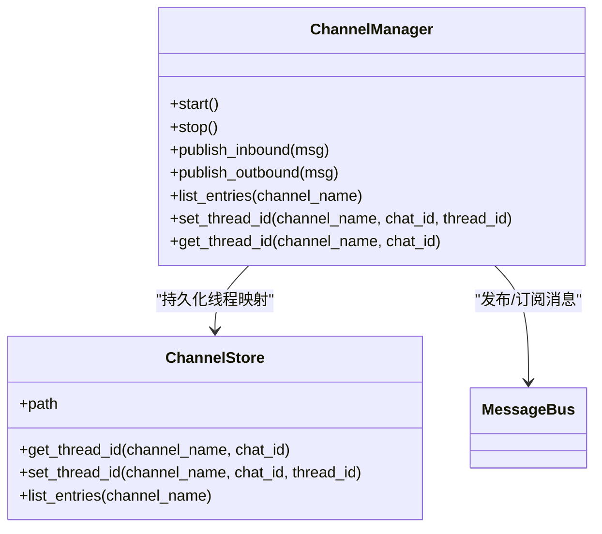
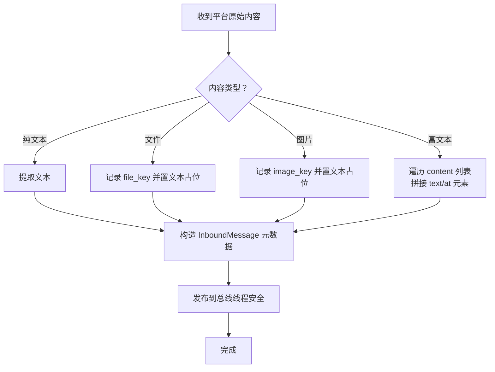
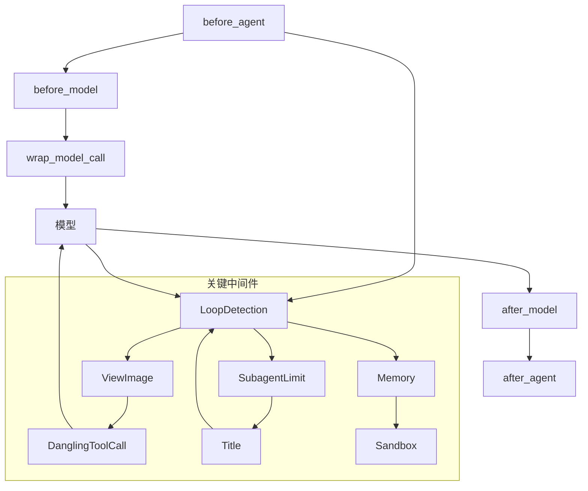
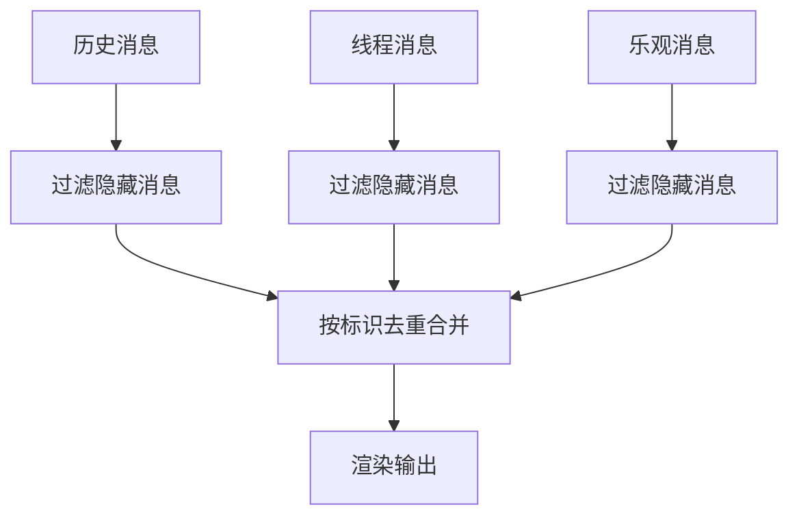
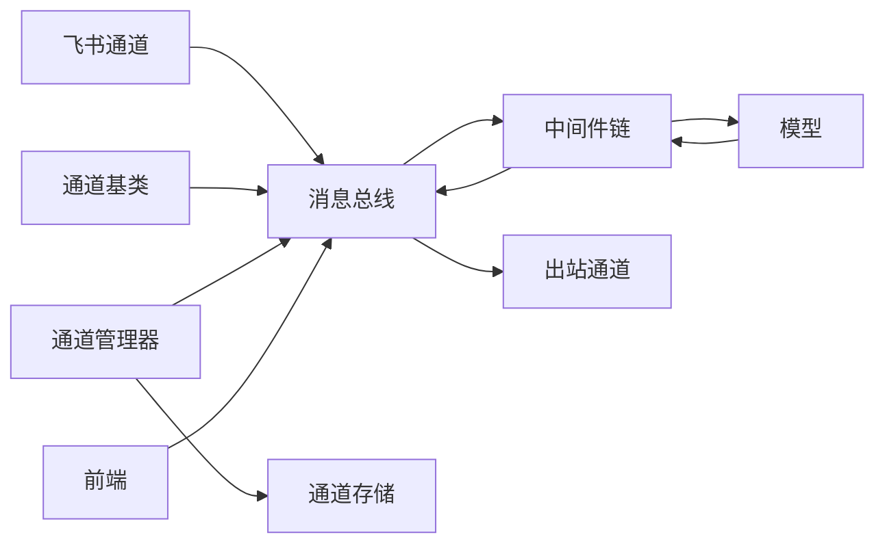

# 消息处理管道

<cite>
**本文引用的文件**
- [backend/app/channels/message_bus.py](file://backend/app/channels/message_bus.py)
- [backend/app/channels/base.py](file://backend/app/channels/base.py)
- [backend/app/channels/manager.py](file://backend/app/channels/manager.py)
- [backend/app/channels/store.py](file://backend/app/channels/store.py)
- [backend/app/channels/feishu.py](file://backend/app/channels/feishu.py)
- [backend/tests/test_channels.py](file://backend/tests/test_channels.py)
- [backend/docs/middleware-execution-flow.md](file://backend/docs/middleware-execution-flow.md)
- [frontend/src/core/threads/hooks.ts](file://frontend/src/core/threads/hooks.ts)
- [backend/tests/test_client.py](file://backend/tests/test_client.py)
- [backend/tests/test_view_image_middleware.py](file://backend/tests/test_view_image_middleware.py)
</cite>

## 目录
1. [简介](#简介)
2. [项目结构](#项目结构)
3. [核心组件](#核心组件)
4. [架构总览](#架构总览)
5. [详细组件分析](#详细组件分析)
6. [依赖关系分析](#依赖关系分析)
7. [性能考量](#性能考量)
8. [故障排查指南](#故障排查指南)
9. [结论](#结论)
10. [附录](#附录)

## 简介
本文件系统性梳理 DeerFlow 的消息处理管道，覆盖从“消息接收、解析、过滤、转换”到“元数据管理、时间戳与排序”的完整链路。文档以通道（Channel）与消息总线（MessageBus）为核心，结合中间件执行流与前端消息合并策略，给出可操作的配置建议、优化方案与排障指引。

## 项目结构
消息处理相关模块主要位于后端的 channels 子系统，并与运行时中间件、持久化存储及前端展示协同工作：
- 通道与总线：负责消息的入队、出队、订阅与路由
- 通道实现：如飞书通道负责解析平台特定消息格式并构造标准入站消息
- 中间件执行流：定义消息在模型调用前后经过的处理阶段
- 前端消息合并：对历史与实时消息进行去重与拼接

图表来源
- [backend/app/channels/base.py](file://backend/app/channels/base.py)
- [backend/app/channels/feishu.py](file://backend/app/channels/feishu.py)
- [backend/app/channels/manager.py](file://backend/app/channels/manager.py)
- [backend/app/channels/store.py](file://backend/app/channels/store.py)
- [backend/app/channels/message_bus.py](file://backend/app/channels/message_bus.py)
- [backend/docs/middleware-execution-flow.md](file://backend/docs/middleware-execution-flow.md)
- [frontend/src/core/threads/hooks.ts](file://frontend/src/core/threads/hooks.ts)

章节来源
- [backend/app/channels/message_bus.py](file://backend/app/channels/message_bus.py)
- [backend/app/channels/base.py](file://backend/app/channels/base.py)
- [backend/app/channels/manager.py](file://backend/app/channels/manager.py)
- [backend/app/channels/store.py](file://backend/app/channels/store.py)
- [backend/app/channels/feishu.py](file://backend/app/channels/feishu.py)
- [backend/docs/middleware-execution-flow.md](file://backend/docs/middleware-execution-flow.md)
- [frontend/src/core/threads/hooks.ts](file://frontend/src/core/threads/hooks.ts)

## 核心组件
- 消息总线（MessageBus）
  - 提供入站消息入队与阻塞式出队能力，支持订阅/取消订阅出站回调
  - 维护入站队列大小日志，便于监控与容量规划
- 通道基类（Channel）
  - 定义出站回调：仅向目标通道转发消息；文本发送成功后再上传附件，避免半送达
  - 提供入站消息构造与可选的文件附件处理入口
- 通道管理器（ChannelManager）
  - 聚合多个通道实例，维护通道与会话线程映射，支持持久化
  - 将入站消息发布到总线，将出站消息分发给对应通道
- 通道持久化存储（ChannelStore）
  - 记录通道到线程 ID 的映射，支持查询、更新与容错处理
- 具体通道实现（以飞书为例）
  - 解析富文本、图片、文件等多类型内容，构造统一的入站消息并携带平台元数据
  - 在事件循环可用时异步调度消息发布，确保主线程安全

章节来源
- [backend/app/channels/message_bus.py](file://backend/app/channels/message_bus.py)
- [backend/app/channels/base.py](file://backend/app/channels/base.py)
- [backend/app/channels/manager.py](file://backend/app/channels/manager.py)
- [backend/app/channels/store.py](file://backend/app/channels/store.py)
- [backend/app/channels/feishu.py](file://backend/app/channels/feishu.py)

## 架构总览
消息处理管道采用“通道 → 总线 → 中间件 → 模型 → 中间件 → 通道”的流水线式结构。通道负责将平台消息标准化并入队；总线保证 FIFO 排序；中间件在关键节点完成过滤、转换与增强；最终由通道将响应回传给用户。

图表来源
- [backend/app/channels/feishu.py](file://backend/app/channels/feishu.py)
- [backend/app/channels/manager.py](file://backend/app/channels/manager.py)
- [backend/app/channels/message_bus.py](file://backend/app/channels/message_bus.py)
- [backend/docs/middleware-execution-flow.md](file://backend/docs/middleware-execution-flow.md)

## 详细组件分析

### 消息总线（MessageBus）
- 入站
  - 入队：记录通道名、聊天 ID、消息类型与队列长度
  - 出队：阻塞等待下一个入站消息
- 出站
  - 订阅/取消订阅：注册异步回调，按订阅顺序触发
  - 转发：仅向目标通道回调，避免广播风暴

图表来源
- [backend/app/channels/message_bus.py](file://backend/app/channels/message_bus.py)

章节来源
- [backend/app/channels/message_bus.py](file://backend/app/channels/message_bus.py)

### 通道基类（Channel）
- 出站回调
  - 仅转发目标通道消息
  - 文本发送失败时不尝试文件上传，避免半送达
- 文件处理
  - 可选地对入站文件附件进行处理与物化

图表来源
- [backend/app/channels/base.py](file://backend/app/channels/base.py)

章节来源
- [backend/app/channels/base.py](file://backend/app/channels/base.py)

### 通道管理器（ChannelManager）
- 维护通道与线程映射，支持持久化
- 将入站消息发布到总线，将出站消息分发给对应通道
- 支持批量出站更新节流（测试中可见最小间隔配置）

图表来源
- [backend/app/channels/manager.py](file://backend/app/channels/manager.py)
- [backend/app/channels/store.py](file://backend/app/channels/store.py)
- [backend/app/channels/message_bus.py](file://backend/app/channels/message_bus.py)

章节来源
- [backend/app/channels/manager.py](file://backend/app/channels/manager.py)
- [backend/app/channels/store.py](file://backend/app/channels/store.py)
- [backend/tests/test_channels.py](file://backend/tests/test_channels.py)

### 飞书通道（Inbound 解析与元数据）
- 内容解析
  - 支持纯文本、文件、图片与富文本段落
  - 对富文本内容进行段落级元素解析，拼接文本与提及信息
- 元数据
  - 包含消息 ID、根/父消息 ID、线程 ID、话题 ID、用户 ID 等
  - 支持“挂起澄清”状态标记，便于后续处理
- 发布策略
  - 在主事件循环可用时通过线程安全方式调度发布

图表来源
- [backend/app/channels/feishu.py](file://backend/app/channels/feishu.py)

章节来源
- [backend/app/channels/feishu.py](file://backend/app/channels/feishu.py)

### 中间件执行流（过滤、转换与增强）
- 执行阶段
  - before_agent：创建线程目录、扫描上传、获取沙箱、清理循环警告
  - before_model：注入图片 base64 等
  - wrap_model_call：补全悬空工具调用、注入当前 run 警告
  - after_model：循环检测与排队警告、子代理数量限制、标题生成
  - after_agent：清理 pending 警告、入队记忆、释放沙箱
- 关键点
  - 循环检测中间件贯穿前后，既作为“过滤器”也作为“状态机”
  - 图片注入中间件具备幂等判断，避免重复注入

图表来源
- [backend/docs/middleware-execution-flow.md](file://backend/docs/middleware-execution-flow.md)

章节来源
- [backend/docs/middleware-execution-flow.md](file://backend/docs/middleware-execution-flow.md)
- [backend/tests/test_view_image_middleware.py](file://backend/tests/test_view_image_middleware.py)

### 前端消息合并（去重与拼接）
- 合并策略
  - 基于可见性与标识去重，保留历史消息中新出现的部分
  - 将线程消息与乐观消息拼接，避免重复显示
- 时间戳与排序
  - 通过消息标识与可见性控制，间接保证 UI 层的有序展示

图表来源
- [frontend/src/core/threads/hooks.ts](file://frontend/src/core/threads/hooks.ts)

章节来源
- [frontend/src/core/threads/hooks.ts](file://frontend/src/core/threads/hooks.ts)

## 依赖关系分析
- 低耦合
  - 通道与总线通过接口解耦，通道无需关心下游处理细节
  - 中间件以链式组合，职责单一且可插拔
- 关键依赖
  - 通道管理器依赖总线与存储，承担编排职责
  - 飞书通道依赖平台 API 返回结构，负责标准化
  - 前端依赖后端消息语义与标识，负责 UI 层去重与拼接

图表来源
- [backend/app/channels/feishu.py](file://backend/app/channels/feishu.py)
- [backend/app/channels/base.py](file://backend/app/channels/base.py)
- [backend/app/channels/manager.py](file://backend/app/channels/manager.py)
- [backend/app/channels/store.py](file://backend/app/channels/store.py)
- [backend/app/channels/message_bus.py](file://backend/app/channels/message_bus.py)
- [backend/docs/middleware-execution-flow.md](file://backend/docs/middleware-execution-flow.md)
- [frontend/src/core/threads/hooks.ts](file://frontend/src/core/threads/hooks.ts)

章节来源
- [backend/app/channels/feishu.py](file://backend/app/channels/feishu.py)
- [backend/app/channels/base.py](file://backend/app/channels/base.py)
- [backend/app/channels/manager.py](file://backend/app/channels/manager.py)
- [backend/app/channels/store.py](file://backend/app/channels/store.py)
- [backend/app/channels/message_bus.py](file://backend/app/channels/message_bus.py)
- [backend/docs/middleware-execution-flow.md](file://backend/docs/middleware-execution-flow.md)
- [frontend/src/core/threads/hooks.ts](file://frontend/src/core/threads/hooks.ts)

## 性能考量
- 入队/出队与并发
  - 使用异步队列保证高吞吐；注意队列长度与背压策略
- 文件上传可靠性
  - 文本发送失败时跳过文件上传，减少部分交付风险
- 中间件链开销
  - 图片注入与循环检测等中间件应尽量幂等与短路
- 前端渲染
  - 合并算法基于集合与线性扫描，建议控制单次合并消息规模

## 故障排查指南
- 入站消息丢失或乱序
  - 检查总线入队日志与队列大小
  - 确认通道管理器是否正确订阅总线
- 出站消息未达
  - 核查通道名称匹配与出站回调注册
  - 观察文件上传失败时的警告日志
- 图片注入重复
  - 确认中间件幂等判断逻辑与已注入内容形状
- 流式响应去重问题
  - vLLM 等提供方在分片无 ID 时存在重复文本风险，需在上层做内容级去重或改用内容指纹

章节来源
- [backend/app/channels/message_bus.py](file://backend/app/channels/message_bus.py)
- [backend/app/channels/base.py](file://backend/app/channels/base.py)
- [backend/tests/test_channels.py](file://backend/tests/test_channels.py)
- [backend/tests/test_view_image_middleware.py](file://backend/tests/test_view_image_middleware.py)
- [backend/tests/test_client.py](file://backend/tests/test_client.py)

## 结论
DeerFlow 的消息处理管道以通道与总线为核心，配合中间件链实现“标准化、过滤、增强、排序”的闭环。通过明确的元数据与持久化映射，系统在多通道场景下保持一致性与可观测性。建议在生产环境中关注队列容量、中间件链路与前端去重策略，以获得稳定与高性能的消息体验。

## 附录

### 消息类型识别与内容提取（示例路径）
- 飞书富文本解析与内容拼接
  - [backend/app/channels/feishu.py](file://backend/app/channels/feishu.py)
- 入站消息构造与元数据字段
  - [backend/app/channels/feishu.py](file://backend/app/channels/feishu.py)
- 通道基类入站/出站模板
  - [backend/app/channels/base.py](file://backend/app/channels/base.py)

### 过滤与转换策略（示例路径）
- 中间件执行顺序与职责
  - [backend/docs/middleware-execution-flow.md](file://backend/docs/middleware-execution-flow.md)
- 图片注入幂等判定
  - [backend/tests/test_view_image_middleware.py](file://backend/tests/test_view_image_middleware.py)

### 批量处理参数与优化（示例路径）
- 出站批量更新节流（测试中可见最小间隔）
  - [backend/tests/test_channels.py](file://backend/tests/test_channels.py)
- 通道存储持久化与线程映射
  - [backend/app/channels/store.py](file://backend/app/channels/store.py)
  - [backend/app/channels/manager.py](file://backend/app/channels/manager.py)

### 配置要点清单（示例路径）
- 总线队列与日志
  - [backend/app/channels/message_bus.py](file://backend/app/channels/message_bus.py)
- 通道出站转发与文件上传
  - [backend/app/channels/base.py](file://backend/app/channels/base.py)
- 飞书消息发布与事件循环
  - [backend/app/channels/feishu.py](file://backend/app/channels/feishu.py)