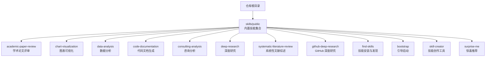
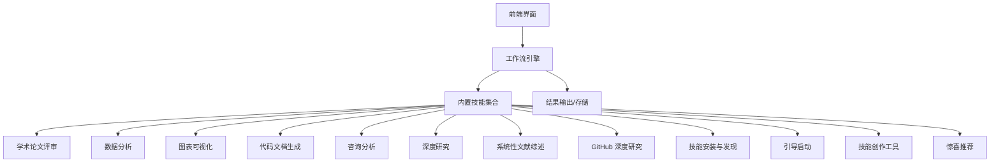
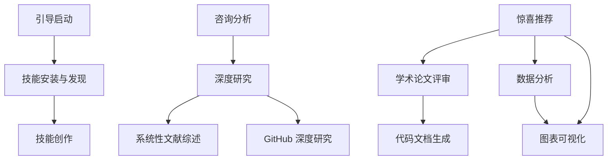

# 内置技能库

<cite>
**本文档引用的文件**
- [SKILL.md](file://skills/public/academic-paper-review/SKILL.md)
- [SKILL.md](file://skills/public/chart-visualization/SKILL.md)
- [SKILL.md](file://skills/public/data-analysis/SKILL.md)
- [SKILL.md](file://skills/public/code-documentation/SKILL.md)
- [SKILL.md](file://skills/public/consulting-analysis/SKILL.md)
- [SKILL.md](file://skills/public/deep-research/SKILL.md)
- [SKILL.md](file://skills/public/systematic-literature-review/SKILL.md)
- [SKILL.md](file://skills/public/github-deep-research/SKILL.md)
- [SKILL.md](file://skills/public/find-skills/SKILL.md)
- [SKILL.md](file://skills/public/bootstrap/SKILL.md)
- [SKILL.md](file://skills/public/skill-creator/SKILL.md)
- [SKILL.md](file://skills/public/surprise-me/SKILL.md)
- [generate.js](file://skills/public/chart-visualization/scripts/generate.js)
- [analyze.py](file://skills/public/data-analysis/scripts/analyze.py)
- [github_api.py](file://skills/public/github-deep-research/scripts/github_api.py)
- [install-skill.sh](file://skills/public/find-skills/scripts/install-skill.sh)
- [SKILL.md](file://deer-flow/skills/public/bootstrap/SKILL.md)
- [SKILL.md](file://deer-flow/skills/public/chart-visualization/SKILL.md)
- [SKILL.md](file://deer-flow/skills/public/data-analysis/SKILL.md)
- [SKILL.md](file://deer-flow/skills/public/code-documentation/SKILL.md)
- [SKILL.md](file://deer-flow/skills/public/consulting-analysis/SKILL.md)
- [SKILL.md](file://deer-flow/skills/public/deep-research/SKILL.md)
- [SKILL.md](file://deer-flow/skills/public/systematic-literature-review/SKILL.md)
- [SKILL.md](file://deer-flow/skills/public/github-deep-research/SKILL.md)
- [SKILL.md](file://deer-flow/skills/public/find-skills/SKILL.md)
- [SKILL.md](file://deer-flow/skills/public/skill-creator/SKILL.md)
- [SKILL.md](file://deer-flow/skills/public/surprise-me/SKILL.md)
- [generate.js](file://deer-flow/skills/public/chart-visualization/scripts/generate.js)
- [analyze.py](file://deer-flow/skills/public/data-analysis/scripts/analyze.py)
- [github_api.py](file://deer-flow/skills/public/github-deep-research/scripts/github_api.py)
- [install-skill.sh](file://deer-flow/skills/public/find-skills/scripts/install-skill.sh)
</cite>

## 目录
1. [简介](#简介)
2. [项目结构](#项目结构)
3. [核心组件](#核心组件)
4. [架构总览](#架构总览)
5. [详细组件分析](#详细组件分析)
6. [依赖关系分析](#依赖关系分析)
7. [性能考虑](#性能考虑)
8. [故障排除指南](#故障排除指南)
9. [结论](#结论)
10. [附录](#附录)

## 简介
本文件系统性梳理 DeerFlow 内置技能库，覆盖学术论文评审、数据分析、图表可视化、代码文档生成、咨询分析、深度研究、系统性文献综述、GitHub 深度研究、技能安装与发现、引导启动、技能创作与惊喜推荐等技能。文档从功能特性、输入输出规范、配置选项、性能特征、使用示例与最佳实践、技能组合策略及扩展方法等方面进行深入说明，帮助用户高效选择与组合技能以满足不同场景需求。

## 项目结构
内置技能位于 skills/public 目录下，每个技能以独立子目录组织，包含技能描述文件 SKILL.md 与可选的脚本、模板、参考材料等资源。前端与后端均提供对这些技能的访问与集成能力，支持在工作流中按需调用。

**图示来源**
- [SKILL.md](file://skills/public/academic-paper-review/SKILL.md)
- [SKILL.md](file://skills/public/chart-visualization/SKILL.md)
- [SKILL.md](file://skills/public/data-analysis/SKILL.md)
- [SKILL.md](file://skills/public/code-documentation/SKILL.md)
- [SKILL.md](file://skills/public/consulting-analysis/SKILL.md)
- [SKILL.md](file://skills/public/deep-research/SKILL.md)
- [SKILL.md](file://skills/public/systematic-literature-review/SKILL.md)
- [SKILL.md](file://skills/public/github-deep-research/SKILL.md)
- [SKILL.md](file://skills/public/find-skills/SKILL.md)
- [SKILL.md](file://skills/public/bootstrap/SKILL.md)
- [SKILL.md](file://skills/public/skill-creator/SKILL.md)
- [SKILL.md](file://skills/public/surprise-me/SKILL.md)

**章节来源**
- [SKILL.md](file://skills/public/academic-paper-review/SKILL.md)
- [SKILL.md](file://skills/public/chart-visualization/SKILL.md)
- [SKILL.md](file://skills/public/data-analysis/SKILL.md)
- [SKILL.md](file://skills/public/code-documentation/SKILL.md)
- [SKILL.md](file://skills/public/consulting-analysis/SKILL.md)
- [SKILL.md](file://skills/public/deep-research/SKILL.md)
- [SKILL.md](file://skills/public/systematic-literature-review/SKILL.md)
- [SKILL.md](file://skills/public/github-deep-research/SKILL.md)
- [SKILL.md](file://skills/public/find-skills/SKILL.md)
- [SKILL.md](file://skills/public/bootstrap/SKILL.md)
- [SKILL.md](file://skills/public/skill-creator/SKILL.md)
- [SKILL.md](file://skills/public/surprise-me/SKILL.md)

## 核心组件
- 学术论文评审：面向学术论文的结构化评审流程，支持评审维度定义、评分与反馈生成。
- 数据分析：提供数据探索、统计分析与报告生成能力，支持多种分析模式与输出格式。
- 图表可视化：基于 JavaScript 脚本生成多种图表类型（柱状图、饼图、雷达图、网络图等），支持参数化配置与模板化输出。
- 代码文档生成：面向代码库的自动化文档生成，提升技术文档质量与一致性。
- 咨询分析：面向商业咨询场景的问题拆解、资料整理与建议生成。
- 深度研究：通用型研究流程，支持多轮检索、整理与总结。
- 系统性文献综述：面向系统性文献综述的研究流程，支持搜索、筛选、整理与引用格式化。
- GitHub 深度研究：针对 GitHub 项目的专项研究，结合 API 获取项目元数据与贡献信息。
- 技能安装与发现：提供技能安装、更新与管理能力，便于扩展技能生态。
- 引导启动：为新用户提供快速上手的引导流程与模板。
- 技能创作：提供技能开发、评估、打包与发布的工具链。
- 惊喜推荐：随机或基于偏好推荐技能，提升探索体验。

**章节来源**
- [SKILL.md](file://skills/public/academic-paper-review/SKILL.md)
- [SKILL.md](file://skills/public/data-analysis/SKILL.md)
- [SKILL.md](file://skills/public/chart-visualization/SKILL.md)
- [SKILL.md](file://skills/public/code-documentation/SKILL.md)
- [SKILL.md](file://skills/public/consulting-analysis/SKILL.md)
- [SKILL.md](file://skills/public/deep-research/SKILL.md)
- [SKILL.md](file://skills/public/systematic-literature-review/SKILL.md)
- [SKILL.md](file://skills/public/github-deep-research/SKILL.md)
- [SKILL.md](file://skills/public/find-skills/SKILL.md)
- [SKILL.md](file://skills/public/bootstrap/SKILL.md)
- [SKILL.md](file://skills/public/skill-creator/SKILL.md)
- [SKILL.md](file://skills/public/surprise-me/SKILL.md)

## 架构总览
内置技能通过统一的技能接口与配置规范接入 DeerFlow 工作流引擎。前端提供可视化编排界面，后端负责技能加载、执行与结果聚合。各技能模块相对独立，通过标准输入输出协议与共享工具协作。

**图示来源**
- [SKILL.md](file://skills/public/academic-paper-review/SKILL.md)
- [SKILL.md](file://skills/public/data-analysis/SKILL.md)
- [SKILL.md](file://skills/public/chart-visualization/SKILL.md)
- [SKILL.md](file://skills/public/code-documentation/SKILL.md)
- [SKILL.md](file://skills/public/consulting-analysis/SKILL.md)
- [SKILL.md](file://skills/public/deep-research/SKILL.md)
- [SKILL.md](file://skills/public/systematic-literature-review/SKILL.md)
- [SKILL.md](file://skills/public/github-deep-research/SKILL.md)
- [SKILL.md](file://skills/public/find-skills/SKILL.md)
- [SKILL.md](file://skills/public/bootstrap/SKILL.md)
- [SKILL.md](file://skills/public/skill-creator/SKILL.md)
- [SKILL.md](file://skills/public/surprise-me/SKILL.md)

## 详细组件分析

### 学术论文评审
- 功能特性
  - 支持评审维度自定义与权重设置
  - 自动生成评审意见与综合评分
  - 输出结构化评审报告
- 输入格式
  - 论文内容（文本/PDF）
  - 评审维度清单
  - 参考标准或模板
- 输出格式
  - 结构化评审报告（JSON/Markdown）
  - 评分汇总与建议
- 性能特点
  - 基于大模型推理，响应时间受输入长度与维度数量影响
- 使用示例与最佳实践
  - 先定义评审维度，再上传论文，最后审阅报告
  - 对复杂论文可分段评审并合并结果
- 扩展方法
  - 新增评审维度模板
  - 集成外部评审数据库

**章节来源**
- [SKILL.md](file://skills/public/academic-paper-review/SKILL.md)

### 数据分析
- 功能特性
  - 提供数据清洗、统计分析与可视化建议
  - 支持多种分析模式（描述性统计、相关性分析等）
- 输入格式
  - 结构化数据（CSV/Excel/JSON）
  - 分析参数（字段映射、分析类型、阈值等）
- 输出格式
  - 统计摘要、图表建议、可执行脚本
- 性能特点
  - 处理大规模数据时注意内存与计算时间
- 使用示例与最佳实践
  - 先进行数据质量检查，再选择合适分析类型
  - 将结果与业务目标结合解读
- 扩展方法
  - 添加新的分析算法与可视化模板

**章节来源**
- [SKILL.md](file://skills/public/data-analysis/SKILL.md)
- [analyze.py](file://skills/public/data-analysis/scripts/analyze.py)

### 图表可视化
- 功能特性
  - 支持多种图表类型（柱状图、饼图、雷达图、网络图等）
  - 参数化配置与模板化输出
- 输入格式
  - 数据集（键值对/数组）
  - 图表参数（类型、颜色、尺寸、标签等）
- 输出格式
  - 图表代码/图片链接
- 性能特点
  - 图表生成通常快速，复杂布局可能增加渲染时间
- 使用示例与最佳实践
  - 明确数据结构与图表目标，避免过度装饰
  - 优先选择适合数据类型的图表
- 扩展方法
  - 新增图表类型与样式模板

**章节来源**
- [SKILL.md](file://skills/public/chart-visualization/SKILL.md)
- [generate.js](file://skills/public/chart-visualization/scripts/generate.js)

### 代码文档生成
- 功能特性
  - 自动提取代码结构与注释，生成标准化文档
  - 支持多语言与框架
- 输入格式
  - 代码仓库路径或源码片段
  - 文档模板与输出格式
- 输出格式
  - Markdown/HTML/API 文档
- 性能特点
  - 依赖代码规模，大型仓库扫描时间较长
- 使用示例与最佳实践
  - 在提交前生成文档，保持与代码同步
  - 定期更新模板以适配团队规范
- 扩展方法
  - 增加语言解析器与模板引擎

**章节来源**
- [SKILL.md](file://skills/public/code-documentation/SKILL.md)

### 咨询分析
- 功能特性
  - 商业问题拆解、资料收集与建议生成
- 输入格式
  - 业务背景、目标与约束
  - 可选参考资料
- 输出格式
  - 结构化分析报告与建议清单
- 性能特点
  - 交互式迭代优化，适合多次修订
- 使用示例与最佳实践
  - 明确边界与假设，逐步细化问题
- 扩展方法
  - 集成行业知识库与专家经验

**章节来源**
- [SKILL.md](file://skills/public/consulting-analysis/SKILL.md)

### 深度研究
- 功能特性
  - 多轮检索、整理与总结，形成研究报告
- 输入格式
  - 研究主题与范围
  - 检索策略与过滤条件
- 输出格式
  - 研究报告草稿与引用列表
- 性能特点
  - 检索与生成耗时取决于主题复杂度与数据源数量
- 使用示例与最佳实践
  - 制定清晰的研究计划与里程碑
- 扩展方法
  - 增强检索策略与去重机制

**章节来源**
- [SKILL.md](file://skills/public/deep-research/SKILL.md)

### 系统性文献综述
- 功能特性
  - 支持系统性搜索、筛选、整理与引用格式化
- 输入格式
  - 主题词、数据库与筛选规则
- 输出格式
  - 文献清单、综述报告与引用格式（APA/IEEE/BibTeX）
- 性能特点
  - 搜索与筛选阶段耗时较长
- 使用示例与最佳实践
  - 明确纳入与排除标准，确保可重复性
- 扩展方法
  - 集成更多数据库与格式模板

**章节来源**
- [SKILL.md](file://skills/public/systematic-literature-review/SKILL.md)

### GitHub 深度研究
- 功能特性
  - 基于 GitHub API 获取项目信息与贡献数据
- 输入格式
  - 仓库地址或关键词
- 输出格式
  - 项目概览、贡献者分析与趋势报告
- 性能特点
  - 受 API 速率限制影响，批量请求需节流
- 使用示例与最佳实践
  - 合理设置查询参数与缓存策略
- 扩展方法
  - 增加更多指标与可视化维度

**章节来源**
- [SKILL.md](file://skills/public/github-deep-research/SKILL.md)
- [github_api.py](file://skills/public/github-deep-research/scripts/github_api.py)

### 技能安装与发现
- 功能特性
  - 提供技能安装、更新与管理能力
- 输入格式
  - 技能名称或来源
- 输出格式
  - 安装状态与可用技能列表
- 性能特点
  - 网络下载与依赖解析时间
- 使用示例与最佳实践
  - 优先选择稳定版本并验证兼容性
- 扩展方法
  - 增加自动检测与升级提醒

**章节来源**
- [SKILL.md](file://skills/public/find-skills/SKILL.md)
- [install-skill.sh](file://skills/public/find-skills/scripts/install-skill.sh)

### 引导启动
- 功能特性
  - 为新用户提供快速上手流程与模板
- 输入格式
  - 用户偏好与目标
- 输出格式
  - 推荐技能组合与操作指引
- 性能特点
  - 快速响应，交互友好
- 使用示例与最佳实践
  - 根据场景选择合适模板
- 扩展方法
  - 增加更多引导场景与模板

**章节来源**
- [SKILL.md](file://skills/public/bootstrap/SKILL.md)

### 技能创作
- 功能特性
  - 提供技能开发、评估、打包与发布工具链
- 输入格式
  - 开发模板、测试用例与评估指标
- 输出格式
  - 可分发技能包与评估报告
- 性能特点
  - 本地构建与测试，耗时取决于脚本复杂度
- 使用示例与最佳实践
  - 遵循模板规范，完善测试与文档
- 扩展方法
  - 增加自动化评估与发布流程

**章节来源**
- [SKILL.md](file://skills/public/skill-creator/SKILL.md)

### 惊喜推荐
- 功能特性
  - 基于偏好或随机策略推荐技能
- 输入格式
  - 用户偏好或触发条件
- 输出格式
  - 推荐技能列表与简要说明
- 性能特点
  - 快速响应，适合探索性使用
- 使用示例与最佳实践
  - 将推荐作为学习新技能的入口
- 扩展方法
  - 增加个性化推荐算法

**章节来源**
- [SKILL.md](file://skills/public/surprise-me/SKILL.md)

## 依赖关系分析
内置技能之间存在松耦合的依赖关系：部分技能可作为其他技能的前置步骤（如“引导启动”用于快速上手，“技能安装与发现”用于扩展生态；“数据分析”“图表可视化”常配合使用；“系统性文献综述”“深度研究”“GitHub 深度研究”共同支撑研究类任务）；“技能创作”为生态扩展提供工具保障。

**图示来源**
- [SKILL.md](file://skills/public/bootstrap/SKILL.md)
- [SKILL.md](file://skills/public/find-skills/SKILL.md)
- [SKILL.md](file://skills/public/skill-creator/SKILL.md)
- [SKILL.md](file://skills/public/data-analysis/SKILL.md)
- [SKILL.md](file://skills/public/chart-visualization/SKILL.md)
- [SKILL.md](file://skills/public/deep-research/SKILL.md)
- [SKILL.md](file://skills/public/systematic-literature-review/SKILL.md)
- [SKILL.md](file://skills/public/github-deep-research/SKILL.md)
- [SKILL.md](file://skills/public/academic-paper-review/SKILL.md)
- [SKILL.md](file://skills/public/code-documentation/SKILL.md)
- [SKILL.md](file://skills/public/consulting-analysis/SKILL.md)
- [SKILL.md](file://skills/public/surprise-me/SKILL.md)

## 性能考虑
- 输入规模与处理时间
  - 大规模数据集与复杂图表会显著增加处理时间，建议分批处理与缓存中间结果。
- 并发与资源占用
  - 多技能并发执行时注意 CPU/内存占用，必要时限流或异步化。
- 网络与外部服务
  - 依赖外部 API 的技能（如 GitHub 深度研究）需考虑速率限制与失败重试。
- 输出体积与存储
  - 大型报告与图表建议采用压缩与分片存储，减少传输与渲染开销。

## 故障排除指南
- 技能加载失败
  - 检查技能目录完整性与权限，确认依赖脚本可执行。
- 外部服务错误
  - 对于依赖外部 API 的技能，检查凭据与网络连通性，并启用重试机制。
- 性能瓶颈
  - 对大数据分析与复杂图表，优化输入格式与参数配置，必要时分阶段执行。
- 输出异常
  - 核对输入格式与参数映射，确保模板与脚本正确无误。

## 结论
DeerFlow 内置技能库覆盖从数据到可视化的完整分析链路，以及研究、咨询、创作与探索等多样化场景。通过明确的输入输出规范、可扩展的工具链与良好的组合策略，用户可以高效构建定制化工作流，持续提升生产力与洞察力。

## 附录
- 技能选择与组合指导原则
  - 以目标为导向：明确最终产出形式（报告/图表/代码/建议），反向选择所需技能。
  - 以数据为基础：先做数据分析与清洗，再进行可视化与建模。
  - 以流程为准绳：研究类任务遵循“检索→筛选→整理→总结”的闭环。
  - 以效率为考量：优先复用已有模板与脚本，减少重复劳动。
- 最佳实践清单
  - 固化输入输出规范，建立版本控制与回滚机制。
  - 为关键技能添加监控与告警，保障稳定性。
  - 定期评估技能效果，淘汰低效流程，引入新工具。
- 扩展方法
  - 借助“技能创作”工具规范化新增技能，确保质量与一致性。
  - 通过“技能安装与发现”机制引入第三方技能，丰富生态。
  - 建立技能评估与反馈闭环，持续优化组合策略。