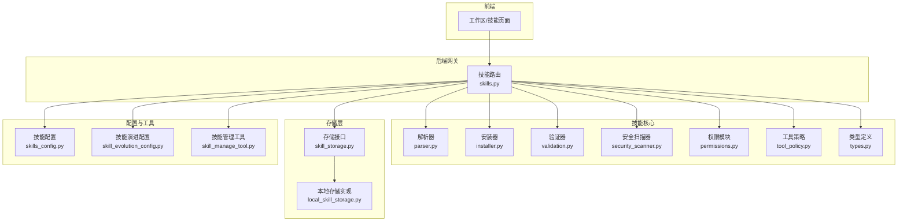
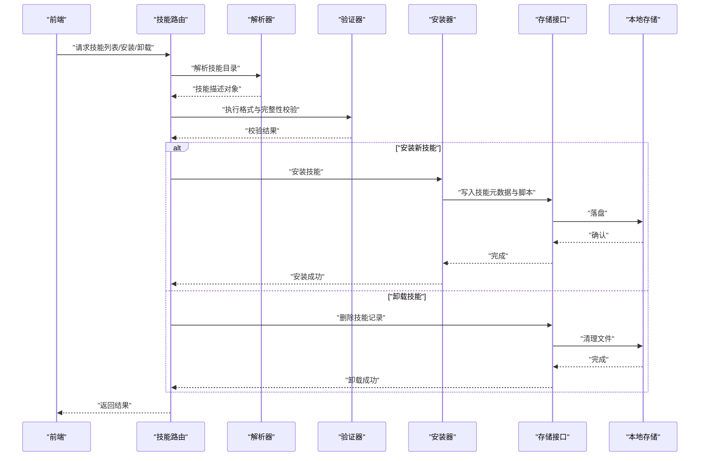
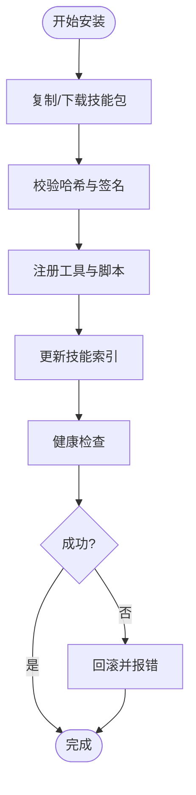
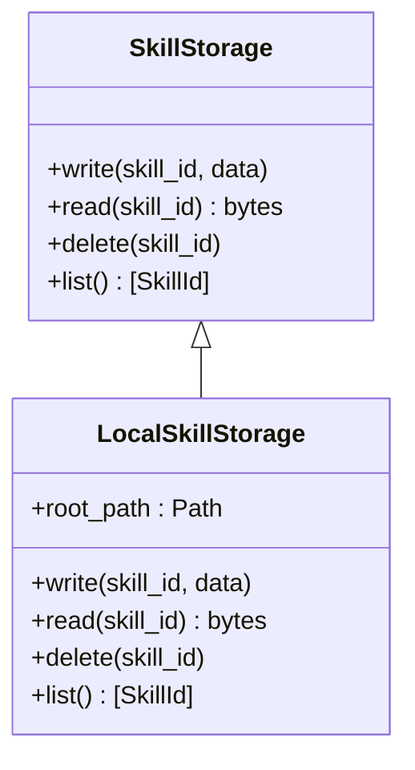
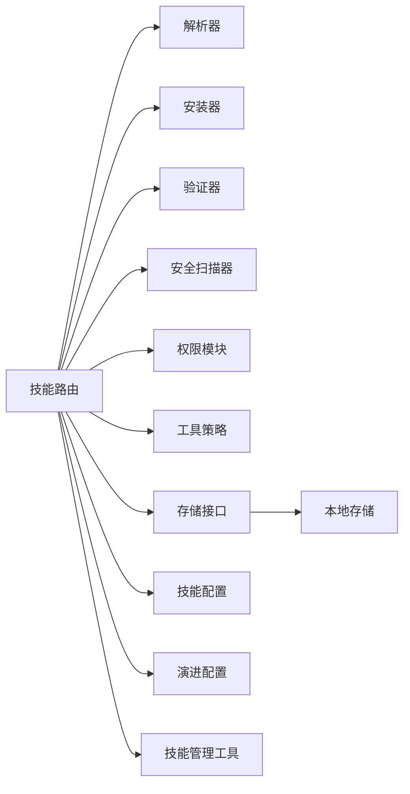

# 可扩展技能系统

<cite>
**本文档引用的文件**
- [skills.py](file://backend/app/gateway/routers/skills.py)
- [installer.py](file://backend/packages/harness/deerflow/skills/installer.py)
- [parser.py](file://backend/packages/harness/deerflow/skills/parser.py)
- [permissions.py](file://backend/packages/harness/deerflow/skills/permissions.py)
- [security_scanner.py](file://backend/packages/harness/deerflow/skills/security_scanner.py)
- [tool_policy.py](file://backend/packages/harness/deerflow/skills/tool_policy.py)
- [types.py](file://backend/packages/harness/deerflow/skills/types.py)
- [validation.py](file://backend/packages/harness/deerflow/skills/validation.py)
- [local_skill_storage.py](file://backend/packages/harness/deerflow/skills/storage/local_skill_storage.py)
- [skill_storage.py](file://backend/packages/harness/deerflow/skills/storage/skill_storage.py)
- [skills_config.py](file://backend/packages/harness/deerflow/config/skills_config.py)
- [skill_evolution_config.py](file://backend/packages/harness/deerflow/config/skill_evolution_config.py)
- [skill_manage_tool.py](file://backend/packages/harness/deerflow/tools/skill_manage_tool.py)
- [test_skills_installer.py](file://backend/tests/test_skills_installer.py)
- [test_skills_loader.py](file://backend/tests/test_skills_loader.py)
- [test_skills_parser.py](file://backend/tests/test_skills_parser.py)
- [test_skills_validation.py](file://backend/tests/test_skills_validation.py)
- [test_skills_bundled.py](file://backend/tests/test_skills_bundled.py)
- [test_skills_custom_router.py](file://backend/tests/test_skills_custom_router.py)
- [test_skill_permissions.py](file://backend/tests/test_skill_permissions.py)
- [test_local_skill_storage_write.py](file://backend/tests/test_local_skill_storage_write.py)
- [test_skill_manage_tool.py](file://backend/tests/test_skill_manage_tool.py)
- [SKILL.md](file://skills/public/bootstrap/SKILL.md)
- [SKILL.md](file://skills/public/academic-paper-review/SKILL.md)
- [SKILL.md](file://skills/public/data-analysis/SKILL.md)
- [SKILL.md](file://skills/public/chart-visualization/SKILL.md)
- [SKILL.md](file://skills/public/systematic-literature-review/SKILL.md)
- [SKILL.md](file://skills/public/skill-creator/SKILL.md)
- [init_skill.py](file://release/skills/public/skill-creator/scripts/init_skill.py)
</cite>

## 目录
1. [引言](#引言)
2. [项目结构](#项目结构)
3. [核心组件](#核心组件)
4. [架构总览](#架构总览)
5. [详细组件分析](#详细组件分析)
6. [依赖关系分析](#依赖关系分析)
7. [性能考虑](#性能考虑)
8. [故障排除指南](#故障排除指南)
9. [结论](#结论)
10. [附录](#附录)

## 引言
本文件系统性阐述 DeerFlow 的可扩展技能系统，覆盖技能加载机制、动态安装系统、权限管理设计与版本控制策略；详解内置技能库构成（学术论文评审、数据分析、图表可视化等）；给出自定义技能开发框架使用方法、技能安全扫描机制及存储管理最佳实践；并提供从创建到发布的完整流程，包含 API 规范、测试调试方法与性能优化建议。

## 项目结构
技能系统主要由后端网关路由、技能解析与安装器、权限与安全扫描、存储抽象层、配置与工具集组成，并配套大量测试用例保障稳定性与正确性。前端通过工作区与技能页面进行交互，后端提供统一的技能管理 API。

**图示来源**
- [skills.py](file://backend/app/gateway/routers/skills.py)
- [parser.py](file://backend/packages/harness/deerflow/skills/parser.py)
- [installer.py](file://backend/packages/harness/deerflow/skills/installer.py)
- [validation.py](file://backend/packages/harness/deerflow/skills/validation.py)
- [security_scanner.py](file://backend/packages/harness/deerflow/skills/security_scanner.py)
- [permissions.py](file://backend/packages/harness/deerflow/skills/permissions.py)
- [tool_policy.py](file://backend/packages/harness/deerflow/skills/tool_policy.py)
- [types.py](file://backend/packages/harness/deerflow/skills/types.py)
- [skill_storage.py](file://backend/packages/harness/deerflow/skills/storage/skill_storage.py)
- [local_skill_storage.py](file://backend/packages/harness/deerflow/skills/storage/local_skill_storage.py)
- [skills_config.py](file://backend/packages/harness/deerflow/config/skills_config.py)
- [skill_evolution_config.py](file://backend/packages/harness/deerflow/config/skill_evolution_config.py)
- [skill_manage_tool.py](file://backend/packages/harness/deerflow/tools/skill_manage_tool.py)

**章节来源**
- [skills.py](file://backend/app/gateway/routers/skills.py)
- [parser.py](file://backend/packages/harness/deerflow/skills/parser.py)
- [installer.py](file://backend/packages/harness/deerflow/skills/installer.py)
- [validation.py](file://backend/packages/harness/deerflow/skills/validation.py)
- [security_scanner.py](file://backend/packages/harness/deerflow/skills/security_scanner.py)
- [permissions.py](file://backend/packages/harness/deerflow/skills/permissions.py)
- [tool_policy.py](file://backend/packages/harness/deerflow/skills/tool_policy.py)
- [types.py](file://backend/packages/harness/deerflow/skills/types.py)
- [skill_storage.py](file://backend/packages/harness/deerflow/skills/storage/skill_storage.py)
- [local_skill_storage.py](file://backend/packages/harness/deerflow/skills/storage/local_skill_storage.py)
- [skills_config.py](file://backend/packages/harness/deerflow/config/skills_config.py)
- [skill_evolution_config.py](file://backend/packages/harness/deerflow/config/skill_evolution_config.py)
- [skill_manage_tool.py](file://backend/packages/harness/deerflow/tools/skill_manage_tool.py)

## 核心组件
- 技能路由：提供技能注册、查询、更新、删除等 API，作为外部调用入口。
- 解析器：负责从技能目录读取元数据与脚本，构建技能描述对象。
- 安装器：执行技能的动态安装与卸载，确保运行时可用。
- 验证器：对技能包进行完整性与格式校验。
- 权限模块：定义技能访问控制策略，结合认证中间件实施授权。
- 安全扫描器：检测技能代码与依赖中的潜在风险。
- 工具策略：约束技能内工具调用范围与行为。
- 存储抽象：统一技能持久化接口，支持本地/远程存储实现。
- 配置模块：集中管理技能启用、路径、版本等参数。
- 管理工具：封装技能生命周期操作，供内部或高级用户使用。

**章节来源**
- [skills.py](file://backend/app/gateway/routers/skills.py)
- [parser.py](file://backend/packages/harness/deerflow/skills/parser.py)
- [installer.py](file://backend/packages/harness/deerflow/skills/installer.py)
- [validation.py](file://backend/packages/harness/deerflow/skills/validation.py)
- [permissions.py](file://backend/packages/harness/deerflow/skills/permissions.py)
- [security_scanner.py](file://backend/packages/harness/deerflow/skills/security_scanner.py)
- [tool_policy.py](file://backend/packages/harness/deerflow/skills/tool_policy.py)
- [types.py](file://backend/packages/harness/deerflow/skills/types.py)
- [skill_storage.py](file://backend/packages/harness/deerflow/skills/storage/skill_storage.py)
- [skills_config.py](file://backend/packages/harness/deerflow/config/skills_config.py)
- [skill_evolution_config.py](file://backend/packages/harness/deerflow/config/skill_evolution_config.py)
- [skill_manage_tool.py](file://backend/packages/harness/deerflow/tools/skill_manage_tool.py)

## 架构总览
技能系统采用“路由-解析-安装-验证-安全-存储-配置”的分层架构，确保可扩展性与安全性。前端通过工作区页面触发技能管理操作，后端路由接收请求并委派给相应处理模块；存储层抽象屏蔽底层实现差异；权限与安全模块贯穿整个生命周期以保证合规与稳定。

**图示来源**
- [skills.py](file://backend/app/gateway/routers/skills.py)
- [parser.py](file://backend/packages/harness/deerflow/skills/parser.py)
- [validation.py](file://backend/packages/harness/deerflow/skills/validation.py)
- [installer.py](file://backend/packages/harness/deerflow/skills/installer.py)
- [skill_storage.py](file://backend/packages/harness/deerflow/skills/storage/skill_storage.py)
- [local_skill_storage.py](file://backend/packages/harness/deerflow/skills/storage/local_skill_storage.py)

## 详细组件分析

### 路由与 API 设计
- 职责：提供技能 CRUD、批量安装/卸载、权限检查、版本对比等接口。
- 关键点：统一错误码与响应结构；鉴权中间件前置；对敏感操作进行二次确认。
- 典型流程：安装请求 -> 参数校验 -> 权限检查 -> 安装器执行 -> 存储落盘 -> 返回状态。

**章节来源**
- [skills.py](file://backend/app/gateway/routers/skills.py)

### 解析器与元数据建模
- 职责：从技能目录读取元数据文件（如 SKILL.md），解析为标准化技能对象。
- 数据模型：包含技能标识、名称、版本、作者、依赖、脚本路径、权限声明等。
- 复杂度：O(N) 解析单个技能元数据，N 为字段数量；批量解析受 I/O 影响。

**章节来源**
- [parser.py](file://backend/packages/harness/deerflow/skills/parser.py)
- [types.py](file://backend/packages/harness/deerflow/skills/types.py)

### 安装器与动态部署
- 职责：将解析后的技能复制/移动至运行时目录，注册工具与脚本，建立索引。
- 流程：下载/拷贝 -> 校验哈希 -> 注册工具 -> 更新索引 -> 启动健康检查。
- 错误处理：原子性回滚、幂等性保证、失败重试与告警。

**图示来源**
- [installer.py](file://backend/packages/harness/deerflow/skills/installer.py)
- [validation.py](file://backend/packages/harness/deerflow/skills/validation.py)

**章节来源**
- [installer.py](file://backend/packages/harness/deerflow/skills/installer.py)
- [validation.py](file://backend/packages/harness/deerflow/skills/validation.py)

### 权限管理与工具策略
- 权限模型：基于角色/资源的最小权限原则；支持白名单/黑名单工具列表。
- 工具策略：限制工具调用频率、输出大小、超时时间与执行环境。
- 实施方式：在技能执行前注入策略检查中间件，拦截高危操作。

**章节来源**
- [permissions.py](file://backend/packages/harness/deerflow/skills/permissions.py)
- [tool_policy.py](file://backend/packages/harness/deerflow/skills/tool_policy.py)

### 安全扫描机制
- 扫描维度：语法/语义风险、外部依赖安全、脚本注入、文件系统滥用。
- 执行时机：安装前与运行前双重扫描；支持规则热更新。
- 响应策略：阻断高危技能、降级为受限模式、告警与审计日志。

**章节来源**
- [security_scanner.py](file://backend/packages/harness/deerflow/skills/security_scanner.py)

### 存储与版本控制
- 存储抽象：统一接口定义，支持本地文件系统与云存储适配。
- 版本策略：语义化版本号、增量变更记录、快照备份与回滚。
- 最佳实践：隔离不同租户的数据；定期清理无用版本；开启压缩与去重。

**图示来源**
- [skill_storage.py](file://backend/packages/harness/deerflow/skills/storage/skill_storage.py)
- [local_skill_storage.py](file://backend/packages/harness/deerflow/skills/storage/local_skill_storage.py)

**章节来源**
- [skill_storage.py](file://backend/packages/harness/deerflow/skills/storage/skill_storage.py)
- [local_skill_storage.py](file://backend/packages/harness/deerflow/skills/storage/local_skill_storage.py)

### 配置与演进
- 技能配置：启用/禁用开关、默认存储根路径、默认权限模板。
- 演进配置：灰度发布阈值、自动回滚条件、兼容性检查策略。
- 运维建议：通过配置中心集中管理；变更前做影子测试。

**章节来源**
- [skills_config.py](file://backend/packages/harness/deerflow/config/skills_config.py)
- [skill_evolution_config.py](file://backend/packages/harness/deerflow/config/skill_evolution_config.py)

### 内置技能库
- bootstrap：引导类技能，用于初始化环境与基础工具。
- academic-paper-review：学术论文评审，支持文献检索、评分与报告生成。
- data-analysis：数据分析，提供统计计算与数据清洗能力。
- chart-visualization：图表可视化，支持多种图表类型与导出。
- systematic-literature-review：系统性文献综述，自动化筛选与整理。
- skill-creator：技能开发框架，提供脚手架与模板，加速自定义技能开发。

**章节来源**
- [SKILL.md](file://skills/public/bootstrap/SKILL.md)
- [SKILL.md](file://skills/public/academic-paper-review/SKILL.md)
- [SKILL.md](file://skills/public/data-analysis/SKILL.md)
- [SKILL.md](file://skills/public/chart-visualization/SKILL.md)
- [SKILL.md](file://skills/public/systematic-literature-review/SKILL.md)
- [SKILL.md](file://skills/public/skill-creator/SKILL.md)

### 自定义技能开发框架
- 脚手架：使用 init_skill 脚本快速生成技能骨架，包含元数据、脚本与模板。
- 开发流程：编写 SKILL.md 元数据 -> 实现工具函数 -> 编写测试 -> 提交审核 -> 发布。
- 调试技巧：利用本地存储与模拟环境；开启详细日志与审计追踪。

**章节来源**
- [init_skill.py](file://release/skills/public/skill-creator/scripts/init_skill.py)
- [SKILL.md](file://skills/public/skill-creator/SKILL.md)

## 依赖关系分析
技能系统各模块内聚高、耦合低，通过清晰的接口与配置解耦。路由依赖解析、安装、验证、安全与存储模块；存储层通过抽象接口屏蔽具体实现；权限与策略模块独立于业务逻辑，便于维护与扩展。

**图示来源**
- [skills.py](file://backend/app/gateway/routers/skills.py)
- [parser.py](file://backend/packages/harness/deerflow/skills/parser.py)
- [installer.py](file://backend/packages/harness/deerflow/skills/installer.py)
- [validation.py](file://backend/packages/harness/deerflow/skills/validation.py)
- [security_scanner.py](file://backend/packages/harness/deerflow/skills/security_scanner.py)
- [permissions.py](file://backend/packages/harness/deerflow/skills/permissions.py)
- [tool_policy.py](file://backend/packages/harness/deerflow/skills/tool_policy.py)
- [skill_storage.py](file://backend/packages/harness/deerflow/skills/storage/skill_storage.py)
- [local_skill_storage.py](file://backend/packages/harness/deerflow/skills/storage/local_skill_storage.py)
- [skills_config.py](file://backend/packages/harness/deerflow/config/skills_config.py)
- [skill_evolution_config.py](file://backend/packages/harness/deerflow/config/skill_evolution_config.py)
- [skill_manage_tool.py](file://backend/packages/harness/deerflow/tools/skill_manage_tool.py)

**章节来源**
- [skills.py](file://backend/app/gateway/routers/skills.py)
- [parser.py](file://backend/packages/harness/deerflow/skills/parser.py)
- [installer.py](file://backend/packages/harness/deerflow/skills/installer.py)
- [validation.py](file://backend/packages/harness/deerflow/skills/validation.py)
- [security_scanner.py](file://backend/packages/harness/deerflow/skills/security_scanner.py)
- [permissions.py](file://backend/packages/harness/deerflow/skills/permissions.py)
- [tool_policy.py](file://backend/packages/harness/deerflow/skills/tool_policy.py)
- [skill_storage.py](file://backend/packages/harness/deerflow/skills/storage/skill_storage.py)
- [local_skill_storage.py](file://backend/packages/harness/deerflow/skills/storage/local_skill_storage.py)
- [skills_config.py](file://backend/packages/harness/deerflow/config/skills_config.py)
- [skill_evolution_config.py](file://backend/packages/harness/deerflow/config/skill_evolution_config.py)
- [skill_manage_tool.py](file://backend/packages/harness/deerflow/tools/skill_manage_tool.py)

## 性能考虑
- I/O 优化：批量解析与安装，合并文件写入；使用异步与并发控制。
- 缓存策略：缓存已解析技能元数据与工具注册表，减少重复解析。
- 资源限制：为技能执行设置 CPU/内存/磁盘限额，避免资源争用。
- 索引与查询：建立技能 ID 到文件路径的映射索引，提升查找效率。
- 网络与存储：远端存储启用连接池与超时重试；本地存储启用压缩与去重。

## 故障排除指南
- 安装失败：检查权限与磁盘空间；查看安装器日志；核对哈希与签名。
- 加载异常：确认解析器是否正确读取元数据；验证工具注册是否成功。
- 权限拒绝：核对角色与资源绑定；检查工具策略配置；审查中间件链路。
- 安全拦截：查看安全扫描报告；调整规则或降级策略；保留审计日志。
- 存储问题：确认存储接口实现；检查路径权限与网络连通性；执行一致性校验。

**章节来源**
- [test_skills_installer.py](file://backend/tests/test_skills_installer.py)
- [test_skills_loader.py](file://backend/tests/test_skills_loader.py)
- [test_skills_parser.py](file://backend/tests/test_skills_parser.py)
- [test_skills_validation.py](file://backend/tests/test_skills_validation.py)
- [test_skills_bundled.py](file://backend/tests/test_skills_bundled.py)
- [test_skills_custom_router.py](file://backend/tests/test_skills_custom_router.py)
- [test_skill_permissions.py](file://backend/tests/test_skill_permissions.py)
- [test_local_skill_storage_write.py](file://backend/tests/test_local_skill_storage_write.py)
- [test_skill_manage_tool.py](file://backend/tests/test_skill_manage_tool.py)

## 结论
DeerFlow 的技能系统通过清晰的分层设计、严格的权限与安全控制、灵活的存储与版本策略，实现了高可扩展性与强安全性。内置技能库覆盖常见场景，自定义开发框架降低门槛。配合完善的测试与运维实践，能够支撑复杂业务的技能生态建设。

## 附录

### 技能开发与发布流程
- 创建：使用脚手架生成骨架，完善元数据与脚本。
- 开发：实现工具函数，编写单元与集成测试。
- 审核：通过解析、验证、安全扫描与权限检查。
- 发布：打包并上传至仓库，更新索引与版本信息。
- 运维：监控运行状态，收集反馈并迭代升级。

**章节来源**
- [init_skill.py](file://release/skills/public/skill-creator/scripts/init_skill.py)
- [SKILL.md](file://skills/public/skill-creator/SKILL.md)