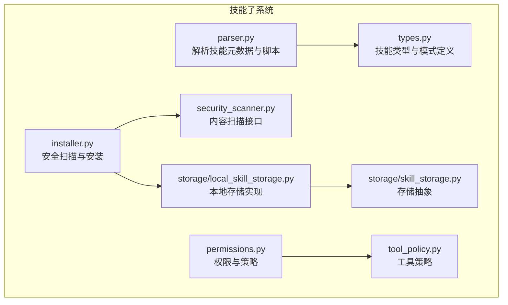
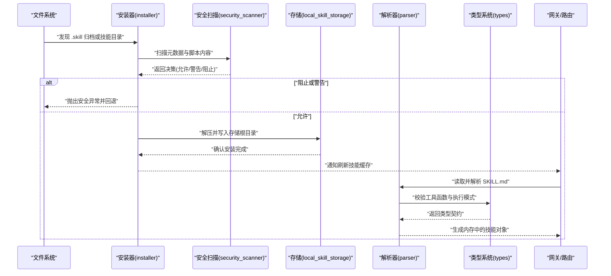
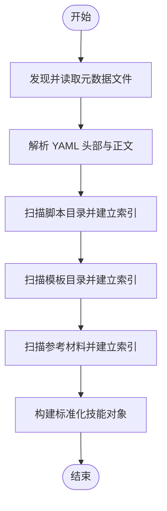
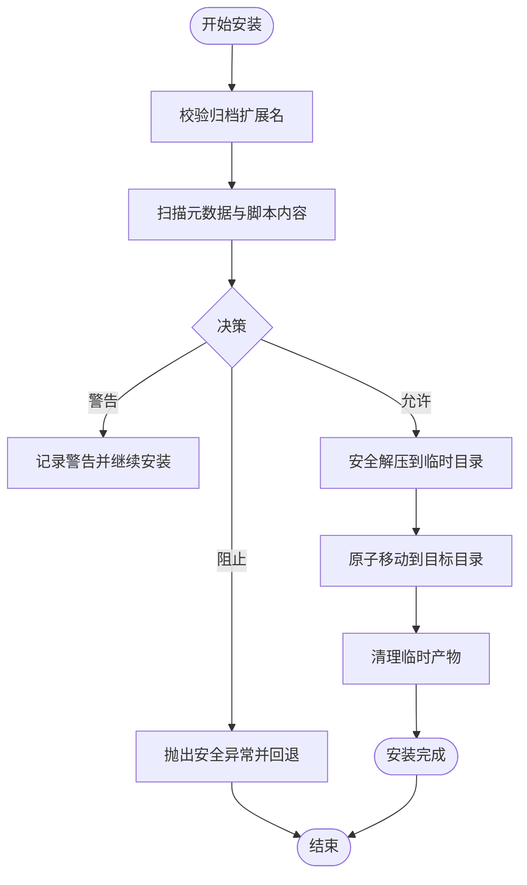
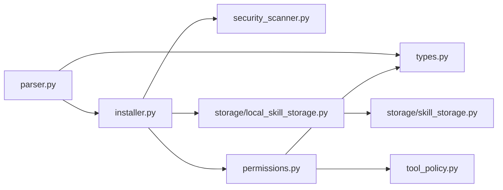

# 技能加载机制

<cite>
**本文引用的文件**
- [parser.py](file://backend/packages/harness/deerflow/skills/parser.py)
- [types.py](file://backend/packages/harness/deerflow/skills/types.py)
- [installer.py](file://backend/packages/harness/deerflow/skills/installer.py)
- [security_scanner.py](file://backend/packages/harness/deerflow/skills/security_scanner.py)
- [permissions.py](file://backend/packages/harness/deerflow/skills/permissions.py)
- [tool_policy.py](file://backend/packages/harness/deerflow/skills/tool_policy.py)
- [local_skill_storage.py](file://backend/packages/harness/deerflow/skills/storage/local_skill_storage.py)
- [skill_storage.py](file://backend/packages/harness/deerflow/skills/storage/skill_storage.py)
- [__init__.py](file://backend/packages/harness/deerflow/skills/__init__.py)
- [test_skills_parser.py](file://backend/tests/test_skills_parser.py)
- [test_skills_validation.py](file://backend/tests/test_skills_validation.py)
- [test_skills_installer.py](file://backend/tests/test_skills_installer.py)
- [test_skills_custom_router.py](file://backend/tests/test_skills_custom_router.py)
- [SKILL.md 示例](file://skills/public/bootstrap/SKILL.md)
- [SMOKE TEST 示例](file://.agent/skills/smoke-test/SKILL.md)
</cite>

## 目录
1. [引言](#引言)
2. [项目结构](#项目结构)
3. [核心组件](#核心组件)
4. [架构总览](#架构总览)
5. [详细组件分析](#详细组件分析)
6. [依赖关系分析](#依赖关系分析)
7. [性能考量](#性能考量)
8. [故障排查指南](#故障排查指南)
9. [结论](#结论)
10. [附录](#附录)

## 引言
本文件系统性阐述 DeerFlow 的“技能加载机制”，覆盖技能解析器工作原理（元数据解析、定义验证、动态导入与加载优先级）、技能类型系统（工具函数、技能配置、执行模式识别），并给出从文件发现到内存加载的完整流程图，包含错误处理与回退策略。同时提供可直接参考的代码片段路径，帮助开发者正确解析与加载自定义技能。

## 项目结构
技能子系统位于后端 harness 包内，采用模块化设计：解析器负责从技能目录提取元数据与脚本；安装器负责安全扫描与归档安装；存储层负责本地/远程技能持久化；权限与策略模块保障运行期安全；类型系统统一描述技能能力与执行模式。

图表来源
- [parser.py](file://backend/packages/harness/deerflow/skills/parser.py)
- [types.py](file://backend/packages/harness/deerflow/skills/types.py)
- [installer.py](file://backend/packages/harness/deerflow/skills/installer.py)
- [security_scanner.py](file://backend/packages/harness/deerflow/skills/security_scanner.py)
- [permissions.py](file://backend/packages/harness/deerflow/skills/permissions.py)
- [tool_policy.py](file://backend/packages/harness/deerflow/skills/tool_policy.py)
- [local_skill_storage.py](file://backend/packages/harness/deerflow/skills/storage/local_skill_storage.py)
- [skill_storage.py](file://backend/packages/harness/deerflow/skills/storage/skill_storage.py)

章节来源
- [__init__.py](file://backend/packages/harness/deerflow/skills/__init__.py)

## 核心组件
- 解析器（parser）：从技能根目录读取并解析元数据文件（如 SKILL.md），抽取技能名称、描述、脚本清单、模板与参考材料等信息，生成标准化的技能对象。
- 类型系统（types）：定义技能实体、工具函数签名、执行模式（同步/异步/流式）、参数与输出约束等，作为后续校验与动态导入的契约。
- 安装器（installer）：对技能归档进行安全扫描（内容与可执行项），在通过后解压并写入存储根目录，支持重复安装保护与异常回退。
- 存储层（storage）：提供本地/远程技能存储抽象与实现，负责技能目录的读写、路径解析与生命周期管理。
- 权限与策略（permissions/tool_policy）：定义技能可用范围、工具调用限制与运行时策略，确保最小权限原则与合规执行。
- 安全扫描（security_scanner）：提供统一的内容扫描接口，支持“允许/警告/阻止”三态决策，用于安装前与运行前的安全检查。

章节来源
- [parser.py](file://backend/packages/harness/deerflow/skills/parser.py)
- [types.py](file://backend/packages/harness/deerflow/skills/types.py)
- [installer.py](file://backend/packages/harness/deerflow/skills/installer.py)
- [security_scanner.py](file://backend/packages/harness/deerflow/skills/security_scanner.py)
- [permissions.py](file://backend/packages/harness/deerflow/skills/permissions.py)
- [tool_policy.py](file://backend/packages/harness/deerflow/skills/tool_policy.py)
- [local_skill_storage.py](file://backend/packages/harness/deerflow/skills/storage/local_skill_storage.py)
- [skill_storage.py](file://backend/packages/harness/deerflow/skills/storage/skill_storage.py)

## 架构总览
下图展示了从“文件发现”到“内存加载”的端到端流程，涵盖解析、验证、安装、存储与动态导入的关键节点，并标注错误处理与回退路径。

图表来源
- [installer.py](file://backend/packages/harness/deerflow/skills/installer.py)
- [security_scanner.py](file://backend/packages/harness/deerflow/skills/security_scanner.py)
- [local_skill_storage.py](file://backend/packages/harness/deerflow/skills/storage/local_skill_storage.py)
- [parser.py](file://backend/packages/harness/deerflow/skills/parser.py)
- [types.py](file://backend/packages/harness/deerflow/skills/types.py)

## 详细组件分析

### 解析器（parser）
职责
- 从技能根目录读取元数据文件（如 SKILL.md），解析 YAML 头部与正文内容。
- 扫描脚本目录（scripts/）、模板目录（templates/）与参考材料（references/），构建技能的可执行脚本清单与资源映射。
- 产出标准化技能对象，供后续验证与动态导入使用。

关键流程
- 文件发现：定位并读取元数据文件与资源目录。
- 元数据解析：提取技能名称、描述、版本、作者、许可等字段。
- 资源索引：遍历脚本、模板与参考文件，记录路径与用途。
- 结果输出：生成技能对象，包含元数据、脚本列表、模板字典与参考清单。

图表来源
- [parser.py](file://backend/packages/harness/deerflow/skills/parser.py)

章节来源
- [parser.py](file://backend/packages/harness/deerflow/skills/parser.py)
- [test_skills_parser.py](file://backend/tests/test_skills_parser.py)

### 类型系统（types）
职责
- 定义技能实体、工具函数签名、参数与输出约束。
- 识别执行模式（同步/异步/流式），并与解析器输出的脚本清单进行契约匹配。
- 提供类型校验与兼容性检查，保证动态导入阶段的稳定性。

要点
- 抽象类型：技能对象、工具函数、执行模式枚举、参数 Schema。
- 约束规则：必填字段、可选字段、默认值、类型校验、范围限制。
- 模式识别：根据脚本特性与注释推断执行模式，确保与工具策略一致。

章节来源
- [types.py](file://backend/packages/harness/deerflow/skills/types.py)

### 安装器（installer）
职责
- 对技能归档进行安全扫描（内容与可执行项），在通过后解压并写入存储根目录。
- 支持重复安装保护、异常回退（部分写入清理）、路径解析与归档入口自动探测。
- 与安全扫描器协作，遵循“允许/警告/阻止”的决策流程。

关键流程
- 输入校验：检查归档扩展名与文件存在性。
- 安全扫描：对元数据与脚本内容进行扫描，区分可执行与非可执行项。
- 解压与写入：安全解压至临时目录，再原子移动到目标位置。
- 原子性与回退：失败时清理临时产物，避免残留。
- 冲突处理：若目标已存在，抛出特定异常（替换/禁止）。

图表来源
- [installer.py](file://backend/packages/harness/deerflow/skills/installer.py)
- [security_scanner.py](file://backend/packages/harness/deerflow/skills/security_scanner.py)

章节来源
- [installer.py](file://backend/packages/harness/deerflow/skills/installer.py)
- [test_skills_installer.py](file://backend/tests/test_skills_installer.py)

### 存储层（storage）
职责
- 提供本地/远程技能存储抽象与实现，负责技能目录的读写、路径解析与生命周期管理。
- 与安装器配合，确保安装路径、虚拟路径与宿主路径的一致性。

要点
- 抽象接口：创建、删除、列举、读取、更新技能目录。
- 实现细节：本地存储基于文件系统，远程存储可对接云存储或容器卷。
- 虚拟路径：支持线程隔离与沙箱环境下的路径映射。

章节来源
- [local_skill_storage.py](file://backend/packages/harness/deerflow/skills/storage/local_skill_storage.py)
- [skill_storage.py](file://backend/packages/harness/deerflow/skills/storage/skill_storage.py)

### 权限与策略（permissions/tool_policy）
职责
- 定义技能可用范围、工具调用限制与运行时策略。
- 与类型系统协作，确保工具函数在声明的执行模式与参数范围内被调用。
- 与安全扫描联动，对可疑脚本发出警告或阻止。

章节来源
- [permissions.py](file://backend/packages/harness/deerflow/skills/permissions.py)
- [tool_policy.py](file://backend/packages/harness/deerflow/skills/tool_policy.py)

## 依赖关系分析
技能加载链路中各模块的耦合与协作如下：

图表来源
- [parser.py](file://backend/packages/harness/deerflow/skills/parser.py)
- [types.py](file://backend/packages/harness/deerflow/skills/types.py)
- [installer.py](file://backend/packages/harness/deerflow/skills/installer.py)
- [security_scanner.py](file://backend/packages/harness/deerflow/skills/security_scanner.py)
- [local_skill_storage.py](file://backend/packages/harness/deerflow/skills/storage/local_skill_storage.py)
- [skill_storage.py](file://backend/packages/harness/deerflow/skills/storage/skill_storage.py)
- [permissions.py](file://backend/packages/harness/deerflow/skills/permissions.py)
- [tool_policy.py](file://backend/packages/harness/deerflow/skills/tool_policy.py)

章节来源
- [__init__.py](file://backend/packages/harness/deerflow/skills/__init__.py)

## 性能考量
- 流式写入与累计真实字节：安装器在解压时采用流式写入，累计实际写入字节数，避免受归档声明大小误导，降低内存峰值与 IO 延迟。
- 双重路径校验：成员级与解析后路径双重校验，防止路径穿越与符号链接攻击，提升安全性的同时保持较低开销。
- 原子移动与部分写入清理：安装失败时自动清理临时产物，减少磁盘碎片与脏状态。
- 缓存与增量刷新：安装完成后触发技能系统提示刷新缓存，避免重复解析与导入带来的抖动。

## 故障排查指南
常见问题与处理建议
- 安全扫描阻止安装
  - 现象：安装过程中抛出安全异常，目标技能未落盘。
  - 排查：检查扫描日志与决策原因，确认是否为可执行脚本或敏感内容。
  - 处理：修复内容或调整策略，必要时联系管理员降级策略。
  - 参考测试：[test_skills_installer.py](file://backend/tests/test_skills_installer.py)
- 警告但继续安装
  - 现象：扫描返回警告，安装仍继续，但会记录风险。
  - 排查：核对可执行脚本与敏感关键字。
  - 处理：按警告提示修正内容或提交复审。
  - 参考测试：[test_skills_installer.py](file://backend/tests/test_skills_installer.py)
- 重复安装冲突
  - 现象：目标技能已存在，安装失败。
  - 排查：确认是否需要升级或替换。
  - 处理：删除旧版本或启用替换逻辑。
  - 参考测试：[test_skills_installer.py](file://backend/tests/test_skills_installer.py)
- 路径解析异常
  - 现象：安装成功但无法在网关中找到技能。
  - 排查：确认存储根路径、虚拟路径映射与线程隔离设置。
  - 处理：检查路由与存储配置，必要时刷新系统提示缓存。
  - 参考测试：[test_skills_custom_router.py](file://backend/tests/test_skills_custom_router.py)
- 解析失败或格式不合法
  - 现象：SKILL.md 格式错误导致解析中断。
  - 排查：对照示例文件检查 YAML 头部与正文格式。
  - 处理：修正 SKILL.md 或参考示例文件。
  - 参考示例：[SKILL.md 示例](file://skills/public/bootstrap/SKILL.md)，[SMOKE TEST 示例](file://.agent/skills/smoke-test/SKILL.md)
  - 参考测试：[test_skills_parser.py](file://backend/tests/test_skills_parser.py)，[test_skills_validation.py](file://backend/tests/test_skills_validation.py)

章节来源
- [test_skills_installer.py](file://backend/tests/test_skills_installer.py)
- [test_skills_custom_router.py](file://backend/tests/test_skills_custom_router.py)
- [test_skills_parser.py](file://backend/tests/test_skills_parser.py)
- [test_skills_validation.py](file://backend/tests/test_skills_validation.py)
- [SKILL.md 示例](file://skills/public/bootstrap/SKILL.md)
- [SMOKE TEST 示例](file://.agent/skills/smoke-test/SKILL.md)

## 结论
DeerFlow 的技能加载机制以“安全优先、类型驱动、存储抽象、策略可控”为核心设计思想。解析器负责从元数据与资源中提炼技能契约，类型系统确保执行模式与工具函数的合法性，安装器在安全扫描与原子写入的保障下完成归档落地，存储层提供灵活的路径与生命周期管理，权限与策略模块贯穿始终，确保最小权限与合规执行。通过完善的错误处理与回退机制，系统在复杂场景下仍能保持稳定与可维护性。

## 附录
- 如何正确解析与加载自定义技能（示例路径）
  - 准备元数据文件：参考示例 SKILL.md，确保 YAML 头部与正文格式规范。
    - [SKILL.md 示例](file://skills/public/bootstrap/SKILL.md)
    - [.agent 示例](file://.agent/skills/smoke-test/SKILL.md)
  - 安装技能归档：使用安装器接口进行安全扫描与安装。
    - [installer.py](file://backend/packages/harness/deerflow/skills/installer.py)
  - 解析技能对象：调用解析器读取并构建技能对象。
    - [parser.py](file://backend/packages/harness/deerflow/skills/parser.py)
  - 校验类型与执行模式：依据类型系统进行工具函数与模式校验。
    - [types.py](file://backend/packages/harness/deerflow/skills/types.py)
  - 动态导入与运行：结合权限与策略模块，按声明的执行模式调用工具函数。
    - [permissions.py](file://backend/packages/harness/deerflow/skills/permissions.py)
    - [tool_policy.py](file://backend/packages/harness/deerflow/skills/tool_policy.py)
  - 存储与刷新：确认存储根路径与虚拟路径映射，安装完成后刷新系统提示缓存。
    - [local_skill_storage.py](file://backend/packages/harness/deerflow/skills/storage/local_skill_storage.py)
    - [test_skills_custom_router.py](file://backend/tests/test_skills_custom_router.py)