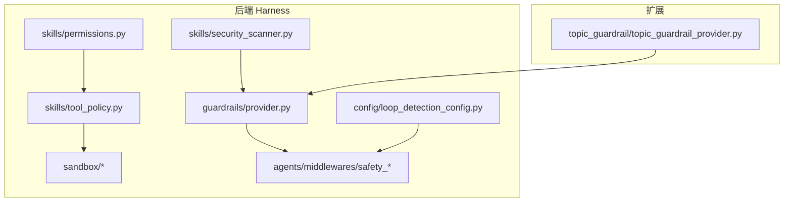
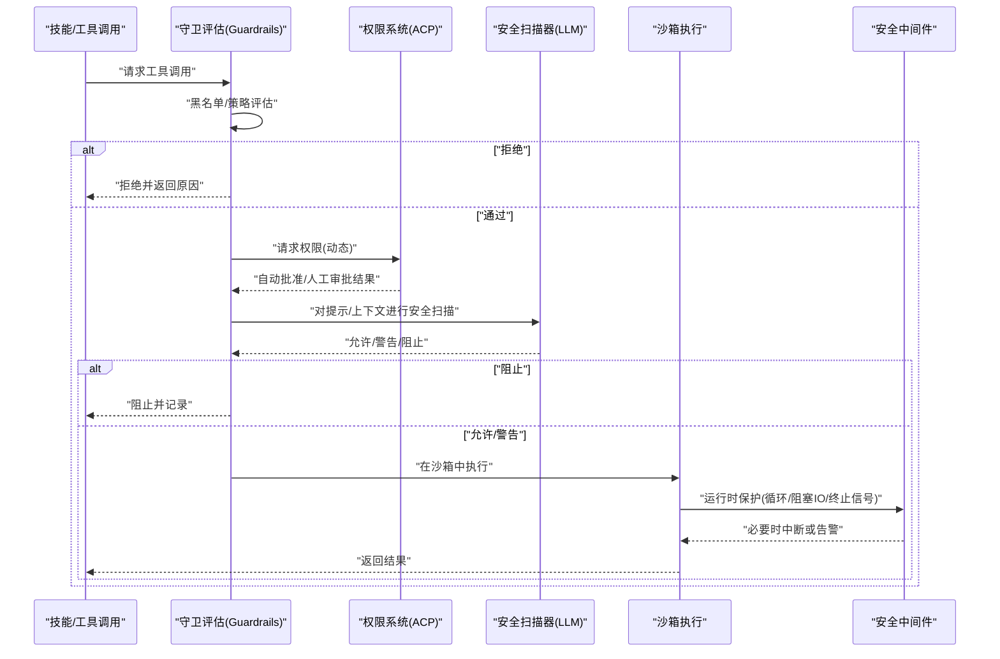
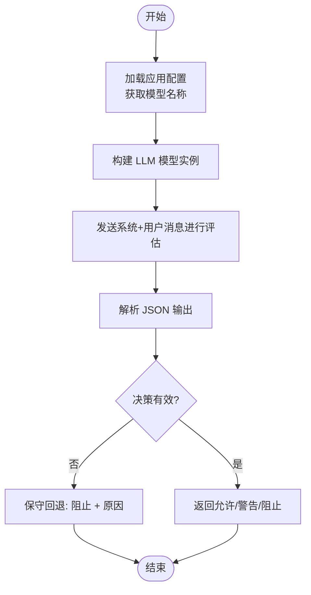
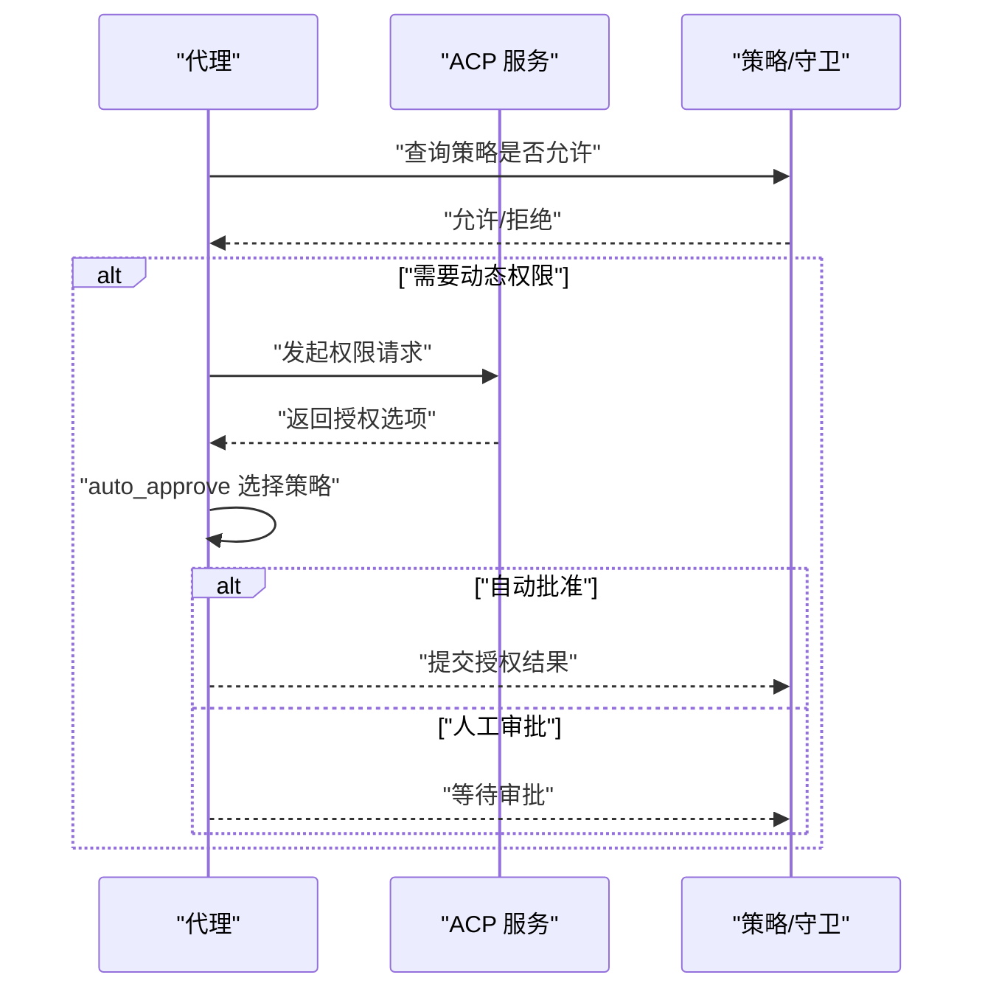
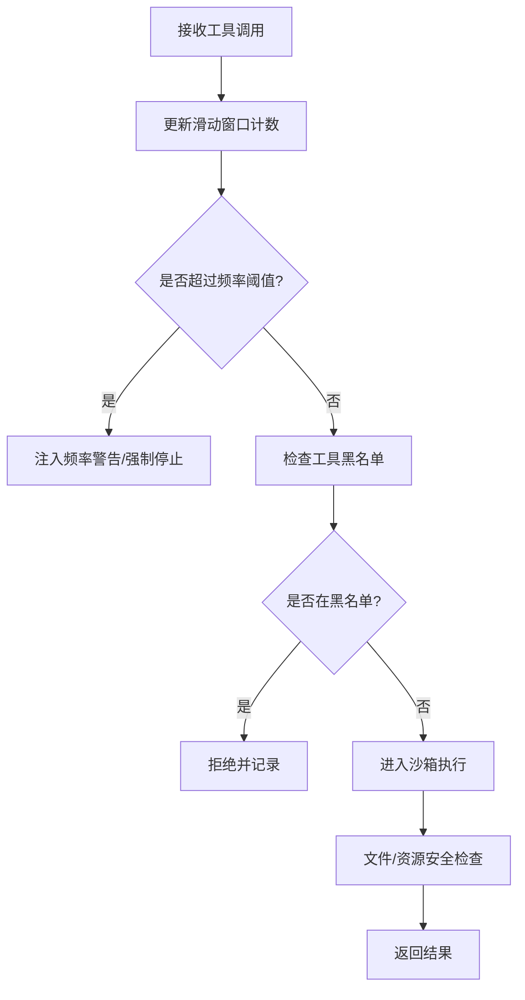
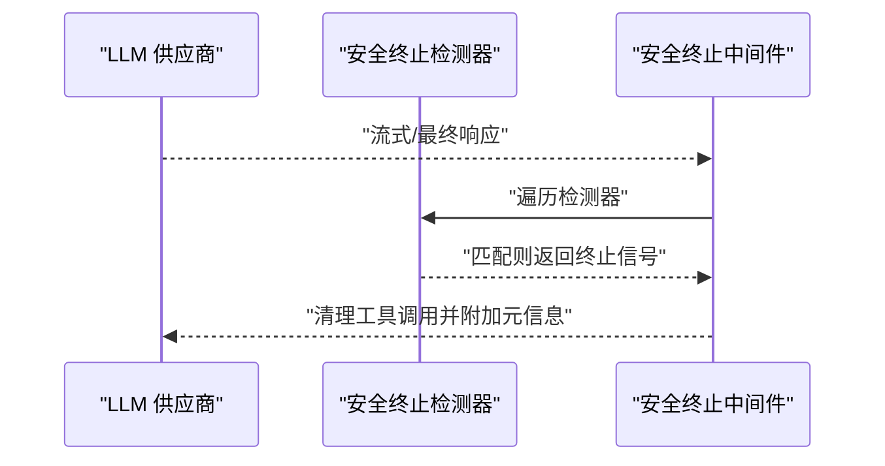
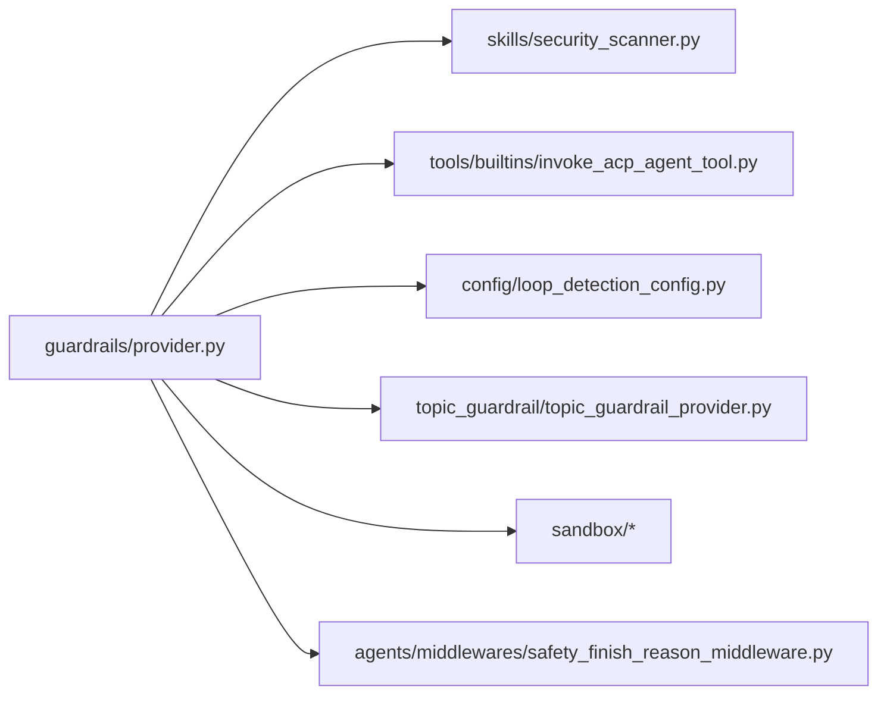

# 技能安全管理

<cite>
**本文引用的文件**
- [security_scanner.py](file://backend/packages/harness/deerflow/skills/security_scanner.py)
- [permissions.py](file://backend/packages/harness/deerflow/skills/permissions.py)
- [tool_policy.py](file://backend/packages/harness/deerflow/skills/tool_policy.py)
- [provider.py](file://backend/packages/harness/deerflow/guardrails/provider.py)
- [topic_guardrail_provider.py](file://deerflow_extensions/topic_guardrail/topic_guardrail_provider.py)
- [loop_detection_config.py](file://backend/packages/harness/deerflow/config/loop_detection_config.py)
- [GUARDRAILS.md](file://backend/docs/GUARDRAILS.md)
- [BLOCKING_IO_DETECTION.md](file://backend/docs/BLOCKING_IO_DETECTION.md)
- [safety_termination_detectors.py](file://backend/packages/harness/deerflow/agents/middlewares/safety_termination_detectors.py)
- [safety_finish_reason_middleware.py](file://backend/packages/harness/deerflow/agents/middlewares/safety_finish_reason_middleware.py)
- [test_safety_termination_detectors.py](file://backend/tests/test_safety_termination_detectors.py)
- [test_safety_finish_reason_middleware.py](file://backend/tests/test_safety_finish_reason_middleware.py)
- [invoke_acp_agent_tool.py](file://backend/packages/harness/deerflow/tools/builtins/invoke_acp_agent_tool.py)
- [sandbox.py](file://backend/packages/harness/deerflow/sandbox/sandbox.py)
- [sandbox_provider.py](file://backend/packages/harness/deerflow/sandbox/sandbox_provider.py)
- [file_operation_lock.py](file://backend/packages/harness/deerflow/sandbox/file_operation_lock.py)
- [middleware.py](file://backend/packages/harness/deerflow/sandbox/middleware.py)
- [security.py](file://backend/packages/harness/deerflow/sandbox/security.py)
- [tools.py](file://backend/packages/harness/deerflow/sandbox/tools.py)
- [README.md](file://backend/README.md)
</cite>

## 目录
1. [引言](#引言)
2. [项目结构](#项目结构)
3. [核心组件](#核心组件)
4. [架构总览](#架构总览)
5. [详细组件分析](#详细组件分析)
6. [依赖关系分析](#依赖关系分析)
7. [性能考量](#性能考量)
8. [故障排查指南](#故障排查指南)
9. [结论](#结论)
10. [附录](#附录)

## 引言
本文件面向 DeerFlow 技能安全管理系统，系统性阐述安全扫描器的工作原理（恶意代码检测、权限滥用检查、资源访问监控），权限控制系统（最小权限原则、动态权限分配、权限审计），工具策略配置（工具调用限制、执行时间控制、资源使用配额），以及安全最佳实践（代码审查、安全测试、合规性检查）。内容基于仓库中实际实现与文档进行归纳总结，并通过图示帮助不同背景读者理解。

## 项目结构
DeerFlow 的安全能力主要分布在后端 Harness 包与扩展模块中：
- 安全扫描与策略：skills 子包中的 security_scanner、permissions、tool_policy 等
- 中间件与守卫：guardrails 提供策略评估接口；sandbox 提供沙箱与安全中间件
- 运行时保护：loop_detection_config、safety_* 相关中间件与检测器
- 扩展：topic_guardrail 提供基于工具名的黑名单策略
- 文档：GUARDRAILS.md、BLOCKING_IO_DETECTION.md 等

图表来源
- [security_scanner.py](file://backend/packages/harness/deerflow/skills/security_scanner.py)
- [permissions.py](file://backend/packages/harness/deerflow/skills/permissions.py)
- [tool_policy.py](file://backend/packages/harness/deerflow/skills/tool_policy.py)
- [provider.py](file://backend/packages/harness/deerflow/guardrails/provider.py)
- [sandbox.py](file://backend/packages/harness/deerflow/sandbox/sandbox.py)
- [loop_detection_config.py](file://backend/packages/harness/deerflow/config/loop_detection_config.py)
- [topic_guardrail_provider.py](file://deerflow_extensions/topic_guardrail/topic_guardrail_provider.py)

章节来源
- [README.md](file://backend/README.md)

## 核心组件
- 安全扫描器：基于 LLM 的规则评估，输出允许/警告/阻止决策，具备保守回退与可解析输出校验
- 权限控制系统：最小权限原则下的动态权限请求与自动批准策略，支持 ACP 协议响应
- 工具策略：基于频率阈值与窗口的循环检测、工具黑名单守卫、沙箱资源与文件操作限制
- 运行时保护：安全终止信号检测与中间件，阻塞 IO 静态/运行时检测

章节来源
- [security_scanner.py](file://backend/packages/harness/deerflow/skills/security_scanner.py)
- [permissions.py](file://backend/packages/harness/deerflow/skills/permissions.py)
- [tool_policy.py](file://backend/packages/harness/deerflow/skills/tool_policy.py)
- [provider.py](file://backend/packages/harness/deerflow/guardrails/provider.py)
- [loop_detection_config.py](file://backend/packages/harness/deerflow/config/loop_detection_config.py)
- [GUARDRAILS.md](file://backend/docs/GUARDRAILS.md)

## 架构总览
下图展示从“技能调用”到“安全判定”的整体链路，包括守卫评估、权限请求、沙箱执行与运行时保护。

图表来源
- [provider.py](file://backend/packages/harness/deerflow/guardrails/provider.py)
- [invoke_acp_agent_tool.py](file://backend/packages/harness/deerflow/tools/builtins/invoke_acp_agent_tool.py)
- [security_scanner.py](file://backend/packages/harness/deerflow/skills/security_scanner.py)
- [sandbox.py](file://backend/packages/harness/deerflow/sandbox/sandbox.py)
- [safety_finish_reason_middleware.py](file://backend/packages/harness/deerflow/agents/middlewares/safety_finish_reason_middleware.py)

## 详细组件分析

### 安全扫描器：恶意代码与上下文风险检测
- 工作方式
  - 使用应用配置中的模型名称创建 LLM 模型实例，发送系统与用户消息进行规则评估
  - 解析模型输出的 JSON 对象，提取决策字段与原因
  - 若输出不可解析或模型不可用，则采用保守回退策略（阻止）并给出需要人工复核的提示
- 关键点
  - 决策集合限定于允许/警告/阻止三类
  - 回退逻辑确保在异常情况下不放行高风险调用
  - 可针对可执行内容与技能内容分别处理

图表来源
- [security_scanner.py](file://backend/packages/harness/deerflow/skills/security_scanner.py)

章节来源
- [security_scanner.py](file://backend/packages/harness/deerflow/skills/security_scanner.py)

### 权限控制系统：最小权限与动态分配
- 最小权限原则
  - 默认拒绝所有未明确授权的操作，仅在严格策略下开放
- 动态权限分配
  - 通过 ACP 协议发起权限请求，支持自动批准（优先一次性/永久授权选项）与人工审批
  - 当 auto_approve 为真时，按偏好选择第一个可用的授权选项；否则直接拒绝
- 权限审计
  - 通过守卫与中间件记录权限请求、决策与结果，便于审计与追溯

图表来源
- [invoke_acp_agent_tool.py](file://backend/packages/harness/deerflow/tools/builtins/invoke_acp_agent_tool.py)
- [provider.py](file://backend/packages/harness/deerflow/guardrails/provider.py)

章节来源
- [invoke_acp_agent_tool.py](file://backend/packages/harness/deerflow/tools/builtins/invoke_acp_agent_tool.py)
- [provider.py](file://backend/packages/harness/deerflow/guardrails/provider.py)

### 工具策略与资源控制
- 循环检测与频率限制
  - 基于滑动窗口统计相同工具调用序列与单工具调用频率，超过阈值注入警告或强制停止
  - 支持全局与逐工具覆盖阈值，以适配高频率工具（如 bash）
- 工具黑名单守卫
  - 扩展模块提供基于工具名的黑名单策略，命中即拒绝
- 沙箱资源与文件锁
  - 沙箱提供文件操作锁、安全策略与工具集，限制危险操作
  - 中间件负责在执行前后进行安全检查与隔离

图表来源
- [loop_detection_config.py](file://backend/packages/harness/deerflow/config/loop_detection_config.py)
- [topic_guardrail_provider.py](file://deerflow_extensions/topic_guardrail/topic_guardrail_provider.py)
- [sandbox.py](file://backend/packages/harness/deerflow/sandbox/sandbox.py)
- [file_operation_lock.py](file://backend/packages/harness/deerflow/sandbox/file_operation_lock.py)
- [middleware.py](file://backend/packages/harness/deerflow/sandbox/middleware.py)

章节来源
- [loop_detection_config.py](file://backend/packages/harness/deerflow/config/loop_detection_config.py)
- [topic_guardrail_provider.py](file://deerflow_extensions/topic_guardrail/topic_guardrail_provider.py)
- [sandbox.py](file://backend/packages/harness/deerflow/sandbox/sandbox.py)
- [file_operation_lock.py](file://backend/packages/harness/deerflow/sandbox/file_operation_lock.py)
- [middleware.py](file://backend/packages/harness/deerflow/sandbox/middleware.py)

### 运行时安全保护：阻断与终止信号
- 安全终止信号检测
  - 不同大模型提供商以不同字段表达“出于安全原因终止”，检测器统一抽象接口
  - 中间件在链路中消费检测器结果，必要时清理工具调用并附加安全终止元信息
- 阻塞 IO 静态/运行时检测
  - 静态检测用于发现潜在阻塞 IO 调用
  - 运行时检测通过规则与锚点保障高风险异步路径不会回归

图表来源
- [safety_termination_detectors.py](file://backend/packages/harness/deerflow/agents/middlewares/safety_termination_detectors.py)
- [safety_finish_reason_middleware.py](file://backend/packages/harness/deerflow/agents/middlewares/safety_finish_reason_middleware.py)
- [test_safety_termination_detectors.py](file://backend/tests/test_safety_termination_detectors.py)
- [test_safety_finish_reason_middleware.py](file://backend/tests/test_safety_finish_reason_middleware.py)

章节来源
- [safety_termination_detectors.py](file://backend/packages/harness/deerflow/agents/middlewares/safety_termination_detectors.py)
- [safety_finish_reason_middleware.py](file://backend/packages/harness/deerflow/agents/middlewares/safety_finish_reason_middleware.py)
- [BLOCKING_IO_DETECTION.md](file://backend/docs/BLOCKING_IO_DETECTION.md)

## 依赖关系分析
- 组件耦合
  - 守卫评估与策略提供者解耦，便于接入不同策略实现（如 OAP Passport）
  - 权限系统通过 ACP 协议与策略层交互，避免硬编码
  - 沙箱与中间件形成“执行前/后置检查”的安全边界
- 外部依赖
  - LLM 模型用于安全扫描
  - 测试模块验证安全终止中间件与检测器的行为一致性

图表来源
- [provider.py](file://backend/packages/harness/deerflow/guardrails/provider.py)
- [security_scanner.py](file://backend/packages/harness/deerflow/skills/security_scanner.py)
- [invoke_acp_agent_tool.py](file://backend/packages/harness/deerflow/tools/builtins/invoke_acp_agent_tool.py)
- [loop_detection_config.py](file://backend/packages/harness/deerflow/config/loop_detection_config.py)
- [topic_guardrail_provider.py](file://deerflow_extensions/topic_guardrail/topic_guardrail_provider.py)
- [sandbox.py](file://backend/packages/harness/deerflow/sandbox/sandbox.py)
- [safety_finish_reason_middleware.py](file://backend/packages/harness/deerflow/agents/middlewares/safety_finish_reason_middleware.py)

## 性能考量
- 安全扫描器
  - LLM 调用成本较高，建议在必要场景触发（如高风险提示/上下文），并缓存可复用的评估结果
  - 回退策略避免重复失败调用，减少资源浪费
- 循环与频率限制
  - 合理设置窗口大小与阈值，平衡误报与漏报
  - 对高频工具单独配置阈值，避免过度抑制正常工作流
- 沙箱与中间件
  - 文件锁与资源限制会带来额外开销，应结合业务负载评估
  - 静态/运行时检测规则集中管理，降低维护成本

## 故障排查指南
- 安全扫描器不可用或输出不可解析
  - 现象：返回保守阻止并提示需要人工复核
  - 排查：确认模型配置、网络连通性与输出格式；检查日志中的原始输出片段
- 权限请求未生效
  - 现象：auto_approve 未按预期选择授权选项
  - 排查：确认 ACP 返回的选项类型与 ID 是否符合预期；检查自动批准逻辑
- 工具调用被误判为循环/超频
  - 现象：频繁出现频率警告或强制停止
  - 排查：调整窗口大小与阈值；为特定工具添加覆盖项；确认工具调用序列是否合理
- 安全终止中间件未触发
  - 现象：LLM 显式终止但工具调用未清理
  - 排查：确认检测器列表与顺序；检查中间件启用状态与配置；查看测试用例行为

章节来源
- [security_scanner.py](file://backend/packages/harness/deerflow/skills/security_scanner.py)
- [invoke_acp_agent_tool.py](file://backend/packages/harness/deerflow/tools/builtins/invoke_acp_agent_tool.py)
- [loop_detection_config.py](file://backend/packages/harness/deerflow/config/loop_detection_config.py)
- [safety_finish_reason_middleware.py](file://backend/packages/harness/deerflow/agents/middlewares/safety_finish_reason_middleware.py)
- [test_safety_termination_detectors.py](file://backend/tests/test_safety_termination_detectors.py)
- [test_safety_finish_reason_middleware.py](file://backend/tests/test_safety_finish_reason_middleware.py)

## 结论
DeerFlow 的技能安全管理体系通过“守卫策略 + 动态权限 + 安全扫描 + 沙箱执行 + 运行时保护”的多层架构，实现了对恶意代码、权限滥用与资源越权的有效控制。建议在生产环境中结合业务特性精细化配置工具策略与阈值，并持续完善策略与测试用例，以提升系统的安全性与稳定性。

## 附录

### 工具策略配置清单
- 循环检测与频率限制
  - 开关与阈值：见配置对象字段定义
  - 窗口大小与线程历史上限：用于控制内存占用与检测范围
  - 工具频率覆盖：为高频率工具单独设定阈值
- 工具黑名单
  - 在扩展模块中配置 denied_tools 列表，命中即拒绝
- 沙箱资源与文件锁
  - 文件操作锁：防止并发写冲突
  - 安全策略与工具集：限制危险命令与路径

章节来源
- [loop_detection_config.py](file://backend/packages/harness/deerflow/config/loop_detection_config.py)
- [topic_guardrail_provider.py](file://deerflow_extensions/topic_guardrail/topic_guardrail_provider.py)
- [file_operation_lock.py](file://backend/packages/harness/deerflow/sandbox/file_operation_lock.py)
- [security.py](file://backend/packages/harness/deerflow/sandbox/security.py)
- [tools.py](file://backend/packages/harness/deerflow/sandbox/tools.py)

### 安全最佳实践
- 代码审查
  - 审查安全扫描器与守卫策略的输出格式与回退逻辑
  - 审查权限请求与自动批准策略，确保最小权限原则
- 安全测试
  - 使用测试模块验证安全终止中间件与检测器的行为
  - 增加静态/运行时阻塞 IO 检测用例，防止回归
- 合规性检查
  - 依据 GUARDRAILS 文档对接 OAP 等标准策略提供者
  - 记录并审计权限请求与安全扫描结果，满足合规要求

章节来源
- [GUARDRAILS.md](file://backend/docs/GUARDRAILS.md)
- [BLOCKING_IO_DETECTION.md](file://backend/docs/BLOCKING_IO_DETECTION.md)
- [test_safety_termination_detectors.py](file://backend/tests/test_safety_termination_detectors.py)
- [test_safety_finish_reason_middleware.py](file://backend/tests/test_safety_finish_reason_middleware.py)