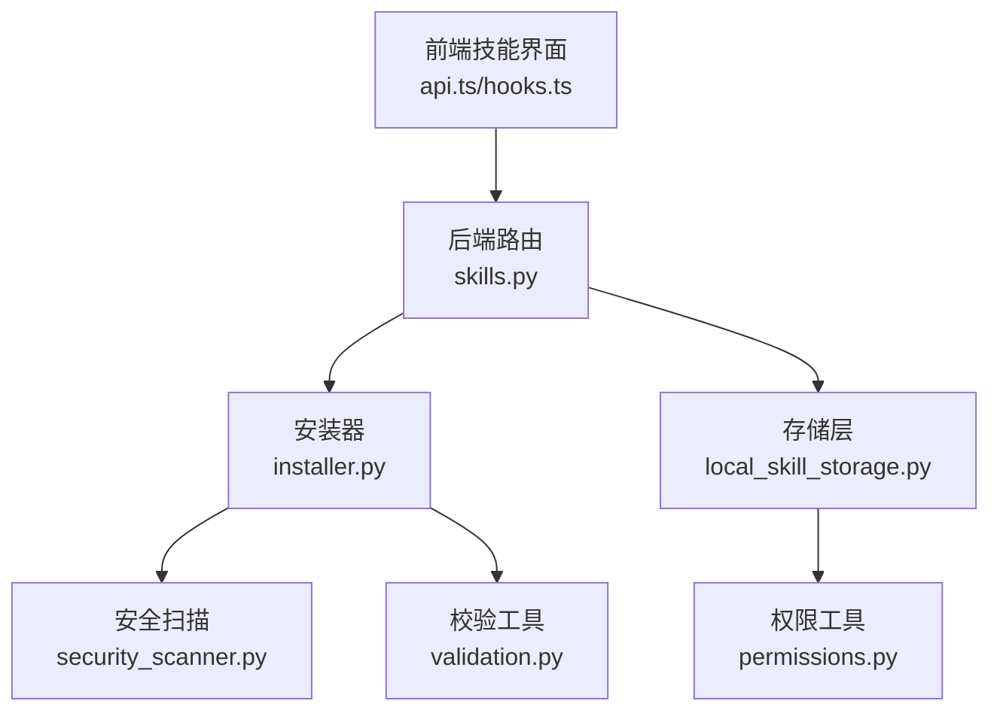
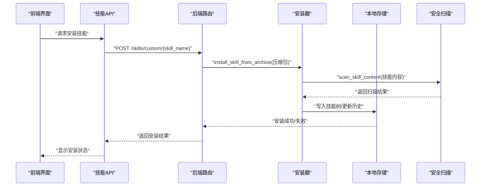
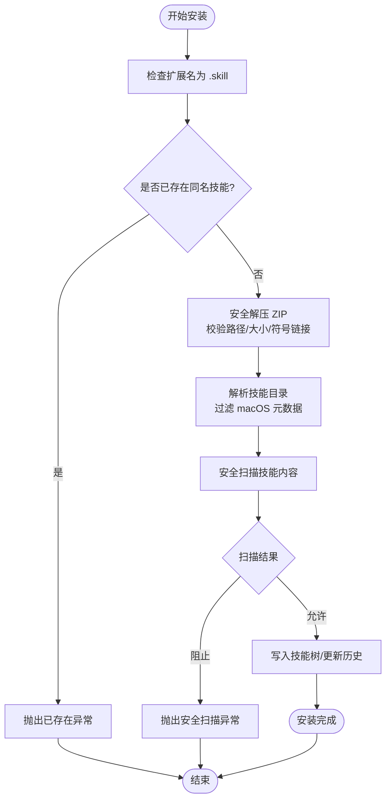
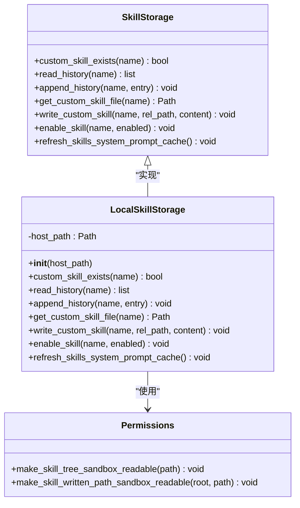
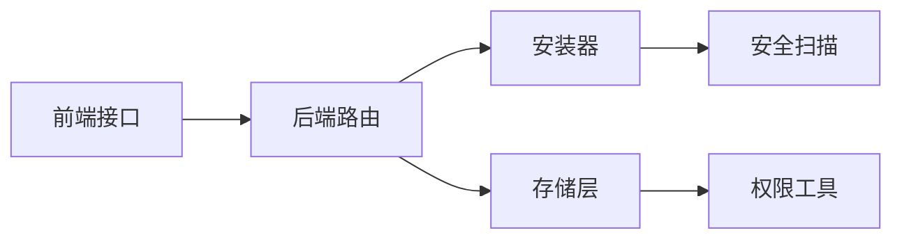
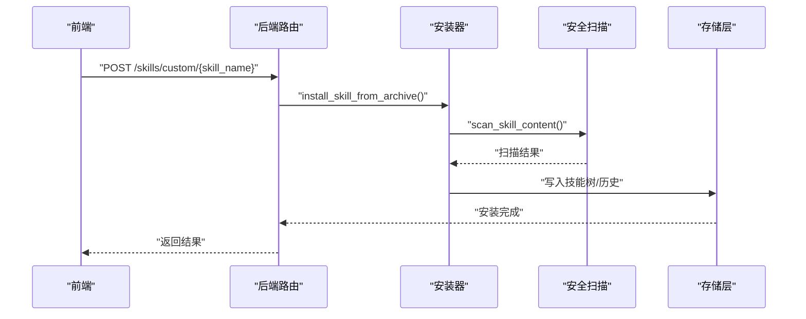

# 技能安装系统

<cite>
**本文引用的文件**
- [backend/packages/harness/deerflow/skills/installer.py](file://backend/packages/harness/deerflow/skills/installer.py)
- [backend/packages/harness/deerflow/skills/storage/local_skill_storage.py](file://backend/packages/harness/deerflow/skills/storage/local_skill_storage.py)
- [backend/packages/harness/deerflow/skills/storage/skill_storage.py](file://backend/packages/harness/deerflow/skills/storage/skill_storage.py)
- [backend/packages/harness/deerflow/skills/permissions.py](file://backend/packages/harness/deerflow/skills/permissions.py)
- [backend/packages/harness/deerflow/skills/security_scanner.py](file://backend/packages/harness/deerflow/skills/security_scanner.py)
- [backend/app/gateway/routers/skills.py](file://backend/app/gateway/routers/skills.py)
- [backend/tests/test_skills_installer.py](file://backend/tests/test_skills_installer.py)
- [backend/tests/test_skills_loader.py](file://backend/tests/test_skills_loader.py)
- [backend/tests/test_skills_parser.py](file://backend/tests/test_skills_parser.py)
- [backend/tests/test_skills_validation.py](file://backend/tests/test_skills_validation.py)
- [backend/tests/test_local_skill_storage_write.py](file://backend/tests/test_local_skill_storage_write.py)
- [frontend/src/core/skills/api.ts](file://frontend/src/core/skills/api.ts)
- [frontend/src/core/skills/hooks.ts](file://frontend/src/core/skills/hooks.ts)
- [backend/docs/rfc-extract-shared-modules.md](file://backend/docs/rfc-extract-shared-modules.md)
</cite>

## 目录
1. [简介](#简介)
2. [项目结构](#项目结构)
3. [核心组件](#核心组件)
4. [架构总览](#架构总览)
5. [详细组件分析](#详细组件分析)
6. [依赖关系分析](#依赖关系分析)
7. [性能考量](#性能考量)
8. [故障排除指南](#故障排除指南)
9. [结论](#结论)
10. [附录](#附录)

## 简介
本文件系统性阐述 DeerFlow 技能安装系统的实现原理与操作流程，覆盖技能包下载、解压、验证与部署的全生命周期；详解本地技能存储的管理机制（存储路径、文件权限、缓存策略）；并提供技能升级、卸载与版本回滚的操作指南及常见问题排查方法。读者可据此在不深入源码的前提下理解系统行为，并在生产环境中安全地进行技能管理。

## 项目结构
技能安装系统主要由后端 Python 包中的“技能”子模块与前端技能管理界面组成：
- 后端技能子模块：installer（安装器）、storage（存储）、security_scanner（安全扫描）、permissions（权限）、validation（校验）、parser（解析）等。
- 前端技能接口：通过 API 调用后端路由，实现技能列表加载与启用/禁用控制。
- 后端路由：提供技能安装、启用/禁用、自定义技能写入、历史回滚等接口。

图表来源
- [frontend/src/core/skills/api.ts:1-26](file://frontend/src/core/skills/api.ts#L1-L26)
- [frontend/src/core/skills/hooks.ts:1-31](file://frontend/src/core/skills/hooks.ts#L1-L31)
- [backend/app/gateway/routers/skills.py:234-278](file://backend/app/gateway/routers/skills.py#L234-L278)
- [backend/packages/harness/deerflow/skills/installer.py](file://backend/packages/harness/deerflow/skills/installer.py)
- [backend/packages/harness/deerflow/skills/storage/local_skill_storage.py](file://backend/packages/harness/deerflow/skills/storage/local_skill_storage.py)
- [backend/packages/harness/deerflow/skills/security_scanner.py](file://backend/packages/harness/deerflow/skills/security_scanner.py)
- [backend/packages/harness/deerflow/skills/permissions.py](file://backend/packages/harness/deerflow/skills/permissions.py)

章节来源
- [backend/packages/harness/deerflow/skills/installer.py](file://backend/packages/harness/deerflow/skills/installer.py)
- [backend/packages/harness/deerflow/skills/storage/local_skill_storage.py](file://backend/packages/harness/deerflow/skills/storage/local_skill_storage.py)
- [backend/app/gateway/routers/skills.py:234-278](file://backend/app/gateway/routers/skills.py#L234-L278)
- [frontend/src/core/skills/api.ts:1-26](file://frontend/src/core/skills/api.ts#L1-L26)
- [frontend/src/core/skills/hooks.ts:1-31](file://frontend/src/core/skills/hooks.ts#L1-L31)

## 核心组件
- 安装器（installer.py）
  - 提供安全解压、目录解析、安装入口与异常类型，确保 ZIP 成员无路径穿越、符号链接与 macOS 元数据被过滤，支持流式写入与大小限制。
- 存储层（storage/local_skill_storage.py 与 storage/skill_storage.py）
  - 封装本地技能树的读写、启用/禁用、自定义技能写入、历史记录与缓存刷新等能力。
- 权限工具（permissions.py）
  - 将已安装技能树设置为沙箱只读模式，避免运行时被意外修改。
- 安全扫描（security_scanner.py）
  - 对技能内容进行安全扫描，决定是否允许安装或回滚。
- 前端接口（frontend/src/core/skills/api.ts 与 hooks.ts）
  - 提供技能列表与启用/禁用的调用封装，配合后端路由完成用户交互。

章节来源
- [backend/packages/harness/deerflow/skills/installer.py](file://backend/packages/harness/deerflow/skills/installer.py)
- [backend/packages/harness/deerflow/skills/storage/local_skill_storage.py](file://backend/packages/harness/deerflow/skills/storage/local_skill_storage.py)
- [backend/packages/harness/deerflow/skills/storage/skill_storage.py](file://backend/packages/harness/deerflow/skills/storage/skill_storage.py)
- [backend/packages/harness/deerflow/skills/permissions.py](file://backend/packages/harness/deerflow/skills/permissions.py)
- [backend/packages/harness/deerflow/skills/security_scanner.py](file://backend/packages/harness/deerflow/skills/security_scanner.py)
- [frontend/src/core/skills/api.ts:1-26](file://frontend/src/core/skills/api.ts#L1-L26)
- [frontend/src/core/skills/hooks.ts:1-31](file://frontend/src/core/skills/hooks.ts#L1-L31)

## 架构总览
下图展示从前端到后端路由、安装器、存储层与安全扫描的整体交互流程。

图表来源
- [frontend/src/core/skills/api.ts:1-26](file://frontend/src/core/skills/api.ts#L1-L26)
- [backend/app/gateway/routers/skills.py:234-278](file://backend/app/gateway/routers/skills.py#L234-L278)
- [backend/packages/harness/deerflow/skills/installer.py](file://backend/packages/harness/deerflow/skills/installer.py)
- [backend/packages/harness/deerflow/skills/security_scanner.py](file://backend/packages/harness/deerflow/skills/security_scanner.py)
- [backend/packages/harness/deerflow/skills/storage/local_skill_storage.py](file://backend/packages/harness/deerflow/skills/storage/local_skill_storage.py)

## 详细组件分析

### 安装器（installer.py）
- 安全性保障
  - 路径穿越检测与符号链接识别，防止恶意成员破坏文件系统。
  - 过滤 macOS 特定元数据与隐藏文件，避免污染技能树。
  - 流式解压与累计真实字节数，限制总大小以抵御 ZIP 炸弹。
- 目录解析
  - 自动进入仅含一个根目录的压缩包，减少层级嵌套。
- 安装入口
  - 校验扩展名（.skill），若已存在同名技能则抛出专用异常。
- 异常模型
  - 使用专用异常类型替代通用错误，便于上层区分处理。

图表来源
- [backend/packages/harness/deerflow/skills/installer.py](file://backend/packages/harness/deerflow/skills/installer.py)
- [backend/docs/rfc-extract-shared-modules.md:59-191](file://backend/docs/rfc-extract-shared-modules.md#L59-L191)

章节来源
- [backend/packages/harness/deerflow/skills/installer.py](file://backend/packages/harness/deerflow/skills/installer.py)
- [backend/docs/rfc-extract-shared-modules.md:59-191](file://backend/docs/rfc-extract-shared-modules.md#L59-L191)
- [backend/tests/test_skills_installer.py:320-351](file://backend/tests/test_skills_installer.py#L320-L351)

### 本地技能存储（storage/local_skill_storage.py 与 storage/skill_storage.py）
- 能力概览
  - 读写自定义技能文件、启用/禁用技能、维护技能历史、刷新系统提示缓存。
  - 写入时对路径进行严格校验，拒绝绝对路径与越权访问。
  - 支持历史回滚，回滚前进行安全扫描。
- 文件权限
  - 安装完成后将技能树设置为沙箱只读，降低运行期风险。
- 缓存策略
  - 安装/回滚后刷新系统提示缓存，确保生效。

图表来源
- [backend/packages/harness/deerflow/skills/storage/skill_storage.py](file://backend/packages/harness/deerflow/skills/storage/skill_storage.py)
- [backend/packages/harness/deerflow/skills/storage/local_skill_storage.py](file://backend/packages/harness/deerflow/skills/storage/local_skill_storage.py)
- [backend/packages/harness/deerflow/skills/permissions.py](file://backend/packages/harness/deerflow/skills/permissions.py)

章节来源
- [backend/packages/harness/deerflow/skills/storage/skill_storage.py](file://backend/packages/harness/deerflow/skills/storage/skill_storage.py)
- [backend/packages/harness/deerflow/skills/storage/local_skill_storage.py](file://backend/packages/harness/deerflow/skills/storage/local_skill_storage.py)
- [backend/packages/harness/deerflow/skills/permissions.py](file://backend/packages/harness/deerflow/skills/permissions.py)
- [backend/tests/test_local_skill_storage_write.py:47-82](file://backend/tests/test_local_skill_storage_write.py#L47-L82)

### 安全扫描（security_scanner.py）
- 在安装与回滚前对技能内容执行安全扫描，决定放行或阻断。
- 扫描结果会写入历史记录，便于审计与回溯。

章节来源
- [backend/packages/harness/deerflow/skills/security_scanner.py](file://backend/packages/harness/deerflow/skills/security_scanner.py)
- [backend/tests/test_skills_installer.py:320-351](file://backend/tests/test_skills_installer.py#L320-L351)

### 前端技能接口（frontend/src/core/skills/api.ts 与 hooks.ts）
- 列出技能与启用/禁用技能，通过 React Query 管理状态与缓存。
- 调用后端路由完成用户操作。

章节来源
- [frontend/src/core/skills/api.ts:1-26](file://frontend/src/core/skills/api.ts#L1-L26)
- [frontend/src/core/skills/hooks.ts:1-31](file://frontend/src/core/skills/hooks.ts#L1-L31)

## 依赖关系分析
- 组件耦合
  - 路由依赖安装器与存储层；安装器依赖安全扫描；存储层依赖权限工具。
- 外部依赖
  - ZIP 解压、文件系统操作、HTTP 请求与缓存刷新。
- 潜在循环依赖
  - 当前模块间采用单向依赖，未见循环。

图表来源
- [backend/app/gateway/routers/skills.py:234-278](file://backend/app/gateway/routers/skills.py#L234-L278)
- [backend/packages/harness/deerflow/skills/installer.py](file://backend/packages/harness/deerflow/skills/installer.py)
- [backend/packages/harness/deerflow/skills/storage/local_skill_storage.py](file://backend/packages/harness/deerflow/skills/storage/local_skill_storage.py)
- [backend/packages/harness/deerflow/skills/security_scanner.py](file://backend/packages/harness/deerflow/skills/security_scanner.py)
- [backend/packages/harness/deerflow/skills/permissions.py](file://backend/packages/harness/deerflow/skills/permissions.py)
- [frontend/src/core/skills/api.ts:1-26](file://frontend/src/core/skills/api.ts#L1-L26)

章节来源
- [backend/app/gateway/routers/skills.py:234-278](file://backend/app/gateway/routers/skills.py#L234-L278)
- [backend/packages/harness/deerflow/skills/installer.py](file://backend/packages/harness/deerflow/skills/installer.py)
- [backend/packages/harness/deerflow/skills/storage/local_skill_storage.py](file://backend/packages/harness/deerflow/skills/storage/local_skill_storage.py)
- [backend/packages/harness/deerflow/skills/security_scanner.py](file://backend/packages/harness/deerflow/skills/security_scanner.py)
- [backend/packages/harness/deerflow/skills/permissions.py](file://backend/packages/harness/deerflow/skills/permissions.py)
- [frontend/src/core/skills/api.ts:1-26](file://frontend/src/core/skills/api.ts#L1-L26)

## 性能考量
- 流式解压与累计真实字节，避免内存峰值与 ZIP 炸弹风险。
- 仅在安装/回滚后刷新系统提示缓存，减少不必要的计算。
- 对已安装技能树应用沙箱只读，降低后续 I/O 修改成本。

## 故障排除指南
- 安装失败（扩展名不匹配）
  - 现象：传入非 .skill 的压缩包导致校验失败。
  - 排查：确认上传文件扩展名与 MIME 类型正确。
  - 参考测试：[backend/tests/test_client.py:1317-1328](file://backend/tests/test_client.py#L1317-L1328)
- 已存在同名技能
  - 现象：同名技能已存在，抛出专用异常。
  - 排查：选择不同名称或先卸载旧版本。
  - 参考测试：[backend/tests/test_skills_installer.py:320-351](file://backend/tests/test_skills_installer.py#L320-L351)
- 安全扫描阻断
  - 现象：扫描判定为 block，安装或回滚被阻止。
  - 排查：检查技能内容是否包含敏感模式，修正后重试。
  - 参考测试：[backend/tests/test_skills_installer.py:320-351](file://backend/tests/test_skills_installer.py#L320-L351)
- 写入失败与部分安装残留
  - 现象：复制过程中断，可能产生部分安装。
  - 排查：确保磁盘空间充足、权限正确；系统保证失败时不遗留部分安装。
  - 参考测试：[backend/tests/test_skills_installer.py:337-351](file://backend/tests/test_skills_installer.py#L337-L351)
- 自定义技能写入路径非法
  - 现象：绝对路径或越权路径被拒绝。
  - 排查：使用相对路径，避免跨目录访问。
  - 参考测试：[backend/tests/test_local_skill_storage_write.py:47-82](file://backend/tests/test_local_skill_storage_write.py#L47-L82)
- 历史索引越界
  - 现象：回滚时 history_index 越界。
  - 排查：核对历史记录长度，使用有效索引。
  - 参考路由：[backend/app/gateway/routers/skills.py:234-278](file://backend/app/gateway/routers/skills.py#L234-L278)

章节来源
- [backend/tests/test_client.py:1317-1328](file://backend/tests/test_client.py#L1317-L1328)
- [backend/tests/test_skills_installer.py:320-351](file://backend/tests/test_skills_installer.py#L320-L351)
- [backend/tests/test_local_skill_storage_write.py:47-82](file://backend/tests/test_local_skill_storage_write.py#L47-L82)
- [backend/app/gateway/routers/skills.py:234-278](file://backend/app/gateway/routers/skills.py#L234-L278)

## 结论
DeerFlow 技能安装系统通过严格的 ZIP 安全校验、沙箱只读权限与前置安全扫描，构建了高安全性与高可靠性的安装与运行环境。结合本地存储的历史记录与缓存刷新机制，实现了完整的技能生命周期管理。建议在生产中遵循统一的命名规范、最小权限原则与安全扫描策略，以获得最佳稳定性与安全性。

## 附录

### 技能安装生命周期（从请求到激活）
- 前端提交安装请求 → 后端路由接收 → 安装器执行安全解压与校验 → 安全扫描决定放行 → 存储层写入技能树并更新历史 → 刷新系统提示缓存 → 返回安装结果。

图表来源
- [backend/app/gateway/routers/skills.py:234-278](file://backend/app/gateway/routers/skills.py#L234-L278)
- [backend/packages/harness/deerflow/skills/installer.py](file://backend/packages/harness/deerflow/skills/installer.py)
- [backend/packages/harness/deerflow/skills/security_scanner.py](file://backend/packages/harness/deerflow/skills/security_scanner.py)
- [backend/packages/harness/deerflow/skills/storage/local_skill_storage.py](file://backend/packages/harness/deerflow/skills/storage/local_skill_storage.py)

### 技能升级与版本回滚
- 升级
  - 重新上传新版本 .skill 压缩包，系统将覆盖写入并生成新的历史条目。
- 回滚
  - 选择历史记录中的某条目，回滚前进行安全扫描，通过后写入目标内容并刷新缓存。
- 参考路由与测试
  - [backend/app/gateway/routers/skills.py:234-278](file://backend/app/gateway/routers/skills.py#L234-L278)
  - [backend/tests/test_skills_installer.py:320-351](file://backend/tests/test_skills_installer.py#L320-L351)

### 卸载与清理
- 禁用技能：通过后端路由 PUT /skills/{skill_name} 设置 enabled=false。
- 删除技能：删除本地技能树目录（需谨慎），随后刷新缓存。
- 参考路由与前端接口
  - [backend/app/gateway/routers/skills.py:234-278](file://backend/app/gateway/routers/skills.py#L234-L278)
  - [frontend/src/core/skills/api.ts:12-26](file://frontend/src/core/skills/api.ts#L12-L26)
  - [frontend/src/core/skills/hooks.ts:15-31](file://frontend/src/core/skills/hooks.ts#L15-L31)