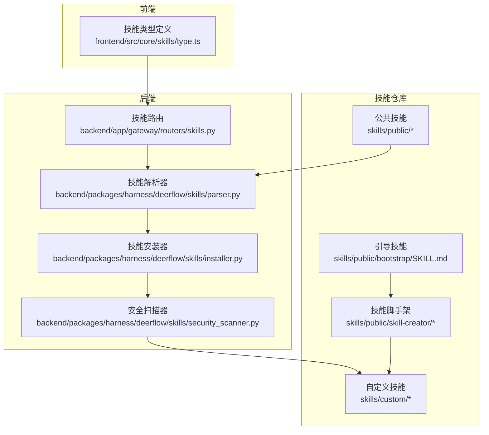
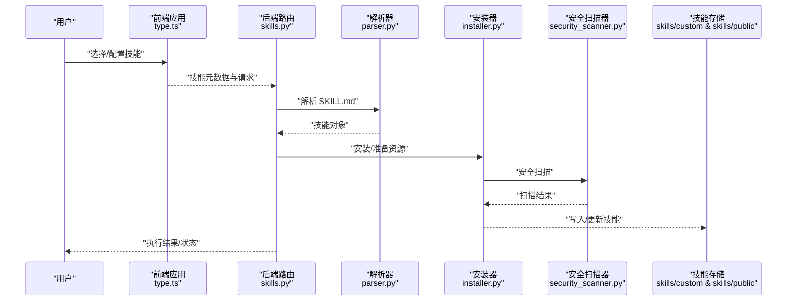
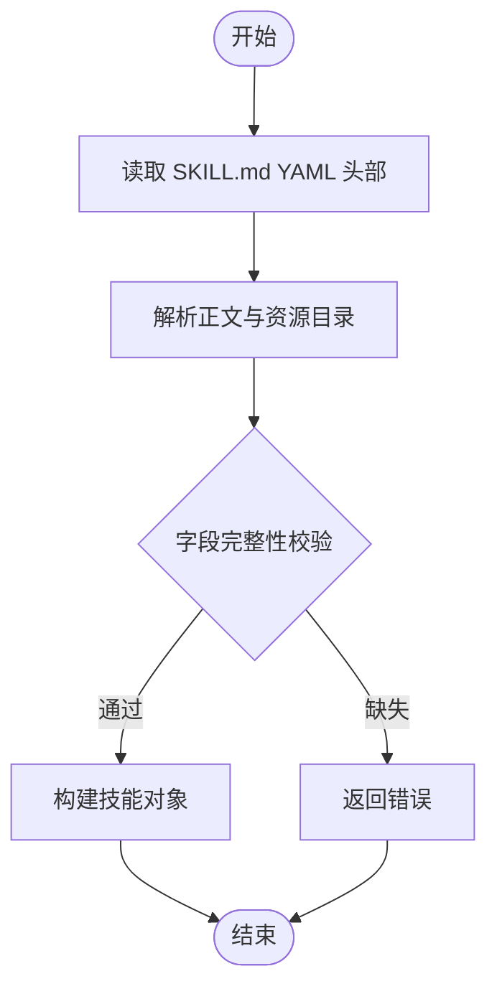
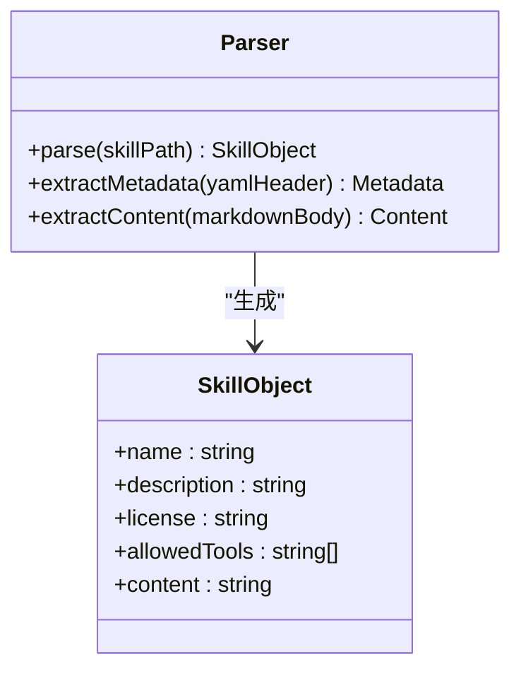
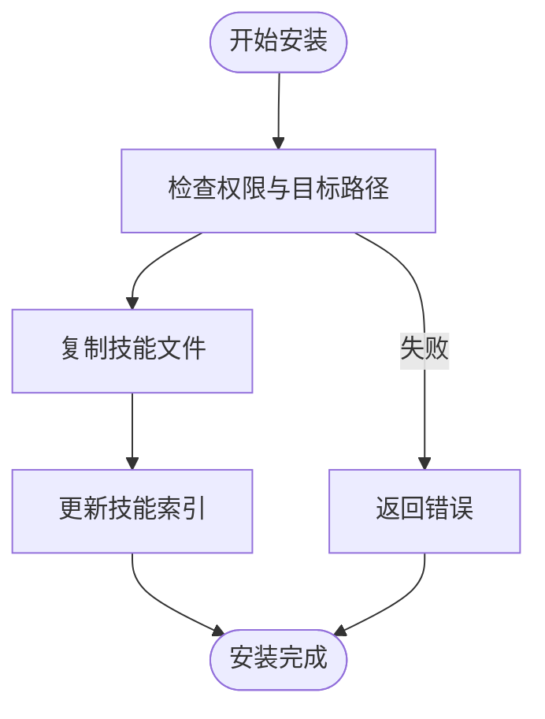
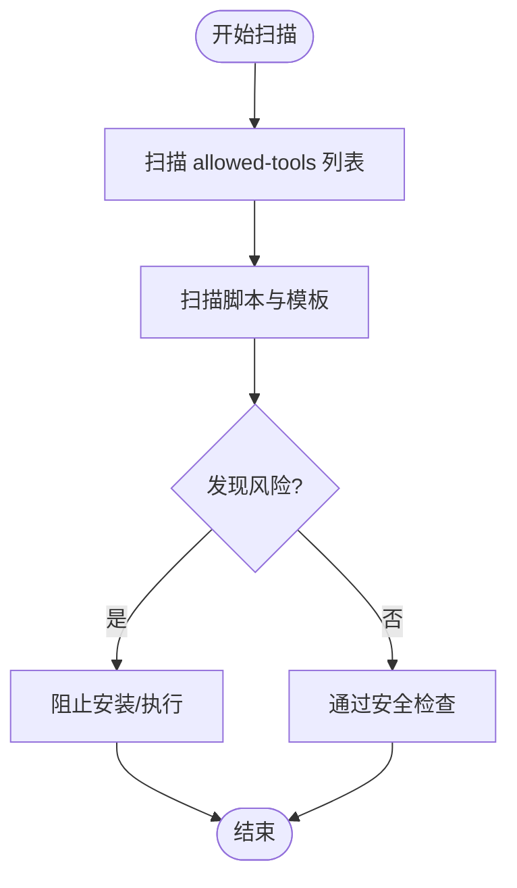
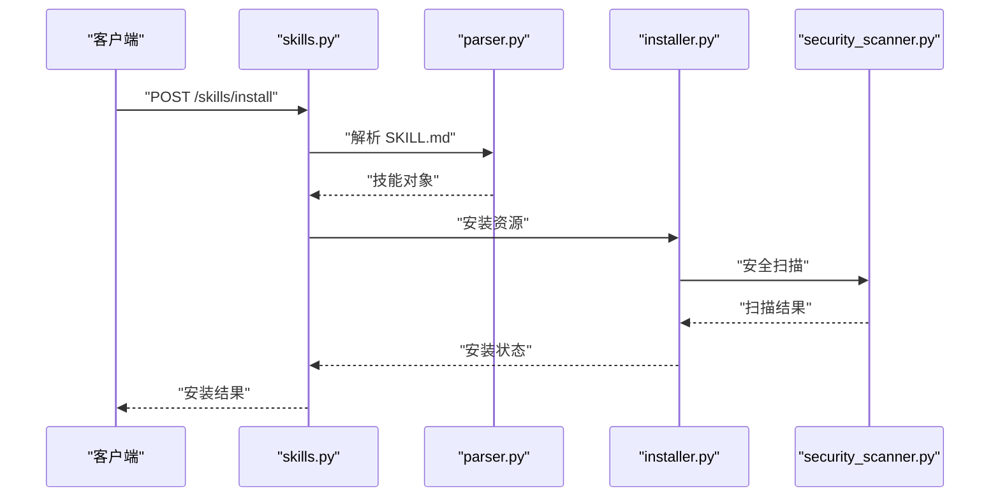
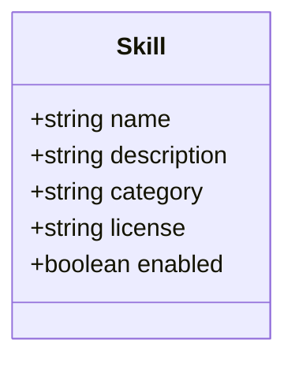
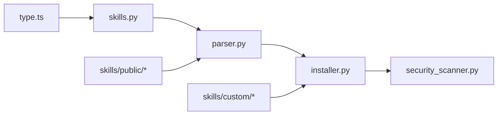

# 自定义技能开发

<cite>
**本文引用的文件**
- [backend/docs/ARCHITECTURE.md](file://backend/docs/ARCHITECTURE.md)
- [backend/packages/harness/deerflow/skills/parser.py](file://backend/packages/harness/deerflow/skills/parser.py)
- [backend/packages/harness/deerflow/skills/installer.py](file://backend/packages/harness/deerflow/skills/installer.py)
- [backend/packages/harness/deerflow/skills/security_scanner.py](file://backend/packages/harness/deerflow/skills/security_scanner.py)
- [backend/app/gateway/routers/skills.py](file://backend/app/gateway/routers/skills.py)
- [frontend/src/core/skills/type.ts](file://frontend/src/core/skills/type.ts)
- [skills/public/bootstrap/SKILL.md](file://skills/public/bootstrap/SKILL.md)
- [skills/public/skill-creator/SKILL.md](file://skills/public/skill-creator/SKILL.md)
- [skills/public/skill-creator/scripts/init_skill.py](file://skills/public/skill-creator/scripts/init_skill.py)
- [skills/public/chart-visualization/SKILL.md](file://skills/public/chart-visualization/SKILL.md)
- [skills/public/github-deep-research/SKILL.md](file://skills/public/github-deep-research/SKILL.md)
- [scripts/check.py](file://scripts/check.py)
- [scripts/docker.sh](file://scripts/docker.sh)
- [scripts/setup-sandbox.sh](file://scripts/setup-sandbox.sh)
- [backend/README.md](file://backend/README.md)
- [backend/pyproject.toml](file://backend/pyproject.toml)
- [backend/langgraph.json](file://backend/langgraph.json)
- [backend/Dockerfile](file://backend/Dockerfile)
- [frontend/README.md](file://frontend/README.md)
- [frontend/package.json](file://frontend/package.json)
- [Makefile](file://Makefile)
- [scripts/build-release.sh](file://scripts/build-release.sh)
- [scripts/deploy.sh](file://scripts/deploy.sh)
- [docs/changelog/code_change_summary/skills.md](file://docs/changelog/code_change_summary/skills.md)
</cite>

## 目录
1. [简介](#简介)
2. [项目结构](#项目结构)
3. [核心组件](#核心组件)
4. [架构总览](#架构总览)
5. [详细组件分析](#详细组件分析)
6. [依赖关系分析](#依赖关系分析)
7. [性能考虑](#性能考虑)
8. [故障排查指南](#故障排查指南)
9. [结论](#结论)
10. [附录](#附录)

## 简介
本文件面向希望在 DeerFlow 平台上开发自定义技能（Skill）的开发者，系统性阐述技能开发框架的核心概念、技能结构规范、API 接口定义与生命周期管理，并提供从项目初始化、代码编写到测试验证的完整流程指导。同时给出技能模板与最佳实践，涵盖代码组织、错误处理与性能优化建议，并说明打包、发布与版本管理的操作步骤及与其他技能的集成方法。

## 项目结构
DeerFlow 的技能体系由“公共技能库”和“自定义技能目录”组成，前端通过类型接口描述技能元信息，后端通过解析器、安装器与安全扫描器实现技能的加载、安装与安全校验；网关路由提供技能相关的 API 入口；示例技能与脚手架工具为新技能开发提供参考与自动化初始化能力。

**图表来源**
- [frontend/src/core/skills/type.ts:1-7](file://frontend/src/core/skills/type.ts#L1-L7)
- [backend/app/gateway/routers/skills.py](file://backend/app/gateway/routers/skills.py)
- [backend/packages/harness/deerflow/skills/parser.py](file://backend/packages/harness/deerflow/skills/parser.py)
- [backend/packages/harness/deerflow/skills/installer.py](file://backend/packages/harness/deerflow/skills/installer.py)
- [backend/packages/harness/deerflow/skills/security_scanner.py](file://backend/packages/harness/deerflow/skills/security_scanner.py)
- [skills/public/bootstrap/SKILL.md](file://skills/public/bootstrap/SKILL.md)
- [skills/public/skill-creator/SKILL.md](file://skills/public/skill-creator/SKILL.md)

**章节来源**
- [backend/docs/ARCHITECTURE.md:305-342](file://backend/docs/ARCHITECTURE.md#L305-L342)

## 核心组件
- 技能结构规范：以 SKILL.md 作为技能元数据与说明文件，采用 YAML 头部声明名称、描述、许可证与允许工具列表等关键字段，正文用于注入系统提示词或使用说明。
- 解析器（Parser）：负责读取 SKILL.md 并提取元数据与内容，构建技能对象供运行时使用。
- 安装器（Installer）：将技能从源位置复制/部署到可执行目录，确保运行环境具备所需资源。
- 安全扫描器（Security Scanner）：对技能进行安全检查，限制危险工具调用与不安全脚本执行。
- 路由（Router）：提供技能查询、启用/禁用、安装卸载等 API。
- 前端类型（Type）：统一技能元数据结构，便于 UI 展示与交互。

**章节来源**
- [backend/docs/ARCHITECTURE.md:327-342](file://backend/docs/ARCHITECTURE.md#L327-L342)
- [frontend/src/core/skills/type.ts:1-7](file://frontend/src/core/skills/type.ts#L1-L7)

## 架构总览
下图展示从用户发起技能请求到技能执行完成的端到端流程，包括前端类型约束、后端路由、解析与安装、安全校验以及技能运行。

**图表来源**
- [frontend/src/core/skills/type.ts:1-7](file://frontend/src/core/skills/type.ts#L1-L7)
- [backend/app/gateway/routers/skills.py](file://backend/app/gateway/routers/skills.py)
- [backend/packages/harness/deerflow/skills/parser.py](file://backend/packages/harness/deerflow/skills/parser.py)
- [backend/packages/harness/deerflow/skills/installer.py](file://backend/packages/harness/deerflow/skills/installer.py)
- [backend/packages/harness/deerflow/skills/security_scanner.py](file://backend/packages/harness/deerflow/skills/security_scanner.py)

## 详细组件分析

### 组件一：技能结构规范与模板
- 规范要点
  - 使用 SKILL.md 作为技能入口文件，YAML 头部包含 name、description、license、allowed-tools 等字段。
  - 正文用于撰写技能说明、使用场景、工作流与示例。
  - 可选 resources 目录（如 scripts、templates、references），用于组织脚本、模板与参考资料。
- 模板与示例
  - 引导技能（bootstrap）提供基础结构与说明，适合作为新技能的起点。
  - 技能脚手架（skill-creator）提供初始化脚本与模板，帮助快速生成符合规范的技能目录与文件。
  - 示例技能（chart-visualization、github-deep-research 等）展示了不同领域的技能组织方式与内容结构。

**图表来源**
- [skills/public/bootstrap/SKILL.md](file://skills/public/bootstrap/SKILL.md)
- [skills/public/skill-creator/SKILL.md](file://skills/public/skill-creator/SKILL.md)
- [skills/public/skill-creator/scripts/init_skill.py:43-70](file://skills/public/skill-creator/scripts/init_skill.py#L43-L70)

**章节来源**
- [backend/docs/ARCHITECTURE.md:327-342](file://backend/docs/ARCHITECTURE.md#L327-L342)
- [skills/public/bootstrap/SKILL.md](file://skills/public/bootstrap/SKILL.md)
- [skills/public/skill-creator/SKILL.md](file://skills/public/skill-creator/SKILL.md)
- [skills/public/skill-creator/scripts/init_skill.py:43-70](file://skills/public/skill-creator/scripts/init_skill.py#L43-L70)

### 组件二：解析器（Parser）
- 职责
  - 读取 SKILL.md，提取 YAML 头部元数据与正文内容。
  - 将元数据映射为内部技能对象，供后续安装与执行阶段使用。
- 关键行为
  - 解析失败时返回明确错误，避免无效技能进入安装流程。
  - 支持多语言与复杂正文结构，保证技能说明可读性与一致性。

**图表来源**
- [backend/packages/harness/deerflow/skills/parser.py](file://backend/packages/harness/deerflow/skills/parser.py)

**章节来源**
- [backend/packages/harness/deerflow/skills/parser.py](file://backend/packages/harness/deerflow/skills/parser.py)

### 组件三：安装器（Installer）
- 职责
  - 将解析后的技能资源复制到可执行目录（如 skills/custom/user-installed）。
  - 确保脚本、模板与依赖文件就绪，支持增量更新与回滚。
- 关键行为
  - 安装前进行权限与路径检查，避免写入异常。
  - 记录安装日志，便于问题定位与审计。

**图表来源**
- [backend/packages/harness/deerflow/skills/installer.py](file://backend/packages/harness/deerflow/skills/installer.py)

**章节来源**
- [backend/packages/harness/deerflow/skills/installer.py](file://backend/packages/harness/deerflow/skills/installer.py)

### 组件四：安全扫描器（Security Scanner）
- 职责
  - 对技能使用的 allowed-tools 进行白名单校验。
  - 扫描脚本与模板中的潜在风险（如危险命令、外部网络访问等）。
- 关键行为
  - 发现违规立即阻断安装与执行。
  - 提供可配置的安全策略与规则集。

**图表来源**
- [backend/packages/harness/deerflow/skills/security_scanner.py](file://backend/packages/harness/deerflow/skills/security_scanner.py)

**章节来源**
- [backend/packages/harness/deerflow/skills/security_scanner.py](file://backend/packages/harness/deerflow/skills/security_scanner.py)

### 组件五：技能路由（Router）
- 职责
  - 提供技能查询、启用/禁用、安装/卸载、更新等 API。
  - 与解析器、安装器、安全扫描器协作，形成完整的技能生命周期管理。
- 关键行为
  - 参数校验与权限控制，防止未授权操作。
  - 返回标准化响应，包含状态码、消息与结果数据。

**图表来源**
- [backend/app/gateway/routers/skills.py](file://backend/app/gateway/routers/skills.py)
- [backend/packages/harness/deerflow/skills/parser.py](file://backend/packages/harness/deerflow/skills/parser.py)
- [backend/packages/harness/deerflow/skills/installer.py](file://backend/packages/harness/deerflow/skills/installer.py)
- [backend/packages/harness/deerflow/skills/security_scanner.py](file://backend/packages/harness/deerflow/skills/security_scanner.py)

**章节来源**
- [backend/app/gateway/routers/skills.py](file://backend/app/gateway/routers/skills.py)

### 组件六：前端类型（Type）
- 职责
  - 定义技能在前端展示与交互所需的最小字段集合：name、description、category、license、enabled。
- 关键行为
  - 与后端返回的技能对象保持一致，避免字段不匹配导致的渲染异常。

**图表来源**
- [frontend/src/core/skills/type.ts:1-7](file://frontend/src/core/skills/type.ts#L1-L7)

**章节来源**
- [frontend/src/core/skills/type.ts:1-7](file://frontend/src/core/skills/type.ts#L1-L7)

## 依赖关系分析
- 组件耦合
  - 路由层依赖解析器与安装器；安装器依赖安全扫描器；前端类型与后端路由/解析器保持契约一致。
- 外部依赖
  - 后端基于 Python 生态与 LangGraph 配置；前端基于 Next.js 与 TypeScript。
- 版本与变更
  - 技能相关变更记录可在技能变更摘要中查阅，便于追踪影响范围。

**图表来源**
- [frontend/src/core/skills/type.ts:1-7](file://frontend/src/core/skills/type.ts#L1-L7)
- [backend/app/gateway/routers/skills.py](file://backend/app/gateway/routers/skills.py)
- [backend/packages/harness/deerflow/skills/parser.py](file://backend/packages/harness/deerflow/skills/parser.py)
- [backend/packages/harness/deerflow/skills/installer.py](file://backend/packages/harness/deerflow/skills/installer.py)
- [backend/packages/harness/deerflow/skills/security_scanner.py](file://backend/packages/harness/deerflow/skills/security_scanner.py)

**章节来源**
- [docs/changelog/code_change_summary/skills.md](file://docs/changelog/code_change_summary/skills.md)

## 性能考虑
- 解析与安装
  - 尽量减少 SKILL.md 正文体积，避免冗长文本影响解析性能。
  - 将大型资源放入 scripts/templates/references 等子目录，按需加载。
- 安全扫描
  - 合理配置 allowed-tools 白名单，避免不必要的扫描开销。
  - 对重复安装的技能进行缓存与去重处理。
- 前端展示
  - 使用分页与懒加载展示技能列表，降低初始渲染压力。
- 运行时
  - 控制并发执行的技能数量，避免资源争用。
  - 对耗时操作采用异步执行与进度反馈机制。

## 故障排查指南
- 常见问题
  - SKILL.md 解析失败：检查 YAML 头部格式与字段完整性。
  - 安装失败：确认目标目录权限与磁盘空间。
  - 安全扫描阻断：核对 allowed-tools 是否在白名单内，修正脚本中的高危操作。
- 工具与脚本
  - 使用检查脚本与沙箱设置脚本辅助本地验证。
  - 使用 Docker 脚本构建与运行后端服务，确保环境一致性。

**章节来源**
- [scripts/check.py](file://scripts/check.py)
- [scripts/setup-sandbox.sh](file://scripts/setup-sandbox.sh)
- [scripts/docker.sh](file://scripts/docker.sh)

## 结论
通过规范化的技能结构、严谨的解析与安装流程、完善的安全扫描机制以及清晰的 API 路由，DeerFlow 为自定义技能开发提供了稳定可靠的基础设施。遵循本文提供的模板与最佳实践，开发者可以高效地完成从初始化、编码到测试与发布的全流程，并确保技能在生产环境中的安全性与稳定性。

## 附录

### 技能开发流程（从零到上线）
- 初始化
  - 使用技能脚手架生成基础目录与文件，参考引导技能与示例技能的组织方式。
- 编写
  - 在 SKILL.md 中完善元数据与正文，合理组织 scripts/templates/references。
  - 使用 allowed-tools 明确技能可调用的工具集。
- 测试
  - 在本地运行后端服务，通过路由接口安装与调用技能，观察输出与日志。
  - 使用检查脚本与沙箱设置脚本进行功能与安全验证。
- 打包与发布
  - 使用构建与部署脚本生成发布产物并部署至目标环境。
  - 如需版本管理，结合变更摘要与标签策略进行迭代跟踪。

**章节来源**
- [skills/public/skill-creator/scripts/init_skill.py:43-70](file://skills/public/skill-creator/scripts/init_skill.py#L43-L70)
- [backend/app/gateway/routers/skills.py](file://backend/app/gateway/routers/skills.py)
- [scripts/build-release.sh](file://scripts/build-release.sh)
- [scripts/deploy.sh](file://scripts/deploy.sh)

### 最佳实践清单
- 代码组织
  - 将可复用逻辑封装为脚本，置于 scripts 目录；将报告模板置于 templates；将参考资料置于 references。
- 错误处理
  - 在 SKILL.md 正文中提供常见问题与排错指引，提升使用者自助解决问题的能力。
- 性能优化
  - 减少 SKILL.md 正文字数，拆分大型资源；合理使用 allowed-tools；避免在技能中执行阻塞操作。
- 安全
  - 严格遵守 allowed-tools 白名单；避免在脚本中直接拼接外部输入；定期更新安全规则。

**章节来源**
- [skills/public/chart-visualization/SKILL.md](file://skills/public/chart-visualization/SKILL.md)
- [skills/public/github-deep-research/SKILL.md](file://skills/public/github-deep-research/SKILL.md)