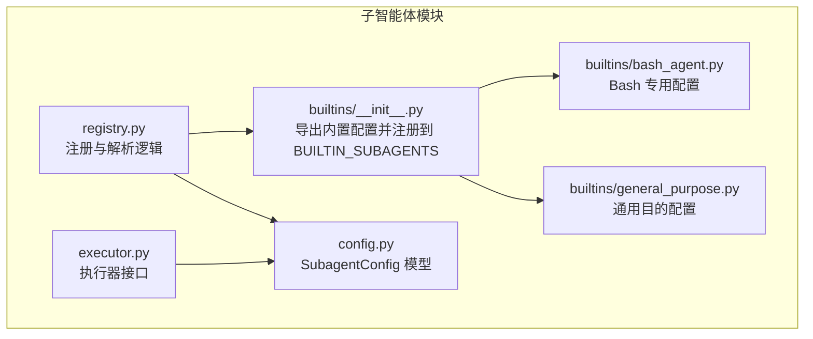
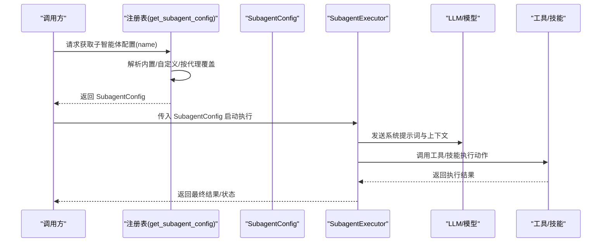
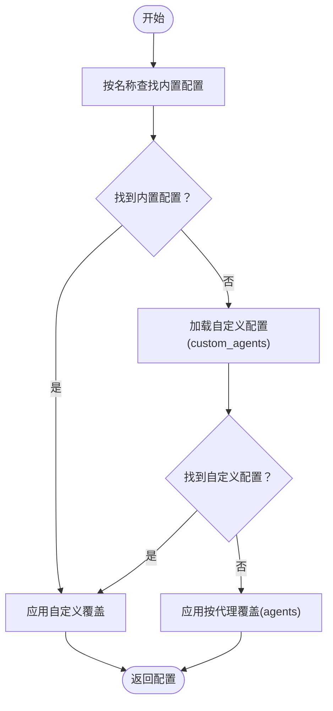
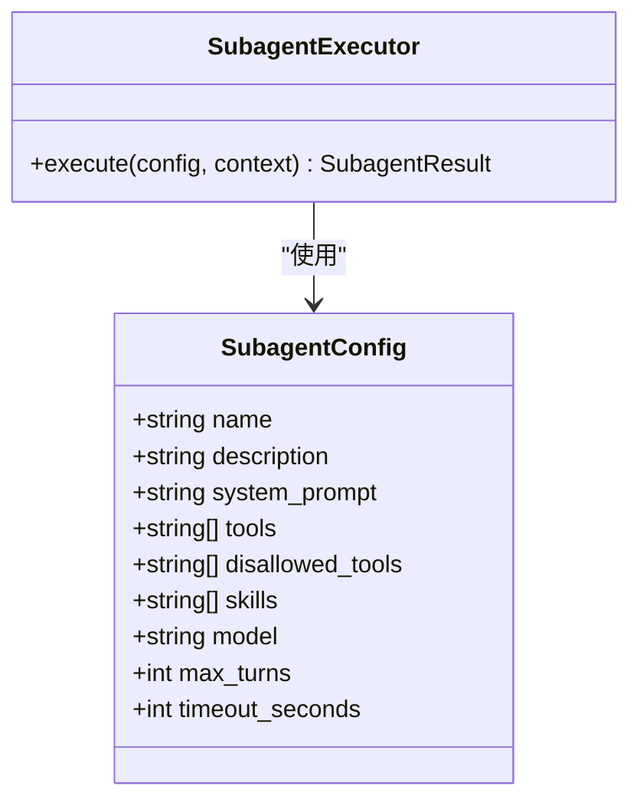
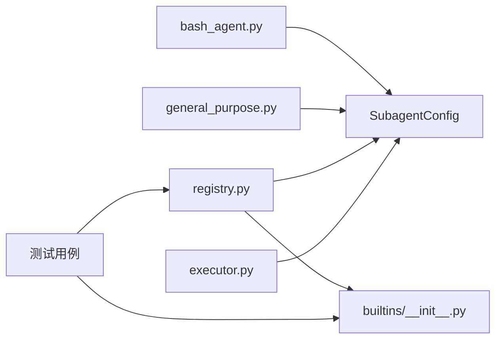

# 内置子智能体

<cite>
**本文引用的文件**
- [backend/packages/harness/deerflow/subagents/builtins/__init__.py](file://backend/packages/harness/deerflow/subagents/builtins/__init__.py)
- [backend/packages/harness/deerflow/subagents/builtins/bash_agent.py](file://backend/packages/harness/deerflow/subagents/builtins/bash_agent.py)
- [backend/packages/harness/deerflow/subagents/builtins/general_purpose.py](file://backend/packages/harness/deerflow/subagents/builtins/general_purpose.py)
- [backend/packages/harness/deerflow/subagents/registry.py](file://backend/packages/harness/deerflow/subagents/registry.py)
- [backend/packages/harness/deerflow/subagents/config.py](file://backend/packages/harness/deerflow/subagents/config.py)
- [backend/packages/harness/deerflow/subagents/executor.py](file://backend/packages/harness/deerflow/subagents/executor.py)
- [backend/tests/test_subagent_timeout_config.py](file://backend/tests/test_subagent_timeout_config.py)
- [backend/tests/test_subagent_skills_config.py](file://backend/tests/test_subagent_skills_config.py)
- [backend/packages/harness/deerflow/sandbox/tools.py](file://backend/packages/harness/deerflow/sandbox/tools.py)
</cite>

## 目录
1. [简介](#简介)
2. [项目结构](#项目结构)
3. [核心组件](#核心组件)
4. [架构总览](#架构总览)
5. [详细组件分析](#详细组件分析)
6. [依赖关系分析](#依赖关系分析)
7. [性能考虑](#性能考虑)
8. [故障排查指南](#故障排查指南)
9. [结论](#结论)
10. [附录](#附录)

## 简介
本文件面向 DeerFlow 的内置子智能体（Subagent）能力，系统性介绍两类基础子智能体：通用目的智能体与 Bash 执行智能体。内容涵盖设计目标、功能特性、适用场景、配置项说明、最佳实践、使用示例与扩展建议，并通过图示展示其在系统中的交互关系与执行流程。

## 项目结构
内置子智能体位于后端 harness 包中，采用“内置配置 + 注册表 + 执行器”的分层组织方式：
- builtins：内置子智能体配置集合，包含通用目的与 Bash 执行两类配置
- registry：子智能体注册与检索逻辑，支持内置、自定义与按代理覆盖
- config/executor：子智能体配置模型与执行器接口
- tests：对内置子智能体行为、覆盖规则与可用名称等进行测试验证

图表来源
- [backend/packages/harness/deerflow/subagents/builtins/__init__.py:1-15](file://backend/packages/harness/deerflow/subagents/builtins/__init__.py#L1-L15)
- [backend/packages/harness/deerflow/subagents/builtins/bash_agent.py:1-34](file://backend/packages/harness/deerflow/subagents/builtins/bash_agent.py#L1-L34)
- [backend/packages/harness/deerflow/subagents/builtins/general_purpose.py:1-34](file://backend/packages/harness/deerflow/subagents/builtins/general_purpose.py#L1-L34)
- [backend/packages/harness/deerflow/subagents/registry.py:50-70](file://backend/packages/harness/deerflow/subagents/registry.py#L50-L70)
- [backend/packages/harness/deerflow/subagents/config.py](file://backend/packages/harness/deerflow/subagents/config.py)
- [backend/packages/harness/deerflow/subagents/executor.py](file://backend/packages/harness/deerflow/subagents/executor.py)

章节来源
- [backend/packages/harness/deerflow/subagents/builtins/__init__.py:1-15](file://backend/packages/harness/deerflow/subagents/builtins/__init__.py#L1-L15)
- [backend/packages/harness/deerflow/subagents/registry.py:50-70](file://backend/packages/harness/deerflow/subagents/registry.py#L50-L70)

## 核心组件
- 内置子智能体注册表：集中管理内置子智能体名称与配置映射，便于统一检索与覆盖
- 子智能体配置模型：描述子智能体的名称、描述、系统提示词、工具集、技能集、模型、最大轮次、超时时间等
- 子智能体执行器：负责按配置调度与运行子智能体，产出结果或异常
- 注册表解析器：按优先级解析配置（内置 → 自定义 → 按代理覆盖），确保可配置性与一致性

章节来源
- [backend/packages/harness/deerflow/subagents/builtins/__init__.py:11-15](file://backend/packages/harness/deerflow/subagents/builtins/__init__.py#L11-L15)
- [backend/packages/harness/deerflow/subagents/config.py](file://backend/packages/harness/deerflow/subagents/config.py)
- [backend/packages/harness/deerflow/subagents/executor.py](file://backend/packages/harness/deerflow/subagents/executor.py)
- [backend/packages/harness/deerflow/subagents/registry.py:50-70](file://backend/packages/harness/deerflow/subagents/registry.py#L50-L70)

## 架构总览
下图展示了从请求到执行的典型流程：调用方通过注册表获取子智能体配置，随后由执行器根据配置驱动 LLM 与工具/技能完成任务。

图表来源
- [backend/packages/harness/deerflow/subagents/registry.py:50-70](file://backend/packages/harness/deerflow/subagents/registry.py#L50-L70)
- [backend/packages/harness/deerflow/subagents/executor.py](file://backend/packages/harness/deerflow/subagents/executor.py)
- [backend/packages/harness/deerflow/subagents/config.py](file://backend/packages/harness/deerflow/subagents/config.py)

## 详细组件分析

### 通用目的子智能体
- 设计目标：面向复杂、多步骤且需要探索与行动结合的任务，强调自主决策与结果导向
- 功能特性：
  - 明确的输出格式要求，便于结构化汇报
  - 强调一次性聚焦完成委托任务，避免反复澄清
  - 支持工具与技能组合，提升跨域任务处理能力
- 适用场景：
  - 需要综合分析与多步操作的复杂任务
  - 对结果质量与可追溯性有较高要求的场景
- 最佳实践：
  - 将复杂任务拆分为明确的子步骤，减少单次上下文压力
  - 使用工具与技能前先进行推理与计划
  - 结合超时与最大轮次限制，避免长时间占用资源
- 配置要点：
  - 名称：general-purpose
  - 描述与系统提示词：见文件
  - 可选覆盖：模型、最大轮次、超时时间、工具/技能列表

章节来源
- [backend/packages/harness/deerflow/subagents/builtins/general_purpose.py:1-34](file://backend/packages/harness/deerflow/subagents/builtins/general_purpose.py#L1-L34)
- [backend/tests/test_subagent_timeout_config.py:398-425](file://backend/tests/test_subagent_timeout_config.py#L398-L425)

### Bash 执行子智能体
- 设计目标：专门用于在隔离上下文中执行 Bash 命令，适合构建、测试、部署等终端操作
- 功能特性：
  - 支持串行与并行命令执行策略
  - 输出格式标准化，包含执行摘要、结果与错误信息
  - 路径安全策略：默认工作区相对路径优先，必要时使用绝对路径
  - 对破坏性操作保持谨慎
- 适用场景：
  - 连续的 Bash 命令序列（如 git、npm、docker）
  - 构建、测试、部署流水线中的阶段性任务
  - 需要独立上下文避免污染主会话的操作
- 最佳实践：
  - 复杂命令链应分步执行并检查中间状态
  - 对外部挂载目录使用绝对路径，避免相对路径歧义
  - 对高风险命令（删除、覆盖）进行二次确认
- 安全与路径校验：
  - 工具层对命令关键字、路径参数与工作目录变更进行严格校验
  - 支持受限路径白名单与命令包装器校验
- 配置要点：
  - 名称：bash
  - 描述与系统提示词：见文件
  - 可选覆盖：模型、最大轮次、超时时间、工具/技能列表

章节来源
- [backend/packages/harness/deerflow/subagents/builtins/bash_agent.py:1-34](file://backend/packages/harness/deerflow/subagents/builtins/bash_agent.py#L1-L34)
- [backend/packages/harness/deerflow/sandbox/tools.py:888-922](file://backend/packages/harness/deerflow/sandbox/tools.py#L888-L922)
- [backend/tests/test_subagent_timeout_config.py:398-425](file://backend/tests/test_subagent_timeout_config.py#L398-L425)

### 子智能体注册与解析
- 解析顺序：
  1) 内置子智能体（general-purpose、bash）
  2) 自定义子智能体（来自配置文件 custom_agents）
  3) 按代理覆盖（agents 下的字段覆盖）
- 关键行为：
  - 当自定义名称与内置冲突时，内置会被忽略，保证用户自定义优先
  - 覆盖仅影响指定字段，未覆盖字段保留内置默认值
  - 可列出所有可用名称，包含内置与自定义

图表来源
- [backend/packages/harness/deerflow/subagents/registry.py:50-70](file://backend/packages/harness/deerflow/subagents/registry.py#L50-L70)
- [backend/tests/test_subagent_skills_config.py:505-537](file://backend/tests/test_subagent_skills_config.py#L505-L537)

章节来源
- [backend/packages/harness/deerflow/subagents/registry.py:50-70](file://backend/packages/harness/deerflow/subagents/registry.py#L50-L70)
- [backend/tests/test_subagent_skills_config.py:505-537](file://backend/tests/test_subagent_skills_config.py#L505-L537)

### 子智能体类图

图表来源
- [backend/packages/harness/deerflow/subagents/config.py](file://backend/packages/harness/deerflow/subagents/config.py)
- [backend/packages/harness/deerflow/subagents/executor.py](file://backend/packages/harness/deerflow/subagents/executor.py)

## 依赖关系分析
- 内置配置依赖于 SubagentConfig 模型
- 注册表依赖内置配置与配置文件（custom_agents、agents）进行解析
- 执行器依赖配置模型进行任务调度
- 测试覆盖了注册表可用名称、覆盖规则与模型字段保留等行为

图表来源
- [backend/packages/harness/deerflow/subagents/builtins/bash_agent.py:1-34](file://backend/packages/harness/deerflow/subagents/builtins/bash_agent.py#L1-L34)
- [backend/packages/harness/deerflow/subagents/builtins/general_purpose.py:1-34](file://backend/packages/harness/deerflow/subagents/builtins/general_purpose.py#L1-L34)
- [backend/packages/harness/deerflow/subagents/builtins/__init__.py:1-15](file://backend/packages/harness/deerflow/subagents/builtins/__init__.py#L1-L15)
- [backend/packages/harness/deerflow/subagents/registry.py:50-70](file://backend/packages/harness/deerflow/subagents/registry.py#L50-L70)
- [backend/packages/harness/deerflow/subagents/executor.py](file://backend/packages/harness/deerflow/subagents/executor.py)
- [backend/tests/test_subagent_timeout_config.py:398-425](file://backend/tests/test_subagent_timeout_config.py#L398-L425)
- [backend/tests/test_subagent_skills_config.py:505-537](file://backend/tests/test_subagent_skills_config.py#L505-L537)

章节来源
- [backend/packages/harness/deerflow/subagents/builtins/__init__.py:1-15](file://backend/packages/harness/deerflow/subagents/builtins/__init__.py#L1-L15)
- [backend/packages/harness/deerflow/subagents/registry.py:50-70](file://backend/packages/harness/deerflow/subagents/registry.py#L50-L70)
- [backend/tests/test_subagent_timeout_config.py:398-425](file://backend/tests/test_subagent_timeout_config.py#L398-L425)
- [backend/tests/test_subagent_skills_config.py:505-537](file://backend/tests/test_subagent_skills_config.py#L505-L537)

## 性能考虑
- 超时与最大轮次控制：通过超时与最大轮次限制避免长时间占用资源，建议针对 Bash 执行设置更严格的超时阈值
- 并行与串行策略：Bash 子智能体支持并行执行独立命令，但需注意资源竞争与输出合并
- 上下文管理：通用目的子智能体适合复杂任务，建议拆分步骤以降低单次上下文负担
- 工具与技能开销：合理选择工具与技能，避免不必要的外部调用与 IO

## 故障排查指南
- 子智能体不可用或名称冲突
  - 检查注册表是否正确列出内置与自定义名称
  - 若自定义名称与内置冲突，内置将被忽略，需调整自定义名称
- 覆盖不生效或字段丢失
  - 确认覆盖仅影响指定字段，其他字段应保留内置默认值
  - 检查 agents 下的覆盖层级是否正确
- Bash 命令执行失败
  - 检查路径与工作目录设置，必要时使用绝对路径
  - 确认命令关键字与路径参数未触发安全拦截
- 模型覆盖与继承
  - 应用模型覆盖时，其他字段（如超时、最大轮次）应保持不变

章节来源
- [backend/tests/test_subagent_skills_config.py:505-537](file://backend/tests/test_subagent_skills_config.py#L505-L537)
- [backend/tests/test_subagent_timeout_config.py:398-425](file://backend/tests/test_subagent_timeout_config.py#L398-L425)
- [backend/packages/harness/deerflow/sandbox/tools.py:888-922](file://backend/packages/harness/deerflow/sandbox/tools.py#L888-L922)

## 结论
内置子智能体提供了通用目的与 Bash 执行两大基础能力，配合注册表与可覆盖配置，能够灵活适配多种任务类型。通过合理的超时、轮次与工具/技能选择，可在保证安全性的同时提升执行效率。建议在实际使用中结合任务特征选择合适子智能体，并通过配置覆盖实现定制化增强。

## 附录

### 使用示例（概念性说明）
- 通用目的子智能体
  - 场景：撰写技术报告并生成图表
  - 步骤：规划 → 数据收集 → 分析 → 生成 → 汇报
  - 建议：启用相关工具与技能，设置合理超时与最大轮次
- Bash 执行子智能体
  - 场景：拉取代码、安装依赖、运行测试、打包发布
  - 步骤：检出代码 → 安装依赖 → 单元测试 → 集成测试 → 构建产物
  - 建议：命令串行执行并逐段验证，必要时并行执行独立任务

### 扩展与定制建议
- 新增自定义子智能体：在配置文件中添加 custom_agents 条目，定义描述、系统提示词与工具/技能
- 按代理覆盖：在 agents 下为特定子智能体设置模型、超时与最大轮次
- 安全加固：结合沙箱与路径校验策略，限制 Bash 命令与路径访问范围