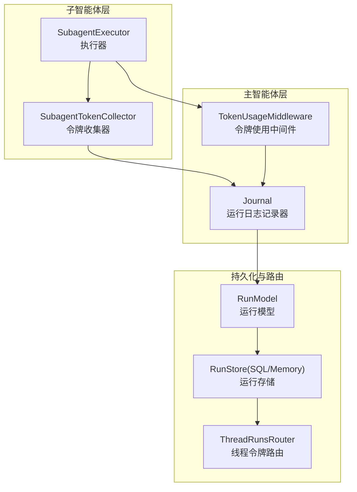
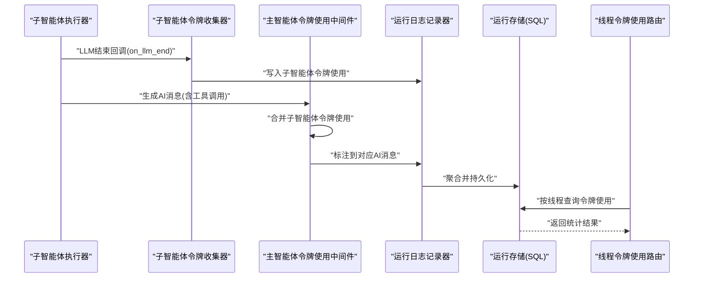
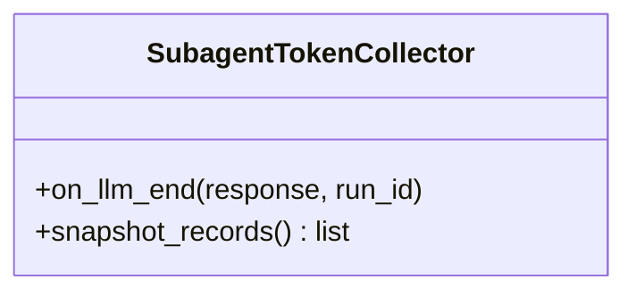
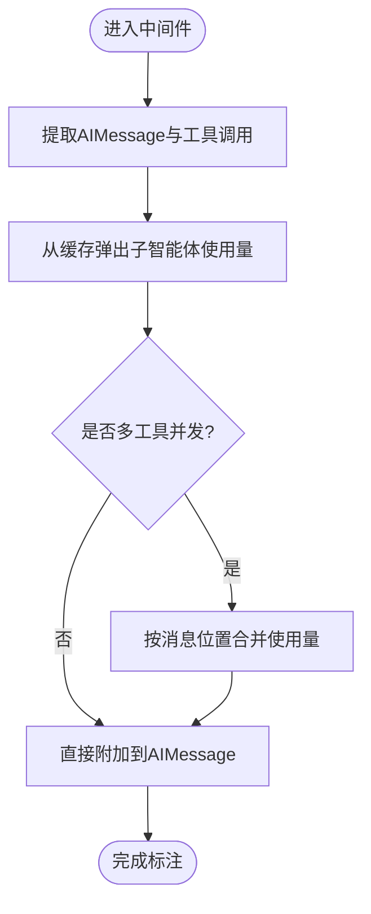
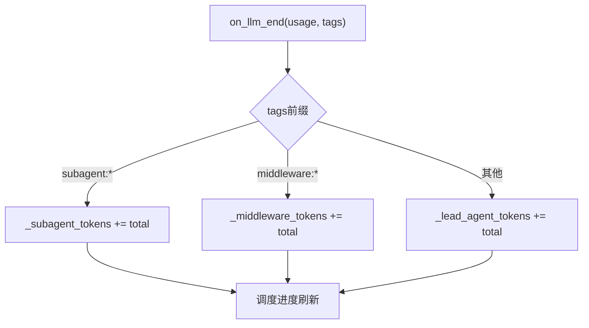
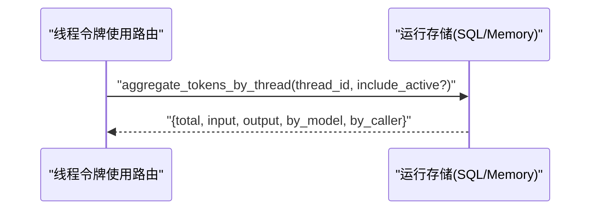
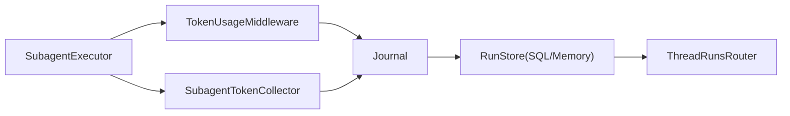

# 子智能体令牌收集

<cite>
**本文引用的文件**
- [token_collector.py](file://backend/packages/harness/deerflow/subagents/token_collector.py)
- [token_usage_middleware.py](file://backend/packages/harness/deerflow/agents/middlewares/token_usage_middleware.py)
- [journal.py](file://backend/packages/harness/deerflow/runtime/journal.py)
- [executor.py](file://backend/packages/harness/deerflow/subagents/executor.py)
- [token_usage_config.py](file://backend/packages/harness/deerflow/config/token_usage_config.py)
- [thread_runs.py](file://backend/app/gateway/routers/thread_runs.py)
- [model.py](file://backend/packages/harness/deerflow/persistence/run/model.py)
- [sql.py](file://backend/packages/harness/deerflow/persistence/run/sql.py)
- [base.py](file://backend/packages/harness/deerflow/runtime/runs/store/base.py)
- [memory.py](file://backend/packages/harness/deerflow/runtime/runs/store/memory.py)
- [test_subagent_token_collector.py](file://backend/tests/test_subagent_token_collector.py)
- [test_token_usage_middleware.py](file://backend/tests/test_token_usage_middleware.py)
- [test_thread_token_usage.py](file://backend/tests/test_thread_token_usage.py)
- [test_run_journal.py](file://backend/tests/test_run_journal.py)
</cite>

## 目录
1. [简介](#简介)
2. [项目结构](#项目结构)
3. [核心组件](#核心组件)
4. [架构总览](#架构总览)
5. [详细组件分析](#详细组件分析)
6. [依赖关系分析](#依赖关系分析)
7. [性能考量](#性能考量)
8. [故障排查指南](#故障排查指南)
9. [结论](#结论)
10. [附录](#附录)

## 简介
本文件聚焦 DeerFlow 子智能体令牌收集系统，系统性阐述令牌收集机制的设计原理、统计指标定义与数据收集策略；说明如何监控子智能体的资源使用情况（CPU、内存、网络、存储等关键指标）及实现精确的成本核算与性能分析；并提供配置示例与优化建议，帮助读者启用与自定义收集策略，利用收集数据进行性能优化与成本控制。

## 项目结构
围绕“子智能体令牌收集”，后端代码主要分布在以下模块：
- 子智能体执行与收集：子智能体执行器在调用 LLM 后通过令牌收集器记录使用量，并写入运行记录。
- 主智能体中间件：令牌使用中间件负责在消息流转中聚合与标注子智能体使用的令牌数。
- 运行时日志与持久化：运行日志记录器汇总各类调用方的令牌使用，运行存储层负责聚合与查询。
- 路由与对外接口：提供按线程维度的令牌使用聚合查询接口。

图表来源
- [executor.py:476-483](file://backend/packages/harness/deerflow/subagents/executor.py#L476-L483)
- [token_collector.py](file://backend/packages/harness/deerflow/subagents/token_collector.py)
- [token_usage_middleware.py:274-308](file://backend/packages/harness/deerflow/agents/middlewares/token_usage_middleware.py#L274-L308)
- [journal.py:464-472](file://backend/packages/harness/deerflow/runtime/journal.py#L464-L472)
- [model.py](file://backend/packages/harness/deerflow/persistence/run/model.py#L39)
- [sql.py:230-317](file://backend/packages/harness/deerflow/persistence/run/sql.py#L230-L317)
- [thread_runs.py:73-126](file://backend/app/gateway/routers/thread_runs.py#L73-L126)

章节来源
- [executor.py:476-483](file://backend/packages/harness/deerflow/subagents/executor.py#L476-L483)
- [token_collector.py](file://backend/packages/harness/deerflow/subagents/token_collector.py)
- [token_usage_middleware.py:274-308](file://backend/packages/harness/deerflow/agents/middlewares/token_usage_middleware.py#L274-L308)
- [journal.py:464-472](file://backend/packages/harness/deerflow/runtime/journal.py#L464-L472)
- [model.py](file://backend/packages/harness/deerflow/persistence/run/model.py#L39)
- [sql.py:230-317](file://backend/packages/harness/deerflow/persistence/run/sql.py#L230-L317)
- [thread_runs.py:73-126](file://backend/app/gateway/routers/thread_runs.py#L73-L126)

## 核心组件
- 子智能体令牌收集器（SubagentTokenCollector）
  - 在子智能体每次 LLM 结束回调中记录输入/输出/总计令牌数，并以“子智能体”调用方身份写入。
  - 支持总计令牌为零时回退为输入+输出的逻辑，保证统计完整性。
- 主智能体令牌使用中间件（TokenUsageMiddleware）
  - 将子智能体的令牌使用标注到触发它的 AI 消息上，支持多工具并发场景下的合并。
- 运行日志记录器（Journal）
  - 按调用方类型（主智能体、子智能体、中间件）分别累计令牌数，并在进度刷新时落盘。
- 运行存储与聚合（RunStore/SQL）
  - 提供按线程维度的令牌使用聚合查询，包含总计、输入、输出、按模型与按调用方的细分。
- 线程令牌使用路由（ThreadRunsRouter）
  - 对外暴露按线程查询令牌使用详情的 API，支持包含活跃运行的选项。

章节来源
- [token_collector.py](file://backend/packages/harness/deerflow/subagents/token_collector.py)
- [token_usage_middleware.py:274-308](file://backend/packages/harness/deerflow/agents/middlewares/token_usage_middleware.py#L274-L308)
- [journal.py:464-472](file://backend/packages/harness/deerflow/runtime/journal.py#L464-L472)
- [sql.py:230-317](file://backend/packages/harness/deerflow/persistence/run/sql.py#L230-L317)
- [thread_runs.py:73-126](file://backend/app/gateway/routers/thread_runs.py#L73-L126)

## 架构总览
下图展示了从子智能体执行到令牌统计与查询的整体流程：

图表来源
- [executor.py:476-483](file://backend/packages/harness/deerflow/subagents/executor.py#L476-L483)
- [token_collector.py](file://backend/packages/harness/deerflow/subagents/token_collector.py)
- [token_usage_middleware.py:274-308](file://backend/packages/harness/deerflow/agents/middlewares/token_usage_middleware.py#L274-L308)
- [journal.py:464-472](file://backend/packages/harness/deerflow/runtime/journal.py#L464-L472)
- [sql.py:230-317](file://backend/packages/harness/deerflow/persistence/run/sql.py#L230-L317)
- [thread_runs.py:73-126](file://backend/app/gateway/routers/thread_runs.py#L73-L126)

## 详细组件分析

### 子智能体令牌收集器（SubagentTokenCollector）
- 设计要点
  - 在 LLM 结束回调中提取输入/输出/总计令牌数，若总计为 0 则回退为输入+输出，确保统计连续性。
  - 记录来源运行 ID，便于后续审计与追踪。
- 数据结构与复杂度
  - 内部以列表形式暂存记录，快照返回副本，避免外部修改影响内部状态。
  - 时间复杂度 O(n)，空间复杂度 O(n)，其中 n 为已记录的 LLM 调用次数。
- 错误处理
  - 忽略空生成项，延迟记录后续出现的使用量，保证最终一致性。
- 性能影响
  - 回调中仅做轻量级记录与计算，对整体吞吐影响较小。

图表来源
- [token_collector.py](file://backend/packages/harness/deerflow/subagents/token_collector.py)

章节来源
- [token_collector.py](file://backend/packages/harness/deerflow/subagents/token_collector.py)
- [test_subagent_token_collector.py:41-59](file://backend/tests/test_subagent_token_collector.py#L41-L59)
- [test_subagent_token_collector.py:91-105](file://backend/tests/test_subagent_token_collector.py#L91-L105)

### 主智能体令牌使用中间件（TokenUsageMiddleware）
- 设计要点
  - 将子智能体的令牌使用标注到触发它的 AI 消息上，支持多工具并发场景下的合并。
  - 若 AI 消息 ID 缺失，仍能基于消息位置合并，保证统计准确性。
- 数据流
  - 从任务工具缓存中弹出子智能体使用量，累加到对应的 AIMessage 上。
- 复杂度与稳定性
  - 基于消息索引与映射表进行合并，时间复杂度近似 O(m)，m 为工具调用数量。
  - 单元测试覆盖了缺失消息 ID 的合并场景，验证鲁棒性。

图表来源
- [token_usage_middleware.py:274-308](file://backend/packages/harness/deerflow/agents/middlewares/token_usage_middleware.py#L274-L308)
- [test_token_usage_middleware.py:237-270](file://backend/tests/test_token_usage_middleware.py#L237-L270)

章节来源
- [token_usage_middleware.py:274-308](file://backend/packages/harness/deerflow/agents/middlewares/token_usage_middleware.py#L274-L308)
- [test_token_usage_middleware.py:237-270](file://backend/tests/test_token_usage_middleware.py#L237-L270)

### 运行日志记录器（Journal）与调用方分桶
- 设计要点
  - 按调用方类型（子智能体、中间件、主智能体）分别累计令牌数。
  - 在进度刷新时触发持久化，减少频繁 IO。
- 细分维度
  - 支持按模型与按调用方的细分统计，便于成本归因与优化。
- 测试验证
  - 单元测试覆盖不同标签产生的事件类型区分，以及各调用方桶的正确累加。

图表来源
- [journal.py:464-472](file://backend/packages/harness/deerflow/runtime/journal.py#L464-L472)
- [test_run_journal.py:479-504](file://backend/tests/test_run_journal.py#L479-L504)

章节来源
- [journal.py:464-472](file://backend/packages/harness/deerflow/runtime/journal.py#L464-L472)
- [test_run_journal.py:479-504](file://backend/tests/test_run_journal.py#L479-L504)

### 运行存储与线程聚合
- 聚合能力
  - 提供按线程维度的令牌使用聚合，包含总计、输入、输出、按模型与按调用方的细分。
  - 支持包含活跃运行的查询选项，满足实时分析需求。
- 接口行为
  - 返回稳定形状的 JSON，便于前端与下游系统消费。
- 存储实现
  - SQL 层提供 SUM 聚合与 COALESCE 默认值处理，内存存储层提供同等语义的聚合逻辑。

图表来源
- [thread_runs.py:73-126](file://backend/app/gateway/routers/thread_runs.py#L73-L126)
- [sql.py:230-317](file://backend/packages/harness/deerflow/persistence/run/sql.py#L230-L317)
- [memory.py](file://backend/packages/harness/deerflow/runtime/runs/store/memory.py#L124)
- [base.py:93-115](file://backend/packages/harness/deerflow/runtime/runs/store/base.py#L93-L115)
- [test_thread_token_usage.py:20-55](file://backend/tests/test_thread_token_usage.py#L20-L55)
- [test_thread_token_usage.py:58-82](file://backend/tests/test_thread_token_usage.py#L58-L82)

章节来源
- [thread_runs.py:73-126](file://backend/app/gateway/routers/thread_runs.py#L73-L126)
- [sql.py:230-317](file://backend/packages/harness/deerflow/persistence/run/sql.py#L230-L317)
- [memory.py](file://backend/packages/harness/deerflow/runtime/runs/store/memory.py#L124)
- [base.py:93-115](file://backend/packages/harness/deerflow/runtime/runs/store/base.py#L93-L115)
- [test_thread_token_usage.py:20-55](file://backend/tests/test_thread_token_usage.py#L20-L55)
- [test_thread_token_usage.py:58-82](file://backend/tests/test_thread_token_usage.py#L58-L82)

## 依赖关系分析
- 组件耦合
  - 执行器依赖收集器；中间件依赖运行日志记录器；路由依赖运行存储。
- 关键依赖链
  - 子智能体执行 → 令牌收集 → 日志记录 → 存储 → 路由查询。
- 配置与开关
  - 令牌使用跟踪可通过配置开关启用或禁用，便于在不同环境灵活控制。

图表来源
- [executor.py:476-483](file://backend/packages/harness/deerflow/subagents/executor.py#L476-L483)
- [token_collector.py](file://backend/packages/harness/deerflow/subagents/token_collector.py)
- [token_usage_middleware.py:274-308](file://backend/packages/harness/deerflow/agents/middlewares/token_usage_middleware.py#L274-L308)
- [journal.py:464-472](file://backend/packages/harness/deerflow/runtime/journal.py#L464-L472)
- [sql.py:230-317](file://backend/packages/harness/deerflow/persistence/run/sql.py#L230-L317)
- [thread_runs.py:73-126](file://backend/app/gateway/routers/thread_runs.py#L73-L126)

章节来源
- [executor.py:476-483](file://backend/packages/harness/deerflow/subagents/executor.py#L476-L483)
- [token_collector.py](file://backend/packages/harness/deerflow/subagents/token_collector.py)
- [token_usage_middleware.py:274-308](file://backend/packages/harness/deerflow/agents/middlewares/token_usage_middleware.py#L274-L308)
- [journal.py:464-472](file://backend/packages/harness/deerflow/runtime/journal.py#L464-L472)
- [sql.py:230-317](file://backend/packages/harness/deerflow/persistence/run/sql.py#L230-L317)
- [thread_runs.py:73-126](file://backend/app/gateway/routers/thread_runs.py#L73-L126)

## 性能考量
- 回调开销最小化
  - 收集器与中间件均在回调中执行轻量操作，避免阻塞主流程。
- 聚合与持久化分离
  - 日志记录器负责增量聚合，存储层统一进行 SUM 聚合，降低单点压力。
- 实时性与一致性
  - 支持包含活跃运行的聚合查询，兼顾实时分析与最终一致性。
- 成本控制建议
  - 通过按调用方与按模型的细分，识别高消耗子智能体与模型，优化调度与预算分配。

## 故障排查指南
- 常见问题
  - 子智能体令牌未计入：检查执行器是否正确创建收集器并在 LLM 结束回调中调用。
  - 中间件标注缺失：确认 AI 消息是否携带工具调用 ID，或在缺失时是否按消息位置合并。
  - 聚合结果为空：确认日志记录器是否被刷新，以及存储层是否正确持久化。
- 定位手段
  - 使用单元测试中的断言点与参数，复现问题场景。
  - 检查路由查询参数（是否包含活跃运行）与返回结构。
- 参考测试
  - 子智能体收集器：记录、回退、延迟记录与快照隔离。
  - 中间件合并：多工具并发与消息 ID 缺失场景。
  - 线程聚合：稳定形状返回与包含活跃运行的行为。

章节来源
- [test_subagent_token_collector.py:41-59](file://backend/tests/test_subagent_token_collector.py#L41-L59)
- [test_subagent_token_collector.py:91-105](file://backend/tests/test_subagent_token_collector.py#L91-L105)
- [test_token_usage_middleware.py:237-270](file://backend/tests/test_token_usage_middleware.py#L237-L270)
- [test_thread_token_usage.py:20-55](file://backend/tests/test_thread_token_usage.py#L20-L55)
- [test_thread_token_usage.py:58-82](file://backend/tests/test_thread_token_usage.py#L58-L82)

## 结论
子智能体令牌收集系统通过“执行器收集 + 中间件标注 + 日志聚合 + 存储查询”的闭环，实现了对子智能体资源使用情况的可观测与可计量。结合按调用方与按模型的细分统计，系统能够支撑成本核算与性能优化，同时具备良好的扩展性与稳定性。

## 附录

### 统计指标定义
- 总计令牌（total_tokens）
  - 线程内所有运行的总计令牌之和。
- 输入令牌（total_input_tokens）
  - 线程内所有运行的输入令牌之和。
- 输出令牌（total_output_tokens）
  - 线程内所有运行的输出令牌之和。
- 运行次数（total_runs）
  - 线程内已完成运行的数量。
- 按模型细分（by_model）
  - 以模型为维度的令牌使用与运行次数统计。
- 按调用方细分（by_caller）
  - 以调用方（主智能体、子智能体、中间件）为维度的令牌使用统计。

章节来源
- [test_thread_token_usage.py:20-55](file://backend/tests/test_thread_token_usage.py#L20-L55)
- [test_thread_token_usage.py:58-82](file://backend/tests/test_thread_token_usage.py#L58-L82)

### 配置示例与启用方式
- 开关配置
  - 令牌使用跟踪中间件可通过配置开关启用或禁用，便于在不同环境灵活控制。
- 启用步骤
  - 在应用启动时加载配置，确保中间件与收集器生效。
  - 在子智能体执行器中创建收集器实例，并在 LLM 结束回调中记录使用量。
- 自定义策略
  - 可根据业务需要调整按调用方与按模型的统计粒度，或增加新的细分维度。
  - 可通过路由查询参数选择是否包含活跃运行，平衡实时性与一致性。

章节来源
- [token_usage_config.py](file://backend/packages/harness/deerflow/config/token_usage_config.py#L6)
- [executor.py:476-483](file://backend/packages/harness/deerflow/subagents/executor.py#L476-L483)
- [thread_runs.py:73-126](file://backend/app/gateway/routers/thread_runs.py#L73-L126)

### 数据收集策略与成本核算
- 数据收集策略
  - 在子智能体 LLM 结束回调中收集令牌使用，避免遗漏。
  - 在主智能体中间件中将子智能体使用标注到触发消息，确保溯源清晰。
  - 通过日志记录器按调用方类型分桶累计，支持后续聚合与查询。
- 成本核算
  - 依据令牌使用与模型单价计算成本，结合按调用方与按模型的细分进行归因。
  - 通过线程维度的聚合结果，评估任务链路的整体成本与效率。

章节来源
- [token_collector.py](file://backend/packages/harness/deerflow/subagents/token_collector.py)
- [token_usage_middleware.py:274-308](file://backend/packages/harness/deerflow/agents/middlewares/token_usage_middleware.py#L274-L308)
- [journal.py:464-472](file://backend/packages/harness/deerflow/runtime/journal.py#L464-L472)
- [sql.py:230-317](file://backend/packages/harness/deerflow/persistence/run/sql.py#L230-L317)