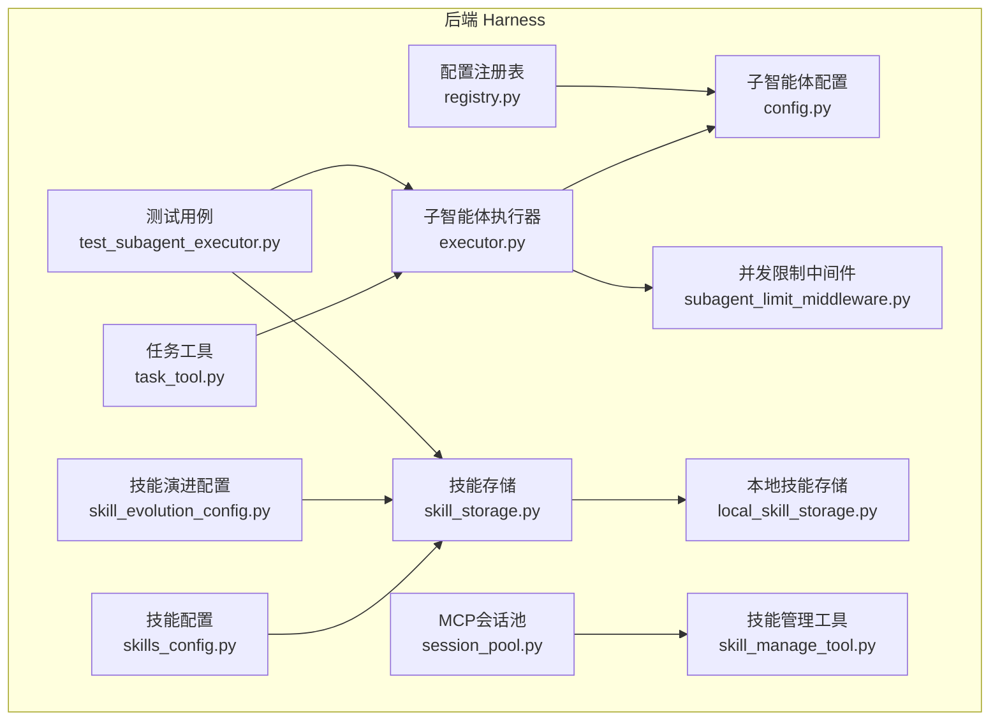
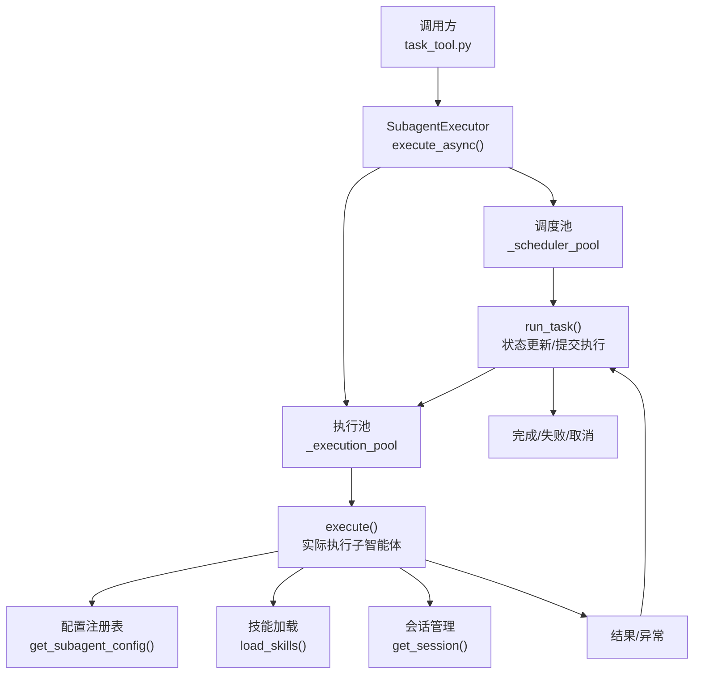
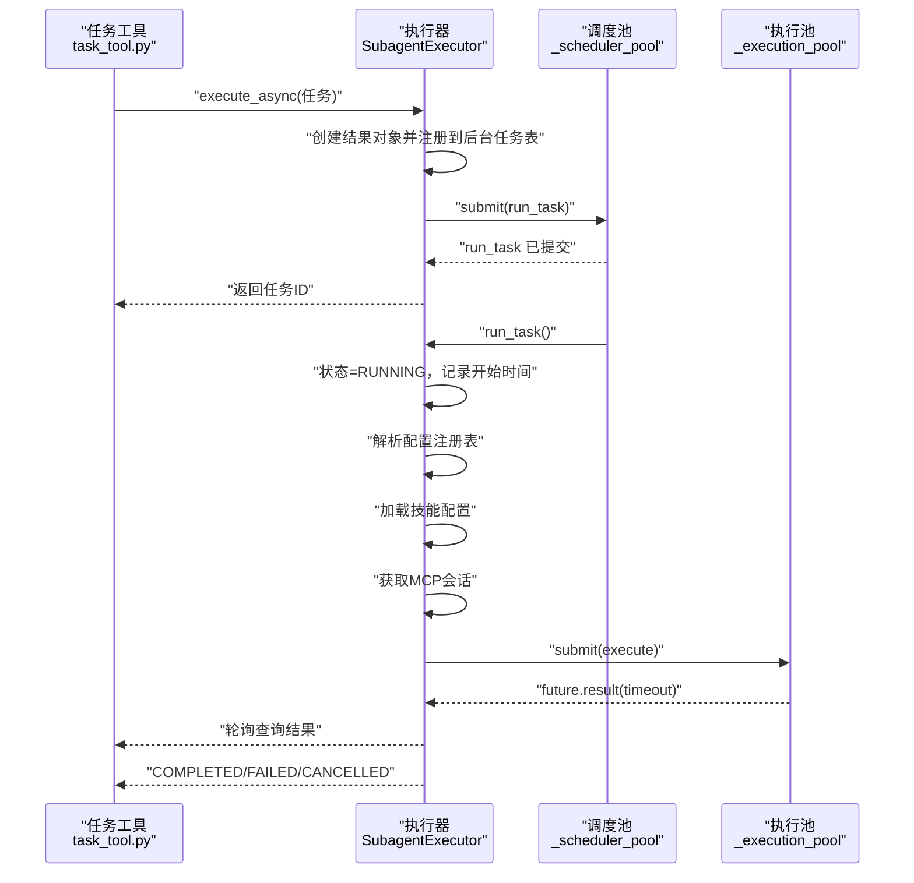
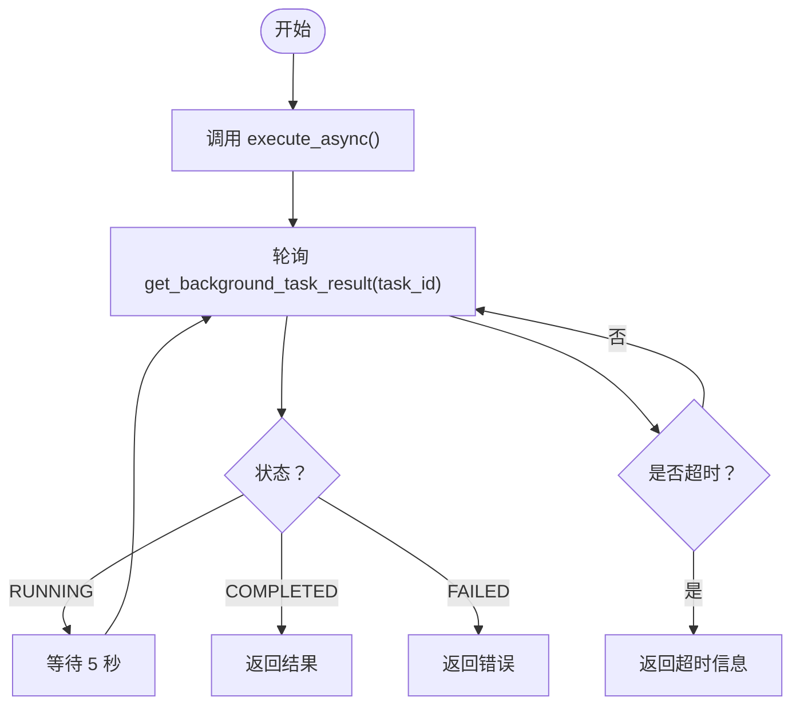
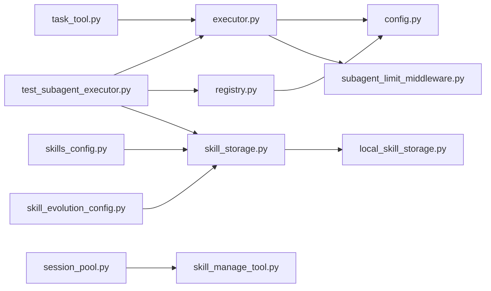

# 子智能体执行器

<cite>
**本文档引用的文件**
- [executor.py](file://backend/packages/harness/deerflow/subagents/executor.py)
- [config.py](file://backend/packages/harness/deerflow/subagents/config.py)
- [task_tool.py](file://backend/packages/harness/deerflow/tools/builtins/task_tool.py)
- [subagent_limit_middleware.py](file://backend/packages/harness/deerflow/agents/middlewares/subagent_limit_middleware.py)
- [token_collector.py](file://backend/packages/harness/deerflow/subagents/token_collector.py)
- [tracing_config.py](file://backend/packages/harness/deerflow/config/tracing_config.py)
- [test_subagent_executor.py](file://backend/tests/test_subagent_executor.py)
- [test_tracing_factory.py](file://backend/tests/test_tracing_factory.py)
- [test_client_langfuse_metadata.py](file://backend/tests/test_client_langfuse_metadata.py)
- [task_tool_improvements.md](file://backend/docs/task_tool_improvements.md)
- [metadata.py](file://backend/packages/harness/deerflow/tracing/metadata.py)
- [registry.py](file://backend/packages/harness/deerflow/subagents/registry.py)
- [test_subagent_timeout_config.py](file://backend/tests/test_subagent_timeout_config.py)
- [builtins/__init__.py](file://backend/packages/harness/deerflow/subagents/builtins/__init__.py)
- [session_pool.py](file://backend/packages/harness/deerflow/mcp/session_pool.py)
- [skills_config.py](file://backend/packages/harness/deerflow/config/skills_config.py)
- [skill_evolution_config.py](file://backend/packages/harness/deerflow/config/skill_evolution_config.py)
- [skill_storage.py](file://backend/packages/harness/deerflow/skills/storage/skill_storage.py)
- [local_skill_storage.py](file://backend/packages/harness/deerflow/skills/storage/local_skill_storage.py)
- [skill_manage_tool.py](file://backend/packages/harness/deerflow/tools/skill_manage_tool.py)
- [__init__.py](file://backend/packages/harness/deerflow/skills/storage/__init__.py)
- [test_lead_agent_skills.py](file://backend/tests/test_lead_agent_skills.py)
- [test_skills_loader.py](file://backend/tests/test_skills_loader.py)
</cite>

## 更新摘要
**所做更改**
- 新增按会话技能加载功能，支持遵循Codex模式在运行时动态分配技能
- 新增MCP会话池管理，支持状态保持的工具调用
- 新增技能配置管理系统，支持技能路径解析和容器映射
- 新增技能演进配置，支持代理自主创建和修改技能
- 新增技能存储抽象层，支持本地文件系统和自定义存储后端
- 更新了通用子代理最大轮次和默认超时时间的配置说明
- 完善了配置解析和运行时覆盖机制的文档
- 更新了测试用例分析，反映新的配置行为和技能管理功能

## 目录
1. [简介](#简介)
2. [项目结构](#项目结构)
3. [核心组件](#核心组件)
4. [架构总览](#架构总览)
5. [详细组件分析](#详细组件分析)
6. [配置管理](#配置管理)
7. [依赖关系分析](#依赖关系分析)
8. [性能考虑](#性能考虑)
9. [故障排除指南](#故障排除指南)
10. [结论](#结论)
11. [附录](#附录)

## 简介
本文件系统性阐述 DeerFlow 子智能体执行器的设计与实现，重点覆盖以下方面：
- 任务调度算法：基于线程池的两级调度（调度池 + 执行池），支持超时控制与状态管理
- 并发执行控制：通过独立线程池隔离调度与执行，避免嵌套线程池与阻塞问题
- 资源分配策略：最大并发数限制、线程池大小配置、用户上下文隔离
- 错误处理机制：超时保护、取消状态保留、异常捕获与结果回传
- 生命周期管理：任务创建、运行、完成/失败/取消状态转换、后台任务存储
- **新增** 技能管理系统：支持按会话动态加载技能，遵循Codex模式进行运行时分配
- **新增** MCP会话池：维护持久化的MCP会话，支持状态保持的工具调用
- **新增** 技能存储抽象：统一的技能存储接口，支持多种存储后端
- 配置管理：通用子代理最大轮次和默认超时时间的改进
- 使用示例：启动、监控、终止子智能体执行，以及性能优化建议

## 项目结构
子智能体执行器位于后端 harness 包中，围绕执行器、配置、工具与中间件协同工作，新增技能管理和会话池支持：
- 执行器：负责异步执行、调度、超时与状态持久化
- 配置：定义子智能体参数（如超时、并发限制、最大轮次等）
- 工具：封装任务调用与轮询逻辑，简化上层使用
- 中间件：限制并发子智能体数量，防止资源耗尽
- **新增** 技能配置：管理技能路径解析、容器映射和演进配置
- **新增** 技能存储：抽象技能存储接口，支持本地文件系统和自定义后端
- **新增** MCP会话池：管理持久化的MCP会话，支持状态保持
- 测试：覆盖异步执行、超时、用户上下文传播、配置管理、技能加载等关键场景



**图表来源**
- [executor.py](file://backend/packages/harness/deerflow/subagents/executor.py)
- [config.py](file://backend/packages/harness/deerflow/subagents/config.py)
- [task_tool.py](file://backend/packages/harness/deerflow/tools/builtins/task_tool.py)
- [subagent_limit_middleware.py](file://backend/packages/harness/deerflow/agents/middlewares/subagent_limit_middleware.py)
- [registry.py](file://backend/packages/harness/deerflow/subagents/registry.py)
- [skills_config.py](file://backend/packages/harness/deerflow/config/skills_config.py)
- [skill_evolution_config.py](file://backend/packages/harness/deerflow/config/skill_evolution_config.py)
- [skill_storage.py](file://backend/packages/harness/deerflow/skills/storage/skill_storage.py)
- [local_skill_storage.py](file://backend/packages/harness/deerflow/skills/storage/local_skill_storage.py)
- [session_pool.py](file://backend/packages/harness/deerflow/mcp/session_pool.py)
- [skill_manage_tool.py](file://backend/packages/harness/deerflow/tools/skill_manage_tool.py)
- [test_subagent_executor.py](file://backend/tests/test_subagent_executor.py)

**章节来源**
- [executor.py](file://backend/packages/harness/deerflow/subagents/executor.py)
- [config.py](file://backend/packages/harness/deerflow/subagents/config.py)
- [task_tool.py](file://backend/packages/harness/deerflow/tools/builtins/task_tool.py)
- [subagent_limit_middleware.py](file://backend/packages/harness/deerflow/agents/middlewares/subagent_limit_middleware.py)
- [registry.py](file://backend/packages/harness/deerflow/subagents/registry.py)
- [skills_config.py](file://backend/packages/harness/deerflow/config/skills_config.py)
- [skill_evolution_config.py](file://backend/packages/harness/deerflow/config/skill_evolution_config.py)
- [skill_storage.py](file://backend/packages/harness/deerflow/skills/storage/skill_storage.py)
- [local_skill_storage.py](file://backend/packages/harness/deerflow/skills/storage/local_skill_storage.py)
- [session_pool.py](file://backend/packages/harness/deerflow/mcp/session_pool.py)
- [skill_manage_tool.py](file://backend/packages/harness/deerflow/tools/skill_manage_tool.py)
- [test_subagent_executor.py](file://backend/tests/test_subagent_executor.py)

## 核心组件
- 子智能体执行器（SubagentExecutor）：提供同步/异步执行接口，维护后台任务状态，封装超时与错误处理
- 子智能体配置（SubagentConfig）：包含超时时间、描述、系统提示、最大轮次等参数
- 任务工具（task_tool）：封装 execute_async 调用与轮询等待，自动返回最终结果或错误信息
- 并发限制中间件（subagent_limit_middleware）：限制同一时间并发子智能体数量，保障系统稳定性
- **更新** 配置注册表（SubagentRegistry）：管理内置和自定义子代理配置，支持运行时覆盖
- **新增** 技能配置（SkillsConfig）：管理技能路径解析、容器映射和存储后端配置
- **新增** 技能演进配置（SkillEvolutionConfig）：控制代理自主创建和修改技能的能力
- **新增** 技能存储抽象（SkillStorage）：统一的技能存储接口，支持多种存储后端实现
- **新增** 本地技能存储（LocalSkillStorage）：基于本地文件系统的技能存储实现
- **新增** MCP会话池（MCPSessionPool）：管理持久化的MCP会话，支持状态保持的工具调用
- **新增** 技能管理工具（skill_manage_tool）：支持创建、编辑、删除和演进自定义技能
- 测试用例（test_subagent_executor）：验证异步执行、超时、用户上下文传播等行为

**章节来源**
- [executor.py](file://backend/packages/harness/deerflow/subagents/executor.py)
- [config.py](file://backend/packages/harness/deerflow/subagents/config.py)
- [task_tool.py](file://backend/packages/harness/deerflow/tools/builtins/task_tool.py)
- [subagent_limit_middleware.py](file://backend/packages/harness/deerflow/agents/middlewares/subagent_limit_middleware.py)
- [registry.py](file://backend/packages/harness/deerflow/subagents/registry.py)
- [skills_config.py](file://backend/packages/harness/deerflow/config/skills_config.py)
- [skill_evolution_config.py](file://backend/packages/harness/deerflow/config/skill_evolution_config.py)
- [skill_storage.py](file://backend/packages/harness/deerflow/skills/storage/skill_storage.py)
- [local_skill_storage.py](file://backend/packages/harness/deerflow/skills/storage/local_skill_storage.py)
- [session_pool.py](file://backend/packages/harness/deerflow/mcp/session_pool.py)
- [skill_manage_tool.py](file://backend/packages/harness/deerflow/tools/skill_manage_tool.py)
- [test_subagent_executor.py](file://backend/tests/test_subagent_executor.py)

## 架构总览
执行器采用"两级线程池"架构，新增技能管理和会话池支持：
- 调度池（_scheduler_pool）：固定较小规模，负责提交与编排后台任务
- 执行池（_execution_pool）：较大规模，负责实际子智能体执行，并在超时时间内获取结果
- **更新** 配置解析：通过注册表管理内置和自定义子代理配置，支持运行时覆盖
- **新增** 技能加载：通过技能存储系统动态加载和管理技能
- **新增** 会话管理：通过MCP会话池维护持久化会话状态



**图表来源**
- [executor.py](file://backend/packages/harness/deerflow/subagents/executor.py)
- [task_tool.py](file://backend/packages/harness/deerflow/tools/builtins/task_tool.py)
- [registry.py](file://backend/packages/harness/deerflow/subagents/registry.py)
- [skill_storage.py](file://backend/packages/harness/deerflow/skills/storage/skill_storage.py)
- [session_pool.py](file://backend/packages/harness/deerflow/mcp/session_pool.py)

## 详细组件分析

### 子智能体执行器（SubagentExecutor）
- 角色与职责
  - 接收任务输入，生成任务 ID
  - 异步提交到调度池，由 run_task 协调执行池执行
  - 维护后台任务字典，记录状态、开始/完成时间、错误信息
  - 支持超时控制与取消状态保留
  - 保持用户上下文在隔离事件循环中传递
  - **新增** 集成技能加载和会话管理功能

- 关键流程
  - 异步执行：execute_async 创建结果对象，注册到后台任务表，提交调度池
  - 调度执行：run_task 在受控事件循环中设置状态为 RUNNING，提交到执行池
  - 执行池：执行池以超时方式获取结果，避免无限等待
  - **更新** 配置解析：通过注册表获取有效的子代理配置
  - **新增** 技能加载：在执行前加载必要的技能配置
  - **新增** 会话管理：获取或创建持久化MCP会话
  - 结果回传：根据执行结果更新状态与错误信息，供轮询查询



**图表来源**
- [executor.py](file://backend/packages/harness/deerflow/subagents/executor.py)
- [task_tool.py](file://backend/packages/harness/deerflow/tools/builtins/task_tool.py)
- [registry.py](file://backend/packages/harness/deerflow/subagents/registry.py)

- 数据结构与复杂度
  - 后台任务表：以任务 ID 为键，值为结果对象；读写受锁保护
  - 时间复杂度：单次查询 O(1)，状态更新 O(1)
  - 空间复杂度：与活跃任务数成正比

- 错误处理与超时
  - 执行超时：执行池以超时方式获取结果，避免阻塞
  - 取消保护：真实超时处理器不会覆盖已标记为 CANCELLED 的状态
  - 异常捕获：执行过程中异常被捕获并写入错误字段

- 用户上下文隔离
  - 使用上下文复制确保在隔离事件循环中正确传递当前用户信息
  - 测试验证：异步执行能正确保留请求用户上下文

**章节来源**
- [executor.py](file://backend/packages/harness/deerflow/subagents/executor.py)
- [test_subagent_executor.py](file://backend/tests/test_subagent_executor.py)

### 技能配置管理系统

#### 技能配置（SkillsConfig）
- 角色与职责
  - 管理技能存储后端配置
  - 解析技能目录路径，支持多种解析策略
  - 提供容器路径映射，支持沙箱环境

- 路径解析策略
  - 显式配置路径
  - 环境变量覆盖
  - 项目根目录默认路径
  - 兼容性回退路径

- 容器路径映射
  - 支持自定义容器挂载路径
  - 自动生成技能文件的容器路径

**章节来源**
- [skills_config.py](file://backend/packages/harness/deerflow/config/skills_config.py)

#### 技能演进配置（SkillEvolutionConfig）
- 角色与职责
  - 控制代理自主创建和修改技能的能力
  - 配置技能安全审核模型
  - 管理技能演进的启用状态

- 安全考虑
  - 可选的安全审核模型
  - 默认使用主聊天模型进行审核
  - 支持禁用技能演进功能

**章节来源**
- [skill_evolution_config.py](file://backend/packages/harness/deerflow/config/skill_evolution_config.py)

#### 技能存储抽象层（SkillStorage）
- 角色与职责
  - 定义统一的技能存储接口
  - 提供模板方法流程，组合原子操作
  - 实现路径验证和安全检查

- 核心功能
  - 技能发现和加载
  - 技能启用状态管理
  - 支持文件的安全写入
  - 历史记录管理

- 安全验证
  - 技能名称验证（仅允许小写字母、数字和连字符）
  - 路径遍历防护
  - 支持文件类型限制

**章节来源**
- [skill_storage.py](file://backend/packages/harness/deerflow/skills/storage/skill_storage.py)

#### 本地技能存储（LocalSkillStorage）
- 实现细节
  - 基于本地文件系统的技能存储
  - 支持递归目录扫描
  - 提供技能安装、删除和历史记录功能

- 文件布局
  ```
  <root>/public/<name>/SKILL.md
  <root>/custom/<name>/SKILL.md
  <root>/custom/.history/<name>.jsonl
  ```

- 异步操作
  - 技能安装支持异步提取和验证
  - 历史记录写入支持异步I/O

**章节来源**
- [local_skill_storage.py](file://backend/packages/harness/deerflow/skills/storage/local_skill_storage.py)

#### 技能管理工具（skill_manage_tool）
- 功能概述
  - 支持技能的创建、编辑、修补、删除
  - 提供文件级别的写入和删除操作
  - 集成安全扫描和历史记录

- 安全机制
  - 内容安全扫描
  - 可执行文件特殊处理
  - 线程安全的并发控制

- 历史记录
  - 记录每次操作的详细信息
  - 包含作者、线程ID、文件路径等元数据
  - 支持内容前后对比

**章节来源**
- [skill_manage_tool.py](file://backend/packages/harness/deerflow/tools/skill_manage_tool.py)

### MCP会话池管理

#### 会话池（MCPSessionPool）
- 角色与职责
  - 管理持久化的MCP会话
  - 支持按服务器名和作用域键的会话隔离
  - 实现LRU淘汰策略

- 会话生命周期
  - 获取或创建持久化会话
  - 会话状态保持和清理
  - 支持按作用域和服务器关闭会话

- 线程安全
  - 使用线程锁保护会话注册表
  - 支持跨事件循环的会话管理
  - 提供同步和异步关闭接口

**章节来源**
- [session_pool.py](file://backend/packages/harness/deerflow/mcp/session_pool.py)

### 子智能体配置（SubagentConfig）
- 关键参数
  - 超时时间（timeout_seconds）：默认 900 秒（15分钟），可按需调整
  - 描述与系统提示：用于子智能体行为约束与提示工程
  - 最大轮次（max_turns）：默认 50 轮，更有效地控制对话长度

- 配置应用
  - 执行器在初始化时读取配置，作为执行策略依据
  - 任务工具在轮询等待时结合配置进行超时判断

**章节来源**
- [config.py](file://backend/packages/harness/deerflow/subagents/config.py)
- [task_tool_improvements.md](file://backend/docs/task_tool_improvements.md)

### 任务工具（task_tool）
- 功能概述
  - 封装 execute_async 调用，自动等待任务完成
  - 提供轮询逻辑：定期查询后台任务状态，直到 COMPLETED/FAILED 或超时
  - 返回统一格式的结果或错误信息

- 轮询策略
  - 固定间隔轮询（例如每 5 秒一次）
  - 总轮询次数上限：(timeout_seconds + 60) // 5，确保轮询窗口超过执行超时
  - 超时保护：超过阈值返回"任务超时"

- 与执行器协作
  - 通过后台任务表查询状态与结果
  - 不直接暴露底层调度细节，简化上层使用



**图表来源**
- [task_tool.py](file://backend/packages/harness/deerflow/tools/builtins/task_tool.py)
- [executor.py](file://backend/packages/harness/deerflow/subagents/executor.py)

**章节来源**
- [task_tool.py](file://backend/packages/harness/deerflow/tools/builtins/task_tool.py)
- [task_tool_improvements.md](file://backend/docs/task_tool_improvements.md)

### 并发限制中间件（subagent_limit_middleware）
- 目标
  - 控制同时运行的子智能体数量，防止资源争用与系统过载
  - 与执行器配合，确保整体吞吐与稳定性

- 实现要点
  - 基于全局常量 MAX_CONCURRENT_SUBAGENTS 限制并发
  - 在任务提交前检查并发计数，必要时阻塞或拒绝

**章节来源**
- [subagent_limit_middleware.py](file://backend/packages/harness/deerflow/agents/middlewares/subagent_limit_middleware.py)
- [executor.py](file://backend/packages/harness/deerflow/subagents/executor.py)

### 配置注册表（SubagentRegistry）
- 角色与职责
  - 管理内置和自定义子代理配置
  - 支持运行时配置覆盖和解析
  - 提供配置合并和优先级处理

- 解析规则
  - 内置子代理优先于自定义配置
  - 运行时覆盖优先于全局默认值
  - 自定义代理不被全局默认值覆盖

- 关键功能
  - 配置合并：将运行时覆盖应用到基础配置
  - 优先级处理：per-agent override > global default > config's own value
  - 类型安全：验证超时时间和最大轮次的有效性

**章节来源**
- [registry.py](file://backend/packages/harness/deerflow/subagents/registry.py)
- [builtins/__init__.py](file://backend/packages/harness/deerflow/subagents/builtins/__init__.py)

## 配置管理

### 默认配置改进
子智能体执行器的默认配置已得到显著改进：

- **超时时间**：默认从 300 秒提升至 900 秒（15分钟），为复杂任务提供更多执行时间
- **最大轮次**：默认从 100 轮提升至 50 轮，更有效地控制对话长度
- **配置验证**：新增严格的参数验证，拒绝零值和负值配置

### 技能配置管理
**新增** 技能配置系统提供了完整的技能管理能力：

- **技能存储配置**：支持自定义技能存储类和路径
- **容器路径映射**：自动处理沙箱环境中的文件路径映射
- **路径解析策略**：支持多种路径解析方式，确保灵活性和兼容性

### 运行时配置覆盖
配置系统支持灵活的运行时覆盖机制：

- **全局默认值**：适用于所有内置子代理
- **单个代理覆盖**：针对特定子代理的定制配置
- **类型安全**：确保配置值的有效性和一致性

### 配置解析流程
配置解析遵循严格的优先级顺序：


**图表来源**
- [registry.py](file://backend/packages/harness/deerflow/subagents/registry.py)

**章节来源**
- [registry.py](file://backend/packages/harness/deerflow/subagents/registry.py)
- [test_subagent_timeout_config.py](file://backend/tests/test_subagent_timeout_config.py)

## 依赖关系分析
- 执行器依赖
  - 配置模块：读取超时与行为参数
  - 中间件：限制并发，避免资源竞争
  - 运行时用户上下文：保证多请求隔离
  - **更新** 配置注册表：解析和合并子代理配置
  - **新增** 技能存储：动态加载和管理技能
  - **新增** 会话池：管理持久化MCP会话
- 工具依赖
  - 执行器：发起异步执行与轮询
  - 后台任务表：查询状态与结果
  - **新增** 技能管理工具：提供技能操作接口
- 测试依赖
  - 执行器与工具：验证异步执行、超时与上下文传播
  - **更新** 配置测试：验证配置管理和覆盖机制
  - **新增** 技能测试：验证技能加载、存储和管理功能



**图表来源**
- [executor.py](file://backend/packages/harness/deerflow/subagents/executor.py)
- [config.py](file://backend/packages/harness/deerflow/subagents/config.py)
- [task_tool.py](file://backend/packages/harness/deerflow/tools/builtins/task_tool.py)
- [subagent_limit_middleware.py](file://backend/packages/harness/deerflow/agents/middlewares/subagent_limit_middleware.py)
- [registry.py](file://backend/packages/harness/deerflow/subagents/registry.py)
- [skill_storage.py](file://backend/packages/harness/deerflow/skills/storage/skill_storage.py)
- [local_skill_storage.py](file://backend/packages/harness/deerflow/skills/storage/local_skill_storage.py)
- [skills_config.py](file://backend/packages/harness/deerflow/config/skills_config.py)
- [skill_evolution_config.py](file://backend/packages/harness/deerflow/config/skill_evolution_config.py)
- [session_pool.py](file://backend/packages/harness/deerflow/mcp/session_pool.py)
- [skill_manage_tool.py](file://backend/packages/harness/deerflow/tools/skill_manage_tool.py)
- [test_subagent_executor.py](file://backend/tests/test_subagent_executor.py)

**章节来源**
- [executor.py](file://backend/packages/harness/deerflow/subagents/executor.py)
- [config.py](file://backend/packages/harness/deerflow/subagents/config.py)
- [task_tool.py](file://backend/packages/harness/deerflow/tools/builtins/task_tool.py)
- [subagent_limit_middleware.py](file://backend/packages/harness/deerflow/agents/middlewares/subagent_limit_middleware.py)
- [registry.py](file://backend/packages/harness/deerflow/subagents/registry.py)
- [skill_storage.py](file://backend/packages/harness/deerflow/skills/storage/skill_storage.py)
- [local_skill_storage.py](file://backend/packages/harness/deerflow/skills/storage/local_skill_storage.py)
- [skills_config.py](file://backend/packages/harness/deerflow/config/skills_config.py)
- [skill_evolution_config.py](file://backend/packages/harness/deerflow/config/skill_evolution_config.py)
- [session_pool.py](file://backend/packages/harness/deerflow/mcp/session_pool.py)
- [skill_manage_tool.py](file://backend/packages/harness/deerflow/tools/skill_manage_tool.py)
- [test_subagent_executor.py](file://backend/tests/test_subagent_executor.py)

## 性能考虑
- 线程池分离
  - 调度池小而稳，避免过多上下文切换
  - 执行池大以提升吞吐，减少阻塞
- 超时双层保护
  - 执行超时：防止子智能体长时间占用资源
  - 轮询超时：避免前端/工具侧无限等待
- 并发限制
  - 通过中间件限制并发，平衡延迟与吞吐
- 用户上下文隔离
  - 使用上下文复制避免共享状态带来的额外开销
- **更新** 配置解析优化
  - 配置注册表缓存常用配置，减少重复解析开销
  - 类型验证在加载时进行，运行时避免重复验证
- **新增** 技能存储优化
  - 技能存储缓存机制，减少重复加载
  - 异步I/O操作，提升文件访问性能
- **新增** 会话池优化
  - LRU淘汰策略，控制内存使用
  - 线程安全的并发访问
  - 事件循环感知的会话管理

## 故障排除指南
- 症状：任务长时间处于 RUNNING
  - 检查执行池是否被占满或阻塞
  - 查看执行超时配置是否合理
  - 确认子智能体内部是否存在阻塞操作
- 症状：轮询始终不结束
  - 检查后台任务表中任务状态是否被意外修改
  - 确认轮询间隔与超时阈值设置
  - **更新** 验证配置解析是否正确
- 症状：超时后状态被覆盖为 FAILED
  - 确保取消流程正确设置为 CANCELLED
  - 验证超时处理器不会覆盖已取消状态
- 症状：用户上下文丢失
  - 确认在调度池提交时已复制当前用户上下文
  - 检查隔离事件循环中的上下文传递
- **更新** 症状：配置不生效
  - 检查配置注册表的覆盖优先级
  - 确认运行时配置加载是否正确
  - 验证配置验证规则是否被触发
- **新增** 症状：技能加载失败
  - 检查技能存储配置是否正确
  - 验证技能文件格式和权限
  - 确认技能路径解析是否正常
- **新增** 症状：会话管理异常
  - 检查会话池容量设置
  - 验证事件循环的正确性
  - 确认会话清理机制是否正常工作

**章节来源**
- [test_subagent_executor.py](file://backend/tests/test_subagent_executor.py)
- [executor.py](file://backend/packages/harness/deerflow/subagents/executor.py)
- [test_subagent_timeout_config.py](file://backend/tests/test_subagent_timeout_config.py)
- [test_lead_agent_skills.py](file://backend/tests/test_lead_agent_skills.py)
- [test_skills_loader.py](file://backend/tests/test_skills_loader.py)

## 结论
子智能体执行器通过两级线程池架构实现了高可靠、可扩展的任务执行与监控能力。其异步执行、超时保护与并发限制共同保障了系统的稳定性与性能。**更新的配置管理功能**提供了更灵活的参数控制和更强的类型安全性，通过默认值改进和运行时覆盖机制，上层使用者无需关心底层调度细节即可获得一致的执行体验。

**新增的技能管理系统**进一步增强了DeerFlow的智能化能力，支持按会话动态加载技能，遵循Codex模式进行运行时分配。MCP会话池确保了状态保持的工具调用，技能存储抽象层提供了灵活的存储后端选择。这些功能的集成使得DeerFlow能够更好地适应复杂的智能体应用场景，为用户提供更加丰富和强大的AI助手能力。

## 附录

### 使用示例（步骤说明）
- 启动子智能体执行
  - 调用任务工具的 execute_async，传入子智能体类型与提示词
  - 获取任务 ID，稍后轮询查询结果
- 监控执行状态
  - 使用轮询逻辑定期查询后台任务状态
  - 根据状态分支处理成功、失败或继续等待
- 终止执行
  - 若需要取消，可在执行器层面设置取消状态
  - 注意：真实超时处理器不会覆盖已标记为 CANCELLED 的状态
- **更新** 配置管理
  - 通过 config.yaml 配置全局默认值和代理覆盖
  - 验证配置解析和覆盖机制正常工作
- **新增** 技能管理
  - 使用技能管理工具创建、编辑或删除自定义技能
  - 配置技能存储路径和容器映射
  - 启用技能演进功能以支持代理自主学习
- **新增** 会话管理
  - 通过MCP会话池管理持久化会话状态
  - 配置会话池容量和清理策略
  - 处理会话生命周期和资源释放
- 性能优化建议
  - 合理设置超时时间与轮询间隔
  - 控制并发数量，避免资源争用
  - 对阻塞型子智能体进行改造或拆分
  - **更新** 利用配置缓存机制提升性能
  - **新增** 优化技能存储访问和会话池管理
  - **新增** 合理配置技能演进的安全审核

**章节来源**
- [task_tool.py](file://backend/packages/harness/deerflow/tools/builtins/task_tool.py)
- [executor.py](file://backend/packages/harness/deerflow/subagents/executor.py)
- [test_subagent_executor.py](file://backend/tests/test_subagent_executor.py)
- [test_subagent_timeout_config.py](file://backend/tests/test_subagent_timeout_config.py)
- [skill_manage_tool.py](file://backend/packages/harness/deerflow/tools/skill_manage_tool.py)
- [session_pool.py](file://backend/packages/harness/deerflow/mcp/session_pool.py)