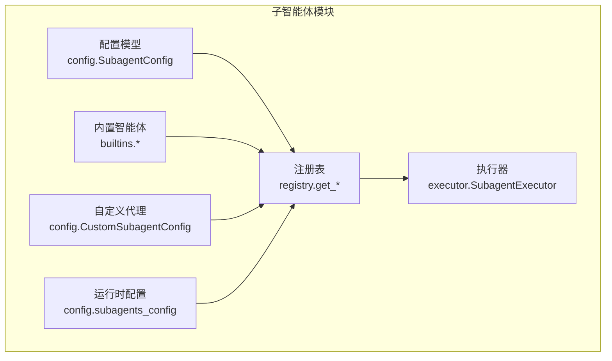
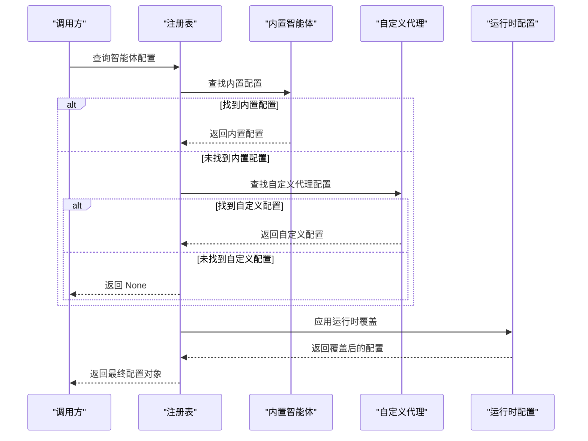
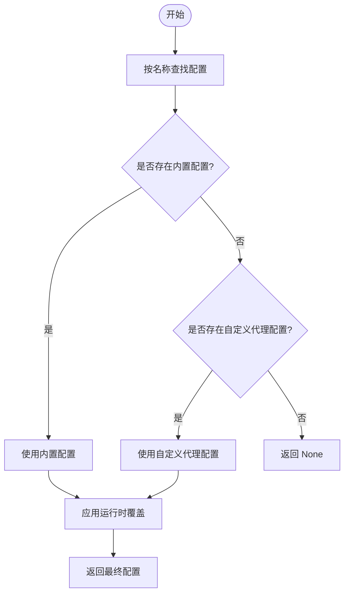
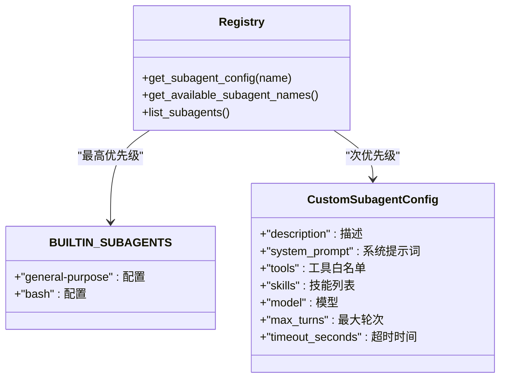
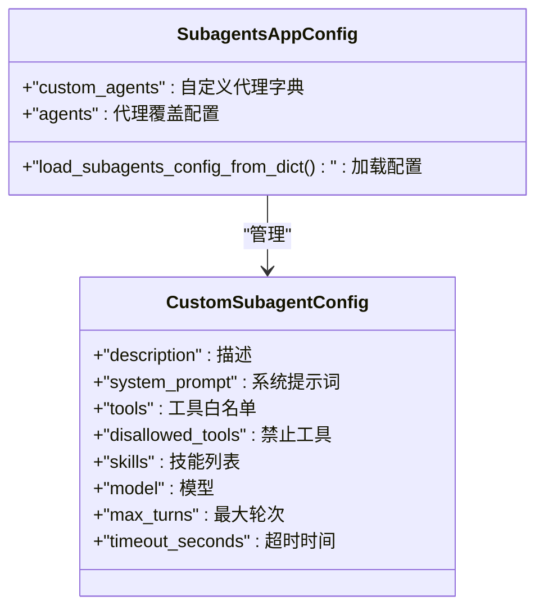
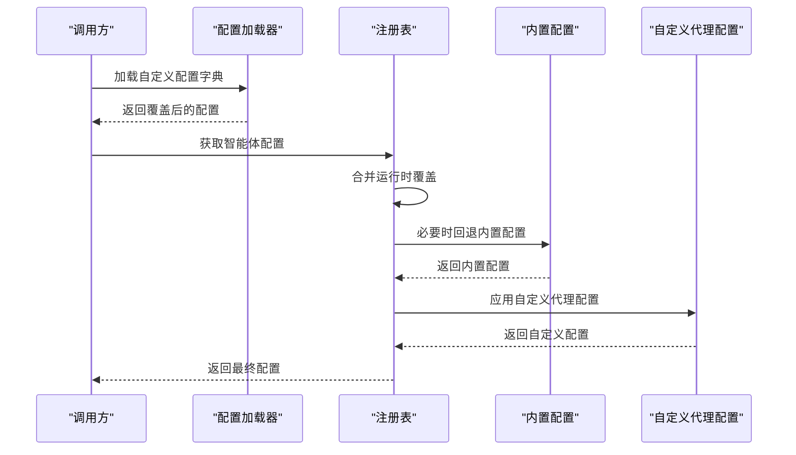
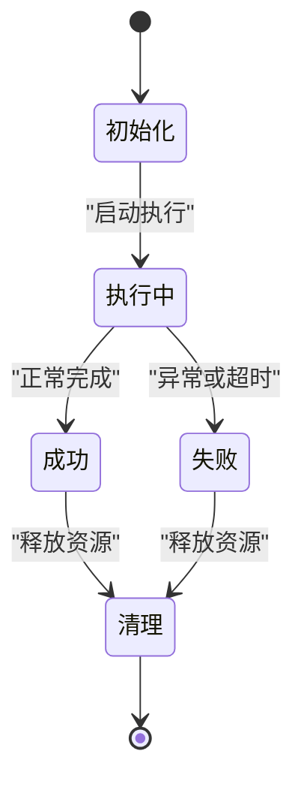
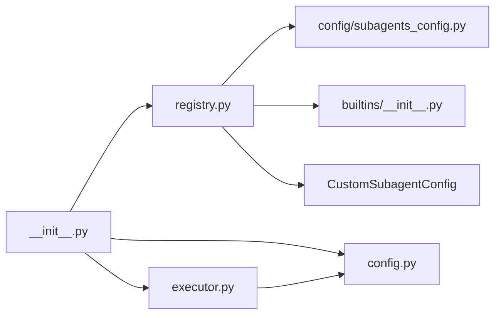

# 子智能体注册表

<cite>
**本文引用的文件**
- [backend/packages/harness/deerflow/subagents/__init__.py](file://backend/packages/harness/deerflow/subagents/__init__.py)
- [backend/packages/harness/deerflow/subagents/registry.py](file://backend/packages/harness/deerflow/subagents/registry.py)
- [backend/packages/harness/deerflow/subagents/builtins/__init__.py](file://backend/packages/harness/deerflow/subagents/builtins/__init__.py)
- [backend/packages/harness/deerflow/subagents/builtins/general_purpose.py](file://backend/packages/harness/deerflow/subagents/builtins/general_purpose.py)
- [backend/packages/harness/deerflow/subagents/builtins/bash_agent.py](file://backend/packages/harness/deerflow/subagents/builtins/bash_agent.py)
- [backend/packages/harness/deerflow/subagents/config.py](file://backend/packages/harness/deerflow/subagents/config.py)
- [backend/packages/harness/deerflow/subagents/executor.py](file://backend/packages/harness/deerflow/subagents/executor.py)
- [backend/packages/harness/deerflow/config/subagents_config.py](file://backend/packages/harness/deerflow/config/subagents_config.py)
- [backend/tests/test_subagent_timeout_config.py](file://backend/tests/test_subagent_timeout_config.py)
- [backend/tests/test_subagent_skills_config.py](file://backend/tests/test_subagent_skills_config.py)
- [backend/tests/test_custom_agent.py](file://backend/tests/test_custom_agent.py)
- [frontend/src/content/zh/harness/subagents.mdx](file://frontend/src/content/zh/harness/subagents.mdx)
</cite>

## 更新摘要
**变更内容**
- 新增三层优先级机制：内置类型、custom_agents部分和每个代理覆盖
- 新增自定义代理支持，允许用户定义自己的子智能体类型
- 更新注册表查询流程以支持三层优先级解析
- 新增自定义代理配置模型和加载机制
- 更新使用示例以包含自定义代理的配置和管理

## 目录
1. [引言](#引言)
2. [项目结构](#项目结构)
3. [核心组件](#核心组件)
4. [架构总览](#架构总览)
5. [详细组件分析](#详细组件分析)
6. [依赖关系分析](#依赖关系分析)
7. [性能考量](#性能考量)
8. [故障排查指南](#故障排查指南)
9. [结论](#结论)
10. [附录](#附录)

## 引言
本文件面向 DeerFlow 子智能体注册表系统，系统性阐述其设计原理、智能体发现机制、动态加载策略与生命周期管理。重点说明注册表如何维护子智能体的元数据信息，如何实现智能体的注册、注销与查询功能，并支持热插拔机制。同时提供使用示例，展示如何注册新的子智能体类型、查询可用智能体列表，以及如何进行版本管理和兼容性控制。

**更新** 本版本新增了三层优先级机制：内置类型、custom_agents部分和每个代理覆盖，以及自定义代理支持功能。

## 项目结构
子智能体注册表位于后端 harness 包中，采用"配置-注册表-内置智能体-执行器"的分层组织方式：
- 配置层：定义子智能体配置模型与运行时配置加载逻辑
- 注册表层：提供智能体名称到配置对象的映射与查询接口
- 内置智能体层：提供默认智能体配置集合
- 执行器层：封装子智能体的生命周期与执行流程

**图表来源**
- [backend/packages/harness/deerflow/subagents/config.py](file://backend/packages/harness/deerflow/subagents/config.py)
- [backend/packages/harness/deerflow/subagents/registry.py](file://backend/packages/harness/deerflow/subagents/registry.py)
- [backend/packages/harness/deerflow/subagents/builtins/__init__.py](file://backend/packages/harness/deerflow/subagents/builtins/__init__.py)
- [backend/packages/harness/deerflow/config/subagents_config.py](file://backend/packages/harness/deerflow/config/subagents_config.py)

**章节来源**
- [backend/packages/harness/deerflow/subagents/__init__.py](file://backend/packages/harness/deerflow/subagents/__init__.py)
- [backend/packages/harness/deerflow/subagents/registry.py](file://backend/packages/harness/deerflow/subagents/registry.py)
- [backend/packages/harness/deerflow/subagents/builtins/__init__.py](file://backend/packages/harness/deerflow/subagents/builtins/__init__.py)

## 核心组件
- 配置模型 SubagentConfig：描述子智能体的元数据（如名称、描述、系统提示词等）与运行参数（如超时、最大轮次等）
- 注册表 registry：提供 get_subagent_config、get_available_subagent_names、list_subagents 等查询接口；内置智能体优先于自定义配置
- 内置智能体 builtins：包含通用智能体与 Bash 智能体的默认配置集合
- 自定义代理配置 CustomSubagentConfig：支持用户定义自己的子智能体类型，包含描述、系统提示词、工具白名单、技能列表等
- 运行时配置 subagents_config：支持从字典加载覆盖项，且不污染内置默认值
- 执行器 executor：封装子智能体的生命周期与执行流程，负责结果收集与错误处理

**更新** 新增自定义代理配置模型和三层优先级机制。

**章节来源**
- [backend/packages/harness/deerflow/subagents/config.py](file://backend/packages/harness/deerflow/subagents/config.py)
- [backend/packages/harness/deerflow/subagents/registry.py](file://backend/packages/harness/deerflow/subagents/registry.py)
- [backend/packages/harness/deerflow/subagents/builtins/__init__.py](file://backend/packages/harness/deerflow/subagents/builtins/__init__.py)
- [backend/packages/harness/deerflow/config/subagents_config.py](file://backend/packages/harness/deerflow/config/subagents_config.py)
- [backend/packages/harness/deerflow/subagents/executor.py](file://backend/packages/harness/deerflow/subagents/executor.py)

## 架构总览
注册表通过"内置配置优先、运行时覆盖可选"的策略，实现稳定的默认行为与灵活的定制能力。查询流程现在支持三层优先级：

**图表来源**
- [backend/packages/harness/deerflow/subagents/registry.py](file://backend/packages/harness/deerflow/subagents/registry.py)
- [backend/packages/harness/deerflow/config/subagents_config.py](file://backend/packages/harness/deerflow/config/subagents_config.py)
- [backend/packages/harness/deerflow/subagents/builtins/__init__.py](file://backend/packages/harness/deerflow/subagents/builtins/__init__.py)

## 详细组件分析

### 注册表与查询接口
- get_subagent_config(name)：返回指定名称的子智能体配置对象，按三层优先级解析：内置配置 > 自定义代理配置 > 运行时覆盖
- get_available_subagent_names()：返回所有可用的子智能体名称列表，包含内置和自定义代理
- list_subagents()：返回完整的子智能体配置清单（含内置与自定义）

**更新** 查询接口现在支持三层优先级解析，内置配置优先于自定义代理配置。

**图表来源**
- [backend/packages/harness/deerflow/subagents/registry.py](file://backend/packages/harness/deerflow/subagents/registry.py)
- [backend/packages/harness/deerflow/config/subagents_config.py](file://backend/packages/harness/deerflow/config/subagents_config.py)

**章节来源**
- [backend/packages/harness/deerflow/subagents/registry.py](file://backend/packages/harness/deerflow/subagents/registry.py)

### 内置智能体与优先级
- 内置智能体集合 BUILTIN_SUBAGENTS 提供默认配置字典
- 当自定义配置与内置配置同名时，内置配置具有最高优先级
- 单个字段覆盖不会影响其他未覆盖字段

**更新** 内置智能体现在具有最高优先级，即使自定义代理配置存在也不会被覆盖。

**图表来源**
- [backend/packages/harness/deerflow/subagents/builtins/__init__.py](file://backend/packages/harness/deerflow/subagents/builtins/__init__.py)
- [backend/packages/harness/deerflow/subagents/registry.py](file://backend/packages/harness/deerflow/subagents/registry.py)
- [backend/packages/harness/deerflow/config/subagents_config.py](file://backend/packages/harness/deerflow/config/subagents_config.py)

**章节来源**
- [backend/packages/harness/deerflow/subagents/builtins/__init__.py](file://backend/packages/harness/deerflow/subagents/builtins/__init__.py)
- [backend/tests/test_subagent_skills_config.py](file://backend/tests/test_subagent_skills_config.py)

### 自定义代理支持
- CustomSubagentConfig：用户定义的子智能体类型配置模型
- 支持描述、系统提示词、工具白名单、技能列表、模型选择、最大轮次和超时时间
- 通过 config.yaml 的 custom_agents 部分进行配置
- 自定义代理配置在内置配置之后、运行时覆盖之前生效

**新增** 自定义代理支持功能，允许用户定义自己的子智能体类型。

**图表来源**
- [backend/packages/harness/deerflow/config/subagents_config.py](file://backend/packages/harness/deerflow/config/subagents_config.py)

**章节来源**
- [backend/packages/harness/deerflow/config/subagents_config.py](file://backend/packages/harness/deerflow/config/subagents_config.py)
- [backend/tests/test_custom_agent.py](file://backend/tests/test_custom_agent.py)

### 运行时配置与热插拔
- 支持从字典加载运行时配置，覆盖内置默认值
- 覆盖操作返回新对象，不修改内置默认值，确保热插拔安全
- 可对特定智能体进行字段级覆盖，不影响其他字段

**更新** 运行时配置现在支持三层优先级：内置配置、自定义代理配置和每个代理覆盖。

**图表来源**
- [backend/packages/harness/deerflow/config/subagents_config.py](file://backend/packages/harness/deerflow/config/subagents_config.py)
- [backend/packages/harness/deerflow/subagents/registry.py](file://backend/packages/harness/deerflow/subagents/registry.py)

**章节来源**
- [backend/packages/harness/deerflow/config/subagents_config.py](file://backend/packages/harness/deerflow/config/subagents_config.py)
- [backend/tests/test_subagent_timeout_config.py](file://backend/tests/test_subagent_timeout_config.py)

### 执行器与生命周期
- SubagentExecutor 封装子智能体的生命周期：初始化、执行、清理
- 支持结果收集与错误处理，便于上层统一调度
- 与注册表解耦，仅依赖配置对象

**图表来源**
- [backend/packages/harness/deerflow/subagents/executor.py](file://backend/packages/harness/deerflow/subagents/executor.py)

**章节来源**
- [backend/packages/harness/deerflow/subagents/executor.py](file://backend/packages/harness/deerflow/subagents/executor.py)

## 依赖关系分析
- 导出入口：子智能体模块通过 __init__.py 暴露配置、注册表与执行器的关键 API
- 内部依赖：注册表依赖运行时配置与内置智能体；执行器依赖配置模型
- 测试验证：通过单元测试验证覆盖优先级、不可变默认值与字段保留策略

**更新** 新增自定义代理配置的依赖关系。

**图表来源**
- [backend/packages/harness/deerflow/subagents/__init__.py](file://backend/packages/harness/deerflow/subagents/__init__.py)
- [backend/packages/harness/deerflow/subagents/registry.py](file://backend/packages/harness/deerflow/subagents/registry.py)
- [backend/packages/harness/deerflow/subagents/config.py](file://backend/packages/harness/deerflow/subagents/config.py)
- [backend/packages/harness/deerflow/subagents/executor.py](file://backend/packages/harness/deerflow/subagents/executor.py)
- [backend/packages/harness/deerflow/config/subagents_config.py](file://backend/packages/harness/deerflow/config/subagents_config.py)
- [backend/packages/harness/deerflow/subagents/builtins/__init__.py](file://backend/packages/harness/deerflow/subagents/builtins/__init__.py)

**章节来源**
- [backend/packages/harness/deerflow/subagents/__init__.py](file://backend/packages/harness/deerflow/subagents/__init__.py)

## 性能考量
- 查询路径短：注册表直接命中内置字典或运行时覆盖，避免复杂 IO
- 不可变默认值：减少并发场景下的锁竞争与状态同步成本
- 字段级覆盖：降低内存复制与序列化开销
- 建议：在高并发场景下，尽量复用已获取的配置对象，避免重复查询

**更新** 三层优先级机制优化了查询性能，减少了不必要的配置构建。

## 故障排查指南
- 配置未生效
  - 检查是否正确调用运行时配置加载函数
  - 确认覆盖键名与配置模型字段一致
- 内置配置被意外修改
  - 确保覆盖返回新对象而非原地修改
  - 使用单元测试验证默认值未被污染
- 自定义配置未生效
  - 确认自定义名称与内置名称冲突时的优先级规则
  - 检查是否对目标字段进行了覆盖
- 自定义代理配置冲突
  - 确认自定义代理名称与内置代理名称不同
  - 检查 config.yaml 格式是否正确

**更新** 新增自定义代理配置冲突的排查指南。

**章节来源**
- [backend/tests/test_subagent_timeout_config.py](file://backend/tests/test_subagent_timeout_config.py)
- [backend/tests/test_subagent_skills_config.py](file://backend/tests/test_subagent_skills_config.py)
- [backend/tests/test_custom_agent.py](file://backend/tests/test_custom_agent.py)

## 结论
子智能体注册表以"内置优先、运行时覆盖、不可变默认"的设计原则，实现了稳定与灵活的平衡。通过清晰的查询接口、严格的覆盖策略与可扩展的执行器，系统支持热插拔与版本管理，满足多场景下的子智能体编排需求。

**更新** 新增的三层优先级机制进一步增强了系统的灵活性，允许用户通过自定义代理扩展智能体能力，同时保持内置配置的稳定性。

## 附录

### 使用示例与最佳实践
- 注册新的子智能体类型
  - 在 config.yaml 的 custom_agents 部分添加自定义智能体条目，设置名称与所需字段
  - 通过查询接口获取配置，确认覆盖生效
- 查询可用智能体列表
  - 调用查询接口获取名称列表，用于前端展示或自动发现
- 版本管理与兼容性控制
  - 通过字段级覆盖实现向后兼容：新增字段不影响旧配置
  - 对关键字段（如超时、最大轮次）进行集中管理，避免分散配置
- 自定义代理管理
  - 通过 Agents API 管理自定义代理的创建、更新和删除
  - 使用 SOUL.md 文件定义代理的人格和行为准则
  - 通过 config.yaml 的 agents 部分对自定义代理进行运行时覆盖

**更新** 新增自定义代理的完整使用示例和管理指南。

**章节来源**
- [backend/packages/harness/deerflow/subagents/registry.py](file://backend/packages/harness/deerflow/subagents/registry.py)
- [backend/packages/harness/deerflow/config/subagents_config.py](file://backend/packages/harness/deerflow/config/subagents_config.py)
- [backend/tests/test_custom_agent.py](file://backend/tests/test_custom_agent.py)
- [frontend/src/content/zh/harness/subagents.mdx](file://frontend/src/content/zh/harness/subagents.mdx)