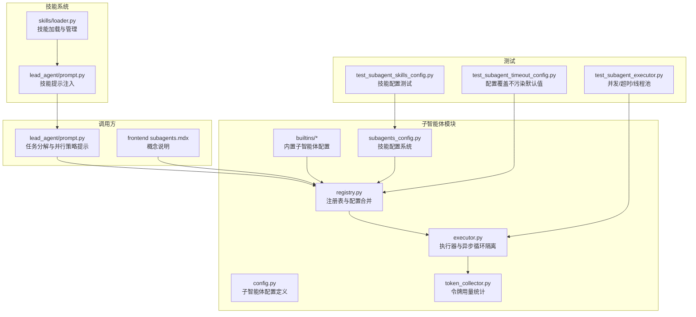
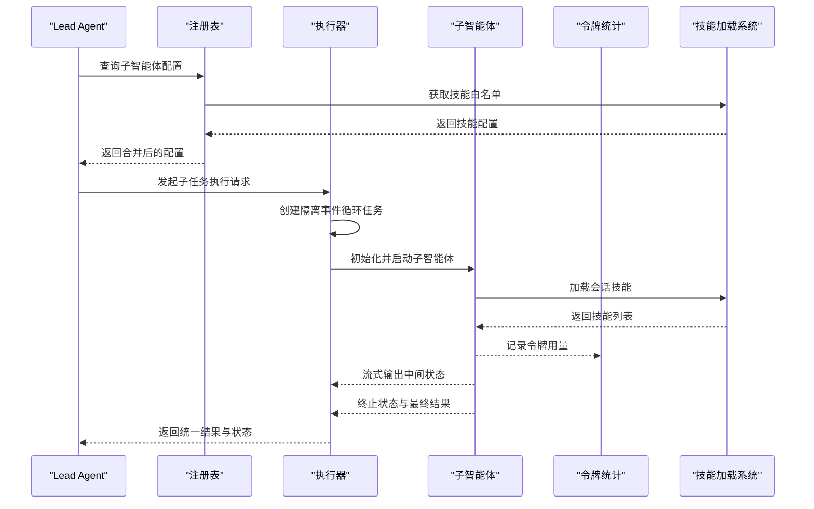
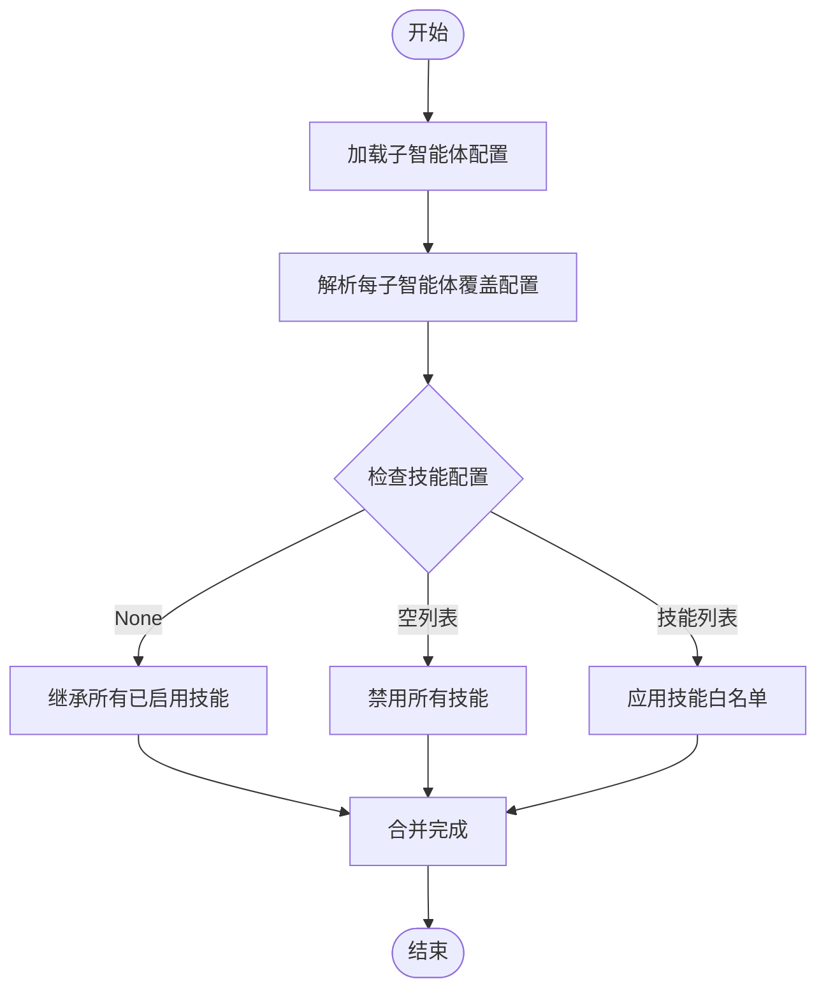
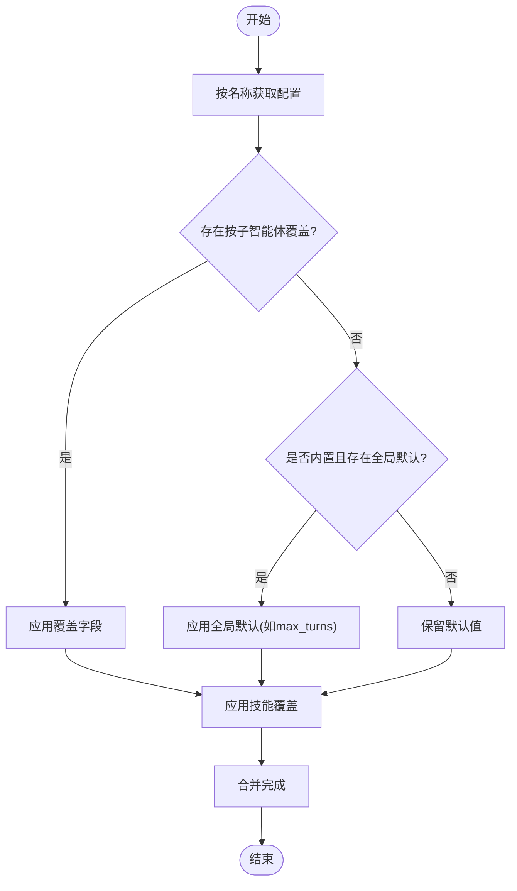
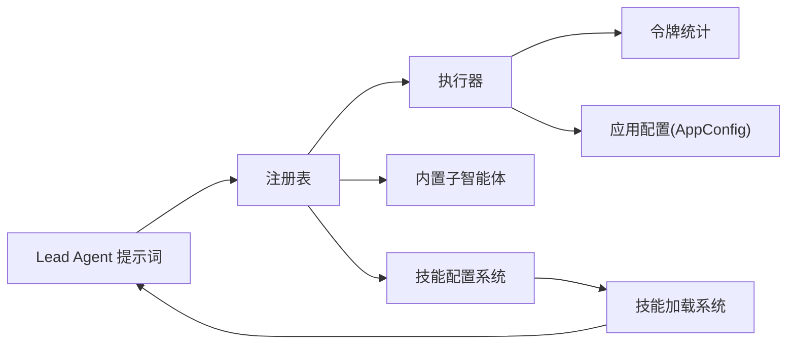

# 子智能体编排

<cite>
**本文引用的文件**
- [backend/packages/harness/deerflow/subagents/config.py](file://backend/packages/harness/deerflow/subagents/config.py)
- [backend/packages/harness/deerflow/subagents/executor.py](file://backend/packages/harness/deerflow/subagents/executor.py)
- [backend/packages/harness/deerflow/subagents/registry.py](file://backend/packages/harness/deerflow/subagents/registry.py)
- [backend/packages/harness/deerflow/subagents/builtins/__init__.py](file://backend/packages/harness/deerflow/subagents/builtins/__init__.py)
- [backend/packages/harness/deerflow/subagents/builtins/general_purpose.py](file://backend/packages/harness/deerflow/subagents/builtins/general_purpose.py)
- [backend/packages/harness/deerflow/subagents/builtins/bash_agent.py](file://backend/packages/harness/deerflow/subagents/builtins/bash_agent.py)
- [backend/packages/harness/deerflow/subagents/token_collector.py](file://backend/packages/harness/deerflow/subagents/token_collector.py)
- [backend/packages/harness/deerflow/config/subagents_config.py](file://backend/packages/harness/deerflow/config/subagents_config.py)
- [backend/packages/harness/deerflow/agents/lead_agent/prompt.py](file://backend/packages/harness/deerflow/agents/lead_agent/prompt.py)
- [backend/packages/harness/deerflow/skills/loader.py](file://backend/packages/harness/deerflow/skills/loader.py)
- [frontend/src/content/en/harness/subagents.mdx](file://frontend/src/content/en/harness/subagents.mdx)
- [backend/tests/test_subagent_skills_config.py](file://backend/tests/test_subagent_skills_config.py)
- [backend/tests/test_subagent_executor.py](file://backend/tests/test_subagent_executor.py)
- [backend/tests/test_subagent_timeout_config.py](file://backend/tests/test_subagent_timeout_config.py)
</cite>

## 更新摘要
**所做更改**
- 新增子智能体技能加载系统章节，详细介绍每子智能体技能配置功能
- 更新注册表改进部分，增加自定义子智能体类型注册机制
- 新增按会话技能加载功能说明
- 扩展配置系统章节，包含技能字段的详细说明
- 更新架构图以反映技能加载系统的集成

## 目录
1. [引言](#引言)
2. [项目结构](#项目结构)
3. [核心组件](#核心组件)
4. [架构总览](#架构总览)
5. [详细组件分析](#详细组件分析)
6. [依赖关系分析](#依赖关系分析)
7. [性能考量](#性能考量)
8. [故障排查指南](#故障排查指南)
9. [结论](#结论)
10. [附录：使用示例与最佳实践](#附录使用示例与最佳实践)

## 引言
本文件面向 DeerFlow 的子智能体编排系统，系统性阐述子智能体的创建与管理机制，包括任务分解策略、并行执行架构、结果聚合算法与协调机制设计；同时解释子智能体配置系统、执行器工作原理、注册表管理机制、技能加载系统和按会话技能加载功能，并给出高效多智能体协作的实践建议与性能优化要点。本文所有技术细节均基于仓库中实际代码与测试用例进行归纳总结。

## 项目结构
子智能体相关代码集中在后端 harness 包下的 deerflow.subagents 模块，包含配置、执行器、注册表、内置子智能体与令牌统计等模块；技能系统独立于子智能体模块但紧密集成；前端文档对子智能体的作用与价值进行了概念性说明；Lead Agent 的提示词中给出了任务分解与并行执行的策略范式；测试用例覆盖了执行器并发、超时控制、配置覆盖和技能加载等关键行为。



**图表来源**
- [backend/packages/harness/deerflow/subagents/config.py](file://backend/packages/harness/deerflow/subagents/config.py)
- [backend/packages/harness/deerflow/subagents/registry.py](file://backend/packages/harness/deerflow/subagents/registry.py)
- [backend/packages/harness/deerflow/subagents/executor.py](file://backend/packages/harness/deerflow/subagents/executor.py)
- [backend/packages/harness/deerflow/subagents/token_collector.py](file://backend/packages/harness/deerflow/subagents/token_collector.py)
- [backend/packages/harness/deerflow/subagents/builtins/__init__.py](file://backend/packages/harness/deerflow/subagents/builtins/__init__.py)
- [backend/packages/harness/deerflow/config/subagents_config.py](file://backend/packages/harness/deerflow/config/subagents_config.py)
- [backend/packages/harness/deerflow/skills/loader.py](file://backend/packages/harness/deerflow/skills/loader.py)
- [backend/packages/harness/deerflow/agents/lead_agent/prompt.py](file://backend/packages/harness/deerflow/agents/lead_agent/prompt.py)
- [frontend/src/content/en/harness/subagents.mdx](file://frontend/src/content/en/harness/subagents.mdx)
- [backend/tests/test_subagent_executor.py](file://backend/tests/test_subagent_executor.py)
- [backend/tests/test_subagent_skills_config.py](file://backend/tests/test_subagent_skills_config.py)
- [backend/tests/test_subagent_timeout_config.py](file://backend/tests/test_subagent_timeout_config.py)

**章节来源**
- [backend/packages/harness/deerflow/subagents/config.py](file://backend/packages/harness/deerflow/subagents/config.py)
- [backend/packages/harness/deerflow/subagents/registry.py](file://backend/packages/harness/deerflow/subagents/registry.py)
- [backend/packages/harness/deerflow/subagents/executor.py](file://backend/packages/harness/deerflow/subagents/executor.py)
- [backend/packages/harness/deerflow/subagents/builtins/__init__.py](file://backend/packages/harness/deerflow/subagents/builtins/__init__.py)
- [backend/packages/harness/deerflow/config/subagents_config.py](file://backend/packages/harness/deerflow/config/subagents_config.py)
- [backend/packages/harness/deerflow/skills/loader.py](file://backend/packages/harness/deerflow/skills/loader.py)
- [backend/packages/harness/deerflow/agents/lead_agent/prompt.py](file://backend/packages/harness/deerflow/agents/lead_agent/prompt.py)
- [frontend/src/content/en/harness/subagents.mdx](file://frontend/src/content/en/harness/subagents.mdx)
- [backend/tests/test_subagent_executor.py](file://backend/tests/test_subagent_executor.py)
- [backend/tests/test_subagent_skills_config.py](file://backend/tests/test_subagent_skills_config.py)
- [backend/tests/test_subagent_timeout_config.py](file://backend/tests/test_subagent_timeout_config.py)

## 核心组件
- 配置系统（SubagentConfig）：定义子智能体名称、模型继承策略、技能集合、最大轮次、超时时间等关键字段，支持运行时覆盖与全局默认值合并。
- 技能配置系统（SubagentsAppConfig）：提供每子智能体技能配置、自定义子智能体类型注册、技能白名单管理等功能。
- 注册表（get_subagent_config/list_subagents）：提供按名称查询配置、列出可用子智能体的能力；在合并配置时遵循"按子智能体覆盖优先"的原则，避免污染内置默认值。
- 执行器（SubagentExecutor）：负责创建子智能体实例、在隔离事件循环中执行、处理超时与取消、收集结果与状态；支持同步阻塞与线程池上下文下的执行。
- 内置子智能体：提供通用型与 Bash 类子智能体的基础配置，作为默认模板与可覆盖对象。
- 令牌统计（token_collector）：用于记录子智能体执行过程中的令牌用量，便于成本与性能监控。
- 技能加载系统：负责从 SKILL.md 文件加载技能元数据，管理技能启用状态，支持按会话过滤技能列表。
- Lead Agent 提示词：给出任务分解与并行执行的策略建议，指导如何将复杂任务拆分为多个子任务并在多批次中并行执行，最终汇总结果。

**章节来源**
- [backend/packages/harness/deerflow/subagents/config.py](file://backend/packages/harness/deerflow/subagents/config.py)
- [backend/packages/harness/deerflow/config/subagents_config.py](file://backend/packages/harness/deerflow/config/subagents_config.py)
- [backend/packages/harness/deerflow/subagents/registry.py](file://backend/packages/harness/deerflow/subagents/registry.py)
- [backend/packages/harness/deerflow/subagents/executor.py](file://backend/packages/harness/deerflow/subagents/executor.py)
- [backend/packages/harness/deerflow/subagents/builtins/general_purpose.py](file://backend/packages/harness/deerflow/subagents/builtins/general_purpose.py)
- [backend/packages/harness/deerflow/subagents/builtins/bash_agent.py](file://backend/packages/harness/deerflow/subagents/builtins/bash_agent.py)
- [backend/packages/harness/deerflow/subagents/token_collector.py](file://backend/packages/harness/deerflow/subagents/token_collector.py)
- [backend/packages/harness/deerflow/skills/loader.py](file://backend/packages/harness/deerflow/skills/loader.py)
- [backend/packages/harness/deerflow/agents/lead_agent/prompt.py](file://backend/packages/harness/deerflow/agents/lead_agent/prompt.py)

## 架构总览
子智能体编排以"Lead Agent + 子智能体 + 执行器 + 注册表 + 配置系统 + 技能加载系统"为核心，形成如下闭环：
- Lead Agent 在提示词中定义任务分解与并行策略；
- 注册表根据名称解析有效配置（含运行时覆盖与全局默认）；
- 技能加载系统按会话过滤技能列表，提供精确的技能提示；
- 执行器在隔离事件循环中创建并调度子智能体，支持超时与取消；
- 结果通过统一的状态机返回，供上层聚合与后续决策。



**图表来源**
- [backend/packages/harness/deerflow/agents/lead_agent/prompt.py](file://backend/packages/harness/deerflow/agents/lead_agent/prompt.py)
- [backend/packages/harness/deerflow/subagents/registry.py](file://backend/packages/harness/deerflow/subagents/registry.py)
- [backend/packages/harness/deerflow/subagents/executor.py](file://backend/packages/harness/deerflow/subagents/executor.py)
- [backend/packages/harness/deerflow/subagents/token_collector.py](file://backend/packages/harness/deerflow/subagents/token_collector.py)
- [backend/packages/harness/deerflow/skills/loader.py](file://backend/packages/harness/deerflow/skills/loader.py)

## 详细组件分析

### 配置系统（SubagentConfig）
- 关键字段：名称、模型继承策略（如继承父模型）、技能集合、最大轮次、超时秒数、线程 ID、追踪 ID 等。
- 解析与继承：当模型设置为"继承"且父模型或应用配置存在时，延迟解析模型名；否则在构造阶段解析。
- 运行时覆盖：支持在不修改内置默认的前提下，对单个子智能体的超时、最大轮次、模型与技能进行覆盖。
- 技能字段：新增 skills 参数，支持每子智能体的技能白名单配置，None 表示继承所有已启用技能，空列表表示禁用所有技能。

**章节来源**
- [backend/packages/harness/deerflow/subagents/config.py](file://backend/packages/harness/deerflow/subagents/config.py)
- [backend/packages/harness/deerflow/subagents/executor.py](file://backend/packages/harness/deerflow/subagents/executor.py)

### 技能配置系统（SubagentsAppConfig）
- 每子智能体技能配置：通过 SubagentOverrideConfig.skills 字段支持针对特定子智能体的技能白名单配置。
- 自定义子智能体类型注册：通过 CustomSubagentConfig 支持用户自定义子智能体类型，包含技能配置字段。
- 技能白名单管理：提供 get_skills_for() 方法，根据子智能体名称返回对应的技能白名单。
- 配置验证：支持技能白名单的空列表验证，空列表表示禁用该子智能体的所有技能。



**图表来源**
- [backend/packages/harness/deerflow/config/subagents_config.py](file://backend/packages/harness/deerflow/config/subagents_config.py)

**章节来源**
- [backend/packages/harness/deerflow/config/subagents_config.py](file://backend/packages/harness/deerflow/config/subagents_config.py)
- [backend/tests/test_subagent_skills_config.py](file://backend/tests/test_subagent_skills_config.py)

### 注册表与配置合并
- 查询流程：按名称获取配置，若无显式覆盖则回退到内置默认；支持全局默认（如 max_turns）与按子智能体覆盖的优先级规则。
- 合并策略：仅对超时、最大轮次、模型、技能进行覆盖；模型与技能不提供全局默认，仅允许按子智能体覆盖。
- 不污染默认：运行时覆盖返回新对象，确保内置默认配置保持不变。
- 自定义子智能体注册：支持从 config.yaml 的 custom_agents 部分注册自定义子智能体类型。
- 技能覆盖应用：在配置合并时应用每子智能体的技能白名单覆盖。



**图表来源**
- [backend/packages/harness/deerflow/subagents/registry.py](file://backend/packages/harness/deerflow/subagents/registry.py)

**章节来源**
- [backend/packages/harness/deerflow/subagents/registry.py](file://backend/packages/harness/deerflow/subagents/registry.py)
- [backend/tests/test_subagent_skills_config.py](file://backend/tests/test_subagent_skills_config.py)
- [backend/tests/test_subagent_timeout_config.py](file://backend/tests/test_subagent_timeout_config.py)

### 执行器（SubagentExecutor）
- 事件循环隔离：在持久化隔离事件循环中提交执行任务，避免每次执行创建临时循环导致客户端复用问题。
- 超时与取消：支持在指定超时内等待执行完成；超时触发协作文取消并设置终端状态；异常时设置失败状态。
- 并发与线程池：支持从线程池上下文调用 execute()，模拟真实工作线程场景；测试验证多任务并发执行的正确性。
- 结果封装：统一返回状态与结果，保证观察者不会在完整载荷前看到终止状态。

```mermaid
sequenceDiagram
participant Caller as "调用方"
participant Exec as "执行器"
participant Loop as "隔离事件循环"
participant Agent as "子智能体"
Caller->>Exec : execute(task)
Exec->>Loop : 提交执行任务
Loop->>Agent : 初始化并运行
Agent-->>Exec : 中间状态流
Agent-->>Exec : 终止状态+结果
Exec-->>Caller : 返回统一结果
Note over Exec,Loop : 超时触发取消并设置TIMED_OUT
```

**图表来源**
- [backend/packages/harness/deerflow/subagents/executor.py](file://backend/packages/harness/deerflow/subagents/executor.py)
- [backend/tests/test_subagent_executor.py](file://backend/tests/test_subagent_executor.py)

**章节来源**
- [backend/packages/harness/deerflow/subagents/executor.py](file://backend/packages/harness/deerflow/subagents/executor.py)
- [backend/tests/test_subagent_executor.py](file://backend/tests/test_subagent_executor.py)

### 内置子智能体
- general-purpose：通用型子智能体的基础配置，适合广泛的任务分解与并行执行。
- bash：Bash 类子智能体的基础配置，适用于需要命令行执行与文件操作的场景。
- 注册入口：通过 BUILTIN_SUBAGENTS 字典暴露内置配置名称与对应对象。

**章节来源**
- [backend/packages/harness/deerflow/subagents/builtins/__init__.py](file://backend/packages/harness/deerflow/subagents/builtins/__init__.py)
- [backend/packages/harness/deerflow/subagents/builtins/general_purpose.py](file://backend/packages/harness/deerflow/subagents/builtins/general_purpose.py)
- [backend/packages/harness/deerflow/subagents/builtins/bash_agent.py](file://backend/packages/harness/deerflow/subagents/builtins/bash_agent.py)

### 令牌统计（token_collector）
- 作用：在子智能体执行过程中记录令牌用量，便于成本控制与性能分析。
- 使用方式：由执行器在执行过程中调用，确保与执行生命周期一致。

**章节来源**
- [backend/packages/harness/deerflow/subagents/token_collector.py](file://backend/packages/harness/deerflow/subagents/token_collector.py)

### 技能加载系统
- 技能发现：扫描公共和自定义技能目录，解析 SKILL.md 文件提取元数据。
- 技能状态管理：通过 extensions_config.json 管理技能启用状态，支持实时更新。
- 按会话过滤：根据子智能体配置的技能白名单过滤技能列表，实现精确的技能注入。
- 缓存机制：使用 LRU 缓存和版本控制确保技能列表的准确性和性能。

**章节来源**
- [backend/packages/harness/deerflow/skills/loader.py](file://backend/packages/harness/deerflow/skills/loader.py)
- [backend/packages/harness/deerflow/agents/lead_agent/prompt.py](file://backend/packages/harness/deerflow/agents/lead_agent/prompt.py)

### Lead Agent 任务分解与并行策略
- 提示词中明确两种关键策略：
  - 分解 + 并行执行（首选）：将复杂查询拆分为若干聚焦子任务，在每轮中批量并行执行，最终合成结果。
  - 多轮批处理：对于子任务较多的情况，分批并行执行，最终一轮合成。
- 示例涵盖财务分析、云厂商对比、系统重构等典型场景，体现"并行 + 聚合"的协作模式。

**章节来源**
- [backend/packages/harness/deerflow/agents/lead_agent/prompt.py](file://backend/packages/harness/deerflow/agents/lead_agent/prompt.py)

## 依赖关系分析
- 组件耦合：
  - 执行器依赖注册表提供的配置与模型解析能力；
  - 注册表依赖内置配置、运行时配置合并逻辑和技能配置系统；
  - 技能加载系统与 Lead Agent 提示词集成，提供动态技能注入；
  - Lead Agent 提示词驱动任务分解与并行策略，间接影响执行器的并发批次与结果聚合。
- 外部集成点：
  - 与应用配置（AppConfig）的模型解析与工具过滤相关；
  - 与分布式追踪（trace_id）与线程上下文（thread_id）集成，保证跨组件一致性。



**图表来源**
- [backend/packages/harness/deerflow/agents/lead_agent/prompt.py](file://backend/packages/harness/deerflow/agents/lead_agent/prompt.py)
- [backend/packages/harness/deerflow/subagents/registry.py](file://backend/packages/harness/deerflow/subagents/registry.py)
- [backend/packages/harness/deerflow/subagents/executor.py](file://backend/packages/harness/deerflow/subagents/executor.py)
- [backend/packages/harness/deerflow/subagents/builtins/__init__.py](file://backend/packages/harness/deerflow/subagents/builtins/__init__.py)
- [backend/packages/harness/deerflow/config/subagents_config.py](file://backend/packages/harness/deerflow/config/subagents_config.py)
- [backend/packages/harness/deerflow/skills/loader.py](file://backend/packages/harness/deerflow/skills/loader.py)

**章节来源**
- [backend/packages/harness/deerflow/subagents/registry.py](file://backend/packages/harness/deerflow/subagents/registry.py)
- [backend/packages/harness/deerflow/subagents/executor.py](file://backend/packages/harness/deerflow/subagents/executor.py)
- [backend/packages/harness/deerflow/agents/lead_agent/prompt.py](file://backend/packages/harness/deerflow/agents/lead_agent/prompt.py)
- [backend/packages/harness/deerflow/config/subagents_config.py](file://backend/packages/harness/deerflow/config/subagents_config.py)
- [backend/packages/harness/deerflow/skills/loader.py](file://backend/packages/harness/deerflow/skills/loader.py)

## 性能考量
- 事件循环隔离：复用持久化隔离事件循环，减少短生命周期循环关闭带来的客户端重建开销，提升长时运行稳定性。
- 超时与取消：通过超时与协作文取消避免长时间阻塞，保障系统整体吞吐与响应性。
- 并发执行：在允许范围内并行执行多个子任务，缩短端到端时延；需结合资源配额与令牌预算进行容量规划。
- 配置覆盖：按子智能体覆盖超时与最大轮次，避免全局默认对特定场景造成性能瓶颈或资源浪费。
- 令牌统计：通过 token_collector 实时观测令牌消耗，辅助成本控制与性能优化。
- 技能缓存：技能加载系统使用缓存机制，减少重复加载开销，提升响应速度。
- 按会话过滤：通过技能白名单过滤减少不必要的技能注入，降低提示词长度和推理开销。

## 故障排查指南
- 超时问题：检查子智能体超时配置与任务复杂度匹配情况；确认隔离事件循环未被阻塞；必要时提高超时阈值或拆分任务。
- 取消与状态：关注 TIMED_OUT 与 FAILED 状态差异；确保在超时发生后及时清理资源并释放锁。
- 并发异常：在多线程/线程池环境下调用执行器时，确保上下文传递正确；验证结果发布顺序，避免提前观察终止状态。
- 配置污染：确认运行时覆盖未修改内置默认配置；如出现异常，检查覆盖逻辑与日志输出。
- 技能加载问题：检查 SKILL.md 文件格式和路径；验证 extensions_config.json 的技能状态配置；确认技能目录权限。
- 技能白名单失效：检查 SubagentOverrideConfig.skills 配置是否正确；验证技能名称与实际技能名称的一致性。

**章节来源**
- [backend/packages/harness/deerflow/subagents/executor.py](file://backend/packages/harness/deerflow/subagents/executor.py)
- [backend/tests/test_subagent_executor.py](file://backend/tests/test_subagent_executor.py)
- [backend/tests/test_subagent_skills_config.py](file://backend/tests/test_subagent_skills_config.py)
- [backend/tests/test_subagent_timeout_config.py](file://backend/tests/test_subagent_timeout_config.py)

## 结论
DeerFlow 的子智能体编排通过"配置 + 注册表 + 执行器 + 令牌统计 + 技能加载系统"的协同，实现了可扩展、可并行、可观测、可定制的子智能体执行框架。新增的技能加载系统提供了每子智能体技能配置、自定义子智能体类型注册和按会话技能加载功能，大大增强了系统的灵活性和实用性。配合 Lead Agent 的任务分解与并行策略提示，系统能够在复杂长周期任务中实现高效协作与稳定交付。通过合理的配置覆盖、事件循环隔离、超时控制和技能白名单管理，可在保证性能的同时提升资源利用率与用户体验。

## 附录：使用示例与最佳实践
- 配置不同类型子智能体
  - 通用型子智能体：适用于广泛任务分解与并行执行，适合大多数非特殊领域任务。
  - Bash 子智能体：适用于需要命令行执行与文件操作的场景，注意安全与权限控制。
  - 自定义子智能体：通过 CustomSubagentConfig 定义专用子智能体类型，支持特定领域的技能配置。
- 处理复杂多步骤任务
  - 将任务拆分为多个聚焦子任务，按批次并行执行，最终在最后一轮合成结果。
  - 对于子任务较多的情况，采用多轮批处理策略，平衡并发度与资源占用。
  - 使用技能白名单精确控制每个子智能体可用的技能集，避免技能冗余。
- 优化执行性能与资源利用率
  - 合理设置超时与最大轮次，避免长时间阻塞与资源浪费。
  - 利用隔离事件循环与线程池上下文，减少循环创建与客户端重建开销。
  - 借助令牌统计持续监控成本，动态调整并发度与任务粒度。
  - 通过技能白名单减少不必要的技能注入，降低推理开销。
  - 利用技能缓存机制提升技能加载性能，避免重复计算。

**章节来源**
- [backend/packages/harness/deerflow/subagents/builtins/general_purpose.py](file://backend/packages/harness/deerflow/subagents/builtins/general_purpose.py)
- [backend/packages/harness/deerflow/subagents/builtins/bash_agent.py](file://backend/packages/harness/deerflow/subagents/builtins/bash_agent.py)
- [backend/packages/harness/deerflow/config/subagents_config.py](file://backend/packages/harness/deerflow/config/subagents_config.py)
- [backend/packages/harness/deerflow/skills/loader.py](file://backend/packages/harness/deerflow/skills/loader.py)
- [backend/packages/harness/deerflow/agents/lead_agent/prompt.py](file://backend/packages/harness/deerflow/agents/lead_agent/prompt.py)
- [frontend/src/content/en/harness/subagents.mdx](file://frontend/src/content/en/harness/subagents.mdx)