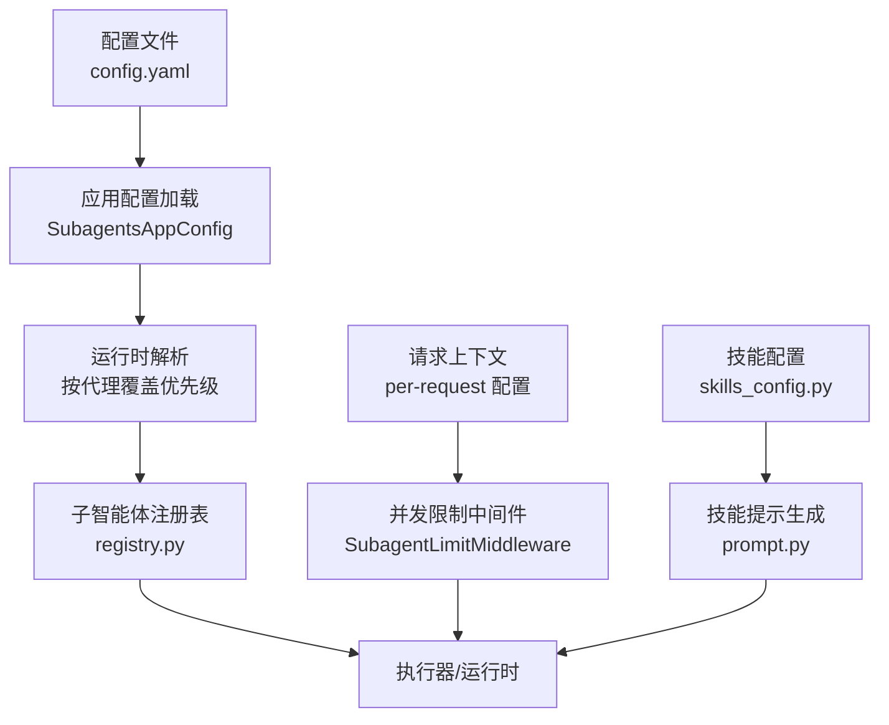
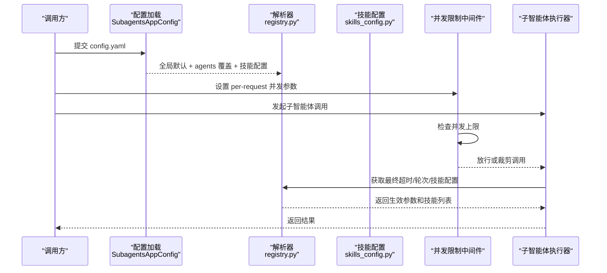
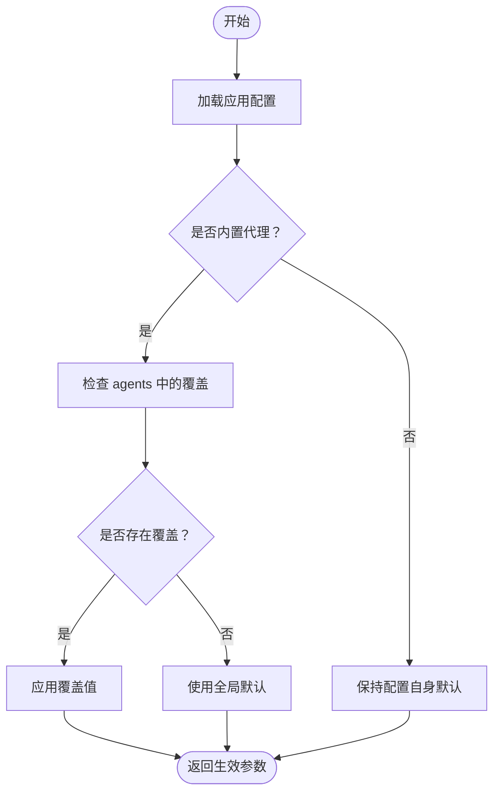
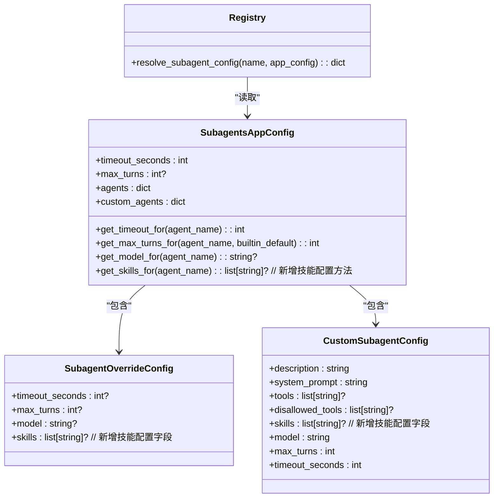

# 子智能体配置

<cite>
**本文引用的文件**
- [subagents_config.py](file://backend/packages/harness/deerflow/config/subagents_config.py)
- [registry.py](file://backend/packages/harness/deerflow/subagents/registry.py)
- [subagent_limit_middleware.py](file://backend/packages/harness/deerflow/agents/middlewares/subagent_limit_middleware.py)
- [test_subagent_timeout_config.py](file://backend/tests/test_subagent_timeout_config.py)
- [test_subagent_limit_middleware.py](file://backend/tests/test_subagent_limit_middleware.py)
- [test_subagent_skills_config.py](file://backend/tests/test_subagent_skills_config.py)
- [subagents.mdx](file://frontend/src/content/en/harness/subagents.mdx)
- [general_purpose.py](file://backend/packages/harness/deerflow/subagents/builtins/general_purpose.py)
- [bash_agent.py](file://backend/packages/harness/deerflow/subagents/builtins/bash_agent.py)
- [config.py](file://backend/packages/harness/deerflow/subagents/config.py)
- [prompt.py](file://backend/packages/harness/deerflow/agents/lead_agent/prompt.py)
</cite>

## 更新摘要
**所做更改**
- 新增每子智能体技能配置支持，包括技能白名单、None值（所有技能）和[]值（无技能）的配置选项
- 更新配置模型以支持skills字段的完整功能
- 增强注册表解析逻辑以处理技能配置覆盖
- 扩展测试用例以验证技能配置的各种场景

## 目录
1. [简介](#简介)
2. [项目结构](#项目结构)
3. [核心组件](#核心组件)
4. [架构总览](#架构总览)
5. [详细组件分析](#详细组件分析)
6. [技能配置详解](#技能配置详解)
7. [依赖关系分析](#依赖关系分析)
8. [性能考量](#性能考量)
9. [故障排查指南](#故障排查指南)
10. [结论](#结论)
11. [附录：配置示例与最佳实践](#附录配置示例与最佳实践)

## 简介
本文件面向 DeerFlow 的子智能体（Subagent）配置系统，系统性阐述以下主题：
- 配置文件结构与默认值
- 运行时参数解析与优先级（全局默认、按代理覆盖）
- 超时控制与最大轮次限制
- 技能配置管理（技能白名单、继承机制）
- 并发调用限制与中间件行为
- 动态配置更新策略与验证约束
- 面向不同任务类型的参数调优建议

**更新** 系统现已支持每子智能体级别的技能配置，包括技能白名单、None值（继承所有技能）和[]值（禁用所有技能）的完整配置选项。

目标是帮助读者在不深入源码的情况下，也能正确地为不同场景配置子智能体，确保稳定性与性能。

## 项目结构
与子智能体配置相关的关键位置如下：
- 后端配置定义与解析：backend/packages/harness/deerflow/config/subagents_config.py
- 子智能体注册与运行时参数应用：backend/packages/harness/deerflow/subagents/registry.py
- 并发限制中间件：backend/packages/harness/deerflow/agents/middlewares/subagent_limit_middleware.py
- 技能配置系统：backend/packages/harness/deerflow/config/skills_config.py
- 前端文档与示例：frontend/src/content/en/harness/subagents.mdx
- 测试用例（验证默认值、覆盖规则、错误处理、技能配置）：backend/tests/test_subagent_timeout_config.py、backend/tests/test_subagent_limit_middleware.py、backend/tests/test_subagent_skills_config.py
- 内置子智能体配置：backend/packages/harness/deerflow/subagents/builtins/
- 子智能体核心配置：backend/packages/harness/deerflow/subagents/config.py
- 技能提示生成：backend/packages/harness/deerflow/agents/lead_agent/prompt.py



**图表来源**
- [subagents_config.py:70-120](file://backend/packages/harness/deerflow/config/subagents_config.py#L70-L120)
- [registry.py:72-90](file://backend/packages/harness/deerflow/subagents/registry.py#L72-L90)
- [subagent_limit_middleware.py:1-200](file://backend/packages/harness/deerflow/agents/middlewares/subagent_limit_middleware.py#L1-L200)
- [subagents.mdx:63-100](file://frontend/src/content/en/harness/subagents.mdx#L63-L100)
- [skills_config.py:16-73](file://backend/packages/harness/deerflow/config/skills_config.py#L16-L73)
- [prompt.py:605-623](file://backend/packages/harness/deerflow/agents/lead_agent/prompt.py#L605-L623)

## 核心组件
- 应用配置模型 SubagentsAppConfig：定义全局超时、最大轮次、按代理覆盖映射等字段，并提供运行时解析接口。
- 覆盖配置模型 SubagentOverrideConfig：支持对单个子智能体的超时、最大轮次、模型、技能等进行覆盖。
- 自定义子智能体配置 CustomSubagentConfig：支持用户定义的子智能体类型，包含技能配置。
- 注册表解析逻辑：在运行时根据配置与内置/自定义代理类型，选择最终生效的超时、轮次和技能配置。
- 并发限制中间件 SubagentLimitMiddleware：控制一次会话中并行调用子智能体的数量上限。
- 技能配置系统：管理技能存储路径、容器挂载和技能过滤机制。
- 前端文档示例：提供 YAML 配置样例与并发限制说明。

**更新** 新增技能配置支持，包括技能白名单、None值（继承所有技能）和[]值（禁用所有技能）的完整功能。

**章节来源**
- [subagents_config.py:9-188](file://backend/packages/harness/deerflow/config/subagents_config.py#L9-L188)
- [registry.py:72-90](file://backend/packages/harness/deerflow/subagents/registry.py#L72-L90)
- [subagent_limit_middleware.py:1-200](file://backend/packages/harness/deerflow/agents/middlewares/subagent_limit_middleware.py#L1-L200)
- [subagents.mdx:63-100](file://frontend/src/content/en/harness/subagents.mdx#L63-L100)
- [config.py:10-57](file://backend/packages/harness/deerflow/subagents/config.py#L10-L57)
- [skills_config.py:16-73](file://backend/packages/harness/deerflow/config/skills_config.py#L16-L73)

## 架构总览
下图展示了从配置到运行时参数应用的整体流程，以及并发限制中间件和技能配置的作用点。



**图表来源**
- [subagents_config.py:70-120](file://backend/packages/harness/deerflow/config/subagents_config.py#L70-L120)
- [registry.py:72-90](file://backend/packages/harness/deerflow/subagents/registry.py#L72-L90)
- [subagent_limit_middleware.py:1-200](file://backend/packages/harness/deerflow/agents/middlewares/subagent_limit_middleware.py#L1-L200)
- [skills_config.py:16-73](file://backend/packages/harness/deerflow/config/skills_config.py#L16-L73)

## 详细组件分析

### 配置模型与默认值
- 全局默认
  - 默认超时：以秒为单位的全局默认值
  - 最大轮次：可为空表示不强制
  - 技能配置：默认为None，表示继承所有启用的技能
- 按代理覆盖
  - 通过 agents 映射为特定子智能体设置超时、最大轮次、模型和技能
  - 覆盖项允许部分缺失；未设置的项回退至全局默认
- 字段约束
  - 超时与最大轮次必须为正数
  - 模型名允许任意非空字符串（空串会被拒绝）
  - 技能配置支持三种状态：None（继承）、空列表（禁用）、技能列表（白名单）

**更新** 新增技能配置字段，支持完整的技能管理机制。

**章节来源**
- [subagents_config.py:9-188](file://backend/packages/harness/deerflow/config/subagents_config.py#L9-L188)
- [test_subagent_timeout_config.py:48-126](file://backend/tests/test_subagent_timeout_config.py#L48-L126)
- [test_subagent_skills_config.py:38-596](file://backend/tests/test_subagent_skills_config.py#L38-L596)

### 运行时解析与优先级
- 解析步骤
  - 读取应用配置中的全局默认与 agents 覆盖
  - 判断当前子智能体是否为内置代理
  - 若存在显式覆盖则优先使用；否则内置代理使用全局默认；自定义代理保留其自身默认
- 参数生效顺序
  - 按代理覆盖 > 全局默认（仅内置代理）> 配置自身的默认值
- 日志与调试
  - 当发生覆盖时会记录日志，便于排障



**图表来源**
- [registry.py:72-90](file://backend/packages/harness/deerflow/subagents/registry.py#L72-L90)

**章节来源**
- [registry.py:72-90](file://backend/packages/harness/deerflow/subagents/registry.py#L72-L90)

### 并发限制中间件
- 控制维度
  - 是否启用子智能体委派
  - 单次会话中最大并行调用数
- 行为特征
  - 当调用数超过上限时，中间件会裁剪多余的调用请求
  - 该限制为请求级配置，可在每次调用前设置

**章节来源**
- [subagent_limit_middleware.py:1-200](file://backend/packages/harness/deerflow/agents/middlewares/subagent_limit_middleware.py#L1-L200)
- [subagents.mdx:91-98](file://frontend/src/content/en/harness/subagents.mdx#L91-L98)

### 前端文档示例与说明
- 提供了完整的 YAML 配置示例，包含全局超时、可选最大轮次、按代理覆盖
- 强调按代理覆盖优先于全局默认
- 对并发限制进行了说明

**章节来源**
- [subagents.mdx:63-100](file://frontend/src/content/en/harness/subagents.mdx#L63-L100)

## 技能配置详解

### 技能配置模型
- SubagentOverrideConfig.skills：支持三种配置模式
  - None：继承所有启用的技能（默认行为）
  - []：禁用所有技能（无技能可用）
  - ["skill1", "skill2"]：技能白名单，仅允许指定技能
- CustomSubagentConfig.skills：与覆盖配置相同的行为模式
- SubagentConfig.skills：内置子智能体的技能配置，默认为None

### 技能配置解析流程
- 应用配置加载时，技能配置被解析为SubagentsAppConfig对象
- 注册表在获取子智能体配置时，调用get_skills_for()获取技能覆盖
- 如果存在技能覆盖，则应用到子智能体配置中
- 未设置技能时，默认继承所有启用的技能

### 技能过滤机制
- 技能白名单：仅允许指定的技能参与子智能体执行
- None值：继承父级或全局的技能配置
- 空列表：完全禁用技能，子智能体只能使用工具而非技能

```mermaid
flowchart TD
SKL_START["技能配置开始"] --> CHECK_OVERRIDE{"检查代理覆盖"}
CHECK_OVERRIDE --> |有覆盖| APPLY_OVERRIDE["应用技能覆盖"]
CHECK_OVERRIDE --> |无覆盖| USE_DEFAULT["使用默认配置"]
APPLY_OVERRIDE --> CHECK_TYPE{"覆盖类型判断"}
CHECK_TYPE --> |None| INHERIT_ALL["继承所有技能"]
CHECK_TYPE --> |[]| DISABLE_ALL["禁用所有技能"]
CHECK_TYPE --> |["skill1","skill2"]| WHITELIST["应用技能白名单"]
INHERIT_ALL --> RESULT["返回技能配置"]
DISABLE_ALL --> RESULT
WHITELIST --> RESULT
USE_DEFAULT --> RESULT
```

**图表来源**
- [subagents_config.py:130-142](file://backend/packages/harness/deerflow/config/subagents_config.py#L130-L142)
- [registry.py:101-105](file://backend/packages/harness/deerflow/subagents/registry.py#L101-L105)

**章节来源**
- [subagents_config.py:28-31](file://backend/packages/harness/deerflow/config/subagents_config.py#L28-L31)
- [subagents_config.py:51-54](file://backend/packages/harness/deerflow/config/subagents_config.py#L51-L54)
- [subagents_config.py:130-142](file://backend/packages/harness/deerflow/config/subagents_config.py#L130-L142)
- [config.py:32](file://backend/packages/harness/deerflow/subagents/config.py#L32)
- [registry.py:101-105](file://backend/packages/harness/deerflow/subagents/registry.py#L101-L105)
- [test_subagent_skills_config.py:38-596](file://backend/tests/test_subagent_skills_config.py#L38-L596)

## 依赖关系分析
- 配置层
  - SubagentsAppConfig 依赖 Pydantic BaseModel，用于字段校验与序列化
  - SubagentOverrideConfig 作为字典映射的结构化载体，支持技能配置
  - CustomSubagentConfig 支持用户定义的子智能体，包含技能配置
- 运行时层
  - registry.py 在子智能体实例化阶段读取应用配置并计算最终参数，包括技能配置
- 中间件层
  - SubagentLimitMiddleware 在请求进入执行器之前进行并发裁剪
- 技能配置层
  - skills_config.py 管理技能存储路径和容器挂载
  - prompt.py 使用技能配置生成技能提示



**图表来源**
- [subagents_config.py:9-188](file://backend/packages/harness/deerflow/config/subagents_config.py#L9-L188)
- [registry.py:72-90](file://backend/packages/harness/deerflow/subagents/registry.py#L72-L90)

**章节来源**
- [subagents_config.py:9-188](file://backend/packages/harness/deerflow/config/subagents_config.py#L9-L188)
- [registry.py:72-90](file://backend/packages/harness/deerflow/subagents/registry.py#L72-L90)

## 性能考量
- 超时设置
  - 太短可能导致复杂任务被过早终止
  - 太长可能占用资源过久，影响吞吐
- 最大轮次
  - 控制对话/推理深度，避免无界增长
- 技能配置影响
  - 技能白名单可以减少不必要的技能加载开销
  - 禁用技能可以提高安全性但可能限制功能
  - 继承技能配置最灵活但可能增加初始化时间
- 并发限制
  - 过高并发可能放大资源争用，导致整体延迟上升
  - 合理的上限有助于稳定系统响应
- 覆盖策略
  - 仅对必要代理设置覆盖，减少分支判断开销

## 故障排查指南
- 常见问题与定位
  - 超时/轮次为 0 或负数：触发校验异常，需修正配置
  - 模型名为空串：被拒绝，应提供有效模型标识
  - 技能配置异常：检查技能名称是否存在于技能库中
  - 按代理覆盖未生效：确认覆盖键是否与代理名称一致，以及是否为内置代理
  - 并发过多被裁剪：检查 per-request 的并发上限设置
- 参考测试用例
  - 超时与轮次默认值与覆盖规则
  - 技能配置的各种场景测试（None、[]、技能列表）
  - 错误输入的拒绝行为
  - 并发限制中间件的行为验证

**章节来源**
- [test_subagent_timeout_config.py:48-126](file://backend/tests/test_subagent_timeout_config.py#L48-L126)
- [test_subagent_limit_middleware.py:1-200](file://backend/tests/test_subagent_limit_middleware.py#L1-L200)
- [test_subagent_skills_config.py:38-596](file://backend/tests/test_subagent_skills_config.py#L38-L596)

## 结论
子智能体配置系统通过"全局默认 + 按代理覆盖"的双层策略，结合运行时解析与并发限制中间件，实现了灵活且可控的参数管理。系统现已支持每子智能体级别的技能配置，包括技能白名单、None值（继承所有技能）和[]值（禁用所有技能）的完整功能。系统已简化为专注于基础执行能力，移除了复杂的跟踪功能，使配置更加直观。遵循本文档的默认值、优先级与调优建议，可在保证稳定性的同时提升执行效率与资源利用率。

## 附录：配置示例与最佳实践

### 技能配置示例
```yaml
subagents:
  # 全局默认配置
  timeout_seconds: 900
  
  # 技能配置示例
  agents:
    general-purpose:
      # 继承所有技能（None值）
      skills: null
      
    bash:
      # 禁用所有技能（空列表）
      skills: []
      
    data-analyzer:
      # 技能白名单
      skills: ["data-analysis", "visualization", "chart-visualization"]
```

### 最佳实践
- 为复杂任务（如多步推理、代码生成）设置较高的超时与最大轮次
- 为快速命令类任务设置较低的超时与较小并发
- 仅对确有差异的代理设置覆盖，避免过度碎片化
- 使用技能白名单精确控制子智能体的能力范围
- 定期基于实际负载观察中间件裁剪频率，动态调整并发上限
- 在生产环境中谨慎使用技能白名单，确保满足业务需求
- 对于安全敏感的应用，考虑使用空列表禁用技能以提高安全性

**章节来源**
- [subagents.mdx:63-100](file://frontend/src/content/en/harness/subagents.mdx#L63-L100)
- [test_subagent_skills_config.py:242-264](file://backend/tests/test_subagent_skills_config.py#L242-L264)
- [test_subagent_skills_config.py:404-435](file://backend/tests/test_subagent_skills_config.py#L404-L435)