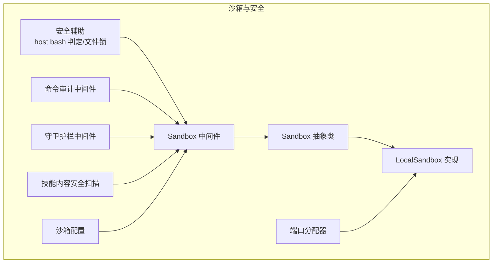
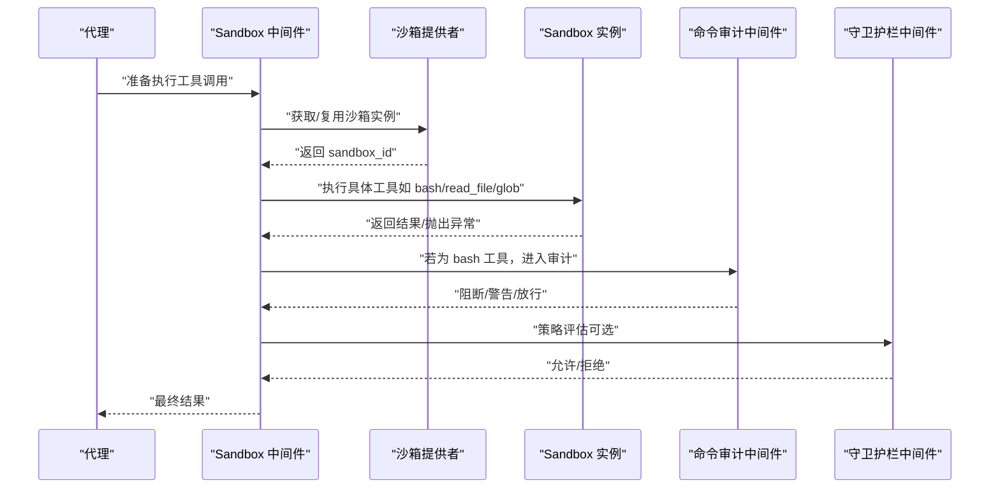
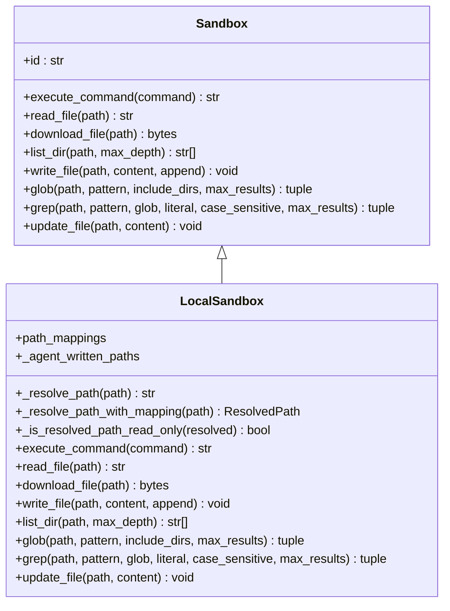
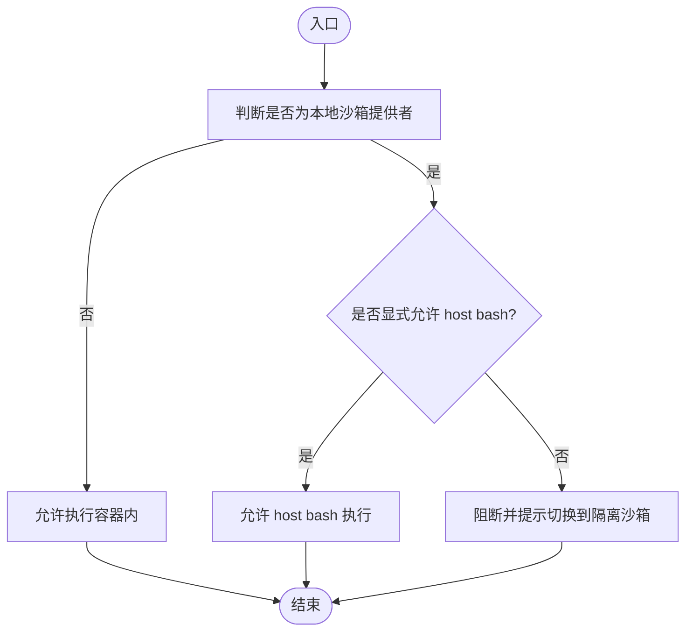
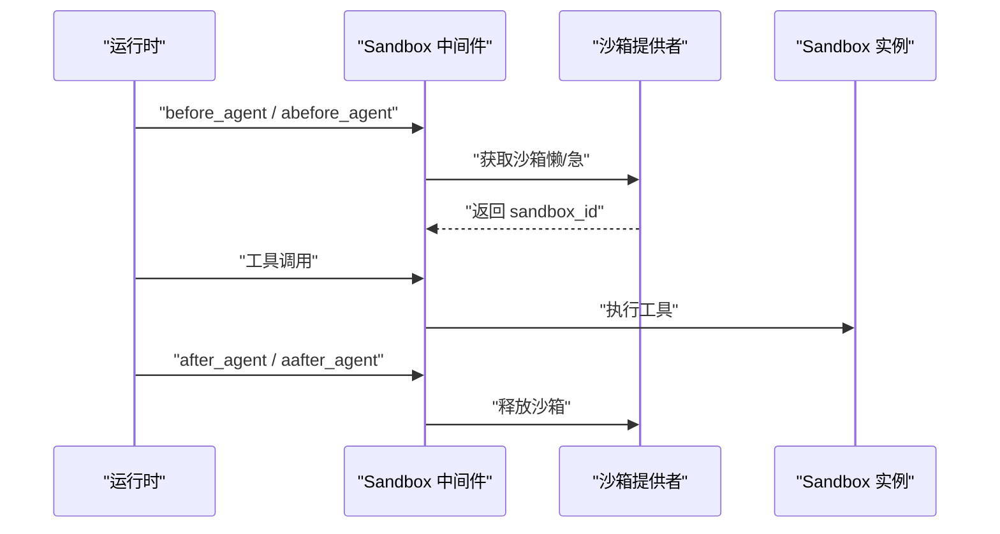
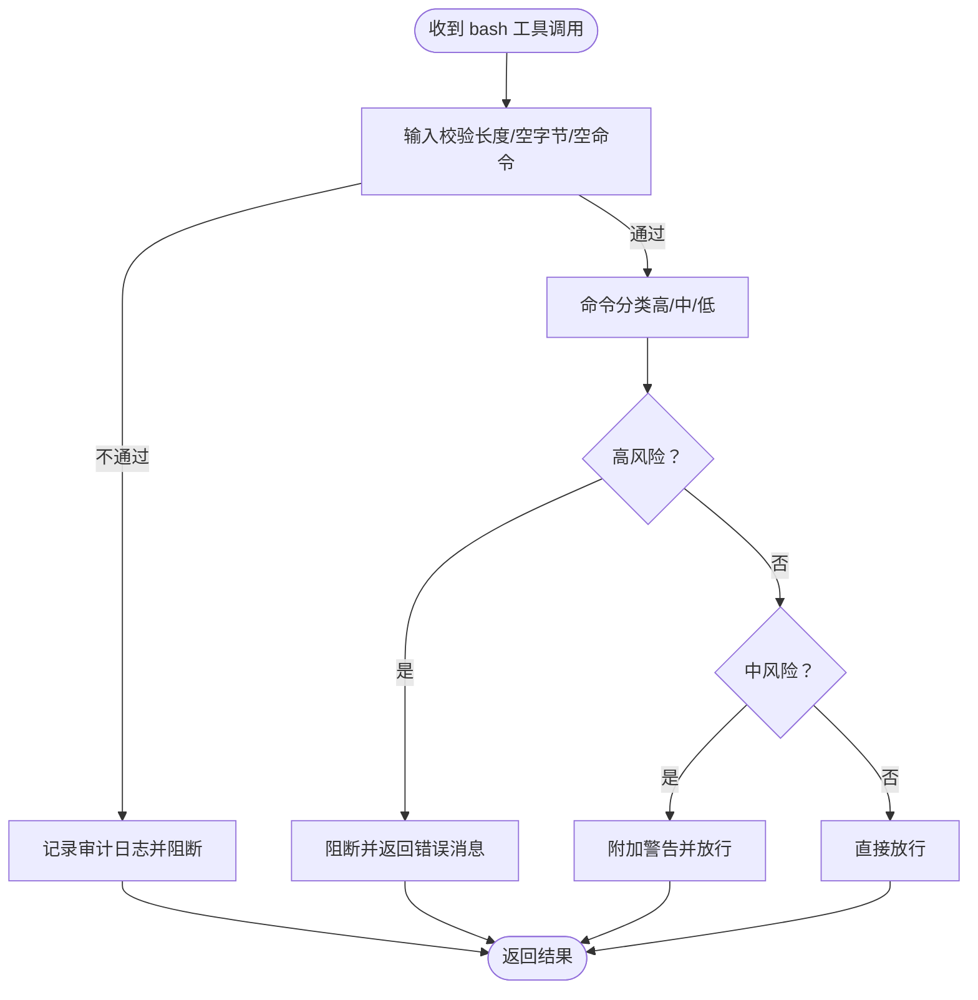
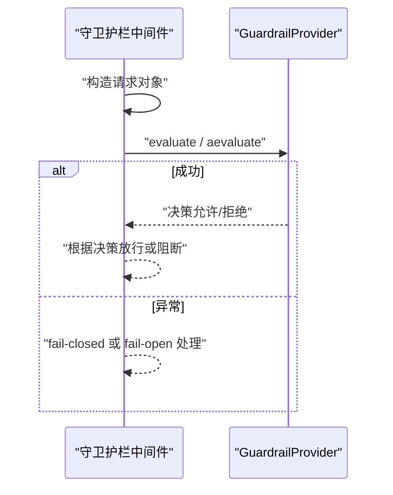
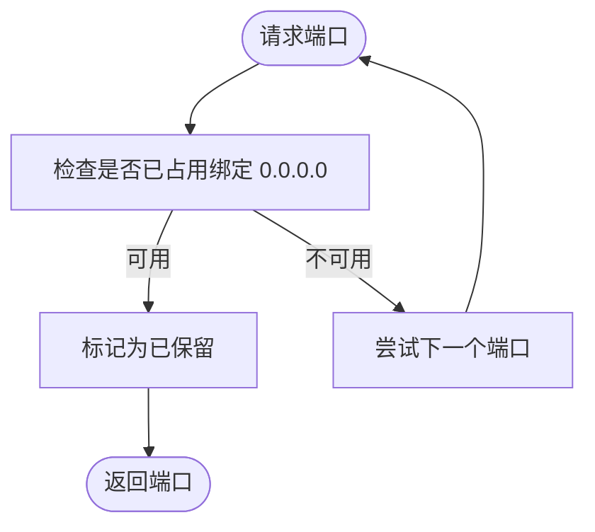
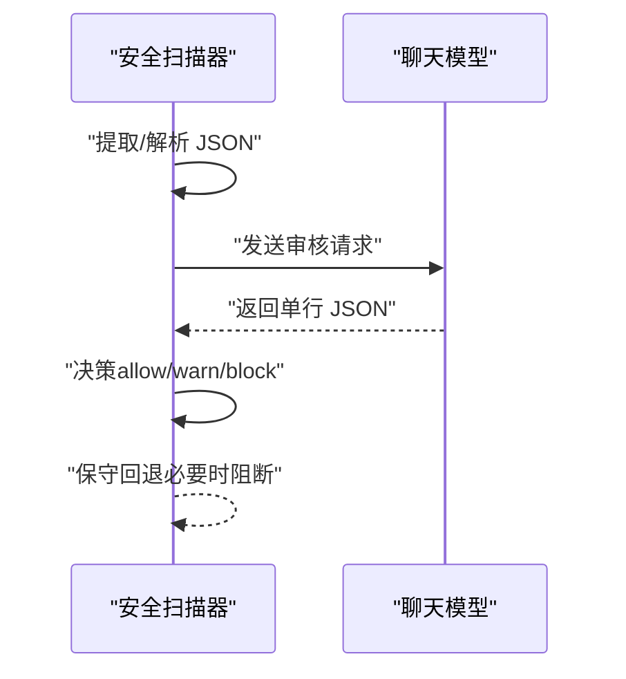
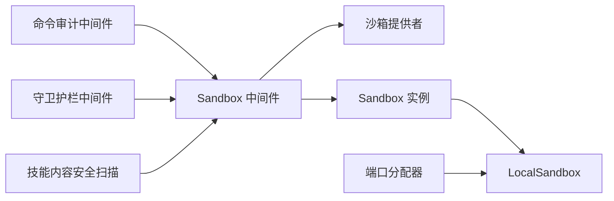

# 安全控制机制

<cite>
**本文引用的文件**   
- [backend/packages/harness/deerflow/sandbox/security.py](file://backend/packages/harness/deerflow/sandbox/security.py)
- [backend/packages/harness/deerflow/sandbox/file_operation_lock.py](file://backend/packages/harness/deerflow/sandbox/file_operation_lock.py)
- [backend/packages/harness/deerflow/sandbox/middleware.py](file://backend/packages/harness/deerflow/sandbox/middleware.py)
- [backend/packages/harness/deerflow/sandbox/sandbox.py](file://backend/packages/harness/deerflow/sandbox/sandbox.py)
- [backend/packages/harness/deerflow/sandbox/local/local_sandbox.py](file://backend/packages/harness/deerflow/sandbox/local/local_sandbox.py)
- [backend/packages/harness/deerflow/config/sandbox_config.py](file://backend/packages/harness/deerflow/config/sandbox_config.py)
- [backend/packages/harness/deerflow/agents/middlewares/sandbox_audit_middleware.py](file://backend/packages/harness/deerflow/agents/middlewares/sandbox_audit_middleware.py)
- [backend/packages/harness/deerflow/guardrails/middleware.py](file://backend/packages/harness/deerflow/guardrails/middleware.py)
- [backend/packages/harness/deerflow/skills/security_scanner.py](file://backend/packages/harness/deerflow/skills/security_scanner.py)
- [backend/packages/harness/deerflow/utils/network.py](file://backend/packages/harness/deerflow/utils/network.py)
</cite>

## 目录
1. [引言](#引言)
2. [项目结构](#项目结构)
3. [核心组件](#核心组件)
4. [架构总览](#架构总览)
5. [详细组件分析](#详细组件分析)
6. [依赖分析](#依赖分析)
7. [性能考虑](#性能考虑)
8. [故障排查指南](#故障排查指南)
9. [结论](#结论)
10. [附录](#附录)

## 引言
本文件系统性梳理 DeerFlow 沙箱安全控制机制，覆盖文件操作锁、中间件安全控制、命令审计与阻断、网络端口分配安全、资源输出截断、技能内容安全扫描、守卫护栏（Guardrails）策略执行等。文档同时提供配置方法、审计日志记录规范、异常行为检测要点、安全事件响应流程、最佳实践与漏洞防护建议，以及可落地的安全审计清单。

## 项目结构
围绕“沙箱”与“安全”的关键模块分布如下：
- 沙箱抽象与实现：Sandbox 抽象类、本地沙箱 LocalSandbox、沙箱中间件、沙箱提供者与配置
- 安全辅助：host bash 能力判定、文件操作锁
- 中间件安全：命令审计中间件、守卫护栏中间件
- 网络安全：端口分配器（避免冲突）
- 内容安全：技能内容安全扫描
- 配置：沙箱配置项（输出截断、挂载、环境变量、超时等）

图示来源
- [backend/packages/harness/deerflow/sandbox/sandbox.py:1-113](file://backend/packages/harness/deerflow/sandbox/sandbox.py#L1-L113)
- [backend/packages/harness/deerflow/sandbox/local/local_sandbox.py:1-478](file://backend/packages/harness/deerflow/sandbox/local/local_sandbox.py#L1-L478)
- [backend/packages/harness/deerflow/sandbox/middleware.py:1-129](file://backend/packages/harness/deerflow/sandbox/middleware.py#L1-L129)
- [backend/packages/harness/deerflow/sandbox/security.py:1-46](file://backend/packages/harness/deerflow/sandbox/security.py#L1-L46)
- [backend/packages/harness/deerflow/sandbox/file_operation_lock.py:1-28](file://backend/packages/harness/deerflow/sandbox/file_operation_lock.py#L1-L28)
- [backend/packages/harness/deerflow/agents/middlewares/sandbox_audit_middleware.py:1-364](file://backend/packages/harness/deerflow/agents/middlewares/sandbox_audit_middleware.py#L1-L364)
- [backend/packages/harness/deerflow/guardrails/middleware.py:1-99](file://backend/packages/harness/deerflow/guardrails/middleware.py#L1-L99)
- [backend/packages/harness/deerflow/utils/network.py:1-140](file://backend/packages/harness/deerflow/utils/network.py#L1-L140)
- [backend/packages/harness/deerflow/config/sandbox_config.py:1-84](file://backend/packages/harness/deerflow/config/sandbox_config.py#L1-L84)

章节来源
- [backend/packages/harness/deerflow/sandbox/sandbox.py:1-113](file://backend/packages/harness/deerflow/sandbox/sandbox.py#L1-L113)
- [backend/packages/harness/deerflow/sandbox/local/local_sandbox.py:1-478](file://backend/packages/harness/deerflow/sandbox/local/local_sandbox.py#L1-L478)
- [backend/packages/harness/deerflow/sandbox/middleware.py:1-129](file://backend/packages/harness/deerflow/sandbox/middleware.py#L1-L129)
- [backend/packages/harness/deerflow/sandbox/security.py:1-46](file://backend/packages/harness/deerflow/sandbox/security.py#L1-L46)
- [backend/packages/harness/deerflow/sandbox/file_operation_lock.py:1-28](file://backend/packages/harness/deerflow/sandbox/file_operation_lock.py#L1-L28)
- [backend/packages/harness/deerflow/agents/middlewares/sandbox_audit_middleware.py:1-364](file://backend/packages/harness/deerflow/agents/middlewares/sandbox_audit_middleware.py#L1-L364)
- [backend/packages/harness/deerflow/guardrails/middleware.py:1-99](file://backend/packages/harness/deerflow/guardrails/middleware.py#L1-L99)
- [backend/packages/harness/deerflow/utils/network.py:1-140](file://backend/packages/harness/deerflow/utils/network.py#L1-L140)
- [backend/packages/harness/deerflow/config/sandbox_config.py:1-84](file://backend/packages/harness/deerflow/config/sandbox_config.py#L1-L84)

## 核心组件
- 沙箱抽象与实现
  - Sandbox 抽象类定义统一接口，确保不同后端（本地/容器）一致的安全边界
  - LocalSandbox 实现路径解析、只读挂载、输出路径反解析、命令执行与文件操作
- 安全辅助
  - host bash 能力判定：在本地沙箱提供者上默认禁用 host bash，除非显式允许
  - 文件操作锁：按 sandbox+路径维度的线程锁，避免并发写冲突
- 中间件安全
  - Sandbox 中间件：生命周期管理、懒加载/急加载、跨轮次复用、异步释放
  - 命令审计中间件：高/中风险正则规则、复合命令拆分、审计日志、阻断与告警
  - 守卫护栏中间件：调用前策略评估，失败闭合或宽松处理
- 网络安全
  - 端口分配器：线程安全、避免 Docker 绑定冲突、上下文自动回收
- 内容安全
  - 技能内容安全扫描：JSON 提取与解析、LLM 审核、保守回退策略
- 配置
  - 沙箱配置：提供者类路径、host bash 开关、镜像/端口/副本/空闲超时、挂载与环境变量、输出截断上限

章节来源
- [backend/packages/harness/deerflow/sandbox/sandbox.py:1-113](file://backend/packages/harness/deerflow/sandbox/sandbox.py#L1-L113)
- [backend/packages/harness/deerflow/sandbox/local/local_sandbox.py:1-478](file://backend/packages/harness/deerflow/sandbox/local/local_sandbox.py#L1-L478)
- [backend/packages/harness/deerflow/sandbox/security.py:1-46](file://backend/packages/harness/deerflow/sandbox/security.py#L1-L46)
- [backend/packages/harness/deerflow/sandbox/file_operation_lock.py:1-28](file://backend/packages/harness/deerflow/sandbox/file_operation_lock.py#L1-L28)
- [backend/packages/harness/deerflow/sandbox/middleware.py:1-129](file://backend/packages/harness/deerflow/sandbox/middleware.py#L1-L129)
- [backend/packages/harness/deerflow/agents/middlewares/sandbox_audit_middleware.py:1-364](file://backend/packages/harness/deerflow/agents/middlewares/sandbox_audit_middleware.py#L1-L364)
- [backend/packages/harness/deerflow/guardrails/middleware.py:1-99](file://backend/packages/harness/deerflow/guardrails/middleware.py#L1-L99)
- [backend/packages/harness/deerflow/utils/network.py:1-140](file://backend/packages/harness/deerflow/utils/network.py#L1-L140)
- [backend/packages/harness/deerflow/skills/security_scanner.py:1-110](file://backend/packages/harness/deerflow/skills/security_scanner.py#L1-L110)
- [backend/packages/harness/deerflow/config/sandbox_config.py:1-84](file://backend/packages/harness/deerflow/config/sandbox_config.py#L1-L84)

## 架构总览
下图展示从工具调用到沙箱执行、再到安全控制与审计的整体流程。

图示来源
- [backend/packages/harness/deerflow/sandbox/middleware.py:1-129](file://backend/packages/harness/deerflow/sandbox/middleware.py#L1-L129)
- [backend/packages/harness/deerflow/agents/middlewares/sandbox_audit_middleware.py:1-364](file://backend/packages/harness/deerflow/agents/middlewares/sandbox_audit_middleware.py#L1-L364)
- [backend/packages/harness/deerflow/guardrails/middleware.py:1-99](file://backend/packages/harness/deerflow/guardrails/middleware.py#L1-L99)
- [backend/packages/harness/deerflow/sandbox/sandbox.py:1-113](file://backend/packages/harness/deerflow/sandbox/sandbox.py#L1-L113)

## 详细组件分析

### 沙箱抽象与实现
- 设计要点
  - 抽象类统一命令执行、文件读写、目录遍历、搜索等能力，便于替换不同后端
  - LocalSandbox 实现路径映射、只读挂载、输出路径反解析、命令执行与超时控制
- 安全特性
  - 下载限制：仅允许虚拟路径前缀范围内的下载，并设置最大文件大小
  - 只读保护：写入/更新前检查挂载只读属性，防止越权修改
  - 路径逃逸防护：解析容器路径时校验相对位置，拒绝越界访问
  - 输出路径还原：对代理生成的内容进行本地路径反解析，避免泄露宿主真实路径
- 性能与健壮性
  - 命令执行超时控制
  - 多轮对话复用同一沙箱实例，减少创建销毁开销

图示来源
- [backend/packages/harness/deerflow/sandbox/sandbox.py:1-113](file://backend/packages/harness/deerflow/sandbox/sandbox.py#L1-L113)
- [backend/packages/harness/deerflow/sandbox/local/local_sandbox.py:1-478](file://backend/packages/harness/deerflow/sandbox/local/local_sandbox.py#L1-L478)

章节来源
- [backend/packages/harness/deerflow/sandbox/sandbox.py:1-113](file://backend/packages/harness/deerflow/sandbox/sandbox.py#L1-L113)
- [backend/packages/harness/deerflow/sandbox/local/local_sandbox.py:1-478](file://backend/packages/harness/deerflow/sandbox/local/local_sandbox.py#L1-L478)

### 安全辅助：host bash 能力与文件操作锁
- host bash 能力判定
  - 默认禁止在本地沙箱提供者上直接执行 host bash，除非显式开启
  - 提供清晰的错误提示，引导用户切换到隔离沙箱或在完全可信环境中启用
- 文件操作锁
  - 基于弱引用字典缓存锁，避免长进程内存泄漏
  - 按 sandbox 实例+路径键值获取锁，保证并发写一致性

图示来源
- [backend/packages/harness/deerflow/sandbox/security.py:1-46](file://backend/packages/harness/deerflow/sandbox/security.py#L1-L46)
- [backend/packages/harness/deerflow/sandbox/file_operation_lock.py:1-28](file://backend/packages/harness/deerflow/sandbox/file_operation_lock.py#L1-L28)

章节来源
- [backend/packages/harness/deerflow/sandbox/security.py:1-46](file://backend/packages/harness/deerflow/sandbox/security.py#L1-L46)
- [backend/packages/harness/deerflow/sandbox/file_operation_lock.py:1-28](file://backend/packages/harness/deerflow/sandbox/file_operation_lock.py#L1-L28)

### 中间件安全：Sandbox 中间件
- 生命周期管理
  - 支持懒加载（首次工具调用时获取）与急加载（首次代理调用时获取）
  - 同一线程内复用同一沙箱实例，避免频繁创建销毁
  - 异步释放，避免阻塞事件循环
- 日志与可观测性
  - 获取/释放沙箱时记录日志，便于审计与排障

图示来源
- [backend/packages/harness/deerflow/sandbox/middleware.py:1-129](file://backend/packages/harness/deerflow/sandbox/middleware.py#L1-L129)

章节来源
- [backend/packages/harness/deerflow/sandbox/middleware.py:1-129](file://backend/packages/harness/deerflow/sandbox/middleware.py#L1-L129)

### 命令审计中间件：高/中风险识别与阻断
- 规则体系
  - 高风险：删除根目录、动态链接劫持、覆盖系统二进制、fork 炸弹、管道执行等
  - 中风险：权限修改、安装包、sudo/su、PATH 修改等
- 分析策略
  - 全命令扫描优先捕获多语句攻击模式；随后拆分复合命令逐条评分
  - 使用正则与 shlex 解析双重校验，避免绕过
- 行为与审计
  - 阻断高风险命令，返回错误消息；中风险命令放行但附加警告
  - 结构化审计日志包含时间戳、线程 ID、命令摘要与判定结果

图示来源
- [backend/packages/harness/deerflow/agents/middlewares/sandbox_audit_middleware.py:1-364](file://backend/packages/harness/deerflow/agents/middlewares/sandbox_audit_middleware.py#L1-L364)

章节来源
- [backend/packages/harness/deerflow/agents/middlewares/sandbox_audit_middleware.py:1-364](file://backend/packages/harness/deerflow/agents/middlewares/sandbox_audit_middleware.py#L1-L364)

### 守卫护栏中间件：策略评估与回退
- 评估流程
  - 构造请求对象（工具名、参数、代理标识、时间戳）
  - 同步/异步调用 GuardrailProvider 进行评估
  - Provider 异常时支持 fail-closed/fail-open 回退策略
- 拒绝处理
  - 返回错误 ToolMessage，便于代理自适应调整

图示来源
- [backend/packages/harness/deerflow/guardrails/middleware.py:1-99](file://backend/packages/harness/deerflow/guardrails/middleware.py#L1-L99)

章节来源
- [backend/packages/harness/deerflow/guardrails/middleware.py:1-99](file://backend/packages/harness/deerflow/guardrails/middleware.py#L1-L99)

### 网络安全：端口分配器
- 功能
  - 线程安全分配可用端口，避免 Docker 绑定冲突
  - 支持上下文管理器自动回收
- 安全意义
  - 避免并发容器启动导致的端口冲突与资源抢占

图示来源
- [backend/packages/harness/deerflow/utils/network.py:1-140](file://backend/packages/harness/deerflow/utils/network.py#L1-L140)

章节来源
- [backend/packages/harness/deerflow/utils/network.py:1-140](file://backend/packages/harness/deerflow/utils/network.py#L1-L140)

### 技能内容安全扫描
- 流程
  - 构造审核提示词与内容，调用 LLM 生成单行 JSON 决策
  - 解析 JSON，支持 Markdown 代码块包裹与大括号平衡提取
  - 不可解析或模型不可用时采用保守回退策略（阻断）
- 适用场景
  - 在将技能内容写入磁盘前进行安全筛查，阻断潜在危险内容

图示来源
- [backend/packages/harness/deerflow/skills/security_scanner.py:1-110](file://backend/packages/harness/deerflow/skills/security_scanner.py#L1-L110)

章节来源
- [backend/packages/harness/deerflow/skills/security_scanner.py:1-110](file://backend/packages/harness/deerflow/skills/security_scanner.py#L1-L110)

### 沙箱配置与资源使用监控
- 关键配置项
  - 提供者类路径、host bash 开关
  - 容器镜像、端口基座、副本数、空闲超时、挂载列表、环境变量
  - 输出截断上限：bash/read_file/ls 的最大字符数，超过则截断
- 资源监控建议
  - 结合空闲超时与副本上限控制并发与资源占用
  - 输出截断避免日志膨胀与敏感信息泄露
  - 挂载只读策略降低越权风险

章节来源
- [backend/packages/harness/deerflow/config/sandbox_config.py:1-84](file://backend/packages/harness/deerflow/config/sandbox_config.py#L1-L84)

## 依赖分析
- 组件耦合
  - Sandbox 中间件依赖沙箱提供者以获取/释放实例
  - 命令审计中间件与守卫护栏中间件均作用于工具调用阶段，彼此独立
  - LocalSandbox 依赖路径映射与只读策略，保障访问边界
- 外部依赖
  - 端口分配器依赖系统 socket 能力
  - 技能扫描依赖 LLM 模型调用

图示来源
- [backend/packages/harness/deerflow/sandbox/middleware.py:1-129](file://backend/packages/harness/deerflow/sandbox/middleware.py#L1-L129)
- [backend/packages/harness/deerflow/agents/middlewares/sandbox_audit_middleware.py:1-364](file://backend/packages/harness/deerflow/agents/middlewares/sandbox_audit_middleware.py#L1-L364)
- [backend/packages/harness/deerflow/guardrails/middleware.py:1-99](file://backend/packages/harness/deerflow/guardrails/middleware.py#L1-L99)
- [backend/packages/harness/deerflow/sandbox/local/local_sandbox.py:1-478](file://backend/packages/harness/deerflow/sandbox/local/local_sandbox.py#L1-L478)
- [backend/packages/harness/deerflow/utils/network.py:1-140](file://backend/packages/harness/deerflow/utils/network.py#L1-L140)
- [backend/packages/harness/deerflow/skills/security_scanner.py:1-110](file://backend/packages/harness/deerflow/skills/security_scanner.py#L1-L110)

## 性能考虑
- 懒加载与复用：Sandbox 中间件在多轮对话中复用同一实例，减少初始化成本
- 异步释放：避免阻塞事件循环，提升吞吐
- 输出截断：限制日志体量，兼顾可观测性与性能
- 端口分配：线程安全且快速探测，避免重复尝试

## 故障排查指南
- 命令被阻断
  - 检查审计日志中的判定结果与命令摘要，确认是否命中高风险规则
  - 尝试更安全的替代方案或调整工具参数
- 中风险警告
  - 注意输出中的警告提示，评估是否需要降级或改用受控方式
- 路径访问失败
  - 确认路径映射与只读挂载配置，避免越界访问
  - 检查下载范围是否受限于虚拟路径前缀
- 端口冲突
  - 使用端口分配器或调整端口范围，避免与 Docker 绑定冲突
- 守卫护栏异常
  - 若 Provider 抛出异常，检查 fail-closed/fail-open 配置与日志

章节来源
- [backend/packages/harness/deerflow/agents/middlewares/sandbox_audit_middleware.py:1-364](file://backend/packages/harness/deerflow/agents/middlewares/sandbox_audit_middleware.py#L1-L364)
- [backend/packages/harness/deerflow/sandbox/local/local_sandbox.py:1-478](file://backend/packages/harness/deerflow/sandbox/local/local_sandbox.py#L1-L478)
- [backend/packages/harness/deerflow/utils/network.py:1-140](file://backend/packages/harness/deerflow/utils/network.py#L1-L140)
- [backend/packages/harness/deerflow/guardrails/middleware.py:1-99](file://backend/packages/harness/deerflow/guardrails/middleware.py#L1-L99)

## 结论
DeerFlow 的沙箱安全控制通过“抽象边界 + 多层中间件 + 输出截断 + 端口安全 + 内容扫描”构建了完整的安全闭环。本地沙箱默认严格限制 host bash，配合命令审计与守卫护栏，既能满足灵活性又能有效降低风险。建议在生产环境默认启用所有安全中间件，并结合配置项进行资源与输出规模的精细化控制。

## 附录

### 安全配置清单（沙箱）
- 必填
  - 指定沙箱提供者类路径
- 建议启用
  - 输出截断：bash/read_file/ls 上限
  - 空闲超时与副本上限
  - 挂载只读策略
- 仅在可信环境启用
  - host bash 开关

章节来源
- [backend/packages/harness/deerflow/config/sandbox_config.py:1-84](file://backend/packages/harness/deerflow/config/sandbox_config.py#L1-L84)

### 审计日志字段建议
- 字段
  - 时间戳、线程 ID、工具名、命令摘要、判定结果、拒绝原因（如有）
- 记录位置
  - 标准日志输出，便于集中收集与检索

章节来源
- [backend/packages/harness/deerflow/agents/middlewares/sandbox_audit_middleware.py:1-364](file://backend/packages/harness/deerflow/agents/middlewares/sandbox_audit_middleware.py#L1-L364)

### 安全事件响应流程
- 发现高风险命令
  - 立即阻断并记录审计日志
  - 通知管理员并触发告警
- 中风险命令
  - 附加警告并持续观察后续行为
- Provider 异常
  - 根据 fail-closed/fail-open 策略处理，记录异常详情
- 路径逃逸/越权
  - 检查挂载与只读策略，修复配置并回滚变更

章节来源
- [backend/packages/harness/deerflow/agents/middlewares/sandbox_audit_middleware.py:1-364](file://backend/packages/harness/deerflow/agents/middlewares/sandbox_audit_middleware.py#L1-L364)
- [backend/packages/harness/deerflow/guardrails/middleware.py:1-99](file://backend/packages/harness/deerflow/guardrails/middleware.py#L1-L99)
- [backend/packages/harness/deerflow/sandbox/local/local_sandbox.py:1-478](file://backend/packages/harness/deerflow/sandbox/local/local_sandbox.py#L1-L478)

### 最佳实践与漏洞防护建议
- 默认最小权限
  - 禁用 host bash，优先使用隔离沙箱
  - 挂载目录尽量只读，限制写入范围
- 输入验证与输出截断
  - 对工具输入进行长度与格式约束
  - 控制日志与输出大小，避免信息泄露
- 端口与资源
  - 使用端口分配器避免冲突
  - 设置空闲超时与副本上限，防止资源耗尽
- 内容安全
  - 技能内容写入前进行安全扫描，保守回退
- 可观测性
  - 启用审计日志，定期巡检高/中风险事件