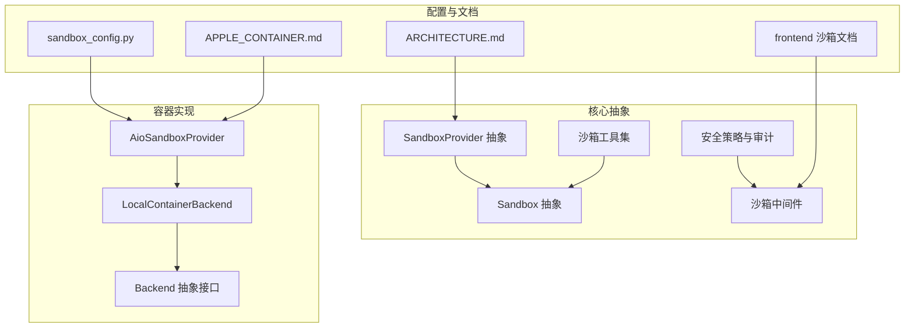
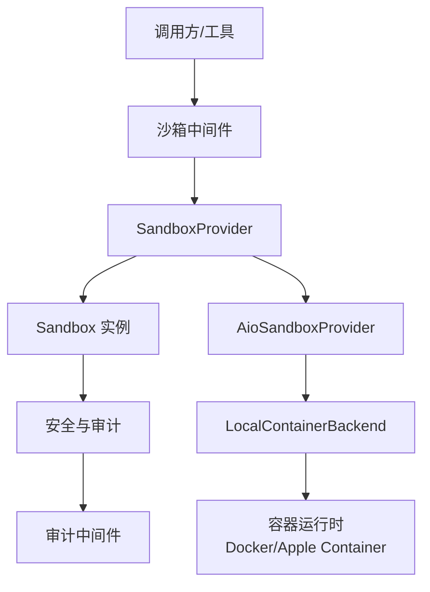
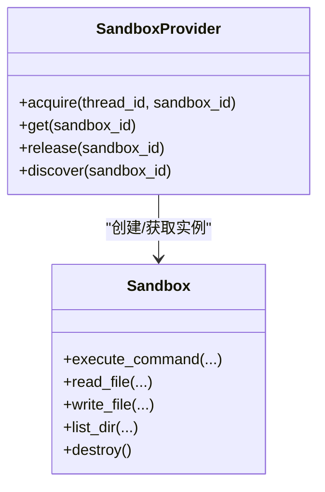
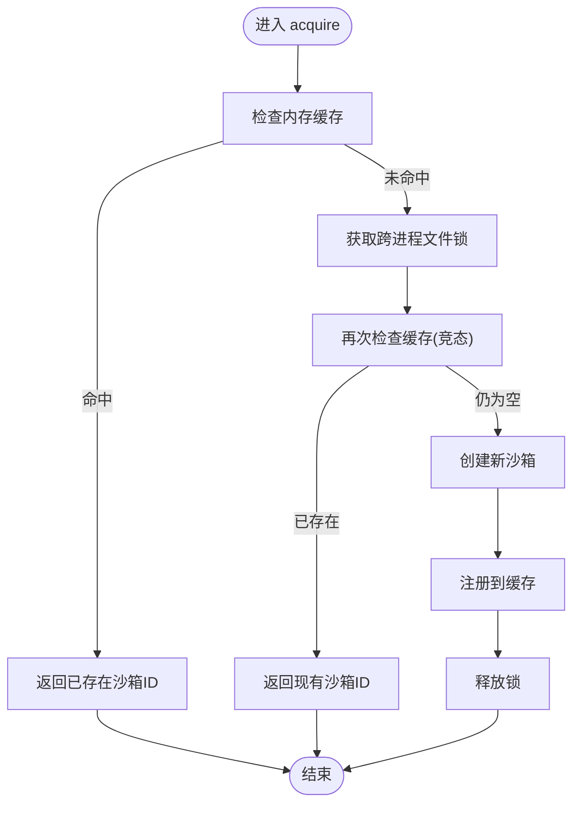
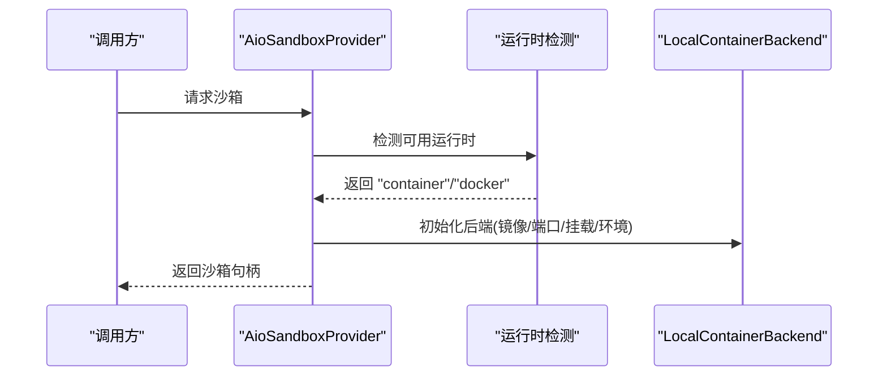
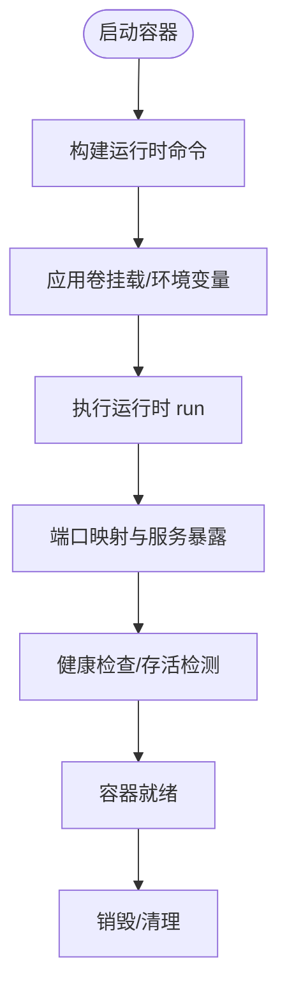
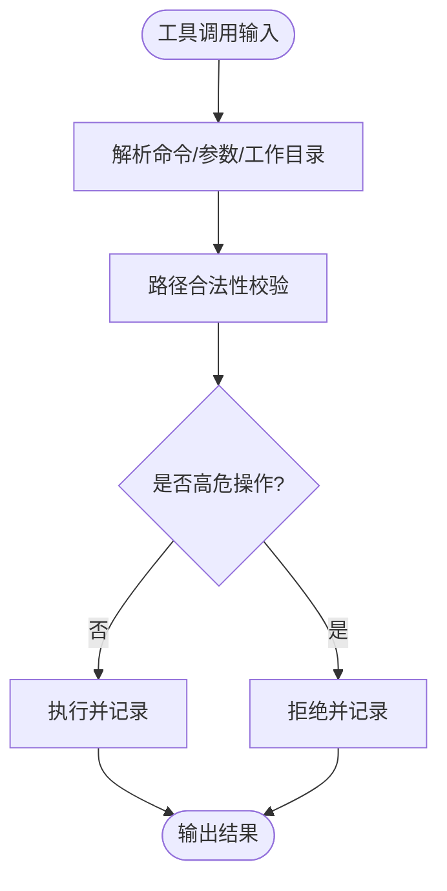
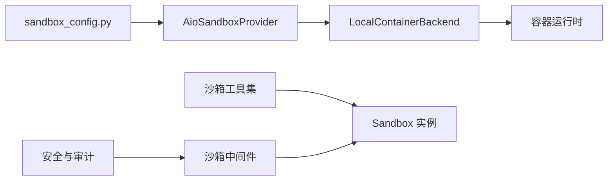

# 安全沙箱执行

<cite>
**本文引用的文件**
- [backend/packages/harness/deerflow/sandbox/sandbox.py](file://backend/packages/harness/deerflow/sandbox/sandbox.py)
- [backend/packages/harness/deerflow/sandbox/sandbox_provider.py](file://backend/packages/harness/deerflow/sandbox/sandbox_provider.py)
- [backend/packages/harness/deerflow/sandbox/tools.py](file://backend/packages/harness/deerflow/sandbox/tools.py)
- [backend/packages/harness/deerflow/sandbox/security.py](file://backend/packages/harness/deerflow/sandbox/security.py)
- [backend/packages/harness/deerflow/sandbox/middleware.py](file://backend/packages/harness/deerflow/sandbox/middleware.py)
- [backend/packages/harness/deerflow/config/sandbox_config.py](file://backend/packages/harness/deerflow/config/sandbox_config.py)
- [backend/packages/harness/deerflow/community/aio_sandbox/aio_sandbox_provider.py](file://backend/packages/harness/deerflow/community/aio_sandbox/aio_sandbox_provider.py)
- [backend/packages/harness/deerflow/community/aio_sandbox/local_backend.py](file://backend/packages/harness/deerflow/community/aio_sandbox/local_backend.py)
- [backend/packages/harness/deerflow/community/aio_sandbox/backend.py](file://backend/packages/harness/deerflow/community/aio_sandbox/backend.py)
- [backend/docs/APPLE_CONTAINER.md](file://backend/docs/APPLE_CONTAINER.md)
- [backend/docs/ARCHITECTURE.md](file://backend/docs/ARCHITECTURE.md)
- [frontend/src/content/en/harness/sandbox.mdx](file://frontend/src/content/en/harness/sandbox.mdx)
- [backend/tests/test_docker_sandbox_mode_detection.py](file://backend/tests/test_docker_sandbox_mode_detection.py)
- [backend/tests/test_local_sandbox_provider_mounts.py](file://backend/tests/test_local_sandbox_provider_mounts.py)
- [backend/tests/test_sandbox_audit_middleware.py](file://backend/tests/test_sandbox_audit_middleware.py)
- [scripts/doctor.py](file://scripts/doctor.py)
</cite>

## 目录
1. [简介](#简介)
2. [项目结构](#项目结构)
3. [核心组件](#核心组件)
4. [架构总览](#架构总览)
5. [详细组件分析](#详细组件分析)
6. [依赖关系分析](#依赖关系分析)
7. [性能考量](#性能考量)
8. [故障排除指南](#故障排除指南)
9. [结论](#结论)
10. [附录](#附录)

## 简介
本文件面向 DeerFlow 的安全沙箱执行系统，系统性阐述沙箱架构的设计原则与实现细节，覆盖执行环境隔离、文件系统管理、网络访问控制与资源限制机制；并分别说明本地执行模式、容器（Docker）执行模式与 Kubernetes 执行模式的特性、适用场景、性能对比与安全边界；最后给出配置最佳实践、监控告警与故障排除、性能优化建议。

## 项目结构
围绕“沙箱”主题，后端代码主要分布在以下模块：
- 核心抽象与工具：sandbox.py、sandbox_provider.py、tools.py、security.py、middleware.py
- 配置入口：config/sandbox_config.py
- 容器化实现：community/aio_sandbox 下的 aio_sandbox_provider.py、local_backend.py、backend.py
- 文档与前端内容：docs/APPLE_CONTAINER.md、docs/ARCHITECTURE.md、frontend 内容
- 测试与诊断：tests 中的沙箱相关用例、scripts/doctor.py

图表来源
- [backend/packages/harness/deerflow/sandbox/sandbox.py](file://backend/packages/harness/deerflow/sandbox/sandbox.py)
- [backend/packages/harness/deerflow/sandbox/sandbox_provider.py](file://backend/packages/harness/deerflow/sandbox/sandbox_provider.py)
- [backend/packages/harness/deerflow/sandbox/tools.py](file://backend/packages/harness/deerflow/sandbox/tools.py)
- [backend/packages/harness/deerflow/sandbox/security.py](file://backend/packages/harness/deerflow/sandbox/security.py)
- [backend/packages/harness/deerflow/sandbox/middleware.py](file://backend/packages/harness/deerflow/sandbox/middleware.py)
- [backend/packages/harness/deerflow/config/sandbox_config.py](file://backend/packages/harness/deerflow/config/sandbox_config.py)
- [backend/packages/harness/deerflow/community/aio_sandbox/aio_sandbox_provider.py](file://backend/packages/harness/deerflow/community/aio_sandbox/aio_sandbox_provider.py)
- [backend/packages/harness/deerflow/community/aio_sandbox/local_backend.py](file://backend/packages/harness/deerflow/community/aio_sandbox/local_backend.py)
- [backend/packages/harness/deerflow/community/aio_sandbox/backend.py](file://backend/packages/harness/deerflow/community/aio_sandbox/backend.py)
- [backend/docs/APPLE_CONTAINER.md](file://backend/docs/APPLE_CONTAINER.md)
- [backend/docs/ARCHITECTURE.md](file://backend/docs/ARCHITECTURE.md)
- [frontend/src/content/en/harness/sandbox.mdx](file://frontend/src/content/en/harness/sandbox.mdx)

章节来源
- [backend/docs/ARCHITECTURE.md](file://backend/docs/ARCHITECTURE.md)
- [backend/docs/APPLE_CONTAINER.md](file://backend/docs/APPLE_CONTAINER.md)

## 核心组件
- Sandbox 抽象：定义统一的沙箱能力接口，如命令执行、文件读写、目录枚举等。
- SandboxProvider 抽象与实现：负责沙箱生命周期管理（获取、释放、发现）、跨进程锁与线程隔离、按需创建与复用。
- AioSandboxProvider：容器化沙箱提供者，支持自动检测运行时（Apple Container/Docker），并基于 LocalContainerBackend 启动隔离容器。
- LocalContainerBackend：封装容器运行时调用（docker/container），负责镜像选择、端口分配、卷挂载、安全选项与容器生命周期管理。
- 沙箱工具集：对命令与路径进行严格校验，防止路径逃逸、危险工作目录变更、系统路径越权访问等。
- 安全与审计：包含命令分类与阻断策略、审计中间件记录操作轨迹、安全扫描与权限策略。
- 配置入口：sandbox_config.py 提供沙箱模式、镜像、端口、挂载、环境变量、副本数、空闲超时等参数。

章节来源
- [backend/packages/harness/deerflow/sandbox/sandbox.py](file://backend/packages/harness/deerflow/sandbox/sandbox.py)
- [backend/packages/harness/deerflow/sandbox/sandbox_provider.py](file://backend/packages/harness/deerflow/sandbox/sandbox_provider.py)
- [backend/packages/harness/deerflow/sandbox/tools.py](file://backend/packages/harness/deerflow/sandbox/tools.py)
- [backend/packages/harness/deerflow/sandbox/security.py](file://backend/packages/harness/deerflow/sandbox/security.py)
- [backend/packages/harness/deerflow/sandbox/middleware.py](file://backend/packages/harness/deerflow/sandbox/middleware.py)
- [backend/packages/harness/deerflow/config/sandbox_config.py](file://backend/packages/harness/deerflow/config/sandbox_config.py)
- [backend/packages/harness/deerflow/community/aio_sandbox/aio_sandbox_provider.py](file://backend/packages/harness/deerflow/community/aio_sandbox/aio_sandbox_provider.py)
- [backend/packages/harness/deerflow/community/aio_sandbox/local_backend.py](file://backend/packages/harness/deerflow/community/aio_sandbox/local_backend.py)

## 架构总览
下图展示沙箱系统的高层架构：抽象层（Sandbox/SandboxProvider）与实现层（AioSandboxProvider/LocalContainerBackend）解耦，通过配置驱动运行时选择与资源编排，并由中间件与安全策略保障执行安全。

图表来源
- [backend/packages/harness/deerflow/sandbox/sandbox_provider.py](file://backend/packages/harness/deerflow/sandbox/sandbox_provider.py)
- [backend/packages/harness/deerflow/sandbox/sandbox.py](file://backend/packages/harness/deerflow/sandbox/sandbox.py)
- [backend/packages/harness/deerflow/sandbox/middleware.py](file://backend/packages/harness/deerflow/sandbox/middleware.py)
- [backend/packages/harness/deerflow/sandbox/security.py](file://backend/packages/harness/deerflow/sandbox/security.py)
- [backend/packages/harness/deerflow/community/aio_sandbox/aio_sandbox_provider.py](file://backend/packages/harness/deerflow/community/aio_sandbox/aio_sandbox_provider.py)
- [backend/packages/harness/deerflow/community/aio_sandbox/local_backend.py](file://backend/packages/harness/deerflow/community/aio_sandbox/local_backend.py)

章节来源
- [backend/docs/ARCHITECTURE.md](file://backend/docs/ARCHITECTURE.md)

## 详细组件分析

### 组件一：Sandbox 抽象与实现
- 职责：定义统一的沙箱能力接口，确保上层工具与中间件无需关心具体执行后端。
- 关键点：命令执行、文件读写、目录枚举、状态查询与销毁。
- 设计要点：接口清晰、异常语义明确、便于替换不同后端。

图表来源
- [backend/packages/harness/deerflow/sandbox/sandbox.py](file://backend/packages/harness/deerflow/sandbox/sandbox.py)
- [backend/packages/harness/deerflow/sandbox/sandbox_provider.py](file://backend/packages/harness/deerflow/sandbox/sandbox_provider.py)

章节来源
- [backend/packages/harness/deerflow/sandbox/sandbox.py](file://backend/packages/harness/deerflow/sandbox/sandbox.py)
- [backend/packages/harness/deerflow/sandbox/sandbox_provider.py](file://backend/packages/harness/deerflow/sandbox/sandbox_provider.py)

### 组件二：SandboxProvider 与跨进程/线程隔离
- 职责：按线程维度管理沙箱生命周期，使用跨进程文件锁避免并发冲突；支持发现已有沙箱以实现跨进程恢复。
- 关键点：线程级目录与锁文件管理、缓存命中检查、竞态保护。
- 安全边界：避免多进程同时创建同一线程沙箱导致命名冲突或资源竞争。

图表来源
- [backend/packages/harness/deerflow/community/aio_sandbox/aio_sandbox_provider.py](file://backend/packages/harness/deerflow/community/aio_sandbox/aio_sandbox_provider.py)

章节来源
- [backend/packages/harness/deerflow/community/aio_sandbox/aio_sandbox_provider.py](file://backend/packages/harness/deerflow/community/aio_sandbox/aio_sandbox_provider.py)

### 组件三：AioSandboxProvider 与运行时选择
- 职责：根据平台与可用性自动选择容器运行时（优先 Apple Container，否则回退 Docker），加载配置并创建 LocalContainerBackend。
- 关键点：平台检测、运行时命令可用性探测、配置注入（镜像、端口、挂载、环境变量）。
- 性能与兼容性：在 macOS 上利用 Apple Container 获得更好的性能与更低资源占用；其他平台保持 Docker 兼容。

图表来源
- [backend/packages/harness/deerflow/community/aio_sandbox/aio_sandbox_provider.py](file://backend/packages/harness/deerflow/community/aio_sandbox/aio_sandbox_provider.py)
- [backend/docs/APPLE_CONTAINER.md](file://backend/docs/APPLE_CONTAINER.md)

章节来源
- [backend/packages/harness/deerflow/community/aio_sandbox/aio_sandbox_provider.py](file://backend/packages/harness/deerflow/community/aio_sandbox/aio_sandbox_provider.py)
- [backend/docs/APPLE_CONTAINER.md](file://backend/docs/APPLE_CONTAINER.md)

### 组件四：LocalContainerBackend 与容器生命周期
- 职责：封装容器启动、端口映射、卷挂载、环境变量注入、健康检查与销毁。
- 关键点：容器运行时命令拼装、安全选项（如 Docker 的 seccomp 设置）、端口搜索与分配、容器信息解析。
- 安全边界：仅暴露必要端口与挂载，避免主机文件系统直接可见；通过只读挂载与路径白名单降低逃逸风险。

图表来源
- [backend/packages/harness/deerflow/community/aio_sandbox/local_backend.py](file://backend/packages/harness/deerflow/community/aio_sandbox/local_backend.py)

章节来源
- [backend/packages/harness/deerflow/community/aio_sandbox/local_backend.py](file://backend/packages/harness/deerflow/community/aio_sandbox/local_backend.py)

### 组件五：沙箱工具与路径/命令安全校验
- 职责：对工具调用进行严格校验，防止路径穿越、危险工作目录变更、系统路径越权访问等。
- 关键点：虚拟路径前缀约束、绝对路径白名单、危险命令与参数识别、符号链接逃逸防护。
- 审计与告警：结合审计中间件记录高风险操作，便于事后追溯。

图表来源
- [backend/packages/harness/deerflow/sandbox/tools.py](file://backend/packages/harness/deerflow/sandbox/tools.py)
- [backend/tests/test_sandbox_audit_middleware.py](file://backend/tests/test_sandbox_audit_middleware.py)

章节来源
- [backend/packages/harness/deerflow/sandbox/tools.py](file://backend/packages/harness/deerflow/sandbox/tools.py)
- [backend/tests/test_sandbox_audit_middleware.py](file://backend/tests/test_sandbox_audit_middleware.py)

### 组件六：安全策略与审计中间件
- 职责：在每次代理回合中记录沙箱操作，识别高风险命令与行为，提供阻断与审计能力。
- 关键点：命令分类、阻断规则、环境泄漏检测、动态链接劫持检测、网络通道检测。
- 前端文档提示：明确禁止允许宿主 Bash 的危险配置，强调容器沙箱的文件系统与进程隔离优势。

章节来源
- [backend/packages/harness/deerflow/sandbox/security.py](file://backend/packages/harness/deerflow/sandbox/security.py)
- [backend/packages/harness/deerflow/sandbox/middleware.py](file://backend/packages/harness/deerflow/sandbox/middleware.py)
- [frontend/src/content/en/harness/sandbox.mdx](file://frontend/src/content/en/harness/sandbox.mdx)

### 组件七：配置与模式选择
- 职责：通过 sandbox_config.py 提供沙箱模式、镜像、端口、挂载、环境变量、副本数、空闲超时等参数。
- 关键点：不同执行模式（本地/容器/Kubernetes）的配置差异；模式检测脚本辅助定位问题。
- 诊断：doctor 脚本可检查配置完整性与工具启用情况。

章节来源
- [backend/packages/harness/deerflow/config/sandbox_config.py](file://backend/packages/harness/deerflow/config/sandbox_config.py)
- [backend/tests/test_docker_sandbox_mode_detection.py](file://backend/tests/test_docker_sandbox_mode_detection.py)
- [scripts/doctor.py](file://scripts/doctor.py)

## 依赖关系分析
- 抽象与实现解耦：SandboxProvider 与 Sandbox 抽象屏蔽了具体后端差异；AioSandboxProvider 与 LocalContainerBackend 仅在容器场景生效。
- 运行时选择：AioSandboxProvider 依赖平台检测逻辑，优先 Apple Container，回退 Docker。
- 安全与审计：工具层与中间件共同构成安全防线，测试用例覆盖典型逃逸与高危命令场景。
- 配置驱动：所有容器参数（镜像、端口、挂载、环境变量）来自配置模块，便于集中治理。

图表来源
- [backend/packages/harness/deerflow/config/sandbox_config.py](file://backend/packages/harness/deerflow/config/sandbox_config.py)
- [backend/packages/harness/deerflow/community/aio_sandbox/aio_sandbox_provider.py](file://backend/packages/harness/deerflow/community/aio_sandbox/aio_sandbox_provider.py)
- [backend/packages/harness/deerflow/community/aio_sandbox/local_backend.py](file://backend/packages/harness/deerflow/community/aio_sandbox/local_backend.py)
- [backend/packages/harness/deerflow/sandbox/tools.py](file://backend/packages/harness/deerflow/sandbox/tools.py)
- [backend/packages/harness/deerflow/sandbox/security.py](file://backend/packages/harness/deerflow/sandbox/security.py)
- [backend/packages/harness/deerflow/sandbox/middleware.py](file://backend/packages/harness/deerflow/sandbox/middleware.py)

章节来源
- [backend/packages/harness/deerflow/sandbox/sandbox_provider.py](file://backend/packages/harness/deerflow/sandbox/sandbox_provider.py)
- [backend/packages/harness/deerflow/sandbox/sandbox.py](file://backend/packages/harness/deerflow/sandbox/sandbox.py)

## 性能考量
- 平台差异：在 macOS 上优先 Apple Container 可获得原生 ARM64 执行与更低资源占用；其他平台使用 Docker。
- 资源编排：通过配置控制副本数与空闲超时，平衡并发与资源占用；容器端口自动分配减少冲突。
- I/O 与挂载：最小化挂载范围与只读挂载，降低磁盘与网络开销；避免不必要的文件枚举与大文件传输。
- 模式对比（概念性说明）
  - 本地模式：无容器开销，适合开发调试；但缺乏进程与文件系统隔离。
  - 容器模式：具备进程与文件系统隔离，适合生产；性能略低于本地模式，但安全性显著提升。
  - Kubernetes 模式：按线程/会话隔离，具备更强的资源配额与多租户隔离能力，适合大规模与多租户场景。

[本节为通用性能讨论，不直接分析具体文件]

## 故障排除指南
- 模式检测失败：使用模式检测脚本定位问题，确认容器运行时可用性与配置路径。
- 权限与挂载错误：测试用例覆盖符号链接逃逸与只读挂载绕过等场景，参考其断言与路径策略。
- 审计与阻断：启用审计中间件，关注高风险命令分类与阻断日志，结合安全策略调整规则。
- 诊断工具：doctor 脚本可检查沙箱配置是否存在、工具是否启用，辅助快速定位配置问题。

章节来源
- [backend/tests/test_docker_sandbox_mode_detection.py](file://backend/tests/test_docker_sandbox_mode_detection.py)
- [backend/tests/test_local_sandbox_provider_mounts.py](file://backend/tests/test_local_sandbox_provider_mounts.py)
- [backend/tests/test_sandbox_audit_middleware.py](file://backend/tests/test_sandbox_audit_middleware.py)
- [scripts/doctor.py](file://scripts/doctor.py)

## 结论
DeerFlow 的沙箱系统通过抽象与实现分离、运行时自动选择、严格的工具与路径校验、以及审计与安全策略，实现了从开发到生产的多层次隔离与安全保障。容器模式在保证安全的同时兼顾性能，Kubernetes 模式进一步强化了多租户与资源治理能力。配合完善的配置、监控与故障排除流程，可满足多样化的执行需求与合规要求。

[本节为总结性内容，不直接分析具体文件]

## 附录
- 最佳实践清单
  - 安全策略：禁用允许宿主 Bash 的危险配置；启用审计中间件；对高危命令与路径实施阻断。
  - 资源配额：合理设置副本数、空闲超时与容器资源限制；最小化挂载范围并采用只读挂载。
  - 监控告警：记录沙箱操作日志与异常事件；建立告警阈值（如高风险命令触发次数、容器异常退出率）。
  - 故障排除：定期使用 doctor 与模式检测脚本自检；结合测试用例验证挂载与路径策略有效性。
  - 性能优化：优先使用 Apple Container（macOS）；减少不必要的文件枚举与网络请求；按需扩容与缩容。

[本节为通用指导，不直接分析具体文件]