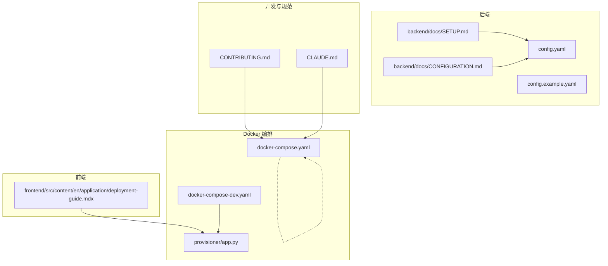
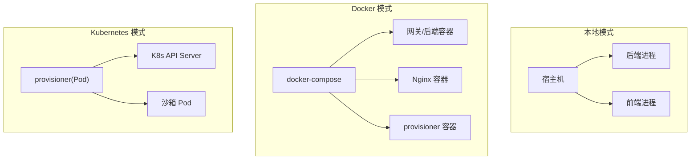
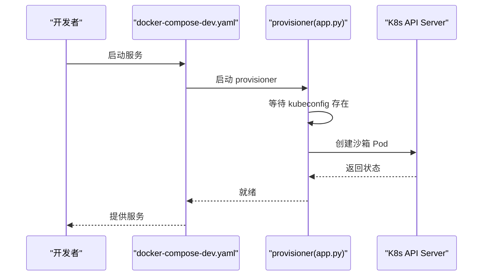
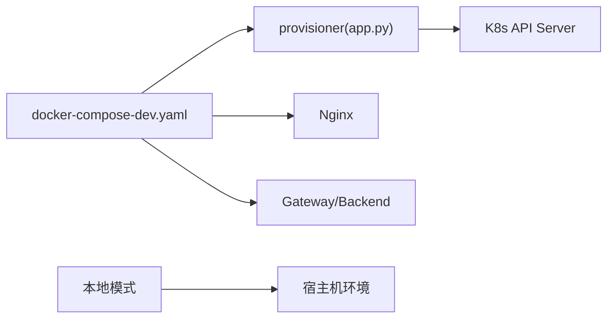
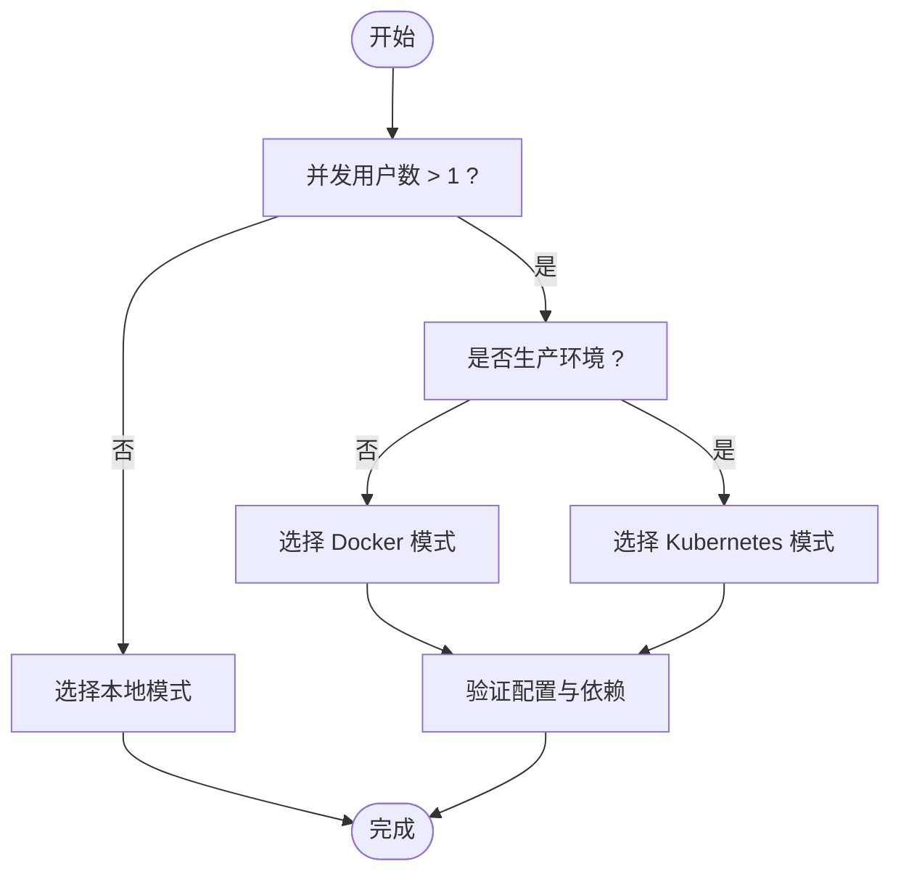

# 执行模式对比

<cite>
**本文引用的文件**
- [docker-compose.yaml](file://docker/docker-compose.yaml)
- [docker-compose-dev.yaml](file://docker/docker-compose-dev.yaml)
- [app.py](file://docker/provisioner/app.py)
- [SETUP.md](file://backend/docs/SETUP.md)
- [CONFIGURATION.md](file://backend/docs/CONFIGURATION.md)
- [deployment-guide.mdx](file://frontend/src/content/en/application/deployment-guide.mdx)
- [CONTRIBUTING.md](file://CONTRIBUTING.md)
- [CLAUDE.md](file://CLAUDE.md)
- [config.example.yaml](file://config.example.yaml)
- [config.yaml](file://config.yaml)
- [test_sandbox_audit_middleware.py](file://backend/tests/test_sandbox_audit_middleware.py)
</cite>

## 目录
1. [引言](#引言)
2. [项目结构](#项目结构)
3. [核心组件](#核心组件)
4. [架构总览](#架构总览)
5. [详细组件分析](#详细组件分析)
6. [依赖分析](#依赖分析)
7. [性能考量](#性能考量)
8. [故障排查指南](#故障排查指南)
9. [结论](#结论)
10. [附录](#附录)

## 引言
本文件面向 DeerFlow 的三种执行模式进行系统性对比：本地执行模式、Docker 执行模式与 Kubernetes 执行模式。我们将从安全性、性能、资源消耗、部署复杂度等维度进行横向比较，并给出适用场景、配置要点、迁移与切换最佳实践，以及辅助决策的流程图与选择指南。

## 项目结构
围绕执行模式的关键目录与文件如下：
- Docker 编排与编排器
  - docker/docker-compose.yaml：定义服务编排与网络
  - docker/docker-compose-dev.yaml：包含开发态编排与 provisioner
  - docker/provisioner/app.py：Kubernetes 资源编排器，负责在集群中创建/管理沙箱 Pod
- 后端文档与配置
  - backend/docs/SETUP.md：后端安装与启动指引
  - backend/docs/CONFIGURATION.md：运行时配置说明
  - config.example.yaml / config.yaml：应用配置示例与实际配置
- 前端部署指南
  - frontend/src/content/en/application/deployment-guide.mdx：生产部署与沙箱模式选择
- 开发与贡献指南
  - CONTRIBUTING.md：开发与 Docker 模式启动流程
  - CLAUDE.md：开发约束与注意事项

**图表来源**
- [docker-compose.yaml:1-200](file://docker/docker-compose.yaml#L1-L200)
- [docker-compose-dev.yaml:1-200](file://docker/docker-compose-dev.yaml#L1-L200)
- [app.py:1-200](file://docker/provisioner/app.py#L1-L200)
- [SETUP.md:1-200](file://backend/docs/SETUP.md#L1-L200)
- [CONFIGURATION.md:1-200](file://backend/docs/CONFIGURATION.md#L1-L200)
- [deployment-guide.mdx:120-170](file://frontend/src/content/en/application/deployment-guide.mdx#L120-L170)
- [CONTRIBUTING.md:1-120](file://CONTRIBUTING.md#L1-L120)
- [CLAUDE.md:1-140](file://CLAUDE.md#L1-L140)
- [config.example.yaml:1-200](file://config.example.yaml#L1-L200)
- [config.yaml:1-200](file://config.yaml#L1-L200)

**章节来源**
- [docker-compose.yaml:1-200](file://docker/docker-compose.yaml#L1-L200)
- [docker-compose-dev.yaml:1-200](file://docker/docker-compose-dev.yaml#L1-L200)
- [app.py:1-200](file://docker/provisioner/app.py#L1-L200)
- [SETUP.md:1-200](file://backend/docs/SETUP.md#L1-L200)
- [CONFIGURATION.md:1-200](file://backend/docs/CONFIGURATION.md#L1-L200)
- [deployment-guide.mdx:120-170](file://frontend/src/content/en/application/deployment-guide.mdx#L120-L170)
- [CONTRIBUTING.md:1-120](file://CONTRIBUTING.md#L1-L120)
- [CLAUDE.md:1-140](file://CLAUDE.md#L1-L140)
- [config.example.yaml:1-200](file://config.example.yaml#L1-L200)
- [config.yaml:1-200](file://config.yaml#L1-L200)

## 核心组件
- 本地执行模式
  - 特点：直接在宿主机运行后端与前端，无需容器或集群抽象；适合单人开发与快速迭代
  - 关键参考：后端安装与启动指引、开发约束与环境准备
- Docker 执行模式
  - 特点：通过 docker-compose 统一编排后端、网关、前端与可选 provisioner；便于隔离与一致性
  - 关键参考：compose 文件、开发与部署流程
- Kubernetes 执行模式
  - 特点：由 provisioner 在集群内动态创建沙箱 Pod，实现强隔离与多租户能力
  - 关键参考：provisioner 实现、K8s API 访问与 kubeconfig 等待逻辑

**章节来源**
- [SETUP.md:1-200](file://backend/docs/SETUP.md#L1-L200)
- [CLAUDE.md:1-140](file://CLAUDE.md#L1-L140)
- [docker-compose.yaml:1-200](file://docker/docker-compose.yaml#L1-L200)
- [docker-compose-dev.yaml:1-200](file://docker/docker-compose-dev.yaml#L1-L200)
- [app.py:120-180](file://docker/provisioner/app.py#L120-L180)
- [deployment-guide.mdx:120-170](file://frontend/src/content/en/application/deployment-guide.mdx#L120-L170)

## 架构总览
下图展示了三种执行模式下的系统交互关系与关键组件：

**图表来源**
- [docker-compose.yaml:1-200](file://docker/docker-compose.yaml#L1-L200)
- [docker-compose-dev.yaml:1-200](file://docker/docker-compose-dev.yaml#L1-L200)
- [app.py:120-180](file://docker/provisioner/app.py#L120-L180)

## 详细组件分析

### 本地执行模式
- 安全性
  - 无容器/Pod 层隔离，同一宿主机上的并发用户共享 OS 与内核空间，需谨慎控制权限与资源边界
- 性能
  - 无额外虚拟化开销，延迟低；但受宿主机负载影响大
- 资源消耗
  - 仅占用宿主机 CPU/内存/磁盘；便于按需分配
- 部署复杂度
  - 最低；直接运行后端与前端即可
- 适用场景
  - 单人开发、快速原型、对隔离要求不高的本地调试
- 配置要求
  - 参考后端安装与启动指引，确保本地环境满足依赖
- 迁移建议
  - 从本地迁移到 Docker 时，优先统一依赖版本与环境变量

**章节来源**
- [SETUP.md:1-200](file://backend/docs/SETUP.md#L1-L200)
- [CLAUDE.md:1-140](file://CLAUDE.md#L1-L140)

### Docker 执行模式
- 安全性
  - 通过容器命名空间与卷隔离提升多用户隔离能力；但仍共享宿主机内核
- 性能
  - 容器启动快、资源限制明确；网络与存储通过卷映射可能带来额外开销
- 资源消耗
  - 需要为镜像构建与容器运行预留额外资源；参考开发指南中的资源建议
- 部署复杂度
  - 中等；需要维护 compose 文件与镜像拉取策略
- 适用场景
  - 多人协作、CI/CD、需要一致性的开发与预生产环境
- 配置要求
  - 使用 compose 文件定义服务与网络；必要时挂载 kubeconfig 以支持 provisioner
- 迁移建议
  - 先在 Docker 模式验证配置与依赖，再逐步引入 K8s

**章节来源**
- [docker-compose.yaml:1-200](file://docker/docker-compose.yaml#L1-L200)
- [docker-compose-dev.yaml:1-200](file://docker/docker-compose-dev.yaml#L1-L200)
- [CONTRIBUTING.md:1-120](file://CONTRIBUTING.md#L1-L120)

### Kubernetes 执行模式
- 安全性
  - Pod 级强隔离，结合 RBAC 与网络策略可实现高安全基线；provisioner 通过 K8s API 动态调度
- 性能
  - 启动与调度开销高于本地与 Docker；但具备弹性扩缩容与资源回收能力
- 资源消耗
  - 集群资源成本更高；需合理设置资源配额与亲和性
- 部署复杂度
  - 较高；需准备 kubeconfig、RBAC 权限、网络策略与持久化存储
- 适用场景
  - 生产级多租户、高并发、强隔离与合规要求
- 配置要求
  - provisioner 会等待 kubeconfig 存在并可访问 API Server；支持自签证书场景
- 迁移建议
  - 先在本地/ Docker 验证，再在测试集群验证 provisioner，最后灰度到生产

**图表来源**
- [docker-compose-dev.yaml:1-200](file://docker/docker-compose-dev.yaml#L1-L200)
- [app.py:120-180](file://docker/provisioner/app.py#L120-L180)

**章节来源**
- [app.py:120-180](file://docker/provisioner/app.py#L120-L180)
- [deployment-guide.mdx:120-170](file://frontend/src/content/en/application/deployment-guide.mdx#L120-L170)

## 依赖分析
- 组件耦合
  - Docker 模式下，provisioner 与 K8s API 的耦合度较高；需稳定 kubeconfig 与网络可达性
  - 本地与 Docker 模式对宿主机环境依赖更强，需统一依赖版本
- 外部依赖
  - K8s API Server、镜像仓库、Nginx 代理、数据库等
- 风险点
  - kubeconfig 路径错误或权限不足会导致 provisioner 初始化失败
  - Docker 权限不足导致镜像拉取或容器操作失败

**图表来源**
- [docker-compose-dev.yaml:1-200](file://docker/docker-compose-dev.yaml#L1-L200)
- [app.py:120-180](file://docker/provisioner/app.py#L120-L180)

**章节来源**
- [docker-compose-dev.yaml:1-200](file://docker/docker-compose-dev.yaml#L1-L200)
- [app.py:120-180](file://docker/provisioner/app.py#L120-L180)

## 性能考量
- 本地模式
  - 优势：启动快、延迟低
  - 劣势：资源竞争与隔离弱
- Docker 模式
  - 优势：资源限制明确、易于复制
  - 劣势：镜像层与卷 IO 可能带来额外开销
- Kubernetes 模式
  - 优势：弹性与隔离强
  - 劣势：调度与网络开销较大

- 安全审计与风险控制
  - 后端测试覆盖了沙箱审计中间件的基准指标，包括高风险阻断率、中风险告警率与误报率等，用于评估安全策略有效性

**章节来源**
- [test_sandbox_audit_middleware.py:704-716](file://backend/tests/test_sandbox_audit_middleware.py#L704-L716)

## 故障排查指南
- Docker 权限问题
  - 症状：无法连接 Docker 守护进程或拉取镜像失败
  - 排查：确认当前用户对 Docker 套接字的访问权限
- kubeconfig 未找到或类型错误
  - 症状：provisioner 等待 kubeconfig 超时或报错
  - 排查：检查 kubeconfig 路径是否为常规文件且可读；必要时设置 K8S_API_SERVER 并关闭 SSL 校验（仅本地）
- 端口冲突
  - 症状：服务无法绑定到指定端口
  - 排查：检查 compose 端口映射与宿主机占用情况
- 配置不一致
  - 症状：功能异常或行为不一致
  - 排查：比对 config.example.yaml 与 config.yaml 差异，确保关键字段正确

**章节来源**
- [CONTRIBUTING.md:80-120](file://CONTRIBUTING.md#L80-L120)
- [app.py:120-180](file://docker/provisioner/app.py#L120-L180)
- [config.example.yaml:1-200](file://config.example.yaml#L1-L200)
- [config.yaml:1-200](file://config.yaml#L1-L200)

## 结论
- 本地模式适合个人开发与快速迭代；Docker 模式适合团队协作与一致性；Kubernetes 模式适合生产级强隔离与多租户
- 选择顺序建议：本地 → Docker → Kubernetes
- 迁移路径：先本地验证，再 Docker 验证，最后 K8s 验证与灰度

## 附录

### 决策树与选择指南

### 配置清单与要点
- 本地模式
  - 参考后端安装与启动指引，确保本地环境满足依赖
- Docker 模式
  - 使用 compose 文件定义服务与网络；必要时挂载 kubeconfig
- Kubernetes 模式
  - 准备 kubeconfig；provisioner 支持等待 kubeconfig 与自签证书场景

**章节来源**
- [SETUP.md:1-200](file://backend/docs/SETUP.md#L1-L200)
- [docker-compose.yaml:1-200](file://docker/docker-compose.yaml#L1-L200)
- [docker-compose-dev.yaml:1-200](file://docker/docker-compose-dev.yaml#L1-L200)
- [app.py:120-180](file://docker/provisioner/app.py#L120-L180)
- [deployment-guide.mdx:120-170](file://frontend/src/content/en/application/deployment-guide.mdx#L120-L170)