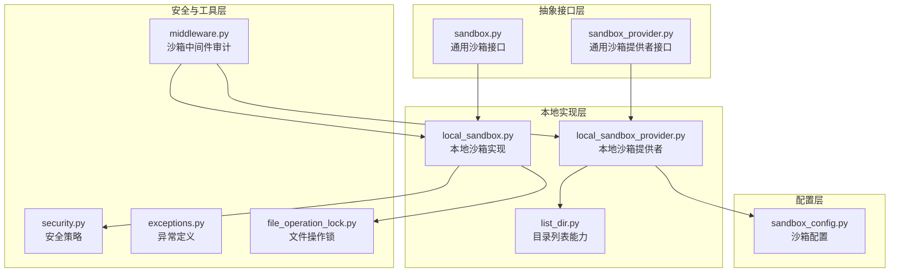
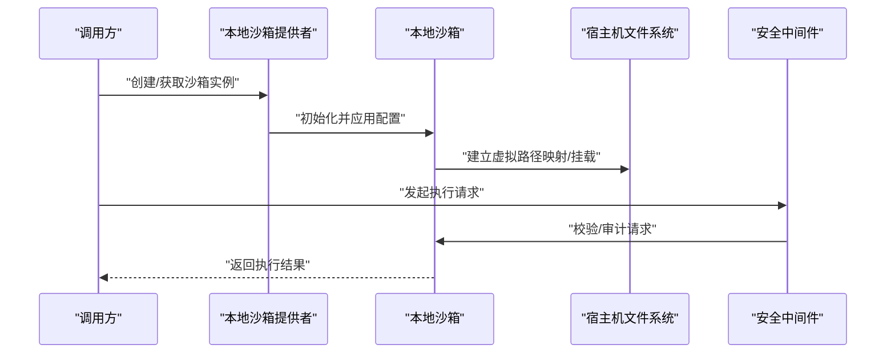
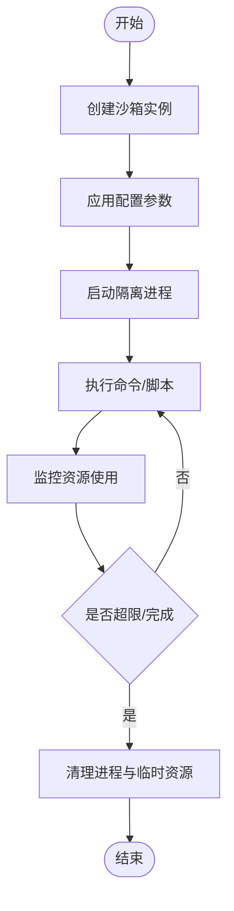
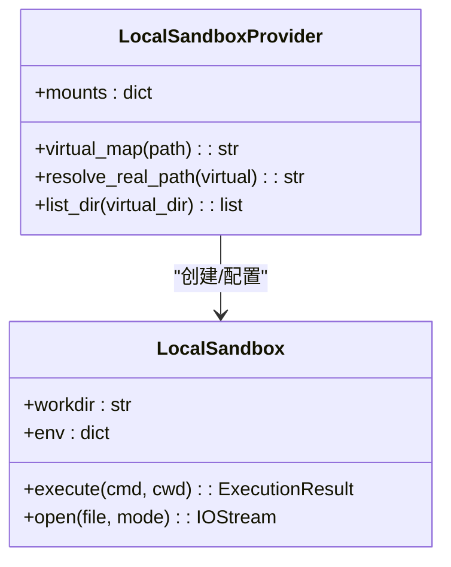
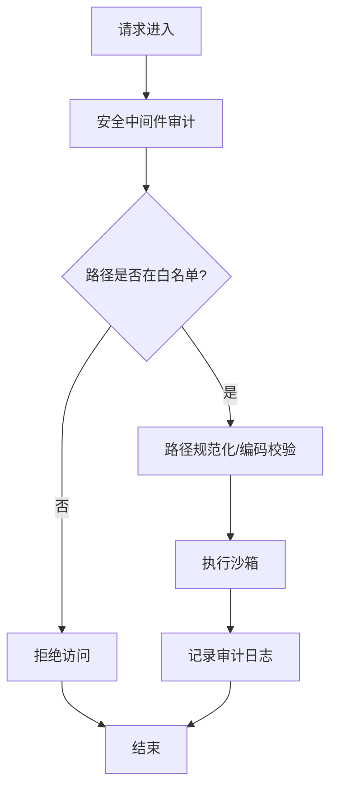
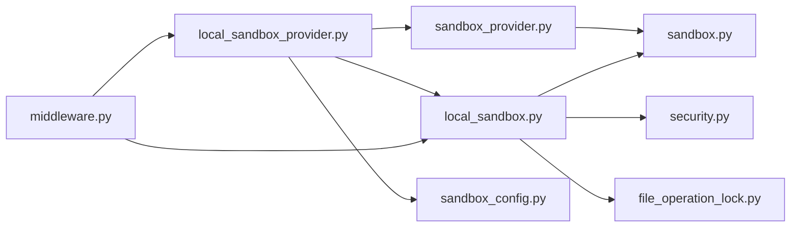

# 本地执行模式

<cite>
**本文引用的文件**
- [local_sandbox.py](file://backend/packages/harness/deerflow/sandbox/local/local_sandbox.py)
- [local_sandbox_provider.py](file://backend/packages/harness/deerflow/sandbox/local/local_sandbox_provider.py)
- [list_dir.py](file://backend/packages/harness/deerflow/sandbox/local/list_dir.py)
- [sandbox.py](file://backend/packages/harness/deerflow/sandbox/sandbox.py)
- [sandbox_provider.py](file://backend/packages/harness/deerflow/sandbox/sandbox_provider.py)
- [security.py](file://backend/packages/harness/deerflow/sandbox/security.py)
- [exceptions.py](file://backend/packages/harness/deerflow/sandbox/exceptions.py)
- [middleware.py](file://backend/packages/harness/deerflow/sandbox/middleware.py)
- [sandbox_config.py](file://backend/packages/harness/deerflow/config/sandbox_config.py)
- [test_local_sandbox_provider_mounts.py](file://backend/tests/test_local_sandbox_provider_mounts.py)
- [test_local_sandbox_virtual_path_contract.py](file://backend/tests/test_local_sandbox_virtual_path_contract.py)
- [test_local_skill_storage_write.py](file://backend/tests/test_local_skill_storage_write.py)
- [test_local_bash_tool_loading.py](file://backend/tests/test_local_bash_tool_loading.py)
- [test_local_sandbox_encoding.py](file://backend/tests/test_local_sandbox_encoding.py)
</cite>

## 目录
1. [简介](#简介)
2. [项目结构](#项目结构)
3. [核心组件](#核心组件)
4. [架构总览](#架构总览)
5. [详细组件分析](#详细组件分析)
6. [依赖关系分析](#依赖关系分析)
7. [性能考虑](#性能考虑)
8. [故障排查指南](#故障排查指南)
9. [结论](#结论)
10. [附录](#附录)

## 简介
本文件面向 DeerFlow 的本地执行模式，系统性阐述本地沙箱的实现原理与工程实践，包括进程隔离机制、文件系统虚拟化、资源限制策略与安全策略实施；详解本地沙箱提供者（Local Sandbox Provider）的配置项、目录列表能力的实现方式，以及与宿主机环境的交互边界；并提供配置示例、性能特征分析、适用场景建议及常见问题解决方案。

## 项目结构
本地沙箱相关代码主要位于后端 harness 包的 sandbox 子模块中，采用“抽象接口 + 具体实现”的分层设计：
- 抽象层：定义通用沙箱接口与提供者接口，确保不同后端（本地/容器/Docker）可插拔替换
- 本地实现层：在宿主机上以进程隔离与文件系统虚拟化的方式提供受限执行环境
- 安全与工具层：提供安全策略、文件操作锁、中间件审计等配套能力
- 配置层：通过 sandbox_config 提供统一的沙箱运行时参数

图表来源
- [sandbox.py](file://backend/packages/harness/deerflow/sandbox/sandbox.py)
- [sandbox_provider.py](file://backend/packages/harness/deerflow/sandbox/sandbox_provider.py)
- [local_sandbox.py](file://backend/packages/harness/deerflow/sandbox/local/local_sandbox.py)
- [local_sandbox_provider.py](file://backend/packages/harness/deerflow/sandbox/local/local_sandbox_provider.py)
- [list_dir.py](file://backend/packages/harness/deerflow/sandbox/local/list_dir.py)
- [security.py](file://backend/packages/harness/deerflow/sandbox/security.py)
- [middleware.py](file://backend/packages/harness/deerflow/sandbox/middleware.py)
- [sandbox_config.py](file://backend/packages/harness/deerflow/config/sandbox_config.py)

章节来源
- [sandbox.py](file://backend/packages/harness/deerflow/sandbox/sandbox.py)
- [sandbox_provider.py](file://backend/packages/harness/deerflow/sandbox/sandbox_provider.py)
- [local_sandbox.py](file://backend/packages/harness/deerflow/sandbox/local/local_sandbox.py)
- [local_sandbox_provider.py](file://backend/packages/harness/deerflow/sandbox/local/local_sandbox_provider.py)
- [list_dir.py](file://backend/packages/harness/deerflow/sandbox/local/list_dir.py)
- [security.py](file://backend/packages/harness/deerflow/sandbox/security.py)
- [middleware.py](file://backend/packages/harness/deerflow/sandbox/middleware.py)
- [sandbox_config.py](file://backend/packages/harness/deerflow/config/sandbox_config.py)

## 核心组件
- 通用沙箱接口：定义沙箱生命周期管理、命令执行、文件访问等抽象方法，便于替换不同后端实现
- 本地沙箱实现：基于宿主机进程与文件系统虚拟化提供受限执行环境
- 本地沙箱提供者：负责根据配置实例化本地沙箱、挂载目录、解析虚拟路径映射
- 目录列表能力：提供受控的目录枚举接口，支持白名单过滤与路径规范化
- 安全策略与中间件：对沙箱调用进行审计与拦截，防止越权与滥用
- 异常体系：统一定义沙箱相关错误类型，便于上层捕获与处理
- 文件操作锁：避免并发写冲突，保障多任务并发下的数据一致性

章节来源
- [sandbox.py](file://backend/packages/harness/deerflow/sandbox/sandbox.py)
- [local_sandbox.py](file://backend/packages/harness/deerflow/sandbox/local/local_sandbox.py)
- [local_sandbox_provider.py](file://backend/packages/harness/deerflow/sandbox/local/local_sandbox_provider.py)
- [list_dir.py](file://backend/packages/harness/deerflow/sandbox/local/list_dir.py)
- [security.py](file://backend/packages/harness/deerflow/sandbox/security.py)
- [middleware.py](file://backend/packages/harness/deerflow/sandbox/middleware.py)
- [exceptions.py](file://backend/packages/harness/deerflow/sandbox/exceptions.py)

## 架构总览
本地执行模式通过“提供者 + 沙箱”双层抽象实现可插拔的执行后端。提供者负责装配与启动沙箱，沙箱负责实际的进程隔离与文件系统虚拟化。安全中间件贯穿请求链路，确保调用合规。

图表来源
- [local_sandbox_provider.py](file://backend/packages/harness/deerflow/sandbox/local/local_sandbox_provider.py)
- [local_sandbox.py](file://backend/packages/harness/deerflow/sandbox/local/local_sandbox.py)
- [middleware.py](file://backend/packages/harness/deerflow/sandbox/middleware.py)

## 详细组件分析

### 进程隔离机制
- 基于宿主机进程：本地沙箱在宿主机上以独立进程运行，通过工作目录与环境变量隔离执行上下文
- 资源限制：结合配置层参数对 CPU、内存、文件句柄等进行软限制，避免单任务影响宿主稳定性
- 执行生命周期：提供者负责沙箱实例的创建、启动、清理与回收，确保资源及时释放

图表来源
- [local_sandbox_provider.py](file://backend/packages/harness/deerflow/sandbox/local/local_sandbox_provider.py)
- [local_sandbox.py](file://backend/packages/harness/deerflow/sandbox/local/local_sandbox.py)
- [sandbox_config.py](file://backend/packages/harness/deerflow/config/sandbox_config.py)

章节来源
- [local_sandbox_provider.py](file://backend/packages/harness/deerflow/sandbox/local/local_sandbox_provider.py)
- [local_sandbox.py](file://backend/packages/harness/deerflow/sandbox/local/local_sandbox.py)
- [sandbox_config.py](file://backend/packages/harness/deerflow/config/sandbox_config.py)

### 文件系统虚拟化
- 虚拟路径映射：提供者将外部挂载目录映射到沙箱内的虚拟路径，保证访问隔离与可控范围
- 白名单策略：仅允许访问明确声明的挂载点，拒绝越界访问
- 目录列表能力：提供受控的目录枚举接口，支持路径规范化与权限过滤

图表来源
- [local_sandbox_provider.py](file://backend/packages/harness/deerflow/sandbox/local/local_sandbox_provider.py)
- [local_sandbox.py](file://backend/packages/harness/deerflow/sandbox/local/local_sandbox.py)
- [list_dir.py](file://backend/packages/harness/deerflow/sandbox/local/list_dir.py)

章节来源
- [local_sandbox_provider.py](file://backend/packages/harness/deerflow/sandbox/local/local_sandbox_provider.py)
- [local_sandbox.py](file://backend/packages/harness/deerflow/sandbox/local/local_sandbox.py)
- [list_dir.py](file://backend/packages/harness/deerflow/sandbox/local/list_dir.py)

### 资源限制策略
- CPU/内存/句柄限制：通过配置参数设置软上限，结合宿主内核能力进行约束
- I/O 限额：限制文件读写总量与并发写操作，配合文件操作锁避免竞争
- 超时控制：为长时间运行的任务设置超时，防止资源泄漏

章节来源
- [sandbox_config.py](file://backend/packages/harness/deerflow/config/sandbox_config.py)
- [local_sandbox.py](file://backend/packages/harness/deerflow/sandbox/local/local_sandbox.py)
- [file_operation_lock.py](file://backend/packages/harness/deerflow/sandbox/file_operation_lock.py)

### 安全策略实施
- 访问控制：仅允许访问挂载白名单内的路径，拒绝任意宿主路径直连
- 中间件审计：在请求进入沙箱前进行合法性检查与记录，支持违规拦截
- 编码与路径规范化：防止路径穿越与编码绕过，统一输入输出编码格式

图表来源
- [middleware.py](file://backend/packages/harness/deerflow/sandbox/middleware.py)
- [security.py](file://backend/packages/harness/deerflow/sandbox/security.py)
- [local_sandbox_provider.py](file://backend/packages/harness/deerflow/sandbox/local/local_sandbox_provider.py)

章节来源
- [middleware.py](file://backend/packages/harness/deerflow/sandbox/middleware.py)
- [security.py](file://backend/packages/harness/deerflow/sandbox/security.py)
- [local_sandbox_provider.py](file://backend/packages/harness/deerflow/sandbox/local/local_sandbox_provider.py)

### 本地沙箱提供者的配置选项
- 挂载目录（mounts）：定义宿主机目录到沙箱虚拟路径的映射规则
- 工作目录（workdir）：沙箱内默认工作目录
- 环境变量（env）：注入到沙箱进程的环境变量集合
- 资源限制（cpu_quota, memory_limit, fd_limit）：软限制参数
- 编码与路径策略：统一输入输出编码与路径规范化策略

章节来源
- [sandbox_config.py](file://backend/packages/harness/deerflow/config/sandbox_config.py)
- [local_sandbox_provider.py](file://backend/packages/harness/deerflow/sandbox/local/local_sandbox_provider.py)

### 目录列表功能的实现
- 受控枚举：仅允许对挂载白名单内的虚拟路径进行目录枚举
- 结果过滤：对列出的条目进行权限与可见性过滤
- 错误处理：对不存在或无权限的路径返回明确错误

章节来源
- [list_dir.py](file://backend/packages/harness/deerflow/sandbox/local/list_dir.py)
- [local_sandbox_provider.py](file://backend/packages/harness/deerflow/sandbox/local/local_sandbox_provider.py)

### 与宿主机环境的交互方式
- 通过挂载目录实现有限访问，避免直接宿主路径直连
- 使用虚拟路径契约（virtual path contract）保证跨组件一致性
- 通过中间件与安全策略实现访问审计与拦截

章节来源
- [local_sandbox_provider.py](file://backend/packages/harness/deerflow/sandbox/local/local_sandbox_provider.py)
- [test_local_sandbox_virtual_path_contract.py](file://backend/tests/test_local_sandbox_virtual_path_contract.py)

## 依赖关系分析
本地沙箱模块内部依赖清晰，职责分离良好：
- 抽象接口层与实现层解耦，便于替换后端
- 安全与中间件作为横切关注点，被提供者与沙箱共同依赖
- 配置层为提供者与沙箱提供统一参数来源

图表来源
- [sandbox_provider.py](file://backend/packages/harness/deerflow/sandbox/sandbox_provider.py)
- [sandbox.py](file://backend/packages/harness/deerflow/sandbox/sandbox.py)
- [local_sandbox_provider.py](file://backend/packages/harness/deerflow/sandbox/local/local_sandbox_provider.py)
- [local_sandbox.py](file://backend/packages/harness/deerflow/sandbox/local/local_sandbox.py)
- [sandbox_config.py](file://backend/packages/harness/deerflow/config/sandbox_config.py)
- [security.py](file://backend/packages/harness/deerflow/sandbox/security.py)
- [file_operation_lock.py](file://backend/packages/harness/deerflow/sandbox/file_operation_lock.py)
- [middleware.py](file://backend/packages/harness/deerflow/sandbox/middleware.py)

章节来源
- [sandbox_provider.py](file://backend/packages/harness/deerflow/sandbox/sandbox_provider.py)
- [local_sandbox_provider.py](file://backend/packages/harness/deerflow/sandbox/local/local_sandbox_provider.py)
- [local_sandbox.py](file://backend/packages/harness/deerflow/sandbox/local/local_sandbox.py)
- [sandbox_config.py](file://backend/packages/harness/deerflow/config/sandbox_config.py)
- [security.py](file://backend/packages/harness/deerflow/sandbox/security.py)
- [file_operation_lock.py](file://backend/packages/harness/deerflow/sandbox/file_operation_lock.py)
- [middleware.py](file://backend/packages/harness/deerflow/sandbox/middleware.py)

## 性能考虑
- 进程开销：本地模式以进程隔离为主，相比容器轻量，但仍有进程创建与切换成本
- I/O 吞吐：受限于宿主机磁盘与网络，建议合理规划挂载目录与缓存策略
- 并发控制：通过文件操作锁与资源限制避免争用与资源耗尽
- 编码与路径处理：统一编码与路径规范化可减少异常分支与额外转换开销

## 故障排查指南
- 挂载路径不生效
  - 检查提供者配置中的挂载映射是否正确
  - 确认虚拟路径契约一致，避免路径解析偏差
  - 参考测试用例验证挂载行为
- 目录列表失败
  - 确认目标路径在白名单内且具备读权限
  - 检查路径规范化与编码是否符合预期
- 执行异常或超时
  - 查看资源限制配置是否过严
  - 检查中间件审计日志定位违规请求
- 编码问题
  - 统一输入输出编码，避免非 UTF-8 导致的解析错误

章节来源
- [test_local_sandbox_provider_mounts.py](file://backend/tests/test_local_sandbox_provider_mounts.py)
- [test_local_sandbox_virtual_path_contract.py](file://backend/tests/test_local_sandbox_virtual_path_contract.py)
- [test_local_skill_storage_write.py](file://backend/tests/test_local_skill_storage_write.py)
- [test_local_bash_tool_loading.py](file://backend/tests/test_local_bash_tool_loading.py)
- [test_local_sandbox_encoding.py](file://backend/tests/test_local_sandbox_encoding.py)

## 结论
本地执行模式通过“提供者 + 沙箱 + 安全中间件”的组合，在宿主机上实现了轻量级的进程隔离与文件系统虚拟化。其优势在于部署简单、性能开销低；局限在于隔离强度不及容器/沙盒方案。结合合理的资源配置与安全策略，本地模式适合中小规模、对延迟敏感或受限环境下的执行需求。

## 附录

### 配置示例（要点）
- 挂载目录：将宿主机特定目录映射到沙箱内的虚拟路径
- 工作目录：指定沙箱内默认工作目录
- 环境变量：按需注入运行时变量
- 资源限制：设置 CPU、内存、文件描述符等软限制
- 编码与路径策略：统一编码与路径规范化

章节来源
- [sandbox_config.py](file://backend/packages/harness/deerflow/config/sandbox_config.py)
- [local_sandbox_provider.py](file://backend/packages/harness/deerflow/sandbox/local/local_sandbox_provider.py)