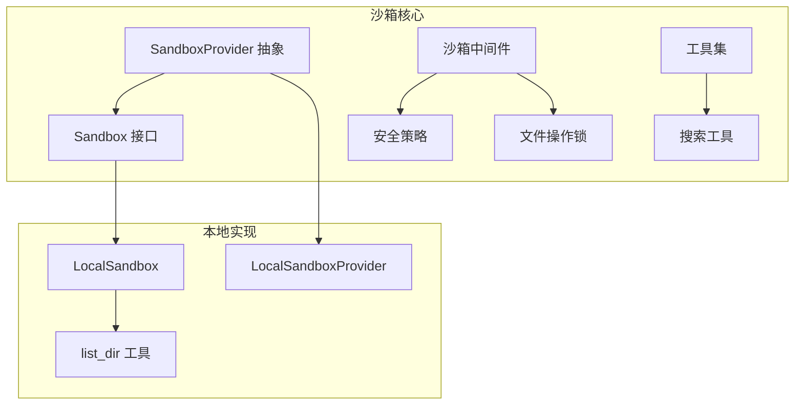
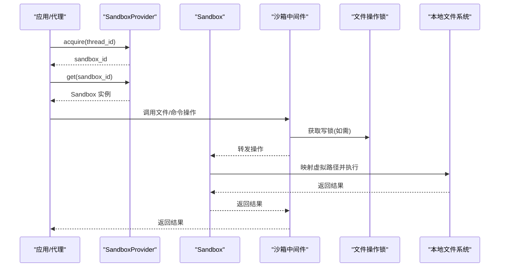
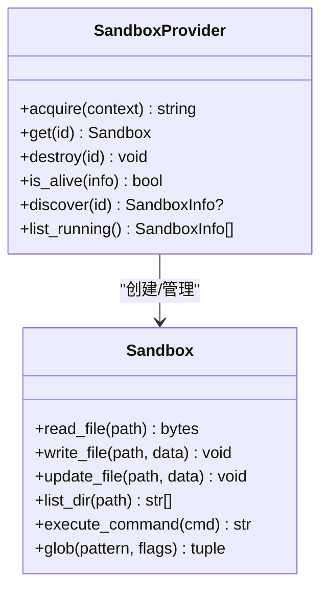
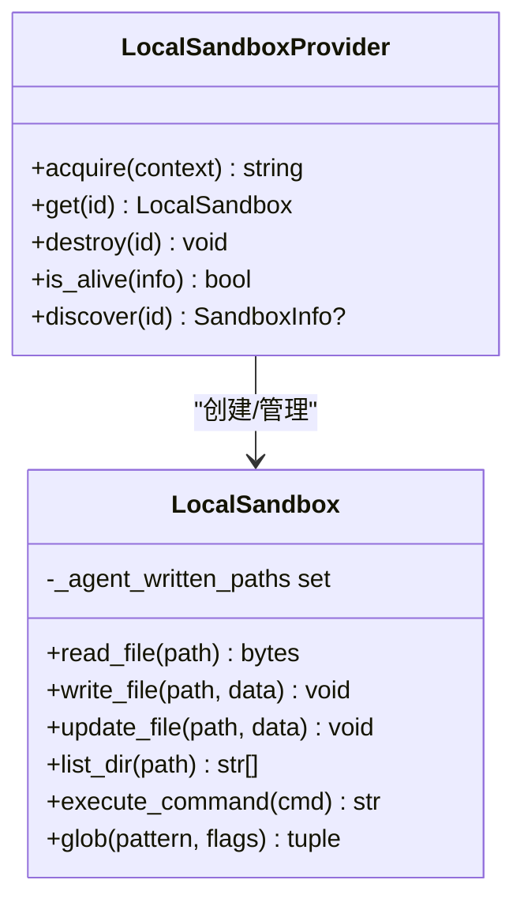
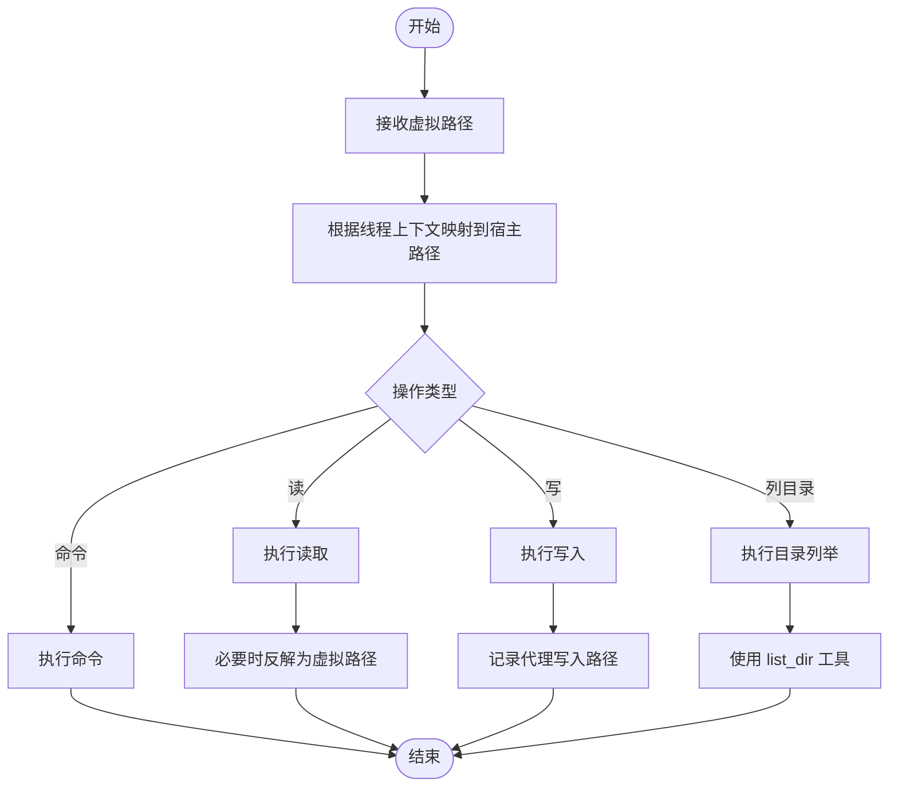
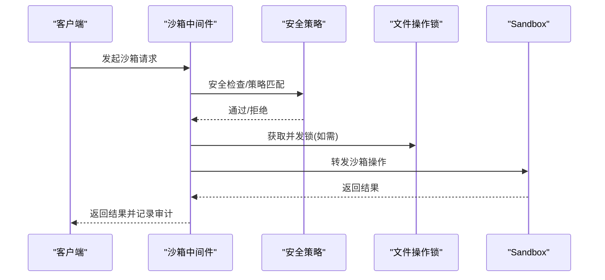
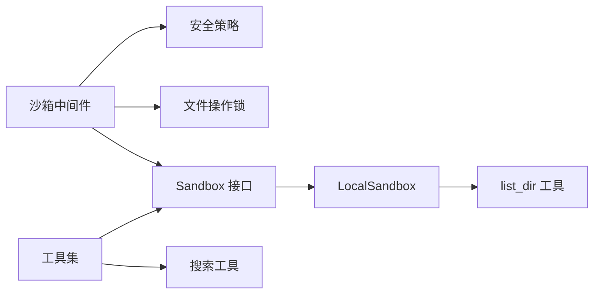

# 沙箱架构设计

<cite>
**本文引用的文件**
- [backend/packages/harness/deerflow/sandbox/__init__.py](file://backend/packages/harness/deerflow/sandbox/__init__.py)
- [backend/packages/harness/deerflow/sandbox/sandbox.py](file://backend/packages/harness/deerflow/sandbox/sandbox.py)
- [backend/packages/harness/deerflow/sandbox/sandbox_provider.py](file://backend/packages/harness/deerflow/sandbox/sandbox_provider.py)
- [backend/packages/harness/deerflow/sandbox/middleware.py](file://backend/packages/harness/deerflow/sandbox/middleware.py)
- [backend/packages/harness/deerflow/sandbox/security.py](file://backend/packages/harness/deerflow/sandbox/security.py)
- [backend/packages/harness/deerflow/sandbox/file_operation_lock.py](file://backend/packages/harness/deerflow/sandbox/file_operation_lock.py)
- [backend/packages/harness/deerflow/sandbox/tools.py](file://backend/packages/harness/deerflow/sandbox/tools.py)
- [backend/packages/harness/deerflow/sandbox/search.py](file://backend/packages/harness/deerflow/sandbox/search.py)
- [backend/packages/harness/deerflow/sandbox/local/local_sandbox.py](file://backend/packages/harness/deerflow/sandbox/local/local_sandbox.py)
- [backend/packages/harness/deerflow/sandbox/local/local_sandbox_provider.py](file://backend/packages/harness/deerflow/sandbox/local/local_sandbox_provider.py)
- [backend/packages/harness/deerflow/sandbox/local/list_dir.py](file://backend/packages/harness/deerflow/sandbox/local/list_dir.py)
- [backend/packages/harness/deerflow/sandbox/exceptions.py](file://backend/packages/harness/deerflow/sandbox/exceptions.py)
- [backend/tests/test_local_sandbox_virtual_path_contract.py](file://backend/tests/test_local_sandbox_virtual_path_contract.py)
</cite>

## 目录
1. [引言](#引言)
2. [项目结构](#项目结构)
3. [核心组件](#核心组件)
4. [架构总览](#架构总览)
5. [详细组件分析](#详细组件分析)
6. [依赖关系分析](#依赖关系分析)
7. [性能考量](#性能考量)
8. [故障排查指南](#故障排查指南)
9. [结论](#结论)
10. [附录](#附录)

## 引言
本文件面向 DeerFlow 的沙箱系统，系统性阐述其架构设计与实现要点，重点覆盖以下方面：
- 执行环境隔离机制：线程级隔离、用户数据映射隔离、虚拟路径解析与反解析
- 安全边界设计：访问控制、权限约束、工具调用限制
- 文件操作锁机制：并发写入保护、跨线程状态隔离
- 中间件集成：统一安全控制入口、请求处理链路
- 提供者抽象接口：SandboxProvider 抽象、本地后端实现
- 关键流程图与组件交互图，帮助开发者快速理解核心设计理念

## 项目结构
沙箱子系统位于后端 harness 包内，采用“功能域+提供者”的分层组织方式：
- 核心接口与抽象：sandbox.py、sandbox_provider.py
- 安全与工具：security.py、tools.py、search.py
- 并发与隔离：file_operation_lock.py、local/local_sandbox.py、local/local_sandbox_provider.py、local/list_dir.py
- 中间件：middleware.py
- 导出与异常：__init__.py、exceptions.py

图表来源
- [backend/packages/harness/deerflow/sandbox/sandbox_provider.py](file://backend/packages/harness/deerflow/sandbox/sandbox_provider.py)
- [backend/packages/harness/deerflow/sandbox/sandbox.py](file://backend/packages/harness/deerflow/sandbox/sandbox.py)
- [backend/packages/harness/deerflow/sandbox/middleware.py](file://backend/packages/harness/deerflow/sandbox/middleware.py)
- [backend/packages/harness/deerflow/sandbox/security.py](file://backend/packages/harness/deerflow/sandbox/security.py)
- [backend/packages/harness/deerflow/sandbox/file_operation_lock.py](file://backend/packages/harness/deerflow/sandbox/file_operation_lock.py)
- [backend/packages/harness/deerflow/sandbox/tools.py](file://backend/packages/harness/deerflow/sandbox/tools.py)
- [backend/packages/harness/deerflow/sandbox/search.py](file://backend/packages/harness/deerflow/sandbox/search.py)
- [backend/packages/harness/deerflow/sandbox/local/local_sandbox_provider.py](file://backend/packages/harness/deerflow/sandbox/local/local_sandbox_provider.py)
- [backend/packages/harness/deerflow/sandbox/local/local_sandbox.py](file://backend/packages/harness/deerflow/sandbox/local/local_sandbox.py)
- [backend/packages/harness/deerflow/sandbox/local/list_dir.py](file://backend/packages/harness/deerflow/sandbox/local/list_dir.py)

章节来源
- [backend/packages/harness/deerflow/sandbox/__init__.py](file://backend/packages/harness/deerflow/sandbox/__init__.py)
- [backend/packages/harness/deerflow/sandbox/sandbox.py](file://backend/packages/harness/deerflow/sandbox/sandbox.py)
- [backend/packages/harness/deerflow/sandbox/sandbox_provider.py](file://backend/packages/harness/deerflow/sandbox/sandbox_provider.py)

## 核心组件
- SandboxProvider 抽象：定义沙箱生命周期管理（acquire/destroy/is_alive/discover）、运行中沙箱枚举等通用能力，屏蔽具体后端差异
- Sandbox 接口：定义文件读写、目录列举、命令执行、glob 搜索等能力，并支持虚拟路径到宿主路径的映射与反解
- LocalSandboxProvider/LocalSandbox：本地后端实现，负责将虚拟路径映射到线程隔离的宿主路径，确保跨线程不泄漏
- 沙箱中间件：在请求处理链路中注入统一的安全检查、访问控制与并发保护
- 安全策略与工具：内置安全扫描、工具白名单、输出截断与审计
- 文件操作锁：对共享资源进行互斥保护，避免并发写冲突
- 搜索工具：提供受限的文件搜索能力，配合安全策略使用

章节来源
- [backend/packages/harness/deerflow/sandbox/sandbox_provider.py](file://backend/packages/harness/deerflow/sandbox/sandbox_provider.py)
- [backend/packages/harness/deerflow/sandbox/sandbox.py](file://backend/packages/harness/deerflow/sandbox/sandbox.py)
- [backend/packages/harness/deerflow/sandbox/local/local_sandbox_provider.py](file://backend/packages/harness/deerflow/sandbox/local/local_sandbox_provider.py)
- [backend/packages/harness/deerflow/sandbox/local/local_sandbox.py](file://backend/packages/harness/deerflow/sandbox/local/local_sandbox.py)
- [backend/packages/harness/deerflow/sandbox/middleware.py](file://backend/packages/harness/deerflow/sandbox/middleware.py)
- [backend/packages/harness/deerflow/sandbox/security.py](file://backend/packages/harness/deerflow/sandbox/security.py)
- [backend/packages/harness/deerflow/sandbox/file_operation_lock.py](file://backend/packages/harness/deerflow/sandbox/file_operation_lock.py)
- [backend/packages/harness/deerflow/sandbox/tools.py](file://backend/packages/harness/deerflow/sandbox/tools.py)
- [backend/packages/harness/deerflow/sandbox/search.py](file://backend/packages/harness/deerflow/sandbox/search.py)

## 架构总览
下图展示从应用层到沙箱后端的整体交互：应用通过 SandboxProvider 获取 Sandbox 实例；Sandbox 将虚拟路径转换为线程隔离的宿主路径；中间件在进入沙箱操作前执行统一的安全检查与并发控制；本地后端负责实际的文件系统操作。

图表来源
- [backend/packages/harness/deerflow/sandbox/sandbox_provider.py](file://backend/packages/harness/deerflow/sandbox/sandbox_provider.py)
- [backend/packages/harness/deerflow/sandbox/sandbox.py](file://backend/packages/harness/deerflow/sandbox/sandbox.py)
- [backend/packages/harness/deerflow/sandbox/middleware.py](file://backend/packages/harness/deerflow/sandbox/middleware.py)
- [backend/packages/harness/deerflow/sandbox/file_operation_lock.py](file://backend/packages/harness/deerflow/sandbox/file_operation_lock.py)
- [backend/packages/harness/deerflow/sandbox/local/local_sandbox.py](file://backend/packages/harness/deerflow/sandbox/local/local_sandbox.py)

## 详细组件分析

### SandboxProvider 抽象与生命周期
- 角色定位：统一管理沙箱实例的获取、销毁、存活检测与发现
- 关键职责：
  - acquire：按线程/用户上下文分配或复用沙箱实例
  - get：返回对应沙箱实例
  - destroy：释放资源
  - is_alive：轻量健康检查
  - discover：跨进程/跨会话恢复已有沙箱
  - list_running：枚举当前运行中的沙箱集合
- 设计要点：通过抽象屏蔽不同后端（容器、本地）差异，保证上层一致调用

图表来源
- [backend/packages/harness/deerflow/sandbox/sandbox_provider.py](file://backend/packages/harness/deerflow/sandbox/sandbox_provider.py)
- [backend/packages/harness/deerflow/sandbox/sandbox.py](file://backend/packages/harness/deerflow/sandbox/sandbox.py)

章节来源
- [backend/packages/harness/deerflow/sandbox/sandbox_provider.py](file://backend/packages/harness/deerflow/sandbox/sandbox_provider.py)
- [backend/packages/harness/deerflow/sandbox/sandbox.py](file://backend/packages/harness/deerflow/sandbox/sandbox.py)

### LocalSandboxProvider 与 LocalSandbox
- LocalSandboxProvider
  - 基于线程上下文维护沙箱实例
  - 将虚拟路径映射到线程隔离的宿主路径
  - 确保多线程场景下用户数据不互相可见
- LocalSandbox
  - 实现 Sandbox 接口，封装文件读写、目录列举、命令执行、glob 搜索
  - 维护 per-sandbox 的“代理写入路径”集合，用于反向解析与隔离
  - 通过 list_dir 辅助工具实现目录遍历

图表来源
- [backend/packages/harness/deerflow/sandbox/local/local_sandbox_provider.py](file://backend/packages/harness/deerflow/sandbox/local/local_sandbox_provider.py)
- [backend/packages/harness/deerflow/sandbox/local/local_sandbox.py](file://backend/packages/harness/deerflow/sandbox/local/local_sandbox.py)
- [backend/packages/harness/deerflow/sandbox/local/list_dir.py](file://backend/packages/harness/deerflow/sandbox/local/list_dir.py)

章节来源
- [backend/packages/harness/deerflow/sandbox/local/local_sandbox_provider.py](file://backend/packages/harness/deerflow/sandbox/local/local_sandbox_provider.py)
- [backend/packages/harness/deerflow/sandbox/local/local_sandbox.py](file://backend/packages/harness/deerflow/sandbox/local/local_sandbox.py)
- [backend/packages/harness/deerflow/sandbox/local/list_dir.py](file://backend/packages/harness/deerflow/sandbox/local/list_dir.py)

### 虚拟路径与线程隔离契约
- 虚拟路径：以特定前缀标识用户数据空间，例如 /mnt/user-data/workspace
- 映射规则：同一虚拟路径在不同线程上下文中映射到不同的宿主路径
- 反向解析：读取时将宿主路径反解回虚拟路径，保证对外 API 一致性
- 隔离验证：测试覆盖了跨线程写入不可见、代理写入路径集合不泄漏等行为

图表来源
- [backend/packages/harness/deerflow/sandbox/local/local_sandbox.py](file://backend/packages/harness/deerflow/sandbox/local/local_sandbox.py)
- [backend/packages/harness/deerflow/sandbox/local/list_dir.py](file://backend/packages/harness/deerflow/sandbox/local/list_dir.py)
- [backend/tests/test_local_sandbox_virtual_path_contract.py](file://backend/tests/test_local_sandbox_virtual_path_contract.py)

章节来源
- [backend/tests/test_local_sandbox_virtual_path_contract.py](file://backend/tests/test_local_sandbox_virtual_path_contract.py)

### 沙箱中间件与统一安全控制
- 中间件职责：在进入沙箱操作前执行统一的安全检查、访问控制、并发保护
- 典型流程：参数校验 → 权限检查 → 并发锁获取 → 调用 Sandbox → 结果审计
- 与安全策略协作：结合安全策略模块对工具调用、输出大小、敏感词等进行限制

图表来源
- [backend/packages/harness/deerflow/sandbox/middleware.py](file://backend/packages/harness/deerflow/sandbox/middleware.py)
- [backend/packages/harness/deerflow/sandbox/security.py](file://backend/packages/harness/deerflow/sandbox/security.py)
- [backend/packages/harness/deerflow/sandbox/file_operation_lock.py](file://backend/packages/harness/deerflow/sandbox/file_operation_lock.py)
- [backend/packages/harness/deerflow/sandbox/sandbox.py](file://backend/packages/harness/deerflow/sandbox/sandbox.py)

章节来源
- [backend/packages/harness/deerflow/sandbox/middleware.py](file://backend/packages/harness/deerflow/sandbox/middleware.py)
- [backend/packages/harness/deerflow/sandbox/security.py](file://backend/packages/harness/deerflow/sandbox/security.py)
- [backend/packages/harness/deerflow/sandbox/file_operation_lock.py](file://backend/packages/harness/deerflow/sandbox/file_operation_lock.py)

### 安全策略与工具
- 安全策略：提供敏感词过滤、工具白名单、输出预算与截断、审计日志等能力
- 工具集：封装常用文件操作、搜索等工具，统一接入安全策略
- 搜索工具：基于受限模式的 glob 搜索，避免越权访问

章节来源
- [backend/packages/harness/deerflow/sandbox/security.py](file://backend/packages/harness/deerflow/sandbox/security.py)
- [backend/packages/harness/deerflow/sandbox/tools.py](file://backend/packages/harness/deerflow/sandbox/tools.py)
- [backend/packages/harness/deerflow/sandbox/search.py](file://backend/packages/harness/deerflow/sandbox/search.py)

### 文件操作锁机制
- 目标：防止并发写入导致的数据竞争与损坏
- 适用范围：写文件、更新文件、删除等可能产生竞态的操作
- 协作方式：中间件在需要时获取锁，确保同一时间只有一个写操作进行

章节来源
- [backend/packages/harness/deerflow/sandbox/file_operation_lock.py](file://backend/packages/harness/deerflow/sandbox/file_operation_lock.py)

## 依赖关系分析
- 抽象与实现分离：SandboxProvider/Sandbox 抽象与 LocalSandboxProvider/LocalSandbox 实现解耦
- 中间件与后端协作：中间件负责前置控制，后端负责具体执行
- 工具与安全策略：工具调用受安全策略约束，形成闭环

图表来源
- [backend/packages/harness/deerflow/sandbox/middleware.py](file://backend/packages/harness/deerflow/sandbox/middleware.py)
- [backend/packages/harness/deerflow/sandbox/security.py](file://backend/packages/harness/deerflow/sandbox/security.py)
- [backend/packages/harness/deerflow/sandbox/file_operation_lock.py](file://backend/packages/harness/deerflow/sandbox/file_operation_lock.py)
- [backend/packages/harness/deerflow/sandbox/sandbox.py](file://backend/packages/harness/deerflow/sandbox/sandbox.py)
- [backend/packages/harness/deerflow/sandbox/local/local_sandbox.py](file://backend/packages/harness/deerflow/sandbox/local/local_sandbox.py)
- [backend/packages/harness/deerflow/sandbox/local/list_dir.py](file://backend/packages/harness/deerflow/sandbox/local/list_dir.py)
- [backend/packages/harness/deerflow/sandbox/tools.py](file://backend/packages/harness/deerflow/sandbox/tools.py)
- [backend/packages/harness/deerflow/sandbox/search.py](file://backend/packages/harness/deerflow/sandbox/search.py)

章节来源
- [backend/packages/harness/deerflow/sandbox/sandbox_provider.py](file://backend/packages/harness/deerflow/sandbox/sandbox_provider.py)
- [backend/packages/harness/deerflow/sandbox/sandbox.py](file://backend/packages/harness/deerflow/sandbox/sandbox.py)
- [backend/packages/harness/deerflow/sandbox/local/local_sandbox_provider.py](file://backend/packages/harness/deerflow/sandbox/local/local_sandbox_provider.py)
- [backend/packages/harness/deerflow/sandbox/local/local_sandbox.py](file://backend/packages/harness/deerflow/sandbox/local/local_sandbox.py)

## 性能考量
- 路径映射与反解：虚拟路径到宿主路径的映射应尽量简单高效，避免频繁 IO 或复杂解析
- 并发控制粒度：写操作加锁，读操作可考虑无锁或细粒度锁，平衡吞吐与一致性
- 列目录与搜索：list_dir 与搜索工具应限制深度与范围，避免大目录扫描带来的性能问题
- 线程隔离：通过 per-thread 的宿主路径映射减少锁竞争，提升并发性能

## 故障排查指南
- 跨线程文件不可见：确认虚拟路径是否正确映射到线程隔离的宿主路径
- 写入冲突：检查是否存在未释放的写锁，或并发写入未通过中间件统一调度
- 命令执行失败：核对命令是否被安全策略拦截，或路径是否在允许范围内
- 搜索结果为空：检查 glob 模式与目录权限，确认未超出搜索范围限制

章节来源
- [backend/packages/harness/deerflow/sandbox/exceptions.py](file://backend/packages/harness/deerflow/sandbox/exceptions.py)
- [backend/packages/harness/deerflow/sandbox/middleware.py](file://backend/packages/harness/deerflow/sandbox/middleware.py)
- [backend/packages/harness/deerflow/sandbox/security.py](file://backend/packages/harness/deerflow/sandbox/security.py)
- [backend/packages/harness/deerflow/sandbox/file_operation_lock.py](file://backend/packages/harness/deerflow/sandbox/file_operation_lock.py)

## 结论
DeerFlow 沙箱系统通过“抽象提供者 + 本地实现 + 中间件 + 安全策略 + 文件锁”的组合，实现了：
- 线程级与用户数据级的强隔离
- 统一的安全控制与合规审计
- 对外一致的虚拟路径 API 与对内高效的宿主路径执行
- 可扩展的工具与搜索能力

该设计既满足了安全与隔离要求，又兼顾了易用性与性能，适合在复杂业务场景中稳定运行。

## 附录
- 相关测试用例可参考虚拟路径契约与线程隔离验证，确保实现符合预期

章节来源
- [backend/tests/test_local_sandbox_virtual_path_contract.py](file://backend/tests/test_local_sandbox_virtual_path_contract.py)