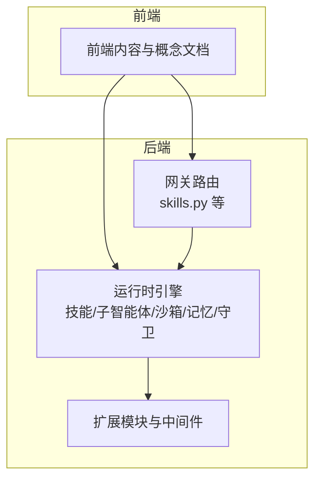
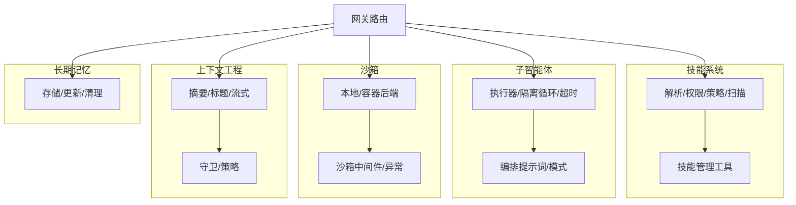
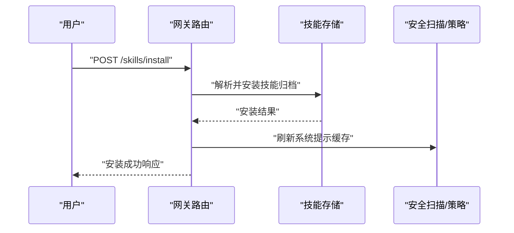
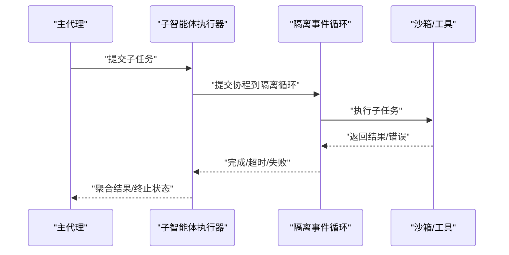
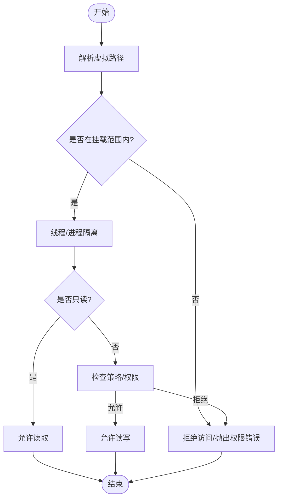
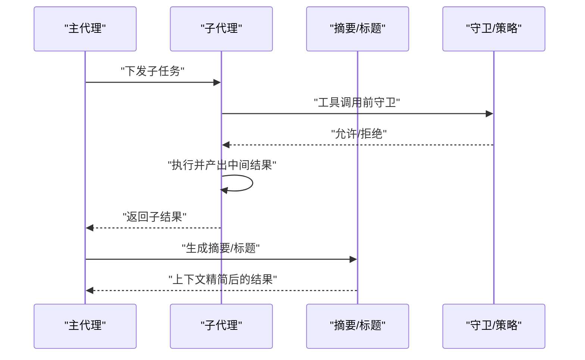
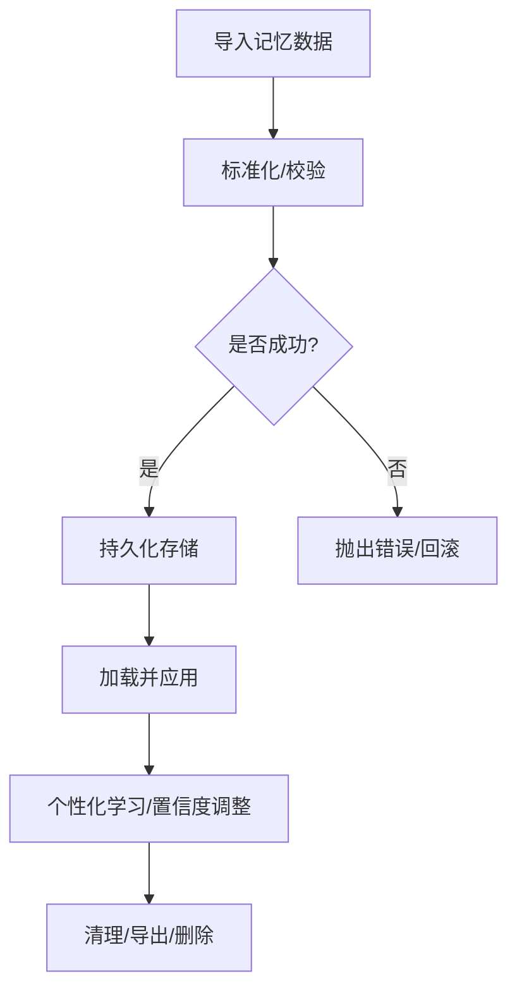
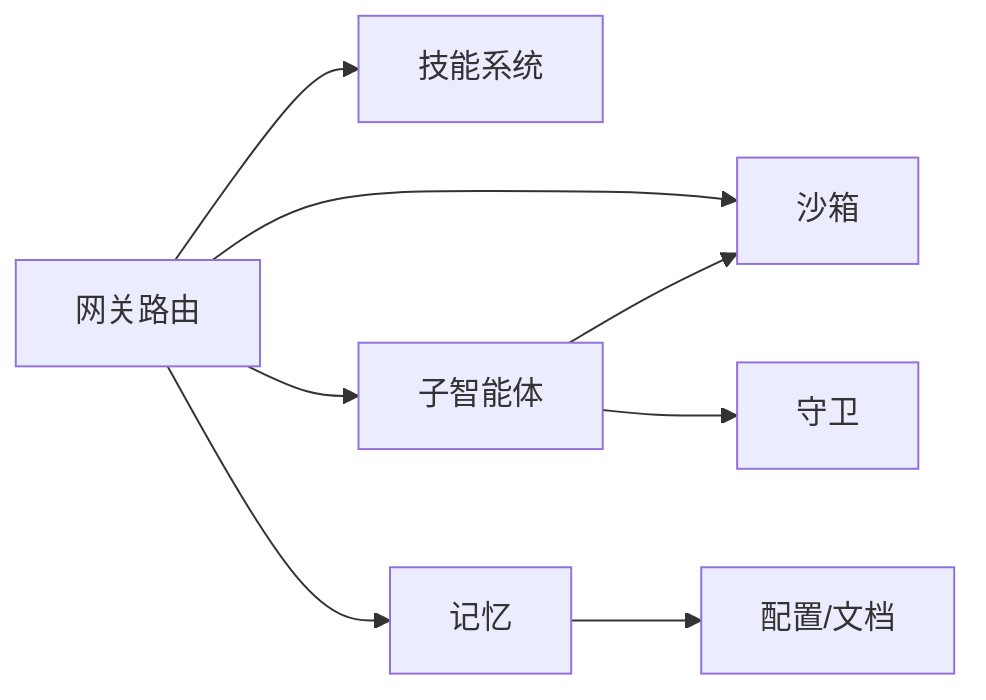

# 核心特性

<cite>
**本文引用的文件**
- [backend/app/gateway/routers/skills.py](file://backend/app/gateway/routers/skills.py)
- [backend/packages/harness/deerflow/tools/skill_manage_tool.py](file://backend/packages/harness/deerflow/tools/skill_manage_tool.py)
- [backend/packages/harness/deerflow/skills/permissions.py](file://backend/packages/harness/deerflow/skills/permissions.py)
- [backend/packages/harness/deerflow/skills/parser.py](file://backend/packages/harness/deerflow/skills/parser.py)
- [backend/packages/harness/deerflow/skills/security_scanner.py](file://backend/packages/harness/deerflow/skills/security_scanner.py)
- [backend/packages/harness/deerflow/skills/tool_policy.py](file://backend/packages/harness/deerflow/skills/tool_policy.py)
- [backend/packages/harness/deerflow/skills/types.py](file://backend/packages/harness/deerflow/skills/types.py)
- [backend/packages/harness/deerflow/subagents/executor.py](file://backend/packages/harness/deerflow/subagents/executor.py)
- [backend/packages/harness/deerflow/agents/lead_agent/prompt.py](file://backend/packages/harness/deerflow/agents/lead_agent/prompt.py)
- [backend/docs/task_tool_improvements.md](file://backend/docs/task_tool_improvements.md)
- [frontend/src/content/en/harness/subagents.mdx](file://frontend/src/content/en/harness/subagents.mdx)
- [frontend/src/content/en/introduction/core-concepts.mdx](file://frontend/src/content/en/introduction/core-concepts.mdx)
- [backend/packages/harness/deerflow/sandbox/sandbox.py](file://backend/packages/harness/deerflow/sandbox/sandbox.py)
- [backend/packages/harness/deerflow/sandbox/local/sandbox.py](file://backend/packages/harness/deerflow/sandbox/local/sandbox.py)
- [backend/packages/harness/deerflow/sandbox/middleware.py](file://backend/packages/harness/deerflow/sandbox/middleware.py)
- [backend/packages/harness/deerflow/sandbox/exceptions.py](file://backend/packages/harness/deerflow/sandbox/exceptions.py)
- [backend/tests/test_local_sandbox_provider_mounts.py](file://backend/tests/test_local_sandbox_provider_mounts.py)
- [backend/tests/test_local_sandbox_virtual_path_contract.py](file://backend/tests/test_local_sandbox_virtual_path_contract.py)
- [backend/packages/harness/deerflow/agents/memory/storage.py](file://backend/packages/harness/deerflow/agents/memory/storage.py)
- [backend/packages/harness/deerflow/agents/memory/updater.py](file://backend/packages/harness/deerflow/agents/memory/updater.py)
- [backend/packages/harness/deerflow/guardrails/middleware.py](file://backend/packages/harness/deerflow/guardrails/middleware.py)
- [backend/packages/harness/deerflow/guardrails/provider.py](file://backend/packages/harness/deerflow/guardrails/provider.py)
- [backend/packages/harness/deerflow/guardrails/builtin.py](file://backend/packages/harness/deerflow/guardrails/builtin.py)
- [backend/docs/MEMORY_IMPROVEMENTS.md](file://backend/docs/MEMORY_IMPROVEMENTS.md)
- [backend/docs/MEMORY_SETTINGS_REVIEW.md](file://backend/docs/MEMORY_SETTINGS_REVIEW.md)
- [backend/docs/GUARDRAILS.md](file://backend/docs/GUARDRAILS.md)
- [backend/docs/AUTH_DESIGN.md](file://backend/docs/AUTH_DESIGN.md)
- [backend/docs/CONFIGURATION.md](file://backend/docs/CONFIGURATION.md)
- [backend/docs/ARCHITECTURE.md](file://backend/docs/ARCHITECTURE.md)
- [backend/docs/STREAMING.md](file://backend/docs/STREAMING.md)
- [backend/docs/TITLE_GENERATION_IMPLEMENTATION.md](file://backend/docs/TITLE_GENERATION_IMPLEMENTATION.md)
- [backend/docs/MEMORY_IMPROVEMENTS_SUMMARY.md](file://backend/docs/MEMORY_IMPROVEMENTS_SUMMARY.md)
- [backend/docs/MEMORY_SETTINGS_REVIEW.md](file://backend/docs/MEMORY_SETTINGS_REVIEW.md)
- [backend/docs/plan_mode_usage.md](file://backend/docs/plan_mode_usage.md)
- [backend/docs/summarization.md](file://backend/docs/summarization.md)
- [backend/docs/task_tool_improvements.md](file://backend/docs/task_tool_improvements.md)
- [backend/docs/TODO.md](file://backend/docs/TODO.md)
- [backend/docs/PATH_EXAMPLES.md](file://backend/docs/PATH_EXAMPLES.md)
- [backend/docs/FILE_UPLOAD.md](file://backend/docs/FILE_UPLOAD.md)
- [backend/docs/API.md](file://backend/docs/API.md)
- [backend/docs/SETUP.md](file://backend/docs/SETUP.md)
- [backend/docs/STREAMING.md](file://backend/docs/STREAMING.md)
- [backend/docs/TITLE_GENERATION_IMPLEMENTATION.md](file://backend/docs/TITLE_GENERATION_IMPLEMENTATION.md)
- [backend/docs/TODO.md](file://backend/docs/TODO.md)
- [backend/docs/PATH_EXAMPLES.md](file://backend/docs/PATH_EXAMPLES.md)
- [backend/docs/FILE_UPLOAD.md](file://backend/docs/FILE_UPLOAD.md)
- [backend/docs/API.md](file://backend/docs/API.md)
- [backend/docs/SETUP.md](file://backend/docs/SETUP.md)
- [backend/docs/STREAMING.md](file://backend/docs/STREAMING.md)
- [backend/docs/TITLE_GENERATION_IMPLEMENTATION.md](file://backend/docs/TITLE_GENERATION_IMPLEMENTATION.md)
- [backend/docs/MEMORY_IMPROVEMENTS_SUMMARY.md](file://backend/docs/MEMORY_IMPROVEMENTS_SUMMARY.md)
- [backend/docs/MEMORY_SETTINGS_REVIEW.md](file://backend/docs/MEMORY_SETTINGS_REVIEW.md)
- [backend/docs/plan_mode_usage.md](file://backend/docs/plan_mode_usage.md)
- [backend/docs/summarization.md](file://backend/docs/summarization.md)
- [backend/docs/task_tool_improvements.md](file://backend/docs/task_tool_improvements.md)
- [backend/docs/TODO.md](file://backend/docs/TODO.md)
- [backend/docs/PATH_EXAMPLES.md](file://backend/docs/PATH_EXAMPLES.md)
- [backend/docs/FILE_UPLOAD.md](file://backend/docs/FILE_UPLOAD.md)
- [backend/docs/API.md](file://backend/docs/API.md)
- [backend/docs/SETUP.md](file://backend/docs/SETUP.md)
- [backend/docs/STREAMING.md](file://backend/docs/STREAMING.md)
- [backend/docs/TITLE_GENERATION_IMPLEMENTATION.md](file://backend/docs/TITLE_GENERATION_IMPLEMENTATION.md)
- [backend/docs/MEMORY_IMPROVEMENTS_SUMMARY.md](file://backend/docs/MEMORY_IMPROVEMENTS_SUMMARY.md)
- [backend/docs/MEMORY_SETTINGS_REVIEW.md](file://backend/docs/MEMORY_SETTINGS_REVIEW.md)
- [backend/docs/plan_mode_usage.md](file://backend/docs/plan_mode_usage.md)
- [backend/docs/summarization.md](file://backend/docs/summarization.md)
- [backend/docs/task_tool_improvements.md](file://backend/docs/task_tool_improvements.md)
- [backend/docs/TODO.md](file://backend/docs/TODO.md)
- [backend/docs/PATH_EXAMPLES.md](file://backend/docs/PATH_EXAMPLES.md)
- [backend/docs/FILE_UPLOAD.md](file://backend/docs/FILE_UPLOAD.md)
- [backend/docs/API.md](file://backend/docs/API.md)
- [backend/docs/SETUP.md](file://backend/docs/SETUP.md)
- [backend/docs/STREAMING.md](file://backend/docs/STREAMING.md)
- [backend/docs/TITLE_GENERATION_IMPLEMENTATION.md](file://backend/docs/TITLE_GENERATION_IMPLEMENTATION.md)
- [backend/docs/MEMORY_IMPROVEMENTS_SUMMARY.md](file://backend/docs/MEMORY_IMPROVEMENTS_SUMMARY.md)
- [backend/docs/MEMORY_SETTINGS_REVIEW.md](file://backend/docs/MEMORY_SETTINGS_REVIEW.md)
- [backend/docs/plan_mode_usage.md](file://backend/docs/plan_mode_usage.md)
- [backend/docs/summarization.md](file://backend/docs/summarization.md)
- [backend/docs/task_tool_improvements.md](file://backend/docs/task_tool_improvements.md)
- [backend/docs/TODO.md](file://backend/docs/TODO.md)
- [backend/docs/PATH_EXAMPLES.md](file://backend/docs/PATH_EXAMPLES.md)
- [backend/docs/FILE_UPLOAD.md](file://backend/docs/FILE_UPLOAD.md)
- [backend/docs/API.md](file://backend/docs/API.md)
- [backend/docs/SETUP.md](file://backend/docs/SETUP.md)
- [backend/docs/STREAMING.md](file://backend/docs/STREAMING.md)
- [backend/docs/TITLE_GENERATION_IMPLEMENTATION.md](file://backend/docs/TITLE_GENERATION_IMPLEMENTATION.md)
- [backend/docs/MEMORY_IMPROVEMENTS_SUMMARY.md](file://backend/docs/MEMORY_IMPROVEMENTS_SUMMARY.md)
- [backend/docs/MEMORY_SETTINGS_REVIEW.md](file://backend/docs/MEMORY_SETTINGS_REVIEW.md)
- [backend/docs/plan_mode_usage.md](file://backend/docs/plan_mode_usage.md)
- [backend/docs/summarization.md](file://backend/docs/summarization.md)
- [backend/docs/task_tool_improvements.md](file://backend/docs/task_tool_improvements.md)
- [backend/docs/TODO.md](file://backend/docs/TODO.md)
- [backend/docs/PATH_EXAMPLES.md](file://backend/docs/PATH_EXAMPLES.md)
- [backend/docs/FILE_UPLOAD.md](file://backend/docs/FILE_UPLOAD.md)
- [backend/docs/API.md](file://backend/docs/API.md)
- [backend/docs/SETUP.md](file://backend/docs/SETUP.md)
- [backend/docs/STREAMING.md](file://backend/docs/STREAMING.md)
- [backend/docs/TITLE_GENERATION_IMPLEMENTATION.md](file://backend/docs/TITLE_GENERATION_IMPLEMENTATION.md)
- [backend/docs/MEMORY_IMPROVEMENTS_SUMMARY.md](file://backend/docs/MEMORY_IMPROVEMENTS_SUMMARY.md)
- [backend/docs/MEMORY_SETTINGS_REVIEW.md](file://backend/docs/MEMORY_SETTINGS_REVIEW.md)
- [backend/docs/plan_mode_usage.md](file://backend/docs/plan_mode_usage.md)
- [backend/docs/summarization.md](file://backend/docs/summarization.md)
- [backend/docs/task_tool_improvements.md](file://backend/docs/task_tool_improvements.md)
- [backend/docs/TODO.md](file://backend/docs/TODO.md)
- [backend/docs/PATH_EXAMPLES.md](file://backend/docs/PATH_EXAMPLES.md)
- [backend/docs/FILE_UPLOAD.md](file://backend/docs/FILE_UPLOAD.md)
- [backend/docs/API.md](file://backend/docs/API.md)
- [backend/docs/SETUP.md](file://backend/docs/SETUP.md)
- [backend/docs/STREAMING.md](file://backend/docs/STREAMING.md)
- [backend/docs/TITLE_GENERATION_IMPLEMENTATION.md](file://backend/docs/TITLE_GENERATION_IMPLEMENTATION.md)
- [backend/docs/MEMORY_IMPROVEMENTS_SUMMARY.md](file://backend/docs/MEMORY_IMPROVEMENTS_SUMMARY.md)
- [backend/docs/MEMORY_SETTINGS_REVIEW.md](file://backend/docs/MEMORY_SETTINGS_REVIEW.md)
- [backend/docs/plan_mode_usage.md](file://backend/docs/plan_mode_usage.md)
- [backend/docs/summarization.md](file://backend/docs/summarization.md)
- [backend/docs/task_tool_improvements.md](file://backend/docs/task_tool_improvements.md)
- [backend/docs/TODO.md](file://backend/docs/TODO.md)
- [backend/docs/PATH_EXAMPLES.md](file://backend/docs/PATH_EXAMPLES.md)
- [backend/docs/FILE_UPLOAD.md](file://backend/docs/FILE_UPLOAD.md)
- [backend/docs/API.md](file://backend/docs/API.md)
- [backend/docs/SETUP.md](file://backend/docs/SETUP.md)
- [backend/docs/STREAMING.md](file://backend/docs/STREAMING.md)
- [backend/docs/TITLE_GENERATION_IMPLEMENTATION.md](file://backend/docs/TITLE_GENERATION_IMPLEMENTATION.md)
- [backend/docs/MEMORY_IMPROVEMENTS_SUMMARY.md](file://backend/docs/MEM......)
</cite>

## 目录
1. [引言](#引言)
2. [项目结构](#项目结构)
3. [核心组件](#核心组件)
4. [架构总览](#架构总览)
5. [详细组件分析](#详细组件分析)
6. [依赖关系分析](#依赖关系分析)
7. [性能考量](#性能考量)
8. [故障排查指南](#故障排查指南)
9. [结论](#结论)
10. [附录](#附录)

## 引言
本文件面向 DeerFlow 2.0 的核心能力，系统性梳理以下五大特性：  
- 可扩展技能系统（内置技能库、自定义技能开发、技能权限管理）  
- 子智能体编排（任务分解、并行执行、结果聚合）  
- 安全沙箱执行（本地/容器执行、文件系统隔离、资源限制）  
- 上下文工程（子代理隔离、摘要机制、严格工具调用恢复）  
- 长期记忆管理（跨会话持久化、个性化学习、隐私保护）  

文档从架构设计、实现细节、使用示例与最佳实践出发，并提供特性对比与选择指南，帮助用户按需选型。

## 项目结构
DeerFlow 后端采用“网关路由 + 运行时引擎 + 扩展模块”的分层组织方式：  
- 网关层负责认证授权、路由与服务编排  
- 运行时引擎包含技能系统、子智能体、沙箱、记忆与守卫等核心模块  
- 前端提供概念说明与使用引导  
- 文档集中沉淀设计原则、配置与运维要点

图示来源
- [backend/app/gateway/routers/skills.py](file://backend/app/gateway/routers/skills.py)
- [frontend/src/content/en/harness/subagents.mdx](file://frontend/src/content/en/harness/subagents.mdx)
- [frontend/src/content/en/introduction/core-concepts.mdx](file://frontend/src/content/en/introduction/core-concepts.mdx)

章节来源
- [backend/docs/ARCHITECTURE.md](file://backend/docs/ARCHITECTURE.md)
- [backend/docs/CONFIGURATION.md](file://backend/docs/CONFIGURATION.md)

## 核心组件
- 技能系统：支持安装/卸载/查询自定义技能，解析技能元数据，执行前进行安全扫描与策略校验，提供权限控制与工具策略  
- 子智能体：通过专用事件循环与上下文隔离，实现任务分解、并发执行与结果合成；提供超时保护与取消机制  
- 沙箱：提供本地与容器两种执行后端，实现虚拟路径映射、线程隔离、只读挂载与逃逸防护  
- 上下文工程：通过子代理隔离、摘要与标题生成、严格工具调用恢复，保障长流程稳定性  
- 长期记忆：以文件存储为核心，支持导入/导出/清理与置信度规范化，兼顾隐私与可用性

章节来源
- [backend/packages/harness/deerflow/tools/skill_manage_tool.py](file://backend/packages/harness/deerflow/tools/skill_manage_tool.py)
- [backend/packages/harness/deerflow/skills/permissions.py](file://backend/packages/harness/deerflow/skills/permissions.py)
- [backend/packages/harness/deerflow/skills/parser.py](file://backend/packages/harness/deerflow/skills/parser.py)
- [backend/packages/harness/deerflow/skills/security_scanner.py](file://backend/packages/harness/deerflow/skills/security_scanner.py)
- [backend/packages/harness/deerflow/skills/tool_policy.py](file://backend/packages/harness/deerflow/skills/tool_policy.py)
- [backend/packages/harness/deerflow/skills/types.py](file://backend/packages/harness/deerflow/skills/types.py)
- [backend/packages/harness/deerflow/subagents/executor.py](file://backend/packages/harness/deerflow/subagents/executor.py)
- [backend/packages/harness/deerflow/agents/lead_agent/prompt.py](file://backend/packages/harness/deerflow/agents/lead_agent/prompt.py)
- [backend/packages/harness/deerflow/sandbox/sandbox.py](file://backend/packages/harness/deerflow/sandbox/sandbox.py)
- [backend/packages/harness/deerflow/sandbox/local/sandbox.py](file://backend/packages/harness/deerflow/sandbox/local/sandbox.py)
- [backend/packages/harness/deerflow/sandbox/middleware.py](file://backend/packages/harness/deerflow/sandbox/middleware.py)
- [backend/packages/harness/deerflow/sandbox/exceptions.py](file://backend/packages/harness/deerflow/sandbox/exceptions.py)
- [backend/packages/harness/deerflow/agents/memory/storage.py](file://backend/packages/harness/deerflow/agents/memory/storage.py)
- [backend/packages/harness/deerflow/agents/memory/updater.py](file://backend/packages/harness/deerflow/agents/memory/updater.py)
- [backend/packages/harness/deerflow/guardrails/middleware.py](file://backend/packages/harness/deerflow/guardrails/middleware.py)
- [backend/packages/harness/deerflow/guardrails/provider.py](file://backend/packages/harness/deerflow/guardrails/provider.py)
- [backend/packages/harness/deerflow/guardrails/builtin.py](file://backend/packages/harness/deerflow/guardrails/builtin.py)

## 架构总览
下图展示五大核心能力在系统中的交互位置与职责边界：

图示来源
- [backend/app/gateway/routers/skills.py](file://backend/app/gateway/routers/skills.py)
- [backend/packages/harness/deerflow/tools/skill_manage_tool.py](file://backend/packages/harness/deerflow/tools/skill_manage_tool.py)
- [backend/packages/harness/deerflow/subagents/executor.py](file://backend/packages/harness/deerflow/subagents/executor.py)
- [backend/packages/harness/deerflow/agents/lead_agent/prompt.py](file://backend/packages/harness/deerflow/agents/lead_agent/prompt.py)
- [backend/packages/harness/deerflow/sandbox/sandbox.py](file://backend/packages/harness/deerflow/sandbox/sandbox.py)
- [backend/packages/harness/deerflow/sandbox/middleware.py](file://backend/packages/harness/deerflow/sandbox/middleware.py)
- [backend/packages/harness/deerflow/agents/memory/storage.py](file://backend/packages/harness/deerflow/agents/memory/storage.py)
- [backend/packages/harness/deerflow/guardrails/middleware.py](file://backend/packages/harness/deerflow/guardrails/middleware.py)

## 详细组件分析

### 可扩展技能系统
- 能力概览
  - 内置技能库：通过 ZIP 归档安装，自动刷新系统提示缓存  
  - 自定义技能开发：提供技能管理工具，支持创建/编辑/补丁/删除/文件写入/移除  
  - 权限与安全：解析技能元数据，执行前进行安全扫描与工具策略校验，支持权限控制  
- 关键实现
  - 网关路由：提供安装、列出、获取、删除自定义技能的接口  
  - 技能管理工具：封装对 skills/custom 下资源的增删改查与文本替换  
  - 解析/权限/策略/扫描：统一的技能类型、权限模型与安全扫描流程  
- 使用示例
  - 通过网关安装技能归档，随后在对话中调用该技能提供的工具  
  - 使用技能管理工具在运行时动态维护自定义技能  
- 最佳实践
  - 对外暴露的技能应遵循最小权限原则，避免高危工具直接开放  
  - 自定义技能变更后及时刷新系统提示缓存，确保上下文一致性  
  - 对自定义技能进行定期安全扫描，阻断潜在风险

图示来源
- [backend/app/gateway/routers/skills.py](file://backend/app/gateway/routers/skills.py)
- [backend/packages/harness/deerflow/tools/skill_manage_tool.py](file://backend/packages/harness/deerflow/tools/skill_manage_tool.py)
- [backend/packages/harness/deerflow/skills/security_scanner.py](file://backend/packages/harness/deerflow/skills/security_scanner.py)
- [backend/packages/harness/deerflow/skills/tool_policy.py](file://backend/packages/harness/deerflow/skills/tool_policy.py)

章节来源
- [backend/app/gateway/routers/skills.py](file://backend/app/gateway/routers/skills.py)
- [backend/packages/harness/deerflow/tools/skill_manage_tool.py](file://backend/packages/harness/deerflow/tools/skill_manage_tool.py)
- [backend/packages/harness/deerflow/skills/permissions.py](file://backend/packages/harness/deerflow/skills/permissions.py)
- [backend/packages/harness/deerflow/skills/parser.py](file://backend/packages/harness/deerflow/skills/parser.py)
- [backend/packages/harness/deerflow/skills/security_scanner.py](file://backend/packages/harness/deerflow/skills/security_scanner.py)
- [backend/packages/harness/deerflow/skills/tool_policy.py](file://backend/packages/harness/deerflow/skills/tool_policy.py)
- [backend/packages/harness/deerflow/skills/types.py](file://backend/packages/harness/deerflow/skills/types.py)

### 子智能体编排
- 能力概览
  - 任务分解：基于复杂度与并行度，将主任务拆分为多个子任务  
  - 并行执行：通过持久化隔离事件循环与线程池，实现多子智能体并发  
  - 结果聚合：统一状态机与结果持有器，完成超时/失败处理与最终合成  
- 关键实现
  - 执行器：维护专用事件循环，提交协程到隔离循环，支持超时与取消  
  - 编排提示词：定义子代理模式、最大并发、可用子代理清单与示例  
  - 两层超时保护：执行超时与轮询超时，避免无限等待  
- 使用示例
  - 在对话中调用 task(...) 触发子智能体批量执行，系统返回聚合结果  
- 最佳实践
  - 控制单批并发数量，避免资源争用  
  - 为长耗时任务设置合理超时，启用失败重试或降级策略  
  - 利用子代理隔离减少上下文污染，提升推理稳定性

图示来源
- [backend/packages/harness/deerflow/subagents/executor.py](file://backend/packages/harness/deerflow/subagents/executor.py)
- [backend/packages/harness/deerflow/agents/lead_agent/prompt.py](file://backend/packages/harness/deerflow/agents/lead_agent/prompt.py)
- [backend/docs/task_tool_improvements.md](file://backend/docs/task_tool_improvements.md)

章节来源
- [backend/packages/harness/deerflow/subagents/executor.py](file://backend/packages/harness/deerflow/subagents/executor.py)
- [backend/packages/harness/deerflow/agents/lead_agent/prompt.py](file://backend/packages/harness/deerflow/agents/lead_agent/prompt.py)
- [backend/docs/task_tool_improvements.md](file://backend/docs/task_tool_improvements.md)
- [frontend/src/content/en/harness/subagents.mdx](file://frontend/src/content/en/harness/subagents.mdx)
- [frontend/src/content/en/introduction/core-concepts.mdx](file://frontend/src/content/en/introduction/core-concepts.mdx)

### 安全沙箱执行
- 能力概览
  - 本地/容器执行：支持本地与容器两种后端，满足不同隔离强度需求  
  - 文件系统隔离：虚拟路径映射、线程隔离、只读挂载与逃逸防护  
  - 资源限制：通过挂载策略与权限控制，防止越权访问与资源滥用  
- 关键实现
  - 沙箱抽象：统一接口与异常体系，屏蔽本地/容器差异  
  - 中间件：在执行前后注入审计与安全检查  
  - 测试覆盖：验证路径隔离、只读挂载与符号链接逃逸防护  
- 使用示例
  - 在子智能体中调用 bash/read_file 等工具，自动进入隔离环境  
- 最佳实践
  - 默认启用只读挂载，仅在必要时开启读写  
  - 为敏感目录配置白名单与最小可见范围  
  - 定期审查挂载映射，避免路径穿越与逃逸

图示来源
- [backend/packages/harness/deerflow/sandbox/sandbox.py](file://backend/packages/harness/deerflow/sandbox/sandbox.py)
- [backend/packages/harness/deerflow/sandbox/local/sandbox.py](file://backend/packages/harness/deerflow/sandbox/local/sandbox.py)
- [backend/packages/harness/deerflow/sandbox/middleware.py](file://backend/packages/harness/deerflow/sandbox/middleware.py)
- [backend/packages/harness/deerflow/sandbox/exceptions.py](file://backend/packages/harness/deerflow/sandbox/exceptions.py)
- [backend/tests/test_local_sandbox_provider_mounts.py](file://backend/tests/test_local_sandbox_provider_mounts.py)
- [backend/tests/test_local_sandbox_virtual_path_contract.py](file://backend/tests/test_local_sandbox_virtual_path_contract.py)

章节来源
- [backend/packages/harness/deerflow/sandbox/sandbox.py](file://backend/packages/harness/deerflow/sandbox/sandbox.py)
- [backend/packages/harness/deerflow/sandbox/local/sandbox.py](file://backend/packages/harness/deerflow/sandbox/local/sandbox.py)
- [backend/packages/harness/deerflow/sandbox/middleware.py](file://backend/packages/harness/deerflow/sandbox/middleware.py)
- [backend/packages/harness/deerflow/sandbox/exceptions.py](file://backend/packages/harness/deerflow/sandbox/exceptions.py)
- [backend/tests/test_local_sandbox_provider_mounts.py](file://backend/tests/test_local_sandbox_provider_mounts.py)
- [backend/tests/test_local_sandbox_virtual_path_contract.py](file://backend/tests/test_local_sandbox_virtual_path_contract.py)

### 上下文工程
- 能力概览
  - 子代理隔离：子智能体仅承载必要上下文，降低主代理负担  
  - 摘要机制：对长对话与中间产物进行摘要，保持上下文窗口可控  
  - 严格工具调用恢复：在工具调用失败时提供可重复、可回放的恢复路径  
- 关键实现
  - 子代理隔离：通过独立事件循环与上下文变量，确保状态不泄漏  
  - 摘要与标题：结合流式传输与标题生成，优化用户体验  
  - 守卫与策略：在工具调用前后执行守卫检查，保证合规性  
- 使用示例
  - 复杂任务由主代理调度多个子代理并行处理，最终由主代理进行摘要与总结  
- 最佳实践
  - 将敏感信息排除在子代理上下文中，仅传递必要片段  
  - 对高频工具调用启用缓存与去重，减少重复计算  
  - 为工具调用建立可观测性与审计日志

图示来源
- [backend/packages/harness/deerflow/subagents/executor.py](file://backend/packages/harness/deerflow/subagents/executor.py)
- [backend/packages/harness/deerflow/guardrails/middleware.py](file://backend/packages/harness/deerflow/guardrails/middleware.py)
- [backend/packages/harness/deerflow/guardrails/provider.py](file://backend/packages/harness/deerflow/guardrails/provider.py)
- [backend/packages/harness/deerflow/guardrails/builtin.py](file://backend/packages/harness/deerflow/guardrails/builtin.py)
- [backend/docs/summarization.md](file://backend/docs/summarization.md)
- [backend/docs/TITLE_GENERATION_IMPLEMENTATION.md](file://backend/docs/TITLE_GENERATION_IMPLEMENTATION.md)
- [backend/docs/STREAMING.md](file://backend/docs/STREAMING.md)

章节来源
- [backend/packages/harness/deerflow/guardrails/middleware.py](file://backend/packages/harness/deerflow/guardrails/middleware.py)
- [backend/packages/harness/deerflow/guardrails/provider.py](file://backend/packages/harness/deerflow/guardrails/provider.py)
- [backend/packages/harness/deerflow/guardrails/builtin.py](file://backend/packages/harness/deerflow/guardrails/builtin.py)
- [backend/docs/summarization.md](file://backend/docs/summarization.md)
- [backend/docs/TITLE_GENERATION_IMPLEMENTATION.md](file://backend/docs/TITLE_GENERATION_IMPLEMENTATION.md)
- [backend/docs/STREAMING.md](file://backend/docs/STREAMING.md)

### 长期记忆管理
- 能力概览
  - 跨会话持久化：以文件为基础的内存存储，支持导入/导出/清理  
  - 个性化学习：通过事实置信度与分类标签，逐步优化上下文质量  
  - 隐私保护：最小化存储与可擦除设计，支持用户请求删除  
- 关键实现
  - 存储与更新：提供导入、保存、清理与置信度规范化接口  
  - 配置与改进：文档记录内存配置与性能优化建议  
- 使用示例
  - 导入历史对话与知识，系统在后续会话中自动利用  
- 最佳实践
  - 对敏感事实设置较低置信度或分类隔离  
  - 定期清理过期记忆，避免上下文膨胀  
  - 提供用户自助删除入口，满足合规要求

图示来源
- [backend/packages/harness/deerflow/agents/memory/storage.py](file://backend/packages/harness/deerflow/agents/memory/storage.py)
- [backend/packages/harness/deerflow/agents/memory/updater.py](file://backend/packages/harness/deerflow/agents/memory/updater.py)
- [backend/docs/MEMORY_IMPROVEMENTS.md](file://backend/docs/MEMORY_IMPROVEMENTS.md)
- [backend/docs/MEMORY_SETTINGS_REVIEW.md](file://backend/docs/MEMORY_SETTINGS_REVIEW.md)
- [backend/docs/MEMORY_IMPROVEMENTS_SUMMARY.md](file://backend/docs/MEMORY_IMPROVEMENTS_SUMMARY.md)

章节来源
- [backend/packages/harness/deerflow/agents/memory/storage.py](file://backend/packages/harness/deerflow/agents/memory/storage.py)
- [backend/packages/harness/deerflow/agents/memory/updater.py](file://backend/packages/harness/deerflow/agents/memory/updater.py)
- [backend/docs/MEMORY_IMPROVEMENTS.md](file://backend/docs/MEMORY_IMPROVEMENTS.md)
- [backend/docs/MEMORY_SETTINGS_REVIEW.md](file://backend/docs/MEMORY_SETTINGS_REVIEW.md)
- [backend/docs/MEMORY_IMPROVEMENTS_SUMMARY.md](file://backend/docs/MEMORY_IMPROVEMENTS_SUMMARY.md)

## 依赖关系分析
- 组件耦合
  - 技能系统与网关路由强耦合，但与运行时引擎通过工具接口解耦  
  - 子智能体依赖沙箱与守卫，形成“执行-安全”闭环  
  - 记忆模块与上下文工程松耦合，通过接口契约协作  
- 外部依赖
  - 沙箱中间件依赖宿主文件系统与容器运行时（如可用）  
  - 守卫规则依赖外部提供方与策略配置  
- 循环依赖
  - 未发现直接循环依赖；各模块通过接口与配置文件连接

图示来源
- [backend/app/gateway/routers/skills.py](file://backend/app/gateway/routers/skills.py)
- [backend/packages/harness/deerflow/subagents/executor.py](file://backend/packages/harness/deerflow/subagents/executor.py)
- [backend/packages/harness/deerflow/sandbox/middleware.py](file://backend/packages/harness/deerflow/sandbox/middleware.py)
- [backend/packages/harness/deerflow/guardrails/middleware.py](file://backend/packages/harness/deerflow/guardrails/middleware.py)
- [backend/packages/harness/deerflow/agents/memory/storage.py](file://backend/packages/harness/deerflow/agents/memory/storage.py)

章节来源
- [backend/docs/CONFIGURATION.md](file://backend/docs/CONFIGURATION.md)
- [backend/docs/AUTH_DESIGN.md](file://backend/docs/AUTH_DESIGN.md)

## 性能考量
- 技能系统
  - 安装/卸载后刷新系统提示缓存，避免陈旧提示导致的额外推理成本  
- 子智能体
  - 两级超时保护降低无限等待风险，提高吞吐与稳定性  
  - 持久化隔离事件循环减少频繁创建/销毁带来的开销  
- 沙箱
  - 本地后端具备更低延迟，容器后端提供更强隔离；按场景选择  
  - 只读挂载减少写放大，提升 IO 效率  
- 上下文工程
  - 摘要与标题生成应结合流式传输，避免一次性大块内容造成阻塞  
- 长期记忆
  - 定期清理与压缩可显著降低磁盘占用与加载时间

## 故障排查指南
- 技能相关
  - 安装失败：检查归档完整性与目标路径权限  
  - 自定义技能缺失：确认名称大小写与分类匹配  
- 子智能体相关
  - 超时/失败：查看执行器日志与取消事件，定位具体子任务  
  - 并发过高：降低单批并发数或增加资源配额  
- 沙箱相关
  - 权限错误/文件不存在：核对虚拟路径与挂载映射，检查符号链接逃逸防护  
  - 线程隔离问题：确认每线程独立沙箱实例，避免共享状态  
- 上下文工程相关
  - 工具调用失败：启用严格恢复路径，重放调用并记录参数  
  - 守卫拦截：检查策略配置与提供方状态  
- 长期记忆相关
  - 导入失败：检查 JSON 标准化与置信度范围  
  - 清理无效：确认清理操作已持久化并重新加载

章节来源
- [backend/packages/harness/deerflow/sandbox/exceptions.py](file://backend/packages/harness/deerflow/sandbox/exceptions.py)
- [backend/tests/test_local_sandbox_provider_mounts.py](file://backend/tests/test_local_sandbox_provider_mounts.py)
- [backend/tests/test_local_sandbox_virtual_path_contract.py](file://backend/tests/test_local_sandbox_virtual_path_contract.py)
- [backend/packages/harness/deerflow/agents/memory/updater.py](file://backend/packages/harness/deerflow/agents/memory/updater.py)

## 结论
DeerFlow 2.0 通过“技能系统 + 子智能体 + 沙箱 + 上下文工程 + 长期记忆”的组合，构建了可扩展、可编排、可审计且可持续演进的智能体平台。建议在生产环境中优先启用沙箱隔离与守卫策略，配合子智能体并行与摘要机制，实现高效稳定的长流程工作负载。

## 附录
- 特性对比与选择指南（示例）
  - 场景A：需要快速上线并强调隔离强度
    - 推荐：容器沙箱 + 守卫策略 + 子智能体并行 + 摘要/标题  
    - 成本：较高（资源与运维）  
  - 场景B：追求低延迟与简单部署
    - 推荐：本地沙箱 + 适度守卫 + 子智能体串行/小并发  
    - 成本：较低（资源与运维）  
  - 场景C：强调个性化与知识沉淀
    - 推荐：长期记忆 + 严格工具恢复 + 定期清理  
    - 成本：中等（存储与治理）  
  - 场景D：需要灵活扩展技能
    - 推荐：内置技能库 + 自定义技能管理工具 + 安全扫描/权限控制  
    - 成本：中等（安全与合规）  

- 参考文档
  - 架构设计与配置：[架构文档](file://backend/docs/ARCHITECTURE.md)，[配置文档](file://backend/docs/CONFIGURATION.md)  
  - 守卫与安全：[守卫设计](file://backend/docs/GUARDRAILS.md)，[认证设计](file://backend/docs/AUTH_DESIGN.md)  
  - 记忆与摘要：[记忆改进](file://backend/docs/MEMORY_IMPROVEMENTS.md)，[摘要与标题](file://backend/docs/summarization.md)，[标题实现](file://backend/docs/TITLE_GENERATION_IMPLEMENTATION.md)  
  - 流式与计划模式：[流式传输](file://backend/docs/STREAMING.md)，[计划模式使用](file://backend/docs/plan_mode_usage.md)