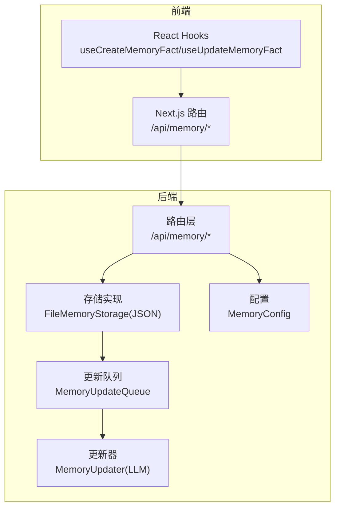
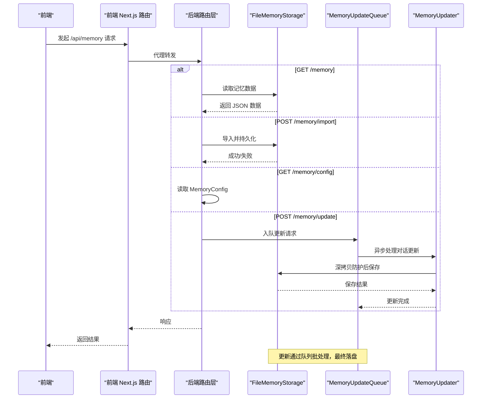
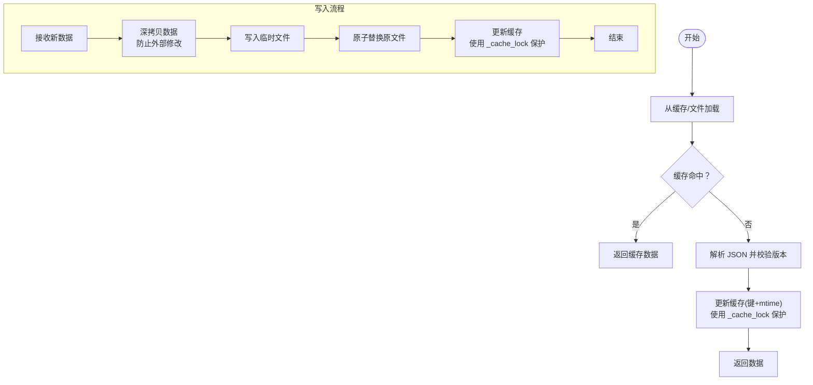
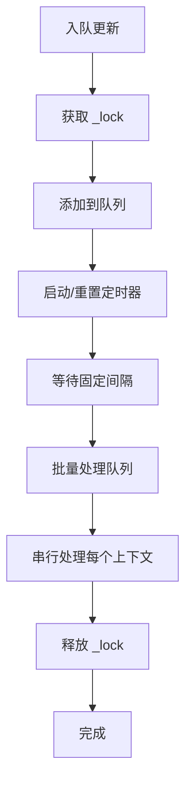
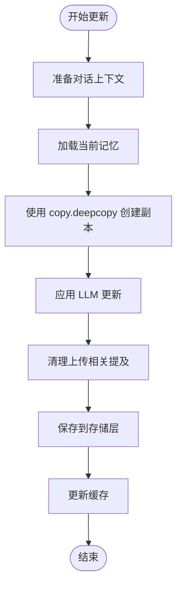
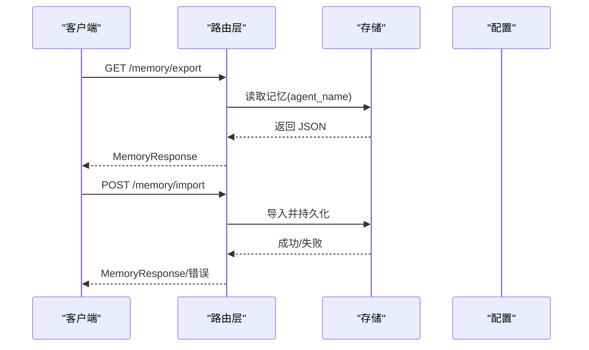
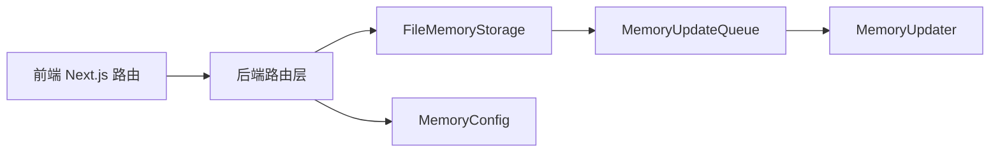

# 记忆存储机制

<cite>
**本文引用的文件**
- [backend/packages/harness/deerflow/agents/memory/storage.py](file://backend/packages/harness/deerflow/agents/memory/storage.py)
- [backend/packages/harness/deerflow/agents/memory/queue.py](file://backend/packages/harness/deerflow/agents/memory/queue.py)
- [backend/packages/harness/deerflow/agents/memory/updater.py](file://backend/packages/harness/deerflow/agents/memory/updater.py)
- [backend/packages/harness/deerflow/config/memory_config.py](file://backend/packages/harness/deerflow/config/memory_config.py)
- [backend/app/gateway/routers/memory.py](file://backend/app/gateway/routers/memory.py)
- [backend/docs/AUTH_DESIGN.md](file://backend/docs/AUTH_DESIGN.md)
- [backend/docs/MEMORY_IMPROVEMENTS.md](file://backend/docs/MEMORY_IMPROVEMENTS.md)
- [backend/tests/test_memory_storage.py](file://backend/tests/test_memory_storage.py)
- [backend/tests/test_memory_updater.py](file://backend/tests/test_memory_updater.py)
- [backend/tests/test_memory_updater_user_isolation.py](file://backend/tests/test_memory_updater_user_isolation.py)
- [backend/tests/test_migration_user_isolation.py](file://backend/tests/test_migration_user_isolation.py)
- [frontend/src/app/api/memory/route.ts](file://frontend/src/app/api/memory/route.ts)
- [frontend/src/app/api/memory/[...path]/route.ts](file://frontend/src/app/api/memory/[...path]/route.ts)
- [frontend/src/core/memory/hooks.ts](file://frontend/src/core/memory/hooks.ts)
</cite>

## 更新摘要
**变更内容**
- 新增深拷贝修复章节，详细说明缓存损坏防护机制
- 更新线程安全章节，强调锁保护和并发访问控制
- 添加缓存一致性保障机制说明
- 更新故障排查指南，包含新的缓存相关问题诊断

## 目录
1. [简介](#简介)
2. [项目结构](#项目结构)
3. [核心组件](#核心组件)
4. [架构总览](#架构总览)
5. [组件详解](#组件详解)
6. [依赖关系分析](#依赖关系分析)
7. [性能考量](#性能考量)
8. [故障排查指南](#故障排查指南)
9. [结论](#结论)
10. [附录](#附录)

## 简介
本文件系统性阐述 DeerFlow 的记忆存储机制，覆盖以下方面：
- 存储后端：基于文件系统的 JSON 持久化与内存缓存协同
- 数据模型：事实（facts）与历史（history）的结构化组织、版本字段与时间戳管理
- 用户隔离：按用户 ID 维度的目录隔离与默认桶策略
- 并发与一致性：队列化更新、缓存一致性与落盘原子性
- 查询与注入：最大注入令牌数、置信度阈值与事实排序策略
- 备份与迁移：导出/导入接口与用户隔离迁移脚本
- 配置项：容量上限、自动清理策略建议与并发访问控制

## 项目结构
记忆相关代码主要分布在后端 harness 包与前端 API 代理层：
- 后端核心
  - 记忆存储实现：FileMemoryStorage（文件 JSON 持久化）
  - 更新队列：MemoryUpdateQueue（批处理与去抖）
  - 更新器：MemoryUpdater（LLM 驱动的记忆更新）
  - 配置：MemoryConfig（容量、置信度、注入策略等）
  - 路由：/api/memory（导出/导入/配置）
- 前端
  - Next.js API 路由代理：将 /api/memory 请求转发至后端
  - React Hooks：用于前端侧的记忆事实增删改查

**图表来源**
- [frontend/src/app/api/memory/route.ts:1-35](file://frontend/src/app/api/memory/route.ts#L1-L35)
- [frontend/src/app/api/memory/[...path]/route.ts](file://frontend/src/app/api/memory/[...path]/route.ts#L1-L55)
- [frontend/src/core/memory/hooks.ts:58-84](file://frontend/src/core/memory/hooks.ts#L58-L84)
- [backend/app/gateway/routers/memory.py:259-302](file://backend/app/gateway/routers/memory.py#L259-L302)
- [backend/packages/harness/deerflow/agents/memory/storage.py:172-214](file://backend/packages/harness/deerflow/agents/memory/storage.py#L172-L214)
- [backend/packages/harness/deerflow/agents/memory/queue.py:216-287](file://backend/packages/harness/deerflow/agents/memory/queue.py#L216-L287)
- [backend/packages/harness/deerflow/agents/memory/updater.py:389-426](file://backend/packages/harness/deerflow/agents/memory/updater.py#L389-L426)
- [backend/packages/harness/deerflow/config/memory_config.py:40-83](file://backend/packages/harness/deerflow/config/memory_config.py#L40-L83)

**章节来源**
- [frontend/src/app/api/memory/route.ts:1-35](file://frontend/src/app/api/memory/route.ts#L1-L35)
- [frontend/src/app/api/memory/[...path]/route.ts](file://frontend/src/app/api/memory/[...path]/route.ts#L1-L55)
- [frontend/src/core/memory/hooks.ts:58-84](file://frontend/src/core/memory/hooks.ts#L58-L84)
- [backend/app/gateway/routers/memory.py:259-302](file://backend/app/gateway/routers/memory.py#L259-L302)

## 核心组件
- FileMemoryStorage：负责将记忆数据以 JSON 形式写入磁盘，支持缓存键与最后修改时间记录，确保落盘原子性与失败时不污染缓存。
- MemoryUpdateQueue：对记忆更新请求进行批处理与定时刷新，避免频繁 IO；提供强制刷新、非等待刷新与清空队列能力。
- MemoryUpdater：使用 LLM 基于对话上下文更新记忆，包含深拷贝防护和缓存隔离机制。
- MemoryConfig：集中管理记忆容量上限、事实置信度阈值、是否注入到系统提示词、最大注入令牌数等关键参数。
- 路由层：提供 /memory/export、/memory/import、/memory/config 等端点，支持导出导入与配置查询。
- 前端代理：将前端请求透明转发至后端 /api/memory。

**章节来源**
- [backend/packages/harness/deerflow/agents/memory/storage.py:172-214](file://backend/packages/harness/deerflow/agents/memory/storage.py#L172-L214)
- [backend/packages/harness/deerflow/agents/memory/queue.py:216-287](file://backend/packages/harness/deerflow/agents/memory/queue.py#L216-L287)
- [backend/packages/harness/deerflow/agents/memory/updater.py:299-388](file://backend/packages/harness/deerflow/agents/memory/updater.py#L299-L388)
- [backend/packages/harness/deerflow/config/memory_config.py:40-83](file://backend/packages/harness/deerflow/config/memory_config.py#L40-L83)
- [backend/app/gateway/routers/memory.py:259-302](file://backend/app/gateway/routers/memory.py#L259-L302)

## 架构总览
记忆数据在系统中的流转路径如下：
- 前端通过 Next.js 路由代理访问后端 /api/memory
- 路由层根据请求类型分发到导出/导入/配置接口
- 导入/导出与配置读取分别调用存储与配置模块
- 更新流程通过 MemoryUpdateQueue 批处理，最终由 MemoryUpdater 使用 LLM 进行智能更新

**图表来源**
- [frontend/src/app/api/memory/route.ts:1-35](file://frontend/src/app/api/memory/route.ts#L1-L35)
- [frontend/src/app/api/memory/[...path]/route.ts](file://frontend/src/app/api/memory/[...path]/route.ts#L1-L55)
- [backend/app/gateway/routers/memory.py:259-302](file://backend/app/gateway/routers/memory.py#L259-L302)
- [backend/packages/harness/deerflow/agents/memory/storage.py:172-214](file://backend/packages/harness/deerflow/agents/memory/storage.py#L172-L214)
- [backend/packages/harness/deerflow/agents/memory/queue.py:216-287](file://backend/packages/harness/deerflow/agents/memory/queue.py#L216-L287)
- [backend/packages/harness/deerflow/agents/memory/updater.py:389-426](file://backend/packages/harness/deerflow/agents/memory/updater.py#L389-L426)

## 组件详解

### 文件存储与缓存（FileMemoryStorage）
- 数据模型
  - 版本字段：用于标识记忆数据格式版本，便于未来演进与迁移
  - 事实列表：包含内容、类别、置信度等字段，支持过滤与排序
  - 历史字段：保留对话历史，供注入策略使用
  - 时间戳：保存/加载时维护最后修改时间，配合缓存键使用
- 落盘策略
  - 使用临时文件写入，成功后再替换目标文件，保证原子性
  - 失败时不会污染缓存，确保缓存一致性
- 缓存机制
  - 以缓存键（含 agent_name）为索引，缓存最近一次加载的 JSON 与 mtime
  - 读取时优先命中缓存，减少重复 IO
  - **新增**：使用 `_cache_lock` 确保并发访问时的线程安全
- 用户隔离
  - 默认 per-agent 路径：{base_dir}/users/{agent_name}/memory.json
  - 当 memory.storage_path 为绝对路径时，显式 opt-out，所有用户共享同一路径
  - 无 agent 上下文时，默认桶为 None

**图表来源**
- [backend/packages/harness/deerflow/agents/memory/storage.py:172-214](file://backend/packages/harness/deerflow/agents/memory/storage.py#L172-L214)
- [backend/tests/test_memory_storage.py:117-143](file://backend/tests/test_memory_storage.py#L117-L143)
- [backend/tests/test_memory_storage.py:167-200](file://backend/tests/test_memory_storage.py#L167-L200)
- [backend/docs/AUTH_DESIGN.md:220-254](file://backend/docs/AUTH_DESIGN.md#L220-L254)

**章节来源**
- [backend/packages/harness/deerflow/agents/memory/storage.py:172-214](file://backend/packages/harness/deerflow/agents/memory/storage.py#L172-L214)
- [backend/tests/test_memory_storage.py:117-143](file://backend/tests/test_memory_storage.py#L117-L143)
- [backend/tests/test_memory_storage.py:167-200](file://backend/tests/test_memory_storage.py#L167-L200)
- [backend/docs/AUTH_DESIGN.md:220-254](file://backend/docs/AUTH_DESIGN.md#L220-L254)

### 更新队列（MemoryUpdateQueue）
- 批处理与去抖
  - 将多个更新请求合并，延迟一段时间统一处理，降低 IO 压力
  - 提供 flush/flush_nowait/clear 等控制方法，便于测试与优雅停机
- 并发与一致性
  - 队列内串行处理，避免竞态条件
  - **新增**：使用 `_lock` 保护队列状态，确保线程安全
  - 守护线程异步处理，不影响主线程
- 适用场景
  - 高频更新（如流式对话）下显著降低落盘频率

**图表来源**
- [backend/packages/harness/deerflow/agents/memory/queue.py:216-287](file://backend/packages/harness/deerflow/agents/memory/queue.py#L216-L287)

**章节来源**
- [backend/packages/harness/deerflow/agents/memory/queue.py:216-287](file://backend/packages/harness/deerflow/agents/memory/queue.py#L216-L287)

### 记忆更新器（MemoryUpdater）
- LLM 驱动的智能更新
  - 基于对话上下文生成记忆更新建议
  - 支持纠正信号和强化信号检测
- **深拷贝防护机制**
  - 在 `_finalize_update` 中使用 `copy.deepcopy()` 创建独立副本
  - 防止保存失败时缓存对象被污染
  - 确保原始缓存数据不受更新过程的影响
- **缓存隔离**
  - 使用深拷贝确保更新过程中的数据隔离
  - 即使保存失败，原始缓存也不会被修改

**图表来源**
- [backend/packages/harness/deerflow/agents/memory/updater.py:389-426](file://backend/packages/harness/deerflow/agents/memory/updater.py#L389-L426)

**章节来源**
- [backend/packages/harness/deerflow/agents/memory/updater.py:299-388](file://backend/packages/harness/deerflow/agents/memory/updater.py#L299-L388)
- [backend/packages/harness/deerflow/agents/memory/updater.py:389-426](file://backend/packages/harness/deerflow/agents/memory/updater.py#L389-L426)

### 配置（MemoryConfig）
- 关键参数
  - 最大事实数量：限制记忆体量，防止无限增长
  - 事实置信度阈值：仅保留高于阈值的事实
  - 是否注入到系统提示词：控制记忆注入开关
  - 最大注入令牌数：限制注入长度，避免上下文溢出
- 参数范围与约束
  - 数值范围受字段校验保护，避免非法配置
- 动态生效
  - 通过全局 getter/setter 注入到运行时，影响后续读写行为

**章节来源**
- [backend/packages/harness/deerflow/config/memory_config.py:40-83](file://backend/packages/harness/deerflow/config/memory_config.py#L40-L83)

### 路由与导出/导入
- 导出
  - GET /memory/export：返回当前用户的记忆 JSON，用于备份或迁移
- 导入
  - POST /memory/import：从 JSON 覆盖当前记忆，失败时返回 500
- 配置
  - GET /memory/config：返回当前 MemoryConfig 设置

**图表来源**
- [backend/app/gateway/routers/memory.py:259-302](file://backend/app/gateway/routers/memory.py#L259-L302)

**章节来源**
- [backend/app/gateway/routers/memory.py:259-302](file://backend/app/gateway/routers/memory.py#L259-L302)

### 前端代理与 Hooks
- 代理层
  - /api/memory 与 /api/memory/* 的请求被 Next.js 路由透明转发至后端
- Hooks
  - useCreateMemoryFact/useUpdateMemoryFact 在成功后更新本地查询缓存，提升交互体验

**章节来源**
- [frontend/src/app/api/memory/route.ts:1-35](file://frontend/src/app/api/memory/route.ts#L1-L35)
- [frontend/src/app/api/memory/[...path]/route.ts](file://frontend/src/app/api/memory/[...path]/route.ts#L1-L55)
- [frontend/src/core/memory/hooks.ts:58-84](file://frontend/src/core/memory/hooks.ts#L58-L84)

## 依赖关系分析
- 存储依赖
  - FileMemoryStorage 依赖路径解析与配置模块，确保 per-agent 隔离与默认桶策略
  - MemoryUpdateQueue 与存储解耦，通过统一接口提交更新
  - **新增**：MemoryUpdater 依赖 MemoryStorage 进行持久化
- 路由依赖
  - 路由层依赖存储与配置模块，提供导出/导入/配置查询
- 前端依赖
  - Next.js 路由代理依赖后端 /api/memory 接口

**图表来源**
- [frontend/src/app/api/memory/route.ts:1-35](file://frontend/src/app/api/memory/route.ts#L1-L35)
- [frontend/src/app/api/memory/[...path]/route.ts](file://frontend/src/app/api/memory/[...path]/route.ts#L1-L55)
- [backend/app/gateway/routers/memory.py:259-302](file://backend/app/gateway/routers/memory.py#L259-L302)
- [backend/packages/harness/deerflow/agents/memory/storage.py:172-214](file://backend/packages/harness/deerflow/agents/memory/storage.py#L172-L214)
- [backend/packages/harness/deerflow/agents/memory/queue.py:216-287](file://backend/packages/harness/deerflow/agents/memory/queue.py#L216-L287)
- [backend/packages/harness/deerflow/agents/memory/updater.py:389-426](file://backend/packages/harness/deerflow/agents/memory/updater.py#L389-L426)
- [backend/packages/harness/deerflow/config/memory_config.py:40-83](file://backend/packages/harness/deerflow/config/memory_config.py#L40-L83)

**章节来源**
- [backend/packages/harness/deerflow/agents/memory/storage.py:172-214](file://backend/packages/harness/deerflow/agents/memory/storage.py#L172-L214)
- [backend/packages/harness/deerflow/agents/memory/queue.py:216-287](file://backend/packages/harness/deerflow/agents/memory/queue.py#L216-L287)
- [backend/packages/harness/deerflow/agents/memory/updater.py:389-426](file://backend/packages/harness/deerflow/agents/memory/updater.py#L389-L426)
- [backend/packages/harness/deerflow/config/memory_config.py:40-83](file://backend/packages/harness/deerflow/config/memory_config.py#L40-L83)
- [backend/app/gateway/routers/memory.py:259-302](file://backend/app/gateway/routers/memory.py#L259-L302)

## 性能考量
- 落盘频率控制
  - 使用 MemoryUpdateQueue 对高频更新进行批处理与去抖，显著降低磁盘写放大
- 缓存命中率
  - FileMemoryStorage 以缓存键+mtime 精准缓存，减少重复解析与 IO
  - **新增**：使用 `_cache_lock` 保护缓存访问，提高并发性能
- 写入原子性
  - 临时文件写入+替换，避免部分写导致的数据损坏
- 上下文注入优化
  - 通过最大注入令牌数与置信度阈值，控制注入成本与质量
- 并发访问
  - 队列串行化处理，避免多线程竞争
  - **新增**：使用 `_lock` 保护队列状态，确保线程安全
  - **新增**：MemoryUpdater 使用深拷贝隔离更新过程

## 故障排查指南
- 导入失败（500）
  - 检查导入 JSON 结构是否符合预期；确认 agent_name 正确传递
  - 参考：[backend/app/gateway/routers/memory.py:275-289](file://backend/app/gateway/routers/memory.py#L275-L289)
- 写入失败（OSError）
  - 观察存储实现是否抛出异常；检查磁盘权限与空间
  - **新增**：缓存不应被污染：深拷贝机制确保原始缓存数据不受影响
  - 参考：[backend/tests/test_memory_storage.py:131-143](file://backend/tests/test_memory_storage.py#L131-L143)
  - 参考：[backend/tests/test_memory_updater.py:890-935](file://backend/tests/test_memory_updater.py#L890-L935)
- 用户隔离问题
  - 确认 memory.storage_path 是否为绝对路径导致 opt-out
  - 无 agent 上下文时默认桶为 None
  - 参考：[backend/docs/AUTH_DESIGN.md:220-254](file://backend/docs/AUTH_DESIGN.md#L220-L254)
- 迁移与兼容
  - 使用迁移脚本将旧布局迁移到 per-agent 目录
  - 参考：[backend/tests/test_migration_user_isolation.py:96-129](file://backend/tests/test_migration_user_isolation.py#L96-L129)
- **新增**：缓存一致性问题
  - 如果发现缓存数据异常，检查是否有并发访问冲突
  - 确认 `_cache_lock` 是否正确使用
  - 验证深拷贝机制是否正常工作

**章节来源**
- [backend/app/gateway/routers/memory.py:275-289](file://backend/app/gateway/routers/memory.py#L275-L289)
- [backend/tests/test_memory_storage.py:131-143](file://backend/tests/test_memory_storage.py#L131-L143)
- [backend/tests/test_memory_storage.py:167-200](file://backend/tests/test_memory_storage.py#L167-L200)
- [backend/tests/test_memory_updater.py:890-935](file://backend/tests/test_memory_updater.py#L890-L935)
- [backend/docs/AUTH_DESIGN.md:220-254](file://backend/docs/AUTH_DESIGN.md#L220-L254)
- [backend/tests/test_migration_user_isolation.py:96-129](file://backend/tests/test_migration_user_isolation.py#L96-L129)

## 结论
DeerFlow 的记忆存储采用"文件 JSON + 内存缓存 + 队列化更新 + LLM 驱动更新"的组合方案，在保证数据安全与一致性的前提下，兼顾了性能与可运维性。通过 per-agent 隔离、注入策略与容量控制，系统能够在复杂场景下稳定运行。**最新的改进包括深拷贝防护、线程安全增强和缓存一致性保障**，进一步提升了系统的可靠性。建议在生产环境中结合监控与告警，持续评估落盘频率与缓存命中率，并按需调整配置参数。

## 附录

### 存储模型设计要点
- 版本字段：用于演进与迁移
- 事实字段：内容、类别、置信度；支持过滤与排序
- 历史字段：保留对话历史，参与注入
- 时间戳：保存/加载时维护，配合缓存键
- 用户隔离：默认 per-agent 路径；绝对路径 opt-out

**章节来源**
- [backend/packages/harness/deerflow/agents/memory/storage.py:172-214](file://backend/packages/harness/deerflow/agents/memory/storage.py#L172-L214)
- [backend/docs/MEMORY_IMPROVEMENTS.md:57-66](file://backend/docs/MEMORY_IMPROVEMENTS.md#L57-L66)

### 查询与注入策略
- 置信度阈值：仅保留高于阈值的事实
- 最大注入令牌数：限制注入长度
- 注入开关：可关闭以降低上下文开销

**章节来源**
- [backend/packages/harness/deerflow/config/memory_config.py:40-83](file://backend/packages/harness/deerflow/config/memory_config.py#L40-L83)

### 备份与恢复
- 导出：GET /memory/export
- 导入：POST /memory/import
- 建议：定期导出并归档，导入前验证 JSON 结构

**章节来源**
- [backend/app/gateway/routers/memory.py:259-302](file://backend/app/gateway/routers/memory.py#L259-L302)

### 用户隔离与迁移
- 默认 per-agent 路径：{base_dir}/users/{agent_name}/memory.json
- 绝对路径 opt-out：所有用户共享同一路径
- 迁移脚本：将旧布局迁移到 per-agent 目录

**章节来源**
- [backend/docs/AUTH_DESIGN.md:220-254](file://backend/docs/AUTH_DESIGN.md#L220-L254)
- [backend/tests/test_migration_user_isolation.py:96-129](file://backend/tests/test_migration_user_isolation.py#L96-L129)

### **新增**：深拷贝修复与缓存防护机制
- **深拷贝防护**：MemoryUpdater 在更新过程中使用 `copy.deepcopy()` 创建独立副本，防止保存失败时缓存被污染
- **缓存隔离**：更新过程中的任何异常都不会影响原始缓存数据
- **线程安全**：FileMemoryStorage 使用 `_cache_lock` 保护缓存访问，MemoryUpdateQueue 使用 `_lock` 保护队列状态
- **一致性保障**：即使在并发环境下，缓存数据也保持一致性和完整性

**章节来源**
- [backend/packages/harness/deerflow/agents/memory/updater.py:384-386](file://backend/packages/harness/deerflow/agents/memory/updater.py#L384-L386)
- [backend/packages/harness/deerflow/agents/memory/storage.py:69-71](file://backend/packages/harness/deerflow/agents/memory/storage.py#L69-L71)
- [backend/packages/harness/deerflow/agents/memory/queue.py:39](file://backend/packages/harness/deerflow/agents/memory/queue.py#L39)
- [backend/tests/test_memory_updater.py:890-935](file://backend/tests/test_memory_updater.py#L890-L935)
- [backend/tests/test_memory_storage.py:167-200](file://backend/tests/test_memory_storage.py#L167-L200)