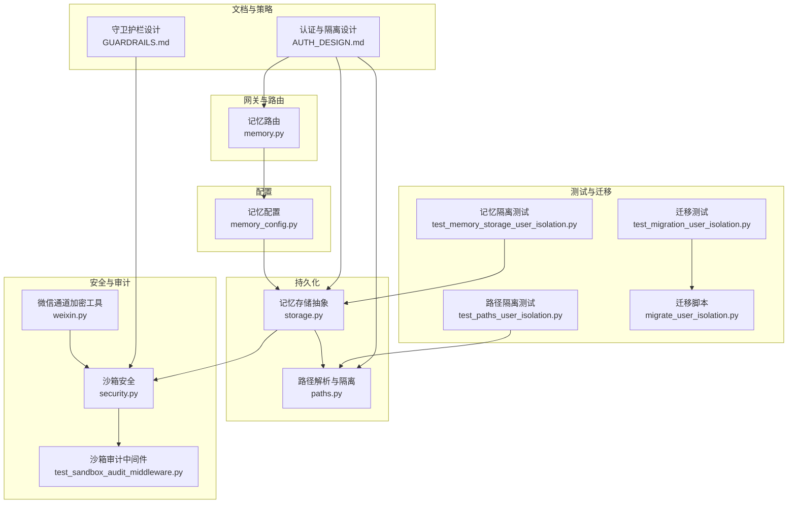
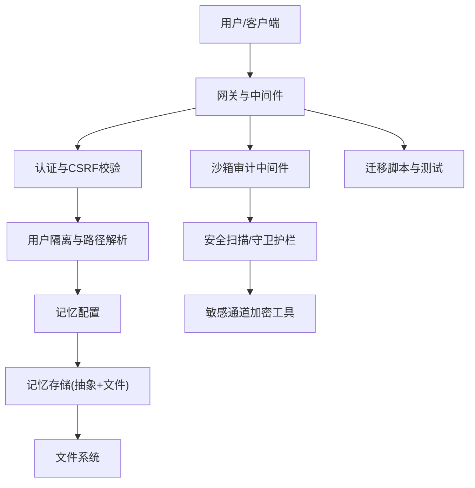
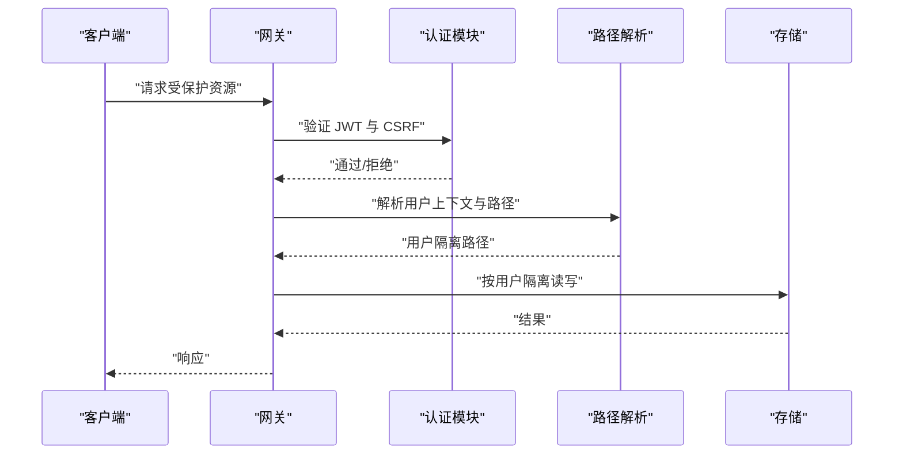
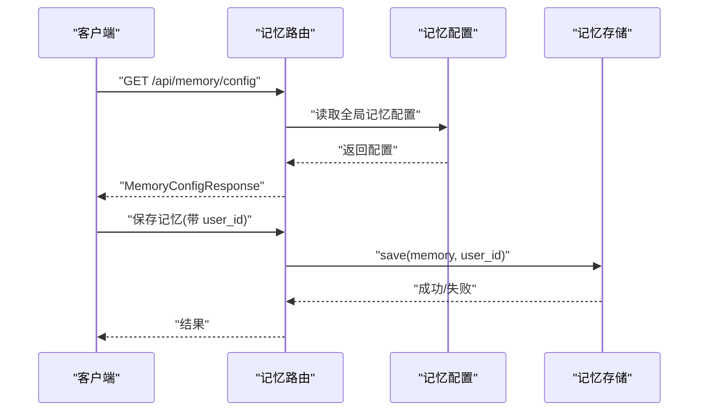
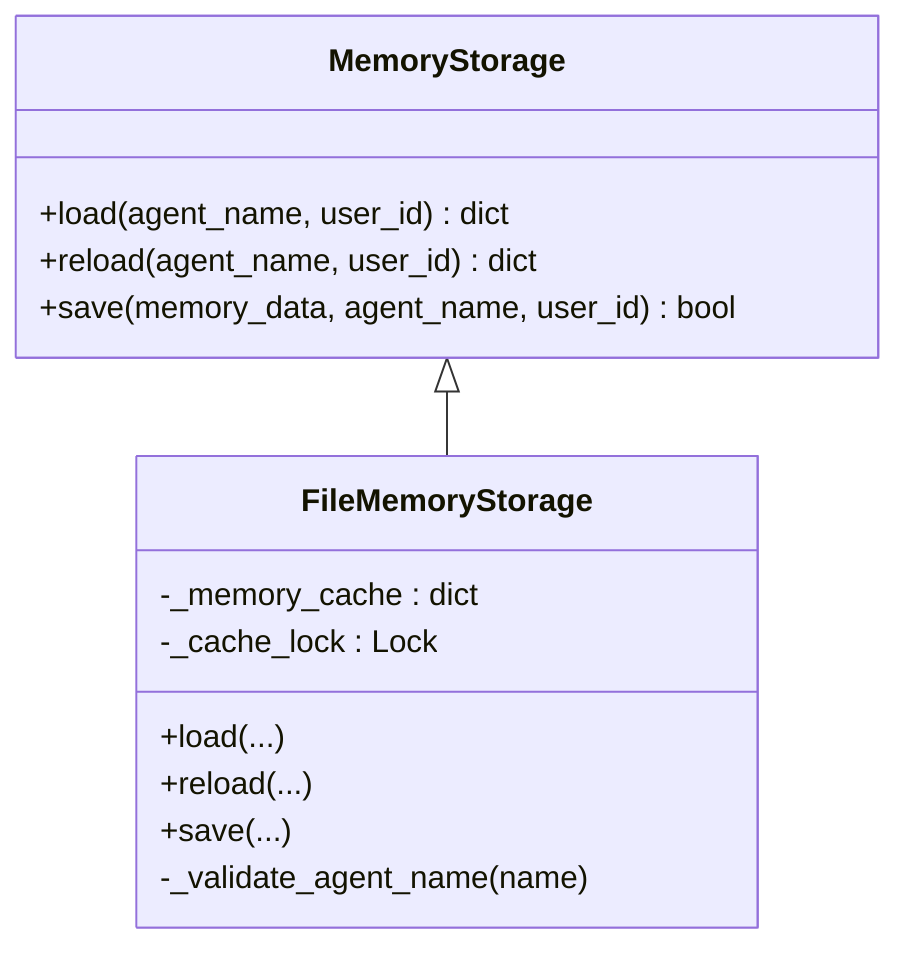
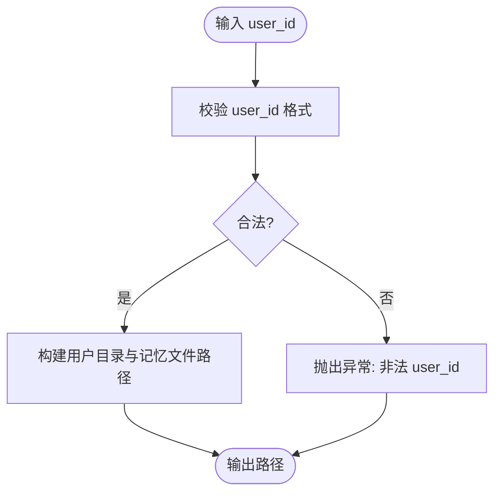
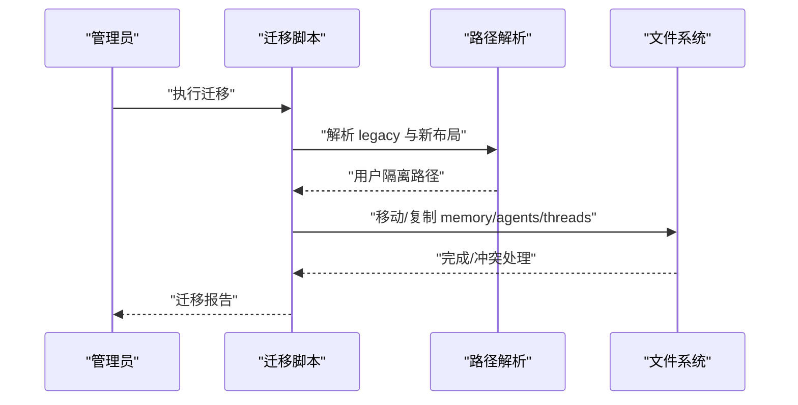
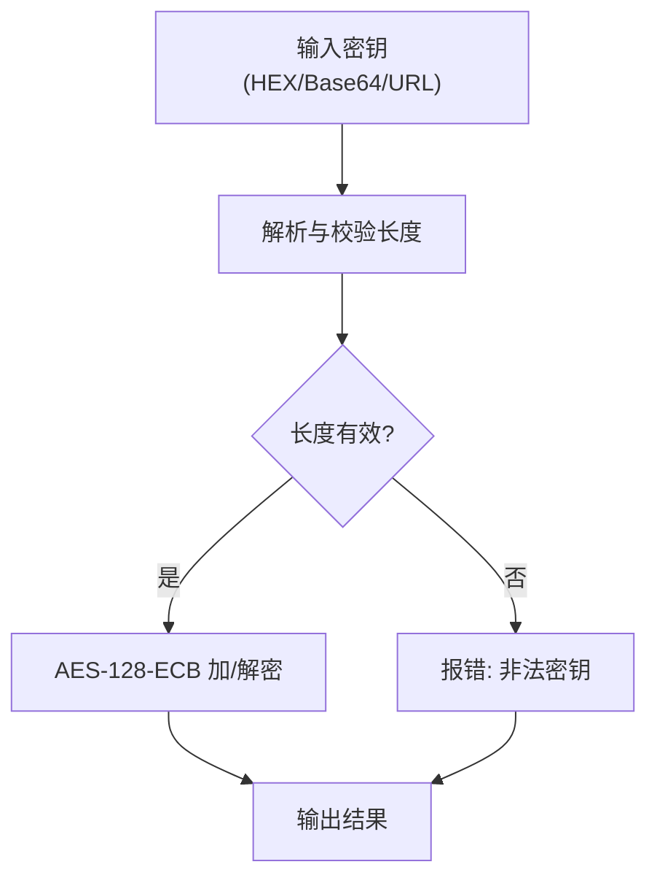
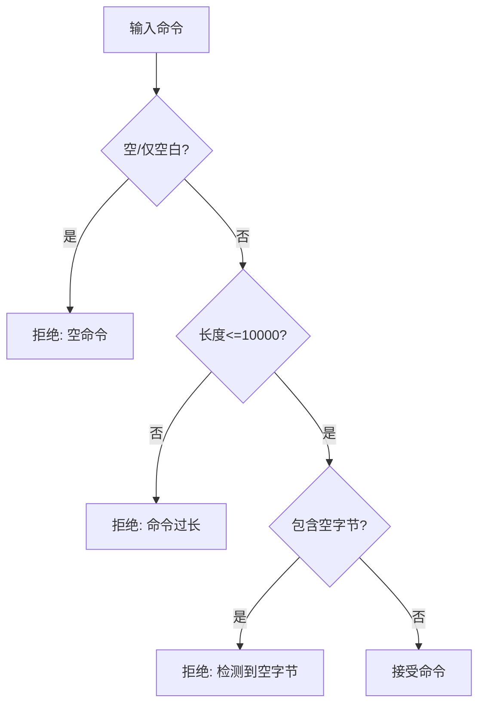
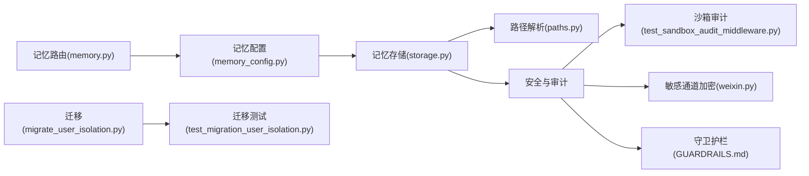

# 记忆安全与隐私

<cite>
**本文引用的文件**
- [AUTH_DESIGN.md](file://backend/docs/AUTH_DESIGN.md)
- [memory.py](file://backend/app/gateway/routers/memory.py)
- [memory_config.py](file://backend/packages/harness/deerflow/config/memory_config.py)
- [storage.py](file://backend/packages/harness/deerflow/agents/memory/storage.py)
- [paths.py](file://backend/packages/harness/deerflow/config/paths.py)
- [test_memory_storage_user_isolation.py](file://backend/tests/test_memory_storage_user_isolation.py)
- [test_paths_user_isolation.py](file://backend/tests/test_paths_user_isolation.py)
- [test_memory_queue_user_isolation.py](file://backend/tests/test_memory_queue_user_isolation.py)
- [test_memory_thread_meta_isolation.py](file://backend/tests/test_memory_thread_meta_isolation.py)
- [test_memory_updater_user_isolation.py](file://backend/tests/test_memory_updater_user_isolation.py)
- [test_sandbox_audit_middleware.py](file://backend/tests/test_sandbox_audit_middleware.py)
- [security.py](file://backend/packages/harness/deerflow/sandbox/security.py)
- [weixin.py](file://backend/app/channels/wechat.py)
- [load_memory_sample.py](file://scripts/load_memory_sample.py)
- [migrate_user_isolation.py](file://scripts/migrate_user_isolation.py)
- [test_migration_user_isolation.py](file://backend/tests/test_migration_user_isolation.py)
- [GUARDRAILS.md](file://backend/docs/GUARDRAILS.md)
</cite>

## 目录
1. [引言](#引言)
2. [项目结构](#项目结构)
3. [核心组件](#核心组件)
4. [架构总览](#架构总览)
5. [详细组件分析](#详细组件分析)
6. [依赖关系分析](#依赖关系分析)
7. [性能考量](#性能考量)
8. [故障排查指南](#故障排查指南)
9. [结论](#结论)
10. [附录](#附录)

## 引言
本文件面向 DeerFlow 的记忆安全与隐私保护系统，系统性阐述长期记忆的安全架构设计与实践，涵盖数据加密存储、访问权限控制、审计日志记录、隐私数据脱敏机制、用户数据隔离策略（多租户隔离、会话边界保护、数据生命周期管理与合规要求），以及安全配置选项（加密算法选择、密钥管理策略、访问控制列表、数据导出限制）与端到端数据安全保障与隐私合规落地路径。

## 项目结构
围绕记忆安全与隐私的关键代码分布在以下区域：
- 认证与隔离设计文档：定义用户身份、默认强制认证、隔离默认开启、路径解析与安全不变量等。
- 记忆路由与配置：提供记忆配置查询接口与全局记忆配置读写能力。
- 记忆存储抽象与实现：定义存储接口、文件存储实现、缓存与并发控制。
- 路径解析与隔离：用户目录、记忆文件位置解析与路径校验。
- 测试与迁移：用户隔离测试、路径隔离测试、迁移脚本与测试。
- 安全与沙箱：沙箱审计中间件、安全扫描、敏感通道加密工具。
- 文档与策略：守卫护栏设计原则、数据生命周期管理与保留策略。

**图示来源**
- [memory.py:297-320](file://backend/app/gateway/routers/memory.py#L297-L320)
- [memory_config.py:5-79](file://backend/packages/harness/deerflow/config/memory_config.py#L5-L79)
- [storage.py:43-74](file://backend/packages/harness/deerflow/agents/memory/storage.py#L43-L74)
- [paths.py:151-157](file://backend/packages/harness/deerflow/config/paths.py#L151-L157)
- [security.py](file://backend/packages/harness/deerflow/sandbox/security.py)
- [test_sandbox_audit_middleware.py:251-290](file://backend/tests/test_sandbox_audit_middleware.py#L251-L290)
- [weixin.py:82-97](file://backend/app/channels/wechat.py#L82-L97)
- [test_memory_storage_user_isolation.py:21-71](file://backend/tests/test_memory_storage_user_isolation.py#L21-L71)
- [test_paths_user_isolation.py:15-46](file://backend/tests/test_paths_user_isolation.py#L15-L46)
- [migrate_user_isolation.py](file://scripts/migrate_user_isolation.py)
- [test_migration_user_isolation.py:96-145](file://backend/tests/test_migration_user_isolation.py#L96-L145)
- [AUTH_DESIGN.md:1-308](file://backend/docs/AUTH_DESIGN.md#L1-L308)
- [GUARDRAILS.md:34-36](file://backend/docs/GUARDRAILS.md#L34-L36)

**章节来源**
- [AUTH_DESIGN.md:1-308](file://backend/docs/AUTH_DESIGN.md#L1-L308)
- [memory.py:297-320](file://backend/app/gateway/routers/memory.py#L297-L320)
- [memory_config.py:5-79](file://backend/packages/harness/deerflow/config/memory_config.py#L5-L79)
- [storage.py:43-74](file://backend/packages/harness/deerflow/agents/memory/storage.py#L43-L74)
- [paths.py:151-157](file://backend/packages/harness/deerflow/config/paths.py#L151-L157)

## 核心组件
- 认证与隔离设计：定义默认强制认证、隔离默认开启、路径解析与安全不变量，确保用户身份贯穿 API、运行时、文件系统、记忆与代理。
- 记忆配置与路由：提供记忆配置查询端点与全局配置读写，支持按用户与代理维度的默认存储路径。
- 记忆存储抽象与实现：抽象存储接口、文件存储实现、缓存与并发锁，保障并发安全与一致性。
- 路径解析与隔离：用户目录与记忆文件路径解析、路径校验与防穿越，确保文件系统层面的隔离。
- 安全与审计：沙箱审计中间件、安全扫描、敏感通道加密工具，形成多层防护。
- 测试与迁移：覆盖用户隔离、路径隔离、迁移脚本与测试，保障升级与演进过程中的数据安全。

**章节来源**
- [AUTH_DESIGN.md:1-308](file://backend/docs/AUTH_DESIGN.md#L1-L308)
- [memory.py:297-320](file://backend/app/gateway/routers/memory.py#L297-L320)
- [memory_config.py:5-79](file://backend/packages/harness/deerflow/config/memory_config.py#L5-L79)
- [storage.py:43-74](file://backend/packages/harness/deerflow/agents/memory/storage.py#L43-L74)
- [paths.py:151-157](file://backend/packages/harness/deerflow/config/paths.py#L151-L157)
- [security.py](file://backend/packages/harness/deerflow/sandbox/security.py)
- [test_sandbox_audit_middleware.py:251-290](file://backend/tests/test_sandbox_audit_middleware.py#L251-L290)
- [weixin.py:82-97](file://backend/app/channels/wechat.py#L82-L97)
- [test_memory_storage_user_isolation.py:21-71](file://backend/tests/test_memory_storage_user_isolation.py#L21-L71)
- [test_paths_user_isolation.py:15-46](file://backend/tests/test_paths_user_isolation.py#L15-L46)
- [migrate_user_isolation.py](file://scripts/migrate_user_isolation.py)
- [test_migration_user_isolation.py:96-145](file://backend/tests/test_migration_user_isolation.py#L96-L145)

## 架构总览
记忆安全与隐私的整体架构围绕“身份—隔离—存储—审计—合规”的闭环展开：
- 身份与会话：默认强制认证，JWT 仅在 HttpOnly Cookie 中传输，严格验证 token 版本与 CSRF。
- 隔离策略：默认 per-user 隔离，文件系统路径与仓库查询均基于当前用户上下文解析；绝对 memory 路径视为显式 opt-out。
- 存储与访问控制：记忆存储抽象与文件存储实现，结合路径校验与缓存锁；内部调用使用 default 用户桶，需建立外部用户映射以实现 IM 用户隔离。
- 审计与安全：沙箱审计中间件进行命令输入校验与长度限制；安全扫描与守卫护栏提供确定性授权；敏感通道采用对称加密工具。
- 合规与生命周期：迁移脚本与测试保障历史数据迁移；文档中给出数据生命周期管理与保留策略。

**图示来源**
- [AUTH_DESIGN.md:1-308](file://backend/docs/AUTH_DESIGN.md#L1-L308)
- [memory.py:297-320](file://backend/app/gateway/routers/memory.py#L297-L320)
- [memory_config.py:5-79](file://backend/packages/harness/deerflow/config/memory_config.py#L5-L79)
- [storage.py:43-74](file://backend/packages/harness/deerflow/agents/memory/storage.py#L43-L74)
- [paths.py:151-157](file://backend/packages/harness/deerflow/config/paths.py#L151-L157)
- [security.py](file://backend/packages/harness/deerflow/sandbox/security.py)
- [test_sandbox_audit_middleware.py:251-290](file://backend/tests/test_sandbox_audit_middleware.py#L251-L290)
- [weixin.py:82-97](file://backend/app/channels/wechat.py#L82-L97)
- [migrate_user_isolation.py](file://scripts/migrate_user_isolation.py)
- [test_migration_user_isolation.py:96-145](file://backend/tests/test_migration_user_isolation.py#L96-L145)

## 详细组件分析

### 认证与隔离设计（身份与会话边界）
- 默认强制认证：除健康检查、文档与认证引导端点外，HTTP 路由均需有效 session。
- 服务端持有所有权：客户端 metadata 不得声明 user_id/owner_id。
- 隔离默认开启：仓库、文件路径、记忆、代理配置默认按当前用户解析。
- 安全不变量：JWT 仅在 HttpOnly Cookie 中传输；非公开路由不得仅凭 cookie 放行；token_version 不匹配必须拒绝；路径解析必须经由 Paths 与沙箱路径校验。
- 内部调用：IM 渠道通过 X-DeerFlow-Internal-Token 与 CSRF 进行内部认证，识别为 system_role="internal" 的 default 用户桶，需建立外部用户映射以实现 IM 用户隔离。

**图示来源**
- [AUTH_DESIGN.md:1-308](file://backend/docs/AUTH_DESIGN.md#L1-L308)
- [paths.py:151-157](file://backend/packages/harness/deerflow/config/paths.py#L151-L157)

**章节来源**
- [AUTH_DESIGN.md:1-308](file://backend/docs/AUTH_DESIGN.md#L1-L308)

### 记忆配置与路由（配置读取与默认存储路径）
- 记忆配置查询端点：提供 MemoryConfigResponse，返回当前记忆配置状态。
- 默认存储路径：当存在用户上下文且 memory.storage_path 为空或相对时，默认 per-user 路径；仅当绝对路径时视为显式 opt-out，所有用户共享同一路径。
- 自定义代理写入：用户自定义代理写入 per-user agents 目录，旧布局仅作为只读兼容回退。

**图示来源**
- [memory.py:297-320](file://backend/app/gateway/routers/memory.py#L297-L320)
- [memory_config.py:5-79](file://backend/packages/harness/deerflow/config/memory_config.py#L5-L79)
- [storage.py:43-74](file://backend/packages/harness/deerflow/agents/memory/storage.py#L43-L74)

**章节来源**
- [memory.py:297-320](file://backend/app/gateway/routers/memory.py#L297-L320)
- [memory_config.py:5-79](file://backend/packages/harness/deerflow/config/memory_config.py#L5-L79)

### 记忆存储抽象与实现（缓存、并发与路径校验）
- 抽象接口：MemoryStorage 定义 load/reload/save，确保不同存储后端的一致性。
- 文件存储实现：FileMemoryStorage 提供基于文件系统的实现，包含 per-user/agent 缓存与并发锁，避免竞态。
- 路径校验：_validate_agent_name 对代理名进行安全校验，防止路径注入。

**图示来源**
- [storage.py:43-74](file://backend/packages/harness/deerflow/agents/memory/storage.py#L43-L74)

**章节来源**
- [storage.py:43-74](file://backend/packages/harness/deerflow/agents/memory/storage.py#L43-L74)

### 路径解析与隔离（用户目录与记忆文件）
- 用户目录与记忆文件：user_dir、user_memory_file 将 user_id 解析到 {base_dir}/users/{user_id}/...，并进行用户 ID 校验，拒绝路径穿越与非法字符。
- 代理记忆文件：user_agent_memory_file 生成 per-user agents 下的 memory.json。
- 测试覆盖：路径隔离测试验证非法 user_id 被拒绝、合法 user_id 正确解析到 users 目录。

**图示来源**
- [paths.py:151-157](file://backend/packages/harness/deerflow/config/paths.py#L151-L157)
- [test_paths_user_isolation.py:15-46](file://backend/tests/test_paths_user_isolation.py#L15-L46)

**章节来源**
- [paths.py:151-157](file://backend/packages/harness/deerflow/config/paths.py#L151-L157)
- [test_paths_user_isolation.py:15-46](file://backend/tests/test_paths_user_isolation.py#L15-L46)

### 用户数据隔离策略（多租户、会话边界、生命周期与合规）
- 多租户隔离：默认 per-user 隔离，仓库与文件路径均从当前用户上下文解析；绝对 memory 路径视为 opt-out。
- 会话边界保护：内部调用使用 default 用户桶，需建立外部平台用户到 DeerFlow 用户的映射，以实现 IM 用户隔离。
- 数据生命周期管理：迁移脚本与测试覆盖全局 memory、threads 与 legacy agents 的迁移，确保升级过程中数据不丢失。
- 合规要求：安全不变量要求路径解析必须通过 Paths 与沙箱路径校验，禁止拼接未校验的用户输入；捕获认证、迁移、后台任务异常必须记录日志。

**图示来源**
- [migrate_user_isolation.py](file://scripts/migrate_user_isolation.py)
- [test_migration_user_isolation.py:96-145](file://backend/tests/test_migration_user_isolation.py#L96-L145)
- [AUTH_DESIGN.md:1-308](file://backend/docs/AUTH_DESIGN.md#L1-L308)

**章节来源**
- [AUTH_DESIGN.md:1-308](file://backend/docs/AUTH_DESIGN.md#L1-L308)
- [migrate_user_isolation.py](file://scripts/migrate_user_isolation.py)
- [test_migration_user_isolation.py:96-145](file://backend/tests/test_migration_user_isolation.py#L96-L145)

### 安全配置选项（加密算法、密钥管理、访问控制、导出限制）
- 加密算法选择：敏感通道提供 AES-128-ECB 加解密工具，支持十六进制与 Base64/URL 安全编码的密钥解析与校验。
- 密钥管理策略：密钥长度校验、标准化处理与解码容错；建议结合环境变量与密钥管理服务进行安全存储与轮换。
- 访问控制列表：通过认证与隔离设计文档中的安全不变量与路径校验，确保访问控制默认开启且不可静默退化。
- 数据导出限制：默认 per-user 隔离，绝对 memory 路径视为 opt-out；导出功能需遵循访问控制与审计要求。

**图示来源**
- [weixin.py:82-97](file://backend/app/channels/wechat.py#L82-L97)
- [weixin.py:1116-1137](file://backend/app/channels/wechat.py#L1116-L1137)

**章节来源**
- [weixin.py:82-97](file://backend/app/channels/wechat.py#L82-L97)
- [weixin.py:1116-1137](file://backend/app/channels/wechat.py#L1116-L1137)
- [AUTH_DESIGN.md:1-308](file://backend/docs/AUTH_DESIGN.md#L1-L308)

### 审计日志与隐私数据脱敏（沙箱审计、安全扫描、守卫护栏）
- 沙箱审计中间件：对命令输入进行空值、空白、超长、空字节检测，拒绝危险输入；提供单元测试覆盖。
- 安全扫描与守卫护栏：提供确定性、策略驱动的授权，无需人工干预；强调进程隔离与语义授权的边界。

**图示来源**
- [test_sandbox_audit_middleware.py:251-290](file://backend/tests/test_sandbox_audit_middleware.py#L251-L290)
- [security.py](file://backend/packages/harness/deerflow/sandbox/security.py)
- [GUARDRAILS.md:34-36](file://backend/docs/GUARDRAILS.md#L34-L36)

**章节来源**
- [test_sandbox_audit_middleware.py:251-290](file://backend/tests/test_sandbox_audit_middleware.py#L251-L290)
- [security.py](file://backend/packages/harness/deerflow/sandbox/security.py)
- [GUARDRAILS.md:34-36](file://backend/docs/GUARDRAILS.md#L34-L36)

### 端到端数据安全保障与隐私合规
- 身份贯穿：认证模块确保用户身份贯穿 HTTP API、运行时、文件系统、记忆与代理。
- 存储安全：文件存储实现结合路径校验与缓存锁，防止竞态与路径注入；默认 per-user 隔离，opt-out 场景需明确风险提示。
- 审计与合规：安全不变量与迁移测试保障升级过程中的数据完整性；沙箱审计与守卫护栏提供确定性授权与输入校验。

**章节来源**
- [AUTH_DESIGN.md:1-308](file://backend/docs/AUTH_DESIGN.md#L1-L308)
- [storage.py:43-74](file://backend/packages/harness/deerflow/agents/memory/storage.py#L43-L74)
- [test_sandbox_audit_middleware.py:251-290](file://backend/tests/test_sandbox_audit_middleware.py#L251-L290)

## 依赖关系分析
- 记忆路由依赖记忆配置模块，后者提供全局配置读写。
- 记忆存储实现依赖路径解析模块，确保文件系统路径安全。
- 安全与审计模块贯穿沙箱与工具链，形成多层防护。
- 测试与迁移脚本保障隔离与升级过程中的正确性与安全性。

**图示来源**
- [memory.py:297-320](file://backend/app/gateway/routers/memory.py#L297-L320)
- [memory_config.py:5-79](file://backend/packages/harness/deerflow/config/memory_config.py#L5-L79)
- [storage.py:43-74](file://backend/packages/harness/deerflow/agents/memory/storage.py#L43-L74)
- [paths.py:151-157](file://backend/packages/harness/deerflow/config/paths.py#L151-L157)
- [test_sandbox_audit_middleware.py:251-290](file://backend/tests/test_sandbox_audit_middleware.py#L251-L290)
- [weixin.py:82-97](file://backend/app/channels/wechat.py#L82-L97)
- [GUARDRAILS.md:34-36](file://backend/docs/GUARDRAILS.md#L34-L36)
- [migrate_user_isolation.py](file://scripts/migrate_user_isolation.py)
- [test_migration_user_isolation.py:96-145](file://backend/tests/test_migration_user_isolation.py#L96-L145)

**章节来源**
- [memory.py:297-320](file://backend/app/gateway/routers/memory.py#L297-L320)
- [memory_config.py:5-79](file://backend/packages/harness/deerflow/config/memory_config.py#L5-L79)
- [storage.py:43-74](file://backend/packages/harness/deerflow/agents/memory/storage.py#L43-L74)
- [paths.py:151-157](file://backend/packages/harness/deerflow/config/paths.py#L151-L157)
- [test_sandbox_audit_middleware.py:251-290](file://backend/tests/test_sandbox_audit_middleware.py#L251-L290)
- [weixin.py:82-97](file://backend/app/channels/wechat.py#L82-L97)
- [GUARDRAILS.md:34-36](file://backend/docs/GUARDRAILS.md#L34-L36)
- [migrate_user_isolation.py](file://scripts/migrate_user_isolation.py)
- [test_migration_user_isolation.py:96-145](file://backend/tests/test_migration_user_isolation.py#L96-L145)

## 性能考量
- 缓存与并发：文件存储实现使用 per-user/agent 缓存与锁，降低重复读取与竞态风险。
- 路径解析：路径解析与校验在高并发场景下应尽量复用 Paths 实例，减少重复计算。
- 沙箱审计：命令长度与空字节检测为 O(n) 复杂度，建议在入口处尽早短路，避免无效计算。
- 迁移与升级：迁移脚本应分批处理与幂等设计，避免长时间阻塞与重复迁移。

## 故障排查指南
- 认证与会话问题：确认 JWT 是否在 HttpOnly Cookie 中传输，token_version 是否匹配，CSRF 是否一致。
- 路径解析错误：检查 user_id 是否包含非法字符或路径穿越尝试，确保通过路径校验。
- 记忆存储冲突：检查缓存锁是否导致死锁，确认并发访问是否受控。
- 沙箱审计拒绝：检查命令是否包含空字节、是否为空或仅空白、是否超过最大长度。
- 迁移失败：查看迁移脚本输出与测试报告，确认目标路径是否存在、权限是否足够。

**章节来源**
- [AUTH_DESIGN.md:1-308](file://backend/docs/AUTH_DESIGN.md#L1-L308)
- [test_paths_user_isolation.py:15-46](file://backend/tests/test_paths_user_isolation.py#L15-L46)
- [storage.py:43-74](file://backend/packages/harness/deerflow/agents/memory/storage.py#L43-L74)
- [test_sandbox_audit_middleware.py:251-290](file://backend/tests/test_sandbox_audit_middleware.py#L251-L290)
- [migrate_user_isolation.py](file://scripts/migrate_user_isolation.py)
- [test_migration_user_isolation.py:96-145](file://backend/tests/test_migration_user_isolation.py#L96-L145)

## 结论
DeerFlow 的记忆安全与隐私保护体系以“默认强制认证、隔离默认开启、路径安全校验、多层审计与确定性授权”为核心，结合迁移与测试保障历史数据的平滑演进。通过文件存储抽象、缓存与并发控制、敏感通道加密与沙箱审计，形成端到端的数据安全保障与隐私合规路径。建议在生产环境中严格执行安全不变量、强化密钥管理与访问控制，并持续完善 IM 用户隔离与导出限制策略。

## 附录
- 示例加载脚本：提供记忆样本加载脚本，便于测试与演示。
- 数据生命周期管理：文档中给出数据保留策略与清理计划，建议结合业务需求制定更严格的保留与销毁策略。

**章节来源**
- [load_memory_sample.py](file://scripts/load_memory_sample.py)
- [GUARDRAILS.md:34-36](file://backend/docs/GUARDRAILS.md#L34-L36)