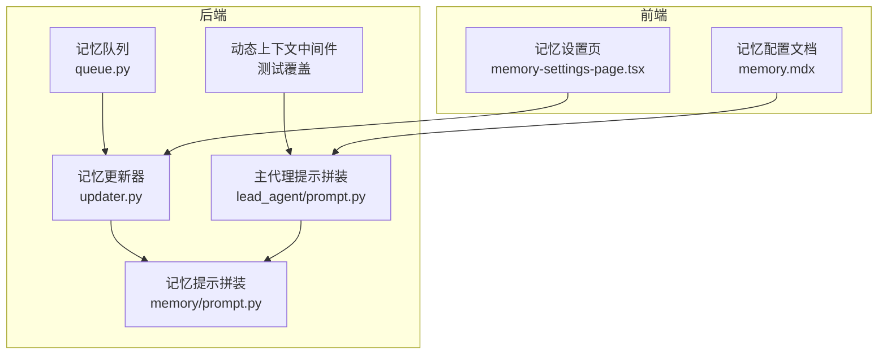
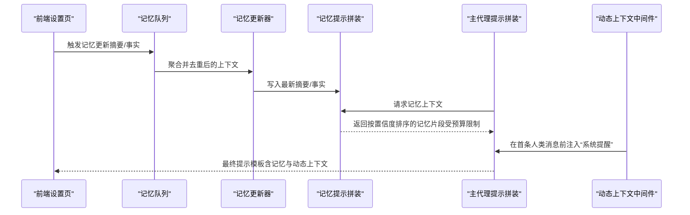
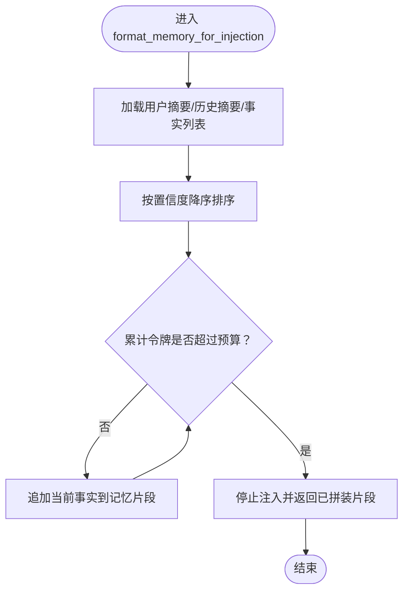
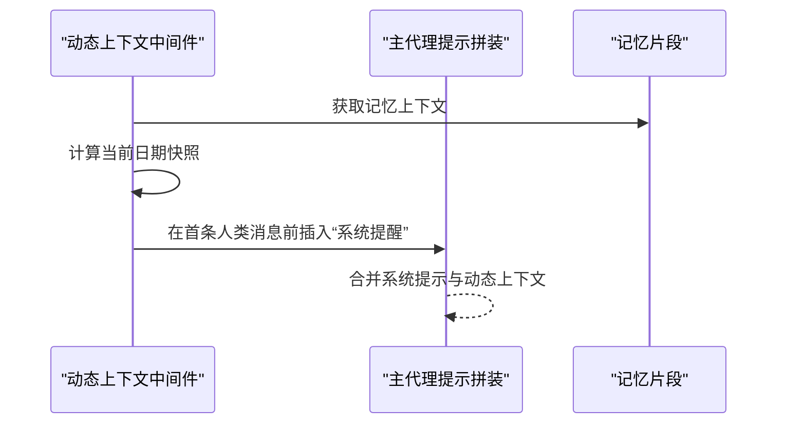
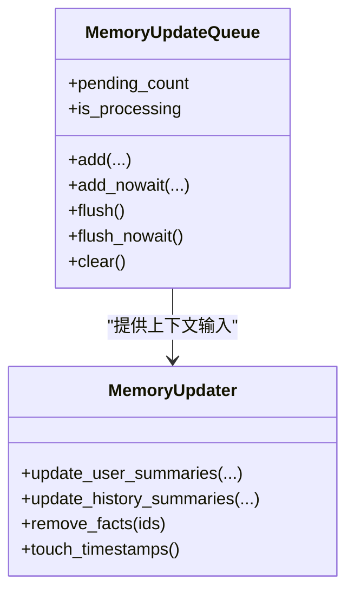
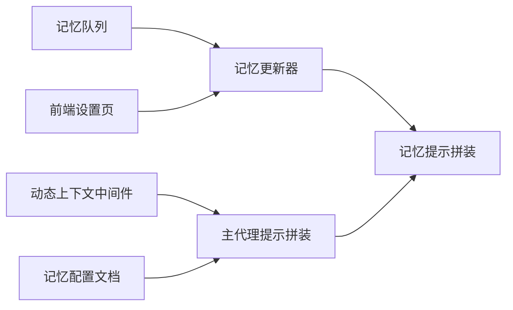

# 记忆提示工程

<cite>
**本文引用的文件**
- [MEMORY_IMPROVEMENTS.md](file://backend/docs/MEMORY_IMPROVEMENTS.md)
- [MEMORY_IMPROVEMENTS_SUMMARY.md](file://backend/docs/MEMORY_IMPROVEMENTS_SUMMARY.md)
- [prompt.py（记忆）](file://backend/packages/harness/deerflow/agents/memory/prompt.py)
- [prompt.py（主代理）](file://backend/packages/harness/deerflow/agents/lead_agent/prompt.py)
- [queue.py](file://backend/packages/harness/deerflow/agents/memory/queue.py)
- [updater.py](file://backend/packages/harness/deerflow/agents/memory/updater.py)
- [dynamic_context_middleware.py](file://backend/tests/test_dynamic_context_middleware.py)
- [test_memory_prompt_injection.py](file://backend/tests/test_memory_prompt_injection.py)
- [memory-settings-page.tsx](file://frontend/src/components/workspace/settings/memory-settings-page.tsx)
- [memory.mdx](file://frontend/src/content/zh/harness/memory.mdx)
</cite>

## 目录
1. [引言](#引言)
2. [项目结构](#项目结构)
3. [核心组件](#核心组件)
4. [架构总览](#架构总览)
5. [详细组件分析](#详细组件分析)
6. [依赖关系分析](#依赖关系分析)
7. [性能考量](#性能考量)
8. [故障排查指南](#故障排查指南)
9. [结论](#结论)
10. [附录](#附录)

## 引言
本文件面向 DeerFlow 的“记忆提示工程”系统，聚焦于如何通过精心设计的提示模板，引导 AI 模型有效利用长期记忆。内容涵盖上下文提取算法、相关性评分机制、信息压缩技术与语义相似度计算；并给出提示工程最佳实践：避免信息过载、保持上下文新鲜度、处理长文本摘要、实现动态上下文调整。同时提供提示模板的配置选项与自定义方法，并说明如何评估与优化记忆提示的效果。

## 项目结构
围绕记忆与提示工程的关键代码分布在后端 Harness 包与前端设置页面中：
- 后端核心位置：packages/harness/deerflow/agents/memory 下包含记忆提示拼装、队列更新、存储与更新器等模块
- 前端设置页：提供记忆配置开关、导出导入、事实管理等界面能力
- 文档与测试：docs 中记录了记忆系统的改进状态与计划；tests 验证动态上下文注入与记忆注入预算控制

图表来源
- [queue.py](file://backend/packages/harness/deerflow/agents/memory/queue.py)
- [updater.py](file://backend/packages/harness/deerflow/agents/memory/updater.py)
- [prompt.py（记忆）](file://backend/packages/harness/deerflow/agents/memory/prompt.py)
- [prompt.py（主代理）](file://backend/packages/harness/deerflow/agents/lead_agent/prompt.py)
- [memory-settings-page.tsx](file://frontend/src/components/workspace/settings/memory-settings-page.tsx)
- [memory.mdx](file://frontend/src/content/zh/harness/memory.mdx)

章节来源
- [MEMORY_IMPROVEMENTS.md](file://backend/docs/MEMORY_IMPROVEMENTS.md)
- [MEMORY_IMPROVEMENTS_SUMMARY.md](file://backend/docs/MEMORY_IMPROVEMENTS_SUMMARY.md)

## 核心组件
- 记忆提示拼装（format_memory_for_injection）
  - 功能：将用户摘要、历史摘要、事实列表按置信度排序并注入到记忆片段中，使用分词器进行准确的令牌计数，受 max_injection_tokens 预算约束
  - 关键点：当前未实现 TF-IDF 语义相似度召回；支持按置信度优先注入；在预算不足时截断
- 动态上下文中间件
  - 功能：在会话首次人类消息处注入“系统提醒”，包含记忆片段与当前日期快照，且仅注入一次（冻结快照模式）
- 记忆队列与更新器
  - 功能：聚合对话上下文变更，去重合并相同线程/用户/代理的更新，异步刷新记忆数据；支持删除事实、更新摘要时间戳
- 主代理提示拼装
  - 功能：从记忆系统抽取上下文并注入到系统提示中，形成最终提示模板

章节来源
- [MEMORY_IMPROVEMENTS.md](file://backend/docs/MEMORY_IMPROVEMENTS.md)
- [MEMORY_IMPROVEMENTS_SUMMARY.md](file://backend/docs/MEMORY_IMPROVEMENTS_SUMMARY.md)
- [prompt.py（记忆）](file://backend/packages/harness/deerflow/agents/memory/prompt.py)
- [prompt.py（主代理）](file://backend/packages/harness/deerflow/agents/lead_agent/prompt.py)
- [queue.py](file://backend/packages/harness/deerflow/agents/memory/queue.py)
- [updater.py](file://backend/packages/harness/deerflow/agents/memory/updater.py)

## 架构总览
记忆提示工程的整体流程如下：前端触发记忆更新 → 后端队列聚合与去重 → 更新器写入最新摘要与事实 → 提示拼装阶段根据预算与置信度生成记忆上下文 → 动态上下文中间件在会话首条消息注入“系统提醒”。

图表来源
- [queue.py](file://backend/packages/harness/deerflow/agents/memory/queue.py)
- [updater.py](file://backend/packages/harness/deerflow/agents/memory/updater.py)
- [prompt.py（记忆）](file://backend/packages/harness/deerflow/agents/memory/prompt.py)
- [prompt.py（主代理）](file://backend/packages/harness/deerflow/agents/lead_agent/prompt.py)
- [dynamic_context_middleware.py](file://backend/tests/test_dynamic_context_middleware.py)

## 详细组件分析

### 组件一：记忆提示拼装（format_memory_for_injection）
- 数据来源
  - 用户摘要（user.*.summary）
  - 历史摘要（history.*.summary）
  - 事实列表（facts[]），包含内容、类别、置信度
- 排序与注入策略
  - 按置信度降序排列
  - 使用分词器进行准确令牌计数，逐步追加直到达到 max_injection_tokens 预算
  - 若预算不足，仅注入高置信度片段
- 当前状态与计划
  - 已实现：准确令牌计数、按置信度注入、预算约束
  - 计划中：基于 TF-IDF 的语义相似度召回、current_context 参数、加权评分（相似度×0.6 + 置信度×0.4）

图表来源
- [MEMORY_IMPROVEMENTS.md](file://backend/docs/MEMORY_IMPROVEMENTS.md)
- [MEMORY_IMPROVEMENTS_SUMMARY.md](file://backend/docs/MEMORY_IMPROVEMENTS_SUMMARY.md)
- [test_memory_prompt_injection.py](file://backend/tests/test_memory_prompt_injection.py)

章节来源
- [MEMORY_IMPROVEMENTS.md](file://backend/docs/MEMORY_IMPROVEMENTS.md)
- [MEMORY_IMPROVEMENTS_SUMMARY.md](file://backend/docs/MEMORY_IMPROVEMENTS_SUMMARY.md)
- [test_memory_prompt_injection.py](file://backend/tests/test_memory_prompt_injection.py)

### 组件二：动态上下文中间件（冻结快照）
- 行为特征
  - 在会话首条人类消息前注入“系统提醒”，包含记忆片段与当前日期快照
  - 保证同一会话内不再重复注入（冻结快照模式）
- 与记忆提示的关系
  - 将记忆片段作为系统提醒的一部分，确保模型在首次交互时即获得上下文快照
  - 与主代理提示拼装配合，形成稳定的上下文基线

图表来源
- [dynamic_context_middleware.py](file://backend/tests/test_dynamic_context_middleware.py)
- [prompt.py（主代理）](file://backend/packages/harness/deerflow/agents/lead_agent/prompt.py)

章节来源
- [dynamic_context_middleware.py](file://backend/tests/test_dynamic_context_middleware.py)

### 组件三：记忆队列与更新器
- 记忆队列
  - 支持同一线程/用户/代理的上下文合并，去重并延迟处理
  - 提供 flush/flush_nowait/clear 等操作，便于测试与优雅关闭
- 记忆更新器
  - 更新用户摘要（工作背景、个人背景、心头事）
  - 更新历史摘要（近期、早期、长期背景）
  - 删除指定事实 ID 列表
  - 统一更新时间戳，确保上下文新鲜度

图表来源
- [queue.py](file://backend/packages/harness/deerflow/agents/memory/queue.py)
- [updater.py](file://backend/packages/harness/deerflow/agents/memory/updater.py)

章节来源
- [queue.py](file://backend/packages/harness/deerflow/agents/memory/queue.py)
- [updater.py](file://backend/packages/harness/deerflow/agents/memory/updater.py)

### 组件四：前端记忆设置与导出导入
- 设置项
  - 启用/禁用记忆、禁止注入到系统提示
  - 自定义记忆存储类（失败回退至默认文件存储）
- 用户体验
  - 提供记忆摘要与事实列表的查看、搜索、编辑、删除
  - 支持导出/导入记忆数据，便于迁移与备份

章节来源
- [memory-settings-page.tsx](file://frontend/src/components/workspace/settings/memory-settings-page.tsx)
- [memory.mdx](file://frontend/src/content/zh/harness/memory.mdx)

## 依赖关系分析
- 组件耦合
  - 主代理提示拼装依赖记忆提示拼装提供的上下文
  - 动态上下文中间件依赖主代理提示拼装的首条消息注入时机
  - 记忆队列与更新器为记忆提示提供数据源与新鲜度保障
- 外部依赖
  - 分词器用于准确令牌计数
  - 前端设置页与后端配置文档共同决定注入行为与存储策略

图表来源
- [queue.py](file://backend/packages/harness/deerflow/agents/memory/queue.py)
- [updater.py](file://backend/packages/harness/deerflow/agents/memory/updater.py)
- [prompt.py（记忆）](file://backend/packages/harness/deerflow/agents/memory/prompt.py)
- [prompt.py（主代理）](file://backend/packages/harness/deerflow/agents/lead_agent/prompt.py)
- [memory-settings-page.tsx](file://frontend/src/components/workspace/settings/memory-settings-page.tsx)
- [memory.mdx](file://frontend/src/content/zh/harness/memory.mdx)

## 性能考量
- 令牌计数准确性
  - 使用分词器进行精确计数，避免因字符误判导致的上下文溢出或截断不一致
- 注入预算控制
  - 通过 max_injection_tokens 限制单次注入总量，优先保留高置信度事实
- 异步与批处理
  - 记忆队列支持延迟与后台处理，减少频繁 I/O 对主线程的影响
- 上下文新鲜度
  - 更新器统一更新时间戳，前端可据此展示“最后更新时间”，辅助用户判断上下文有效性

## 故障排查指南
- 记忆未注入或注入不足
  - 检查记忆配置：是否启用、是否允许注入
  - 检查预算参数：max_injection_tokens 是否过小
  - 检查事实置信度：是否存在全部低置信度导致被截断
- 会话重复注入“系统提醒”
  - 确认动态上下文中间件是否正确识别会话首条人类消息
  - 检查中间件是否在会话内多次调用
- 上下文过旧
  - 确认记忆更新器是否正常写入最新摘要与事实
  - 前端检查“最后更新时间”字段是否更新

章节来源
- [test_memory_prompt_injection.py](file://backend/tests/test_memory_prompt_injection.py)
- [dynamic_context_middleware.py](file://backend/tests/test_dynamic_context_middleware.py)

## 结论
DeerFlow 的记忆提示工程以“准确令牌计数 + 置信度优先注入 + 预算约束”为核心，辅以“冻结快照”的动态上下文注入，形成稳定可控的记忆提示基线。未来将引入 TF-IDF 语义相似度召回与加权评分，进一步提升相关性与上下文适配度。结合前端记忆设置与导出导入能力，可在实际部署中灵活定制与持续优化记忆提示效果。

## 附录

### 提示工程最佳实践
- 避免信息过载
  - 明确 max_injection_tokens 预算，优先保留高置信度事实
  - 控制摘要长度，必要时采用分段摘要
- 保持上下文新鲜度
  - 定期更新用户与历史摘要，统一更新时间戳
  - 在会话开始时注入“系统提醒”，确保模型获得最新上下文快照
- 处理长文本摘要
  - 采用分层摘要策略：先总体再细节，按需展开
  - 对事实进行分类与标签化，便于后续检索与裁剪
- 实现动态上下文调整
  - 基于最近对话上下文提取 current_context，结合 TF-IDF 相似度进行召回
  - 引入加权评分：final_score = (similarity × 0.6) + (confidence × 0.4)，在预算内选择最相关事实

### 提示模板配置选项与自定义方法
- 后端配置
  - 启用/禁用记忆、禁止注入到系统提示
  - 自定义记忆存储类（失败回退至默认文件存储）
- 前端配置
  - 记忆摘要与事实列表的查看、搜索、编辑、删除
  - 导出/导入记忆数据，便于迁移与备份

章节来源
- [memory.mdx](file://frontend/src/content/zh/harness/memory.mdx)
- [memory-settings-page.tsx](file://frontend/src/components/workspace/settings/memory-settings-page.tsx)