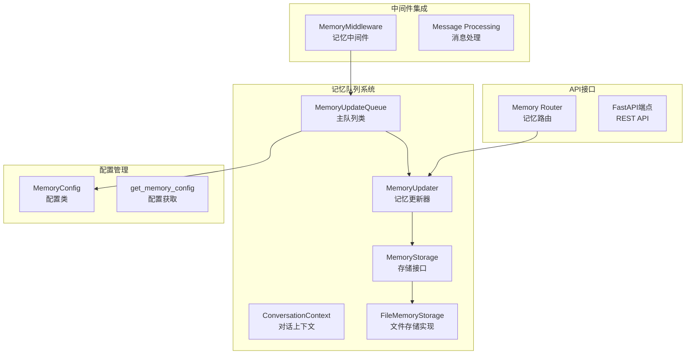
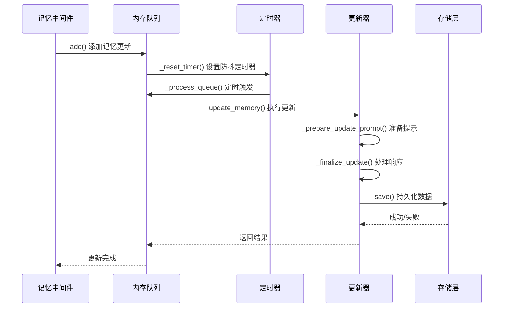
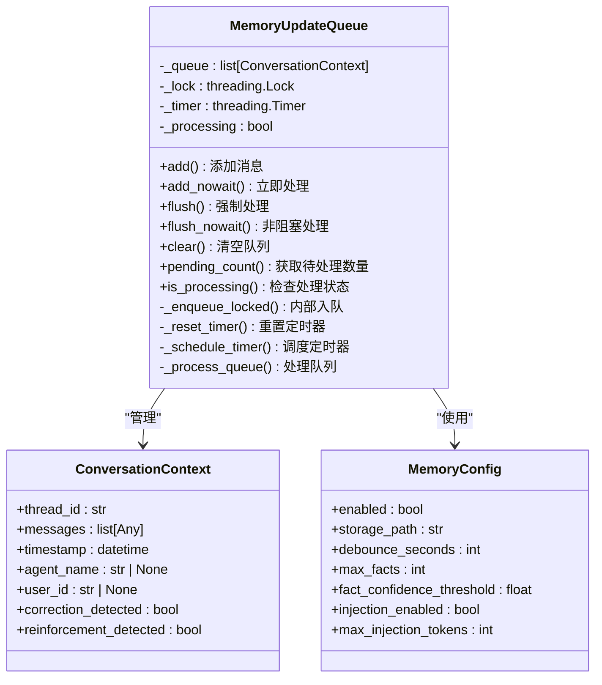
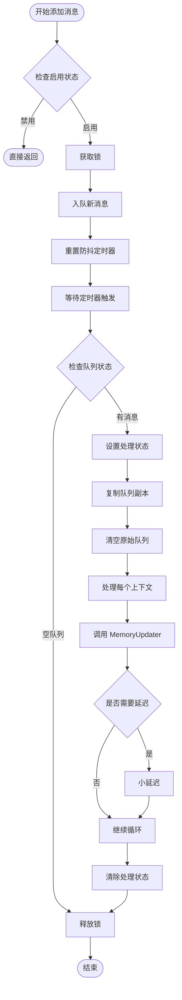
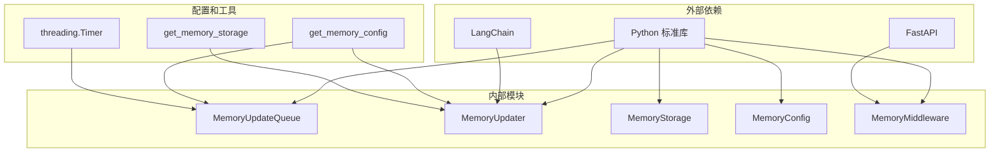

# 记忆队列管理

<cite>
**本文档引用的文件**
- [queue.py](file://backend/packages/harness/deerflow/agents/memory/queue.py)
- [memory_config.py](file://backend/packages/harness/deerflow/config/memory_config.py)
- [updater.py](file://backend/packages/harness/deerflow/agents/memory/updater.py)
- [storage.py](file://backend/packages/harness/deerflow/agents/memory/storage.py)
- [memory_middleware.py](file://backend/packages/harness/deerflow/agents/middlewares/memory_middleware.py)
- [memory.py](file://backend/app/gateway/routers/memory.py)
- [test_memory_queue.py](file://backend/tests/test_memory_queue.py)
- [test_memory_queue_user_isolation.py](file://backend/tests/test_memory_queue_user_isolation.py)
</cite>

## 目录
1. [简介](#简介)
2. [项目结构](#项目结构)
3. [核心组件](#核心组件)
4. [架构概览](#架构概览)
5. [详细组件分析](#详细组件分析)
6. [依赖关系分析](#依赖关系分析)
7. [性能考虑](#性能考虑)
8. [故障排除指南](#故障排除指南)
9. [结论](#结论)

## 简介

DeerFlow 的记忆队列管理系统是一个基于 Python 的异步内存更新机制，专门设计用于长期记忆的高效管理。该系统通过智能的队列管理策略，实现了消息的批量处理、优先级管理和实时同步功能。

该系统的核心目标是：
- 提供高效的长期记忆存储和检索
- 支持多用户、多代理的隔离记忆管理
- 实现智能的去重和顺序保证机制
- 提供灵活的配置选项和扩展能力

## 项目结构

记忆队列管理系统主要分布在以下模块中：



**图表来源**
- [queue.py:28-287](file://backend/packages/harness/deerflow/agents/memory/queue.py#L28-L287)
- [memory_config.py:6-84](file://backend/packages/harness/deerflow/config/memory_config.py#L6-L84)
- [updater.py:380-710](file://backend/packages/harness/deerflow/agents/memory/updater.py#L380-L710)
- [storage.py:43-232](file://backend/packages/harness/deerflow/agents/memory/storage.py#L43-L232)

**章节来源**
- [queue.py:1-288](file://backend/packages/harness/deerflow/agents/memory/queue.py#L1-L288)
- [memory_config.py:1-84](file://backend/packages/harness/deerflow/config/memory_config.py#L1-L84)

## 核心组件

### MemoryUpdateQueue 主队列类

MemoryUpdateQueue 是整个记忆队列系统的核心，采用线程安全的设计模式，提供了完整的队列管理功能。

**关键特性：**
- **智能去重机制**：基于 `(thread_id, user_id, agent_name)` 组合键进行去重
- **批量处理**：支持多个对话同时排队并批量处理
- **延迟处理**：使用 `threading.Timer` 实现智能的防抖机制
- **线程安全**：使用 `threading.Lock` 确保并发安全性

### ConversationContext 对话上下文

ConversationContext 类封装了单个记忆更新所需的所有信息：

**属性说明：**
- `thread_id`: 线程标识符，用于区分不同的对话会话
- `messages`: 对话消息列表，经过过滤后的用户输入和AI响应
- `timestamp`: 创建时间戳，默认使用 UTC 时间
- `agent_name`: 代理名称，支持按代理隔离记忆
- `user_id`: 用户标识符，用于多用户隔离
- `correction_detected`: 是否检测到纠正信号
- `reinforcement_detected`: 是否检测到强化信号

### MemoryUpdater 更新器

MemoryUpdater 负责实际的记忆更新操作，集成了 LLM 模型调用和数据持久化：

**核心功能：**
- **LLM 集成**：使用配置的模型进行记忆更新
- **JSON 解析**：安全地解析 LLM 返回的 JSON 数据
- **数据验证**：确保事实数据的完整性和有效性
- **并发控制**：使用线程池避免事件循环冲突

**章节来源**
- [queue.py:28-287](file://backend/packages/harness/deerflow/agents/memory/queue.py#L28-L287)
- [updater.py:380-710](file://backend/packages/harness/deerflow/agents/memory/updater.py#L380-L710)

## 架构概览

记忆队列系统的整体架构采用了分层设计，确保了良好的可维护性和扩展性：



**图表来源**
- [memory_middleware.py:52-111](file://backend/packages/harness/deerflow/agents/middlewares/memory_middleware.py#L52-L111)
- [queue.py:166-226](file://backend/packages/harness/deerflow/agents/memory/queue.py#L166-L226)
- [updater.py:539-598](file://backend/packages/harness/deerflow/agents/memory/updater.py#L539-L598)

系统采用以下设计原则：

1. **异步处理**：所有记忆更新都是异步执行，不影响主线程性能
2. **批量优化**：通过防抖机制将多个快速连续的更新合并为一次处理
3. **错误隔离**：每个更新都有独立的错误处理，避免影响其他更新
4. **资源管理**：使用线程池和连接池优化资源使用

## 详细组件分析

### 队列数据结构设计

记忆队列系统采用了独特的数据结构设计，结合了多种算法来实现高效的消息管理：



**图表来源**
- [queue.py:28-287](file://backend/packages/harness/deerflow/agents/memory/queue.py#L28-L287)
- [memory_config.py:6-84](file://backend/packages/harness/deerflow/config/memory_config.py#L6-L84)

#### 去重机制分析

系统实现了智能的去重机制，确保相同目标的重复更新不会产生冗余：

**去重键生成：**
```python
def _queue_key(thread_id: str, user_id: str | None, agent_name: str | None) -> tuple:
    return (thread_id, user_id, agent_name)
```

**去重逻辑：**
1. 查找现有上下文，如果存在则合并标志位
2. 移除旧的上下文条目
3. 添加新的上下文条目
4. 合并纠正和强化检测标志

#### 顺序保证机制

为了确保消息处理的正确顺序，系统采用了以下机制：

1. **时间戳排序**：每个上下文都包含创建时间戳
2. **FIFO 处理**：队列按照添加顺序进行处理
3. **锁保护**：使用 `threading.Lock` 确保线程安全
4. **状态跟踪**： `_processing` 标志防止并发处理

### 防抖机制实现

防抖机制是记忆队列系统的核心特性之一，它通过智能的定时器管理实现了高效的批量处理：



**图表来源**
- [queue.py:52-115](file://backend/packages/harness/deerflow/agents/memory/queue.py#L52-L115)
- [queue.py:166-214](file://backend/packages/harness/deerflow/agents/memory/queue.py#L166-L214)

### 批量处理机制

系统支持高效的批量处理，通过以下方式优化性能：

**批量处理策略：**
1. **时间窗口聚合**：在防抖时间内收集所有更新
2. **内存复制**：处理前复制队列副本，避免阻塞新消息
3. **顺序处理**：保持原始添加顺序
4. **错误隔离**：单个失败不影响其他消息

**处理延迟：**
```python
# 在批量处理多个上下文时，添加小延迟避免速率限制
if len(contexts_to_process) > 1:
    time.sleep(0.5)
```

### 实时同步功能

系统提供了多种实时同步机制：

1. **立即处理模式**：`add_nowait()` 方法支持立即处理
2. **非阻塞处理**：`flush_nowait()` 支持后台处理
3. **状态查询**：提供队列状态和处理状态查询
4. **清理功能**：支持队列清理和重置

**章节来源**
- [queue.py:90-115](file://backend/packages/harness/deerflow/agents/memory/queue.py#L90-L115)
- [queue.py:216-246](file://backend/packages/harness/deerflow/agents/memory/queue.py#L216-L246)

## 依赖关系分析

记忆队列系统的依赖关系清晰且层次分明：



**图表来源**
- [queue.py:10](file://backend/packages/harness/deerflow/agents/memory/queue.py#L10)
- [updater.py:23](file://backend/packages/harness/deerflow/agents/memory/updater.py#L23)
- [memory_middleware.py:13](file://backend/packages/harness/deerflow/agents/middlewares/memory_middleware.py#L13)

### 关键依赖关系

1. **配置依赖**：所有组件都依赖于 `get_memory_config()` 获取配置
2. **存储依赖**：更新器依赖存储接口进行数据持久化
3. **中间件集成**：队列被中间件系统集成，自动触发更新
4. **线程依赖**：使用 Python 标准库的线程模块实现并发

### 循环依赖避免

系统通过以下方式避免循环依赖：

1. **延迟导入**：在函数内部导入依赖模块
2. **接口抽象**：使用抽象基类定义接口契约
3. **配置注入**：通过参数传递配置对象
4. **单例模式**：队列和存储使用全局单例实例

**章节来源**
- [queue.py:168-169](file://backend/packages/harness/deerflow/agents/memory/queue.py#L168-L169)
- [updater.py:29-38](file://backend/packages/harness/deerflow/agents/memory/updater.py#L29-L38)

## 性能考虑

### 并发性能优化

记忆队列系统在设计时充分考虑了高并发场景下的性能需求：

**线程池配置：**
- MemoryUpdater 使用固定大小的线程池（默认4个工作者）
- 避免了事件循环冲突问题
- 支持同步和异步调用模式

**内存管理：**
- 使用浅拷贝避免深拷贝开销
- 缓存存储路径和文件修改时间
- 及时清理临时文件

### 配置参数优化

系统提供了丰富的配置参数来优化性能：

**核心配置参数：**
- `debounce_seconds`: 防抖时间（1-300秒），默认30秒
- `max_facts`: 最大事实数量（10-500），默认100
- `fact_confidence_threshold`: 事实置信度阈值（0.0-1.0），默认0.7
- `max_injection_tokens`: 注入令牌最大值（100-8000），默认2000

### 错误处理和恢复

系统实现了完善的错误处理机制：

**错误分类：**
1. **配置错误**：无效的配置参数
2. **存储错误**：文件读写异常
3. **网络错误**：LLM 调用失败
4. **数据错误**：JSON 解析失败

**恢复策略：**
- 自动重试有限次数
- 记录详细的错误日志
- 提供降级处理模式
- 保持系统稳定性

## 故障排除指南

### 常见问题诊断

**问题1：队列不处理消息**
- 检查 `enabled` 配置是否为 `True`
- 确认定时器是否正常启动
- 验证锁状态是否被正确释放

**问题2：内存更新失败**
- 检查 LLM 模型配置
- 验证 JSON 解析逻辑
- 确认存储权限设置

**问题3：性能问题**
- 调整防抖时间参数
- 检查线程池大小
- 监控磁盘 I/O 性能

### 调试工具和方法

**调试配置：**
```python
# 启用详细日志
logging.basicConfig(level=logging.DEBUG)

# 检查队列状态
print(f"Pending count: {queue.pending_count}")
print(f"Is processing: {queue.is_processing}")
```

**监控指标：**
- 队列长度分布
- 处理延迟时间
- 错误率统计
- 存储使用情况

### 测试覆盖范围

系统提供了全面的测试覆盖：

**单元测试重点：**
- 队列去重功能
- 防抖机制行为
- 线程安全保证
- 错误处理逻辑
- 用户隔离功能

**集成测试场景：**
- 多用户并发访问
- 高频更新场景
- 系统重启恢复
- 存储故障模拟

**章节来源**
- [test_memory_queue.py:1-249](file://backend/tests/test_memory_queue.py#L1-L249)
- [test_memory_queue_user_isolation.py:68-79](file://backend/tests/test_memory_queue_user_isolation.py#L68-L79)

## 结论

DeerFlow 的记忆队列管理系统通过精心设计的架构和算法，成功实现了高效、可靠的长期记忆管理。系统的主要优势包括：

**技术优势：**
- 智能的防抖机制确保了高效的批量处理
- 完善的去重和顺序保证机制
- 灵活的配置选项支持不同场景需求
- 强大的错误处理和恢复能力

**性能表现：**
- 支持高并发场景下的稳定运行
- 通过缓存和批处理优化性能
- 提供多种处理模式适应不同需求
- 良好的资源利用率和内存管理

**扩展性特点：**
- 模块化设计便于功能扩展
- 插件化的存储接口支持多种后端
- 灵活的配置系统适应不同部署环境
- 完善的测试覆盖确保代码质量

该系统为 DeerFlow 的长期记忆功能奠定了坚实的基础，能够有效支持复杂的 AI 应用场景，并为未来的功能扩展提供了充足的空间。