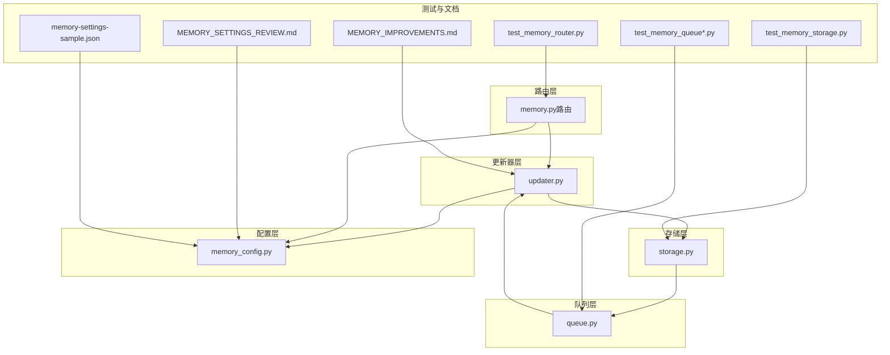
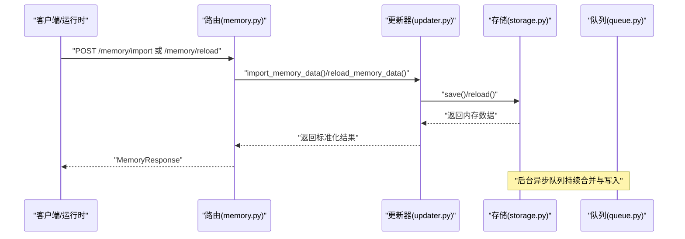
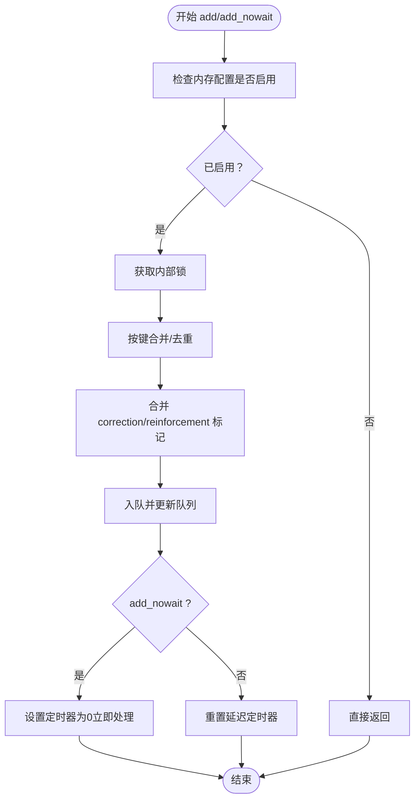
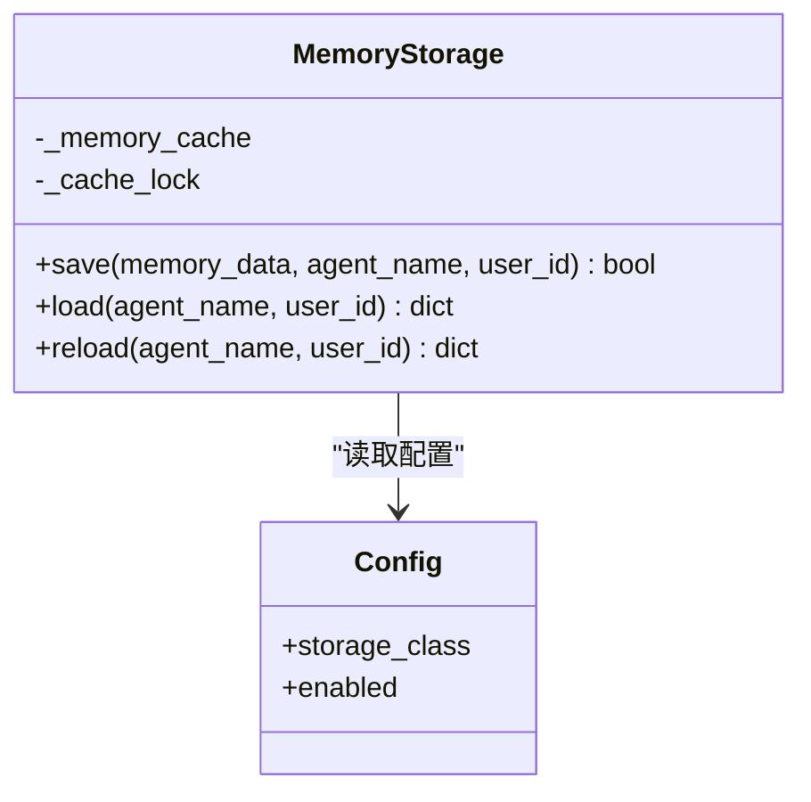
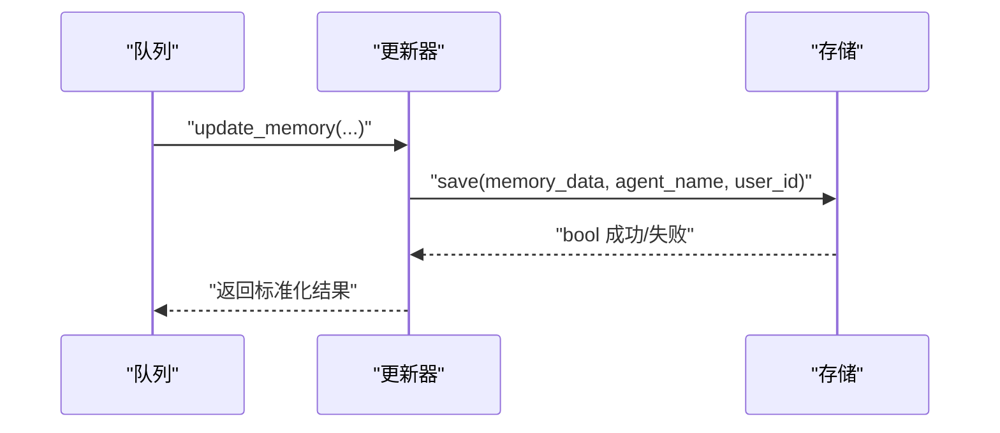
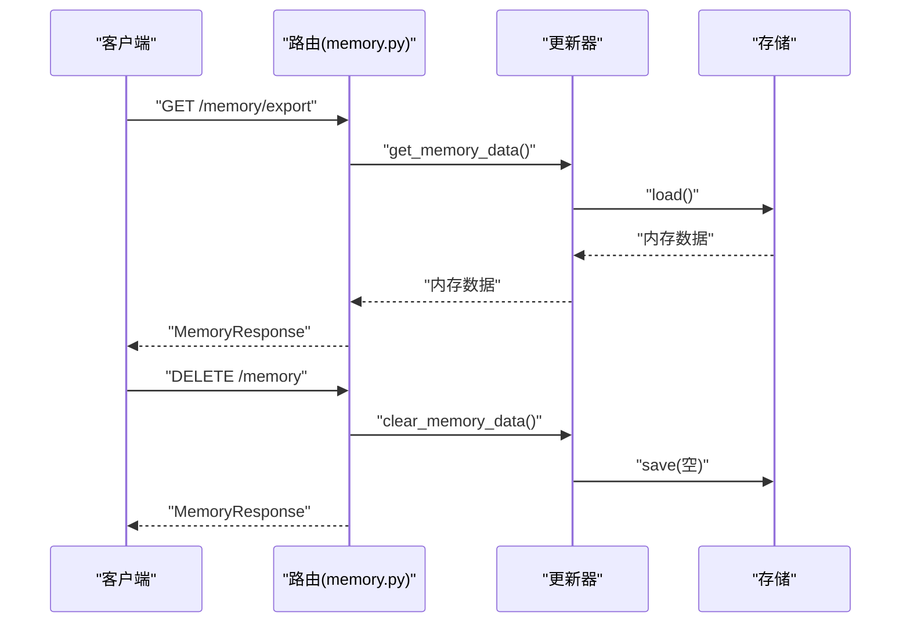
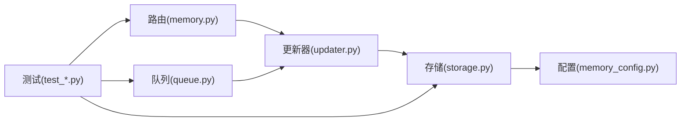

# 长期记忆管理

<cite>
**本文引用的文件**
- [queue.py](file://backend/packages/harness/deerflow/agents/memory/queue.py)
- [storage.py](file://backend/packages/harness/deerflow/agents/memory/storage.py)
- [updater.py](file://backend/packages/harness/deerflow/agents/memory/updater.py)
- [memory.py（路由）](file://backend/app/gateway/routers/memory.py)
- [memory_config.py](file://backend/packages/harness/deerflow/config/memory_config.py)
- [test_memory_queue.py](file://backend/tests/test_memory_queue.py)
- [test_memory_queue_user_isolation.py](file://backend/tests/test_memory_queue_user_isolation.py)
- [test_memory_router.py](file://backend/tests/test_memory_router.py)
- [test_memory_storage.py](file://backend/tests/test_memory_storage.py)
- [MEMORY_IMPROVEMENTS.md](file://backend/docs/MEMORY_IMPROVEMENTS.md)
- [MEMORY_SETTINGS_REVIEW.md](file://backend/docs/MEMORY_SETTINGS_REVIEW.md)
- [memory-settings-sample.json](file://backend/docs/memory-settings-sample.json)
</cite>

## 目录
1. [简介](#简介)
2. [项目结构](#项目结构)
3. [核心组件](#核心组件)
4. [架构总览](#架构总览)
5. [详细组件分析](#详细组件分析)
6. [依赖关系分析](#依赖关系分析)
7. [性能考量](#性能考量)
8. [故障排查指南](#故障排查指南)
9. [结论](#结论)
10. [附录](#附录)

## 简介
本文件系统性阐述 DeerFlow 的长期记忆管理系统，覆盖跨会话持久化机制、个性化学习信号注入、隐私保护策略与数据生命周期管理。重点说明记忆存储的实现原理：消息队列管理、索引与缓存、检索优化，以及如何在存储效率与查询性能之间取得平衡。同时提供可操作的配置项说明（保留策略、清理机制、隐私控制），并给出用户友好体验与数据安全的最佳实践。

## 项目结构
长期记忆子系统主要由以下层次构成：
- 路由层：对外暴露内存导入/导出/清空/重载等接口
- 更新器层：封装加载、保存、重载与导入逻辑
- 存储层：抽象存储后端，支持按用户与代理维度隔离
- 队列层：去抖动、合并与异步处理的更新队列
- 配置层：统一的内存配置与默认参数
- 测试与文档：回归测试、改进记录与示例配置

图表来源
- [memory.py（路由）:155-302](file://backend/app/gateway/routers/memory.py#L155-L302)
- [updater.py:46-70](file://backend/packages/harness/deerflow/agents/memory/updater.py#L46-L70)
- [storage.py:172-214](file://backend/packages/harness/deerflow/agents/memory/storage.py#L172-L214)
- [queue.py:43-287](file://backend/packages/harness/deerflow/agents/memory/queue.py#L43-L287)
- [memory_config.py](file://backend/packages/harness/deerflow/config/memory_config.py)

章节来源
- [memory.py（路由）:155-302](file://backend/app/gateway/routers/memory.py#L155-L302)
- [updater.py:46-70](file://backend/packages/harness/deerflow/agents/memory/updater.py#L46-L70)
- [storage.py:172-214](file://backend/packages/harness/deerflow/agents/memory/storage.py#L172-L214)
- [queue.py:43-287](file://backend/packages/harness/deerflow/agents/memory/queue.py#L43-L287)
- [memory_config.py](file://backend/packages/harness/deerflow/config/memory_config.py)

## 核心组件
- 内存更新队列（MemoryUpdateQueue）
  - 去抖动与合并：基于线程、用户、代理三元组键进行合并，避免重复与冗余写入
  - 异步处理：通过定时器触发批量处理，支持立即执行模式
  - 用户隔离：在同一线程内对不同用户独立排队，确保数据隔离
- 内存存储（MemoryStorage）
  - 抽象存储后端：通过配置动态选择具体实现类
  - 文件级持久化：采用临时文件写入与原子替换，保证一致性
  - 缓存：按缓存键与修改时间缓存内存内容，减少重复读取
- 内存更新器（updater.py）
  - 统一入口：提供加载、保存、重载、导入等能力
  - 向后兼容：封装存储调用，保持接口稳定
- 路由接口（memory.py）
  - 导入/导出/清空/重载：面向用户的内存管理操作
  - 配置查询：返回当前内存系统配置
- 配置（memory_config.py）
  - 开关与类路径：启用/禁用与存储实现类路径
  - 默认值与策略：保留策略、清理机制、隐私控制等参数占位

章节来源
- [queue.py:43-287](file://backend/packages/harness/deerflow/agents/memory/queue.py#L43-L287)
- [storage.py:172-214](file://backend/packages/harness/deerflow/agents/memory/storage.py#L172-L214)
- [updater.py:46-70](file://backend/packages/harness/deerflow/agents/memory/updater.py#L46-L70)
- [memory.py（路由）:155-302](file://backend/app/gateway/routers/memory.py#L155-L302)
- [memory_config.py](file://backend/packages/harness/deerflow/config/memory_config.py)

## 架构总览
长期记忆系统以“路由—更新器—存储—队列—配置”分层组织，形成闭环的数据流：前端或运行时产生记忆更新请求，经路由进入更新器，再由存储层落盘；队列负责削峰填谷与去抖动；配置层决定行为与后端实现。

图表来源
- [memory.py（路由）:155-302](file://backend/app/gateway/routers/memory.py#L155-L302)
- [updater.py:46-70](file://backend/packages/harness/deerflow/agents/memory/updater.py#L46-L70)
- [storage.py:172-214](file://backend/packages/harness/deerflow/agents/memory/storage.py#L172-L214)
- [queue.py:43-287](file://backend/packages/harness/deerflow/agents/memory/queue.py#L43-L287)

## 详细组件分析

### 组件A：内存更新队列（去抖动、合并与异步处理）
- 关键点
  - 去抖动键：(thread_id, user_id, agent_name)，同一目标仅保留最新上下文
  - 合并策略：最近一次 correction/reinforcement 标记会被累积
  - 异步处理：默认延迟触发批量写入；add_nowait 可立即调度
  - 用户隔离：同一线程下不同 user_id 分别排队，互不干扰
- 复杂度与性能
  - 入队/出队为 O(n)（n 为当前队列长度），但通过合并显著降低写入次数
  - 定时器串行化处理，避免并发写冲突
- 错误处理
  - 配置禁用时直接返回
  - 异常捕获于存储层，队列层保持幂等与可恢复

图表来源
- [queue.py:52-116](file://backend/packages/harness/deerflow/agents/memory/queue.py#L52-L116)

章节来源
- [queue.py:43-287](file://backend/packages/harness/deerflow/agents/memory/queue.py#L43-L287)
- [test_memory_queue.py:120-157](file://backend/tests/test_memory_queue.py#L120-L157)
- [test_memory_queue_user_isolation.py:38-79](file://backend/tests/test_memory_queue_user_isolation.py#L38-L79)

### 组件B：内存存储（抽象后端、文件持久化与缓存）
- 关键点
  - 动态实例化：根据配置的 storage_class 动态导入类
  - 原子写入：先写临时文件，成功后再替换，避免部分写入
  - 缓存：以缓存键与 mtime 记录，命中则跳过磁盘 IO
  - 错误处理：OSError 上报并回退
- 数据结构
  - 缓存字典：{cache_key: (data, mtime)}
  - 文件命名：带随机后缀的临时文件，最终原子替换
- 性能权衡
  - 读多写少场景受益于缓存；写入成本由原子替换与序列化承担

图表来源
- [storage.py:172-214](file://backend/packages/harness/deerflow/agents/memory/storage.py#L172-L214)
- [memory_config.py](file://backend/packages/harness/deerflow/config/memory_config.py)

章节来源
- [storage.py:172-214](file://backend/packages/harness/deerflow/agents/memory/storage.py#L172-L214)
- [memory_config.py](file://backend/packages/harness/deerflow/config/memory_config.py)

### 组件C：内存更新器（统一入口与向后兼容）
- 关键点
  - 加载/保存/重载/导入：统一封装存储调用
  - 用户与代理作用域：支持按 user_id 与 agent_name 进行隔离
  - 返回标准化：导入后返回规范化后的内存数据
- 与队列协作
  - 队列处理完成后，调用更新器进行持久化

图表来源
- [updater.py:46-70](file://backend/packages/harness/deerflow/agents/memory/updater.py#L46-L70)
- [storage.py:172-214](file://backend/packages/harness/deerflow/agents/memory/storage.py#L172-L214)

章节来源
- [updater.py:46-70](file://backend/packages/harness/deerflow/agents/memory/updater.py#L46-L70)

### 组件D：路由接口（导入/导出/清空/重载与配置查询）
- 关键点
  - 导入/导出：JSON 载荷与响应体，支持备份与迁移
  - 清空：删除所有持久化数据并重置为空状态
  - 重载：从文件强制刷新内存缓存
  - 配置查询：返回当前内存系统配置
- 权限与错误
  - 失败时返回 500 并携带详细信息

图表来源
- [memory.py（路由）:155-302](file://backend/app/gateway/routers/memory.py#L155-L302)
- [updater.py:46-70](file://backend/packages/harness/deerflow/agents/memory/updater.py#L46-L70)
- [storage.py:172-214](file://backend/packages/harness/deerflow/agents/memory/storage.py#L172-L214)

章节来源
- [memory.py（路由）:155-302](file://backend/app/gateway/routers/memory.py#L155-L302)
- [test_memory_router.py](file://backend/tests/test_memory_router.py)

### 组件E：配置与策略（保留、清理、隐私）
- 配置项概览（来自文档与示例）
  - 启用/禁用：控制是否启用长期记忆
  - 存储实现类：可插拔的存储后端
  - 保留策略：如按时间/大小限制、归档与清理
  - 清理机制：周期性扫描与阈值触发
  - 隐私控制：字段脱敏、最小化收集、用户撤销
- 文档参考
  - MEMORY_SETTINGS_REVIEW.md：策略回顾与建议
  - memory-settings-sample.json：示例配置模板
  - MEMORY_IMPROVEMENTS.md：验证范围（事实包含、置信排序、预算限制）

章节来源
- [MEMORY_SETTINGS_REVIEW.md](file://backend/docs/MEMORY_SETTINGS_REVIEW.md)
- [memory-settings-sample.json](file://backend/docs/memory-settings-sample.json)
- [MEMORY_IMPROVEMENTS.md:57-66](file://backend/docs/MEMORY_IMPROVEMENTS.md#L57-L66)

## 依赖关系分析
- 组件耦合
  - 路由依赖更新器；更新器依赖存储；存储依赖配置；队列贯穿更新链路
- 外部依赖
  - 配置模块提供存储类路径与开关
  - 测试模块覆盖队列、路由与存储的关键行为
- 潜在循环
  - 当前为单向依赖，无循环导入迹象

图表来源
- [memory.py（路由）:155-302](file://backend/app/gateway/routers/memory.py#L155-L302)
- [updater.py:46-70](file://backend/packages/harness/deerflow/agents/memory/updater.py#L46-L70)
- [storage.py:172-214](file://backend/packages/harness/deerflow/agents/memory/storage.py#L172-L214)
- [queue.py:43-287](file://backend/packages/harness/deerflow/agents/memory/queue.py#L43-L287)
- [memory_config.py](file://backend/packages/harness/deerflow/config/memory_config.py)

章节来源
- [test_memory_queue.py:120-157](file://backend/tests/test_memory_queue.py#L120-L157)
- [test_memory_router.py](file://backend/tests/test_memory_router.py)
- [test_memory_storage.py](file://backend/tests/test_memory_storage.py)

## 性能考量
- 写入放大与去抖动
  - 通过队列合并减少磁盘写入次数，适合高并发对话场景
- 缓存命中率
  - 读多写少场景下，缓存可显著降低 IO；注意 mtime 刷新导致的失效
- 原子写入成本
  - 临时文件与替换带来额外开销，建议批量写入与合理延迟
- 查询性能
  - 当前未见专用检索索引；建议后续引入倒排/向量索引以支持语义检索
- 资源占用
  - 队列长度与缓存大小需结合内存上限与吞吐需求调优

## 故障排查指南
- 常见问题
  - 写入失败：检查存储权限与磁盘空间；查看存储层日志
  - 配置未生效：确认 memory_config 中 storage_class 与 enabled
  - 用户隔离异常：核对队列键（thread_id/user_id/agent_name）是否正确
  - 导入/导出失败：确认 JSON 结构与路由返回码
- 排查步骤
  - 启用调试日志，观察队列 pending_count 与处理耗时
  - 使用 /memory/reload 强制刷新缓存
  - 使用 /memory/export 导出核验数据完整性
  - 使用 /memory 清空后重试，排除脏数据影响
- 相关测试
  - 队列行为与隔离：test_memory_queue.py、test_memory_queue_user_isolation.py
  - 路由功能：test_memory_router.py
  - 存储一致性：test_memory_storage.py

章节来源
- [test_memory_queue.py:120-157](file://backend/tests/test_memory_queue.py#L120-L157)
- [test_memory_queue_user_isolation.py:38-79](file://backend/tests/test_memory_queue_user_isolation.py#L38-L79)
- [test_memory_router.py](file://backend/tests/test_memory_router.py)
- [test_memory_storage.py](file://backend/tests/test_memory_storage.py)

## 结论
DeerFlow 的长期记忆系统通过“队列—更新器—存储—路由—配置”的清晰分层，实现了跨会话持久化、用户与代理维度隔离、以及可插拔的存储后端。当前重点在于写入去抖动与缓存优化；未来可在检索层面引入索引与向量化，进一步提升查询性能与个性化体验。配合完善的配置与隐私策略，系统可在保障数据安全的前提下，提供稳定可靠的长期记忆能力。

## 附录
- 配置建议
  - 保留策略：按月/季度归档，设定最大条目数与总大小上限
  - 清理机制：定期扫描与阈值触发，支持用户主动清理
  - 隐私控制：默认最小化收集，支持一键删除与匿名化
- 最佳实践
  - 将高频更新合并到合适的时间窗口
  - 对敏感字段进行脱敏或加密存储
  - 提供导入/导出接口，便于用户自服务与合规审计