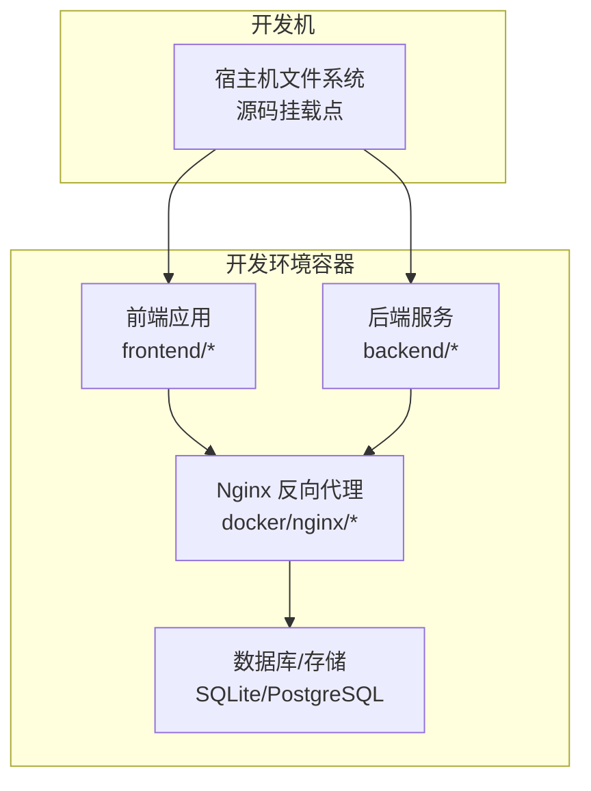
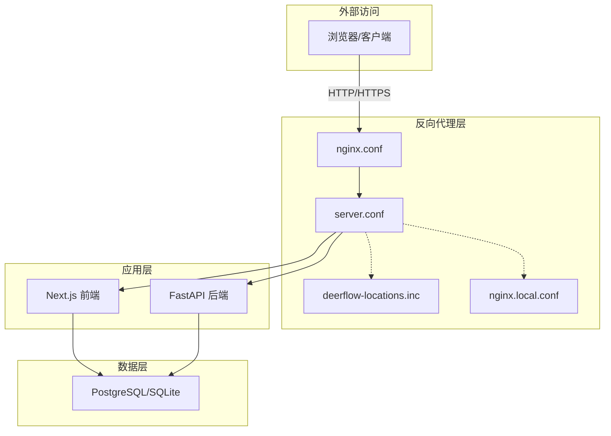
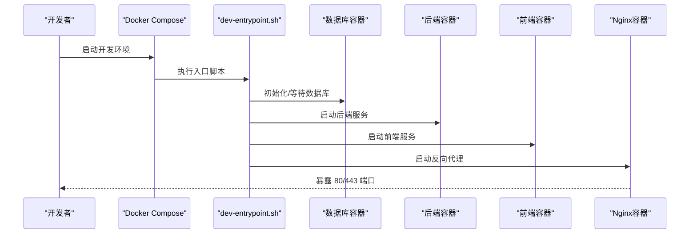

# Docker 开发部署

<cite>
**本文引用的文件**
- [docker-compose-dev.yaml](file://docker/docker-compose-dev.yaml)
- [dev-entrypoint.sh](file://docker/dev-entrypoint.sh)
- [nginx.conf](file://docker/nginx/nginx.conf)
- [nginx.local.conf](file://docker/nginx/nginx.local.conf)
- [server.conf](file://docker/nginx/server.conf)
- [deerflow-locations.inc](file://docker/nginx/deerflow-locations.inc)
- [Dockerfile](file://frontend/Dockerfile)
- [Makefile](file://frontend/Makefile)
- [package.json](file://frontend/package.json)
- [next.config.js](file://frontend/next.config.js)
- [tsconfig.json](file://frontend/tsconfig.json)
- [vitest.config.ts](file://frontend/vitest.config.ts)
- [Dockerfile](file://backend/Dockerfile)
- [pyproject.toml](file://backend/pyproject.toml)
- [uv.lock](file://backend/uv.lock)
- [Makefile](file://backend/Makefile)
- [README.md](file://backend/README.md)
- [scripts/start-deerflow.sh](file://scripts/start-deerflow.sh)
- [scripts/wait-for-port.sh](file://scripts/wait-for-port.sh)
- [scripts/cleanup-containers.sh](file://scripts/cleanup-containers.sh)
- [scripts/docker.sh](file://scripts/docker.sh)
- [docs/operations/BUILD_AND_DEPLOY.md](file://docs/operations/BUILD_AND_DEPLOY.md)
- [docs/operations/DEPLOYMENT_KNOWN_ISSUES.md](file://docs/operations/DEPLOYMENT_KNOWN_ISSUES.md)
</cite>

## 目录
1. [简介](#简介)
2. [项目结构](#项目结构)
3. [核心组件](#核心组件)
4. [架构总览](#架构总览)
5. [详细组件分析](#详细组件分析)
6. [依赖关系分析](#依赖关系分析)
7. [性能考虑](#性能考虑)
8. [故障排除指南](#故障排除指南)
9. [结论](#结论)
10. [附录](#附录)

## 简介
本指南面向 DeerFlow 的 Docker 开发环境部署，重点覆盖开发模式下的 Docker Compose 配置、热重载机制、源码挂载、开发工具集成与调试支持。文档将解释开发环境的特殊配置、端口映射、文件监听与自动重启功能，并提供完整的启动流程、常用命令与开发工作流。同时给出性能优化建议、常见问题解决方案以及开发工具配置要点。

## 项目结构
DeerFlow 的开发环境由多层容器组成：前端 Next.js 应用、后端 Python/FastAPI 服务、Nginx 反向代理、数据库（SQLite/PostgreSQL）等。开发模式通过 docker-compose-dev.yaml 启动，结合源码挂载与热重载，实现快速迭代与调试。

**图表来源**
- [docker-compose-dev.yaml](file://docker/docker-compose-dev.yaml)
- [nginx.conf](file://docker/nginx/nginx.conf)

**章节来源**
- [docker-compose-dev.yaml](file://docker/docker-compose-dev.yaml)
- [nginx.conf](file://docker/nginx/nginx.conf)

## 核心组件
- 开发编排：docker-compose-dev.yaml 定义了前端、后端、Nginx、数据库等服务及其网络与卷挂载策略。
- 入口脚本：dev-entrypoint.sh 提供开发环境初始化、依赖安装与启动命令拼装。
- 反向代理：Nginx 配置集中于 docker/nginx/ 目录，包含通用配置与本地覆盖配置。
- 前端构建：frontend/Dockerfile、Makefile、package.json、next.config.js 等共同支撑开发与构建。
- 后端运行：backend/Dockerfile、pyproject.toml、uv.lock、Makefile 等支撑后端开发与测试。
- 辅助脚本：scripts/ 下的启动、等待端口、清理容器等脚本提升开发效率。

**章节来源**
- [docker-compose-dev.yaml](file://docker/docker-compose-dev.yaml)
- [dev-entrypoint.sh](file://docker/dev-entrypoint.sh)
- [nginx.conf](file://docker/nginx/nginx.conf)
- [nginx.local.conf](file://docker/nginx/nginx.local.conf)
- [server.conf](file://docker/nginx/server.conf)
- [deerflow-locations.inc](file://docker/nginx/deerflow-locations.inc)
- [Dockerfile](file://frontend/Dockerfile)
- [Makefile](file://frontend/Makefile)
- [package.json](file://frontend/package.json)
- [next.config.js](file://frontend/next.config.js)
- [Dockerfile](file://backend/Dockerfile)
- [pyproject.toml](file://backend/pyproject.toml)
- [uv.lock](file://backend/uv.lock)
- [Makefile](file://backend/Makefile)
- [scripts/start-deerflow.sh](file://scripts/start-deerflow.sh)
- [scripts/wait-for-port.sh](file://scripts/wait-for-port.sh)
- [scripts/cleanup-containers.sh](file://scripts/cleanup-containers.sh)
- [scripts/docker.sh](file://scripts/docker.sh)

## 架构总览
开发模式下，Nginx 作为统一入口，将前端静态资源与后端 API 请求分发到对应容器；前端与后端均以源码挂载方式运行，实现热重载与实时调试；数据库采用持久化卷或内存数据库以满足开发需求。

**图表来源**
- [nginx.conf](file://docker/nginx/nginx.conf)
- [server.conf](file://docker/nginx/server.conf)
- [deerflow-locations.inc](file://docker/nginx/deerflow-locations.inc)
- [nginx.local.conf](file://docker/nginx/nginx.local.conf)

## 详细组件分析

### 开发编排与服务定义
- 服务拆分：前端、后端、Nginx、数据库（可选）分别独立成服务，便于并行开发与调试。
- 源码挂载：前端与后端均使用卷挂载将宿主机源码目录映射到容器内，实现代码修改即时生效。
- 端口映射：Nginx 暴露 80/443，前端与后端在开发时可通过内部网络互通，避免冲突。
- 环境变量：通过 docker-compose-dev.yaml 注入开发所需的配置项（如数据库连接、日志级别、调试开关等）。
- 健康检查：为关键服务配置健康检查，确保容器启动后能及时发现异常。
- 自动重启：设置 restart: unless-stopped 或适当的重启策略，保证开发过程中服务稳定性。

**章节来源**
- [docker-compose-dev.yaml](file://docker/docker-compose-dev.yaml)

### 热重载与文件监听
- 前端热重载：Next.js 在开发模式下具备 HMR 能力，配合源码挂载与端口转发，实现页面与组件的即时更新。
- 后端热重载：后端服务通过源码挂载与进程管理器（如 uvicorn/gunicorn）的 reload 模式，监听 Python 文件变更并自动重启。
- Nginx 配置：deerflow-locations.inc 与 server.conf 中的 location 规则确保静态资源与 API 请求正确路由，避免缓存干扰开发体验。
- 文件监听范围：明确监听前端源码目录与后端业务代码目录，忽略 node_modules/.next/.venv 等临时目录，减少无效重启。

**章节来源**
- [nginx.conf](file://docker/nginx/nginx.conf)
- [server.conf](file://docker/nginx/server.conf)
- [deerflow-locations.inc](file://docker/nginx/deerflow-locations.inc)

### 源码挂载与开发工具集成
- 卷挂载策略：使用 bind mount 将宿主机的 src 目录映射到容器内的对应位置，保持路径一致。
- IDE/编辑器：VS Code Dev Containers、WebStorm 等可直接连接容器内终端与调试器，实现一体化开发体验。
- 包管理：前端使用 pnpm，后端使用 uv/pip-tools，确保依赖锁定与一致性。
- 测试工具：前端 Vitest、后端 pytest，均可在容器内直接运行，配合源码挂载执行单测与集成测试。

**章节来源**
- [Dockerfile](file://frontend/Dockerfile)
- [package.json](file://frontend/package.json)
- [tsconfig.json](file://frontend/tsconfig.json)
- [vitest.config.ts](file://frontend/vitest.config.ts)
- [Dockerfile](file://backend/Dockerfile)
- [pyproject.toml](file://backend/pyproject.toml)
- [uv.lock](file://backend/uv.lock)

### 调试支持与启动流程
- 入口脚本：dev-entrypoint.sh 负责初始化环境、安装依赖、生成配置并启动各服务。
- 启动顺序：先启动数据库（如需），再启动后端，最后启动前端与 Nginx。
- 端口等待：使用 wait-for-port.sh 确保上游服务就绪后再继续启动下游服务。
- 调试断点：IDE 可附加到容器内进程，设置断点进行交互式调试。
- 日志聚合：容器日志统一输出至 docker logs，便于排查问题。

**图表来源**
- [dev-entrypoint.sh](file://docker/dev-entrypoint.sh)
- [scripts/wait-for-port.sh](file://scripts/wait-for-port.sh)
- [docker-compose-dev.yaml](file://docker/docker-compose-dev.yaml)

**章节来源**
- [dev-entrypoint.sh](file://docker/dev-entrypoint.sh)
- [scripts/start-deerflow.sh](file://scripts/start-deerflow.sh)
- [scripts/wait-for-port.sh](file://scripts/wait-for-port.sh)
- [docker-compose-dev.yaml](file://docker/docker-compose-dev.yaml)

### Nginx 配置详解
- 通用配置：nginx.conf 定义全局参数与模块加载，确保开发环境的稳定与安全。
- 主站点配置：server.conf 定义站点监听、证书、静态资源与反向代理规则。
- 本地覆盖：nginx.local.conf 支持本地开发的额外规则（如 CORS、调试头、自签证书等）。
- 位置块：deerflow-locations.inc 将 API 与静态资源路由分离，便于维护与扩展。

**章节来源**
- [nginx.conf](file://docker/nginx/nginx.conf)
- [server.conf](file://docker/nginx/server.conf)
- [nginx.local.conf](file://docker/nginx/nginx.local.conf)
- [deerflow-locations.inc](file://docker/nginx/deerflow-locations.inc)

### 前端开发环境
- 构建与运行：frontend/Dockerfile 定义前端镜像基础与安装步骤；Makefile 提供一键构建与启动命令；next.config.js 配置开发服务器与构建选项；tsconfig.json 与 vitest.config.ts 确保类型检查与测试环境一致。
- 端口与代理：开发服务器默认端口可在 compose 中映射，配合 Nginx 实现 HTTPS/反向代理。
- 测试与质量：pnpm 脚本与 Vitest 配置支持单元测试与端到端测试。

**章节来源**
- [Dockerfile](file://frontend/Dockerfile)
- [Makefile](file://frontend/Makefile)
- [package.json](file://frontend/package.json)
- [next.config.js](file://frontend/next.config.js)
- [tsconfig.json](file://frontend/tsconfig.json)
- [vitest.config.ts](file://frontend/vitest.config.ts)

### 后端开发环境
- 运行与构建：backend/Dockerfile 定义后端镜像；pyproject.toml 与 uv.lock 管理依赖；Makefile 提供开发命令；README.md 提供运行说明。
- 热重载：通过源码挂载与进程管理器的 reload 功能，监听 Python 文件变更并自动重启。
- 测试：pytest 与测试目录结构支持单元测试与集成测试。

**章节来源**
- [Dockerfile](file://backend/Dockerfile)
- [pyproject.toml](file://backend/pyproject.toml)
- [uv.lock](file://backend/uv.lock)
- [Makefile](file://backend/Makefile)
- [README.md](file://backend/README.md)

## 依赖关系分析
- 组件耦合：前端与后端通过 Nginx 解耦，便于独立开发与测试；数据库作为共享依赖，通过卷或网络连接提供。
- 外部依赖：Nginx 依赖 SSL 证书与静态资源；前端依赖 Node 生态；后端依赖 Python 生态与数据库驱动。
- 循环依赖：开发编排中未见循环依赖，服务启动顺序通过 depends_on 与健康检查保障。

**图表来源**
- [docker-compose-dev.yaml](file://docker/docker-compose-dev.yaml)
- [nginx.conf](file://docker/nginx/nginx.conf)

**章节来源**
- [docker-compose-dev.yaml](file://docker/docker-compose-dev.yaml)

## 性能考虑
- 源码挂载性能：使用 bind mount 优于 docker cp，但注意 macOS/Windows 的文件同步开销；建议在 IDE 中启用增量编译与按需刷新。
- 缓存与构建：前端使用 pnpm 与 Next.js 构建缓存；后端使用 uv/依赖锁定，减少重复安装时间。
- 并发与资源：限制容器 CPU/内存配额，避免开发机资源争用；合理划分服务数量，避免过度并发。
- 网络与 I/O：将数据库置于 SSD 或使用内存数据库（开发专用）以降低 I/O 延迟。
- 日志与监控：生产级日志会带来额外开销，开发阶段可适度降低日志级别。

## 故障排除指南
- 容器无法启动
  - 检查 docker-compose-dev.yaml 的服务定义与卷挂载路径是否正确。
  - 查看容器日志：docker compose logs 服务名。
- 端口占用
  - 修改 docker-compose-dev.yaml 中的 hostPort 映射，或释放宿主机端口。
- 健康检查失败
  - 使用 scripts/wait-for-port.sh 确认上游服务可用；检查服务内部端口与协议。
- 热重载不生效
  - 确认源码挂载路径正确且未被忽略；检查文件监听范围与 IDE 的保存行为。
- Nginx 配置错误
  - 检查 server.conf 与 deerflow-locations.inc 的语法；必要时使用 nginx -t 测试配置。
- 数据库连接问题
  - 核对数据库地址、端口、凭据与网络连通性；确认卷挂载与权限。

**章节来源**
- [scripts/cleanup-containers.sh](file://scripts/cleanup-containers.sh)
- [scripts/wait-for-port.sh](file://scripts/wait-for-port.sh)
- [docs/operations/DEPLOYMENT_KNOWN_ISSUES.md](file://docs/operations/DEPLOYMENT_KNOWN_ISSUES.md)

## 结论
通过 docker-compose-dev.yaml 与 dev-entrypoint.sh 的协同，DeerFlow 的开发环境实现了高效的源码挂载、热重载与调试支持。配合 Nginx 的灵活路由与前后端容器化的开发模式，开发者可以快速迭代并定位问题。建议在团队内统一开发脚本与配置，持续优化构建与运行性能，并建立完善的故障排除流程。

## 附录

### 常用命令
- 启动开发环境：docker compose -f docker/docker-compose-dev.yaml up -d
- 停止与清理：docker compose -f docker/docker-compose-dev.yaml down -v
- 查看日志：docker compose -f docker/docker-compose-dev.yaml logs -f 服务名
- 进入容器：docker compose -f docker/docker-compose-dev.yaml exec 服务名 bash
- 清理容器与卷：scripts/cleanup-containers.sh

**章节来源**
- [docker/docker-compose-dev.yaml](file://docker/docker-compose-dev.yaml)
- [scripts/cleanup-containers.sh](file://scripts/cleanup-containers.sh)

### 开发工作流
- 修改前端代码 → 观察 HMR 热更新 → 联调后端接口
- 修改后端代码 → 观察进程自动重启 → 运行单元测试
- 修改 Nginx 配置 → 重新加载或重启 Nginx → 验证路由与静态资源
- 使用 wait-for-port.sh 确保服务就绪后再进行联调

**章节来源**
- [scripts/wait-for-port.sh](file://scripts/wait-for-port.sh)
- [nginx.conf](file://docker/nginx/nginx.conf)