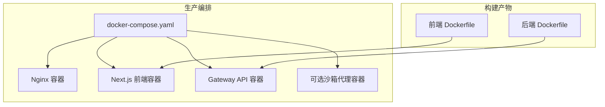
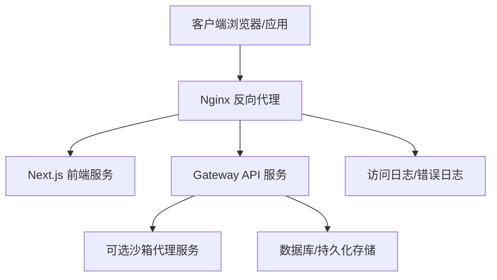
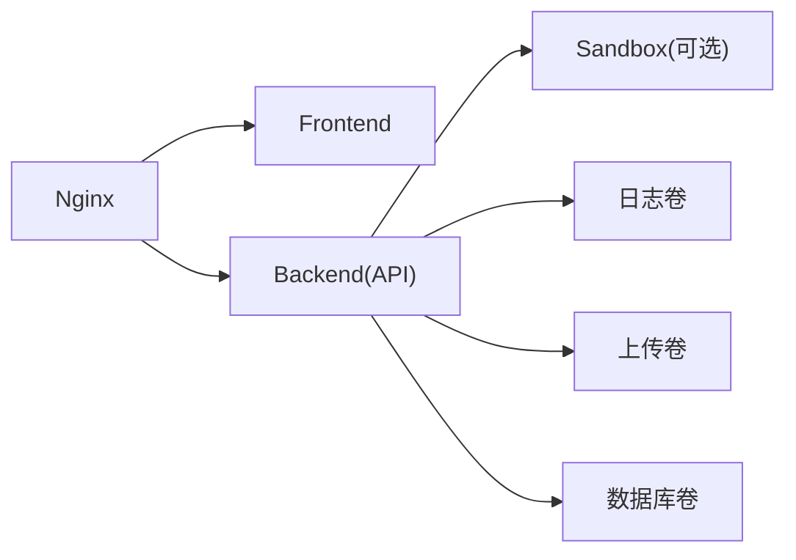

# Docker 生产部署

<cite>
**本文引用的文件**
- [docker-compose.yaml](file://docker/docker-compose.yaml)
- [docker-compose-dev.yaml](file://docker/docker-compose-dev.yaml)
- [nginx.conf](file://docker/nginx/nginx.conf)
- [server.conf](file://docker/nginx/server.conf)
- [deerflow-locations.inc](file://docker/nginx/deerflow-locations.inc)
- [nginx.local.conf](file://docker/nginx/nginx.local.conf)
- [Dockerfile（后端）](file://backend/Dockerfile)
- [Dockerfile（前端）](file://frontend/Dockerfile)
- [dev-entrypoint.sh](file://docker/dev-entrypoint.sh)
- [scripts/deploy.sh](file://scripts/deploy.sh)
- [scripts/start-deerflow.sh](file://scripts/start-deerflow.sh)
- [.agent/skills/smoke-test/scripts/deploy_docker.sh](file://.agent/skills/smoke-test/scripts/deploy_docker.sh)
- [.agent/skills/smoke-test/scripts/health_check.sh](file://.agent/skills/smoke-test/scripts/health_check.sh)
- [docs/operations/BUILD_AND_DEPLOY.md](file://docs/operations/BUILD_AND_DEPLOY.md)
- [docs/operations/DEPLOYMENT_KNOWN_ISSUES.md](file://docs/operations/DEPLOYMENT_KNOWN_ISSUES.md)
</cite>

## 目录
1. [简介](#简介)
2. [项目结构](#项目结构)
3. [核心组件](#核心组件)
4. [架构总览](#架构总览)
5. [详细组件分析](#详细组件分析)
6. [依赖关系分析](#依赖关系分析)
7. [性能考虑](#性能考虑)
8. [故障排除指南](#故障排除指南)
9. [结论](#结论)
10. [附录](#附录)

## 简介
本指南面向生产环境，基于仓库中的 Docker 与 Nginx 配置，提供一套稳定、可扩展且安全的部署方案。目标包括：
- 使用 Docker Compose 编排 Nginx 反向代理、Next.js 前端、Gateway API 后端服务，并可选启用沙箱代理服务。
- 明确各服务的配置参数、环境变量、卷挂载策略与网络隔离。
- 提供生产级安全加固、性能优化、健康检查与重启策略。
- 给出完整部署命令、配置示例与故障排除清单。

## 项目结构
与生产部署直接相关的目录与文件如下：
- docker/docker-compose.yaml：生产环境编排入口
- docker/docker-compose-dev.yaml：开发环境编排入口（对比参考）
- docker/nginx/*：Nginx 配置（含主配置、站点配置、位置块与本地调试配置）
- backend/Dockerfile：后端 Gateway API 服务镜像构建
- frontend/Dockerfile：前端 Next.js 应用镜像构建
- docker/dev-entrypoint.sh：开发容器入口脚本（便于理解运行时行为）
- scripts/deploy.sh 与 scripts/start-deerflow.sh：部署与启动脚本
- .agent/skills/smoke-test/scripts/*：冒烟测试与健康检查脚本（用于验证部署）

图表来源
- [docker-compose.yaml](file://docker/docker-compose.yaml)
- [Dockerfile（后端）](file://backend/Dockerfile)
- [Dockerfile（前端）](file://frontend/Dockerfile)

章节来源
- [docker/docker-compose.yaml](file://docker/docker-compose.yaml)
- [docker/docker-compose-dev.yaml](file://docker/docker-compose-dev.yaml)

## 核心组件
- Nginx 反向代理：统一入口、静态资源分发、TLS 终止、请求转发至前端与后端。
- 前端 Next.js 服务：静态构建产物与运行时服务，通过 Nginx 暴露。
- Gateway API 服务：后端核心 API 服务，处理认证、路由与业务逻辑。
- 可选沙箱代理服务：隔离执行工具调用等高风险操作（按需启用）。
- 卷与网络：持久化数据卷、日志卷、内部网络隔离与端口映射。

章节来源
- [docker/docker-compose.yaml](file://docker/docker-compose.yaml)
- [docker/nginx/nginx.conf](file://docker/nginx/nginx.conf)
- [docker/nginx/server.conf](file://docker/nginx/server.conf)
- [docker/nginx/deerflow-locations.inc](file://docker/nginx/deerflow-locations.inc)
- [docker/nginx/nginx.local.conf](file://docker/nginx/nginx.local.conf)

## 架构总览
下图展示生产环境典型拓扑：Nginx 作为反向代理与 TLS 终止点，将流量分发到前端 Next.js 与后端 Gateway API；可选沙箱代理负责隔离执行。

图表来源
- [docker/docker-compose.yaml](file://docker/docker-compose.yaml)
- [docker/nginx/nginx.conf](file://docker/nginx/nginx.conf)
- [docker/nginx/server.conf](file://docker/nginx/server.conf)

## 详细组件分析

### Nginx 反向代理
- 主配置与站点配置
  - 主配置文件定义全局参数、监听端口、日志格式与上游池。
  - 站点配置文件定义域名、证书路径、静态资源与 location 规则。
  - 位置块包含前端与后端的转发规则，支持 API 路径前缀与 SSE 流式传输。
- 本地调试配置
  - 本地配置允许在开发或测试环境下绕过某些生产限制，便于快速验证。
- 关键要点
  - TLS 终止建议在生产中由 Nginx 承担，证书与密钥应放置于受保护的卷。
  - 将静态资源与动态接口分离，减少后端压力。
  - 对后端 API 设置超时、缓冲与重试策略，避免级联故障。

章节来源
- [docker/nginx/nginx.conf](file://docker/nginx/nginx.conf)
- [docker/nginx/server.conf](file://docker/nginx/server.conf)
- [docker/nginx/deerflow-locations.inc](file://docker/nginx/deerflow-locations.inc)
- [docker/nginx/nginx.local.conf](file://docker/nginx/nginx.local.conf)

### 前端 Next.js 服务
- 镜像构建
  - 使用仓库提供的前端 Dockerfile 进行多阶段构建，输出轻量运行时镜像。
- 运行模式
  - 在生产中通常以静态构建产物配合运行时服务的方式提供。
- 卷与端口
  - 建议将构建产物置于只读卷，避免容器内写盘；Nginx 直接提供静态资源。
- 环境变量
  - 通过环境变量注入运行时配置（如 API 域名、功能开关），避免硬编码。

章节来源
- [frontend/Dockerfile](file://frontend/Dockerfile)
- [docker/docker-compose.yaml](file://docker/docker-compose.yaml)

### Gateway API 服务（后端）
- 镜像构建
  - 使用仓库提供的后端 Dockerfile 构建 API 服务镜像。
- 运行与暴露
  - 通过 Nginx 暴露对外端口，内部仅对网关与沙箱代理可见。
- 数据持久化
  - 建议将数据库文件、上传目录与日志目录映射到宿主机卷，确保数据不丢失。
- 安全与网络
  - 使用独立的内部网络，限制外部直连；仅开放必要端口。

章节来源
- [backend/Dockerfile](file://backend/Dockerfile)
- [docker/docker-compose.yaml](file://docker/docker-compose.yaml)

### 可选沙箱代理服务
- 作用
  - 隔离高风险工具调用，限制文件系统与网络访问，降低攻击面。
- 启停策略
  - 可按需启用/禁用，不影响其他服务正常运行。
- 安全加固
  - 限制资源配额、只读根文件系统、最小权限用户运行。

章节来源
- [docker/docker-compose.yaml](file://docker/docker-compose.yaml)

### 开发容器入口脚本
- 用途
  - 开发环境的入口脚本用于初始化与调试，有助于理解生产容器的运行时行为。
- 注意
  - 生产环境应使用更严格的运行时与安全策略。

章节来源
- [docker/dev-entrypoint.sh](file://docker/dev-entrypoint.sh)

## 依赖关系分析
- 编排依赖
  - Nginx 依赖前端与后端服务可用；后端依赖数据库与可选沙箱代理。
- 网络依赖
  - 内部网络隔离，Nginx 作为唯一对外入口。
- 卷依赖
  - 日志、上传、数据库等目录需要持久化卷挂载。

图表来源
- [docker/docker-compose.yaml](file://docker/docker-compose.yaml)

章节来源
- [docker/docker-compose.yaml](file://docker/docker-compose.yaml)

## 性能考虑
- Nginx 层
  - 启用 gzip/HTTP/2/HTTPS，合理设置缓存头与静态资源缓存。
  - 对后端 API 设置合理的超时与连接池大小，避免慢查询拖垮整体。
- 前端层
  - 使用 Next.js 的静态导出与预渲染，减少首屏等待。
- 后端层
  - 合理设置并发与线程数，开启连接复用与数据库连接池。
  - 对大文件上传与流式响应进行限速与背压控制。
- 沙箱代理
  - 限制 CPU/内存配额，避免资源滥用影响其他服务。

## 故障排除指南
- 健康检查
  - 使用冒烟测试脚本进行部署后自检，验证 Nginx、前端与后端可达性。
- 常见问题
  - 端口冲突：确认宿主机端口未被占用。
  - 权限问题：卷挂载目录属主与容器内用户一致。
  - TLS 证书：确保证书链完整、私钥权限正确。
  - 网络不通：检查容器间网络与防火墙策略。
- 排障脚本
  - 参考冒烟测试与健康检查脚本，快速定位问题。

章节来源
- [.agent/skills/smoke-test/scripts/health_check.sh](file://.agent/skills/smoke-test/scripts/health_check.sh)
- [docs/operations/DEPLOYMENT_KNOWN_ISSUES.md](file://docs/operations/DEPLOYMENT_KNOWN_ISSUES.md)

## 结论
通过 Nginx 统一入口、前后端分离与可选沙箱代理的组合，结合生产级安全与性能优化策略，可在保证稳定性与可扩展性的前提下，实现高效可靠的部署。建议在上线前完成充分的冒烟测试与压力测试，并建立完善的监控与告警机制。

## 附录

### 生产部署命令与流程
- 构建镜像
  - 使用后端与前端 Dockerfile 构建镜像，确保版本标签清晰。
- 启动编排
  - 使用生产编排文件启动所有服务，确认 Nginx、前端与后端均处于健康状态。
- 验证部署
  - 执行冒烟测试脚本，检查页面加载、API 访问与鉴权流程。
- 后续运维
  - 定期更新镜像、滚动升级、备份卷与日志归档。

章节来源
- [scripts/deploy.sh](file://scripts/deploy.sh)
- [scripts/start-deerflow.sh](file://scripts/start-deerflow.sh)
- [.agent/skills/smoke-test/scripts/deploy_docker.sh](file://.agent/skills/smoke-test/scripts/deploy_docker.sh)

### 关键配置与参数清单
- Nginx
  - 监听端口、TLS 证书与密钥路径、静态资源根目录、location 转发规则、超时与缓冲参数。
- 前端
  - 运行时环境变量（如 API 地址、功能开关）、静态构建产物路径。
- 后端
  - 数据库连接字符串、日志级别、上传目录、鉴权与 CSRF 配置。
- 沙箱代理
  - 资源限制、只读根文件系统、最小权限用户、网络访问白名单。

章节来源
- [docker/docker-compose.yaml](file://docker/docker-compose.yaml)
- [docker/nginx/nginx.conf](file://docker/nginx/nginx.conf)
- [docker/nginx/server.conf](file://docker/nginx/server.conf)
- [docker/nginx/deerflow-locations.inc](file://docker/nginx/deerflow-locations.inc)

### 健康检查与重启策略
- 健康检查
  - Nginx：检查 80/443 端口与首页返回码。
  - 前端：检查静态资源与首页可达性。
  - 后端：检查 API 健康端点与数据库连通性。
- 重启策略
  - 失败自动重启，指数退避重试，避免雪崩效应。
  - 对数据库与缓存等外部依赖设置更长超时与重试间隔。

章节来源
- [.agent/skills/smoke-test/scripts/health_check.sh](file://.agent/skills/smoke-test/scripts/health_check.sh)
- [docker/docker-compose.yaml](file://docker/docker-compose.yaml)