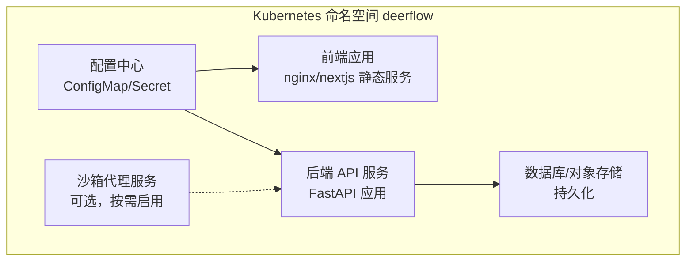
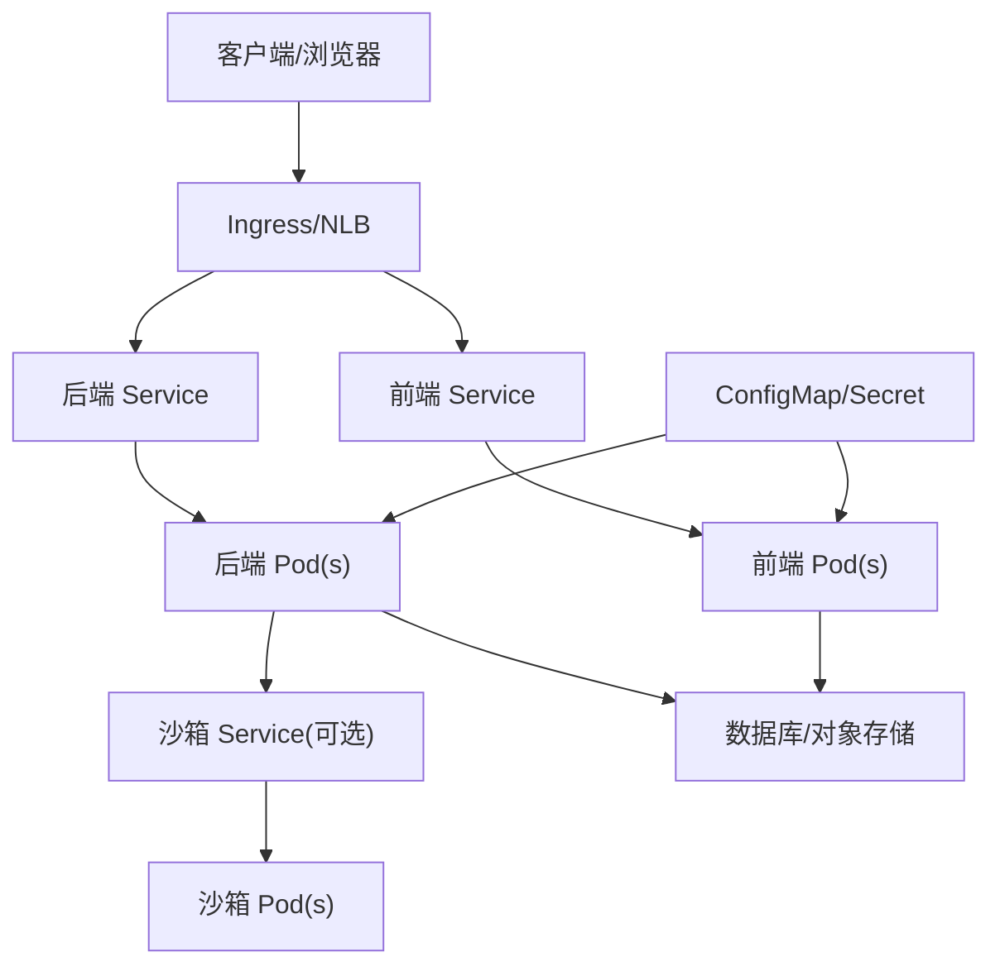
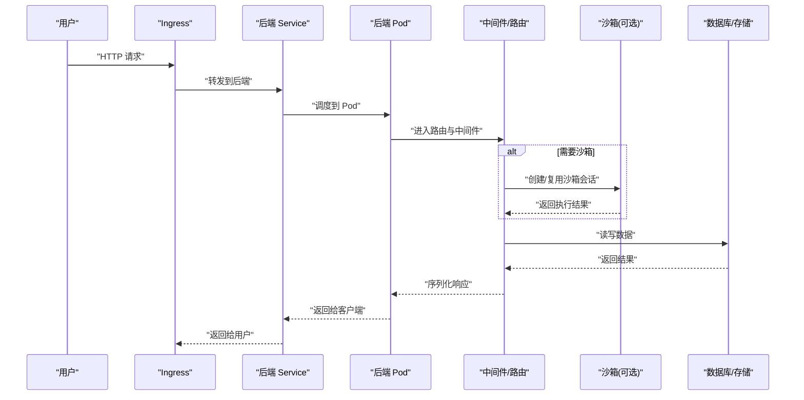
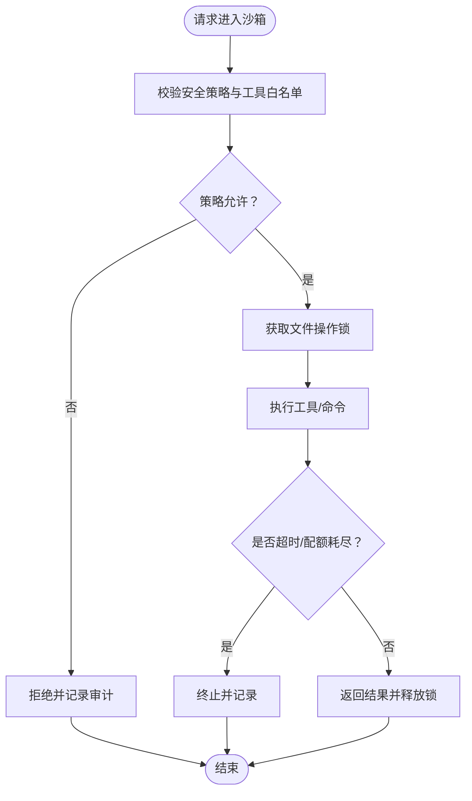
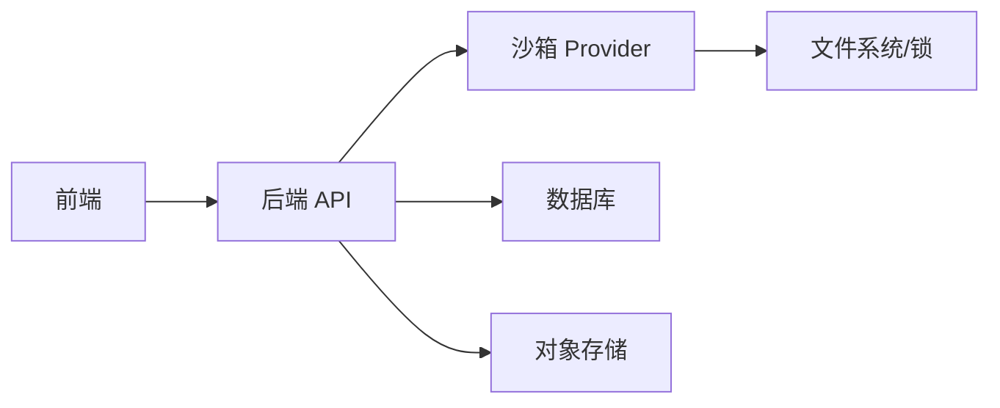

# Kubernetes 部署

<cite>
**本文引用的文件**
- [config.example.yaml](file://config.example.yaml)
- [config.yaml](file://config.yaml)
- [Dockerfile（后端）](file://backend/Dockerfile)
- [Dockerfile（前端）](file://frontend/Dockerfile)
- [docker-compose.yaml](file://docker/docker-compose.yaml)
- [docker-compose-dev.yaml](file://docker/docker-compose-dev.yaml)
- [deployment-guide.mdx（前端文档）](file://frontend/src/content/zh/application/deployment-guide.mdx)
- [README.md（根目录）](file://README.md)
- [Makefile（根目录）](file://Makefile)
- [build-backend.sh](file://scripts/build-backend.sh)
- [deploy.sh](file://scripts/deploy.sh)
- [start-deerflow.sh](file://scripts/start-deerflow.sh)
- [wait-for-port.sh](file://scripts/wait-for-port.sh)
- [provisioner Dockerfile](file://docker/provisioner/Dockerfile)
- [provisioner app.py](file://docker/provisioner/app.py)
- [backend入口脚本 deerflow_entry.py](file://deerflow_entry.py)
- [后端应用入口 app.py](file://backend/app/gateway/app.py)
- [后端配置 config.py](file://backend/app/gateway/config.py)
- [后端运行时路径 runtime_paths.py](file://backend/packages/harness/deerflow/config/runtime_paths.py)
- [后端沙箱配置 sandbox_config.py](file://backend/packages/harness/deerflow/config/sandbox_config.py)
- [后端沙箱中间件 middleware.py](file://backend/packages/harness/deerflow/sandbox/middleware.py)
- [后端沙箱提供者 sandbox_provider.py](file://backend/packages/harness/deerflow/sandbox/sandbox_provider.py)
- [后端沙箱安全策略 security.py](file://backend/packages/harness/deerflow/sandbox/security.py)
- [后端沙箱工具 tools.py](file://backend/packages/harness/deerflow/sandbox/tools.py)
- [后端沙箱搜索 search.py](file://backend/packages/harness/deerflow/sandbox/search.py)
- [后端沙箱异常处理 exceptions.py](file://backend/packages/harness/deerflow/sandbox/exceptions.py)
- [后端沙箱本地实现 local/](file://backend/packages/harness/deerflow/sandbox/local/)
- [后端沙箱文件操作锁 file_operation_lock.py](file://backend/packages/harness/deerflow/sandbox/file_operation_lock.py)
- [后端沙箱提供者接口 sandbox_provider.py](file://backend/packages/harness/deerflow/sandbox/sandbox_provider.py)
- [后端沙箱提供者实现 local/](file://backend/packages/harness/deerflow/sandbox/local/)
- [后端沙箱提供者实现 local/sandbox.py](file://backend/packages/harness/deerflow/sandbox/local/sandbox.py)
- [后端沙箱提供者实现 local/middleware.py](file://backend/packages/harness/deerflow/sandbox/local/middleware.py)
- [后端沙箱提供者实现 local/security.py](file://backend/packages/harness/deerflow/sandbox/local/security.py)
- [后端沙箱提供者实现 local/tools.py](file://backend/packages/harness/deerflow/sandbox/local/tools.py)
- [后端沙箱提供者实现 local/search.py](file://backend/packages/harness/deerflow/sandbox/local/search.py)
- [后端沙箱提供者实现 local/exceptions.py](file://backend/packages/harness/deerflow/sandbox/local/exceptions.py)
- [后端沙箱提供者实现 local/file_operation_lock.py](file://backend/packages/harness/deerflow/sandbox/local/file_operation_lock.py)
</cite>

## 目录
1. [简介](#简介)
2. [项目结构](#项目结构)
3. [核心组件](#核心组件)
4. [架构总览](#架构总览)
5. [详细组件分析](#详细组件分析)
6. [依赖关系分析](#依赖关系分析)
7. [性能考虑](#性能考虑)
8. [故障排除指南](#故障排除指南)
9. [结论](#结论)
10. [附录](#附录)

## 简介
本指南面向在 Kubernetes 环境中部署 DeerFlow 的工程团队，目标是提供从沙箱代理服务、配置管理到资源调度的完整落地方案。内容涵盖：
- 部署架构：后端 API 服务、前端静态资源、可选的沙箱代理与持久化存储
- 配置管理：ConfigMap/Secret 的组织方式与热重载策略
- 资源调度：Deployment、Service、HPA、PVC 等
- 扩展性与弹性：副本数、水平/垂直伸缩、健康检查与就绪探针
- 企业级特性：网络策略、RBAC、TLS、审计与日志
- Helm Chart 配置要点与 Deployment YAML 示例路径
- 监控与告警：Prometheus 指标、APM、日志聚合
- 故障排除：常见问题定位与修复步骤

## 项目结构
DeerFlow 由后端（Python/FastAPI）、前端（Next.js）、沙箱（可插拔）、扩展模块与容器化脚本组成。Kubernetes 部署建议采用“多镜像、多 Pod”的分层架构，便于独立扩缩与权限隔离。

图示来源
- [Dockerfile（后端）](file://backend/Dockerfile)
- [Dockerfile（前端）](file://frontend/Dockerfile)
- [后端应用入口 app.py](file://backend/app/gateway/app.py)

章节来源
- [README.md（根目录）](file://README.md)
- [Makefile（根目录）](file://Makefile)

## 核心组件
- 后端 API 服务：提供 Agent、Run、Thread、Skill 等核心路由，支持认证与鉴权中间件，内置沙箱执行与工具调用链路。
- 前端静态服务：Next.js 构建产物，可由 Nginx 或 Ingress 提供静态托管。
- 沙箱代理服务：可选的沙箱后端，用于隔离执行环境；支持本地/远程模式，具备安全策略与工具集。
- 配置与密钥：通过 ConfigMap/Secret 注入，支持热更新与版本化管理。
- 存储与持久化：数据库（SQLite/PostgreSQL）、对象存储或 PVC，用于会话、工件与上传文件。

章节来源
- [后端应用入口 app.py](file://backend/app/gateway/app.py)
- [后端配置 config.py](file://backend/app/gateway/config.py)
- [后端沙箱配置 sandbox_config.py](file://backend/packages/harness/deerflow/config/sandbox_config.py)
- [后端沙箱中间件 middleware.py](file://backend/packages/harness/deerflow/sandbox/middleware.py)
- [后端沙箱提供者 sandbox_provider.py](file://backend/packages/harness/deerflow/sandbox/sandbox_provider.py)

## 架构总览
下图展示 Kubernetes 部署下的典型拓扑：Ingress/NLB 接收流量，后端 API 服务负责业务逻辑与沙箱编排，前端静态资源提供用户界面，数据库与对象存储承载数据持久化。

图示来源
- [后端应用入口 app.py](file://backend/app/gateway/app.py)
- [后端沙箱提供者 sandbox_provider.py](file://backend/packages/harness/deerflow/sandbox/sandbox_provider.py)
- [后端运行时路径 runtime_paths.py](file://backend/packages/harness/deerflow/config/runtime_paths.py)

## 详细组件分析

### 后端 API 服务（Deployment + Service）
- 容器镜像：基于后端 Dockerfile 构建，暴露 HTTP 端口并提供健康/就绪探针。
- 配置注入：通过 ConfigMap/Secret 注入运行时参数（如数据库连接、模型提供商凭据、沙箱开关等）。
- 健康检查：HTTP GET /health 或 /ready；失败时触发滚动重启与自愈。
- 资源限制：CPU/内存 Requests/Limits，结合 HPA 实现弹性伸缩。
- 安全：只读根文件系统、非 root 用户、最小权限 RBAC。

图示来源
- [后端应用入口 app.py](file://backend/app/gateway/app.py)
- [后端沙箱中间件 middleware.py](file://backend/packages/harness/deerflow/sandbox/middleware.py)
- [后端沙箱提供者 sandbox_provider.py](file://backend/packages/harness/deerflow/sandbox/sandbox_provider.py)

章节来源
- [Dockerfile（后端）](file://backend/Dockerfile)
- [后端应用入口 app.py](file://backend/app/gateway/app.py)
- [后端配置 config.py](file://backend/app/gateway/config.py)

### 前端静态服务（Deployment + Service）
- 容器镜像：基于前端 Dockerfile 构建，Nginx 提供静态资源服务。
- 配置：通过 ConfigMap 注入运行时 API 地址、CDN、分析脚本等。
- 访问控制：Ingress 层面设置 TLS、WAF、速率限制与缓存策略。

章节来源
- [Dockerfile（前端）](file://frontend/Dockerfile)
- [deployment-guide.mdx（前端文档）](file://frontend/src/content/zh/application/deployment-guide.mdx)

### 沙箱代理服务（可选）
- 角色：隔离执行环境，限制文件系统访问与网络出站，统一工具调用。
- 模式：本地沙箱（共享宿主机卷/命名空间）与远程沙箱（独立 Pod/VM）。
- 安全：基于安全策略与工具白名单，文件操作加锁，超时与配额控制。
- 可观测性：执行日志、指标与审计事件上报。

图示来源
- [后端沙箱安全策略 security.py](file://backend/packages/harness/deerflow/sandbox/security.py)
- [后端沙箱工具 tools.py](file://backend/packages/harness/deerflow/sandbox/tools.py)
- [后端沙箱文件操作锁 file_operation_lock.py](file://backend/packages/harness/deerflow/sandbox/file_operation_lock.py)

章节来源
- [后端沙箱配置 sandbox_config.py](file://backend/packages/harness/deerflow/config/sandbox_config.py)
- [后端沙箱提供者 sandbox_provider.py](file://backend/packages/harness/deerflow/sandbox/sandbox_provider.py)
- [后端沙箱本地实现 local/](file://backend/packages/harness/deerflow/sandbox/local/)

### 配置管理（ConfigMap/Secret）
- ConfigMap：存放非敏感配置（如日志级别、功能开关、外部服务地址）。
- Secret：存放敏感信息（数据库密码、第三方 API 密钥、证书）。
- 热更新：挂载为卷或环境变量，配合应用内配置重载机制（如监听变更并刷新连接池）。

章节来源
- [config.example.yaml](file://config.example.yaml)
- [config.yaml](file://config.yaml)
- [后端配置 config.py](file://backend/app/gateway/config.py)

### 数据与持久化
- 数据库：PostgreSQL/MySQL 或 SQLite（开发/小规模），生产建议使用托管数据库或 StatefulSet + PVC。
- 对象存储：S3 兼容存储，用于工件与上传文件。
- 日志与指标：集中式日志（如 Loki）、指标（Prometheus）与 APM（如 Jaeger）。

章节来源
- [后端运行时路径 runtime_paths.py](file://backend/packages/harness/deerflow/config/runtime_paths.py)

## 依赖关系分析
- 组件耦合：后端对沙箱的依赖通过 Provider 抽象解耦；前端仅依赖后端 API。
- 外部依赖：数据库、对象存储、第三方 LLM/工具服务。
- 循环依赖：无直接循环，但配置变更可能影响多个组件启动顺序。

图示来源
- [后端沙箱提供者 sandbox_provider.py](file://backend/packages/harness/deerflow/sandbox/sandbox_provider.py)
- [后端运行时路径 runtime_paths.py](file://backend/packages/harness/deerflow/config/runtime_paths.py)

章节来源
- [后端沙箱提供者 sandbox_provider.py](file://backend/packages/harness/deerflow/sandbox/sandbox_provider.py)

## 性能考虑
- 弹性伸缩：基于 CPU/内存利用率与 QPS 的 HPA；Pod 数量与副本数根据峰值流量设定。
- 连接池：数据库与外部服务连接池大小应与副本数匹配，避免连接泄漏。
- 缓存：Redis/Memcached 用于会话与热点数据；注意缓存一致性与失效策略。
- 网络：Ingress 层开启 Gzip/HTTP2/TLS，后端启用 keep-alive。
- 资源预留：为关键组件设置更高的 Requests，避免突发导致 OOM。

## 故障排除指南
- 启动失败
  - 检查 ConfigMap/Secret 是否正确挂载与键名一致。
  - 查看 Pod 事件与日志，确认端口占用与权限。
- 健康检查失败
  - 确认 /health 与 /ready 路由可达；检查数据库连通性与对象存储凭证。
- 沙箱执行异常
  - 检查工具白名单与安全策略；查看文件锁冲突与超时配置。
- 性能瓶颈
  - 使用 HPA 自动扩容；优化慢查询与外部依赖延迟。
- 网络与 TLS
  - 校验证书链与域名解析；确认 Ingress 控制器与 WAF 规则未阻断。

章节来源
- [wait-for-port.sh](file://scripts/wait-for-port.sh)
- [后端沙箱异常处理 exceptions.py](file://backend/packages/harness/deerflow/sandbox/exceptions.py)

## 结论
通过将 DeerFlow 的后端、前端与可选沙箱代理服务容器化并纳入 Kubernetes，可以实现高可用、弹性伸缩与可观测的企业级部署。建议以 ConfigMap/Secret 管理配置，结合 HPA/PDB/探针保障稳定性，并通过 Ingress/NLB 提供安全可靠的入口。

## 附录

### Helm Chart 配置要点
- Chart 结构建议
  - templates/：Deployment、Service、ConfigMap、Secret、HPA、PDB、Ingress、CronJob（备份）
  - values.yaml：默认副本数、资源请求/限制、镜像仓库与标签、Ingress 主机与 TLS
  - ci/values-*.yaml：不同环境覆盖值
- 关键参数
  - replicaCount、image、resources、env、volumes、ingress.hosts、pdb.minAvailable
- 安全
  - podSecurityContext、containerSecurityContext、readOnlyRootFilesystem、runAsNonRoot
- 可观测性
  - prometheus.scrape、sidecar containers（如日志收集）

### Deployment YAML 示例路径
- 后端 Deployment：[后端 Dockerfile](file://backend/Dockerfile)
- 前端 Deployment：[前端 Dockerfile](file://frontend/Dockerfile)
- Service：[后端应用入口 app.py](file://backend/app/gateway/app.py)
- ConfigMap/Secret：[config.example.yaml](file://config.example.yaml)、[config.yaml](file://config.yaml)

### Service 配置
- 类型：ClusterIP/NodePort/NLB（按入口类型选择）
- 端口：HTTP/HTTPS、探针端口
- 会话亲和：可选基于 Cookie 的亲和策略

### ConfigMap 设置
- 非敏感键值：日志级别、功能开关、外部服务地址
- 挂载方式：卷挂载或环境变量注入

### 集群部署流程（概要）
- 准备阶段
  - 准备镜像仓库与推送镜像（后端/前端/沙箱代理）
  - 准备 Secret（数据库、第三方密钥、证书）
- 部署阶段
  - 应用 CRDs/StorageClass（如需 PVC）
  - 应用 ConfigMap/Secret
  - 应用 Service/Deployment 并等待就绪
- 验证阶段
  - 访问 /health 与 /ready
  - 执行端到端测试（创建线程、调用技能、沙箱执行）

### 监控配置
- 指标
  - Prometheus：后端 HTTP 请求时延、错误率、并发数；沙箱执行时长与失败数
- 日志
  - 结构化日志输出至 stdout/stderr，集中收集与检索
- 链路追踪
  - OpenTelemetry/Jaeger，标注关键 Span（沙箱执行、工具调用）

### 故障排除清单
- 端口与探针：确认端口开放与探针返回 200
- 配置：核对键名与值类型，避免拼写错误
- 权限：RBAC 与 PSP/opa 策略未阻止 Pod 启动
- 存储：PVC 绑定成功，权限正确
- 沙箱：工具白名单、文件锁、超时与配额设置合理