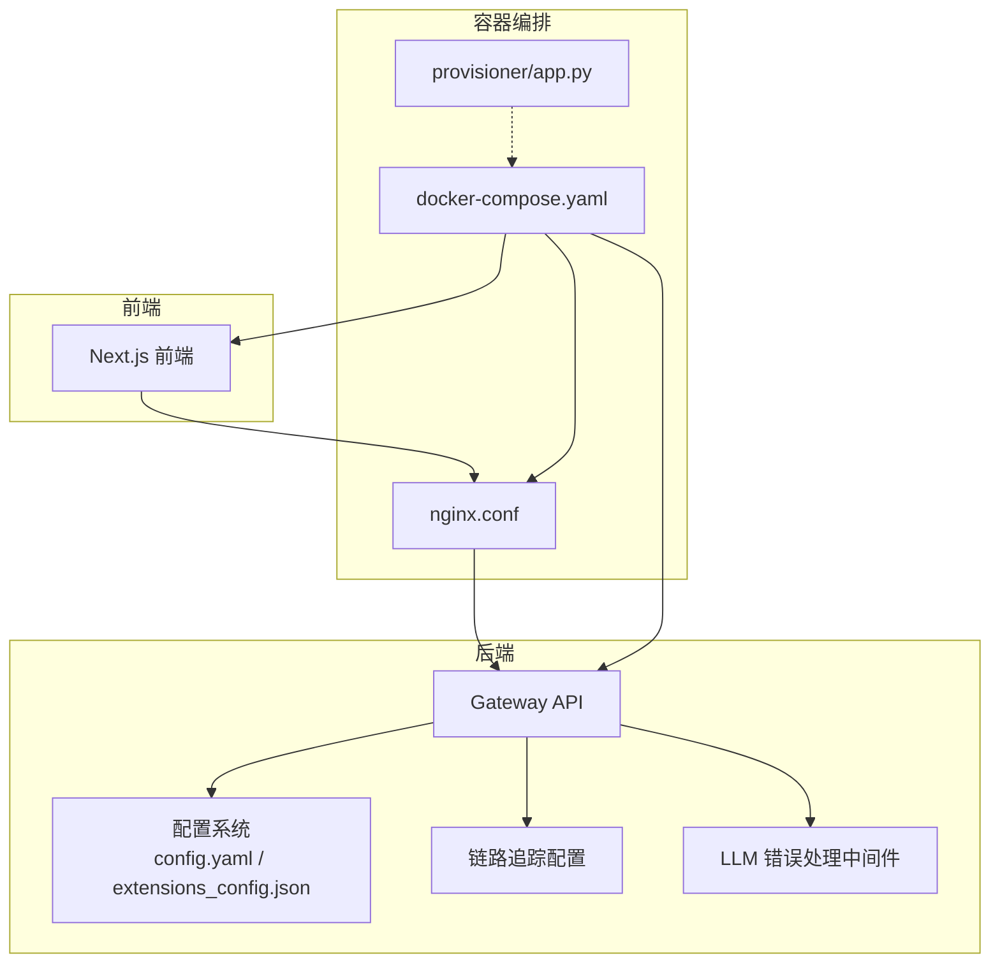
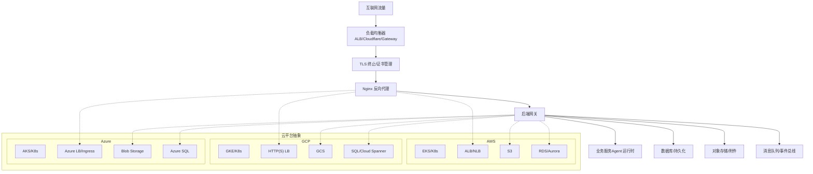
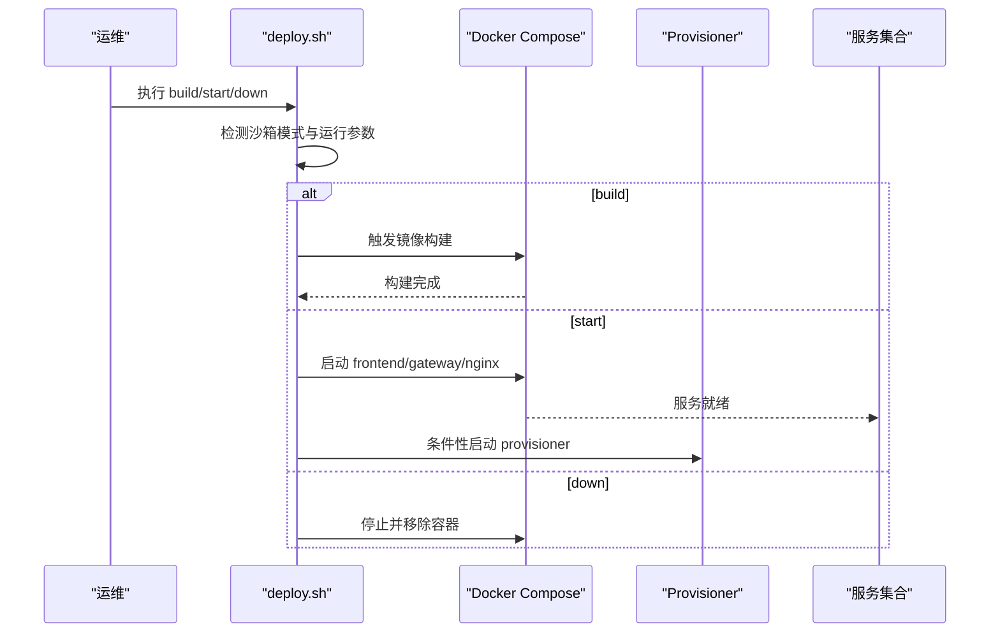
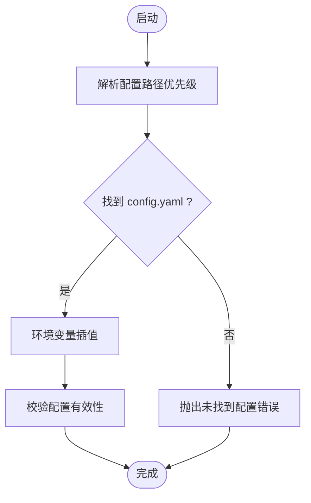
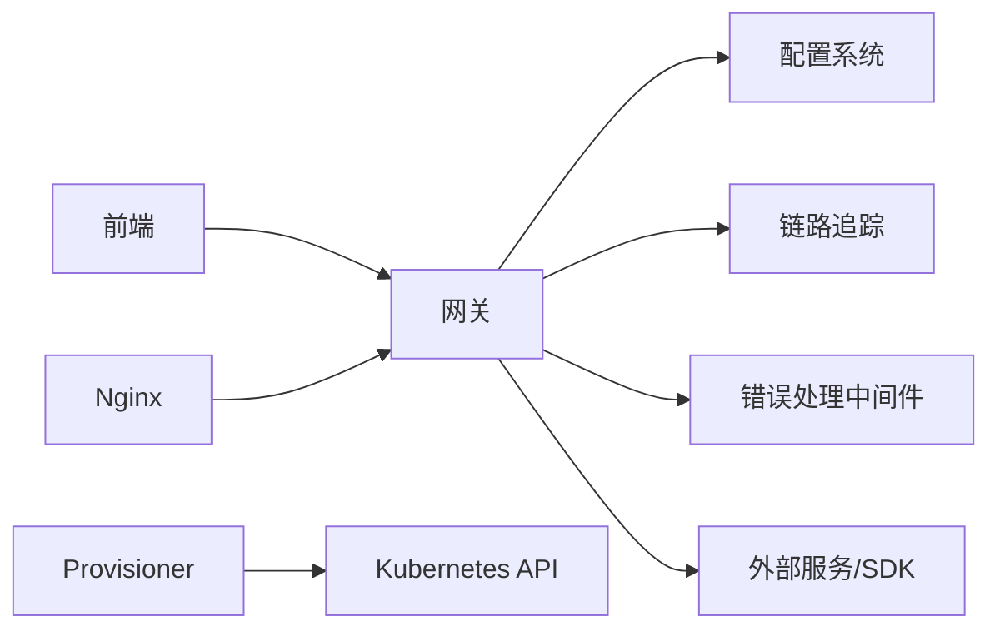

# 云平台部署

<cite>
**本文引用的文件**
- [scripts/deploy.sh](file://scripts/deploy.sh)
- [docker/docker-compose.yaml](file://docker/docker-compose.yaml)
- [docker/docker-compose-dev.yaml](file://docker/docker-compose-dev.yaml)
- [docker/nginx/nginx.conf](file://docker/nginx/nginx.conf)
- [docker/provisioner/app.py](file://docker/provisioner/app.py)
- [backend/docs/CONFIGURATION.md](file://backend/docs/CONFIGURATION.md)
- [frontend/src/content/en/application/configuration.mdx](file://frontend/src/content/en/application/configuration.mdx)
- [frontend/src/content/en/harness/configuration.mdx](file://frontend/src/content/en/harness/configuration.mdx)
- [backend/packages/harness/deerflow/config/tracing_config.py](file://backend/packages/harness/deerflow/config/tracing_config.py)
- [backend/packages/harness/deerflow/agents/middlewares/llm_error_handling_middleware.py](file://backend/packages/harness/deerflow/agents/middlewares/llm_error_handling_middleware.py)
- [backend/uv.lock](file://backend/uv.lock)
- [config.example.yaml](file://config.example.yaml)
- [release/config.example.yaml](file://release/config.example.yaml)
- [README_zh.md](file://README_zh.md)
- [Install.md](file://Install.md)
</cite>

## 目录
1. [简介](#简介)
2. [项目结构](#项目结构)
3. [核心组件](#核心组件)
4. [架构总览](#架构总览)
5. [详细组件分析](#详细组件分析)
6. [依赖关系分析](#依赖关系分析)
7. [性能考虑](#性能考虑)
8. [故障排查指南](#故障排查指南)
9. [结论](#结论)
10. [附录](#附录)

## 简介
本指南面向在 AWS、Google Cloud、Azure 等主流云平台部署 DeerFlow 的工程团队与运维人员，提供从基础设施到应用层的完整一键部署方案。内容涵盖云服务配置、负载均衡、存储与对象存储集成、监控告警、安全与合规、成本优化、云原生架构、自动扩缩容与灾难恢复策略，以及各平台特性与最佳实践。

## 项目结构
DeerFlow 采用前后端分离与容器化部署架构，核心由以下部分组成：
- 前端 Next.js 应用（前端）
- 后端 API 网关与业务逻辑（后端）
- Nginx 反向代理与静态资源（docker/nginx）
- Docker Compose 编排（docker/docker-compose.yaml）
- 生产一键部署脚本（scripts/deploy.sh）
- Kubernetes 接入与编排（docker/provisioner/app.py）

图表来源
- [docker/docker-compose.yaml](file://docker/docker-compose.yaml)
- [docker/nginx/nginx.conf](file://docker/nginx/nginx.conf)
- [docker/provisioner/app.py](file://docker/provisioner/app.py)
- [scripts/deploy.sh](file://scripts/deploy.sh)
- [backend/packages/harness/deerflow/config/tracing_config.py](file://backend/packages/harness/deerflow/config/tracing_config.py)
- [backend/packages/harness/deerflow/agents/middlewares/llm_error_handling_middleware.py](file://backend/packages/harness/deerflow/agents/middlewares/llm_error_handling_middleware.py)

章节来源
- [scripts/deploy.sh:1-267](file://scripts/deploy.sh#L1-L267)
- [docker/docker-compose.yaml](file://docker/docker-compose.yaml)
- [docker/docker-compose-dev.yaml](file://docker/docker-compose-dev.yaml)
- [docker/nginx/nginx.conf](file://docker/nginx/nginx.conf)
- [docker/provisioner/app.py:105-171](file://docker/provisioner/app.py#L105-L171)

## 核心组件
- 配置系统：通过 config.yaml 与 extensions_config.json 控制模型、沙箱、工具、技能、内存等；支持环境变量插值与优先级解析。
- 网关与路由：后端网关负责认证、授权、中间件与业务路由。
- 反向代理：Nginx 提供静态资源、跨域与上游转发。
- 容器编排：Docker Compose 统一构建与启动前端、网关、Nginx 服务；支持生产一键部署脚本。
- Kubernetes 接入：Provisioner 支持加载外部 kubeconfig 或集群内配置，用于在云原生环境中管理资源。
- 链路追踪与错误处理：可配置启用多种追踪提供商；内置 LLM 错误分类与熔断保护。

章节来源
- [frontend/src/content/en/application/configuration.mdx:12-24](file://frontend/src/content/en/application/configuration.mdx#L12-L24)
- [frontend/src/content/en/harness/configuration.mdx:18-37](file://frontend/src/content/en/harness/configuration.mdx#L18-L37)
- [backend/docs/CONFIGURATION.md:368-410](file://backend/docs/CONFIGURATION.md#L368-L410)
- [backend/packages/harness/deerflow/config/tracing_config.py:132-161](file://backend/packages/harness/deerflow/config/tracing_config.py#L132-L161)
- [backend/packages/harness/deerflow/agents/middlewares/llm_error_handling_middleware.py:126-147](file://backend/packages/harness/deerflow/agents/middlewares/llm_error_handling_middleware.py#L126-L147)

## 架构总览
下图展示云平台部署时的典型三层架构：入口层（LB/NLB + WAF/证书）— 应用层（容器/虚拟机 + 自动扩缩容）— 数据层（数据库/对象存储/缓存）。DeerFlow 在应用层以容器方式运行，通过 Nginx 暴露对外服务，并由后端网关统一接入业务能力。

图表来源
- [docker/docker-compose.yaml](file://docker/docker-compose.yaml)
- [docker/nginx/nginx.conf](file://docker/nginx/nginx.conf)
- [backend/docs/CONFIGURATION.md:368-410](file://backend/docs/CONFIGURATION.md#L368-L410)

## 详细组件分析

### 部署脚本与编排
- 一键构建与启动：deploy.sh 负责镜像构建、服务检测与启动，自动识别沙箱模式并决定是否拉起 provisioner。
- Compose 编排：docker/docker-compose.yaml 定义前端、网关、Nginx 服务及其网络与卷；docker/docker-compose-dev.yaml 用于本地开发场景。
- Provisioner：docker/provisioner/app.py 支持从挂载 kubeconfig 加载集群配置或使用 in-cluster 配置，便于在云原生环境中进行资源管理。

图表来源
- [scripts/deploy.sh:1-267](file://scripts/deploy.sh#L1-L267)
- [docker/docker-compose.yaml](file://docker/docker-compose.yaml)
- [docker/provisioner/app.py:105-171](file://docker/provisioner/app.py#L105-L171)

章节来源
- [scripts/deploy.sh:1-267](file://scripts/deploy.sh#L1-L267)
- [docker/docker-compose.yaml](file://docker/docker-compose.yaml)
- [docker/docker-compose-dev.yaml](file://docker/docker-compose-dev.yaml)
- [docker/provisioner/app.py:105-171](file://docker/provisioner/app.py#L105-L171)

### 配置系统与密钥治理
- 配置文件定位与优先级：支持代码指定路径、环境变量、项目根目录与回退位置，确保多环境一致性。
- 环境变量插值：所有字段可使用 $VAR_NAME 引用环境变量，避免硬编码敏感信息。
- 最佳实践：将 config.yaml 放入项目根目录、不提交密钥、保持示例配置同步、测试后再上线、生产使用 Docker 沙箱。

图表来源
- [backend/docs/CONFIGURATION.md:368-410](file://backend/docs/CONFIGURATION.md#L368-L410)
- [frontend/src/content/en/harness/configuration.mdx:18-37](file://frontend/src/content/en/harness/configuration.mdx#L18-L37)
- [frontend/src/content/en/application/configuration.mdx:12-24](file://frontend/src/content/en/application/configuration.mdx#L12-L24)

章节来源
- [backend/docs/CONFIGURATION.md:368-410](file://backend/docs/CONFIGURATION.md#L368-L410)
- [frontend/src/content/en/harness/configuration.mdx:18-37](file://frontend/src/content/en/harness/configuration.mdx#L18-L37)
- [frontend/src/content/en/application/configuration.mdx:12-24](file://frontend/src/content/en/application/configuration.mdx#L12-L24)

### 反向代理与静态资源
- Nginx 配置：docker/nginx/nginx.conf 提供反向代理、静态资源服务与基础安全头，建议结合云平台证书与 WAF 使用。
- 建议：在云平台侧启用 HTTPS、开启 WAF/IPS、限制来源 IP 与速率，配合 HSTS 与安全响应头。

章节来源
- [docker/nginx/nginx.conf](file://docker/nginx/nginx.conf)

### 链路追踪与错误处理
- 链路追踪：支持启用多个追踪提供商，按配置验证是否完整可用；适合在云监控中聚合日志与指标。
- LLM 错误处理：对配额、鉴权等错误进行分类，触发熔断与探测恢复，提升系统韧性。

章节来源
- [backend/packages/harness/deerflow/config/tracing_config.py:132-161](file://backend/packages/harness/deerflow/config/tracing_config.py#L132-L161)
- [backend/packages/harness/deerflow/agents/middlewares/llm_error_handling_middleware.py:126-147](file://backend/packages/harness/deerflow/agents/middlewares/llm_error_handling_middleware.py#L126-L147)

### Kubernetes 接入与云原生编排
- 外部 kubeconfig：支持挂载 kubeconfig 文件，自动加载并初始化客户端；可选覆盖 API Server 地址与禁用 SSL 校验（仅限本地/受控环境）。
- In-cluster 配置：当 provisioner 本身运行在集群内时，自动切换为 in-cluster 配置。
- 建议：在云原生环境中使用托管 K8s（EKS/GKE/AKS），结合 HPA/HPA 策略与 PodDisruptionBudget 实现弹性与高可用。

章节来源
- [docker/provisioner/app.py:105-171](file://docker/provisioner/app.py#L105-L171)

## 依赖关系分析
- 外部依赖：后端 uv.lock 中包含 azure-identity 等包，表明对 Azure SDK 的潜在依赖；在云平台选择上需注意对应 SDK 的可用性与版本兼容。
- 组件耦合：前端通过网关 API 访问后端；网关依赖配置系统与中间件；Nginx 作为单一入口；Provisioner 与编排解耦。

图表来源
- [backend/uv.lock:357-380](file://backend/uv.lock#L357-L380)
- [docker/provisioner/app.py:105-171](file://docker/provisioner/app.py#L105-L171)
- [backend/packages/harness/deerflow/config/tracing_config.py:132-161](file://backend/packages/harness/deerflow/config/tracing_config.py#L132-L161)
- [backend/packages/harness/deerflow/agents/middlewares/llm_error_handling_middleware.py:126-147](file://backend/packages/harness/deerflow/agents/middlewares/llm_error_handling_middleware.py#L126-L147)

章节来源
- [backend/uv.lock:357-380](file://backend/uv.lock#L357-L380)
- [docker/provisioner/app.py:105-171](file://docker/provisioner/app.py#L105-L171)

## 性能考虑
- 资源规划：根据并发请求与模型推理延迟估算 CPU/内存；为网关与代理预留 20%-50% 缓冲。
- 存储性能：对象存储与数据库置于就近区域；冷热分层与压缩策略降低带宽与成本。
- 网络优化：在云平台启用全局负载均衡与边缘缓存；Nginx 层启用 gzip/HTTP/2；CDN 加速静态资源。
- 链路追踪：启用轻量级采样策略，避免高基数标签导致指标膨胀。
- 容器优化：固定镜像版本、启用只读根文件系统、限制资源与重启策略。

## 故障排查指南
- “未找到配置文件”：确认 config.yaml 位于项目根或通过 DEER_FLOW_PROJECT_ROOT/DEER_FLOW_CONFIG_PATH 指定。
- “无效 API 密钥”：检查环境变量是否正确注入与使用 $VAR_NAME 插值语法。
- “技能未加载”：确认 deer-flow/skills/ 目录存在且具备有效 SKILL.md；如自定义路径，检查 DEER_FLOW_SKILLS_PATH。
- “Docker 沙箱无法启动”：确保 Docker 服务可用、端口 8080（或自定义端口）未被占用、镜像可达。
- “K8s 客户端初始化失败”：检查挂载的 kubeconfig 是否为文件、路径是否存在；若在集群内运行，确认 in-cluster 配置可用。

章节来源
- [backend/docs/CONFIGURATION.md:386-410](file://backend/docs/CONFIGURATION.md#L386-L410)
- [docker/provisioner/app.py:105-171](file://docker/provisioner/app.py#L105-L171)

## 结论
通过容器化与配置驱动的架构，DeerFlow 能够在 AWS、GCP、Azure 等云平台实现一致的部署体验。结合负载均衡、对象存储、数据库与链路追踪，配合安全与合规策略，可在保证性能与成本可控的前提下实现高可用与弹性伸缩。

## 附录

### 云平台一键部署清单（通用步骤）
- 准备阶段
  - 获取域名与证书（ACM/Cert Manager/Key Vault）
  - 准备对象存储桶/表单（S3/GCS/Blob/SQL）
  - 准备数据库实例（RDS/Cloud SQL/Azure SQL）
  - 准备容器镜像仓库（ECR/GCR/Azure Container Registry）
- 基础设施
  - 在云平台创建 VPC/子网与安全组
  - 部署负载均衡（ALB/Cloudflare/Cloud LB/Azure LB）
  - 配置 WAF/IPS 与访问控制
- 应用部署
  - 使用 docker-compose 或云原生编排（EKS/GKE/AKS）
  - 配置 Nginx 与网关的环境变量与密钥
  - 启用自动扩缩容（HPA/Cluster Autoscaler）
- 监控与告警
  - 配置链路追踪与日志聚合
  - 设置 CPU/内存/请求延迟阈值告警
  - 开启备份与异地复制

### 平台特性与最佳实践
- AWS
  - 使用 EKS + ALB + RDS/Aurora + S3；启用 IAM 角色与 IRSA；利用 CloudWatch/Managed Prometheus。
  - 成本优化：Spot 实例运行非关键工作负载；生命周期策略清理对象存储。
- Google Cloud
  - 使用 GKE + HTTP(S) Load Balancing + Cloud SQL/Cloud Spanner + GCS；IAP 与 IAM 控制访问。
  - 成本优化：Preemptible VM/节点组；定期审查资源使用。
- Azure
  - 使用 AKS + Azure LB/Ingress + Azure SQL + Blob Storage；Managed Identities 与 Key Vault。
  - 成本优化：低优先级节点池；自动伸缩与资源组隔离。

### 安全与合规
- 网络安全：仅暴露必要端口；限制来源 IP；启用 WAF/IPS；TLS 1.3+。
- 数据安全：对象存储启用默认加密；数据库启用透明加密；密钥轮换与最小权限。
- 合规：遵循 SOC2/ISO27001/CCPA 等要求；审计日志与数据留存策略。
- 运维安全：禁止在公网暴露管理接口；CI/CD 管道最小权限；镜像扫描与漏洞修复。

### 自动扩缩容与灾难恢复
- 自动扩缩容：基于 CPU/内存/请求延迟设置 HPA；结合 Cluster Autoscaler；PodDisruptionBudget 保障可用性。
- 灾难恢复：跨区镜像与备份；蓝绿/金丝雀发布；故障演练与回滚预案。

### 性能调优要点
- 前端：CDN 缓存、预加载关键资源、图片懒加载与 WebP。
- 后端：连接池复用、异步 I/O、流式响应；减少不必要的中间件链。
- 存储：批量上传/下载、压缩与分片；热点数据缓存。
- 网络：启用 HTTP/2/QUIC；边缘节点就近访问；DNS 优化。