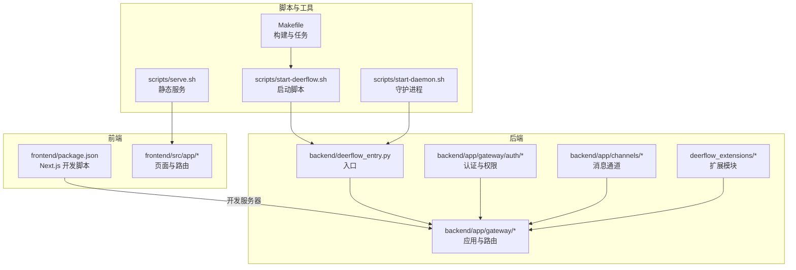
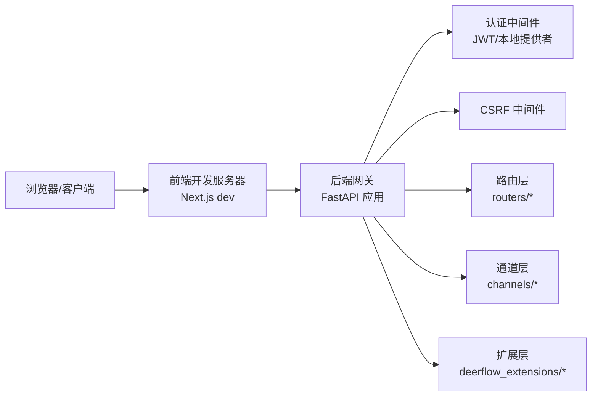
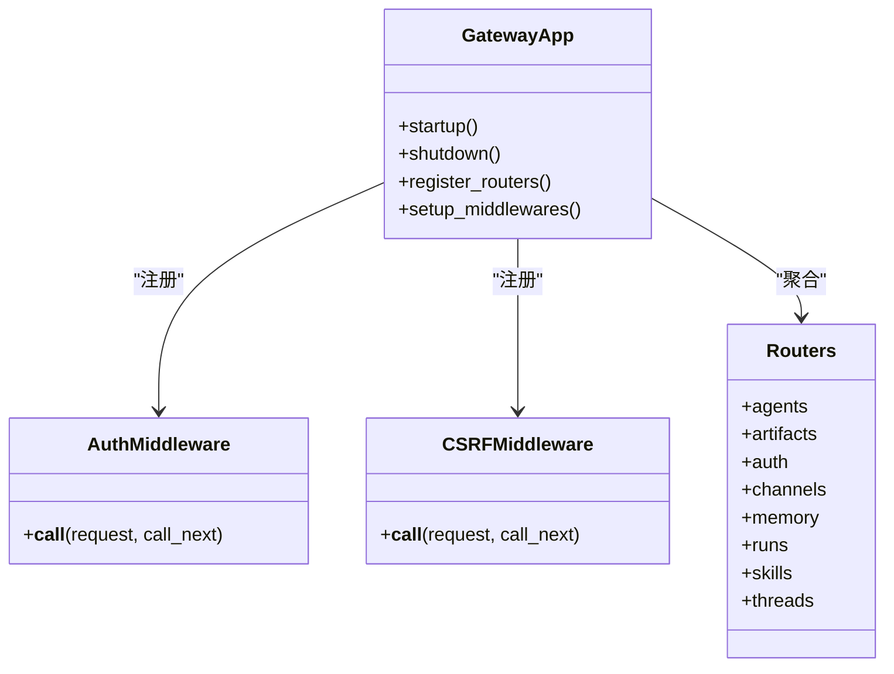
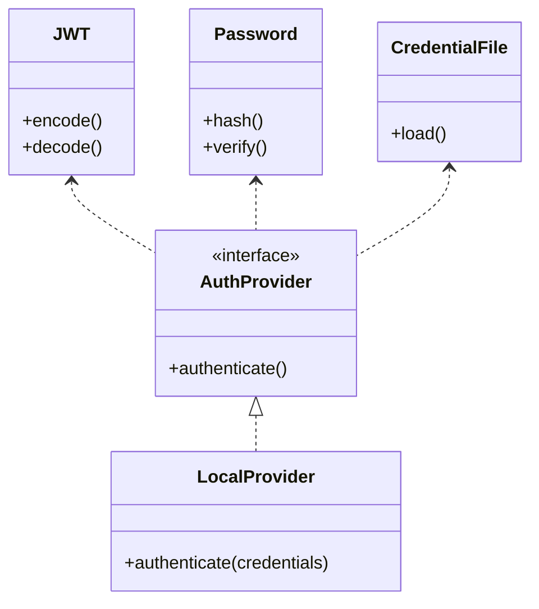
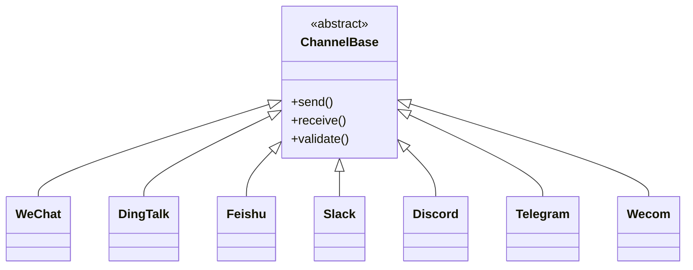
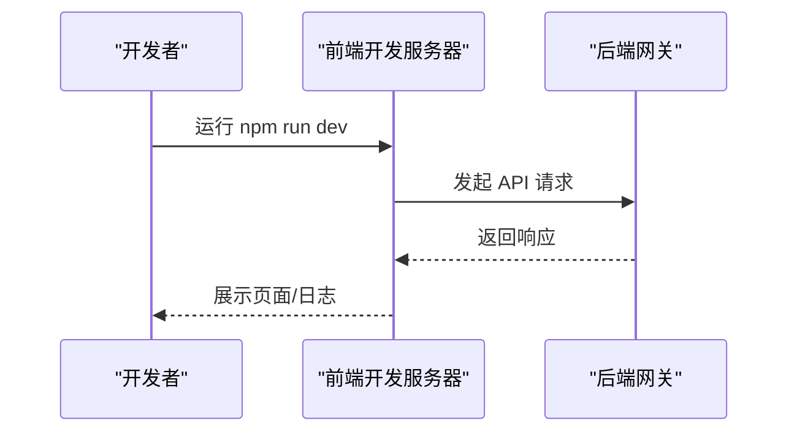
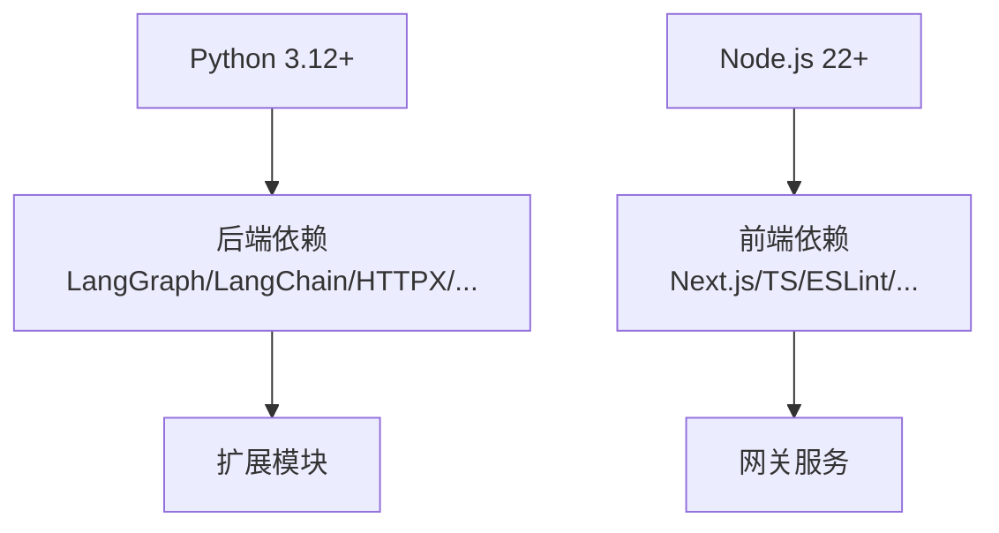
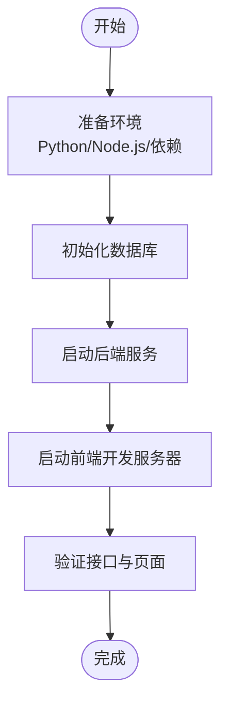

# 本地开发部署

<cite>
**本文引用的文件**   
- [Install.md](file://Install.md)
- [README.md](file://README.md)
- [backend/pyproject.toml](file://backend/pyproject.toml)
- [backend/packages/harness/pyproject.toml](file://backend/packages/harness/pyproject.toml)
- [frontend/package.json](file://frontend/package.json)
- [Makefile](file://Makefile)
- [scripts/start-deerflow.sh](file://scripts/start-deerflow.sh)
- [scripts/start-daemon.sh](file://scripts/start-daemon.sh)
- [scripts/serve.sh](file://scripts/serve.sh)
- [backend/deerflow_entry.py](file://backend/deerflow_entry.py)
- [backend/app/gateway/app.py](file://backend/app/gateway/app.py)
- [backend/app/gateway/config.py](file://backend/app/gateway/config.py)
- [backend/app/gateway/services.py](file://backend/app/gateway/services.py)
- [backend/app/gateway/auth_middleware.py](file://backend/app/gateway/auth_middleware.py)
- [backend/app/gateway/csrf_middleware.py](file://backend/app/gateway/csrf_middleware.py)
- [backend/app/gateway/deps.py](file://backend/app/gateway/deps.py)
- [backend/app/gateway/utils.py](file://backend/app/gateway/utils.py)
- [backend/app/gateway/routers/](file://backend/app/gateway/routers/)
- [backend/app/gateway/auth/](file://backend/app/gateway/auth/)
- [backend/app/gateway/internal_auth.py](file://backend/app/gateway/internal_auth.py)
- [backend/app/gateway/langgraph_auth.py](file://backend/app/gateway/langgraph_auth.py)
- [backend/app/gateway/path_utils.py](file://backend/app/gateway/path_utils.py)
- [backend/app/channels/manager.py](file://backend/app/channels/manager.py)
- [backend/app/channels/service.py](file://backend/app/channels/service.py)
- [backend/app/channels/store.py](file://backend/app/channels/store.py)
- [backend/app/channels/message_bus.py](file://backend/app/channels/message_bus.py)
- [backend/app/channels/base.py](file://backend/app/channels/base.py)
- [backend/app/channels/commands.py](file://backend/app/channels/commands.py)
- [backend/app/channels/wechat.py](file://backend/app/channels/wechat.py)
- [backend/app/channels/dingtalk.py](file://backend/app/channels/dingtalk.py)
- [backend/app/channels/discord.py](file://backend/app/channels/discord.py)
- [backend/app/channels/telegram.py](file://backend/app/channels/telegram.py)
- [backend/app/channels/slack.py](file://backend/app/channels/slack.py)
- [backend/app/channels/feishu.py](file://backend/app/channels/feishu.py)
- [backend/app/channels/wecom.py](file://backend/app/channels/wecom.py)
- [backend/app/gateway/auth/reset_admin.py](file://backend/app/gateway/auth/reset_admin.py)
- [backend/app/gateway/auth/credential_file.py](file://backend/app/gateway/auth/credential_file.py)
- [backend/app/gateway/auth/password.py](file://backend/app/gateway/auth/password.py)
- [backend/app/gateway/auth/providers.py](file://backend/app/gateway/auth/providers.py)
- [backend/app/gateway/auth/models.py](file://backend/app/gateway/auth/models.py)
- [backend/app/gateway/auth/jwt.py](file://backend/app/gateway/auth/jwt.py)
- [backend/app/gateway/auth/local_provider.py](file://backend/app/gateway/auth/local_provider.py)
- [backend/app/gateway/auth/errors.py](file://backend/app/gateway/auth/errors.py)
- [backend/app/gateway/auth/config.py](file://backend/app/gateway/auth/config.py)
- [backend/app/gateway/auth/middleware.py](file://backend/app/gateway/auth/middleware.py)
- [backend/app/gateway/auth/credential_file.py](file://backend/app/gateway/auth/credential_file.py)
- [backend/app/gateway/auth/password.py](file://backend/app/gateway/auth/password.py)
- [backend/app/gateway/auth/providers.py](file://backend/app/gateway/auth/providers.py)
- [backend/app/gateway/auth/models.py](file://backend/app/gateway/auth/models.py)
- [backend/app/gateway/auth/jwt.py](file://backend/app/gateway/auth/jwt.py)
- [backend/app/gateway/auth/local_provider.py](file://backend/app/gateway/auth/local_provider.py)
- [backend/app/gateway/auth/errors.py](file://backend/app/gateway/auth/errors.py)
- [backend/app/gateway/auth/config.py](file://backend/app/gateway/auth/config.py)
- [backend/app/gateway/auth/middleware.py](file://backend/app/gateway/auth/middleware.py)
- [backend/app/gateway/auth/reset_admin.py](file://backend/app/gateway/auth/reset_admin.py)
- [backend/app/gateway/auth/credential_file.py](file://backend/app/gateway/auth/credential_file.py)
- [backend/app/gateway/auth/password.py](file://backend/app/gateway/auth/password.py)
- [backend/app/gateway/auth/providers.py](file://backend/app/gateway/auth/providers.py)
- [backend/app/gateway/auth/models.py](file://backend/app/gateway/auth/models.py)
- [backend/app/gateway/auth/jwt.py](file://backend/app/gateway/auth/jwt.py)
- [backend/app/gateway/auth/local_provider.py](file://backend/app/gateway/auth/local_provider.py)
- [backend/app/gateway/auth/errors.py](file://backend/app/gateway/auth/errors.py)
- [backend/app/gateway/auth/config.py](file://backend/app/gateway/auth/config.py)
- [backend/app/gateway/auth/middleware.py](file://backend/app/gateway/auth/middleware.py)
- [backend/app/gateway/auth/reset_admin.py](file://backend/app/gateway/auth/reset_admin.py)
- [backend/app/gateway/auth/credential_file.py](file://backend/app/gateway/auth/credential_file.py)
- [backend/app/gateway/auth/password.py](file://backend/app/gateway/auth/password.py)
- [backend/app/gateway/auth/providers.py](file://backend/app/gateway/auth/providers.py)
- [backend/app/gateway/auth/models.py](file://backend/app/gateway/auth/models.py)
- [backend/app/gateway/auth/jwt.py](file://backend/app/gateway/auth/jwt.py)
- [backend/app/gateway/auth/local_provider.py](file://backend/app/gateway/auth/local_provider.py)
- [backend/app/gateway/auth/errors.py](file://backend/app/gateway/auth/errors.py)
- [backend/app/gateway/auth/config.py](file://backend/app/gateway/auth/config.py)
- [backend/app/gateway/auth/middleware.py](file://backend/app/gateway/auth/middleware.py)
- [backend/app/gateway/auth/reset_admin.py](file://backend/app/gateway/auth/reset_admin.py)
- [backend/app/gateway/auth/credential_file.py](file://backend/app/gateway/auth/credential_file.py)
- [backend/app/gateway/auth/password.py](file://backend/app/gateway/auth/password.py)
- [backend/app/gateway/auth/providers.py](file://backend/app/gateway/auth/providers.py)
- [backend/app/gateway/auth/models.py](file://backend/app/gateway/auth/models.py)
- [backend/app/gateway/auth/jwt.py](file://backend/app/gateway/auth/jwt.py)
- [backend/app/gateway/auth/local_provider.py](file://backend/app/gateway/auth/local_provider.py)
- [backend/app/gateway/auth/errors.py](file://backend/app/gateway/auth/errors.py)
- [backend/app/gateway/auth/config.py](file://backend/app/gateway/auth/config.py)
- [backend/app/gateway/auth/middleware.py](file://backend/app/gateway/auth/middleware.py)
- [backend/app/gateway/auth/reset_admin.py](file://backend/app/gateway/auth/reset_admin.py)
- [backend/app/gateway/auth/credential_file.py](file://backend/app/gateway/auth/credential_file.py)
- [backend/app/gateway/auth/password.py](file://backend/app/gateway/auth/password.py)
- [backend/app/gateway/auth/providers.py](file://backend/app/gateway/auth/providers.py)
- [backend/app/gateway/auth/models.py](file://backend/app/gateway/auth/models.py)
- [backend/app/gateway/auth/jwt.py](file://backend/app/gateway/auth/jwt.py)
- [backend/app/gateway/auth/local_provider.py](file://backend/app/gateway/auth/local_provider.py)
- [backend/app/gateway/auth/errors.py](file://backend/app/gateway/auth/errors.py)
- [backend/app/gateway/auth/config.py](file://backend/app/gateway/auth/config.py)
- [backend/app/gateway/auth/middleware.py](file://backend/app/gateway/auth/middleware.py)
- [backend/app/gateway/auth/reset_admin.py](file://backend/app/gateway/auth/reset_admin.py)
- [backend/app/gateway/auth/credential_file.py](file://backend/app/gateway/auth/credential_file.py)
- [backend/app/gateway/auth/password.py](file://backend/app/gateway/auth/password.py)
- [backend/app/gateway/auth/providers.py](file://backend/app/gateway/auth/providers.py)
- [backend/app/gateway/auth/models.py](file://backend/app/gateway/auth/models.py)
- [backend/app/gateway/auth/jwt.py](file://backend/app/gateway/auth/jwt.py)
- [backend/app/gateway/auth/local_provider.py](file://backend/app/gateway/auth/local_provider.py)
- [backend/app/gateway/auth/errors.py](file://backend/app/gateway/auth/errors.py)
- [backend/app/gateway/auth/config.py](file://backend/app/gateway/auth/config.py)
- [backend/app/gateway/auth/middleware.py](file://backend/app/gateway/auth/middleware.py)
- [backend/app/gateway/auth/reset_admin.py](file://backend/app/gateway/auth/reset_admin.py)
- [backend/app/gateway/auth/credential_file.py](file://backend/app/gateway/auth/credential_file.py)
- [backend/app/gateway/auth/password.py](file://backend/app/gateway/auth/password.py)
- [backend/app/gateway/auth/providers.py](file://backend/app/gateway/auth/providers.py)
- [backend/app/gateway/auth/models.py](file://backend/app/gateway/auth/models.py)
- [backend/app/gateway/auth/jwt.py](file://backend/app/gateway/auth/jwt.py)
- [backend/app/gateway/auth/local_provider.py](file://backend/app/gateway/auth/local_provider.py)
- [backend/app/gateway/auth/errors.py](file://backend/app/gateway/auth/errors.py)
- [backend/app/gateway/auth/config.py](file://backend/app/gateway/auth/config.py)
- [backend/app/gateway/auth/middleware.py](file://backend/app/gateway/auth/m......)
</cite>

## 目录
1. [简介](#简介)
2. [项目结构](#项目结构)
3. [核心组件](#核心组件)
4. [架构总览](#架构总览)
5. [详细组件分析](#详细组件分析)
6. [依赖分析](#依赖分析)
7. [性能考虑](#性能考虑)
8. [故障排查指南](#故障排查指南)
9. [结论](#结论)
10. [附录](#附录)

## 简介
本指南面向希望在本地原生环境下搭建 DeerFlow 开发环境的工程师，覆盖 Python 与 Node.js 环境准备、依赖安装、数据库初始化、开发服务器启动、环境变量配置以及最佳实践与性能调优建议。文档同时解释本地开发的优势（如调试便利性、资源占用可控）与常见问题处理路径。

## 项目结构
DeerFlow 采用前后端分离与多子模块并行的组织方式：
- 后端：基于 Python 的 FastAPI 应用，提供网关服务、认证、通道集成、运行时与持久化等能力。
- 前端：基于 Next.js 的管理界面与演示页面。
- 扩展：通过扩展机制支持鉴权、数据采集、环境设置、主题守卫等能力。
- 脚本与工具：提供一键启动、守护进程、服务编排与诊断脚本。

图示来源
- [frontend/package.json:5-18](file://frontend/package.json#L5-L18)
- [backend/deerflow_entry.py](file://backend/deerflow_entry.py)
- [backend/app/gateway/app.py](file://backend/app/gateway/app.py)
- [backend/app/gateway/auth/](file://backend/app/gateway/auth/)
- [backend/app/channels/](file://backend/app/channels/)
- [deerflow_extensions/](file://deerflow_extensions/)
- [scripts/start-deerflow.sh](file://scripts/start-deerflow.sh)
- [scripts/start-daemon.sh](file://scripts/start-daemon.sh)
- [scripts/serve.sh](file://scripts/serve.sh)
- [Makefile](file://Makefile)

章节来源
- [README.md:1-25](file://README.md#L1-L25)
- [Install.md:1-25](file://Install.md#L1-L25)
- [frontend/package.json:5-18](file://frontend/package.json#L5-L18)
- [backend/pyproject.toml](file://backend/pyproject.toml)
- [backend/packages/harness/pyproject.toml:4-25](file://backend/packages/harness/pyproject.toml#L4-L25)
- [Makefile](file://Makefile)

## 核心组件
- 后端网关服务：负责路由、中间件、认证、权限控制与业务接口聚合。
- 认证与授权：支持本地提供者、JWT、密码与凭据文件等多种认证方式。
- 消息通道：集成微信、钉钉、飞书、Slack、Discord、Telegram 等渠道。
- 扩展系统：通过扩展模块实现鉴权、环境设置、数据采集与主题守卫等功能。
- 前端开发环境：基于 Next.js 的开发服务器，提供热重载与调试体验。

章节来源
- [backend/app/gateway/app.py](file://backend/app/gateway/app.py)
- [backend/app/gateway/auth/](file://backend/app/gateway/auth/)
- [backend/app/channels/](file://backend/app/channels/)
- [deerflow_extensions/](file://deerflow_extensions/)
- [frontend/package.json:5-18](file://frontend/package.json#L5-L18)

## 架构总览
下图展示本地开发时后端与前端的交互关系，以及关键中间件与认证流程：

图示来源
- [frontend/package.json](file://frontend/package.json#L9)
- [backend/app/gateway/app.py](file://backend/app/gateway/app.py)
- [backend/app/gateway/auth_middleware.py](file://backend/app/gateway/auth_middleware.py)
- [backend/app/gateway/csrf_middleware.py](file://backend/app/gateway/csrf_middleware.py)
- [backend/app/gateway/routers/](file://backend/app/gateway/routers/)
- [backend/app/channels/](file://backend/app/channels/)
- [deerflow_extensions/](file://deerflow_extensions/)

## 详细组件分析

### 后端网关与路由
- 应用入口与生命周期：通过应用工厂创建服务实例，注册中间件与路由。
- 中间件链：认证中间件、CSRF 中间件、内部认证与 LangGraph 认证等。
- 路由模块：按领域拆分（如 agents、artifacts、auth、channels、memory、runs、skills、threads 等），便于维护与扩展。
- 工具与依赖：统一依赖注入与工具函数，确保跨模块一致性。

图示来源
- [backend/app/gateway/app.py](file://backend/app/gateway/app.py)
- [backend/app/gateway/auth_middleware.py](file://backend/app/gateway/auth_middleware.py)
- [backend/app/gateway/csrf_middleware.py](file://backend/app/gateway/csrf_middleware.py)
- [backend/app/gateway/routers/](file://backend/app/gateway/routers/)

章节来源
- [backend/app/gateway/app.py](file://backend/app/gateway/app.py)
- [backend/app/gateway/auth_middleware.py](file://backend/app/gateway/auth_middleware.py)
- [backend/app/gateway/csrf_middleware.py](file://backend/app/gateway/csrf_middleware.py)
- [backend/app/gateway/routers/](file://backend/app/gateway/routers/)

### 认证与授权
- 提供者与策略：本地提供者、JWT、密码与凭据文件加载器。
- 错误处理：统一认证错误类型与提示。
- 管理员重置：提供管理员账户重置能力，便于开发测试。

图示来源
- [backend/app/gateway/auth/providers.py](file://backend/app/gateway/auth/providers.py)
- [backend/app/gateway/auth/local_provider.py](file://backend/app/gateway/auth/local_provider.py)
- [backend/app/gateway/auth/jwt.py](file://backend/app/gateway/auth/jwt.py)
- [backend/app/gateway/auth/password.py](file://backend/app/gateway/auth/password.py)
- [backend/app/gateway/auth/credential_file.py](file://backend/app/gateway/auth/credential_file.py)
- [backend/app/gateway/auth/errors.py](file://backend/app/gateway/auth/errors.py)
- [backend/app/gateway/auth/reset_admin.py](file://backend/app/gateway/auth/reset_admin.py)

章节来源
- [backend/app/gateway/auth/](file://backend/app/gateway/auth/)
- [backend/app/gateway/auth/config.py](file://backend/app/gateway/auth/config.py)
- [backend/app/gateway/auth/middleware.py](file://backend/app/gateway/auth/middleware.py)

### 消息通道
- 统一抽象：通道基类定义通用协议，具体渠道继承实现。
- 管理与服务：通道管理器负责生命周期与事件调度；服务封装业务逻辑。
- 存储与消息总线：存储用于持久化，消息总线用于解耦事件发布订阅。

图示来源
- [backend/app/channels/base.py](file://backend/app/channels/base.py)
- [backend/app/channels/wechat.py](file://backend/app/channels/wechat.py)
- [backend/app/channels/dingtalk.py](file://backend/app/channels/dingtalk.py)
- [backend/app/channels/feishu.py](file://backend/app/channels/feishu.py)
- [backend/app/channels/slack.py](file://backend/app/channels/slack.py)
- [backend/app/channels/discord.py](file://backend/app/channels/discord.py)
- [backend/app/channels/telegram.py](file://backend/app/channels/telegram.py)
- [backend/app/channels/wecom.py](file://backend/app/channels/wecom.py)
- [backend/app/channels/manager.py](file://backend/app/channels/manager.py)
- [backend/app/channels/service.py](file://backend/app/channels/service.py)
- [backend/app/channels/store.py](file://backend/app/channels/store.py)
- [backend/app/channels/message_bus.py](file://backend/app/channels/message_bus.py)

章节来源
- [backend/app/channels/](file://backend/app/channels/)

### 前端开发流程
- 开发脚本：通过 Next.js dev 启动本地开发服务器，支持热重载与调试。
- 页面与路由：按语言与功能划分目录，便于国际化与模块化管理。
- 扩展：前端侧扩展模块（如 ads_auth、env-settings、input-suggestions、mobile-sidebar）可独立开发与集成。

图示来源
- [frontend/package.json](file://frontend/package.json#L9)
- [backend/app/gateway/app.py](file://backend/app/gateway/app.py)

章节来源
- [frontend/package.json:5-18](file://frontend/package.json#L5-L18)
- [frontend/src/app/](file://frontend/src/app/)

## 依赖分析
- Python 版本要求：后端与扩展包均要求 Python 3.12+。
- 关键依赖：LangGraph、LangChain、HTTP 客户端、Langfuse、Pydantic 等。
- 前端依赖：Next.js、TypeScript、ESLint、Prettier、Playwright、Vitest 等。
- 构建与任务：Makefile 提供常用命令，脚本提供启动与守护进程能力。

图示来源
- [backend/packages/harness/pyproject.toml:4-25](file://backend/packages/harness/pyproject.toml#L4-L25)
- [backend/pyproject.toml](file://backend/pyproject.toml)
- [frontend/package.json:20-100](file://frontend/package.json#L20-L100)
- [Makefile](file://Makefile)

章节来源
- [backend/packages/harness/pyproject.toml:4-25](file://backend/packages/harness/pyproject.toml#L4-L25)
- [backend/pyproject.toml](file://backend/pyproject.toml)
- [frontend/package.json:20-100](file://frontend/package.json#L20-L100)
- [Makefile](file://Makefile)

## 性能考虑
- 调试便利性：本地开发可直接启用断点、日志与热重载，提升迭代效率。
- 资源占用：前端开发服务器与后端服务通常占用较低资源，适合单机开发。
- 并发与 I/O：注意避免阻塞 I/O 与长耗时同步操作，必要时使用异步或后台任务。
- 缓存与中间件：合理利用缓存与中间件减少重复计算与网络请求。
- 数据库连接池：生产与开发可共用连接池配置，但需关注并发与超时参数。

## 故障排查指南
- 启动失败：检查端口占用与环境变量是否正确；优先使用提供的启动脚本。
- 认证异常：确认本地提供者与 JWT 配置；核对凭据文件路径与权限。
- 渠道集成：逐个检查渠道的接入参数与回调地址；查看消息总线与存储状态。
- 前端无法访问：确认前端开发服务器端口与代理配置；检查跨域与中间件链路。
- 数据库初始化：若涉及 SQLite 或其他存储，请先执行迁移脚本或初始化流程。

章节来源
- [scripts/start-deerflow.sh](file://scripts/start-deerflow.sh)
- [scripts/start-daemon.sh](file://scripts/start-daemon.sh)
- [backend/app/gateway/auth/config.py](file://backend/app/gateway/auth/config.py)
- [backend/app/gateway/auth/credential_file.py](file://backend/app/gateway/auth/credential_file.py)
- [backend/app/channels/message_bus.py](file://backend/app/channels/message_bus.py)

## 结论
本地开发模式为 DeerFlow 提供了高效、可控且易于调试的开发体验。通过明确的环境准备、依赖安装与启动流程，结合扩展与通道模块的清晰边界，开发者可以快速定位问题并进行迭代优化。

## 附录

### 本地开发环境搭建步骤
- 克隆仓库并进入根目录
- 准备 Python 环境（3.12+）
- 准备 Node.js 环境（22+）
- 安装后端依赖（参考后端 pyproject.toml）
- 安装前端依赖（参考 frontend/package.json）
- 初始化数据库（如需）
- 启动后端服务（参考 deerflow_entry.py 与网关应用）
- 启动前端开发服务器（参考 frontend/package.json）
- 验证服务健康与接口可用性

章节来源
- [Install.md:1-25](file://Install.md#L1-L25)
- [README.md:4-5](file://README.md#L4-L5)
- [backend/packages/harness/pyproject.toml:4-25](file://backend/packages/harness/pyproject.toml#L4-L25)
- [frontend/package.json:20-100](file://frontend/package.json#L20-L100)
- [backend/deerflow_entry.py](file://backend/deerflow_entry.py)
- [backend/app/gateway/app.py](file://backend/app/gateway/app.py)

### 环境变量与配置要点
- 认证相关：本地提供者、JWT 密钥、密码哈希策略与凭据文件路径
- 渠道集成：各平台的 App ID/Secret、回调地址与消息格式
- 扩展配置：扩展开关、日志级别与外部服务地址
- 数据库：SQLite 或外部数据库连接字符串与迁移脚本

章节来源
- [backend/app/gateway/auth/config.py](file://backend/app/gateway/auth/config.py)
- [backend/app/gateway/auth/credential_file.py](file://backend/app/gateway/auth/credential_file.py)
- [backend/app/gateway/config.py](file://backend/app/gateway/config.py)

### 数据库初始化与迁移
- 使用迁移脚本或 ORM 工具初始化数据库结构
- 在开发环境中可使用 SQLite 快速验证
- 生产迁移与备份策略需另行制定

章节来源
- [backend/app/gateway/services.py](file://backend/app/gateway/services.py)
- [backend/app/gateway/utils.py](file://backend/app/gateway/utils.py)

### 开发服务器启动流程

图示来源
- [scripts/start-deerflow.sh](file://scripts/start-deerflow.sh)
- [scripts/serve.sh](file://scripts/serve.sh)
- [frontend/package.json](file://frontend/package.json#L9)
- [backend/deerflow_entry.py](file://backend/deerflow_entry.py)