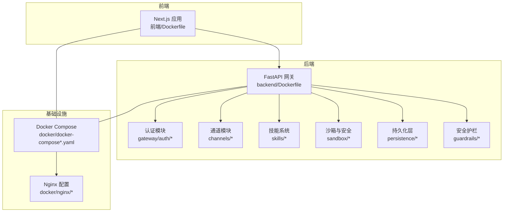
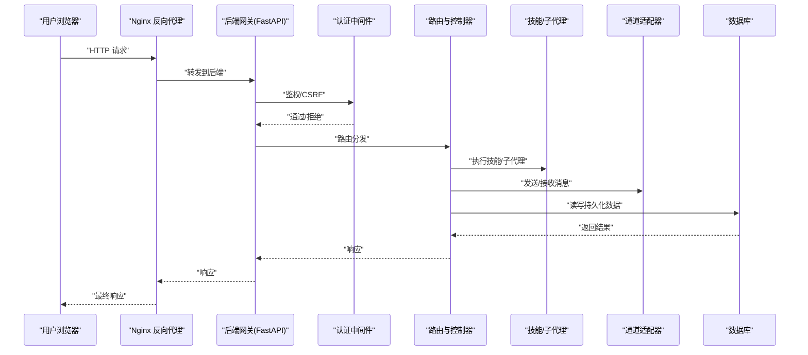
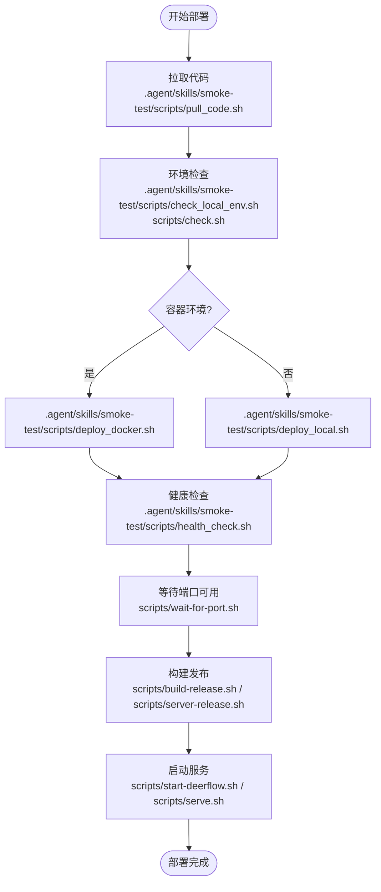
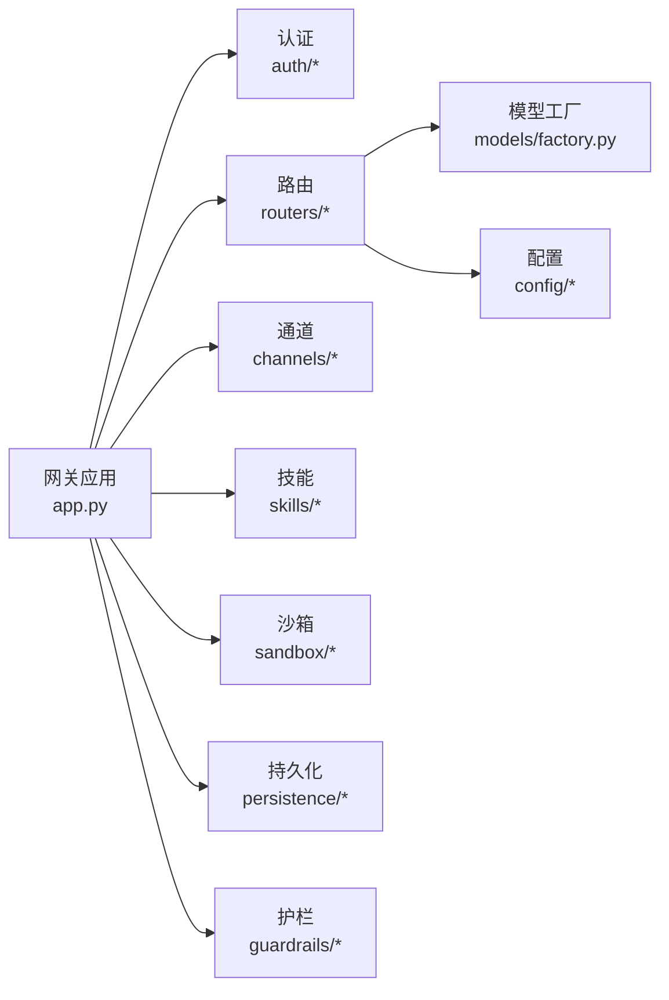

# 部署检查清单

<cite>
**本文档引用的文件**
- [scripts/deploy.sh](file://scripts/deploy.sh)
- [backend/Dockerfile](file://backend/Dockerfile)
- [frontend/Dockerfile](file://frontend/Dockerfile)
- [docker/docker-compose.yaml](file://docker/docker-compose.yaml)
- [docker/docker-compose-dev.yaml](file://docker/docker-compose-dev.yaml)
- [.agent/skills/smoke-test/scripts/check_docker.sh](file://.agent/skills/smoke-test/scripts/check_docker.sh)
- [.agent/skills/smoke-test/scripts/check_local_env.sh](file://.agent/skills/smoke-test/scripts/check_local_env.sh)
- [.agent/skills/smoke-test/scripts/deploy_docker.sh](file://.agent/skills/smoke-test/scripts/deploy_docker.sh)
- [.agent/skills/smoke-test/scripts/deploy_local.sh](file://.agent/skills/smoke-test/scripts/deploy_local.sh)
- [.agent/skills/smoke-test/scripts/health_check.sh](file://.agent/skills/smoke-test/scripts/health_check.sh)
- [.agent/skills/smoke-test/scripts/pull_code.sh](file://.agent/skills/smoke-test/scripts/pull_code.sh)
- [backend/docs/SETUP.md](file://backend/docs/SETUP.md)
- [backend/docs/CONFIGURATION.md](file://backend/docs/CONFIGURATION.md)
- [docs/operations/BUILD_AND_DEPLOY.md](file://docs/operations/BUILD_AND_DEPLOY.md)
- [docs/operations/DEPLOYMENT_KNOWN_ISSUES.md](file://docs/operations/DEPLOYMENT_KNOWN_ISSUES.md)
- [backend/pyproject.toml](file://backend/pyproject.toml)
- [frontend/package.json](file://frontend/package.json)
- [backend/Makefile](file://backend/Makefile)
- [frontend/Makefile](file://frontend/Makefile)
- [scripts/start-deerflow.sh](file://scripts/start-deerflow.sh)
- [scripts/serve.sh](file://scripts/serve.sh)
- [scripts/wait-for-port.sh](file://scripts/wait-for-port.sh)
- [scripts/cleanup-containers.sh](file://scripts/cleanup-containers.sh)
- [scripts/doctor.py](file://scripts/doctor.py)
- [scripts/check.py](file://scripts/check.py)
- [scripts/check.sh](file://scripts/check.sh)
- [scripts/config-upgrade.sh](file://scripts/config-upgrade.sh)
- [scripts/setup-sandbox.sh](file://scripts/setup-sandbox.sh)
- [scripts/build-release.sh](file://scripts/build-release.sh)
- [scripts/server-release.sh](file://scripts/server-release.sh)
- [scripts/tool-error-degradation-detection.sh](file://scripts/tool-error-degradation-detection.sh)
- [backend/app/gateway/app.py](file://backend/app/gateway/app.py)
- [backend/app/gateway/config.py](file://backend/app/gateway/config.py)
- [backend/app/gateway/services.py](file://backend/app/gateway/services.py)
- [backend/app/gateway/routers/__init__.py](file://backend/app/gateway/routers/__init__.py)
- [backend/app/gateway/auth/config.py](file://backend/app/gateway/auth/config.py)
- [backend/app/gateway/auth/jwt.py](file://backend/app/gateway/auth/jwt.py)
- [backend/app/gateway/auth/providers.py](file://backend/app/gateway/auth/providers.py)
- [backend/packages/harness/deerflow/config/app_config.py](file://backend/packages/harness/deerflow/config/app_config.py)
- [backend/packages/harness/deerflow/config/database_config.py](file://backend/packages/harness/deerflow/config/database_config.py)
- [backend/packages/harness/deerflow/config/model_config.py](file://backend/packages/harness/deerflow/config/model_config.py)
- [backend/packages/harness/deerflow/config/memory_config.py](file://backend/packages/harness/deerflow/config/memory_config.py)
- [backend/packages/harness/deerflow/config/skills_config.py](file://backend/packages/harness/deerflow/config/skills_config.py)
- [backend/packages/harness/deerflow/config/tool_config.py](file://backend/packages/harness/deerflow/config/tool_config.py)
- [backend/packages/harness/deerflow/config/tracing_config.py](file://backend/packages/harness/deerflow/config/tracing_config.py)
- [backend/packages/harness/deerflow/config/token_usage_config.py](file://backend/packages/harness/deerflow/config/token_usage_config.py)
- [backend/packages/harness/deerflow/runtime/checkpointer/__init__.py](file://backend/packages/harness/deerflow/runtime/checkpointer/__init__.py)
- [backend/packages/harness/deerflow/runtime/events/__init__.py](file://backend/packages/harness/deerflow/runtime/events/__init__.py)
- [backend/packages/harness/deerflow/runtime/runs/__init__.py](file://backend/packages/harness/deerflow/runtime/runs/__init__.py)
- [backend/packages/harness/deerflow/runtime/store/__init__.py](file://backend/packages/harness/deerflow/runtime/store/__init__.py)
- [backend/packages/harness/deerflow/runtime/stream_bridge/__init__.py](file://backend/packages/harness/deerflow/runtime/stream_bridge/__init__.py)
- [backend/packages/harness/deerflow/sandbox/sandbox.py](file://backend/packages/harness/deerflow/sandbox/sandbox.py)
- [backend/packages/harness/deerflow/sandbox/security.py](file://backend/packages/harness/deerflow/sandbox/security.py)
- [backend/packages/harness/deerflow/sandbox/middleware.py](file://backend/packages/harness/deerflow/sandbox/middleware.py)
- [backend/packages/harness/deerflow/guardrails/middleware.py](file://backend/packages/harness/deerflow/guardrails/middleware.py)
- [backend/packages/harness/deerflow/guardrails/provider.py](file://backend/packages/harness/deerflow/guardrails/provider.py)
- [backend/packages/harness/deerflow/models/factory.py](file://backend/packages/harness/deerflow/models/factory.py)
- [backend/packages/harness/deerflow/models/openai_codex_provider.py](file://backend/packages/harness/deerflow/models/openai_codex_provider.py)
- [backend/packages/harness/deerflow/models/vllm_provider.py](file://backend/packages/harness/deerflow/models/vllm_provider.py)
- [backend/packages/harness/deerflow/persistence/engine.py](file://backend/packages/harness/deerflow/persistence/engine.py)
- [backend/packages/harness/deerflow/persistence/migrations/versions/](file://backend/packages/harness/deerflow/persistence/migrations/versions/)
- [backend/packages/harness/deerflow/persistence/models/](file://backend/packages/harness/deerflow/persistence/models/)
- [backend/packages/harness/deerflow/persistence/run/](file://backend/packages/harness/deerflow/persistence/run/)
- [backend/packages/harness/deerflow/persistence/thread_meta/](file://backend/packages/harness/deerflow/persistence/thread_meta/)
- [backend/packages/harness/deerflow/persistence/user/](file://backend/packages/harness/deerflow/persistence/user/)
- [backend/packages/harness/deerflow/persistence/feedback/](file://backend/packages/harness/deerflow/persistence/feedback/)
- [backend/packages/harness/deerflow/channels/manager.py](file://backend/packages/harness/deerflow/channels/manager.py)
- [backend/packages/harness/deerflow/channels/service.py](file://backend/packages/harness/deerflow/channels/service.py)
- [backend/packages/harness/deerflow/channels/message_bus.py](file://backend/packages/harness/deerflow/channels/message_bus.py)
- [backend/packages/harness/deerflow/channels/store.py](file://backend/packages/harness/deerflow/channels/store.py)
- [backend/packages/harness/deerflow/channels/wechat.py](file://backend/packages/harness/deerflow/channels/wechat.py)
- [backend/packages/harness/deerflow/channels/dingtalk.py](file://backend/packages/harness/deerflow/channels/dingtalk.py)
- [backend/packages/harness/deerflow/channels/discord.py](file://backend/packages/harness/deerflow/channels/discord.py)
- [backend/packages/harness/deerflow/channels/telegram.py](file://backend/packages/harness/deerflow/channels/telegram.py)
- [backend/packages/harness/deerflow/channels/slack.py](file://backend/packages/harness/deerflow/channels/slack.py)
- [backend/packages/harness/deerflow/channels/feishu.py](file://backend/packages/harness/deerflow/channels/feishu.py)
- [backend/packages/harness/deerflow/channels/wecom.py](file://backend/packages/harness/deerflow/channels/wecom.py)
- [backend/packages/harness/deerflow/skills/installer.py](file://backend/packages/harness/deerflow/skills/installer.py)
- [backend/packages/harness/deerflow/skills/parser.py](file://backend/packages/harness/deerflow/skills/parser.py)
- [backend/packages/harness/deerflow/skills/security_scanner.py](file://backend/packages/harness/deerflow/skills/security_scanner.py)
- [backend/packages/harness/deerflow/skills/tool_policy.py](file://backend/packages/harness/deerflow/skills/tool_policy.py)
- [backend/packages/harness/deerflow/subagents/](file://backend/packages/harness/deerflow/subagents/)
- [backend/packages/harness/deerflow/tools/](file://backend/packages/harness/deerflow/tools/)
- [backend/packages/harness/deerflow/tracing/](file://backend/packages/harness/deerflow/tracing/)
- [backend/packages/harness/deerflow/uploads/](file://backend/packages/harness/deerflow/uploads/)
- [backend/packages/harness/deerflow/utils/](file://backend/packages/harness/deerflow/utils/)
- [backend/packages/harness/deerflow/client.py](file://backend/packages/harness/deerflow/client.py)
- [backend/deerflow_entry.py](file://backend/deerflow_entry.py)
- [backend/langgraph.json](file://backend/langgraph.json)
- [config.example.yaml](file://config.example.yaml)
- [extensions_config.example.json](file://extensions_config.example.json)
- [backend/.langgraph_api/](file://backend/.langgraph_api/)
- [backend/.ads-mcp/](file://backend/.ads-mcp/)
- [backend/.pytest_cache/](file://backend/.pytest_cache/)
- [backend/.ruff_cache/](file://backend/.ruff_cache/)
- [frontend/.next/](file://frontend/.next/)
- [frontend/node_modules/](file://frontend/node_modules/)
- [temp/](file://temp/)
- [.pytest_cache/](file://.pytest_cache/)
</cite>

## 目录
1. [简介](#简介)
2. [项目结构](#项目结构)
3. [核心组件](#核心组件)
4. [架构总览](#架构总览)
5. [详细组件分析](#详细组件分析)
6. [依赖关系分析](#依赖关系分析)
7. [性能考虑](#性能考虑)
8. [故障排除指南](#故障排除指南)
9. [结论](#结论)
10. [附录](#附录)

## 简介
本部署检查清单面向 DeerFlow 的生产与开发环境部署，覆盖部署前的环境准备、配置验证、依赖检查；部署后的功能测试、性能验证与安全检查；自动化部署脚本使用、CI/CD 集成建议与回滚策略；以及常见部署问题的诊断方法、性能基准测试与监控指标设置。目标是实现部署过程的标准化与可重复性。

## 项目结构
DeerFlow 采用前后端分离与多模块后端架构，包含：
- 后端服务：基于 Python 的 FastAPI 应用，提供网关、认证、通道、技能、沙箱、持久化等能力
- 前端应用：基于 Next.js 的 Web 控制台与聊天界面
- 容器编排：Dockerfile 与 docker-compose 文件用于本地与生产容器化部署
- 自动化脚本：部署、健康检查、环境检测、构建与发布脚本
- 扩展与插件：通过扩展机制集成第三方能力（如 MCP、认证扩展）

**图表来源**
- [backend/Dockerfile:1-200](file://backend/Dockerfile#L1-L200)
- [frontend/Dockerfile:1-200](file://frontend/Dockerfile#L1-L200)
- [docker/docker-compose.yaml:1-200](file://docker/docker-compose.yaml#L1-L200)
- [docker/docker-compose-dev.yaml:1-200](file://docker/docker-compose-dev.yaml#L1-L200)

**章节来源**
- [backend/Dockerfile:1-200](file://backend/Dockerfile#L1-L200)
- [frontend/Dockerfile:1-200](file://frontend/Dockerfile#L1-L200)
- [docker/docker-compose.yaml:1-200](file://docker/docker-compose.yaml#L1-L200)
- [docker/docker-compose-dev.yaml:1-200](file://docker/docker-compose-dev.yaml#L1-L200)

## 核心组件
- 网关与路由：后端入口，负责请求分发、中间件处理与业务路由
- 认证与授权：支持 JWT、本地凭据与外部提供方，内置 CSRF 中间件
- 通道系统：支持微信、钉钉、飞书、Slack、Discord、Telegram 等消息通道
- 技能系统：技能安装、解析、权限控制与安全扫描
- 沙箱与安全：本地/远程沙箱执行、文件操作锁、安全策略与审计中间件
- 持久化：SQLite/PostgreSQL 支持、迁移管理、运行记录与线程元数据存储
- 运行时与检查点：运行事件、流桥接、检查点与状态恢复
- 追踪与计费：令牌用量统计、链路追踪配置
- 扩展与 MCP：MCP 客户端、会话池、缓存与 OAuth

**章节来源**
- [backend/app/gateway/app.py:1-200](file://backend/app/gateway/app.py#L1-L200)
- [backend/app/gateway/routers/__init__.py:1-100](file://backend/app/gateway/routers/__init__.py#L1-L100)
- [backend/app/gateway/auth/config.py:1-120](file://backend/app/gateway/auth/config.py#L1-L120)
- [backend/app/gateway/auth/jwt.py:1-120](file://backend/app/gateway/auth/jwt.py#L1-L120)
- [backend/app/gateway/auth/providers.py:1-120](file://backend/app/gateway/auth/providers.py#L1-L120)
- [backend/packages/harness/deerflow/channels/manager.py:1-120](file://backend/packages/harness/deerflow/channels/manager.py#L1-L120)
- [backend/packages/harness/deerflow/channels/service.py:1-120](file://backend/packages/harness/deerflow/channels/service.py#L1-L120)
- [backend/packages/harness/deerflow/skills/installer.py:1-120](file://backend/packages/harness/deerflow/skills/installer.py#L1-L120)
- [backend/packages/harness/deerflow/skills/parser.py:1-120](file://backend/packages/harness/deerflow/skills/parser.py#L1-L120)
- [backend/packages/harness/deerflow/skills/security_scanner.py:1-120](file://backend/packages/harness/deerflow/skills/security_scanner.py#L1-L120)
- [backend/packages/harness/deerflow/sandbox/sandbox.py:1-120](file://backend/packages/harness/deerflow/sandbox/sandbox.py#L1-L120)
- [backend/packages/harness/deerflow/sandbox/security.py:1-120](file://backend/packages/harness/deerflow/sandbox/security.py#L1-L120)
- [backend/packages/harness/deerflow/persistence/engine.py:1-120](file://backend/packages/harness/deerflow/persistence/engine.py#L1-L120)
- [backend/packages/harness/deerflow/runtime/checkpointer/__init__.py:1-120](file://backend/packages/harness/deerflow/runtime/checkpointer/__init__.py#L1-L120)
- [backend/packages/harness/deerflow/runtime/events/__init__.py:1-120](file://backend/packages/harness/deerflow/runtime/events/__init__.py#L1-L120)
- [backend/packages/harness/deerflow/runtime/runs/__init__.py:1-120](file://backend/packages/harness/deerflow/runtime/runs/__init__.py#L1-L120)
- [backend/packages/harness/deerflow/runtime/store/__init__.py:1-120](file://backend/packages/harness/deerflow/runtime/store/__init__.py#L1-L120)
- [backend/packages/harness/deerflow/runtime/stream_bridge/__init__.py:1-120](file://backend/packages/harness/deerflow/runtime/stream_bridge/__init__.py#L1-L120)
- [backend/packages/harness/deerflow/tracing/:1-120](file://backend/packages/harness/deerflow/tracing/#L1-L120)
- [backend/packages/harness/deerflow/config/token_usage_config.py:1-120](file://backend/packages/harness/deerflow/config/token_usage_config.py#L1-L120)
- [backend/packages/harness/deerflow/config/tracing_config.py:1-120](file://backend/packages/harness/deerflow/config/tracing_config.py#L1-L120)

## 架构总览
下图展示从浏览器到后端服务、数据库与外部通道的典型调用链，以及容器化部署下的网络拓扑。

**图表来源**
- [backend/app/gateway/app.py:1-200](file://backend/app/gateway/app.py#L1-L200)
- [backend/app/gateway/auth_middleware.py:1-120](file://backend/app/gateway/auth_middleware.py#L1-L120)
- [backend/app/gateway/csrf_middleware.py:1-120](file://backend/app/gateway/csrf_middleware.py#L1-L120)
- [backend/app/gateway/routers/__init__.py:1-100](file://backend/app/gateway/routers/__init__.py#L1-L100)
- [backend/packages/harness/deerflow/channels/manager.py:1-120](file://backend/packages/harness/deerflow/channels/manager.py#L1-L120)
- [backend/packages/harness/deerflow/persistence/engine.py:1-120](file://backend/packages/harness/deerflow/persistence/engine.py#L1-L120)

## 详细组件分析

### 部署前准备与环境检查
- 系统要求与依赖
  - Python 版本与包管理：参考后端 pyproject.toml 与 Makefile
  - Node.js 版本与包管理：参考前端 package.json 与 Makefile
  - 数据库：SQLite（默认）或 PostgreSQL（生产）
  - 容器运行时：Docker 与 docker-compose
- 环境变量与配置
  - 应用配置：app_config、database_config、model_config、memory_config、skills_config、tool_config、tracing_config、token_usage_config
  - 示例配置：config.example.yaml、extensions_config.example.json
  - 认证配置：jwt、providers、credential_file
- 资源与权限
  - 端口占用：后端端口、前端端口、数据库端口
  - 文件权限：日志目录、临时目录、上传目录
  - 外部服务：MCP、通道 API 密钥与回调地址

**章节来源**
- [backend/pyproject.toml:1-200](file://backend/pyproject.toml#L1-L200)
- [frontend/package.json:1-200](file://frontend/package.json#L1-L200)
- [backend/Makefile:1-200](file://backend/Makefile#L1-L200)
- [frontend/Makefile:1-200](file://frontend/Makefile#L1-L200)
- [backend/packages/harness/deerflow/config/app_config.py:1-120](file://backend/packages/harness/deerflow/config/app_config.py#L1-L120)
- [backend/packages/harness/deerflow/config/database_config.py:1-120](file://backend/packages/harness/deerflow/config/database_config.py#L1-L120)
- [backend/packages/harness/deerflow/config/model_config.py:1-120](file://backend/packages/harness/deerflow/config/model_config.py#L1-L120)
- [backend/packages/harness/deerflow/config/memory_config.py:1-120](file://backend/packages/harness/deerflow/config/memory_config.py#L1-L120)
- [backend/packages/harness/deerflow/config/skills_config.py:1-120](file://backend/packages/harness/deerflow/config/skills_config.py#L1-L120)
- [backend/packages/harness/deerflow/config/tool_config.py:1-120](file://backend/packages/harness/deerflow/config/tool_config.py#L1-L120)
- [backend/packages/harness/deerflow/config/tracing_config.py:1-120](file://backend/packages/harness/deerflow/config/tracing_config.py#L1-L120)
- [backend/packages/harness/deerflow/config/token_usage_config.py:1-120](file://backend/packages/harness/deerflow/config/token_usage_config.py#L1-L120)
- [config.example.yaml:1-200](file://config.example.yaml#L1-L200)
- [extensions_config.example.json:1-200](file://extensions_config.example.json#L1-L200)
- [backend/app/gateway/auth/config.py:1-120](file://backend/app/gateway/auth/config.py#L1-L120)
- [backend/app/gateway/auth/jwt.py:1-120](file://backend/app/gateway/auth/jwt.py#L1-L120)
- [backend/app/gateway/auth/providers.py:1-120](file://backend/app/gateway/auth/providers.py#L1-L120)

### 部署脚本与自动化
- 自动化部署脚本
  - scripts/deploy.sh：统一部署入口，支持参数化配置与环境切换
  - .agent/skills/smoke-test/scripts/*：包含本地与容器部署、拉取代码、健康检查等脚本
- 启动与服务管理
  - scripts/start-deerflow.sh：启动后端与前端服务
  - scripts/serve.sh：后端服务启动脚本
  - scripts/wait-for-port.sh：等待端口可用
  - scripts/cleanup-containers.sh：清理容器资源
- 构建与发布
  - scripts/build-release.sh：构建发布产物
  - scripts/server-release.sh：服务器端发布脚本
- 环境自检
  - scripts/doctor.py：系统健康检查
  - scripts/check.py、scripts/check.sh：快速检查
  - scripts/config-upgrade.sh：配置升级脚本
  - scripts/setup-sandbox.sh：沙箱初始化
  - scripts/tool-error-degradation-detection.sh：工具错误降级检测

**图表来源**
- [scripts/deploy.sh:1-200](file://scripts/deploy.sh#L1-L200)
- [.agent/skills/smoke-test/scripts/pull_code.sh:1-120](file://.agent/skills/smoke-test/scripts/pull_code.sh#L1-L120)
- [.agent/skills/smoke-test/scripts/check_local_env.sh:1-120](file://.agent/skills/smoke-test/scripts/check_local_env.sh#L1-L120)
- [.agent/skills/smoke-test/scripts/check_docker.sh:1-120](file://.agent/skills/smoke-test/scripts/check_docker.sh#L1-L120)
- [.agent/skills/smoke-test/scripts/deploy_docker.sh:1-120](file://.agent/skills/smoke-test/scripts/deploy_docker.sh#L1-L120)
- [.agent/skills/smoke-test/scripts/deploy_local.sh:1-120](file://.agent/skills/smoke-test/scripts/deploy_local.sh#L1-L120)
- [.agent/skills/smoke-test/scripts/health_check.sh:1-120](file://.agent/skills/smoke-test/scripts/health_check.sh#L1-L120)
- [scripts/wait-for-port.sh:1-120](file://scripts/wait-for-port.sh#L1-L120)
- [scripts/build-release.sh:1-120](file://scripts/build-release.sh#L1-L120)
- [scripts/server-release.sh:1-120](file://scripts/server-release.sh#L1-L120)
- [scripts/start-deerflow.sh:1-120](file://scripts/start-deerflow.sh#L1-L120)
- [scripts/serve.sh:1-120](file://scripts/serve.sh#L1-L120)

**章节来源**
- [scripts/deploy.sh:1-200](file://scripts/deploy.sh#L1-L200)
- [.agent/skills/smoke-test/scripts/pull_code.sh:1-120](file://.agent/skills/smoke-test/scripts/pull_code.sh#L1-L120)
- [.agent/skills/smoke-test/scripts/check_local_env.sh:1-120](file://.agent/skills/smoke-test/scripts/check_local_env.sh#L1-L120)
- [.agent/skills/smoke-test/scripts/check_docker.sh:1-120](file://.agent/skills/smoke-test/scripts/check_docker.sh#L1-L120)
- [.agent/skills/smoke-test/scripts/deploy_docker.sh:1-120](file://.agent/skills/smoke-test/scripts/deploy_docker.sh#L1-L120)
- [.agent/skills/smoke-test/scripts/deploy_local.sh:1-120](file://.agent/skills/smoke-test/scripts/deploy_local.sh#L1-L120)
- [.agent/skills/smoke-test/scripts/health_check.sh:1-120](file://.agent/skills/smoke-test/scripts/health_check.sh#L1-L120)
- [scripts/wait-for-port.sh:1-120](file://scripts/wait-for-port.sh#L1-L120)
- [scripts/build-release.sh:1-120](file://scripts/build-release.sh#L1-L120)
- [scripts/server-release.sh:1-120](file://scripts/server-release.sh#L1-L120)
- [scripts/start-deerflow.sh:1-120](file://scripts/start-deerflow.sh#L1-L120)
- [scripts/serve.sh:1-120](file://scripts/serve.sh#L1-L120)

### CI/CD 集成建议
- 触发条件：主分支推送、标签创建、Pull Request 合并
- 步骤建议：
  - 代码检出与缓存
  - 环境准备：Python/Node.js 版本、依赖安装
  - 静态检查：lint、格式化、类型检查
  - 单元测试与端到端测试
  - 构建镜像：后端、前端、Nginx
  - 推送镜像至仓库
  - 部署到目标环境：dev/stage/prod
  - 健康检查与灰度发布
- 回滚策略：镜像版本回滚、数据库迁移回退、蓝绿/滚动回滚

[本节为通用流程建议，不直接分析具体文件，故无“章节来源”]

### 部署后验证清单
- 功能测试
  - 登录与鉴权：JWT 生成、刷新、CSRF 校验
  - 通道连通性：微信、钉钉、飞书、Slack、Discord、Telegram
  - 技能执行：技能安装、解析、权限校验、安全扫描
  - 沙箱执行：本地/远程沙箱、文件操作、超时与隔离
  - 持久化：运行记录、线程元数据、反馈与上传
- 性能验证
  - 响应时间：P50/P90/P99
  - 并发能力：最大并发连接数、队列长度
  - 资源占用：CPU、内存、磁盘 IO
- 安全检查
  - 认证与授权：密码强度、会话管理、权限最小化
  - 通道安全：回调签名、消息过滤、速率限制
  - 沙箱安全：文件白名单、网络隔离、资源配额
  - 数据保护：敏感信息脱敏、传输加密、备份策略

**章节来源**
- [backend/app/gateway/auth/jwt.py:1-120](file://backend/app/gateway/auth/jwt.py#L1-L120)
- [backend/app/gateway/auth/providers.py:1-120](file://backend/app/gateway/auth/providers.py#L1-L120)
- [backend/app/gateway/csrf_middleware.py:1-120](file://backend/app/gateway/csrf_middleware.py#L1-L120)
- [backend/packages/harness/deerflow/channels/wechat.py:1-120](file://backend/packages/harness/deerflow/channels/wechat.py#L1-L120)
- [backend/packages/harness/deerflow/channels/dingtalk.py:1-120](file://backend/packages/harness/deerflow/channels/dingtalk.py#L1-L120)
- [backend/packages/harness/deerflow/channels/feishu.py:1-120](file://backend/packages/harness/deerflow/channels/feishu.py#L1-L120)
- [backend/packages/harness/deerflow/channels/slack.py:1-120](file://backend/packages/harness/deerflow/channels/slack.py#L1-L120)
- [backend/packages/harness/deerflow/channels/discord.py:1-120](file://backend/packages/harness/deerflow/channels/discord.py#L1-L120)
- [backend/packages/harness/deerflow/channels/telegram.py:1-120](file://backend/packages/harness/deerflow/channels/telegram.py#L1-L120)
- [backend/packages/harness/deerflow/skills/security_scanner.py:1-120](file://backend/packages/harness/deerflow/skills/security_scanner.py#L1-L120)
- [backend/packages/harness/deerflow/sandbox/security.py:1-120](file://backend/packages/harness/deerflow/sandbox/security.py#L1-L120)
- [backend/packages/harness/deerflow/persistence/engine.py:1-120](file://backend/packages/harness/deerflow/persistence/engine.py#L1-L120)

### 回滚策略
- 快速回滚：镜像版本回退、配置回滚
- 渐进式回滚：灰度流量、逐步切回
- 数据回滚：数据库迁移回退、快照恢复
- 通知与演练：变更公告、演练计划

[本节为通用策略建议，不直接分析具体文件，故无“章节来源”]

## 依赖关系分析
- 组件耦合
  - 网关对认证、通道、技能、沙箱、持久化的依赖清晰
  - 配置模块集中管理，降低跨模块耦合
- 外部依赖
  - 数据库驱动、MCP 客户端、通道 SDK
  - Nginx 反向代理、Docker 容器编排
- 循环依赖
  - 通过模块拆分与延迟导入避免循环依赖

**图表来源**
- [backend/app/gateway/app.py:1-200](file://backend/app/gateway/app.py#L1-L200)
- [backend/app/gateway/routers/__init__.py:1-100](file://backend/app/gateway/routers/__init__.py#L1-L100)
- [backend/packages/harness/deerflow/models/factory.py:1-120](file://backend/packages/harness/deerflow/models/factory.py#L1-L120)
- [backend/packages/harness/deerflow/config/app_config.py:1-120](file://backend/packages/harness/deerflow/config/app_config.py#L1-L120)

**章节来源**
- [backend/app/gateway/app.py:1-200](file://backend/app/gateway/app.py#L1-L200)
- [backend/app/gateway/routers/__init__.py:1-100](file://backend/app/gateway/routers/__init__.py#L1-L100)
- [backend/packages/harness/deerflow/models/factory.py:1-120](file://backend/packages/harness/deerflow/models/factory.py#L1-L120)
- [backend/packages/harness/deerflow/config/app_config.py:1-120](file://backend/packages/harness/deerflow/config/app_config.py#L1-L120)

## 性能考虑
- 响应时间优化
  - 使用流式响应与 SSE
  - 缓存热点数据与检查点
  - 异步任务与队列
- 资源利用
  - 连接池与超时配置
  - 内存与磁盘缓存策略
  - 沙箱资源配额与隔离
- 监控指标
  - QPS、P95/P99 延迟、错误率
  - CPU/内存/IO 使用率
  - 数据库查询耗时与连接数
  - 通道回调耗时与失败率

[本节提供通用指导，不直接分析具体文件，故无“章节来源”]

## 故障排除指南
- 常见问题
  - 端口冲突：确认端口占用并修改配置
  - 权限不足：检查文件与目录权限
  - 数据库连接失败：核对连接字符串与网络
  - 通道回调失败：检查回调签名与网络可达性
  - 沙箱执行异常：检查沙箱配置与资源限制
- 诊断工具
  - scripts/doctor.py：系统健康检查
  - scripts/check.py、scripts/check.sh：快速检查
  - scripts/config-upgrade.sh：配置升级
  - scripts/tool-error-degradation-detection.sh：工具错误降级检测
- 日志与追踪
  - 后端日志级别与输出位置
  - 前端日志与错误上报
  - 链路追踪与令牌用量统计

**章节来源**
- [scripts/doctor.py:1-200](file://scripts/doctor.py#L1-L200)
- [scripts/check.py:1-200](file://scripts/check.py#L1-L200)
- [scripts/check.sh:1-200](file://scripts/check.sh#L1-L200)
- [scripts/config-upgrade.sh:1-200](file://scripts/config-upgrade.sh#L1-L200)
- [scripts/tool-error-degradation-detection.sh:1-200](file://scripts/tool-error-degradation-detection.sh#L1-L200)

## 结论
通过标准化的部署检查清单与自动化脚本，结合完善的配置管理、容器化部署与健康检查机制，DeerFlow 可实现稳定、可重复且可回滚的交付流程。建议在 CI/CD 中固化上述步骤，并持续完善监控与告警体系，以保障生产环境的高可用与安全性。

## 附录
- 配置示例与说明：参考 config.example.yaml、extensions_config.example.json
- 文档与指南：backend/docs/SETUP.md、docs/operations/BUILD_AND_DEPLOY.md、docs/operations/DEPLOYMENT_KNOWN_ISSUES.md
- 入口与运行：backend/deerflow_entry.py、backend/langgraph.json

**章节来源**
- [config.example.yaml:1-200](file://config.example.yaml#L1-L200)
- [extensions_config.example.json:1-200](file://extensions_config.example.json#L1-L200)
- [backend/docs/SETUP.md:1-200](file://backend/docs/SETUP.md#L1-L200)
- [docs/operations/BUILD_AND_DEPLOY.md:1-200](file://docs/operations/BUILD_AND_DEPLOY.md#L1-L200)
- [docs/operations/DEPLOYMENT_KNOWN_ISSUES.md:1-200](file://docs/operations/DEPLOYMENT_KNOWN_ISSUES.md#L1-L200)
- [backend/deerflow_entry.py:1-200](file://backend/deerflow_entry.py#L1-L200)
- [backend/langgraph.json:1-200](file://backend/langgraph.json#L1-L200)