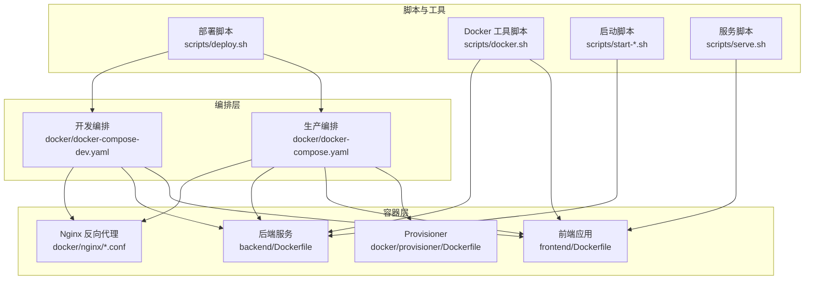
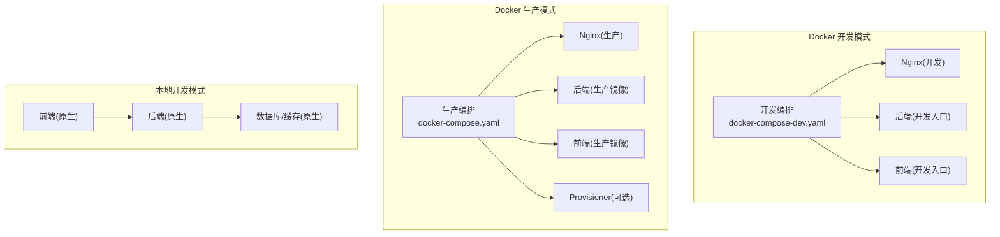
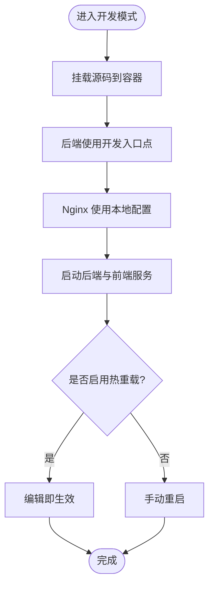
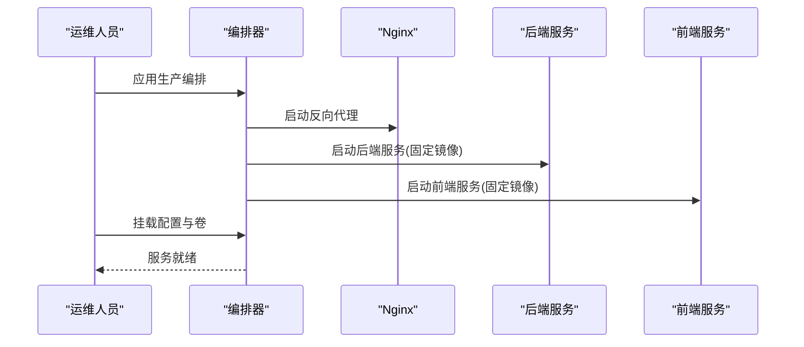
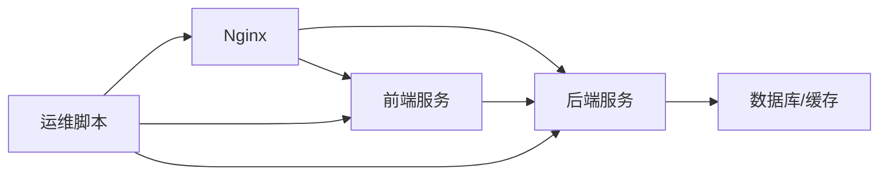
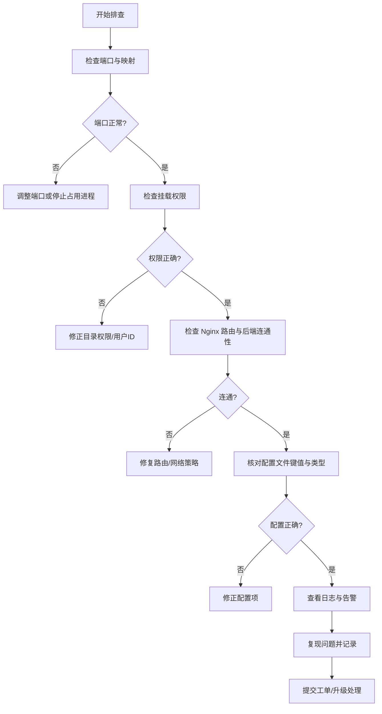

# 部署选项

<cite>
**本文引用的文件**
- [docker-compose-dev.yaml](file://docker/docker-compose-dev.yaml)
- [docker-compose.yaml](file://docker/docker-compose.yaml)
- [Dockerfile（后端）](file://backend/Dockerfile)
- [Dockerfile（前端）](file://frontend/Dockerfile)
- [Dockerfile（Provisioner）](file://docker/provisioner/Dockerfile)
- [dev-entrypoint.sh](file://docker/dev-entrypoint.sh)
- [nginx.conf](file://docker/nginx/nginx.conf)
- [nginx.local.conf](file://docker/nginx/nginx.local.conf)
- [server.conf](file://docker/nginx/server.conf)
- [deploy.sh](file://scripts/deploy.sh)
- [docker.sh](file://scripts/docker.sh)
- [start-deerflow.sh](file://scripts/start-deerflow.sh)
- [start-daemon.sh](file://scripts/start-daemon.sh)
- [serve.sh](file://scripts/serve.sh)
- [config.example.yaml](file://config.example.yaml)
- [extensions_config.example.json](file://extensions_config.example.json)
- [DEPLOYMENT_KNOWN_ISSUES.md](file://docs/operations/DEPLOYMENT_KNOWN_ISSUES.md)
- [BUILD_AND_DEPLOY.md](file://docs/operations/BUILD_AND_DEPLOY.md)
- [USE_GUIDE.md](file://docs/operations/USE_GUIDE.md)
- [.agent/skills/smoke-test/scripts/check_docker.sh](file://.agent/skills/smoke-test/scripts/check_docker.sh)
- [.agent/skills/smoke-test/scripts/check_local_env.sh](file://.agent/skills/smoke-test/scripts/check_local_env.sh)
- [.agent/skills/smoke-test/scripts/deploy_docker.sh](file://.agent/skills/smoke-test/scripts/deploy_docker.sh)
- [.agent/skills/smoke-test/scripts/deploy_local.sh](file://.agent/skills/smoke-test/scripts/deploy_local.sh)
- [.agent/skills/smoke-test/scripts/health_check.sh](file://.agent/skills/smoke-test/scripts/health_check.sh)
- [.agent/skills/smoke-test/scripts/pull_code.sh](file://.agent/skills/smoke-test/scripts/pull_code.sh)
- [.agent/skills/smoke-test/templates/report.docker.template.md](file://.agent/skills/smoke-test/templates/report.docker.template.md)
- [.agent/skills/smoke-test/templates/report.local.template.md](file://.agent/skills/smoke-test/templates/report.local.template.md)
- [SKILL.md（Smoke Test 技能）](file://.agent/skills/smoke-test/SKILL.md)
</cite>

## 目录
1. [简介](#简介)
2. [项目结构](#项目结构)
3. [核心组件](#核心组件)
4. [架构总览](#架构总览)
5. [详细组件分析](#详细组件分析)
6. [依赖关系分析](#依赖关系分析)
7. [性能考量](#性能考量)
8. [故障排除指南](#故障排除指南)
9. [结论](#结论)
10. [附录](#附录)

## 简介
本指南面向不同规模与需求的用户，系统性介绍 DeerFlow 2.0 的三种部署模式与运维实践，包括：
- Docker 开发模式：强调热重载与源码挂载，适合快速迭代与本地调试
- Docker 生产模式：强调镜像构建与配置挂载，适合稳定上线与可重复交付
- 本地开发模式：强调原生环境与调试便利，适合深入开发与资源占用控制

同时覆盖 Kubernetes 部署要点、云平台部署建议、混合部署架构、部署清单、配置模板、监控设置与故障排除。

## 项目结构
DeerFlow 由后端服务、前端应用、容器编排与脚本工具组成。部署相关的关键位置如下：
- 后端镜像：基于后端目录的 Dockerfile 构建
- 前端镜像：基于前端目录的 Dockerfile 构建
- Nginx 反向代理：提供静态资源与路由转发
- Compose 编排：定义开发与生产两种编排方案
- 运维脚本：封装部署、启动、健康检查等流程

图表来源
- [docker-compose-dev.yaml](file://docker/docker-compose-dev.yaml)
- [docker-compose.yaml](file://docker/docker-compose.yaml)
- [Dockerfile（后端）](file://backend/Dockerfile)
- [Dockerfile（前端）](file://frontend/Dockerfile)
- [Dockerfile（Provisioner）](file://docker/provisioner/Dockerfile)
- [nginx.conf](file://docker/nginx/nginx.conf)
- [deploy.sh](file://scripts/deploy.sh)
- [docker.sh](file://scripts/docker.sh)
- [start-deerflow.sh](file://scripts/start-deerflow.sh)
- [serve.sh](file://scripts/serve.sh)

章节来源
- [docker-compose-dev.yaml](file://docker/docker-compose-dev.yaml)
- [docker-compose.yaml](file://docker/docker-compose.yaml)
- [Dockerfile（后端）](file://backend/Dockerfile)
- [Dockerfile（前端）](file://frontend/Dockerfile)
- [Dockerfile（Provisioner）](file://docker/provisioner/Dockerfile)
- [nginx.conf](file://docker/nginx/nginx.conf)

## 核心组件
- 反向代理（Nginx）
  - 提供静态资源服务与后端 API 转发
  - 支持本地与容器内配置差异
- 后端服务（FastAPI/Gunicorn/uvicorn）
  - 通过 Dockerfile 构建镜像
  - 支持开发入口点与生产运行时
- 前端应用（Next.js）
  - 通过 Dockerfile 构建镜像
  - 支持静态产物与服务端渲染
- Provisioner（可选）
  - 用于集群资源准备或初始化任务
- 编排（Compose）
  - 开发模式：挂载源码、启用热重载、简化联调
  - 生产模式：固定镜像、挂载配置、分离网络与存储
- 运维脚本
  - 封装构建、部署、启动、健康检查流程

章节来源
- [nginx.conf](file://docker/nginx/nginx.conf)
- [nginx.local.conf](file://docker/nginx/nginx.local.conf)
- [server.conf](file://docker/nginx/server.conf)
- [Dockerfile（后端）](file://backend/Dockerfile)
- [Dockerfile（前端）](file://frontend/Dockerfile)
- [Dockerfile（Provisioner）](file://docker/provisioner/Dockerfile)
- [docker-compose-dev.yaml](file://docker/docker-compose-dev.yaml)
- [docker-compose.yaml](file://docker/docker-compose.yaml)
- [deploy.sh](file://scripts/deploy.sh)
- [docker.sh](file://scripts/docker.sh)
- [start-deerflow.sh](file://scripts/start-deerflow.sh)
- [serve.sh](file://scripts/serve.sh)

## 架构总览
下图展示三种部署模式的总体架构与交互关系：

图表来源
- [docker-compose-dev.yaml](file://docker/docker-compose-dev.yaml)
- [docker-compose.yaml](file://docker/docker-compose.yaml)
- [Dockerfile（后端）](file://backend/Dockerfile)
- [Dockerfile（前端）](file://frontend/Dockerfile)
- [Dockerfile（Provisioner）](file://docker/provisioner/Dockerfile)
- [nginx.conf](file://docker/nginx/nginx.conf)

## 详细组件分析

### Docker 开发模式
- 适用场景
  - 快速迭代、频繁修改代码、需要热重载
  - 本地联调、减少镜像构建时间
- 关键特性
  - 源码挂载：后端与前端均挂载宿主机源码
  - 开发入口点：后端使用开发入口脚本
  - Nginx 本地配置：便于本地访问与调试
- 性能与资源
  - 启动快、内存占用低；但 I/O 受限于宿主机文件系统
- 运维考虑
  - 仅适用于开发环境，不建议用于生产
  - 注意挂载权限与路径一致性

图表来源
- [docker-compose-dev.yaml](file://docker/docker-compose-dev.yaml)
- [dev-entrypoint.sh](file://docker/dev-entrypoint.sh)
- [nginx.local.conf](file://docker/nginx/nginx.local.conf)

章节来源
- [docker-compose-dev.yaml](file://docker/docker-compose-dev.yaml)
- [dev-entrypoint.sh](file://docker/dev-entrypoint.sh)
- [nginx.local.conf](file://docker/nginx/nginx.local.conf)

### Docker 生产模式
- 适用场景
  - 上线部署、版本固化、可重复交付
  - 需要稳定运行与统一配置管理
- 关键特性
  - 固定镜像：后端与前端镜像在编排中固定
  - 配置挂载：应用配置与扩展配置挂载至容器
  - 分离网络与存储：数据库、缓存等外部化
  - 可选 Provisioner：用于初始化或资源准备
- 性能与资源
  - 启动时间较长（需拉取/构建镜像），运行稳定
- 运维考虑
  - 版本化镜像与配置，便于回滚与审计
  - 建议配合负载均衡与自动扩缩容

图表来源
- [docker-compose.yaml](file://docker/docker-compose.yaml)
- [Dockerfile（后端）](file://backend/Dockerfile)
- [Dockerfile（前端）](file://frontend/Dockerfile)
- [nginx.conf](file://docker/nginx/nginx.conf)

章节来源
- [docker-compose.yaml](file://docker/docker-compose.yaml)
- [Dockerfile（后端）](file://backend/Dockerfile)
- [Dockerfile（前端）](file://frontend/Dockerfile)
- [nginx.conf](file://docker/nginx/nginx.conf)

### 本地开发模式
- 适用场景
  - 原生开发体验、便于调试与性能分析
  - 对资源占用敏感、无需容器抽象
- 关键特性
  - 后端与前端分别在原生环境中启动
  - 数据库与缓存通常以原生或轻量级方式运行
- 性能与资源
  - 启动快、资源占用可控；跨平台兼容性需注意
- 运维考虑
  - 需自行管理依赖与环境变量
  - 建议使用虚拟环境隔离

章节来源
- [start-deerflow.sh](file://scripts/start-deerflow.sh)
- [serve.sh](file://scripts/serve.sh)

### Kubernetes 部署指南
- 基本思路
  - 使用 Deployment 管理后端与前端副本
  - 使用 Service 暴露服务，结合 Ingress/Nginx Controller 实现反向代理
  - 使用 ConfigMap/Secret 管理配置与密钥
  - 使用 PersistentVolume/StatefulSet 管理数据库与缓存
- 关键对象
  - 后端 Deployment + Service
  - 前端 Deployment + Service
  - Nginx Ingress + 路由规则
  - ConfigMap/Secret（应用配置、扩展配置）
  - PVC/StatefulSet（数据库、缓存）
- 推荐实践
  - 为后端与前端分别创建独立命名空间或标签
  - 使用 HorizontalPodAutoscaler 根据 CPU/自定义指标扩缩容
  - 使用 PodDisruptionBudget 保障可用性
  - 使用滚动更新策略与健康检查探针

[本节为概念性指导，未直接分析具体文件，故无“章节来源”]

### 云平台部署方案
- 公有云容器服务（如 EKS/AKS/GKE）
  - 基于托管集群部署，结合托管负载均衡与存储
  - 使用托管数据库/缓存服务降低运维复杂度
- 边缘计算/混合云
  - 在边缘节点部署轻量后端，中心节点部署数据库与缓存
  - 使用服务网格实现跨节点通信与安全策略
- 备份与灾备
  - 定期备份数据库与配置
  - 使用多可用区部署提升容灾能力

[本节为概念性指导，未直接分析具体文件，故无“章节来源”]

### 混合部署架构
- 场景示例
  - 开发/测试使用 Docker 模式，生产使用 Kubernetes
  - 前端在 CDN/对象存储中分发，后端在容器中运行
- 关键点
  - 统一配置管理与版本控制
  - 明确网络边界与访问控制
  - 使用 API 网关聚合与鉴权

[本节为概念性指导，未直接分析具体文件，故无“章节来源”]

## 依赖关系分析
- 组件耦合
  - Nginx 依赖后端与前端服务
  - 后端依赖数据库、缓存与外部服务
  - 前端依赖后端 API
- 外部依赖
  - Docker 与 Compose
  - Kubernetes 集群与云服务
  - 数据库与缓存服务
- 配置依赖
  - 应用配置与扩展配置需与镜像版本匹配

图表来源
- [nginx.conf](file://docker/nginx/nginx.conf)
- [Dockerfile（后端）](file://backend/Dockerfile)
- [Dockerfile（前端）](file://frontend/Dockerfile)
- [deploy.sh](file://scripts/deploy.sh)

章节来源
- [nginx.conf](file://docker/nginx/nginx.conf)
- [Dockerfile（后端）](file://backend/Dockerfile)
- [Dockerfile（前端）](file://frontend/Dockerfile)
- [deploy.sh](file://scripts/deploy.sh)

## 性能考量
- 开发模式
  - 源码挂载导致 I/O 延迟，建议使用 SSD 与合适的文件系统
  - 热重载会增加进程切换开销，建议合理设置重启策略
- 生产模式
  - 固定镜像减少启动时间，建议使用多阶段构建优化镜像体积
  - 合理设置并发与连接池参数，避免资源争用
- Kubernetes
  - 合理设置资源请求与限制，避免 OOM/Kill
  - 使用亲和性与拓扑感知提升调度效率

[本节提供通用建议，未直接分析具体文件，故无“章节来源”]

## 故障排除指南
- 常见问题定位
  - 端口冲突：检查本地端口占用与容器映射
  - 权限问题：确认挂载目录权限与用户 ID 一致
  - 网络不通：验证 Nginx 路由规则与后端服务可达性
  - 配置错误：核对应用配置与扩展配置的键名与类型
- 自动化检查
  - 使用 Smoke Test 技能脚本进行部署后健康检查
  - 结合报告模板生成可追踪的部署报告
- 文档参考
  - 参考部署已知问题与操作指南文档

图表来源
- [.agent/skills/smoke-test/scripts/health_check.sh](file://.agent/skills/smoke-test/scripts/health_check.sh)
- [.agent/skills/smoke-test/scripts/check_docker.sh](file://.agent/skills/smoke-test/scripts/check_docker.sh)
- [.agent/skills/smoke-test/scripts/check_local_env.sh](file://.agent/skills/smoke-test/scripts/check_local_env.sh)
- [DEPLOYMENT_KNOWN_ISSUES.md](file://docs/operations/DEPLOYMENT_KNOWN_ISSUES.md)

章节来源
- [.agent/skills/smoke-test/scripts/health_check.sh](file://.agent/skills/smoke-test/scripts/health_check.sh)
- [.agent/skills/smoke-test/scripts/check_docker.sh](file://.agent/skills/smoke-test/scripts/check_docker.sh)
- [.agent/skills/smoke-test/scripts/check_local_env.sh](file://.agent/skills/smoke-test/scripts/check_local_env.sh)
- [DEPLOYMENT_KNOWN_ISSUES.md](file://docs/operations/DEPLOYMENT_KNOWN_ISSUES.md)

## 结论
- 选择开发模式以加速迭代与联调
- 选择生产模式以获得稳定与可重复的交付
- 选择本地模式以获得最佳调试体验与资源控制
- 在生产与云环境中，结合 Kubernetes 与托管服务实现高可用与弹性
- 通过自动化脚本与健康检查保障部署质量与可追溯性

[本节为总结性内容，未直接分析具体文件，故无“章节来源”]

## 附录

### 部署清单
- Docker 开发模式
  - 使用开发编排文件启动
  - 确认源码挂载与开发入口点
  - 使用本地 Nginx 配置
- Docker 生产模式
  - 构建后端与前端镜像
  - 应用生产编排文件
  - 挂载配置与持久化卷
  - 如需，部署 Provisioner
- 本地开发模式
  - 原生启动后端与前端
  - 准备数据库与缓存
  - 配置环境变量与密钥

章节来源
- [docker-compose-dev.yaml](file://docker/docker-compose-dev.yaml)
- [docker-compose.yaml](file://docker/docker-compose.yaml)
- [Dockerfile（后端）](file://backend/Dockerfile)
- [Dockerfile（前端）](file://frontend/Dockerfile)
- [Dockerfile（Provisioner）](file://docker/provisioner/Dockerfile)
- [nginx.conf](file://docker/nginx/nginx.conf)
- [start-deerflow.sh](file://scripts/start-deerflow.sh)
- [serve.sh](file://scripts/serve.sh)

### 配置模板
- 应用配置模板
  - 参考示例配置文件，按需调整键值
- 扩展配置模板
  - 参考扩展配置示例，按需启用功能模块

章节来源
- [config.example.yaml](file://config.example.yaml)
- [extensions_config.example.json](file://extensions_config.example.json)

### 监控设置
- 健康检查
  - 使用健康检查脚本与 Smoke Test 技能
- 日志与告警
  - 统一日志输出与集中收集
  - 设置关键指标阈值与告警规则
- 性能观测
  - 关注响应时间、吞吐量与错误率
  - 结合 APM 工具进行链路追踪

章节来源
- [.agent/skills/smoke-test/scripts/health_check.sh](file://.agent/skills/smoke-test/scripts/health_check.sh)
- [BUILD_AND_DEPLOY.md](file://docs/operations/BUILD_AND_DEPLOY.md)
- [USE_GUIDE.md](file://docs/operations/USE_GUIDE.md)