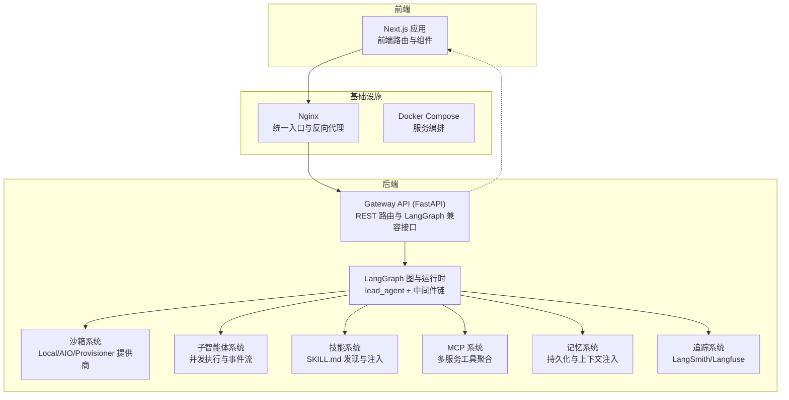
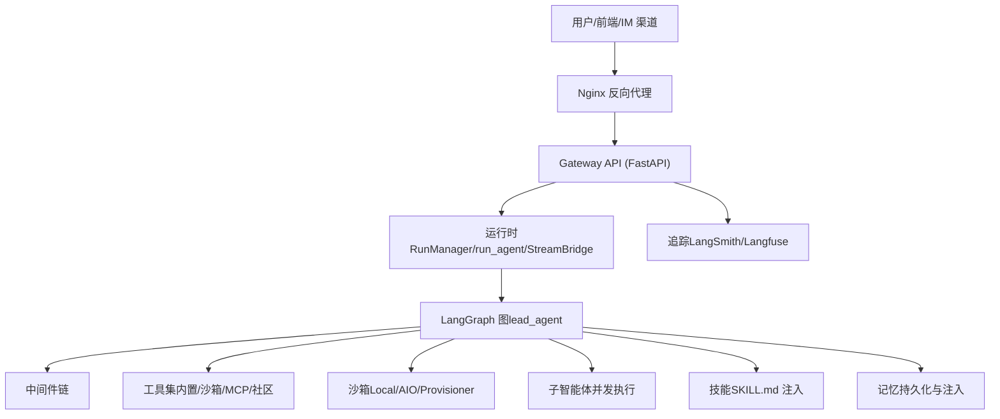
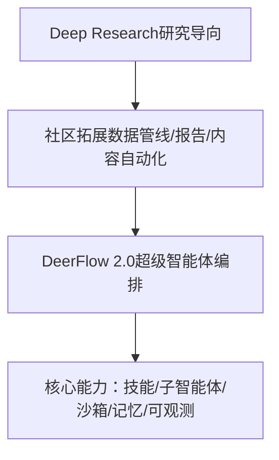
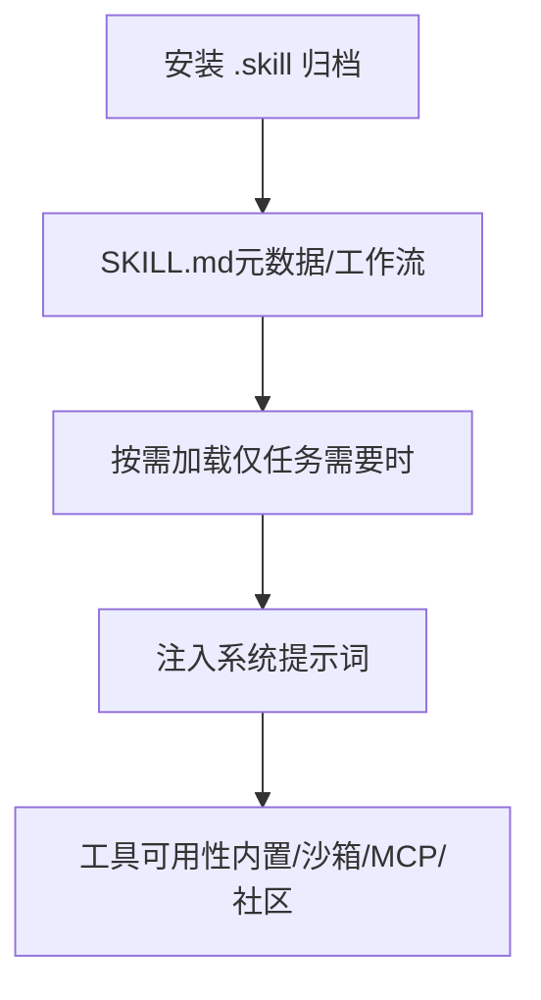
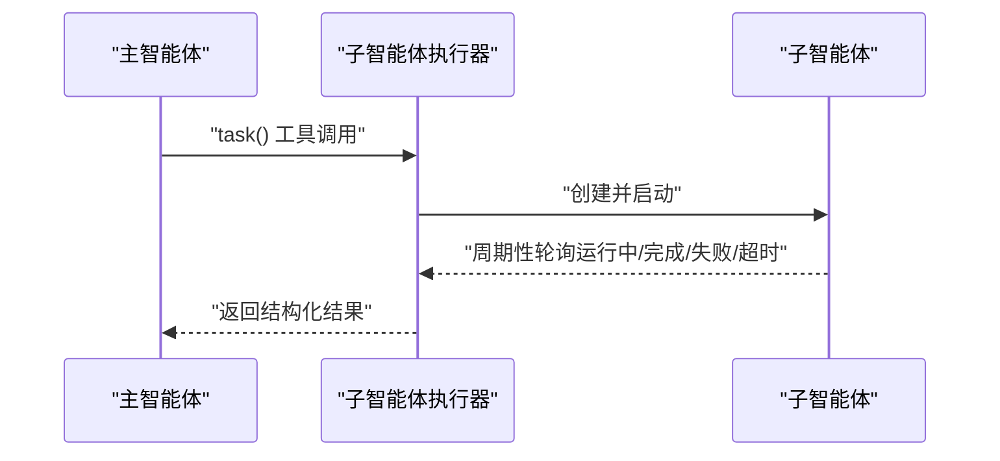
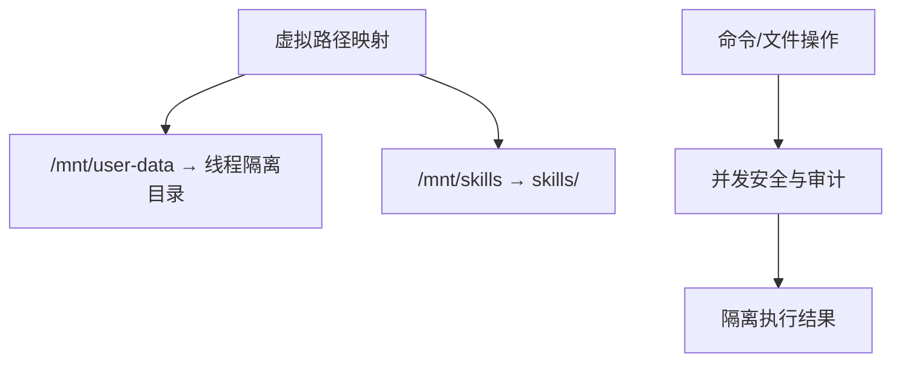
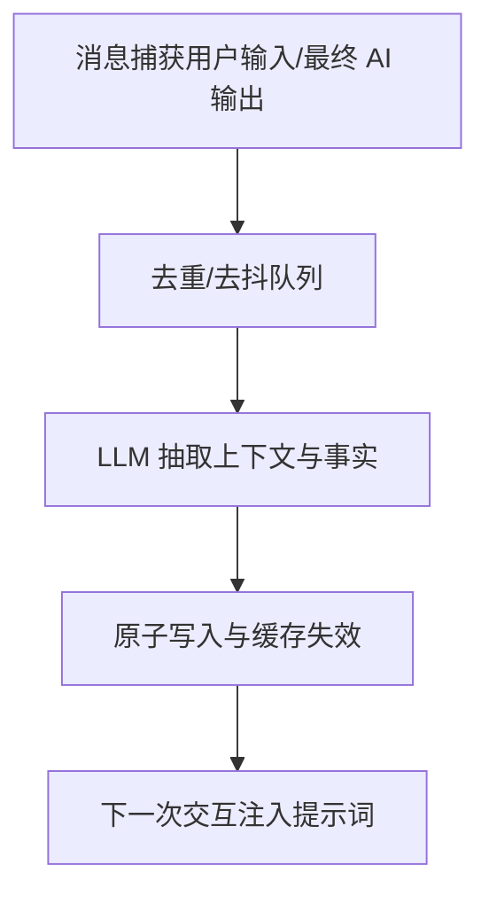
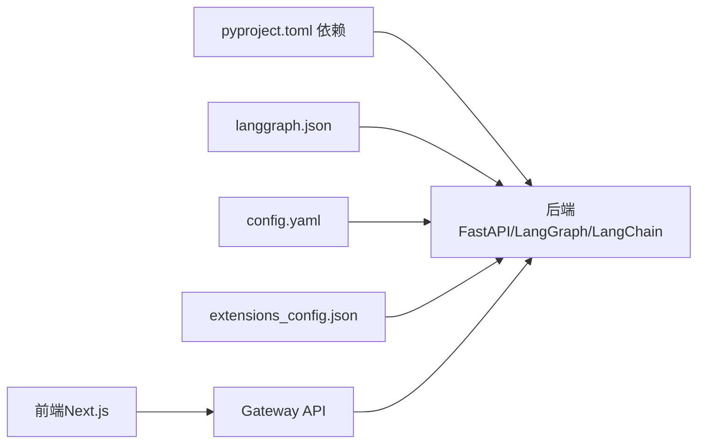

# 项目概述

<cite>
**本文引用的文件**
- [README.md](file://README.md)
- [backend/README.md](file://backend/README.md)
- [frontend/README.md](file://frontend/README.md)
- [docs/README.md](file://docs/README.md)
- [backend/CLAUDE.md](file://backend/CLAUDE.md)
- [backend/pyproject.toml](file://backend/pyproject.toml)
- [backend/langgraph.json](file://backend/langgraph.json)
- [config.example.yaml](file://config.example.yaml)
- [skills/public/deep-research/SKILL.md](file://skills/public/deep-research/SKILL.md)
- [skills/public/bootstrap/SKILL.md](file://skills/public/bootstrap/SKILL.md)
</cite>

## 目录
1. [简介](#简介)
2. [项目结构](#项目结构)
3. [核心组件](#核心组件)
4. [架构总览](#架构总览)
5. [详细组件分析](#详细组件分析)
6. [依赖关系分析](#依赖关系分析)
7. [性能考量](#性能考量)
8. [故障排查指南](#故障排查指南)
9. [结论](#结论)
10. [附录](#附录)

## 简介
DeerFlow 2.0 是一个基于 LangGraph 的“超级智能体编排平台”，旨在通过可扩展的技能系统、子智能体编排、安全沙箱执行与长期记忆管理，实现多智能体高效协作与复杂任务自动化。它从早期的 Deep Research 演进而来，不再只是一个研究工具，而是一个“电池已内置、完全可扩展”的智能体基础设施，面向真实业务场景。

- 价值主张
  - 一体化：开箱即用的工具链、文件系统、记忆与沙箱执行环境
  - 可扩展：技能系统、MCP 协议、自定义工具与子智能体
  - 安全：多层隔离与审计，支持本地/容器/Provisioner 多种沙箱模式
  - 可观测：LangSmith/Langfuse 双向追踪，便于调试与优化
  - 多入口：Web 前端、IM 渠道、嵌入式客户端、CLI 技能

- 技术栈概览
  - 后端：Python/FastAPI + LangGraph + LangChain，容器化运行
  - 前端：Next.js 16 + App Router，现代化 Web 界面
  - 部署：Docker Compose + Nginx 统一反向代理

- 推荐部署方式
  - 开发：make docker-start 或 make dev（热重载）
  - 生产：make up（构建镜像并启动）

**章节来源**
- [README.md:566-577](file://README.md#L566-L577)
- [backend/README.md:1-428](file://backend/README.md#L1-L428)
- [frontend/README.md:1-153](file://frontend/README.md#L1-L153)

## 项目结构
仓库采用“前后端分离 + 后端分层”的组织方式，核心目录如下：
- backend：后端应用与“harness”包（可发布组件库），包含网关 API、中间件、沙箱、子智能体、工具、记忆、MCP、Tracing 等
- frontend：Next.js 前端应用，提供聊天界面与工作区
- skills：内置技能集合（deep-research、bootstrap 等）
- docker：容器化与 Nginx 配置
- docs：文档与运维指南
- deerflow_extensions：零侵入扩展（如 ADS 统一认证、话题守卫等）

**图表来源**
- [backend/README.md:7-36](file://backend/README.md#L7-L36)
- [backend/CLAUDE.md:18-65](file://backend/CLAUDE.md#L18-L65)

**章节来源**
- [docs/README.md:1-140](file://docs/README.md#L1-L140)
- [backend/README.md:207-248](file://backend/README.md#L207-L248)

## 核心组件
- Lead Agent（主智能体）
  - 动态模型选择、思维/视觉支持、中间件链、工具集、子智能体委派、系统提示词注入
- 中间件链（9+ 层）
  - 线程数据隔离、上传注入、沙箱生命周期、摘要、计划任务、标题生成、记忆队列、图像注入、澄清中断等
- 沙箱系统
  - 抽象接口 + 本地/容器提供商；虚拟路径映射；文件读写/命令执行；并发安全
- 子智能体系统
  - 并发上限、超时控制、后台线程池、事件流（开始/运行/完成/失败/超时）
- 记忆系统
  - 自动抽取事实、去重、异步批量更新、按用户隔离、提示词注入
- 工具生态
  - 沙箱工具（bash/ls/read_file/write_file/str_replace）、内置工具（present_files/ask_clarification/view_image/task）、社区工具（Tavily/Jina/Firecrawl/InfoQuest 等）、MCP 工具
- 网关 API（FastAPI）
  - 模型、MCP、技能、记忆、上传、线程、工件、建议、运行、反馈等路由
- IM 渠道桥接
  - Feishu/Slack/Telegram/DingTalk 等，统一通过 Gateway 的 LangGraph 兼容 API

**章节来源**
- [backend/README.md:39-133](file://backend/README.md#L39-L133)
- [backend/CLAUDE.md:175-435](file://backend/CLAUDE.md#L175-L435)

## 架构总览
DeerFlow 的整体架构围绕“网关 + LangGraph 运行时 + 多组件系统”展开。Nginx 将 /api/langgraph/* 重写为 /api/*，统一暴露给前端与 IM 渠道。后端通过 Gateway API 提供 REST 能力，同时在内部嵌入 LangGraph 运行时，使前端与 IM 渠道均能以一致的协议与 Agent 交互。

**图表来源**
- [backend/README.md:7-36](file://backend/README.md#L7-L36)
- [backend/CLAUDE.md:147-174](file://backend/CLAUDE.md#L147-L174)
- [backend/langgraph.json:8-17](file://backend/langgraph.json#L8-L17)

**章节来源**
- [backend/README.md:7-36](file://backend/README.md#L7-L36)
- [backend/CLAUDE.md:147-174](file://backend/CLAUDE.md#L147-L174)

## 详细组件分析

### 从 Deep Research 到 Super Agent Harness 的演进
- 起源：Deep Research 是一个专注于研究的框架，社区将其拓展到数据管线、报告生成、仪表板搭建、内容自动化等多个领域
- 升级：2.0 从零重构，不再“拼装式”框架，而是“超级智能体编排平台”，内置文件系统、记忆、技能、沙箱与子智能体委派能力
- 设计理念：以 LangGraph 为核心，强调“可扩展、可观察、可安全”的多智能体协作

**章节来源**
- [README.md:566-577](file://README.md#L566-L577)

### 技能系统（Skills & Tools）
- 技能（SKILL.md）：结构化工作流定义，包含元数据（版本/作者/兼容性）与最佳实践，按需加载，避免上下文膨胀
- 工具：内置（文件操作、澄清、图片查看、任务委派）、沙箱（bash/ls/read_file/write_file/str_replace）、社区（搜索/抓取/图像）、MCP（多协议）
- 安装：通过 /api/skills/install 安装 .skill 归档；支持 frontmatter 元数据

**图表来源**
- [backend/README.md:580-606](file://backend/README.md#L580-L606)
- [backend/CLAUDE.md:379-386](file://backend/CLAUDE.md#L379-L386)

**章节来源**
- [backend/README.md:580-606](file://backend/README.md#L580-L606)
- [backend/CLAUDE.md:379-386](file://backend/CLAUDE.md#L379-L386)

### 子智能体编排（Sub-Agents）
- 主智能体根据复杂度委派子智能体，每个子智能体拥有独立上下文、工具与终止条件
- 并发执行与事件流：最大并发、超时控制、状态轮询、SSE 事件
- 使用场景：长时任务分解、并行探索、结果汇总

**图表来源**
- [backend/README.md:79-87](file://backend/README.md#L79-L87)
- [backend/CLAUDE.md:336-343](file://backend/CLAUDE.md#L336-L343)

**章节来源**
- [backend/README.md:79-87](file://backend/README.md#L79-L87)
- [backend/CLAUDE.md:336-343](file://backend/CLAUDE.md#L336-L343)

### 沙箱与文件系统（Sandbox & File System）
- 抽象接口：execute_command/read_file/write_file/list_dir
- 提供商：LocalSandboxProvider（本地文件系统）与 AioSandboxProvider（容器/Apple Container/Kubernetes）
- 虚拟路径：/mnt/user-data/{workspace,uploads,outputs} 映射到线程隔离目录；/mnt/skills 映射到 skills 目录
- 安全：str_replace 基于 (sandbox.id, path) 的序列化写入，避免并发冲突；默认禁用主机 bash，除非显式允许

**图表来源**
- [backend/README.md:67-78](file://backend/README.md#L67-L78)
- [backend/CLAUDE.md:315-335](file://backend/CLAUDE.md#L315-L335)

**章节来源**
- [backend/README.md:67-78](file://backend/README.md#L67-L78)
- [backend/CLAUDE.md:315-335](file://backend/CLAUDE.md#L315-L335)

### 上下文工程（Context Engineering）
- 子智能体上下文隔离：避免互相干扰
- 会话内摘要：接近上下文阈值时自动压缩历史
- 工具调用恢复：严格处理中断后的工具调用元数据，保证多轮对话一致性

**章节来源**
- [README.md:662-669](file://README.md#L662-L669)
- [backend/CLAUDE.md:193-215](file://backend/CLAUDE.md#L193-L215)

### 长期记忆（Long-Term Memory）
- 自动抽取：从对话中提取用户画像、偏好与知识
- 结构化存储：用户上下文、历史、带置信度的事实
- 注入策略：在系统提示词中注入 top N 事实与上下文
- 隔离与迁移：按用户隔离，支持迁移脚本

**图表来源**
- [backend/CLAUDE.md:436-474](file://backend/CLAUDE.md#L436-L474)

**章节来源**
- [backend/CLAUDE.md:436-474](file://backend/CLAUDE.md#L436-L474)

### IM 渠道集成（IM Channels）
- 支持 Feishu/Slack/Telegram/DingTalk 等，通过 Gateway 的 LangGraph 兼容 API 与后端交互
- 消息流：入站消息经通道 -> 消息总线 -> 线程创建/路由 -> 运行 -> 出站回复
- 配置：支持凭据引用与 UI 管理

**章节来源**
- [README.md:339-520](file://README.md#L339-L520)
- [backend/CLAUDE.md:402-435](file://backend/CLAUDE.md#L402-L435)

### 嵌入式 Python 客户端（Embedded Python Client）
- DeerFlowClient 提供与 Gateway 对齐的响应格式，支持聊天、流式输出、模型/技能/记忆/上传等管理
- 与 HTTP Gateway 并行路径，共享配置与数据目录

**章节来源**
- [README.md:687-712](file://README.md#L687-L712)
- [backend/CLAUDE.md:518-552](file://backend/CLAUDE.md#L518-L552)

## 依赖关系分析
- 技术栈
  - 后端：FastAPI、LangGraph、LangChain、agent-sandbox、langchain-mcp-adapters、tavily/firecrawl 等
  - 前端：Next.js 16、React 19、Tailwind CSS 4、Shadcn UI、MagicUI、React Bits
- 关键依赖
  - langgraph.json：声明 lead_agent 图与鉴权/检查点提供器
  - pyproject.toml：后端依赖与可选数据库驱动
- 配置与扩展
  - config.yaml：模型、工具、沙箱、子智能体、记忆、标题、摘要等
  - extensions_config.json：MCP 服务器与技能状态

**图表来源**
- [backend/pyproject.toml:1-58](file://backend/pyproject.toml#L1-L58)
- [backend/langgraph.json:1-18](file://backend/langgraph.json#L1-L18)
- [config.example.yaml:1-120](file://config.example.yaml#L1-L120)

**章节来源**
- [backend/pyproject.toml:1-58](file://backend/pyproject.toml#L1-L58)
- [backend/langgraph.json:1-18](file://backend/langgraph.json#L1-L18)
- [config.example.yaml:1-120](file://config.example.yaml#L1-L120)

## 性能考量
- 上下文控制
  - 在接近令牌上限时进行摘要，减少历史长度
  - 工具输出预算保护：超限时落盘并提供预览，避免模型上下文爆炸
- 并发与资源
  - 子智能体并发上限与超时控制，防止资源耗尽
  - 沙箱容器/Provisioner 模式下的资源配额与回收
- I/O 阻塞治理
  - 后端对阻塞 IO 的静态扫描与运行时门禁，避免事件循环阻塞
- 模型与推理
  - 支持思维/视觉/推理能力的模型配置，合理选择模型与参数以平衡质量与成本

**章节来源**
- [backend/CLAUDE.md:100-141](file://backend/CLAUDE.md#L100-L141)
- [config.example.yaml:544-597](file://config.example.yaml#L544-L597)
- [config.example.yaml:732-782](file://config.example.yaml#L732-L782)

## 故障排查指南
- 常见问题
  - Docker 权限不足：Linux 下将用户加入 docker 组并重新登录
  - 跨域与认证：split-origin 场景需设置 GATEWAY_CORS_ORIGINS，并启用 CSRF 校验
  - 模型配置错误：缺失 provider 依赖时会返回可操作的安装指引
  - 阻塞 IO：使用 make detect-blocking-io 与 Blockbuster 门禁定位问题
- 运维与部署
  - 使用 make docker-start / make up 快速启动/生产部署
  - IM 渠道在 Docker Compose 中运行于 gateway 容器内，注意使用容器服务名而非 localhost

**章节来源**
- [README.md:236-250](file://README.md#L236-L250)
- [backend/CLAUDE.md:100-141](file://backend/CLAUDE.md#L100-L141)
- [docs/README.md:78-87](file://docs/README.md#L78-L87)

## 结论
DeerFlow 2.0 以 LangGraph 为核心，构建了“可扩展、可安全、可观察”的智能体编排平台。通过技能系统、子智能体编排、沙箱执行与长期记忆，它能够胜任从研究到内容生成、从数据处理到多轮协作的复杂任务。对于初学者，推荐从 make docker-start 快速体验；对于资深开发者，可通过 config.yaml 与 extensions_config.json 深度定制，并结合 LangSmith/Langfuse 进行可观测性增强。

## 附录

### 技能示例与最佳实践
- Deep Research 技能：系统化多角度研究方法，先检索再生成，避免浅层信息
- Bootstrap 技能：通过 5–8 轮对话生成个性化 SOUL.md，定义 AI 的身份与行为

**章节来源**
- [skills/public/deep-research/SKILL.md:1-199](file://skills/public/deep-research/SKILL.md#L1-L199)
- [skills/public/bootstrap/SKILL.md:1-95](file://skills/public/bootstrap/SKILL.md#L1-L95)